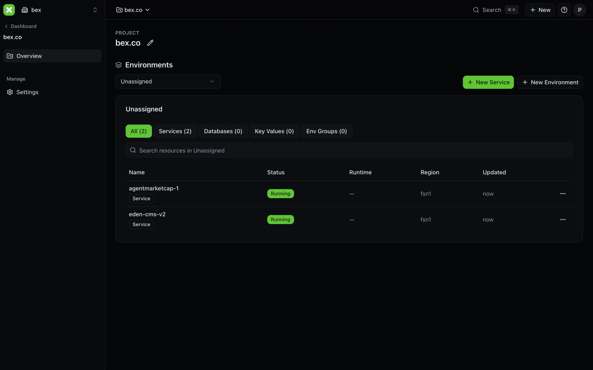
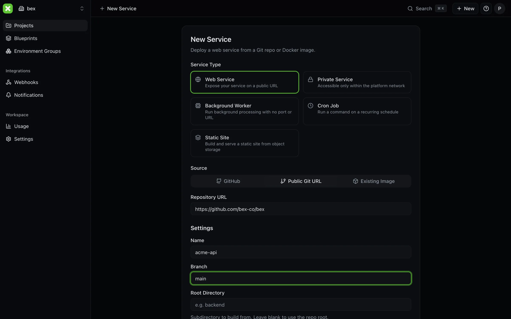
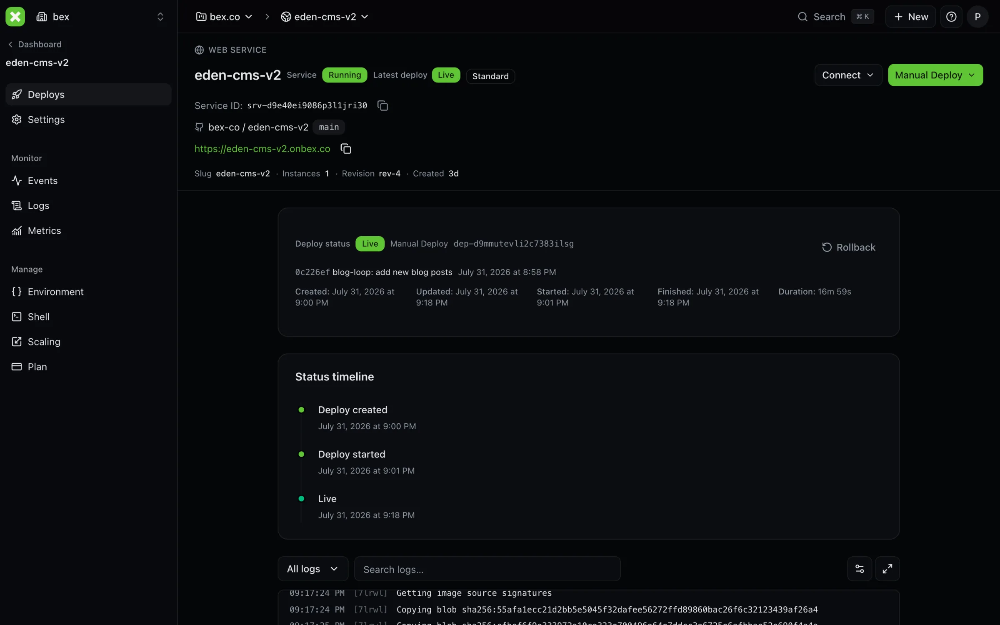
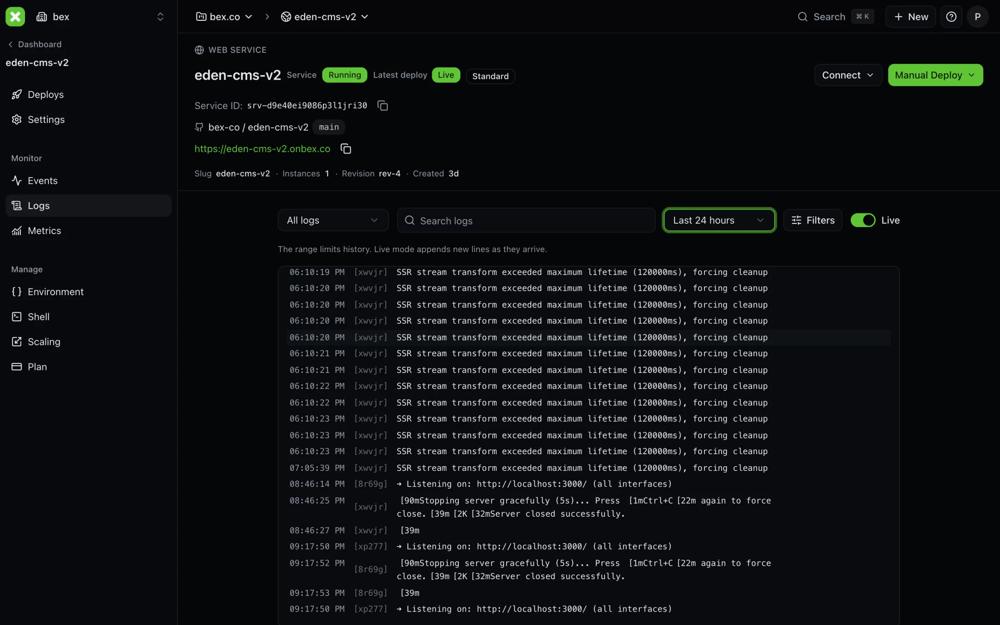
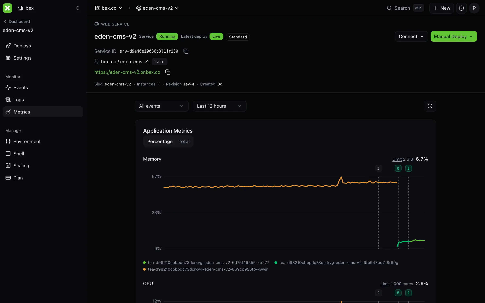
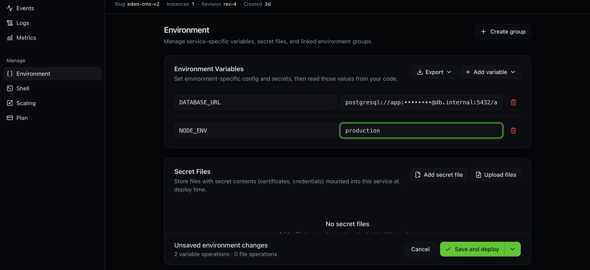
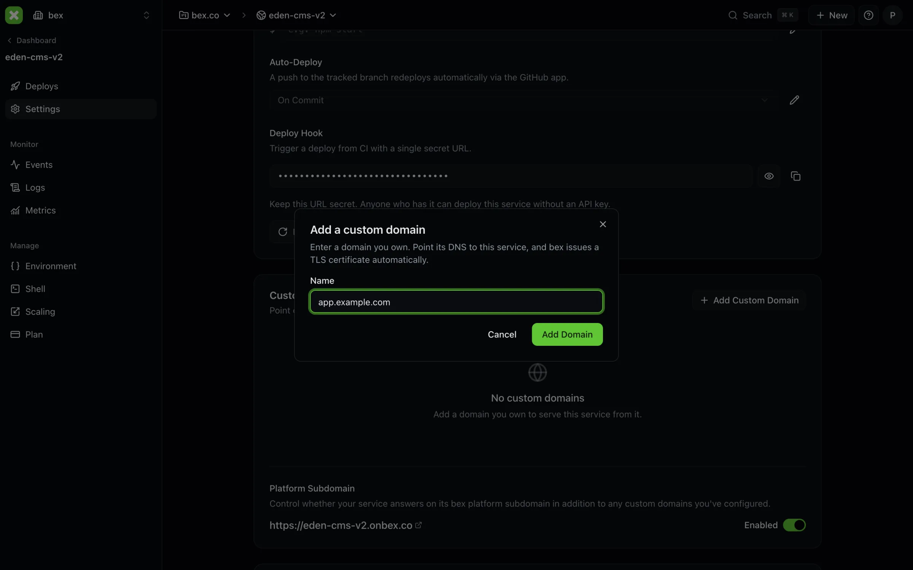
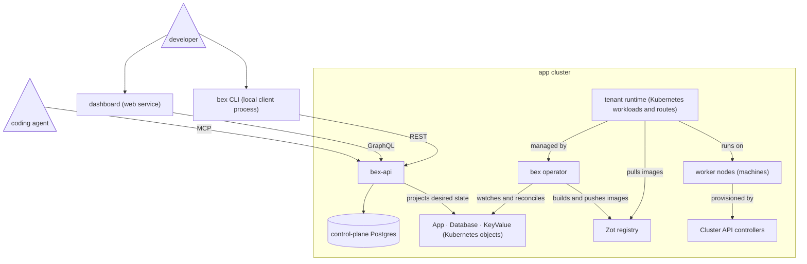

<p align="center">
  
</p>

<h1 align="center">bex</h1>

<p align="center">
  <strong>The open-source, AI-native alternative to Render.</strong>
</p>

<p align="center">
  Deploy from Git to HTTPS on infrastructure you own—and give developers and coding agents the same first-class control plane.
</p>

<p align="center">
  <a href="https://github.com/bex-co/bex/stargazers"></a>
  <a href="LICENSE"></a>
  <a href="https://github.com/bex-co/bex/actions/workflows/deploy.yml"></a>
  <a href="https://github.com/bex-co/bex/actions/workflows/docs.yml"></a>
</p>

<p align="center">
  <a href="#quickstart">Quickstart</a> ·
  <a href="#what-ships-today">Features</a> ·
  <a href="#see-bex-in-action">Screenshots</a> ·
  <a href="docs/ADR002-architecture.md">Architecture</a> ·
  <a href="docs/ADR018-render-parity.md">Render parity</a> ·
  <a href="CONTRIBUTING.md">Contributing</a>
</p>

<p align="center">
  <a href="docs/assets/workspace-overview.webp"></a>
</p>

> [!WARNING]
>
> **bex is in active development and is not ready for production workloads.** APIs and configuration can change. The core platform works and is continuously tested; use it today to explore, contribute, and help shape the project.

## Why bex

Render, Heroku, and Railway proved the experience developers want: connect a repo, get a URL, and avoid operating Kubernetes by hand. bex makes that experience open source, self-hostable, and programmable by agents.

- **A familiar PaaS workflow.** Deploy Dockerfiles or native Go, Node.js, Python, Ruby, Rust, and Elixir projects from Git. Use Render-style `render.yaml` Blueprints and a Render-compatible CLI and API.
- **One control plane for humans and agents.** The dashboard, REST, GraphQL, MCP, CLI, and Kubernetes resources operate the same core. There are no dashboard-only deployment actions.
- **More than a container launcher.** Web services, private services, workers, cron jobs, static sites, managed Postgres, managed Key Value, logs, metrics, deploy history, rollbacks, domains, TLS, and SSH are already represented.
- **Your infrastructure and your data.** Run the same Go operator against Docker-container machines locally or Hetzner machines in production-shaped clusters. The provider overlay changes; the product does not.
- **Inspectable by design.** The platform is Apache-2.0, its intent is declarative, and its compatibility claims are tracked in an evidence-backed [Render parity ledger](docs/ADR018-render-parity.md).

## From repo to URL

Declare a service with the same `render.yaml` shape many developers and tools already understand:

```yaml
services:
  - name: api
    type: web
    runtime: docker
    repo: https://github.com/your-org/your-app
    branch: main
    plan: free
    healthCheckPath: /health

databases:
  - name: app-db
    plan: free
```

The Blueprint API compiles that intent into `App` and `Database` resources. The operator builds the source, rolls out the workloads, configures routing and TLS, and reports structured status back through every interface. An agent can perform the same deployment with the MCP `deploy` tool—repo plus manifest in one call.

See the [hello-world examples](examples/) or the full [deployment contract](docs/ADR004-app-deployment.md).

## What ships today

| Area | Capabilities |
| --- | --- |
| **Services** | Web and private services, background workers, cron jobs, static sites, Dockerfiles, native builds, health checks, pre-deploy commands, manual and policy-driven autoscaling |
| **Data** | Managed PostgreSQL with backups/PITR, HA and read replicas; managed Valkey-compatible Key Value with persistence and backups |
| **Operations** | Deploy history, cancel and rollback, logs and live tail, metrics, events, suspend/resume/restart, custom domains and TLS, native SSH and browser shell |
| **Delivery** | GitHub App integration, private repositories, push-to-deploy, multi-resource Blueprints, registry credentials, outbound webhooks |
| **Teams** | Workspaces, projects and environments, roles with OpenFGA, OAuth 2.1, API keys, audit logs, usage metering and billing integration |
| **Agents** | Remote and stdio MCP, OAuth consent, deploy-from-chat, managed sandboxes, cloud coding-agent sessions, structured machine-readable state |

Some capabilities require optional backing services or explicit configuration and fail closed when unavailable. For the exact REST · GraphQL · MCP · UI status of every capability, use the [parity ledger](docs/ADR018-render-parity.md)—not this summary—as the source of truth.

## See bex in action

<table>
  <tr>
    <td width="50%">
      <strong>Deploy from Git or an image</strong><br><br>
      <a href="docs/assets/new-web-service.webp"></a>
    </td>
    <td width="50%">
      <strong>Follow every deploy</strong><br><br>
      <a href="docs/assets/deploy-detail.webp"></a>
    </td>
  </tr>
  <tr>
    <td width="50%">
      <strong>Tail and filter live logs</strong><br><br>
      <a href="docs/assets/live-logs.webp"></a>
    </td>
    <td width="50%">
      <strong>Correlate metrics with deploys</strong><br><br>
      <a href="docs/assets/service-metrics.webp"></a>
    </td>
  </tr>
  <tr>
    <td width="50%">
      <strong>Manage environment and secrets</strong><br><br>
      <a href="docs/assets/environment-secrets.webp"></a>
    </td>
    <td width="50%">
      <strong>Bring a domain; get TLS</strong><br><br>
      <a href="docs/assets/custom-domain.webp"></a>
    </td>
  </tr>
</table>

## Quickstart

This boots the production-shaped local substrate: a kind management cluster, Cluster API, and an app cluster whose machines are Docker containers.

**Prerequisites:** Docker or OrbStack, Go 1.25+, `kubectl`, `kind`, and `clusterctl`.

In terminal 1:

```bash
git clone https://github.com/bex-co/bex.git
cd bex

# Provision the local Cluster API substrate.
bash scripts/mock-cluster.sh
export KUBECONFIG="$PWD/infra/local/bex.kubeconfig"

# Install the CRDs and run the operator from source.
cd lego/operator
make install
BEX_RUNTIME=kubernetes make run
```

In terminal 2:

```bash
cd bex
export KUBECONFIG="$PWD/infra/local/bex.kubeconfig"

# Deploy a prebuilt image and watch it converge.
kubectl apply -f examples/whoami-app.yaml
kubectl get apps.app.bex.co -w
```

An `App` reports the state an operator or agent needs without scraping logs:

```text
NAME      PHASE     REVISION   URL
whoami    Running   rev-1      http://whoami.default.svc:8080
```

Then add a tenant machine and scale the workload across it:

```bash
bash scripts/mock-cluster.sh scale 2
kubectl patch apps.app.bex.co whoami --type merge -p '{"spec":{"replicas":6}}'
kubectl get pods -l app.bex.co/app=whoami -o wide
```

The first bootstrap downloads the Kubernetes and Cluster API dependencies and can take several minutes. For a full platform deployment, start with [infra/README.md](infra/README.md); for the Go workspace and development commands, see [lego/README.md](lego/README.md).

## Use the interface that fits

| Interface | Best for |
| --- | --- |
| **Dashboard** | Human-friendly service, data, environment, team, usage, and security workflows |
| **`bex` CLI** | Interactive operations and scripts using the upstream Render CLI command implementation ([install and compatibility notes](docs/bex-cli.md)) |
| **REST + GraphQL** | Product integrations and custom control-plane clients |
| **MCP** | Claude Code, Cursor, and other agents over OAuth 2.1 or a headless API key ([connect an agent](docs/ADR025-connect-an-agent.md)) |
| **Kubernetes CRDs** | GitOps, low-level debugging, and direct operator development |

All product adapters are thin layers over the same Go core, so authorization, lifecycle behavior, and resource identity do not drift by interface.

## How it works



Arrows point from a consumer to what it depends on. `bex-api` owns durable product intent; the database-free operator turns projected Kubernetes objects into workloads; Cluster API provisions the machines beneath them; and `operator → types ← backend` remains the one-way code dependency described in the [architecture panorama](docs/ADR002-architecture.md).

<details>
<summary><strong>Repository map</strong></summary>

```text
lego/
  types/       App, Database, and KeyValue CRD contracts
  operator/    Kubernetes manager: reconcile, build, runtime, config
  backend/     bex-api and the isolated SSH gateway
dashboard/     TanStack Start + Apollo + shadcn web application
mobile/        Expo client for safe supervision workflows
infra/         Terraform + Cluster API: local CAPD and Hetzner CAPH
deploy/gitops/ Argo CD platform infrastructure
examples/      Image, Git, static, cron, and multi-resource samples
docs/          Architecture decisions, contracts, runbooks, and evidence
scripts/       Local-cluster, deployment, security, and verification tools
```

</details>

## Project status

bex is a working public alpha with a live, production-shaped architecture and broad Render compatibility. It is also a large surface area under rapid development. The project makes that tradeoff explicit:

- [Vision and product thesis](docs/ADR008-vision.md)
- [Evidence-backed Render parity and known gaps](docs/ADR018-render-parity.md)
- [Architecture and trust boundaries](docs/ADR002-architecture.md)
- [CLI compatibility checklist](docs/cli-compatibility-checklist.md)
- [Contributing guide](CONTRIBUTING.md)

## Help build the open cloud

If you want a PaaS that agents can operate and developers can own, [star the repository](https://github.com/bex-co/bex), try the local cluster, and tell us where the experience breaks. Issues and pull requests are welcome; agent-authored contributions are welcome when the author has reviewed the diff and the tests pass.

Apache-2.0 licensed. See [CONTRIBUTING.md](CONTRIBUTING.md) and the [Code of Conduct](CODE_OF_CONDUCT.md).
