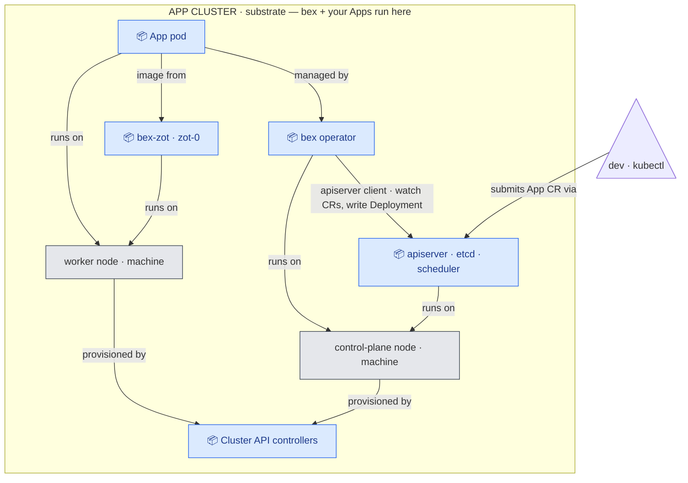
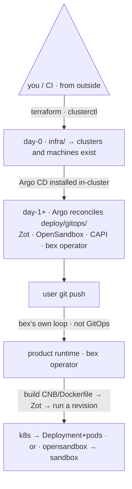

# bex architecture

bex is the **deploy-from-git half** of bex.co (strategy 211.09): a Git repo becomes a running, addressable service, bin-packed across machines, with idle services hibernated ("sleep = free") and woken on request. This doc is the map.

## Panorama



**Every arrow is a dependency: `A → B` means _A depends on B_** (it points to what A needs). **Blue 📦 = Pod · gray = machine (k8s node).**

- An **App pod** depends on the **operator** (which manages it), **`bex-zot`** (pulls its image), and the **worker node** (runs on it).
- The **operator** depends on the **apiserver** — it's a **client** of it: it watches `App` CRs and writes Deployments; it **never talks to pods directly**. (Plus the node it runs on.)
- Both **machines** depend on **Cluster API** — it provisions them.

Note the direction: "operator _creates_ pod" becomes **`pod → operator`**, and "CAPI _provisions_ machine" becomes **`machine → CAPI`** — in a dependency graph the created/managed thing points at what it depends on, i.e. the arrow is the reverse of the "who-makes-what" flow. The outer box = the **cluster**; a _machine_ is a server (Hetzner) or Docker container (local). Swap `CAPD`→`CAPH` and the picture is identical. (For a request/response view of a deploy, see the request-flow diagram in [`ADR003-control-plane.md`](ADR003-control-plane.md).)

- **One self-managed cluster** (since the w1/m19.1 pivot). The app cluster runs the bex operator, your Apps, **and Cluster API itself** — after `clusterctl move`, the CAPI controllers run as pods on the control-plane nodes and the cluster reconciles its own machines. A disposable **bootstrap cluster** (`bex-bootstrap`, single-node k3s from Terraform) exists only during initial bring-up or disaster recovery: it births the app cluster, hands CAPI over, and is destroyed (definition retained). `BEX OPERATOR`, Cluster API and `bex-zot` are **pods / containers** — no extra machines. On Hetzner the machines are the cluster **nodes**; swap `CAPD`→`CAPH` and the picture is identical. (Locally, the kind cluster stays as a persistent management cluster — the mock never pivots.)
- **machines = nodes** of the app cluster — Docker containers under CAPD locally, Hetzner servers under CAPH. **Add/remove a machine** = scale the worker pool; the operator bin-packs pods onto the nodes.

## Two layers: `bex` and `bex-infra`

The single most important boundary:

|  | **bex** (control plane + operator) | **bex-infra** (provisioning) |
| --- | --- | --- |
| owns | placement, lifecycle, build→deploy→serve, the **auto-allocator** _(planned)_ | clusters + machines |
| node awareness | **reads** `Node`/`Pod` (capacity, utilization); decides placement/eviction | **creates/joins/deletes** nodes |
| provisioning | ❌ never SSHes / runs cloud APIs | ✅ Terraform, Cluster API, autoscaler |
| code | Go workspace (`lego/`) | declarative (`infra/`) |
| how it scales machines | **indirectly**: bin-pack + idle-evict → pending pods / empty nodes | Cluster Autoscaler / CAPI react |

bex is **node-aware but provision-unaware**: it never adds a machine itself; it packs pods tightly and evicts idle ones, and the autoscaler/CAPI translate that into machines added/removed.

**Names map to layers consistently** (layer · directory · runtime entity):

| layer | directory | runtime entity |
| --- | --- | --- |
| **bex** | `lego/` (types + operator + backend) | the **BEX OPERATOR** — a **pod in the app cluster** (deploys Apps) |
| **bex-infra** | `infra/` | the **CAPI controllers** — pods **in the app cluster** (self-managed since m19.1); plus the disposable bootstrap k3s node during bring-up/DR |
| _(substrate)_ | — | the **APP CLUSTER** — runs the bex operator, your Apps, and its own machine engine |

The layer boundary survives the pivot unchanged: bex still never provisions, bex-infra (as a layer) still owns machines — the two layers simply now share one cluster's nodes, on opposite sides of the CP taint. The operator runs **in-cluster** (a `Deployment` in `bex-system`), never on a laptop; `make run` from source is only a dev inner-loop.

### Control plane (source of truth) vs. operator (mechanism)

The `bex` layer itself splits in two — keep them distinct (full design: [`ADR003-control-plane.md`](ADR003-control-plane.md)):

- **operator** _(today)_ — a k8s controller that reconciles `App` CRs into `Deployment`/`Service`/`Ingress` (+TLS). **No database**; idempotent; mechanical.
- **control plane** _(built, opt-in — not yet the prod default)_ — a **Postgres-backed** service holding the product's **source of truth** (tenants / apps / domains / plans + business logic), living inside bex-api (`lego/backend/internal/store/`, enabled by `BEX_CP_DB_URI`). It projects rows into `App` CRs; the operator executes them.

Business/product logic belongs in the **control plane**; the operator stays a thin, CR-driven reconciler. The **`App` CR is the contract** between them.

**Data layering.** Postgres is the **durable truth**; Kubernetes/**etcd is a rebuildable projection** of it — lose the cluster, re-project from Postgres. Until the control plane is switched on in prod, `App` CRs are applied directly and etcd is the effective store, so it is still snapshotted off-node ([ADR011-etcd-backup-restore.md](ADR011-etcd-backup-restore.md)). The production cluster now runs a three-member stacked-etcd quorum across its three control-plane machines; one member can fail without losing API availability or the effective store.

## `infra/` vs `deploy/` (both hold YAML — different jobs)

- **`infra/`** = day-0, run **from outside** (terraform / clusterctl) to make the cluster + nodes _exist_.
- **`deploy/`** = day-1+, **Argo reconciles into** an existing cluster (Zot, OpenSandbox controller, bex itself, Cluster API controllers, autoscaler).
- Nuance: the Cluster API/autoscaler **controllers** are deployed (`deploy/`), but the **desired node pools** they consume (`Cluster`/`MachineDeployment`) are declared in `infra/`. Engine = deploy, desired-infra = infra.
- A third thing is **neither**: bex deploying a _user's_ repo into a sandbox — that's the **product runtime**, not GitOps and not infra.



## Local CAPD mock → Hetzner CAPH (the portability bet)

bex is identical locally and in prod; only the **infrastructure provider overlay** changes. So you develop the whole add/remove-machine + bin-pack + scale-down loop locally, in Docker, then swap the provider for Hetzner.

|  | local (mock) | Hetzner (prod) |
| --- | --- | --- |
| provider | **CAPD** (Docker) | **CAPH** (Hetzner cloud + bare-metal) |
| "machine" | Docker-container node | Hetzner server |
| infra cluster | `kind` (`infra/local`) | `infra/terraform` |
| node-pool overlay | `infra/clusterapi/overlays/local-capd` | `…/hetzner-caph` |
| microVMs (Kata/FC) | not available | bare-metal (Robot) |

## The production substrate (Hetzner)

The shape the 2026-07 rebuild established (w1/m19 + m19.1). Everything below is declared in [`infra/clusterapi/overlays/hetzner-caph/cluster.yaml`](../infra/clusterapi/overlays/hetzner-caph/cluster.yaml) and reconciled by the cluster itself.

**Node pools** — three roles, hard-separated by taints:

| pool | taint / label | runs | size |
| --- | --- | --- | --- |
| control plane | `node-role.kubernetes.io/control-plane` | Kubernetes itself + mgmt-plane exemptions (CCM, cilium-operator, etcd-backup, CAPI controllers) | target **3** (etcd quorum + safe rolls) |
| `bex-platform` | `bex.co/platform` taint, `bex.co/pool: platform` label | the platform stack: Traefik, Ory, OpenBao, CNPG, observability, Argo, bex itself | min 2 |
| tenant (`bex-tenant-0`) | untainted | **user Apps only** — tenant code never shares a kernel with platform credentials ([ADR022-tenant-isolation.md](ADR022-tenant-isolation.md)) | min 1, autoscaler-elastic |

**Network** — CAPH owns network `bex` (`10.10.0.0/16`); every machine is attached at creation, so there is zero out-of-band network state. kubeadm advertises each machine's **private IP** (a placeholder `advertiseAddress` rewritten by `preKubeadmCommands` — the accepted CABPK pattern, since kubeadm has no per-machine templating): the `kubernetes` Service endpoint, etcd peer traffic, and apiserver→kubelet all ride the private net. Both LBs target nodes by private IP; Cilium WireGuard encrypts east-west (`devices` pinned to the private NIC — auto-detection needs node IPs the CCM hasn't set yet at bring-up).

**Public surface** — a label-selector Hetzner firewall (auto-inherited by new machines): nodes expose only `:22` (key-only SSH) + ICMP; the edge LB fronts expose 22/80/443 (Traefik, including the SSH gateway), 5432 (PostgreSQL), and 6379 (Valkey), while the kube-api LB exposes 443 (TLS/RBAC). Ports-only — never source-IP allowlists (see DO_NOT_DO).

### Stable production edge Load Balancer

The public-IP-bearing `bex-traefik` Hetzner Load Balancer belongs wholly to Terraform, not to the app cluster. Terraform fixes its name, location, type, CAPH-network attachment, autoscaling-safe worker label selector, and all five TCP listeners; it enables both Hetzner API `delete_protection` and Terraform `prevent_destroy`. The Kubernetes edge Services are fixed `NodePort` Services with `externalTrafficPolicy: Local`. They never carry hcloud LoadBalancer annotations and therefore cannot adopt or mutate the shared object.

This single-owner boundary replaced an unsafe split discovered on 2026-07-16. Three Kubernetes `LoadBalancer` Services named the same Hetzner object; each hcloud CCM reconciliation treated its own Service ports as the complete desired listener set. Whichever Service reconciled last could leave only HTTP, PostgreSQL, or Valkey online. Delete protection preserved the IP-bearing object but could not preserve listeners. Terraform now owns the complete projection, so a Kubernetes reconciliation has no authority over any sibling listener.

The listener map is deliberately explicit and regression-tested: public `22 → 32207`, `80 → 31218`, `443 → 31976`, `5432 → 31056`, and `6379 → 31892`. Every listener has a TCP health check on its destination NodePort. `Local` traffic policy both preserves the original client IP for database/key-value allowlists and makes the health check admit only workers with a local endpoint. Traefik's two replicas and the platform proxy DaemonSets therefore create the correct per-listener target subset from one broad CAPH worker selector.

#### Existing-production adoption and rebuild proof

Adoption is an in-place state operation, not a traffic cutover:

1. The workflow discovers the sole CAPH-managed Hetzner network named `bex`. Before that network exists, `app_network_id = 0` deliberately manages only the durable LB; later runs attach the projection without coupling day-0 Terraform to CAPH creation order.
2. On a main-branch run, the workflow queries the exact `bex-traefik` name and imports the sole existing LB, network attachment, worker selector, and listeners that are not already in remote state. No match follows the normal create path; multiple matches fail closed.
3. Terraform creates the autoscaling-safe worker label-selector target before the workflow removes legacy per-server targets left by the former CCM owner. That order keeps an eligible target set throughout adoption.
4. Review the apply: the LB ID, IPv4, IPv6, type, location, private IP, and five listener mappings must remain unchanged. Confirm delete protection, all listener health checks, and successful HTTP/SSH/database/key-value probes.
5. During a rebuild, CAPH recreates network `bex` and its labeled workers; the next infrastructure apply reattaches the protected LB and the NodePort health checks discover ready endpoints. Do not add a Kubernetes `LoadBalancer` Service for this edge.
6. A destroy remains an explicit two-key operation: first remove Terraform `prevent_destroy` in reviewed code, then disable the Hetzner API protection.

If convergence stalls, stop and repair the missing Terraform projection or NodePort Service; do not delete or recreate the Hetzner object. Terraform state removal (`terraform state rm`) is reserved for relinquishing ownership and does not delete the LB.

**Target realized** — the quota-gated m19 residue landed on 2026-07-15: 3 control-plane + 3 platform + ≥1 autoscaled tenant machine. KCP is a healthy 3/3 quorum, OpenBao is 3/3 unsealed on distinct platform nodes, and the four platform CNPG clusters are 2/2 Ready. [`scripts/verify-substrate.sh`](../scripts/verify-substrate.sh) continuously re-checks the target shape, placement, data, scheduler, CSR, network, autoscaler, and no-bootstrap invariants; [`scripts/verify-elastic.sh`](../scripts/verify-elastic.sh) proves tenant scale-up, MostAllocated packing, and scale-down.

**The change rule** (the rebuild's lesson): the substrate accepts changes **only via declaration** — git → CI → controller. When the declaration layer refuses (immutable fields, webhook validation), the answer is to rebuild the correct declaration, never to bypass it and mutate reality out-of-band; one out-of-band "fix" is how the previous cluster ended up unmanageable-but-unfixable. Full diagnosis and execution trail: `.pm/w1/done/m19/` (op log) and the git history of `docs/rearchitecture.md`.

## Build → deploy → serve (the product)

1. **build** — clone repo @ ref → Dockerfile (BuildKit) or Cloud Native Buildpacks (`pack`) → OCI image → push to **Zot** (`lego/operator/internal/build`).
2. **deploy** — run the image as a revision on **OpenSandbox** (Docker runtime, or k8s runtime → a pod) (`lego/operator/internal/runtime`); health-gate; record `App` status (`internal/controller`).
3. **serve** — reach the revision via the runtime endpoint (future: a stable `*-<id>.bex.co` URL via the gateway).
4. **sleep = free** — idle → OpenSandbox `pause`; request → `resume` (the gateway activator). At the machine level, idle-evict frees nodes → autoscaler scales down.

## Repo map

```
lego/            ALL Go — workspace of three modules (one image, two binaries; lego/README.md):
  types/           the App/Database CRD contract (app.bex.co/v1alpha1); leaf
  operator/        mechanism: cmd/manager · internal/{build,runtime,controller} · config/ (+ planned gateway/allocator)
  backend/         bex-api: cmd/api · internal/{apps,logs,metrics,apikeys,postgres,secrets,store,…} — REST/GraphQL/MCP + the opt-in control plane (docs/ADR003-control-plane.md)
dashboard/       Render-style human UI (TanStack Start + Ory Kratos, docs/ADR012-auth.md §5): deploy/ is its own GitOps-deployed kustomize base, at dashboard.<base-domain>
infra/           bex-infra: terraform/ clusterapi/{base,overlays/{local-capd,hetzner-caph}} local/
deploy/          GitOps: gitops/{bootstrap,base,overlays/{local,staging,prod},charts,authz} + opensandbox/ server configs
examples/        sample user apps (whoami-app.yaml, hello-go/)
docs/            one file per topic — see the index in CLAUDE.md
scripts/         mock-cluster.sh, app-apply.sh, deploy-sample.sh, auth/bao helpers, up.sh + start-opensandbox*.sh (legacy)
```

## What's genuinely ours vs assembled

Ours (Go): the operator, bex-api + the control-plane store, the deploy-from-git orchestration, and — planned — the auto-allocator (bin-pack + idle-evict), the gateway (edge + webhook + activator), E2B/ACP translation. Assembled: Kubernetes, Cluster API/CAPD/CAPH, Cluster Autoscaler, OpenSandbox, Zot, Cloud Native Buildpacks. bex is the glue + the economics, not the substrate.
