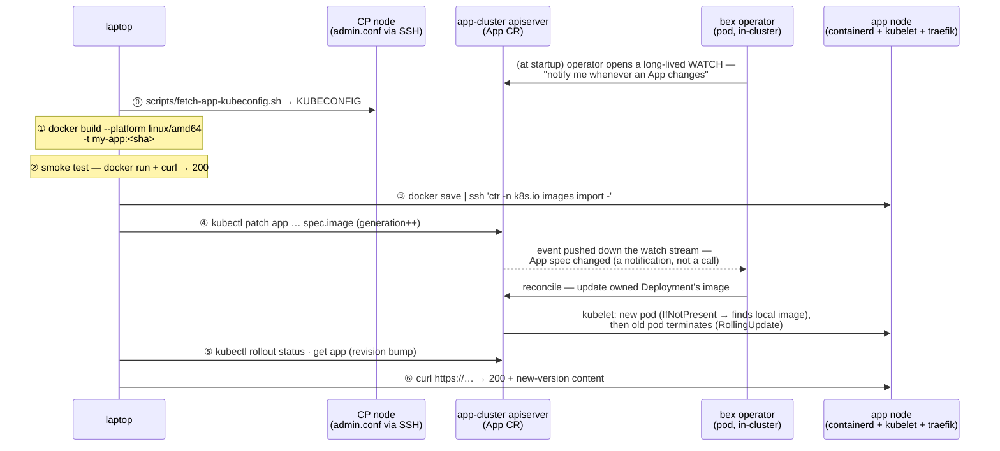

# Deploying / replacing an App (Hetzner, prebuilt-image path)

> **Status: the manual runbook for the prebuilt-image path.** The **`App` CR is the only interface**: you never touch the Deployment; the operator rewrites it. This laptop-build-and-import runbook is for pushing a **prebuilt image** by hand (`spec.image`).
>
> **Build-from-git is in-cluster.** Render-native runtimes (`spec.runtime` plus build/start commands) and Dockerfile builds run as BuildKit Jobs confined by Pod user namespaces; the explicit bex `spec.builder: buildpack` extension runs as a kpack Image. The pipeline pushes release-generation-tagged images to Zot and pins the resolved digest — no docker daemon, laptop build, or `ctr` import. A signed git push redeploys them ([ADR017-deploy-from-chat.md](ADR017-deploy-from-chat.md), gated on `spec.autoDeploy`). See **[In-cluster builds](#in-cluster-builds-buildkit-kpack--zot)** below.
>
> Build concurrency, queueing, and Pod-versus-machine scaling are decided in [ADR034](ADR034-scalable-build-pipeline.md).

The examples below use a placeholder App `my-app` (container port 3000); substitute your App's name, port, and host. Three places are involved — keep them straight:

| place | role in a deploy |
| --- | --- |
| **laptop** | builds the image, smoke-tests it, runs `kubectl`/`ssh` |
| **a CP node** (via hcloud API + SSH) | serves `/etc/kubernetes/admin.conf` — `scripts/fetch-app-kubeconfig.sh`, touched once, for access (self-managed since w1/m19.1; no mgmt cluster) |
| **app cluster** | containerd stores the image; apiserver holds the `App` CR; the **operator** turns the CR change into a rollout |

## The whole deploy in one picture



## Steps

### ⓪ Get the app-cluster kubeconfig — _laptop → infra cluster_

Cluster API stores the workload ("app") cluster's kubeconfig as a secret on the management ("infra") cluster:

```sh
ssh -i <ssh-key> root@<infra-ip> \
  'kubectl -n default get secret bex-kubeconfig -o jsonpath="{.data.value}" | base64 -d' \
  > bex-app.kubeconfig
export KUBECONFIG=$PWD/bex-app.kubeconfig
kubectl get app my-app -o yaml   # current image / port / host — your baseline
```

### ① Build amd64 with a **fresh** tag — _laptop_

```sh
cd <project>
docker build --platform linux/amd64 -t my-app:$(git rev-parse --short HEAD) .
```

- **`--platform linux/amd64`** — the Hetzner node is x86_64; an arm64 build won't run.
- **Fresh, non-`:latest` tag (git sha)** — the operator sets no `imagePullPolicy`, so k8s defaults to `IfNotPresent` for non-latest tags. Reusing an existing tag would silently serve the node's _cached_ image; a new tag is what guarantees the new bits run.

### ② Smoke-test locally — _laptop_

Cheap insurance before shipping ~800 MB:

```sh
docker run -d --rm --name smoke -p 127.0.0.1:3999:3000 my-app:<sha>
curl -s -o /dev/null -w '%{http_code}\n' http://127.0.0.1:3999/   # expect 200
docker stop smoke
```

### ③ Import into the node's containerd — _laptop → app node_

No app-image registry yet, so stream the image straight into containerd's **`k8s.io` namespace** (the one the kubelet reads) — one pipe, no temp file:

```sh
docker save my-app:<sha> \
  | ssh -i <ssh-key> root@<app-node-ip> 'ctr -n k8s.io images import -'
```

### ④ Patch the App CR — _laptop → apiserver → operator_

```sh
kubectl patch app my-app --type merge \
  -p '{"spec":{"image":"my-app:<sha>"}}'
```

This is the actual "deploy". The spec change bumps `metadata.generation` — **required**, because the controller watches with `GenerationChangedPredicate`: generation-changing updates are delivered to the reconciler (the reconcile itself is level-triggered and deliberately has no early-return — it re-applies desired state on every pass). The operator then classifies the change by artifact/release identity; changing `spec.image` changes both and therefore rewrites the owned Deployment's image. The default RollingUpdate starts the new pod **before** terminating the old one, so the single node serves without a gap. A pod joins the Service's endpoints (and receives traffic) only once its **`ReadinessProbe`** passes. Workers and cron jobs expose no HTTP port, so they carry no probe at all. What "healthy" means has two modes, matching Render:

| `spec.healthCheckPath` | probe | meaning |
| --- | --- | --- |
| unset | `TCPSocket` on the container port | the platform was not told what healthy looks like, so it asks only whether the process is listening |
| set | `HTTPGet` of the path; 2xx/3xx is ready | the opt-in to a stricter check |

The empty case deliberately does **not** fall back to `GET /`. Kubernetes scores an HTTP probe healthy only on `200 ≤ code < 400`, so that fallback made a service whose root is a legitimate 404 — an API with no root route — permanently un-Ready and impossible to deploy, while the same service deploys on Render (whose default is likewise a TCP socket probe) untouched. The CRD therefore carries no default for the field.

> **Migration.** Kubernetes applies CRD defaults at write time, so every App stored before this change has `healthCheckPath: "/"` persisted and keeps the HTTP check. Clearing the field is how an owner opts into the TCP default; nothing is rewritten automatically, because silently changing the health semantics of a running service is not a decision the platform should make on an owner's behalf.

Both probes get Render's five-second budget (`timeoutSeconds: 5`) rather than Kubernetes' one-second default, which no server-side-rendered page reliably meets — the result there is a permanently flapping pod rather than an honest failure.

A `StartupProbe` with the same handler owns the boot phase and carries the full rollout budget; while it runs, kubelet suspends readiness, so a slow start cannot be mistaken for a sick instance. **Three timers bound a rollout and their relationship is the contract:** the startup budget and the Deployment's `progressDeadlineSeconds` are the mechanism and derive from one constant (15 minutes, Render's window), while bex-api's `DeployGateTimeout` _observes_ that mechanism and is deliberately longer (18 minutes) — the same rule the build (30m Job → 35m gate) and pre-deploy (10m → 12m) budgets follow, so the mechanism's own specific verdict lands before the generic health-gate message.

Two divergences from Render are deliberate. Render drops an instance from rotation after 15s of consecutive failures where bex takes 30s (10s period × 3 failures): the probe targets a tenant-supplied path that is often an expensive render, so halving the interval doubles that cost platform-wide, and faster removal buys nothing at `replicas: 1`. Render also **restarts** an instance after 60s of failures; bex ships no `livenessProbe`, because restarting a service that merely slowed under load produces a cold start that makes the next probe slower still. That one is tracked rather than closed — see `.pm/w7/027.md`.

Preferred over a raw patch: declare the App in the project's `render.yaml` and apply that (see below) — same effect, but the spec lives in the app repo.

### ⑤ Watch the rollout — _laptop_

```sh
kubectl rollout status deployment/my-app
kubectl get app my-app   # PHASE Running, REVISION bumped (rev-N → rev-N+1)
```

### ⑥ Verify the edge serves the new version — _laptop → node's traefik_

```sh
curl -s -o /dev/null -w '%{http_code}\n' https://my-app.<node-ip>.sslip.io/
curl -s https://my-app.<node-ip>.sslip.io/ | grep -i '<something only in the new version>'
```

Grep for content that **only exists in the new build** — a 200 alone can't distinguish new pod from old.

## `render.yaml` — declaring the App in its own repo

Rather than hand-writing `kubectl patch`, a project can carry a `render.yaml` at its root declaring how it runs on bex. `bex.yml` remains a deprecated filename-only alias:

```yaml
# render.yaml
services:
  - name: my-app
    type: web # public; use pserv for a private service
    runtime: image
    image: { url: my-app:<sha> }
    # For a git build, use runtime: docker plus repo/branch instead of image.
    numInstances: 1
    healthCheckPath: /healthz # optional. Set => HTTP GET, 2xx/3xx is ready. Omit => TCP probe on the port (no default path)

    envVars: # literal (non-secret) config -> App.spec.env (PORT is operator-owned)
      - key: LOG_LEVEL
        value: info
    domains: # custom domains on top of the platform hostname
      - my-app.example.com # first entry -> App.spec.host (canonical URL)
      - www.customer.com # rest -> App.spec.hosts (each gets its own TLS cert)
```

`envVars` are **literal, non-secret** configuration: they map to `App.spec.env` and are set on the container in order, with the operator-owned `PORT` always appended last so a user variable can never shadow it. `PORT` aside, an App received no configuration at all before this. **The container must listen on `$PORT`** (the platform default is 3000) — bex routes and health-checks that port, and unlike Render there is no listening-port auto-detection; Blueprint `port` is not accepted. Tenant containers also **cannot bind ports below 1024** (all Linux capabilities are dropped, [ADR022-tenant-isolation.md](ADR022-tenant-isolation.md)), so a stock image that defaults to `:80` (nginx, httpd, whoami) must be pointed at a high port. A rollout stuck on either mistake surfaces the diagnosis on the failed deploy itself: the operator inspects crash-looping/unpullable pods and stamps an actionable message that closes the deploy as its `failureReason` (w9/011, REST/GraphQL/MCP + the dashboard's deploy page). **Credentials** (a database URL, an API key) don't belong in `render.yaml` — set them through the env-vars API ([ADR006-bex-api.md](ADR006-bex-api.md#env-vars--tenant-secrets-render-env-vars-compatible)), which stores them in OpenBao and materializes a `<name>-env` Secret consumed via `App.spec.envFromSecret` ([ADR013-secrets.md](ADR013-secrets.md#product-usage-w4m6-the-env-vars-api)).

Like render.yaml, **the service `type` decides exposure** — a `web` service is public by definition and its platform hostname is mandatory (there is no opt-out flag); `pserv` services are reachable only in-cluster at `<name>.<namespace>.svc:<port>`.

The workload type is immutable after creation. Render's [Blueprint specification](https://render.com/docs/blueprint-spec) says an existing resource's `type` cannot be modified, and the public [Update service API](https://api-docs.render.com/reference/update-service) has no type field. bex enforces that contract twice: CRD CEL admission compares the effective old/new `App.spec.type`, and Blueprint sync returns the same named bad request before it mutates an existing App. The legacy empty type is semantically `web_service`, so empty ↔ explicit web normalization remains valid. Changing between web, private, worker, cron, or static requires deleting and recreating the service; this prevents an old Deployment/Service/Ingress or CronJob from surviving beside a different workload kind.

Apply it from the bex repo — this renders each `.services[]` entry into an App CR and `kubectl apply`s it (respects `$KUBECONFIG`; `DRY_RUN=1` prints the CRs instead):

```sh
scripts/app-apply.sh <project-dir | path/to/render.yaml>
```

Changing `domains[0]` and re-applying is how an App moves to a real domain: the operator rewrites the Ingress to the new host and cert-manager issues a fresh certificate for it (DNS for the host must already point at the edge, or sit behind a proxy such as Cloudflare that forwards HTTP to it — otherwise the ACME HTTP-01 challenge cannot pass). Additional entries serve the App at extra hostnames — typically customers' custom domains CNAME'd to the platform hostname; see [ADR005-custom-domain.md](ADR005-custom-domain.md) for that flow (edge registration + per-host cert isolation).

## Reconcile generation, artifact identity, and release identity

`App.metadata.generation` is a Kubernetes change/acknowledgement counter, not a deploy id. Every spec update increments it and wakes the controller, including updates that must reconcile in place. The operator computes two versioned SHA-256 identities from the desired spec and persists only their one-way digests:

- `status.artifactFingerprint` covers source/build inputs or the selected prebuilt image. Its resolved OCI reference is persisted separately in `status.artifactImage`, so a candidate can survive pre-deploy requeues while `status.image` continues to name the active healthy release. A fingerprint match lets a repo-backed App reuse that resolved artifact without reading `spec.cloneSecret` or consuming build capacity.
- `status.releaseFingerprint` covers the artifact plus pod/static-publish inputs that require pre-deploy or rollout. `status.releaseGeneration` records the metadata generation that initiated that release and remains stable if later operational generations arrive while it is building or rolling. Backend deploy verbs stamp `app.bex.co/release-generation` in the same spec patch; the operator consumes a newer stamp so an operational mutation racing ahead of the first reconcile cannot detach the build, pre-deploy Job, or deploy-history row from its release.
- Operational fields—replicas, suspension, autoscaling policy, cron run/cancel intent, display/notification/auto-deploy/build-filter settings, and routing/allowlist/maintenance configuration—change neither identity. They reconcile against the active image/revision without a build, pre-deploy Job, pod-template change, or deploy-history row.

The classification is exhaustive and test-guarded: adding an `AppSpec` field without assigning deploy semantics fails the operator suite. Build inputs such as repo/ref/runtime/build command change the artifact and release; runtime inputs such as port, health check, tier resources, and pre-deploy command change the release (native builder inputs also change its artifact). `spec.restartedAt` deliberately changes both for a repo-backed manual deploy/restart. Secret _contents_ never enter either fingerprint.

Every retained App was normalized to carry artifact and release fingerprints during the w1/m56 fleet migration. A missing fingerprint is now treated like any other missing desired-state identity and enters normal artifact/release reconciliation; the operator no longer infers an identity from an active revision. Operational edits such as replica changes remain no-op releases because their stored canonical fingerprints continue to match.

## In-cluster builds (BuildKit/kpack → Zot)

Setting `App.spec.repo` builds the image **on the cluster**, so there is no laptop step and no docker daemon (app nodes run containerd). When the operator reconciles a repo-backed App whose revision changed, it:

1. Names the build `bld-<name>-gen-<release-generation>` in `BEX_BUILD_NAMESPACE` and selects the mechanism from `spec.builder`.
2. A Render-native language runtime (`node`, `python`, `go`, `ruby`, `rust`, or `elixir`) selects the internal `native` strategy. The operator generates a language-toolchain Dockerfile, runs the exact `buildCommand`, and records the exact `startCommand` as the image command. Literal and OpenBao-backed service env is available to the build through a BuildKit secret and is not retained in image metadata.
3. `docker`, `auto`, and `dockerfile` dispatch a Kubernetes Job with serial clone, BuildKit, Skopeo-push, and optional Cosign phases. Clone stages the selected branch into an `emptyDir`; BuildKit consumes that local context, keeps its default process sandbox inside `hostUsers: false`, and exports an OCI archive without the output credential. Render's optional Docker Context, Dockerfile Path, and Docker Command map to `rootDir`, `dockerfilePath`, and the workload command override.
4. The explicit bex `buildpack` extension creates a `kpack.io/v1alpha2` Image using the GitOps-managed Paketo `ClusterBuilder` (`bex`). kpack clones `repo`/`branch`, honors `spec.rootDir` as `source.subPath`, and receives literal `BP_*`/`BPE_*` App env vars as build-time configuration. Secret-backed runtime env is never copied into the Image CR.
5. The selected pipeline pushes the release-generation tag to Zot. BuildKit output is pushed by credential-isolated Skopeo; kpack pushes through its Image controller. The App-scoped Zot identity can write only its own output repository and read the shared, platform-owned `bex-cnb-builder` repository; only `bex-builder` can write that builder repository. In local HTTP clusters kpack uses `BEX_KPACK_REGISTRY=zot.local:5000`, an alias for canonical `BEX_REGISTRY=zot.bex-registry.svc:5000`; the operator rewrites the successful digest back to the canonical name before workload rollout.
6. The operator waits for Job completion or kpack's Ready condition, records the resolved digest in App status, and runs that immutable image. Failure conditions include the underlying Build reason/message.

The tag is the App's **release generation**, so a genuine deploy—including a webhook redeploy that stamps `spec.restartedAt`—gets a new build and re-pull, while manual scale and other operational changes retain the current tag and image. The tag alone is **mutable across incarnations**—delete + recreate of the same App name resets to release generation 1 and re-pushes `gen-1`—so after every successful build the operator resolves the tag it just pushed to its immutable manifest digest (`HEAD /v2/<repo>/manifests/<tag>`, with the App's own per-App registry credential) and records `<repo>:<tag>@<digest>` in `status.artifactImage`. The candidate reference is used by pre-deploy and rollout; only after the release is healthy does `status.image` advance to it (w9/013). A node's stale tag cache can then never serve a previous incarnation's bytes, and rollback's `resolvedImage` restore target pins the exact build. Resolution failure logs and falls back to the tag (dev clusters where the operator can't reach the registry). Config: `BEX_REGISTRY` (canonical Zot host), optional `BEX_KPACK_REGISTRY` (kpack-only endpoint alias), `BEX_CNB_BUILDER` (the builder imported into the `ClusterStore`/`ClusterBuilder`), and `BEX_BUILD_NAMESPACE` (production: dedicated `bex-build`; unset: the App namespace). The operator has `batch/jobs`, `kpack.io` Image/Build, and namespaced build-credential RBAC. `scripts/registry-secrets.sh` creates the bootstrap docker config; the operator mints App-repository credentials, while BuildKit receives only an explicitly selected private-base credential.

## Pre-deploy command (gate a rollout on a migration) — w1/m33

Setting `App.spec.preDeployCommand` makes the operator run that command **to completion against the new revision's image before the Deployment rolls to it** (Render's Pre-Deploy Command — typically a database migration). This is real health-gating, not a cosmetic field: the rollout waits on the step, and a non-zero exit **fails the deploy and leaves the previous revision live and serving**.

Mechanism (`internal/predeploy`, dispatched from `reconcileKubernetes`'s `reconcilePreDeploy`), mirroring the build plane's Job-and-poll shape but with deploy-safe differences:

1. The operator runs the command as a Kubernetes **Job** (`predeploy-<name>-gen-<release-generation>`, in `BEX_BUILD_NAMESPACE`) whose single container **is the new image**, wrapped in a shell (`sh -c <command>`), with the **same env, envFrom (the `<name>-env` Secret a migration reads `DATABASE_URL` from), image-pull secrets, security context, tier resources, and `/etc/secrets` volume** as the app pod — so a migration runs against exactly what will serve. When `BEX_BUILD_NAMESPACE` differs from the App namespace, the operator first relocates what the pod references there (w9/012): the env/secret-file Secrets are mirrored beside the Job, a platform-registry image pulls with the build-namespace credential (`BEX_REGISTRY_BUILD_PULL_SECRET`), and a foreign image's external pull secret is copied across.
2. It **never retries** (`BackoffLimit 0`): re-running a partially applied migration can corrupt data, so a failed pre-deploy is terminal until the user pushes a new revision. A bounded `activeDeadlineSeconds` reaps a hung migration as failed.
3. The operator observes the Job **non-blocking** — one `Get` per reconcile, then `RequeueAfter` — so the App CR reports the step `Running`/`Succeeded`/`Failed` on `status.preDeploy` while it runs; the Deployment is **not created or updated** until the step succeeds, which is what keeps the old revision live.
4. The step is gated **per release generation**, so it runs once per rollout, exactly like Render, and never runs for scale/routing/suspension or re-runs a migration that already passed or failed for the same revision (which also guards against re-creating the Job after its TTL reap).

Skipped when there is no rollout to gate (suspended / auto-hibernating, both scaling to 0) and for `cron_job`/`static_site` (a cron runs its own `command`; a static site has no running container). Unset `preDeployCommand` is byte-identical to prior behavior — no Job, no gate.

The step's outcome and logs are visible on the deploy record: `preDeployStatus` (`internal/store`/`internal/deploys`) distinguishes a migration failure from a health-check failure, and the `predeploy` log type ([ADR006](ADR006-bex-api.md), [ADR010](ADR010-observability.md)) reads the Job pod's logs.

## Control-plane deploy lifecycle

For store-managed Apps, bex-api projects the operator's current-release facts into Render's deploy vocabulary without adding an operator-to-database dependency. A deploy row begins `created`; `BuildQueued` and `Building` evidence yield `queued` and `build_in_progress`; a release-generation-scoped pre-deploy Job yields `pre_deploy_in_progress`; rollout reconciliation yields `update_in_progress`; and the corresponding failure or convergence facts yield `build_failed`, `pre_deploy_failed`, `update_failed`, or `live`. A later operational metadata generation does not detach the open row: the projector matches it to `status.releaseGeneration` and the active `rev-<release-generation>`. Fast phases may be skipped when the polling control plane never observes them. Invalid regressions are rejected.

The control-plane fallback gate is phase-specific and resets at each stored transition: builds receive 35 minutes (longer than the BuildKit Job's 30-minute active deadline), pre-deploy commands receive 12 minutes (longer than their 10-minute Job deadline), and workload rollout receives 3 minutes. This prevents a healthy long build from being falsely closed as `build_failed` while retaining a bounded failure for rollout states such as `ImagePullBackOff` that do not make the App phase machine fail on their own.

`updatedAt` advances only on a real stored transition, `startedAt` records the first executing phase, and `finishedAt` records the first terminal result. A newer trigger cancels an older open deploy; a newer live deploy atomically marks the former live revision `deactivated`, retaining its original `finishedAt` and using `updatedAt` for the replacement instant. See [ADR006](ADR006-bex-api.md#deploy-history--trigger-w2m5-render-deploys-compatible) for adapter/filter semantics.

## Gotchas

- **Apps are imperative by design** — the `App` CR lives only in the app cluster's etcd, _not_ in git and not in `deploy/gitops/` (that's platform-only). Losing the node loses the CR; see [`docs/ADR003-control-plane.md`](ADR003-control-plane.md) for the planned Postgres source of truth.
- **Monorepo support applies to both mechanisms** — `App.spec.rootDir` scopes BuildKit's local checkout context or kpack `source.subPath`, and scopes the git-push webhook so changes only outside that directory do not redeploy the App.
- **The edge IP is the node IP** (traefik on hostNetwork) — the `*.sslip.io` host is tied to it and changes if the node is replaced.
- **Server IPs drift** — reread them from `hcloud`/the kubeconfig rather than trusting old notes; the kubeconfig's API endpoint is also distinct from the node IP.
- Day-0 cluster creation lives in [`infra/`](../infra/README.md); Argo-reconciled platform apps in [`deploy/gitops/`](../deploy/gitops/README.md). This doc is day-N **app**-level deployment only.
