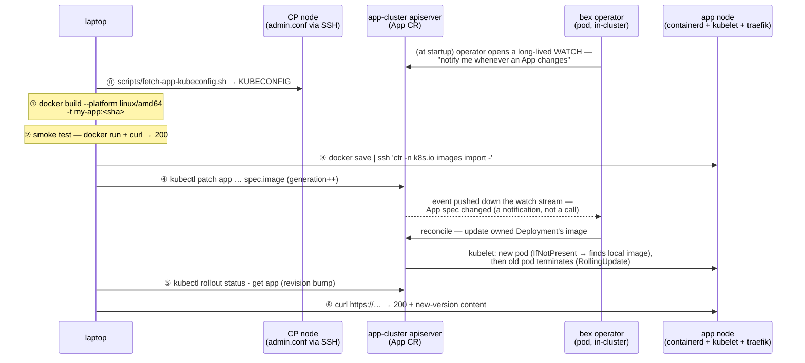

# Deploying / replacing an App (Hetzner, prebuilt-image path)

> **Status: the manual runbook for the prebuilt-image path.** The **`App` CR is the only interface**: you never touch the Deployment; the operator rewrites it. This laptop-build-and-import runbook is for pushing a **prebuilt image** by hand (`spec.image`).
>
> **Build-from-git is in-cluster.** Render-native runtimes (`spec.runtime` plus build/start commands) and Dockerfile builds run as rootless BuildKit Jobs; the explicit bex `spec.builder: buildpack` extension runs as a kpack Image. Both push immutable generation images to Zot — no docker daemon, laptop build, or `ctr` import. A signed git push redeploys them ([ADR017-deploy-from-chat.md](ADR017-deploy-from-chat.md), gated on `spec.autoDeploy`). See **[In-cluster builds](#in-cluster-builds-buildkit-kpack--zot)** below.
>
> Build concurrency, queueing, and Pod-versus-machine scaling are decided in [ADR034](ADR034-scalable-build-pipeline.md).

The examples below use a placeholder App `my-app` (container port 3000); substitute your App's name, port, and host. Three places are involved — keep them straight:

| place | role in a deploy |
| --- | --- |
| **laptop** | builds the image, smoke-tests it, runs `kubectl`/`ssh` |
| **a CP node** (via hcloud API + SSH) | serves `/etc/kubernetes/admin.conf` — `scripts/fetch-app-kubeconfig.sh`, touched once, for access (self-managed since w1/m19.1; no mgmt cluster) |
| **app cluster** | containerd stores the image; apiserver holds the `App` CR; the **operator** turns the CR change into a rollout |

## The whole deploy in one picture



## Steps

### ⓪ Get the app-cluster kubeconfig — _laptop → infra cluster_

Cluster API stores the workload ("app") cluster's kubeconfig as a secret on the management ("infra") cluster:

```sh
ssh -i <ssh-key> root@<infra-ip> \
  'kubectl -n default get secret bex-kubeconfig -o jsonpath="{.data.value}" | base64 -d' \
  > bex-app.kubeconfig
export KUBECONFIG=$PWD/bex-app.kubeconfig
kubectl get app my-app -o yaml   # current image / port / host — your baseline
```

### ① Build amd64 with a **fresh** tag — _laptop_

```sh
cd <project>
docker build --platform linux/amd64 -t my-app:$(git rev-parse --short HEAD) .
```

- **`--platform linux/amd64`** — the Hetzner node is x86_64; an arm64 build won't run.
- **Fresh, non-`:latest` tag (git sha)** — the operator sets no `imagePullPolicy`, so k8s defaults to `IfNotPresent` for non-latest tags. Reusing an existing tag would silently serve the node's _cached_ image; a new tag is what guarantees the new bits run.

### ② Smoke-test locally — _laptop_

Cheap insurance before shipping ~800 MB:

```sh
docker run -d --rm --name smoke -p 127.0.0.1:3999:3000 my-app:<sha>
curl -s -o /dev/null -w '%{http_code}\n' http://127.0.0.1:3999/   # expect 200
docker stop smoke
```

### ③ Import into the node's containerd — _laptop → app node_

No app-image registry yet, so stream the image straight into containerd's **`k8s.io` namespace** (the one the kubelet reads) — one pipe, no temp file:

```sh
docker save my-app:<sha> \
  | ssh -i <ssh-key> root@<app-node-ip> 'ctr -n k8s.io images import -'
```

### ④ Patch the App CR — _laptop → apiserver → operator_

```sh
kubectl patch app my-app --type merge \
  -p '{"spec":{"image":"my-app:<sha>"}}'
```

This is the actual "deploy". The spec change bumps `metadata.generation` — **required**, because the controller watches with `GenerationChangedPredicate`: only generation-changing updates are delivered to the reconciler (the reconcile itself is level-triggered and deliberately has no early-return — it re-applies desired state on every pass). The reconcile rewrites the owned Deployment's image; the default RollingUpdate starts the new pod **before** terminating the old one, so the single node serves without a gap. A pod joins the Service's endpoints (and receives traffic) only once its **`ReadinessProbe`** passes — an HTTP `GET` of `spec.healthCheckPath` on the container port (a 2xx/3xx makes the pod ready; a failure keeps it out of rotation until it recovers). Empty `healthCheckPath` defaults to `/`. Workers and cron jobs expose no HTTP port, so they carry no probe.

Preferred over a raw patch: declare the App in the project's `bex.yml` and apply that (see below) — same effect, but the spec lives in the app repo.

### ⑤ Watch the rollout — _laptop_

```sh
kubectl rollout status deployment/my-app
kubectl get app my-app   # PHASE Running, REVISION bumped (rev-N → rev-N+1)
```

### ⑥ Verify the edge serves the new version — _laptop → node's traefik_

```sh
curl -s -o /dev/null -w '%{http_code}\n' https://my-app.<node-ip>.sslip.io/
curl -s https://my-app.<node-ip>.sslip.io/ | grep -i '<something only in the new version>'
```

Grep for content that **only exists in the new build** — a 200 alone can't distinguish new pod from old.

## `bex.yml` — declaring the App in its own repo

Rather than hand-writing `kubectl patch`, a project can carry a `bex.yml` at its root (render.yaml-style) declaring how it runs on bex:

```yaml
# bex.yml
apps:
  - name: my-app
    type:
      web # web (default): public — <name>.<base-domain> auto-assigned.
      # private: in-cluster only (ClusterIP, no Ingress, no domains).
    image: my-app:<sha> # or repo: + branch: to build from git
    port: 3000
    replicas: 1
    healthCheckPath: / # GET path the operator probes for pod readiness (2xx/3xx → ready); defaults to "/"

    envVars: # literal (non-secret) config -> App.spec.env (PORT is operator-owned)
      - key: LOG_LEVEL
        value: info
    domains: # custom domains on top of the platform hostname
      - my-app.example.com # first entry -> App.spec.host (canonical URL)
      - www.customer.com # rest -> App.spec.hosts (each gets its own TLS cert)
```

`envVars` are **literal, non-secret** configuration: they map to `App.spec.env` and are set on the container in order, with the operator-owned `PORT` always appended last so a user variable can never shadow it. `PORT` aside, an App received no configuration at all before this. **Credentials** (a database URL, an API key) don't belong in `bex.yml` — set them through the env-vars API ([ADR006-bex-api.md](ADR006-bex-api.md#env-vars--tenant-secrets-render-env-vars-compatible)), which stores them in OpenBao and materializes a `<name>-env` Secret consumed via `App.spec.envFromSecret` ([ADR013-secrets.md](ADR013-secrets.md#product-usage-w4m6-the-env-vars-api)).

Like render.yaml, **the service `type` decides exposure** — a `web` service is public by definition and its platform hostname is mandatory (there is no opt-out flag); `private` services are reachable only in-cluster at `<name>.<namespace>.svc:<port>`.

Apply it from the bex repo — this renders each `.apps[]` entry into an App CR and `kubectl apply`s it (respects `$KUBECONFIG`; `DRY_RUN=1` prints the CRs instead):

```sh
scripts/app-apply.sh <project-dir | path/to/bex.yml>
```

Changing `domains[0]` and re-applying is how an App moves to a real domain: the operator rewrites the Ingress to the new host and cert-manager issues a fresh certificate for it (DNS for the host must already point at the edge, or sit behind a proxy such as Cloudflare that forwards HTTP to it — otherwise the ACME HTTP-01 challenge cannot pass). Additional entries serve the App at extra hostnames — typically customers' custom domains CNAME'd to the platform hostname; see [ADR005-custom-domain.md](ADR005-custom-domain.md) for that flow (edge registration + per-host cert isolation).

## In-cluster builds (BuildKit/kpack → Zot)

Setting `App.spec.repo` builds the image **on the cluster**, so there is no laptop step and no docker daemon (app nodes run containerd). When the operator reconciles a repo-backed App whose revision changed, it:

1. Names the build `bld-<name>-gen-<generation>` in `BEX_BUILD_NAMESPACE` and selects the mechanism from `spec.builder`.
2. A Render-native language runtime (`node`, `python`, `go`, `ruby`, `rust`, or `elixir`) selects the internal `native` strategy. The operator generates a language-toolchain Dockerfile, runs the exact `buildCommand`, and records the exact `startCommand` as the image command. Literal and OpenBao-backed service env is available to the build through a BuildKit secret and is not retained in image metadata.
3. `docker`, `auto`, and `dockerfile` dispatch a Kubernetes Job running rootless BuildKit. Its dockerfile frontend clones `context=<repo>.git#<branch>[:<rootDir>]`; Render's optional Docker Context, Dockerfile Path, and Docker Command map to `rootDir`, `dockerfilePath`, and the workload command override.
4. The explicit bex `buildpack` extension creates a `kpack.io/v1alpha2` Image using the GitOps-managed Paketo `ClusterBuilder` (`bex`). kpack clones `repo`/`branch`, honors `spec.rootDir` as `source.subPath`, and receives literal `BP_*`/`BPE_*` App env vars as build-time configuration. Secret-backed runtime env is never copied into the Image CR.
5. The selected builder pushes the generation tag to Zot. In local HTTP clusters kpack uses `BEX_KPACK_REGISTRY=zot.local:5000`, an alias for canonical `BEX_REGISTRY=zot.bex-registry.svc:5000`; the operator rewrites the successful digest back to the canonical name before workload rollout.
6. The operator waits for Job completion or kpack's Ready condition, records the resolved digest in App status, and runs that immutable image. Failure conditions include the underlying Build reason/message.

The tag is the App's **generation**, so any spec change — including a webhook redeploy that stamps `spec.restartedAt` — yields a new build and re-pull. Config: `BEX_REGISTRY` (canonical Zot host), optional `BEX_KPACK_REGISTRY` (kpack-only endpoint alias), `BEX_CNB_BUILDER` (the builder imported into the `ClusterStore`/`ClusterBuilder`), and `BEX_BUILD_NAMESPACE` (default the App namespace). The operator has `batch/jobs`, `kpack.io` Image/Build, and namespaced build-credential RBAC. `scripts/registry-secrets.sh` creates the Docker config variants used by BuildKit, kpack, and workload pulls without storing credentials in git.

## Pre-deploy command (gate a rollout on a migration) — w1/m33

Setting `App.spec.preDeployCommand` makes the operator run that command **to completion against the new revision's image before the Deployment rolls to it** (Render's Pre-Deploy Command — typically a database migration). This is real health-gating, not a cosmetic field: the rollout waits on the step, and a non-zero exit **fails the deploy and leaves the previous revision live and serving**.

Mechanism (`internal/predeploy`, dispatched from `reconcileKubernetes`'s `reconcilePreDeploy`), mirroring the build plane's Job-and-poll shape but with deploy-safe differences:

1. The operator runs the command as a Kubernetes **Job** (`predeploy-<name>-gen-<generation>`, in `BEX_BUILD_NAMESPACE`) whose single container **is the new image**, wrapped in a shell (`sh -c <command>`), with the **same env, envFrom (the `<name>-env` Secret a migration reads `DATABASE_URL` from), image-pull secrets, security context, tier resources, and `/etc/secrets` volume** as the app pod — so a migration runs against exactly what will serve.
2. It **never retries** (`BackoffLimit 0`): re-running a partially applied migration can corrupt data, so a failed pre-deploy is terminal until the user pushes a new revision. A bounded `activeDeadlineSeconds` reaps a hung migration as failed.
3. The operator observes the Job **non-blocking** — one `Get` per reconcile, then `RequeueAfter` — so the App CR reports the step `Running`/`Succeeded`/`Failed` on `status.preDeploy` while it runs; the Deployment is **not created or updated** until the step succeeds, which is what keeps the old revision live.
4. The step is gated **per generation** (bex treats every spec change as a new revision — a repo-backed App already rebuilds per generation), so it runs once per rollout, exactly like Render, and never re-runs a migration that already passed or failed for the same revision (which also guards against re-creating the Job after its TTL reap).

Skipped when there is no rollout to gate (suspended / auto-hibernating, both scaling to 0) and for `cron_job`/`static_site` (a cron runs its own `command`; a static site has no running container). Unset `preDeployCommand` is byte-identical to prior behavior — no Job, no gate.

The step's outcome and logs are visible on the deploy record: `preDeployStatus` (`internal/store`/`internal/deploys`) distinguishes a migration failure from a health-check failure, and the `predeploy` log type ([ADR006](ADR006-bex-api.md), [ADR010](ADR010-observability.md)) reads the Job pod's logs.

## Control-plane deploy lifecycle

For store-managed Apps, bex-api projects the operator's current-generation facts into Render's deploy vocabulary without adding an operator-to-database dependency. A deploy row begins `created`; `BuildQueued` and `Building` evidence yield `queued` and `build_in_progress`; a generation-scoped pre-deploy Job yields `pre_deploy_in_progress`; rollout reconciliation yields `update_in_progress`; and the corresponding failure or convergence facts yield `build_failed`, `pre_deploy_failed`, `update_failed`, or `live`. Fast phases may be skipped when the polling control plane never observes them. Invalid regressions are rejected.

The control-plane fallback gate is phase-specific and resets at each stored transition: builds receive 25 minutes (longer than the BuildKit Job's 20-minute active deadline), pre-deploy commands receive 12 minutes (longer than their 10-minute Job deadline), and workload rollout receives 3 minutes. This prevents a healthy long build from being falsely closed as `build_failed` while retaining a bounded failure for rollout states such as `ImagePullBackOff` that do not make the App phase machine fail on their own.

`updatedAt` advances only on a real stored transition, `startedAt` records the first executing phase, and `finishedAt` records the first terminal result. A newer trigger cancels an older open deploy; a newer live deploy atomically marks the former live revision `deactivated`, retaining its original `finishedAt` and using `updatedAt` for the replacement instant. See [ADR006](ADR006-bex-api.md#deploy-history--trigger-w2m5-render-deploys-compatible) for adapter/filter semantics.

## Gotchas

- **Apps are imperative by design** — the `App` CR lives only in the app cluster's etcd, _not_ in git and not in `deploy/gitops/` (that's platform-only). Losing the node loses the CR; see [`docs/ADR003-control-plane.md`](ADR003-control-plane.md) for the planned Postgres source of truth.
- **Monorepo support applies to both mechanisms** — `App.spec.rootDir` scopes the BuildKit git context or kpack `source.subPath`, and scopes the git-push webhook so changes only outside that directory do not redeploy the App.
- **The edge IP is the node IP** (traefik on hostNetwork) — the `*.sslip.io` host is tied to it and changes if the node is replaced.
- **Server IPs drift** — reread them from `hcloud`/the kubeconfig rather than trusting old notes; the kubeconfig's API endpoint is also distinct from the node IP.
- Day-0 cluster creation lives in [`infra/`](../infra/README.md); Argo-reconciled platform apps in [`deploy/gitops/`](../deploy/gitops/README.md). This doc is day-N **app**-level deployment only.
