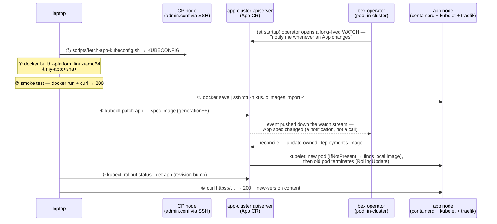

# Deploying / replacing an App (Hetzner, prebuilt-image path)

> **Status: the manual runbook for the prebuilt-image path.** The **`App` CR is the only interface**: you never touch the Deployment; the operator rewrites it. This laptop-build-and-import runbook is for pushing a **prebuilt image** by hand (`spec.image`).
>
> **Build-from-git is now in-cluster (w1/m5).** Setting `spec.repo` on an `App` makes the operator dispatch a **rootless BuildKit Job** that clones the repo, builds its Dockerfile, and pushes `<registry>/<name>:gen-<generation>` to the in-cluster registry (Zot) — no docker daemon, no laptop, no `ctr` import; steps ①–③ below collapse into the platform. A signed git push then redeploys ([ADR017-deploy-from-chat.md](ADR017-deploy-from-chat.md), the `POST /v1/webhooks/git` webhook, gated on `spec.autoDeploy`). See **[In-cluster builds](#in-cluster-builds-buildkit--zot)** below. Cloud Native Buildpacks (`spec.builder: buildpack`) are not yet in-cluster — use a Dockerfile until kpack lands.

The examples below use a placeholder App `my-app` (container port 3000); substitute your App's name, port, and host. Three places are involved — keep them straight:

| place | role in a deploy |
| --- | --- |
| **laptop** | builds the image, smoke-tests it, runs `kubectl`/`ssh` |
| **a CP node** (via hcloud API + SSH) | serves `/etc/kubernetes/admin.conf` — `scripts/fetch-app-kubeconfig.sh`, touched once, for access (self-managed since w1/m19.1; no mgmt cluster) |
| **app cluster** | containerd stores the image; apiserver holds the `App` CR; the **operator** turns the CR change into a rollout |

## The whole deploy in one picture



## Steps

### ⓪ Get the app-cluster kubeconfig — _laptop → infra cluster_

Cluster API stores the workload ("app") cluster's kubeconfig as a secret on the management ("infra") cluster:

```sh
ssh -i <ssh-key> root@<infra-ip> \
  'kubectl -n default get secret bex-kubeconfig -o jsonpath="{.data.value}" | base64 -d' \
  > bex-app.kubeconfig
export KUBECONFIG=$PWD/bex-app.kubeconfig
kubectl get app my-app -o yaml   # current image / port / host — your baseline
```

### ① Build amd64 with a **fresh** tag — _laptop_

```sh
cd <project>
docker build --platform linux/amd64 -t my-app:$(git rev-parse --short HEAD) .
```

- **`--platform linux/amd64`** — the Hetzner node is x86_64; an arm64 build won't run.
- **Fresh, non-`:latest` tag (git sha)** — the operator sets no `imagePullPolicy`, so k8s defaults to `IfNotPresent` for non-latest tags. Reusing an existing tag would silently serve the node's _cached_ image; a new tag is what guarantees the new bits run.

### ② Smoke-test locally — _laptop_

Cheap insurance before shipping ~800 MB:

```sh
docker run -d --rm --name smoke -p 127.0.0.1:3999:3000 my-app:<sha>
curl -s -o /dev/null -w '%{http_code}\n' http://127.0.0.1:3999/   # expect 200
docker stop smoke
```

### ③ Import into the node's containerd — _laptop → app node_

No app-image registry yet, so stream the image straight into containerd's **`k8s.io` namespace** (the one the kubelet reads) — one pipe, no temp file:

```sh
docker save my-app:<sha> \
  | ssh -i <ssh-key> root@<app-node-ip> 'ctr -n k8s.io images import -'
```

### ④ Patch the App CR — _laptop → apiserver → operator_

```sh
kubectl patch app my-app --type merge \
  -p '{"spec":{"image":"my-app:<sha>"}}'
```

This is the actual "deploy". The spec change bumps `metadata.generation` — **required**, because the controller watches with `GenerationChangedPredicate`: only generation-changing updates are delivered to the reconciler (the reconcile itself is level-triggered and deliberately has no early-return — it re-applies desired state on every pass). The reconcile rewrites the owned Deployment's image; the default RollingUpdate starts the new pod **before** terminating the old one, so the single node serves without a gap.

Preferred over a raw patch: declare the App in the project's `bex.yml` and apply that (see below) — same effect, but the spec lives in the app repo.

### ⑤ Watch the rollout — _laptop_

```sh
kubectl rollout status deployment/my-app
kubectl get app my-app   # PHASE Running, REVISION bumped (rev-N → rev-N+1)
```

### ⑥ Verify the edge serves the new version — _laptop → node's traefik_

```sh
curl -s -o /dev/null -w '%{http_code}\n' https://my-app.<node-ip>.sslip.io/
curl -s https://my-app.<node-ip>.sslip.io/ | grep -i '<something only in the new version>'
```

Grep for content that **only exists in the new build** — a 200 alone can't distinguish new pod from old.

## `bex.yml` — declaring the App in its own repo

Rather than hand-writing `kubectl patch`, a project can carry a `bex.yml` at its root (render.yaml-style) declaring how it runs on bex:

```yaml
# bex.yml
apps:
  - name: my-app
    type:
      web # web (default): public — <name>.<base-domain> auto-assigned.
      # private: in-cluster only (ClusterIP, no Ingress, no domains).
    image: my-app:<sha> # or repo: + branch: to build from git
    port: 3000
    replicas: 1
    healthCheckPath: /
    envVars: # literal (non-secret) config -> App.spec.env (PORT is operator-owned)
      - key: LOG_LEVEL
        value: info
    domains: # custom domains on top of the platform hostname
      - my-app.example.com # first entry -> App.spec.host (canonical URL)
      - www.customer.com # rest -> App.spec.hosts (each gets its own TLS cert)
```

`envVars` are **literal, non-secret** configuration: they map to `App.spec.env` and are set on the container in order, with the operator-owned `PORT` always appended last so a user variable can never shadow it. `PORT` aside, an App received no configuration at all before this. **Credentials** (a database URL, an API key) don't belong in `bex.yml` — set them through the env-vars API ([ADR006-bex-api.md](ADR006-bex-api.md#env-vars--tenant-secrets-render-env-vars-compatible)), which stores them in OpenBao and materializes a `<name>-env` Secret consumed via `App.spec.envFromSecret` ([ADR013-secrets.md](ADR013-secrets.md#product-usage-w4m6-the-env-vars-api)).

Like render.yaml, **the service `type` decides exposure** — a `web` service is public by definition and its platform hostname is mandatory (there is no opt-out flag); `private` services are reachable only in-cluster at `<name>.<namespace>.svc:<port>`.

Apply it from the bex repo — this renders each `.apps[]` entry into an App CR and `kubectl apply`s it (respects `$KUBECONFIG`; `DRY_RUN=1` prints the CRs instead):

```sh
scripts/app-apply.sh <project-dir | path/to/bex.yml>
```

Changing `domains[0]` and re-applying is how an App moves to a real domain: the operator rewrites the Ingress to the new host and cert-manager issues a fresh certificate for it (DNS for the host must already point at the edge, or sit behind a proxy such as Cloudflare that forwards HTTP to it — otherwise the ACME HTTP-01 challenge cannot pass). Additional entries serve the App at extra hostnames — typically customers' custom domains CNAME'd to the platform hostname; see [ADR005-custom-domain.md](ADR005-custom-domain.md) for that flow (edge registration + per-host cert isolation).

## In-cluster builds (BuildKit → Zot)

Setting `App.spec.repo` builds the image **on the cluster**, so there is no laptop step and no docker daemon (app nodes run containerd). When the operator reconciles a repo-backed App whose revision changed, it:

1. Dispatches a Kubernetes **Job** (`bld-<name>-gen-<generation>`, in `BEX_BUILD_NAMESPACE`) running **rootless BuildKit** (`moby/buildkit:*-rootless`) — no privileged container, only seccomp/AppArmor `unconfined`, which containerd nodes allow.
2. BuildKit's dockerfile frontend **clones the repo itself** (`context=<repo>.git#<branch>` — the `.git` suffix is what makes BuildKit git-clone rather than fetch the URL as a file) and builds the Dockerfile. When `App.spec.rootDir` is set (monorepo support, Render's Root Directory setting), the context grows a `:<rootDir>` suffix (`context=<repo>.git#<branch>:<rootDir>`), so BuildKit builds only that subdirectory's Dockerfile instead of the repo root.
3. It **pushes `<BEX_REGISTRY>/<name>:gen-<generation>`** to the in-cluster registry (Zot, `zot.bex-registry.svc:5000`; `registry.insecure=true` for the local/dev HTTP registry — front with TLS on prod).
4. The operator waits for the Job, then runs that image — the node pulls it from Zot.

The tag is the App's **generation**, so any spec change — including a webhook redeploy that stamps `spec.restartedAt` — yields a new tag, a fresh build, and a re-pull. `spec.builder` selects the strategy: `auto`/`dockerfile` use BuildKit (a Dockerfile at the repo root is required); `buildpack` (Cloud Native Buildpacks) is **not yet in-cluster** — it needs a k8s-native builder (kpack) and reports a clear error until then, rather than silently failing on containerd. Config: `BEX_REGISTRY` (Zot host), `BEX_BUILD_NAMESPACE` (where Jobs run; default the App's namespace). The operator needs `batch/jobs` RBAC (granted in `config/rbac`).

## Gotchas

- **Apps are imperative by design** — the `App` CR lives only in the app cluster's etcd, _not_ in git and not in `deploy/gitops/` (that's platform-only). Losing the node loses the CR; see [`docs/ADR003-control-plane.md`](ADR003-control-plane.md) for the planned Postgres source of truth.
- **Monorepo support is Dockerfile-only** — `App.spec.rootDir` (set via REST/GraphQL/MCP too, e.g. `rootDir: "services/api"`) scopes the BuildKit build context to that subdirectory (`context=<repo>.git#<branch>:<rootDir>`) and scopes the git-push auto-deploy webhook so a push whose diff touches only files outside `rootDir` doesn't trigger a redeploy. It only works with `spec.builder: auto`/`dockerfile` — CNB (`spec.builder: buildpack`) is still not in-cluster (needs kpack), so `rootDir` has no effect there yet.
- **The edge IP is the node IP** (traefik on hostNetwork) — the `*.sslip.io` host is tied to it and changes if the node is replaced.
- **Server IPs drift** — reread them from `hcloud`/the kubeconfig rather than trusting old notes; the kubeconfig's API endpoint is also distinct from the node IP.
- Day-0 cluster creation lives in [`infra/`](../infra/README.md); Argo-reconciled platform apps in [`deploy/gitops/`](../deploy/gitops/README.md). This doc is day-N **app**-level deployment only.
