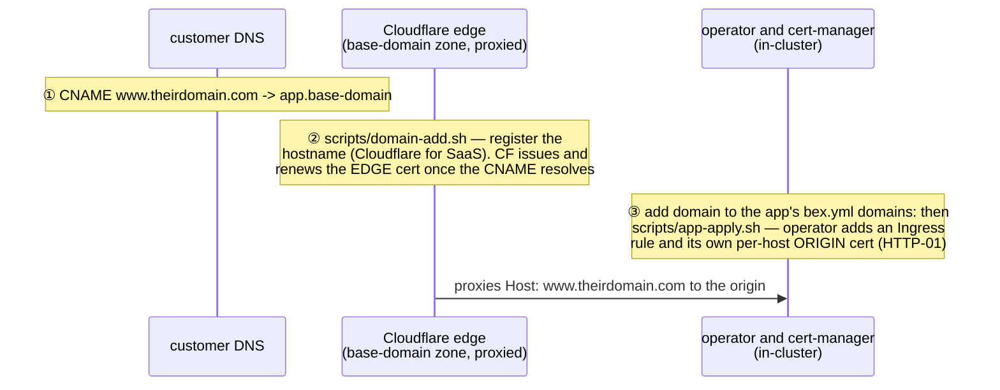

# Custom domains — CNAME onto the platform, SSL on our side

Every **`type: web`** App serves at **`<app>.<base-domain>`** — the platform hostname is auto-assigned and mandatory, like Render's `onrender.com` (mechanism: `bex.yml`'s `type: web` sets `App.spec.expose`; the operator's `BEX_BASE_DOMAIN` + wildcard DNS do the rest; `type: private` Apps have no ingress at all). A customer brings their own domain by pointing a CNAME at that hostname. They never touch certificates: **their one CNAME is also what authorizes us to issue TLS for their domain** (ACME HTTP-01 challenges for `www.theirdomain.com` land on our edge _because_ of the CNAME).

## What the customer does (their entire job)

```
CNAME  www.theirdomain.com  ->  <app>.<base-domain>
```

- **Apex domains (`theirdomain.com`) can't CNAME** per the DNS spec. Options: ALIAS/CNAME-flattening if their DNS provider supports it, or redirect apex → `www` at their registrar. Instruct `www` by default.
- Add the CNAME **first**, then tell us — issuance can only start once the record resolves (we retry, but the happy path is CNAME-first).

## What we do



Two independent certs by design: Cloudflare's at the edge (browser-facing), cert-manager's at the origin (lets the zone run SSL mode Full (strict)).

- **Step ② exists because the base-domain zone is proxied** (orange-cloud): the CF edge only answers for hostnames it knows, so each customer domain must be registered as a _custom hostname_ (Cloudflare for SaaS — free ≤ 100 hostnames; one-time zone setup: enable it + set the fallback origin). Without it, customer traffic dies at the edge with an SSL mismatch.
- **Step ③ is ordinary bex mechanics**: `domains[1:]` in `bex.yml` becomes `App.spec.hosts`; the operator renders one Ingress rule and **one TLS secret per host**, so one customer's broken DNS can never block another domain's issuance or renewal (`<app>-tls` for the first host — never renamed — and `<app>-tls-<host>` for the rest).

## API surface — DNS instructions & verify (w5/m10)

Every custom domain the API returns carries a **`dnsRecord`** — the exact record the tenant creates at their registrar (Render's post-add DNS instructions; capture in [render-artifacts/custom-domain-dns-instructions.md](render-artifacts/custom-domain-dns-instructions.md)):

| Domain kind | `dnsRecord.type` | `dnsRecord.name` | `dnsRecord.value` |
| --- | --- | --- | --- |
| subdomain | `CNAME` | label prefix (`www`, `api.staging`) | `<app>.<base-domain>` |
| apex | `ALIAS` | `@` | `<app>.<base-domain>` |

The target is the App's **platform host** `<app>.<BEX_BASE_DOMAIN>` — bex-api reads `BEX_BASE_DOMAIN` (falling back to the App's status URL). bex points apex at the platform host via ALIAS/ANAME/CNAME-flattening rather than a bare `A`-record IP (the edge is Cloudflare-proxied), and the dashboard adds the "ALIAS/ANAME, or redirect apex → `www`" guidance.

A **verify** verb re-checks a domain's DNS/cert state now and returns its fresh status — `POST /v1/services/{id}/custom-domains/{name}/verify` (REST), `verifyCustomDomain(id, name)` (GraphQL), `verify_custom_domain` (MCP). bex verification is automatic (cert-manager reconciles the per-host TLS secret continuously), so this is an idempotent re-read, not a re-verification trigger — it gives the dashboard a "Verify / re-check" action that refreshes a pending row without a mutation. All three surfaces return the same `dnsRecord` fields and verify semantics.

## Lifecycle / operational notes

- **Pending window**: between "CNAME added" and "certs issued" (typically < 1 min after DNS resolves) the domain serves a mismatched cert. Every platform has this.
- **Renewal depends on the CNAME staying put.** If the customer deletes or repoints it, renewal fails and the domain goes dark within ~90 days — looking like _our_ outage. Per-domain cert health belongs in monitoring / the future control plane.
- **Ownership verification**: bex does **not** run a separate DNS-challenge state machine (Render doesn't either — its "Verify" is a DNS-resolution check, not a TXT challenge). External-domain ownership is proven by cert-manager's ACME challenge: no HTTPS is served until the tenant's DNS points at the platform and the cert issues — the same model Render relies on. What that model does **not** cover, and what **w7/m6** adds, are two guards on the add path:
  - **Cross-App collision** — a host already registered on another App (any tenant) is refused with `409` (Render's "This domain already exists on another site."). Enforced in `apps/domains.go` (`hostClaimedElsewhere`, a namespace-wide CR scan) and durably by the `domains.host` UNIQUE index — `PGStore.AddDomain` now distinguishes a same-app conflict (idempotent) from a cross-app one (surfaced), closing the add-both-then-project race.
  - **Reserved / platform hosts** — the `BEX_BASE_DOMAIN` apex, any foreign `<x>.<base>` platform host, and the `BEX_DASHBOARD_URL` host are refused with `400`. The `*.<base>` namespace resolves (platform-controlled DNS) to the shared ingress, so without this guard a tenant could pass ACME for another App's `<other>.<base>` and hijack it — the one hijack cert-manager cannot stop. A bex superset of Render's own `*.onrender.com` reservation.
  - **Not done (conscious divergence):** Render's automatic www↔apex pairing (adding `www.example.org` also adds+redirects `example.org`) — bex has no public-suffix list, so the collision guard is per-host; the paired sibling stays independently claimable.
- Never probe a hostname before its DNS record exists — you'll poison resolver negative caches for up to an hour. Check with `dig @1.1.1.1` / `curl --resolve`.
