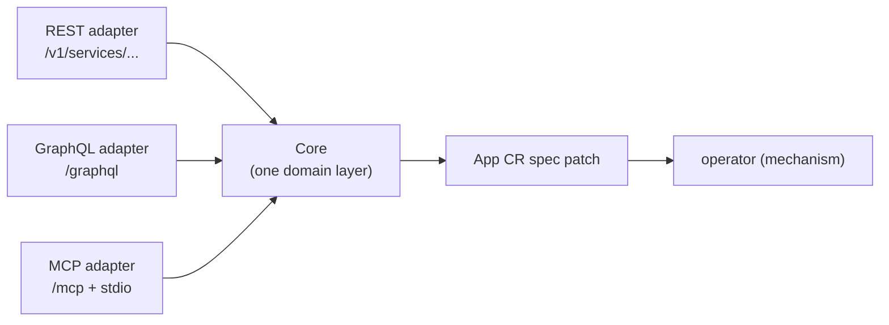

# bex-api — the control-plane seed (REST + GraphQL + MCP)

The product API of the bex control plane (see [ADR003-control-plane.md](ADR003-control-plane.md)): an authenticated HTTP service that turns product actions into **App CR spec patches**. It contains no mechanism — it writes intent; the operator converges it. It exposes the lifecycle verbs from [ADR007-restart-suspend-and-resume.md](ADR007-restart-suspend-and-resume.md) plus logs, metrics, API keys, env vars, and managed Postgres — and, opt-in (`BEX_CP_DB_URI`), the Postgres source-of-truth store itself.

## One core, three adapters

Render exposes a public **REST** API, drives its dashboard with **GraphQL**, and ships an official **MCP** server — all over one internal service layer. bex-api mirrors that shape:



Each verb has exactly one implementation, in its feature package's `Service` (`lego/backend/internal/{apps,logs,metrics,apikeys,postgres,keyvalue,secrets}/service.go`, all embedding the shared kernel `internal/core/base.go`). Each feature ships its own thin adapter fragments — `rest.go`, `graphql.go`, `mcp.go` beside the service — that are pure presentation calling identical `Service` methods, composed by `internal/api/server.go`. So the surfaces cannot drift, and each new client is another thin adapter, not a second implementation.

## Which workspace a request acts in (w6/m14)

A caller belongs to **many** workspaces (w6/m1 create, w4/m12 invites), so every request has to answer "which one am I acting in?" before it can be authorized or its writes stamped. There is exactly one answer, resolved in one place — `core.Base.resolveWorkspace` — and all three surfaces feed it the same way:

- **Named**: the caller says which workspace. REST reads `ownerId` (Render's field: the create body; the list query param), GraphQL an `ownerId` argument, MCP an explicit `ownerId` tool argument or, failing that, the session's `select_workspace` selection (`core.SelectedWorkspace` — the one precedence helper all three features share: explicit > session > default). The adapters do not interpret it; they set it on the request (`core.WithWorkspace`) and the verb resolves it.
- **Not named**: the caller's **default** workspace — the **oldest** membership (`store.TenantForIdentity`, `ORDER BY m.created_at, t.id`). Deterministic by construction: a bare join returned an arbitrary row, which is how a multi-workspace caller's "current workspace" could change between two identical calls (w6/m11, live).

A named workspace is honored **only after** `WorkspaceResolver.IsMember` confirms the caller belongs to it. A non-member naming a workspace gets `ErrForbidden` (403) on every surface — never a silent fall-back to their own, which is the confused-deputy shape where a caller asks for B, is served A, and their create lands in the wrong workspace. An unreachable membership store fails closed the same way (`ErrAuthzUnavailable`), for the same reason.

**Render deviation (deliberate):** Render _requires_ `ownerId` on create; bex keeps it **optional**, defaulting to the caller's default workspace, so single-workspace clients need not say it. Everything else — field name, 403 semantics — matches ([ADR018-render-parity.md](ADR018-render-parity.md) row "Create service").

**Reaching a resource in another of your workspaces.** A service is addressed by name, and the name already implies its workspace (the `bex.co/tenant` label), so `core.Base.GetApp` authorizes the calling verb's **relation against the App's own workspace** — Render's model, where permissions come from the resource's owner. That is what lets an owner read a service in their second workspace without a 403 (the m11 bug: the gate compared the App to whichever single workspace the join had picked). It is _not_ mere membership: roles are per-workspace, so an admin of A who is only a **viewer** of B still cannot delete B's service by naming it — `can_create` does not hold for them in B. Membership alone would have been a cross-workspace privilege escalation; `TestMultiWorkspaceTargetingE2E` pins both halves against a live Postgres + OpenFGA.

## Auth

Every route except `GET /healthz` and the two narrowly credential-gated callbacks (`POST /v1/webhooks/git`, authenticated by HMAC, and `GET`/`POST /v1/deploy-hooks/{token}`, authenticated by the secret URL token) requires real, per-client credentials from the auth substrate ([ADR012-auth.md](ADR012-auth.md)) — **there is no shared static token**:

- **API keys (machines)** — an API key _is_ an OAuth2 client (`client_credentials` grant). Exchange it for a short-lived bearer token, then call the API:

  ```sh
  TOKEN=$(curl -s -X POST https://oauth.bex.co/oauth2/token \
    -d "grant_type=client_credentials&client_id=$KEY_ID&client_secret=$KEY_SECRET" | yq .access_token)
  curl -H "Authorization: Bearer $TOKEN" https://api.bex.co/v1/services
  ```

  Tokens are introspected at Hydra's admin API (`BEX_HYDRA_ADMIN_URL`, cluster-internal, required — the binary refuses to start without it; positive results cached ≤ 30s). Keys are managed through the API itself: `POST /v1/api-keys` (the secret is returned exactly once), `GET /v1/api-keys`, `DELETE /v1/api-keys/{id}` — with GraphQL (`apiKeys`, `createApiKey`, `revokeApiKey`) and MCP (`create_api_key`, `list_api_keys`, `revoke_api_key`) parity. "API key" means the Hydra clients bex minted (stamped `bex.co/api-key` metadata): list hides and revoke refuses everything else, so platform clients can't be revoked through this endpoint. The **first** key, `bex-bootstrap`, is deliberately such a platform client — seeded and rotated only by [scripts/auth-bootstrap-client.sh](../scripts/auth-bootstrap-client.sh) (CI runs it on every deploy; secret from `.env`'s `BEX_BOOTSTRAP_CLIENT_SECRET`).

  **Dashboard surface (w4/m8):** a logged-in human mints/lists/revokes keys from Settings → API Keys (`dashboard/src/features/api-keys/`) over this same GraphQL adapter — no separate REST surface for the UI. The list is workspace-shared, not "my keys" (see [ADR012-auth.md](ADR012-auth.md#authorization-openfga) — keys carry no per-user owner), and the secret is shown exactly once at creation, matching the CLI/API contract above.

- **Sessions (humans)** — with no bearer present, an Ory session (cookie or `X-Session-Token`) is validated via Kratos' `whoami` (`BEX_KRATOS_URL` — optional; unset disables sessions). A present bearer is authoritative: an inactive token is 401 with no session fallthrough.

Ory unreachable ⇒ 503 (fail closed; operational recovery goes through kubectl, not this API). The resolved caller (OAuth2 `client_id` or Kratos identity id) is attached to the request context (`api.IdentityFrom`) — the tenant-scoping hook. `BEX_API_CORS_ORIGIN` optionally enables CORS for browser frontends — a comma-separated origin allowlist; the matched request `Origin` is echoed back (credentialed CORS forbids `*`). Prod sets it to `https://dashboard.bex.co,http://localhost:5173` (`lego/operator/config/api/deployment.yaml`) so both the deployed dashboard and a local dashboard dev server (Vite's default port) can call the deployed API; a locally-run bex-api still needs its own `BEX_API_CORS_ORIGIN=http://localhost:5173` since it's a separate deployment. The response carries `Access-Control-Allow-Credentials: true` — required for the dashboard's Kratos-session cookie (or an `X-Session-Token`) to be readable cross-origin at all.

**Authorization** ([ADR012-auth.md#authorization-openfga](ADR012-auth.md)): with `BEX_OPENFGA_URL` set, every Core verb additionally checks the caller's permission against OpenFGA (mapped to Render's workspace-role matrix (viewer/contributor/developer/admin/billing — docs/ADR012-auth.md), on the caller's workspace — `workspace:tea-<id>`, resolved from the control-plane store) — denial is **403**, OpenFGA unreachable is **503**. On in prod since w1/m9 (tenant onboarding: a human's first login mints a workspace, and minted API keys are bound to their tenant); unset ⇒ all authenticated callers may do everything, the pre-authorization behavior used when the store is off (dev, store-off).

## REST (Render public-API compatible)

Shapes verified against Render's OpenAPI spec (`render-public-api-1.json`): the `{service, cursor}` list envelope, the **string** `suspended` enum (`"suspended"` / `"not_suspended"`, _not_ a boolean), and the verb status codes. Served under Render's noun `/v1/services` and bex's `/v1/apps` alias (same handlers). The App name is the service `id` (Render ids are opaque; a client just round-trips whatever the list returned).

| method + path | effect | status |
| --- | --- | --- |
| `GET /healthz` | liveness (open) | 200 |
| `POST /v1/services` | create a service; a same-workspace duplicate `name` is rejected, never upserted (w4/m19) | 201 |
| `GET /v1/services` | list `[{service, cursor}]` | 200 |
| `GET /v1/services/{id}` | one service object | 200 |
| `PATCH /v1/services/{id}` | update `displayName`, `serviceDetails.plan`, and/or the bex extra `serviceDetails.idleTTLSeconds` | 200 |
| `DELETE /v1/services/{id}` | delete the service; the operator's ownerRefs cascade its Deployment/Service/Ingress | 204 |
| `POST /v1/services/{id}/restart` | `spec.restartedAt = now` | 200 |
| `POST /v1/services/{id}/suspend` | `spec.suspended = true` | 202 |
| `POST /v1/services/{id}/resume` | `spec.suspended = false` | 202 |
| `POST /v1/services/{id}/scale` | `spec.replicas = numInstances` | 202 |
| `GET /v1/services/{id}/deploy-hook` | reveal or lazily mint the secret deploy-hook URL (sensitive-read permission) | 200 |
| `POST /v1/services/{id}/deploy-hook/regenerate` | rotate the secret deploy-hook URL; the old URL immediately becomes unknown | 200 |
| `GET` / `POST /v1/deploy-hooks/{token}` | trigger a deploy with the URL credential itself; no API key | 200 |
| `POST /v1/cron-jobs/{id}/runs` | trigger a one-off run of a `cron_job` (`spec.runAt = now`); also `POST /v1/services/{id}/runs` | 201 |
| `POST /v1/webhooks/git` | HMAC-verified push → redeploy (ungated) | 200 |

Verbs return the updated service object (the patch is accepted; the operator converges asynchronously — poll `GET` for `suspended`/`phase`). The service object carries Render's fields (`id`, `name`, `type` (the serviceType — see below), `suspended`, `dashboardUrl`, `createdAt`, `serviceDetails.url`) plus bex extras (`displayName`, `phase`, `replicas`, `revision`) — a superset Render clients safely ignore. bex has no build plans, regions or disks, so those Render fields are omitted.

**Mutable service label.** `PATCH /v1/services/{id}` accepts top-level `displayName`; omission leaves the label unchanged and `""` clears it. `App.spec.displayName` is a free-form human label, while the App object's `metadata.name` remains the immutable service `id`/`name`. Reads return both. Human clients display `displayName` when non-empty and fall back to `name`, so pre-existing Apps are unchanged. A label change is a direct CR patch that does not touch `metadata.name`, `spec.subdomain`, hosts, `restartedAt`, the platform URL, or any `<name>-tls`/workload resource naming. This is a conscious compatibility adaptation: Render's official [Update service](https://api-docs.render.com/reference/update-service) endpoint edits top-level `name`; bex cannot safely mutate a Kubernetes object name, so its wire extension spells the mutable part `displayName` and keeps `name` as the stable resource id.

`POST /v1/services` is the create surface. **Update (w4/m19):** it is create-only, not an upsert — a same-workspace duplicate `name` is rejected with 409 `ErrConflict` ("name ... is already in use"), matching Render's own workspace-unique-name behavior ([docs/render-artifacts/duplicate-service-names.md](render-artifacts/duplicate-service-names.md), [ADR018-render-parity.md](ADR018-render-parity.md)); the platform host is a separate, globally-unique `slug` (`spec.subdomain`), suffixed on cross-workspace collision, so two workspaces may still both create the same `name` independently. The repeat-call-redeploys upsert behavior described in the rest of this section now belongs to `deploy`/the blueprint stack path only (`applyCreate`, [ADR017-deploy-from-chat.md](ADR017-deploy-from-chat.md) §2 Update) — not this endpoint. The body is shaped to Render's create schema (verified against its public API): top-level `type`, `name`, `repo`, `branch`, `image` (an **object** `{imagePath}`, not a string), `autoDeploy` (`"yes"`/`"no"`), `envVars: [{key, value}]`, and `serviceDetails.{plan, numInstances, healthCheckPath}` — the same nested location `PATCH`/`GET` use. One of `repo` (build-from-git) or the `image` object (prebuilt) is required. `autoDeploy` **is honored** — it sets `spec.autoDeploy`, which gates whether the push-to-deploy webhook (below) redeploys on a git push; omitted, it defaults on for a repo-backed service and off for an image-backed one, matching Render. Render fields bex can't yet honor are ignored (a safe superset): `ownerId` (single workspace), `region` (single region), and the `serviceDetails` runtime build/start commands (bex builds via Dockerfile/CNB auto-detection). bex adds a few extensions with no Render create-body equivalent — `builder`, `port` (Render auto-detects it), `domains` (custom domains in one call), and a top-level `plan` convenience. It writes the App CR directly (the hand-applied path); the row-backed, multi-tenant create is the internal control-plane API's job (`store` `POST /v1/apps`).

Two conscious create/delete divergences from Render's OpenAPI, both documented rather than faked: (1) create returns the **bare service object** (the same shape `GET /v1/services/{id}` returns), not Render's create-only `{service, deployId}` envelope — deploy history has its own endpoints (`GET /v1/services/{id}/deploys`), and a `deployId` would have to be faked in store-less mode where deploys don't exist, so the object stays a clean superset a client re-reads via `GET`. (2) `DELETE /v1/services/{id}` returns **204 with an empty body** (Render's delete semantics) and deletes the App CR; the operator's ownerRefs cascade everything derived from it (Deployment, Service, Ingress, and for a `cron_job` the CronJob, plus the NetworkPolicy). The one resource left behind is the cert-manager TLS `Secret` (`<app>-tls*`): its `Certificate` is owned by the Ingress and dies with it, but cert-manager keeps the issued Secret by default — a harmless dead cert for a host no longer served (reusing the name re-issues it). Delete requires the same `can_create` scope as create (developer and up); with the store on, a store-managed service's row is deleted first so a projector resync can't resurrect it.

**Service `type`s (Render's serviceType).** `type` picks the service kind and defaults to `web_service` (an HTTP service exposed at a URL). bex covers four of Render's types:

- `web_service` — HTTP service, exposed at `<name>.<BEX_BASE_DOMAIN>` (Deployment + Service + Ingress).
- `private_service` — HTTP service reachable only in-cluster (Deployment + ClusterIP Service, no platform Ingress).
- `background_worker` — runs the image with **no HTTP port**: a bare Deployment, no Service, no Ingress, **no URL**.
- `cron_job` — runs the image's command on a **`schedule`** (5-field crontab, required) as a Kubernetes CronJob (no Deployment/Service/Ingress). An optional **`command`** overrides the image's default entrypoint (`/bin/sh -c <command>`, applied in `cronPodSpec`); empty runs the image's own command unmodified. Both are accepted top-level or under `serviceDetails` (Render's `cronJobDetails.schedule`/`.command`); the service object reports them back at `serviceDetails.schedule`/`.command`, and recent runs (`{name, startedAt, finishedAt, status}`, newest first) at `runs`. `background_worker`/`cron_job` have no ingress, so they cannot carry `domains`. Render's `static_site` is out of scope (a build→CDN effort, deferred). The dashboard's cron Settings tab shows both fields in a **Deploy** section, read-only for now (w5/m11) — in place of Custom Domains/Idle timeout, neither of which applies to a service with no HTTP traffic.

`POST /v1/cron-jobs/{id}/runs` (Render's cron run trigger; also mounted under the `/v1/services` and `/v1/apps` nouns as `.../{id}/runs`) bumps `spec.runAt`, and the operator materializes a one-off Job — visible in the service's `runs` once it starts. Rejected (`400`) for a non-cron service.

```sh
curl -H "Authorization: Bearer $TOKEN" https://api.bex.co/v1/services
curl -X POST -H "Authorization: Bearer $TOKEN" https://api.bex.co/v1/services/eden-cms-v2/suspend
curl -X POST -H "Authorization: Bearer $TOKEN" -H "Content-Type: application/json" \
  https://api.bex.co/v1/services -d '{"name":"hello","repo":"https://github.com/bex/hello","serviceDetails":{"plan":"starter"}}'
```

### Deploy-from-chat (pillar 4)

"Deploy this" is **one call, no bespoke endpoint** — it rides the same create surface (ADR: [ADR017-deploy-from-chat.md](ADR017-deploy-from-chat.md)). Over MCP the `deploy` tool takes a `{repo, bexYaml}` (`bexYaml` is the project's render.yaml-shaped `bex.yml`); it parses the manifest, maps its fields onto a `CreateRequest` (the same mapping `scripts/app-apply.sh` uses), and calls `Create`. `create_web_service` is the equivalent with structured args (a `repo` or `image`). A later push closes the loop through the webhook below.

#### `bex.yml` — the render.yaml Blueprint manifest (w1/m24)

A `bex.yml` is render.yaml's Blueprint shape: a top-level **`services:`** list + **`databases:`** list (+ `envVarGroups:`, classified below). The legacy single-service **`apps:`** key is an alias for `services:` (mutually exclusive), so pre-existing files apply byte-identically. One `deploy` call converges a whole stack: **databases first** (so a service's `fromDatabase` env can wait on the Database's CNPG connection Secret), then services — each an idempotent upsert (re-applying an unchanged file is a no-op: zero spec diff, zero new deploy records, no restart). **All-or-nothing validation**: every entry validates before any write — one invalid entry rejects the whole apply with a per-entry error, nothing partially created.

`fromDatabase: {name, property}` is the one first-class DB→service linkage (the dashboard picker is a [DO_NOT_DO](../.pm/DO_NOT_DO.md)). It resolves to a **`secretRef` into the Database's CNPG `<name>-app` connection Secret** — never a plaintext copy (survives credential rotation; nothing sensitive in `bex.yml` or the App spec). `property` maps onto the CNPG app-Secret vocabulary: `connectionString`→`uri`, `host`→`host`, `port`→`port`, `user`→`username`, `password`→`password`, `database`→`dbname`. References are same-file only; an unknown name names the offender. `fromService: {name, property}` for a web/private service's `host`/`port`/`hostport` resolves to a literal (the in-cluster DNS name + the referenced service's port — bare `<name>` resolves because every bex Service is named after its App in one namespace).

**Field ledger (render.yaml → bex):**

| render.yaml field | bex | note |
| --- | :-: | --- |
| `services`, `databases` | ✅ | the stack lists; `apps:` legacy alias |
| service `name`, `type` (`web`/`pserv`/`worker`/`cron`), `runtime: static` | ✅ | `type`+`runtime` map to the App serviceType (`pserv`→private, `web`+`static`→static_site) |
| `repo`, `branch`, `rootDir`, `healthCheckPath`, `schedule`, `domains` | ✅ | 1:1 (build-from-git + custom domains) |
| `plan`, `numInstances` | ✅ | render.yaml spellings (the bex `tier`/`replicas` aliases also accepted) |
| `image: {url}` / bare `image` | ✅ | prebuilt image; `autoDeployTrigger`/`autoDeploy` honored |
| `staticPublishPath` | ✅ | static-site publish dir (the `publishPath` alias also accepted) |
| `envVars: {key,value}` | ✅ | literal env |
| `envVars: {key, fromDatabase}` | ✅ | → secretRef (above) |
| `envVars: {key, fromService}` (host/port/hostport) | ✅ | → literal |
| `databases`: `name`/`plan`/`diskSizeGB`/`postgresMajorVersion`/`ipAllowList`/`readReplicas`/`highAvailability` | ✅ | → Database CR spec |
| `autoDeployTrigger` | ✅ | `commit`/`checksPass`→on, `off`→off |
| `preDeployCommand` | ✅ | → `App.spec.preDeployCommand` (w1/m33): a command run to completion against the new revision's image before it serves traffic; a non-zero exit fails the deploy and leaves the previous revision live |
| `generateValue`, `sync:false` | ✖ | rejected (named error) — bex secrets come via the env-vars API, not blueprint-time |
| `fromGroup`, `envVarGroups` | ✖ | rejected — m16 env-groups exist but aren't name-keyed the Blueprint way (documented omission) |
| `fromService.envVarKey`, keyvalue `fromService`, self-reference | ✖ | rejected — needs cross-service secret plumbing (documented omission) |
| `region`, `databaseName`, `user`, `disk`, `scaling`, `buildFilter`, `previews`, `maintenanceMode`, `renderSubdomainPolicy`, `maxShutdownDelaySeconds`, `initialDeployHook`, `registryCredential`, `buildCommand`, `startCommand` | — | ignored (bex has no equivalent; not honored, not faked). Blueprint `initialDeployHook` is Render's one-time post-first-deploy **shell command**, not the secret Deploy Hook URL described below. |
| sync-delete of removed entries | ✖ | documented divergence — bex v1 does not delete resources absent from the file |
| `projects`, `ungrouped`, `previews` (PR preview environments) | ✖ | non-goal (PR previews explicitly rejected, [DO_NOT_DO](../.pm/DO_NOT_DO.md)) |

The REST surface has **no bespoke `/v1/deploy`**: a stack rides the same per-resource upsert paths (`POST /v1/services` × N, `POST /v1/postgres` × M); `scripts/app-apply.sh` is the scripted form. GraphQL has no stack mutation (the dashboard has no consumer, and a Blueprint UI is a DO_NOT_DO). The MCP `deploy` tool returns `{services:[…], databases:[…]}` — a single-service file returns a one-element `services` list.

### Deploy history + trigger (w2/m5, Render `/deploys` compatible)

Every rollout of a store-managed App (`BEX_CP_DB_URI`) is a row: `GET /v1/services/{id}/deploys` (the `{deploy, cursor}` list envelope, newest first) and `GET /v1/services/{id}/deploys/{deployId}` are Render's `list_deploys`/`get_deploy` REST equivalents; `POST /v1/services/{id}/deploys` (201) triggers a fresh deploy — for an image-backed service, a re-pull/restart now (`spec.restartedAt` bumped the same no-row way `restart` does); build-from-git triggering activates when w1/m5 lands. Render's trigger body may carry `clearCache` — accepted and ignored (bex has no build cache), the safe-superset rule. A suspended service refuses the trigger, **409**. Status flows `update_in_progress -> live` (health-gated: the App CR reaches `Running`) or `-> update_failed` (the CR reaches `Failed`, or the deploy stays open past a gating window — covers a bad image stuck `ImagePullBackOff`, which never makes the CR's own phase machine fail on its own). `build_in_progress`/`build_failed` are reserved for w1/m5. A deploy also carries **`preDeployStatus`** (w1/m33): `""` (no pre-deploy step) | `running` | `succeeded` | `failed`, projected from the App CR's `status.preDeploy` by the reconciler. It is what tells a **migration failure** apart from a **health-check failure** — both close the deploy `update_failed`, but only a failed pre-deploy carries `preDeployStatus: failed`. Because the operator runs `spec.preDeployCommand` before it ever creates the Deployment, a pre-deploy failure short-circuits ahead of any readiness probe, and the previous revision keeps serving. The step's own logs are the `predeploy` log type on the logs surface (`GET /v1/logs?service=<id>&type=predeploy` — a live read of the pre-deploy Job pod; see [ADR010-observability.md](ADR010-observability.md)). Surfaced on all four surfaces: REST `deploy.preDeployStatus`, GraphQL `Deploy.preDeployStatus`, MCP `list_deploys`/`get_deploy`, and the dashboard Events tab (a distinct line under the deploy badge). This is **store-only**: a hand-applied App (no control-plane row) has empty history, and with the store off entirely every verb is **503** (omitted, not faked — the env-vars precedent). Its own feature package, `lego/backend/internal/deploys`.

```sh
curl -H "Authorization: Bearer $TOKEN" https://api.bex.co/v1/services/eden-cms-v2/deploys
curl -X POST -H "Authorization: Bearer $TOKEN" https://api.bex.co/v1/services/eden-cms-v2/deploys
```

### Service events — the activity feed (w3/m7, Render `/events` compatible)

`GET /v1/services/{id}/events` answers "what happened to my service?" — one paged, newest-first feed of deploy transitions, lifecycle verbs, and config writes. It is a **view, not a log**: bex writes no event rows. The feed is composed at read time from two tables it already keeps — `deploys` (each row projects into `deploy_started` at `created_at` and, once terminal, `deploy_ended` at `finished_at`) and `audit_events` (one row per authorized write verb). Making that composition possible cost exactly one column: `audit_events.target`, the resource a verb acted **on** (`service:<app>`), written at the same single interception point every write verb already passes through (`core.Base.AuthorizeTarget`). `resource` says what a verb was authorized _against_ (the workspace); `target` says what it _changed_. Feature package: `lego/backend/internal/events`.

The request matches Render's OpenAPI (`list-events`) field-for-field: `type` (one event type), `startTime` (**defaults to one hour ago**, Render's own default — ask for more explicitly), `endTime`, `cursor`, `limit` (20, clamped to 100). The response is Render's **bare array** of `{event, cursor}`, where `event` is `{id, timestamp, serviceId, type, details}` — all five always present. Event ids are `evt-…` and **derived**, not minted: an id is a deterministic hash of the source row (`id.Derive`), so the same event has the same id on every read, which is what lets a client page and dedupe on it. The cursor is the keyset (`timestamp` + row key), base64url-encoded and opaque — unlike bex's other lists it is not the row id, because a composed feed has two key spaces and because the audit retention sweep may delete the very row a cursor names (an id-as-cursor would then silently return an empty page and look like the end of the feed).

Event types use **Render's vocabulary where its enum defines one** — `deploy_started`, `deploy_ended` (with `details.deployStatus`), `suspender_added`/`suspender_removed` (with `details.actor`), `server_restarted` (`details.triggeredByUser`), `plan_changed`, `instance_count_changed`, `autoscaling_config_changed`, `cron_job_run_started` — and bex-named types for writes Render has no name for: `env_vars_changed`, `env_group_linked`/`env_group_unlinked`, `auto_deploy_changed`, `idle_timeout_changed`, `root_directory_changed`, `display_name_changed`, `pre_deploy_command_changed`, `publish_path_changed`, `routes_changed`, `headers_changed`, `custom_domain_added`/`custom_domain_removed`, `deploy_hook_regenerated`.

**No value can appear in an event, by construction.** An audit row has never carried a verb's arguments — only the verb name, the caller, and (now) the target resource name. So an env-var write is visible as _who changed env vars, and when_, and cannot be anything more, however the feed is queried. The price is paid honestly: `plan_changed`, `instance_count_changed` and `autoscaling_config_changed` **omit** the `from`/`to` fields Render marks required, because carrying them would mean a free-form details column on `audit_events` — precisely the hole w4/m10 closed to make that guarantee structural. Also omitted: Render's `auto_deploy_enabled`/`auto_deploy_disabled` (the two types are discriminated by the verb's argument, which is not recorded — bex emits one honest `auto_deploy_changed`), and **auto-sleep/wake and autoscaler-driven replica changes** (the operator drives them and is DB-free by architecture — giving it a control-plane write path would invert the layering, so these are omitted until an operator→API event channel exists; manual scale _is_ covered). Store-less (`BEX_CP_DB_URI` unset) both sources are gone, so the endpoint is **503** — omitted, not faked as an empty history.

```sh
curl -H "Authorization: Bearer $TOKEN" \
  "https://api.bex.co/v1/services/eden-cms-v2/events?startTime=2026-07-11T00:00:00Z&limit=50"
```

Proven end-to-end by `scripts/events-verify.sh`: a scripted suspend/resume/scale/env-var/deploy sequence appears in the feed exactly once each, newest-first, pages with no duplicate or gap at a boundary, and a planted env-var value appears in no response on any surface.

### Push-to-deploy webhook

`POST /v1/webhooks/git` is the git-host push webhook. It sits **outside the OAuth gate** — a git host can't present a bearer token, so its authentication is an HMAC-SHA256 signature over the raw body (`X-Hub-Signature-256: sha256=<hex>`, GitHub/Gitea style) verified in constant time against the shared secret `BEX_WEBHOOK_SECRET`. A valid push redeploys every App whose `spec.repo` matches the pushed repository (compared across the payload's clone/ssh/html/api URL forms, canonicalized) and whose tracked branch matches the pushed ref; an absent or mismatched signature is **401** with no action, and an unset secret makes the endpoint **503**.

### Deploy hooks (w2/m33)

Every service can expose a stable, rotatable secret URL for CI systems that cannot or should not hold a general API key. An authorized sensitive read lazily mints a 256-bit `crypto/rand` token and persists it in the App's `bex.co/deploy-hook-token` annotation. Annotation storage avoids a CRD/operator change and keeps the credential next to either a store-projected or hand-applied App, while tenants still have no Kubernetes credentials with which to read it. Triggering inherits the existing deploy-history feature's honest availability rule: the App must be store-managed and `BEX_CP_DB_URI` must be configured; otherwise it returns the same 400/503 as authenticated `triggerDeploy` rather than inventing an unqueryable deploy id. `BEX_API_PUBLIC_URL` supplies the externally reachable origin (`https://api.bex.co` in the production manifest); when it is unset the management surfaces return the stable relative path.

The authenticated management shape is identical everywhere: REST `GET /v1/services/{id}/deploy-hook` and `POST /v1/services/{id}/deploy-hook/regenerate`, GraphQL `deployHook(serviceId)` and `regenerateDeployHook(serviceId)`, and MCP `get_deploy_hook` / `regenerate_deploy_hook` all return `{url}`. Rotation replaces the annotation with an optimistic-lock patch, so a concurrent first read cannot publish two competing credentials; calls made with the old URL after rotation complete collapse to the same **404** as any malformed or unknown token. The dashboard Settings page masks the value until reveal, copies it without reformatting, and warns that regeneration breaks existing integrations.

The open trigger accepts both `GET` and `POST /v1/deploy-hooks/{token}` and calls the same `deploys.Service` implementation as authenticated `triggerDeploy`: it bumps the App generation and opens a deploy-history row with trigger `deploy_hook`. Success mirrors Render's `200 {"deploy":{"id":"dep-…"}}`; suspended services return 409. Render's `ref` query parameter maps to the existing commit override. `imgURL` is rejected with 400 until bex has a safe registry-origin matching/override verb—never silently ignored.

**Rate limit:** the open endpoint has its own per-token, in-process bucket: six requests/minute with a burst of two, then **429** plus `Retry-After`. It does not consume or depend on the authenticated `BEX_RATE_LIMIT` caller bucket. Like the main limiter, it is replica-local; bex-api currently runs one replica.

**Render parity and deliberate drift.** [Render's Deploy Hook documentation](https://render.com/docs/deploy-hooks) confirms the secret URL, GET/POST methods, `{deploy:{id}}` response, `ref`, rotation, and dashboard placement. Render spells its URL `/deploy/{serviceId}?key=…`, reports a bad key as 401, and exposes the credential only in its dashboard. bex uses an opaque-token-only path and 404 for malformed/unknown/stale credentials so it does not disclose whether any service id exists; it additionally exposes authenticated REST/GraphQL/MCP management surfaces, required for an AI-native control plane. Render's optional overlapping-deploy 202 behavior and image `imgURL` override are not modeled.

## GraphQL (Render dashboard compatible)

`POST /graphql`, mirroring the operation names captured from Render's dashboard: queries `services`, `server(id)`, plus the bex extension `instanceTypes` (backs the dashboard's plan picker); mutations `suspendService(id)`, `resumeService(id)`, `restartServer(id)`, and the bex extensions `setDisplayName(id, displayName)`, `updateServicePlan(id, plan)`, `scaleService(id, numInstances)`, `setIdleTimeout(id, idleTTLSeconds)` (the free-tier auto-sleep window — no Render counterpart, w1/m4.5), `createService(name, type?, schedule?, command?, repo?, image?, branch?, plan?, port?, replicas?)` (create-only since w4/m19 — a same-workspace duplicate `name` errors rather than upserting; its name/shape unconfirmed against a live Render capture, like the two before it), `deleteService(id)` (delete the service, returning a success boolean like `deleteCustomDomain` — there is no object left to return) and `runCronJob(id)` (trigger a one-off cron run); type `Service` with immutable `id`/`name`, mutable `displayName`, the string `suspended` enum, the `type` serviceType, the bex-native `idleTTLSeconds` field, and — for a `cron_job` — `schedule`, `command` (entrypoint override, empty runs the image's own command), and `runs { name startedAt finishedAt status }`. Every resolver delegates to the same feature `Service`.

`deploys(serviceId)` (w2/m5) reads a service's deploy history for the dashboard's Deploys/Events tab: type `Deploy { id status trigger image createdAt startedAt finishedAt }`, same store-only/503-without-`BEX_CP_DB_URI` rule as the REST endpoint. `triggerDeploy(serviceId, commitId?, deployMode?)` starts one through the same service verb. Deploy-hook management adds `deployHook(serviceId) { url }` and `regenerateDeployHook(serviceId) { url }`; the unauthenticated trigger remains an HTTP URL by design, not a GraphQL operation.

`serviceEvents(serviceId, type, startTime, endTime, cursor, limit)` (w3/m7) is the activity feed for the dashboard's Events tab (`w5/007`): type `ServiceEvent { id type serviceId timestamp cursor details { deployId deployStatus actor triggeredByUser trigger { firstBuild envUpdated manual deployedByRender clearCache rollback } } }`. Same arguments, same defaults (including the now-1h window), same events as the REST endpoint — both go through the one `events.Service.List`, which `TestEventSurfaceParity` holds them to.

```sh
curl -X POST https://api.bex.co/graphql \
  -H "Authorization: Bearer $TOKEN" -H "Content-Type: application/json" \
  -d '{"query":"mutation { suspendService(id:\"eden-cms-v2\") { id suspended phase } }"}'
```

```graphql
query {
  services {
    id
    type
    suspended
    url
    phase
  }
}
mutation {
  restartServer(id: "eden-cms-v2") {
    id
    phase
  }
}
```

## Managed Postgres (Render `/v1/postgres` compatible)

CRUD + connection-info for the `Database` CR, shaped to Render's Postgres API (see [ADR009-postgresql-management.md](ADR009-postgresql-management.md)):

| method + path | effect | status |
| --- | --- | --- |
| `GET /v1/postgres` | list managed Postgres | 200 |
| `POST /v1/postgres` | create (body: name, plan, version, diskSizeGB, public, ipAllowList, pooler) | 201 |
| `GET /v1/postgres/{name}` | one instance (Render `postgres` shape) | 200 |
| `DELETE /v1/postgres/{name}` | delete (cascades CNPG Cluster + PVC + route) | 204 |
| `GET /v1/postgres/{name}/connection-info` | password + internal/external (+ pooled) strings + psql | 200 |
| `POST /v1/postgres/{name}/suspend` · `/resume` | hibernate / wake the CNPG cluster (data kept) | 202 |
| `POST /v1/postgres/{name}/restart` | rolling restart of the primary | 200 |
| `GET`/`POST /v1/postgres/{name}/recovery-info` | PITR window (earliest/latest) + backup list | 200 |
| `POST /v1/postgres/{name}/recover` | restore to a **new** instance at a point in time (body: name, targetTime, plan, version) | 201 |
| `GET`/`POST /v1/postgres/{name}/exports` | list / trigger on-demand export snapshots | 200 / 201 |
| `GET`/`PUT /v1/postgres/{name}/ip-allow-list` | read / replace the external-endpoint CIDR allowlist | 200 |
| `GET`/`POST /v1/postgres/{name}/users` · `DELETE …/users/{user}` | list / create (returns password once) / delete managed login roles | 200 / 201 / 204 |

`connection-info` is the key endpoint — it's how a frontend gets the connection string without cluster access. It's the **only** place the DB password is surfaced (read from CNPG's `<name>-app` Secret at request time, authed), matching Render's `postgresConnectionInfo` (`password`, `internalConnectionString`, `externalConnectionString`, `psqlCommand`); when a PgBouncer `Pooler` is on it also returns `internalConnectionPoolString` / `externalConnectionPoolString`.

**Noun split, mirroring Render** (verified: REST spec + dashboard GraphQL captured via Playwright): Render's REST uses `postgres` (`/v1/postgres`) but its **dashboard GraphQL uses `database`** (`database(id)`, `databaseStatusQuery`, `databaseCredentialList`). bex matches both — REST `/v1/postgres` (+ `/v1/databases` alias), GraphQL `databases` / `database(id)` / `databaseConnectionInfo(id)` queries and `createDatabase` / `deleteDatabase` mutations (which also matches bex's own `Database` CRD).

**Three adapters:** managed Postgres is served over all three surfaces. **MCP** (Render official-server names): `list_postgres_instances`, `get_postgres` (`{postgresId}`) and `create_postgres` delegate to the same `List`/`Get`/`Create` Core verbs as REST/GraphQL, plus `query_render_postgres` (run a read-only SQL query) — **MCP-only, exactly like Render**, which exposes no REST/GraphQL equivalent. The query runs over CNPG's internal URI inside a hard read-only envelope (`default_transaction_read_only=on` + statement timeout + explicit `BEGIN READ ONLY` + a row cap); writes, DDL and multi-statement escapes are rejected by Postgres itself, not by SQL parsing, and query text/values never reach a log or error string. The advanced surfaces are three-adapter too: **GraphQL** adds queries `databaseRecoveryInfo` / `databaseExports` / `databaseUsers` / `databaseIpAllowList` and mutations `suspendDatabase` / `resumeDatabase` / `restartDatabase` / `recoverDatabase` / `createDatabaseExport` / `setDatabaseIpAllowList` / `createDatabaseUser` / `deleteDatabaseUser`; **MCP** adds `suspend_postgres` / `resume_postgres` / `restart_postgres` / `get_postgres_recovery_info` / `recover_postgres` / `list_postgres_exports` / `create_postgres_export` / `get_postgres_ip_allow_list` / `set_postgres_ip_allow_list` / `list_postgres_users` / `create_postgres_user` / `delete_postgres_user` (bex extensions over Render's read-heavy official server, named after the REST verbs). Each delegates to the same Core method REST calls, so the three can't drift. GraphQL also keeps one bex extension with no Render counterpart, `databaseInstanceTypes` (the create-dialog plan picker's catalog read, sourced from `lego/types/tiers`) — REST/MCP-free by design, exactly like the compute `instanceTypes`.

```sh
curl -X POST -H "Authorization: Bearer $TOKEN" -H "Content-Type: application/json" \
  -d '{"name":"my-db","plan":"free","public":true}' https://api.bex.co/v1/postgres
curl -H "Authorization: Bearer $TOKEN" https://api.bex.co/v1/postgres/my-db/connection-info
```

**Lifecycle, recovery & access** (w1/m17): `suspend`/`resume` hibernate the CNPG cluster (`cnpg.io/hibernation` — compute stops, PVC kept), `restart` bounces the primary; backups (`spec.backup.barmanObjectStore` + a daily `ScheduledBackup` on backed-up plans) enable `recovery-info` (PITR window) and `recover`, which restores to a **new** `Database` via CNPG `bootstrap.recovery` — the source is never touched; `exports` trigger/list on-demand snapshots (bex's export is a physical base-backup snapshot, a documented divergence from Render's logical `pg_dump`); the external endpoint's `ip-allow-list` gates the public SNI route via a Traefik `ipAllowList` middleware (the internal `-rw` path is never gated); `users` provision additional CNPG managed login roles; and the pooler strings are backed by a PgBouncer `Pooler`. Still deferred: `failover`/HA + read replicas (→ `w1/013`), and Postgres runtime observability (`processes`/`top-queries`/`sizes`). See [ADR009-postgresql-management.md](ADR009-postgresql-management.md).

## Managed Key Value (Render `/v1/key-value` compatible)

CRUD + connection-info + suspend/resume for the `KeyValue` CR, shaped to Render's Key Value API — the datastore sibling of managed Postgres, one engine down (Valkey, see [ADR021-keyvalue-management.md](ADR021-keyvalue-management.md)):

| method | purpose | status |
| --- | --- | --- |
| `GET /v1/key-value` | list managed key-value stores | 200 |
| `POST /v1/key-value` | create (body: name, plan, version, storageGB, public) | 201 |
| `GET /v1/key-value/{name}` | one store (Render `keyValue` shape) | 200 |
| `DELETE /v1/key-value/{name}` | delete (cascades StatefulSet + PVC + Secret + route) | 204 |
| `GET /v1/key-value/{name}/connection-info` | internal/external strings + CLI command | 200 |
| `POST /v1/key-value/{name}/suspend` · `/resume` | scale the Valkey to/from zero (data preserved) | 202 |

`connection-info` mirrors Render's `keyValueConnectionInfo` (`internalConnectionString` `redis://…`, `externalConnectionString` `rediss://…` when public, `cliCommand`) — read from the operator-generated Secret at request time, authed. Unlike Postgres there is no standalone `password` field: the password lives inside the connection strings (Valkey's `redis://:<password>@host` form), matching Render.

**Noun, mirroring Render + the CRD:** REST `/v1/key-value`; GraphQL `keyValue*` (`keyValues` / `keyValue(id)` / `keyValueConnectionInfo(id)` queries, `createKeyValue` / `deleteKeyValue` / `suspendKeyValue` / `resumeKeyValue` mutations, plus the bex-extension `keyValueInstanceTypes` plan-picker read) — matching bex's own `KeyValue` CRD and Render's current "Key Value" product name. **MCP** (Render official-server names): `list_key_value_instances`, `get_key_value` (`{keyValueId}`), `create_key_value` — Render's exact three-tool set; Render's MCP server has no KV delete/suspend tools, so bex mirrors that (those verbs are REST + GraphQL only), never adding drift. The store's id is its name (name-as-id, the documented datastore deviation — [ADR020-identifiers.md](ADR020-identifiers.md)). Divergences vs Render, all conscious: the internal URL always mints a password (Render leaves it unauthenticated by default — bex is stricter); `maxmemoryPolicy`/`persistenceMode`/`ipAllowList` are omitted rather than faked (the CR can't back them yet). Dashboard surface: w5/m12 (`/keyvalue` list, `/keyvalue/new` create, `/keyvalue/$id` detail with connection-info reveal + suspend/resume).

## MCP (Render official-server compatible)

The third adapter (`mcp.go`) speaks the Model Context Protocol, so an agent operates bex natively instead of screen-scraping the dashboard. Tool names, argument names, and the returned `service` object track Render's official MCP server (`render-oss/render-mcp-server`), just as REST tracks the OpenAPI spec: `list_services`, `get_service` and `list_logs` track Render's tools (names + args), and single-service tools key on Render's `serviceId`. Render's official MCP is read-heavy and omits restart/suspend/resume/delete, so bex adds `restart_service` / `suspend_service` / `resume_service` / `delete_service` — named after Render's REST verbs, keyed on the same `serviceId`, so they read as native to a Render-shaped agent (`delete_service` returns `{deleted: true}` and warns it is irreversible). `create_web_service` tracks Render's official create tool (name/repo/branch/plan/envVars); it omits Render's `runtime`/`buildCommand`/`startCommand`/`region` (bex builds via Dockerfile/CNB auto-detection, one region) and adds `image`/`port`/`replicas` extensions plus an optional `type` (`web_service` default, `private_service`, or `background_worker`). `create_cron_job` tracks Render's official cron tool — same shape but with a required `schedule`, an optional `command` (entrypoint override), and no port/replicas — and `run_cron_job` (a bex extension over Render's MCP) triggers a one-off run; both delegate to the same `Create`/`TriggerCronRun` Core verbs REST/GraphQL use. `deploy` is bex's deploy-from-chat verb (pillar 4) — `{repo, bexYaml}` in one call — riding the same `Create` Core verb, so there is no separate deploy endpoint. `list_deploys`/`get_deploy` (w2/m5) track Render's official deploy-history tools — the poll-loop a Render-trained agent already knows: trigger a deploy over REST, then `get_deploy` until `status` is `live` (or a `*_failed` status). `list_service_events` (w3/m7) is a deliberate **bex extension**, not a mirror: the official server (checked at `2a00be1`, 2026-07-12) registers 24 tools and has **no events tool at all** — its generated REST client carries the events types, but nothing wires them to a tool — so there is no name to mirror and no parity gap to close. bex adds one anyway, in Render's own tool grammar (`list_<resource>`, keyed on `serviceId`), because an agent asking "what happened to my service overnight?" can otherwise only poll `list_deploys`, which sees rollouts and nothing else — not the suspend, not the scale, not the env-var change that explains them. Activity, not just current state, is what an agent needs to reason (pillar 3). It defaults to the same one-hour window as REST, which its description says outright so an agent passes `startTime` when it means "overnight". `list_logs` and `get_metrics` give an agent the same observability reads as the REST/GraphQL surfaces (three-adapter parity). Managed Postgres tracks Render's official Postgres tools — `list_postgres_instances`, `get_postgres` (keyed on Render's `postgresId`), `create_postgres` and `query_render_postgres` (read-only SQL, MCP-only like Render). The read/create tools delegate to the same `Core` method REST/GraphQL call; `query_render_postgres` runs its SQL over the tenant DB's internal URI inside a read-only, timed, row-capped envelope (see the Postgres section above). Over Render's read-heavy official server bex adds the lifecycle/recovery/access tools (`suspend_postgres` … `delete_postgres_user`, keyed on the same `postgresId`), named after the REST verbs and delegating to the same Core methods. Managed Key Value tracks Render's official KV tools too — `list_key_value_instances`, `get_key_value` (keyed on Render's `keyValueId`), `create_key_value` — the same three-tool set Render ships (no KV delete/suspend tools on either side); each delegates to the same `Core` verb REST/GraphQL use.

| tool | args | Core verb | returns |
| --- | --- | --- | --- |
| `list_services` | — | `List` | `{services: [service, ...]}` |
| `get_service` | `{serviceId}` | `Get` | `service` |
| `create_web_service` | `{name, type?, repo?, image?, branch?, plan?, envVars?, port?, replicas?}` | `Create` | created/updated `service` |
| `create_cron_job` | `{name, schedule, command?, repo?, image?, branch?, plan?, envVars?}` | `Create` | created/updated `service` |
| `run_cron_job` | `{serviceId}` | `TriggerCronRun` | updated `service` |
| `deploy` | `{repo?, branch?, bexYaml}` | `Deploy` | created/updated `service` |
| `restart_service` / `suspend_service` / `resume_service` | `{serviceId}` | `Restart`/`Suspend`/`Resume` | updated `service` |
| `delete_service` | `{serviceId}` | `Delete` | `{deleted: true}` |
| `update_service_plan` | `{serviceId, plan}` | `SetPlan` | updated `service` |
| `set_display_name` (bex extension) | `{serviceId, displayName}` | `SetDisplayName` | updated `service` |
| `scale_service` | `{serviceId, numInstances}` | `Scale` | updated `service` |
| `update_idle_timeout` | `{serviceId, idleTTLSeconds}` | `SetIdleTTL` | updated `service` |
| `list_deploys` | `{serviceId}` | `List` | `{deploys: [deploy, ...]}` |
| `get_deploy` | `{serviceId, deployId}` | `Get` | `deploy` |
| `list_service_events` (bex extension) | `{serviceId, type?, startTime?, endTime?, cursor?, limit?}` | `events.List` | `{events: [{event, cursor}, ...]}` |
| `list_logs` | `{resource: [id, ...], type?, level?, instance?, host?, statusCode?, method?, path?, text?, startTime?, endTime?, direction?, limit?}` | `QueryLogs` | `{logs: [{timestamp, message, labels}, ...]}` |
| `list_log_label_values` | `{label, resource: [id, ...], + the same filters}` | `LogLabelValues` | `{values: [...]}` |
| `get_metrics` | `{resource: [id, ...], metricTypes: [...], startTime?, endTime?, resolutionSeconds?, quantile?, percentage?}` | `Metrics` | `{series: [{labels, unit, points}, ...]}` |
| `list_postgres_instances` | — | `ListPostgres` | `{postgres: [postgres, ...]}` |
| `get_postgres` | `{postgresId}` | `GetPostgres` | `postgres` |
| `create_postgres` | `{name, plan?, version?, diskSizeGB?, public?}` | `CreatePostgres` | created `postgres` |
| `suspend_postgres` / `resume_postgres` / `restart_postgres` | `{postgresId}` | `Suspend`/`Resume`/`Restart` | updated `postgres` |
| `get_postgres_recovery_info` | `{postgresId}` | `RecoveryInfo` | `{enabled, earliestRecoveryTime, latestRecoveryTime, backups}` |
| `recover_postgres` | `{postgresId, name, targetTime?, plan?, version?}` | `Recover` | new `postgres` |
| `list_postgres_exports` / `create_postgres_export` | `{postgresId}` | `ListExports`/`CreateExport` | `{exports}` / export |
| `get_postgres_ip_allow_list` / `set_postgres_ip_allow_list` | `{postgresId, cidrs?}` | `GetIPAllowList`/`SetIPAllowList` | `{cidrs}` / updated `postgres` |
| `list_postgres_users` / `create_postgres_user` / `delete_postgres_user` | `{postgresId, name?}` | `ListUsers`/`CreateUser`/`DeleteUser` | `{users}` / `{name, password}` / `{deleted}` |
| `list_key_value_instances` | — | `ListKeyValues` | `{keyValues: [keyValue, ...]}` |
| `get_key_value` | `{keyValueId}` | `GetKeyValue` | `keyValue` |
| `create_key_value` | `{name, plan?, version?, storageGB?, public?}` | `CreateKeyValue` | created `keyValue` |

`list_logs` takes Render's required `resource` array of service ids and reads each App's logs — application (`type=app`) and request (`type=request`, Traefik's access log) — aggregated across resources and instances, timestamp-sorted, capped to `limit`, and tagged with Render-shaped labels (`type`/`resource`/`instance`/`container`/`level`/`method`/`statusCode`, each present only where the line really has it). It honors **Render's full filter set** — `type`, `level`, `instance`, `host`, `statusCode`, `method`, `path`, `text`, `startTime`/`endTime`, `direction` — routed through the same `QueryLogs` the REST adapter uses (w3/m8; mapping and cardinality budget in [ADR010-observability.md](ADR010-observability.md#log-filters)). Its companion `list_log_label_values` mirrors Render's discovery tool exactly (same name, same `label` enum — `host`|`instance`|`level`|`method`|`statusCode`|`type` — same filter args), so an agent asks "which statuses does this service return?" instead of guessing; values are always scoped to the requested service's streams, never the whole store. Without the durable store (`BEX_LOKI_URL` unset) the store-only filters and `type=request` return 503 rather than being ignored — an agent is told, not misled. `list_services` likewise omits Render's optional `includePreviews` (bex has no preview services). The `serviceId` / `resource` ids are App names, opaque and round-tripped from `list_services`, exactly as in REST/GraphQL.

**Transports & auth.** The streamable-HTTP transport mounts at `/mcp` behind the same auth gate as every other route (Hydra-introspected bearer or Kratos session — see [Auth](#auth)). The stdio transport (`api mcp-stdio`, or `BEX_MCP_STDIO=1`) serves the same tools over stdin/stdout for a locally-launched agent; there the trust boundary is the subprocess itself (it already holds the kube credentials), so no bearer applies. Logs need read-only `pods` + `pods/log` RBAC.

## Logs — REST + GraphQL (Render logs-API compatible)

MCP `list_logs` is the agent surface; the same `Core` logs read is also a Render-shaped **REST** and **GraphQL** query. Full design in [ADR010-observability.md](ADR010-observability.md).

| method + path            | effect                                          |
| ------------------------ | ----------------------------------------------- |
| `GET /v1/logs`           | historical query → `{hasMore, next*Time, logs}` |
| `GET /v1/logs/values`    | filter-value discovery → a bare `["…"]` array   |
| `GET /v1/logs/subscribe` | live tail over Server-Sent Events               |

Query params (verified against `render-public-api-1.json`): `resource` (App id, repeatable), `type` (repeatable — `app`/`request`/`build`; `application` is an `app` alias), the structured filters `level`/`instance`/`host`/`statusCode`/`method`/`path` (repeatable), `text` (search), `startTime`/`endTime` (RFC3339), `direction` (`backward`|`forward`), `limit` (default 20, max 100). `/v1/logs/values` takes the same set plus a required `label` (`host`|`instance`|`level`|`method`|`statusCode`|`type`). The envelope carries all four required fields; each log is Render's required `{id, message, timestamp, labels[]}`, labelled with what the line actually has (`type`, `resource`, `instance`, `container`, `level`, `method`, `statusCode`). GraphQL: `logs(resource, type, text, level, instance, host, statusCode, method, path, direction, limit)` → `LogEntry { timestamp message type instance level method statusCode }`, plus `logLabelValues(label, resource, …)` — the logs sibling of `metricsFilters`.

**Application _and_ request logs (w3/m8).** `type=app` is the App's own output; `type=request` is its Traefik access log, shipped into the same store and labelled with a truthful `method`/`statusCode` (`path`/`host` stay in the line — the cardinality budget — and are filtered with LogQL's `json` stage). **Every filter listed above is honored, or refused where it cannot be**: in pod-log fallback mode (`BEX_LOKI_URL` unset) `type=request` and the store-only filters return **503** instead of silently answering a narrow question with unfiltered lines, and an unknown `type`/`direction`/`label` is a **400** naming it. The one accepted-but-empty type left is `type=build` (bex builds run in a separate plane, so there is nothing to ship) — stated, not hidden. Full filter→LogQL mapping, label taxonomy and honesty rules in [ADR010-observability.md](ADR010-observability.md#log-filters).

`GET /v1/logs/subscribe` streams over **SSE** where Render upgrades to a **WebSocket** (bex's choice: no dependency, curl-friendly, same "stream new lines live" contract). The tail reads pod logs by design, so it serves the same subset the fallback query path does and refuses the store-only filters with a terminal SSE `event: error`.

**Durable history (backend swap, shapes unchanged).** With `BEX_LOKI_URL` set, the historical query (`GET /v1/logs`, `logs(...)`, MCP `list_logs`) reads a Loki store fed by a log-shipper DaemonSet instead of the kubelet's pod-log ring buffer — so logs **survive a pod restart** and the time range is a real bounded search. For application logs this is purely a `QueryLogs` backend swap (params, envelope, log object, limit semantics identical either way); the store additionally is what makes request logs and the structured filters possible at all. Full design + retention window in [ADR010-observability.md](ADR010-observability.md).

```sh
curl -H "Authorization: Bearer $TOKEN" "https://api.bex.co/v1/logs?resource=eden-cms-v2&type=app&level=error"
curl -H "Authorization: Bearer $TOKEN" "https://api.bex.co/v1/logs?resource=eden-cms-v2&type=request&statusCode=5xx"
curl -H "Authorization: Bearer $TOKEN" "https://api.bex.co/v1/logs/values?resource=eden-cms-v2&label=statusCode"
curl -N -H "Authorization: Bearer $TOKEN" "https://api.bex.co/v1/logs/subscribe?resource=eden-cms-v2"
```

## Metrics — REST + GraphQL (Render metrics-API compatible)

Resource and request metrics through the same `Core.Metrics` verb, shaped to Render's metrics endpoints. Full design in [ADR010-observability.md](ADR010-observability.md).

| method + path | metric |
| --- | --- |
| `GET /v1/metrics/cpu` | per-instance CPU (cores, or % of limit with `percentage=true`) |
| `GET /v1/metrics/memory` | per-instance memory (bytes, or %) |
| `GET /v1/metrics/instance-count` | running replica count (needs no metrics-server) |
| `GET /v1/metrics/http-requests` | request rate |
| `GET /v1/metrics/http-latency` | latency percentile (`quantile`, default p95) |
| `GET /v1/metrics/bandwidth` | outbound bytes/s |

Query params (Render vocabulary): `resource` (App id, repeatable), `startTime`/`endTime` (RFC3339), `resolutionSeconds`, `quantile`, `statusCode`/`host`/`path`/`groupBy` (request filters), plus a bex extra `percentage`. Each endpoint returns Render's time-series array `[{labels:[{field,value}], unit, values:[{timestamp,value}]}]`. GraphQL mirrors Render's dashboard: `metrics(query: MetricsQueryInput!)` (fields `filters`, `name`, `start`/`end`, `resolution`, `parameters`, `aggregateBy`, `aggregationMethod`, `aggregateAllMethod`) → `MetricSeries { unit, labels{field,value}, values{time,value}, parameters }` — note the sample list is `values` with a `time` field (REST calls the same data `values[].timestamp`). Companion dashboard queries: `monthToDateBandwidth`, `metricsFilters`, `metricsPathFilterSuggestions`.

Resource metrics need **metrics-server** (`cpu`/`memory`; `instance_count` doesn't); request metrics need **Traefik scraped by Prometheus** (`BEX_PROM_URL`). A metric whose source isn't wired returns **503**. metrics-server is a snapshot, so cpu/memory carry a single current point (the time range is accepted for compatibility); request metrics honor it. `host`/`path` filters are accepted but not yet applied (Traefik service counters lack those labels).

```sh
curl -H "Authorization: Bearer $TOKEN" "https://api.bex.co/v1/metrics/cpu?resource=eden-cms-v2&percentage=true"
curl -H "Authorization: Bearer $TOKEN" "https://api.bex.co/v1/metrics/http-latency?resource=eden-cms-v2&quantile=0.99"
```

## Env vars — tenant secrets (Render `env-vars` compatible)

A service's environment variables — the credentials an agent's app needs (a database URL, a third-party API key) — are set through all three surfaces. Values live in **OpenBao** (the tenant secret store, [ADR013-secrets.md](ADR013-secrets.md)), _not_ in the App CR: the CR only carries a `spec.envFromSecret` reference to the per-app `<name>-env` Secret bex-api materializes from OpenBao. This is the first end-to-end tenant-credential path — before it, an App received no configuration beyond `PORT`. The feature is its own package, `lego/backend/internal/secrets`.

All five of Render's env-var **REST** endpoints, verified against Render's public OpenAPI (the `{envVar, cursor}` list envelope, the bare `{key, value}` single object, the replace-all body):

| method + path | effect | status |
| --- | --- | --- |
| `GET /v1/services/{id}/env-vars` | list `[{envVar:{key,value}, cursor}]` | 200 |
| `GET /v1/services/{id}/env-vars/{key}` | one variable (bare `{key,value}`) | 200 |
| `PUT /v1/services/{id}/env-vars` | replace the whole set (body `[{key,value}]`), returns the new set | 200 |
| `PUT /v1/services/{id}/env-vars/{key}` | add/update one (body `{value}`), merged into the set | 200 |
| `DELETE /v1/services/{id}/env-vars/{key}` | remove one variable | 204 |

The bulk `PUT` is Render's **replace-set** (unlisted keys are removed); the single-key `PUT` **merges** one variable. On any write bex-api stores the map in OpenBao (source of truth), projects it into the `<name>-env` Secret, and rolls the pods (via `spec.restartedAt`) so the new values take effect. Names are validated (`[A-Za-z_][A-Za-z0-9_]*`); values never appear in logs or error messages, only in the authenticated `GET`/`PUT` responses. Reading requires the sensitive-read scope (`can_view_sensitive`), writing the manage scope (`can_create`) — the same OpenFGA checker as every verb, so a tuple-less key gets **403**.

**GraphQL follows Render's _dashboard_, not the public REST shape** (captured live from `dashboard.render.com`): env vars are **nested under the service** and **keys-first**, matching Render's `serviceEnvVarKeys` operation. `service(id) { envVarKeys { id key } }` (there is a `service(id)` query alias beside `server(id)`) lists keys only, each with an `id` (bex has no separate id, so it's the key); `service(id) { envVar(key) { id key value } }` fetches one value on demand, mirroring the dashboard's "Show secret" (values are never in the bulk list). Those nested fields live on the apps `Service` type and reach the secrets feature through a `core.EnvVarReader` seam the composition root injects — so neither feature imports the other and the shared GraphQL type stays stateless. Mutations `setEnvVars(serviceId, envVars:[{key,value}])` / `setEnvVar(serviceId, key, value)` / `deleteEnvVar(serviceId, key)` return a success boolean (Render's dashboard mutation names weren't captured, so these are bex's own). MCP: `list_env_vars`, `get_env_var`, `update_env_vars`, `set_env_var`, `delete_env_var`. Every surface delegates to the same `Service` methods — REST → public API, GraphQL → dashboard.

**Deliberate divergence from Render:** Render's env-var writes are _not_ deployed automatically (you call a deploy afterward); bex has no separate deploy verb, so a write **rolls the pods immediately** — the value is live once the rollout completes. bex also omits Render's list **pagination** (`cursor`/`limit`) and `generateValue` (server-generated secrets) — the "omit what bex doesn't honor, stay a safe superset" rule. (Env **groups** and **secret files**, previously omitted, shipped in w1/m16 — see below.)

**Create-time `envVars` vs the Environment tab (w5/m19):** `POST /v1/services`, `createService(envVars:)` (GraphQL), and `create_web_service`/`create_cron_job` (MCP) all accept `envVars: [{key, value}]` at create — consistent across surfaces. These land on **`spec.Env`** (literal Kubernetes pod env vars, baked into the Deployment) rather than the OpenBao-backed secret store that the Environment tab (`GET /v1/services/{id}/env-vars`) reads. On Render, create-time env vars appear in the Environment tab; bex's two-store model means they do not — they are in the running pod but invisible via the env-var read surface. Users who want env vars visible in the Environment tab should set them there after create. A future milestone can close this gap by having create-time vars also written to OpenBao; until then, this divergence is explicit rather than accidental.

With `BEX_OPENBAO_URL` unset, bex-api has no secret store and these endpoints return **503** — the rest of the API unaffected.

```sh
curl -X PUT -H "Authorization: Bearer $TOKEN" -H "Content-Type: application/json" \
  -d '[{"key":"DATABASE_URL","value":"postgres://…"},{"key":"API_KEY","value":"sk-…"}]' \
  https://api.bex.co/v1/services/eden-cms-v2/env-vars
```

## Secret files + environment groups (w1/m16)

Two config surfaces beyond plain env vars, both extending the same OpenBao store (no new backend) and the same materialize-then-roll mechanism. Both live under the sensitive-read (`can_view_sensitive`) / manage (`can_create`) scopes, and both 503 when `BEX_OPENBAO_URL` is unset.

**Secret files** (`lego/backend/internal/secrets/files.go`, Render's `/v1/services/{id}/secret-files`) are named files whose contents live in OpenBao and are materialized into a per-app `<name>-files` Secret the operator projects into a **read-only `/etc/secrets` volume** (one file per name, `/etc/secrets/<name>`). REST: `GET` (list, names-only, Render's `{secretFile,cursor}` envelope) · `GET .../{name}` (bare `{name,content}`) · `PUT .../{name}` (body `{content}`, merged) · `DELETE .../{name}` (204). GraphQL nests under the service like env vars — `service(id){ secretFileNames{ id name } }` and `service(id){ secretFile(name){ content } }` (via a `core.SecretFileReader` seam) — with mutations `setSecretFile`/`deleteSecretFile`. MCP: `list_secret_files`, `get_secret_file`, `set_secret_file`, `delete_secret_file`. File names are validated as Kubernetes Secret keys (`[-._a-zA-Z0-9]`, no paths); contents never appear in logs or errors.

**Environment groups** (`lego/backend/internal/envgroups`, Render's `/v1/env-groups`) are a named, reusable set of env vars **and** secret files linkable to many services. A group (id `evg-…`) materializes to two Secrets, `<evg-id>-env` and `<evg-id>-files`; **linking** a group to a service appends those names to the service's `spec.envFromSecrets` / `spec.filesFromSecrets`, and the operator wires them into the container's `envFrom` (before the service's own set, so a service-level var wins on collision) and the shared `/etc/secrets` volume. A group-content change rolls **every** linked service; a metadata-only rename preserves the id, contents, links, and running revision. REST: `GET`/`POST /v1/env-groups`, `GET`/`PATCH`/`DELETE /v1/env-groups/{id}`, `PUT /v1/env-groups/{id}/env-vars` (replace-all) plus `GET`/`PUT`/`DELETE .../env-vars/{key}` (reveal/upsert/delete one while preserving sibling keys), `PUT`/`GET`/`DELETE .../secret-files/{name}`, and `POST`/`DELETE .../services/{serviceId}` (link/unlink). GraphQL: `envGroups`/`envGroup(id)` plus sensitive per-value `envGroupVar(id,key)`/`envGroupSecretFile(id,name)` reads; mutations `createEnvGroup`/`renameEnvGroup`/`deleteEnvGroup`, `setEnvGroupVars`/`setEnvGroupVar`/`deleteEnvGroupVar`, `setEnvGroupSecretFile`/`deleteEnvGroupSecretFile`, and `linkEnvGroup`/`unlinkEnvGroup` (GraphQL type names `EnvGroupVar`/`EnvGroupSecretFile` avoid colliding with the apps feature's `EnvVar`/`SecretFile`). MCP exposes the same core through `list_/get_/create_/rename_/delete_env_group`, replace-all and single-var tools, secret-file set/get/delete tools, and link/unlink tools. List/detail reads are keys/names-only; values are revealed individually under the sensitive scope. The dashboard has both a first-class workspace page (`/env-groups`) and the service Environment-tab link view; both share the same hooks and editors. Render's official MCP has no env-group or secret-file tools, so those are bex extensions named after the REST nouns.

## Audit log (w4/m10)

Every authenticated **write** verb, and every authz **denial** on one, leaves exactly one record: caller (`core.IdentityFrom`), verb, resource, outcome (`allowed`/`denied`), timestamp. Captured at the single interception point every verb already passes through exactly once — `core.Base.Authorize`/`AuthorizeOn` (`lego/backend/internal/core/audit.go`) — for the write-tier relations only (`can_operate`/`can_create`/`can_manage_keys`/`can_manage`); the read-tier relations (`can_view`/`can_view_logs`/`can_view_sensitive`) are out of scope by default (volume). The verb name is resolved from the calling stack frame (`internal/core/audit.go`'s `callerVerb`), not threaded through each of the ~80 call sites by hand, so a new write verb is recorded automatically — there is no "remember to call audit.Record" step to forget. Never carries request bodies or values: the event shape (caller/verb/resource/outcome/time) has no field a secret could reach.

Persistence is the control-plane store (`audit_events`, `lego/backend/internal/store/audit.go`), opt-in via `BEX_CP_DB_URI` like every other store-backed feature — `*store.PGStore` structurally satisfies `core.AuditSink`, wired directly onto `core.Base.Audit` in `cmd/api/main.go`. Store-less mode is a no-op sink (`core.NoopAuditSink`): nothing errors, nothing is recorded. A sink error is logged and swallowed — an audit-store outage never fails the write it's recording. Rows older than `BEX_AUDIT_RETENTION_DAYS` (default 90) are purged by a daily sweep (`internal/audit.Service.Run`, the same loop shape as usage's retention compaction, w8/m4).

The read surface (`lego/backend/internal/audit`) is admin-scoped (`can_manage` — the same bar workspace rename/delete uses) and modeled on Render's `GET /owners/{ownerId}/audit-logs` (docs/ADR018-render-parity.md "Audit logs" row): `GET /v1/owners/{ownerId}/audit-logs` (query `startTime`/`endTime`/`cursor`/`limit`, Render's vocabulary; `direction` is accepted and ignored — bex always returns newest-first) and the GraphQL `auditLogs(ownerId, startTime, endTime, cursor, limit)` query, both delegating to the one `Service.List` verb. `ownerId` must be the caller's own workspace — `AuthorizeOn` checks the named object directly, so naming another workspace by id is `ErrForbidden`, not a leak of its trail. Store-less reads are 503 (`core.ErrAuditUnavailable`), non-admin reads are 403. Render's exact JSON field names for an audit-log entry weren't resolvable from public docs at authoring time (only the query parameters are documented at api-docs.render.com); the response fields (`id`/`timestamp`/`actor`/`actorMethod`/`action`/`status`/`resource`) are bex's best-effort rendering of Render's documented dashboard columns (Timestamp/Actor/Event/Status/Metadata) — a tracked, not silent, divergence. `status` is `"success"`/`"denied"` (bex's outcome is a binary allow/deny, not Render's success/error). MCP and the dashboard UI are out of scope for this milestone.

## Deploy

Ships in the operator image (`Dockerfile` builds a second `/api` binary); the api Deployment overrides `command: ["/api"]`, so Argo's existing image override covers it with no CI change. Manifests: `lego/operator/config/api/` (Deployment, Service, Ingress `api.bex.co` + cert-manager TLS, least-privilege RBAC — Apps, Databases and their CNPG connection Secrets, plus read-only `pods`/`pods/log` for the logs verb and `metrics.k8s.io` for resource metrics), wired from `config/default`. The deployment sets `BEX_API_PUBLIC_URL=https://api.bex.co` so deploy-hook management returns copy-ready external URLs. No general API token Secret exists — credentials live in Hydra; the bootstrap key is seeded by `scripts/auth-bootstrap-client.sh` (deploy.yml does this automatically).

## Rate limits

Render's documented API rate limit is **500 requests per minute per API key** (source: api-docs.render.com/reference/rate-limiting and Render's public OpenAPI spec — every endpoint marks a `429` response). A caller that exceeds the budget receives:

- **HTTP 429 Too Many Requests**
- `Retry-After: <seconds>` header — the whole-seconds delay until the next token is available
- Body: `{"id": "rate_limited", "message": "rate limit exceeded; see Retry-After header"}`

bex matches this contract with a per-caller token-bucket at the shared mux, keyed on the authenticated Identity (OAuth2 `client_id` / Kratos session id), falling back to remote IP for unauthenticated paths:

| Surface | 429 form |
| --- | --- |
| REST | Standard JSON body above + `Retry-After` |
| GraphQL | `{"data": null, "errors": [{"message": "rate limit exceeded", "extensions": {"code": "RATE_LIMITED"}}]}` + `Retry-After` |
| MCP (HTTP) | Same as REST (HTTP-level 429) + `Retry-After` |

Exemptions: `GET /healthz` (liveness), `POST /v1/webhooks/git` (HMAC-authed), and `/v1/deploy-hooks/{token}` (secret-URL-authed) are outside the authenticated rate-limit gate. Deploy hooks enforce their own fixed per-token budget of six/minute with a burst of two and the same 429 + `Retry-After` contract.

**Request caps** (companion limits that rate-limiting alone doesn't catch):

| Cap | Default | Env var |
| --- | --- | --- |
| Non-GET body size | 2 MiB (2097152 bytes) → 413 | `BEX_MAX_BODY_BYTES` |
| Log / metrics query window (`startTime`..`endTime`) | 720 h (30 days) → 400 | `BEX_MAX_QUERY_HOURS` |
| Concurrent `GET /v1/logs/subscribe` SSE streams | 100 → 429 | `BEX_MAX_SSE_CONNS` |

All limits are env-tunable; `BEX_RATE_LIMIT=0` disables rate limiting entirely (per-plan differentiated budgets are a follow-up once real traffic data exists).

**Note:** bex-api is currently single-replica; the per-caller token-bucket is in-process. In a multi-replica deployment each replica has its own map, so the effective per-caller budget is `BEX_RATE_LIMIT × replicas` — a distributed counter (Redis token bucket) is the follow-up when bex-api scales out.

## Per-workspace resource caps (w7/m9)

Creation caps prevent a single workspace from monopolising the platform. They are enforced in the service layer (before the CR is written) and apply identically across REST, GraphQL, and MCP — no per-surface special cases.

**Error shape when a cap is exceeded:**

- REST: `HTTP 400 Bad Request` — `{"id":"bad_request","message":"workspace is limited to N <resource>s; delete an existing one to create another"}`
- GraphQL: `{"data":null,"errors":[{"message":"workspace is limited to …","extensions":{"code":"BAD_REQUEST"}}]}`
- MCP: tool result `{isError:true, content:[{type:"text",text:"workspace is limited to …"}]}`

The cap is per-workspace (tenant-scoped): workspace B can always create even when workspace A is at its limit. When the workspace resolver is off (`BEX_CP_DB_URI` unset), caps are skipped — byte-identical to the store-off legacy mode.

**Build concurrency cap (operator, w7/m9):**

The operator enforces two additional limits:

- **Newest-wins per App:** when a new build is triggered for an App that already has an active build Job, the old Job is deleted before the new one starts (a push-spam burst yields at most one active build per App).
- **Per-workspace concurrent-build cap:** if `BEX_MAX_CONCURRENT_BUILDS > 0` and the workspace already has that many active build Jobs, the reconcile loop requeues with `BuildQueued` phase and retries after 30 s. The new build starts as soon as a slot opens.

| Cap | Render anchor | Env var | 0 = |
| --- | --- | --- | --- |
| Services per workspace | 25 (Hobby) | `BEX_MAX_SERVICES` | unlimited |
| Postgres instances per workspace | 1 (Hobby) | `BEX_MAX_POSTGRES` | unlimited |
| Key-Value instances per workspace | 1 (Hobby) | `BEX_MAX_KEYVALUES` | unlimited |
| Concurrent build Jobs per workspace | — (bex extension) | `BEX_MAX_CONCURRENT_BUILDS` | unlimited |

All default to `0` (unlimited) so an unset environment is byte-identical to before.

## Scope

Lifecycle verbs (including plan changes), service create-or-update + **delete** + deploy-from-chat + the push-to-deploy webhook, deploy history + trigger, read-only logs and metrics, API keys, env vars, and managed Postgres. The Postgres source of truth exists as an opt-in in the same binary (`BEX_CP_DB_URI` — see [ADR003-control-plane.md](ADR003-control-plane.md)). Not yet: rollback, tenant scoping of credentials — those arrive (under Render's names, when applicable) as the control plane grows past this seed.
