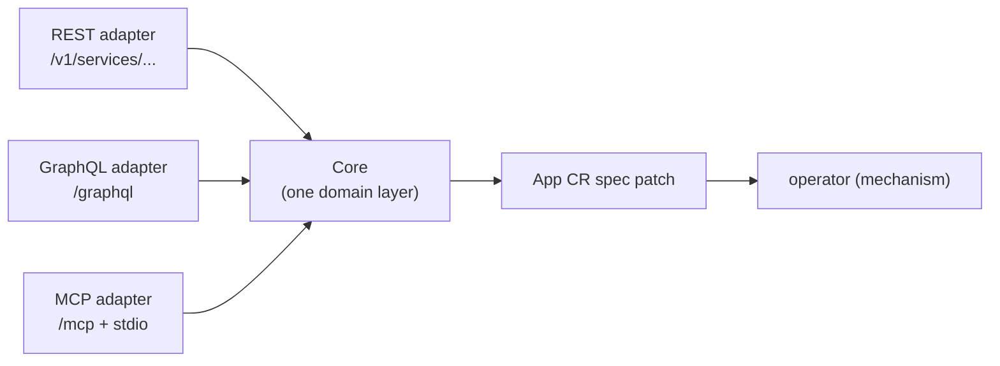

# bex-api — the control-plane seed (REST + GraphQL + MCP)

The product API of the bex control plane (see [ADR003-control-plane.md](ADR003-control-plane.md)): an authenticated HTTP service that turns product actions into **App CR spec patches**. It contains no mechanism — it writes intent; the operator converges it. It exposes the lifecycle verbs from [ADR007-restart-suspend-and-resume.md](ADR007-restart-suspend-and-resume.md) plus logs, metrics, API keys, env vars, and managed Postgres — and, opt-in (`BEX_CP_DB_URI`), the Postgres source-of-truth store itself.

## One core, three adapters

Render exposes a public **REST** API, drives its dashboard with **GraphQL**, and ships an official **MCP** server — all over one internal service layer. bex-api mirrors that shape:



Each verb has exactly one implementation, in its feature package's `Service` (`lego/backend/internal/{apps,logs,metrics,apikeys,postgres,keyvalue,secrets}/service.go`, all embedding the shared kernel `internal/core/base.go`). Each feature ships its own thin adapter fragments — `rest.go`, `graphql.go`, `mcp.go` beside the service — that are pure presentation calling identical `Service` methods, composed by `internal/api/server.go`. So the surfaces cannot drift, and each new client is another thin adapter, not a second implementation.

## Which workspace a request acts in (w6/m14)

A caller belongs to **many** workspaces (w6/m1 create, w4/m12 invites), so every request has to answer "which one am I acting in?" before it can be authorized or its writes stamped. There is exactly one answer, resolved in one place — `core.Base.resolveWorkspace` — and all three surfaces feed it the same way:

- **Named**: the caller says which workspace. REST reads `ownerId` (Render's field: the create body or list query parameter), GraphQL reads an `ownerId` argument, and every workspace-scoped MCP tool accepts Render's per-call `workspaceId`. The adapters bind that value to the request context (`core.WithWorkspace`) before the verb resolves and authorizes it. MCP has no selected-workspace session state.
- **Not named**: the caller's **default** workspace — the **oldest** membership (`store.TenantForIdentity`, `ORDER BY m.created_at, t.id`). Deterministic by construction: a bare join returned an arbitrary row, which is how a multi-workspace caller's "current workspace" could change between two identical calls (w6/m11, live).

A named workspace is honored **only after** `WorkspaceResolver.IsMember` confirms the caller belongs to it. A non-member naming a workspace gets `ErrForbidden` (403) on every surface — never a silent fall-back to their own, which is the confused-deputy shape where a caller asks for B, is served A, and their create lands in the wrong workspace. An unreachable membership store fails closed the same way (`ErrAuthzUnavailable`), for the same reason.

**Render deviation (deliberate):** Render _requires_ `ownerId` on create; bex keeps it **optional**, defaulting to the caller's default workspace, so single-workspace clients need not say it. Everything else — field name, 403 semantics — matches ([ADR018-render-parity.md](ADR018-render-parity.md) row "Create service").

**Reaching a resource in another of your workspaces.** A service is addressed by name, and the name already implies its workspace (the `bex.co/tenant` label), so `core.Base.GetApp` authorizes the calling verb's **relation against the App's own workspace** — Render's model, where permissions come from the resource's owner. That is what lets an owner read a service in their second workspace without a 403 (the m11 bug: the gate compared the App to whichever single workspace the join had picked). It is _not_ mere membership: roles are per-workspace, so an admin of A who is only a **viewer** of B still cannot delete B's service by naming it — `can_create` does not hold for them in B. Membership alone would have been a cross-workspace privilege escalation; `TestMultiWorkspaceTargetingE2E` pins both halves against a live Postgres + OpenFGA.

## Auth

Every route except `GET /healthz` and the two narrowly credential-gated callbacks (`POST /v1/webhooks/git`, authenticated by HMAC, and `GET`/`POST /v1/deploy-hooks/{token}`, authenticated by the secret URL token) requires real, per-client credentials from the auth substrate ([ADR012-auth.md](ADR012-auth.md)) — **there is no shared static token**:

- **API keys (machines)** — an API key _is_ an OAuth2 client (`client_credentials` grant). Exchange it for a short-lived bearer token, then call the API:

  ```sh
  TOKEN=$(curl -s -X POST https://oauth.bex.co/oauth2/token \
    -d "grant_type=client_credentials&client_id=$KEY_ID&client_secret=$KEY_SECRET" | yq .access_token)
  curl -H "Authorization: Bearer $TOKEN" https://api.bex.co/v1/services
  ```

  Tokens are introspected at Hydra's admin API (`BEX_HYDRA_ADMIN_URL`, cluster-internal, required — the binary refuses to start without it; positive results cached ≤ 30s). Keys are managed through the API itself: `POST /v1/api-keys` (the secret is returned exactly once), `GET /v1/api-keys`, `DELETE /v1/api-keys/{id}` — with GraphQL (`apiKeys`, `createApiKey`, `revokeApiKey`) and MCP (`create_api_key`, `list_api_keys`, `revoke_api_key`) parity. "API key" means the Hydra clients bex minted (stamped `bex.co/api-key` metadata): list hides and revoke refuses everything else, so platform clients can't be revoked through this endpoint. The **first** key, `bex-bootstrap`, is deliberately such a platform client — seeded and rotated only by [scripts/auth-bootstrap-client.sh](../scripts/auth-bootstrap-client.sh) (CI runs it on every deploy; secret from `.env`'s `BEX_BOOTSTRAP_CLIENT_SECRET`).

  **Dashboard surface (w4/m8):** a logged-in human mints/lists/revokes keys from Settings → API Keys (`dashboard/src/features/api-keys/`) over this same GraphQL adapter — no separate REST surface for the UI. The list is workspace-shared, not "my keys" (see [ADR012-auth.md](ADR012-auth.md#authorization-openfga) — keys carry no per-user owner), and the secret is shown exactly once at creation, matching the CLI/API contract above.

- **Sessions (humans)** — with no bearer present, an Ory session (cookie or `X-Session-Token`) is validated via Kratos' `whoami` (`BEX_KRATOS_URL` — optional; unset disables sessions). A present bearer is authoritative: an inactive token is 401 with no session fallthrough.

Ory unreachable ⇒ 503 (fail closed; operational recovery goes through kubectl, not this API). The resolved caller (OAuth2 `client_id` or Kratos identity id) is attached to the request context (`api.IdentityFrom`) — the tenant-scoping hook. `BEX_API_CORS_ORIGIN` optionally enables CORS for browser frontends — a comma-separated origin allowlist; the matched request `Origin` is echoed back (credentialed CORS forbids `*`). Prod sets it to `https://dashboard.bex.co,http://localhost:5173` (`lego/operator/config/api/deployment.yaml`) so both the deployed dashboard and a local dashboard dev server (Vite's default port) can call the deployed API; a locally-run bex-api still needs its own `BEX_API_CORS_ORIGIN=http://localhost:5173` since it's a separate deployment. The response carries `Access-Control-Allow-Credentials: true` — required for the dashboard's Kratos-session cookie (or an `X-Session-Token`) to be readable cross-origin at all.

**Authorization** ([ADR012-auth.md#authorization-openfga](ADR012-auth.md)): with `BEX_OPENFGA_URL` set, every Core verb additionally checks the caller's permission against OpenFGA (mapped to Render's workspace-role matrix (viewer/contributor/developer/admin/billing — docs/ADR012-auth.md), on the caller's workspace — `workspace:tea-<id>`, resolved from the control-plane store) — denial is **403**, OpenFGA unreachable is **503**. On in prod since w1/m9 (tenant onboarding: a human's first login mints a workspace, and minted API keys are bound to their tenant); unset ⇒ all authenticated callers may do everything, the pre-authorization behavior used when the store is off (dev, store-off).

## REST (Render public-API compatible)

Shapes verified against Render's OpenAPI spec (`render-public-api-1.json`): the `{service, cursor}` list envelope, the **string** `suspended` enum (`"suspended"` / `"not_suspended"`, _not_ a boolean), and the verb status codes. Public service operations are served only under Render's noun `/v1/services`; the internal control-plane listener separately retains its private `/v1/apps` CRUD contract. Store-managed Apps expose their typed `srv-…` row id; hand-applied Apps fall back to their Kubernetes name.

**Strict request contract (w7/m49).** One complete Render OpenAPI 3.0.2 snapshot is embedded and SHA-pinned in bex-api. After authentication and caller rate limiting, the shared REST gate validates only the intersection of an actual bex mux match and a Render operation; unsupported official routes and retired bex aliases return 404/405, while deliberate bex extensions absent from Render pass through unchanged. kin-openapi checks declared required/type/enum/format/pattern/range/media constraints without injecting defaults; bex additionally rejects undeclared query names, unknown typed JSON fields, trailing JSON, and bodies on no-body operations before a handler can mutate state. Reviewed `dryRun`/`confirm`/service/datastore extensions remain accepted through narrow operation-keyed compatibility rules. Errors use the existing Render-shaped 400 envelope and never include raw kin errors, submitted values, or schema dumps. GraphQL, MCP, public device/HMAC/deploy-hook routes, and production responses are outside this REST request contract; SSE request parameters are validated but the stream is not buffered. Pin provenance, the 119-operation inventory, extension matrix, and manual refresh procedure are in [render-artifacts/openapi-request-validation.md](render-artifacts/openapi-request-validation.md).

| method + path | effect | status |
| --- | --- | --- |
| `GET /healthz` | liveness (open) | 200 |
| `POST /v1/services` | create a service from a repo or image; accepts the official CLI's type-specific details, `image.registryCredentialId`, environment assignment, env vars, and secret files; a same-workspace duplicate `name` is rejected, never upserted | 201 |
| `GET /v1/services` | list `[{service, cursor}]` | 200 |
| `GET /v1/services/{id}` | one service object | 200 |
| `GET /v1/services/{id}/instances` | live Deployment Pods projected as Render `ServiceInstance` objects (`id`, `createdAt`) | 200 |
| `PATCH /v1/services/{id}` | update mutable `name`, repo/image/branch and `image.registryCredentialId`, plan, root/build/start/pre-deploy commands, build filters, auto-deploy, cron schedule/command, static publish directory, health path, notifications, `serviceDetails.maxShutdownDelaySeconds`, or the bex-only idle timeout; omitted fields remain unchanged | 200 |
| `DELETE /v1/services/{id}` | delete the service; the operator's ownerRefs cascade its Deployment/Service/Ingress | 204 |
| `POST /v1/services/{id}/restart` | `spec.restartedAt = now` | 200 |
| `POST /v1/services/{id}/suspend` | `spec.suspended = true` | 202 |
| `POST /v1/services/{id}/resume` | `spec.suspended = false` | 202 |
| `POST /v1/services/{id}/scale` | `spec.replicas = numInstances` | 202 |
| `GET /v1/services/{id}/instances` | Non-terminal Deployment replicas (Render CLI shape); SSH narrows targets to Ready current-image pods | 200 |
| `GET/POST /v1/ssh-keys`, `DELETE /v1/ssh-keys/{id}` | identity-scoped SSH public keys | 200/201/204 |
| `GET /v1/services/{id}/deploy-hook` | reveal or lazily mint the secret deploy-hook URL (sensitive-read permission) | 200 |
| `POST /v1/services/{id}/deploy-hook/regenerate` | rotate the secret deploy-hook URL; the old URL immediately becomes unknown | 200 |
| `GET` / `POST /v1/deploy-hooks/{token}` | trigger a deploy with the URL credential itself; no API key | 200 |
| `POST /v1/cron-jobs/{id}/runs` | cancel an active run, then trigger a replacement; returns the pending `cronJobRun` | 200 |
| `DELETE /v1/cron-jobs/{id}/runs` | cancel the currently active run (Render's current contract) | 204 |
| `GET /v1/cron-jobs/{id}/runs` | list `[{cronJobRun, cursor}]` (`cursor`/`limit`; bex extension) | 200 |
| `GET /v1/cron-jobs/{id}/runs/{runId}` | fetch one stable `crr-…` run (bex extension) | 200 |
| `POST /v1/cron-jobs/{id}/runs/{runId}/cancel` | cancel one pending run; terminal run ⇒ 409 (bex extension) | 200 |
| `POST /v1/webhooks/git` | HMAC-verified push → redeploy (ungated) | 200 |

Verbs return the updated service object (the patch is accepted; the operator converges asynchronously — poll `GET` for `suspended`/`phase`). The service object carries Render's fields (`id`, mutable `name`, `type`, `suspended`, timestamps, source, auto-deploy, environment membership, and type-specific `serviceDetails`, including `maxShutdownDelaySeconds` for web/private/worker services) plus bex extras (`displayName`, `phase`, `replicas`, `revision`) — a superset Render clients safely ignore.

**REST list pagination convention (w1/m42).** When cursor pagination is added to a previously unpaginated REST list, omission of `limit` means Render's default page size of 20, not bex's complete legacy list; values are clamped to Render's 1–100 range, the returned per-item cursor is echoed as `cursor`, and that cursor is exclusive. The result is sorted by a stable unique cursor before slicing, so repeated calls cannot duplicate or skip an item when a store's incidental order changes; an unknown or final cursor returns an empty list. Render's current [Projects list contract](https://api-docs.render.com/reference/list-projects) is the evidence for the default and bounds. `GET /v1/projects` is the first repaired endpoint under this convention; the env-group and custom-domain pagination follow-ups inherit it. Endpoints whose full-list behavior is already documented as a deliberate compatibility divergence—deploys, env vars, jobs, Postgres, and Key Value—retain that exception until separately migrated.

Projects' bex-extension GraphQL and MCP lists accept the same stable project-id `cursor` and clamped `limit` when either argument is supplied. Omitting both keeps their pre-m42 complete-list response so existing dashboard and agent callers do not silently lose projects; REST alone has a Render counterpart and therefore takes the default-20 behavior. MCP also returns the last project id as `cursor`; GraphQL callers echo the final selected `Project.id`.

### Resource metadata contract (w6/m28)

Service, Postgres, and Key Value REST objects share one source of truth for workspace, platform, dashboard, and update metadata. `owner` is the caller-visible workspace resolved from the control-plane tenant store (`{id,name,email?,type:"team"}`), not a resource id relabeled as a workspace; requests batch the distinct owner ids once and omit an owner they cannot resolve or authorize. The existing `ownerId` remains stable on Core, GraphQL, and MCP objects. `region` is the explicit single-region deployment value from `BEX_REGION`; it is omitted when unset (for a Service it lives in `serviceDetails.region`, matching Render's Service schema). `dashboardUrl` is emitted only when `BEX_DASHBOARD_URL` is an absolute URL, and carries Render's own dashboard shapes ([render-artifacts/dashboard-routes.md](render-artifacts/dashboard-routes.md), w5/m39): the type-aware service segment `/{web|worker|pserv|static|cron}/{id}` (unknown types fall back to `web`, matching Render's CLI), `/d/{id}` for Postgres, and `/r/{id}` for Key Value. The dashboard serves those paths as redirect aliases onto its canonical `/services`/`/databases`/`/keyvalue` routes, so every emitted URL resolves. It never falls back to the data-plane app URL or a guessed dashboard host.

`createdAt` remains Kubernetes creation time. `updatedAt` is the latest authoritative mutation time: API writes stamp `app.bex.co/updated-at`, while reconciler-managed legacy objects may use the newest Kubernetes managed-field timestamp. A legacy object with neither source omits `updatedAt`; it never copies `createdAt` and pretends the resource was updated. Every create and mutation path stamps the annotation before writing, so a successful REST mutation advances `updatedAt` immediately and later reads return the same value until the next write. These enrichments are REST adapters over the existing Core views: ids, cursor envelopes, `ownerId`, authorization, GraphQL, and MCP behavior do not change.

**Mutable service label and stable id.** Store-managed services expose the typed `srv-…` id from the CR's `bex.co/app-id` label; every REST verb accepts that id, while store-less/hand-applied Apps retain their metadata name as the fallback id. `PATCH /v1/services/{id}` accepts Render's top-level `name` (and the older bex `displayName` spelling) and stores it in `App.spec.displayName`; the Kubernetes `metadata.name`, platform slug, hosts, and workload names remain unchanged. This preserves the official CLI contract: resolve a mutable name once, then address every later update/instances/delete request by a stable opaque id.

**Live service instances.** `GET /v1/services/{id}/instances` is Render's bare `[{id, createdAt}]` array consumed by the official CLI's `render services instances`. The Core verb resolves and authorizes the App through `AuthorizeApp(can_view)` _before_ listing Pods, then selects the App's physical CR name through `app.bex.co/app` (so a tenant-prefixed CR cannot collide with another workspace's public service name). Pending, Running, and Unknown non-terminating Pods are included; this intentionally shows both sides of an in-progress Deployment rollout. Terminating, Succeeded, and Failed Pods are excluded. Explicitly suspended or observed-`Hibernated` services (including auto-sleep's scale-to-zero state) return `[]` immediately, and `cron_job`/`static_site` return `[]` so Job Pods and the shared static server never masquerade as service replicas. Instance ids extend the public service id with an opaque deterministic hash of the Pod UID; Pod names, UIDs, namespaces, nodes, IPs, labels, and status internals are never serialized.

This is deliberately REST-only: it implements a Render public-API/official-CLI subresource, while Render's official MCP server exposes no service-instance tool and the captured GraphQL/dashboard compatibility surfaces expose service replica intent and observability rather than a separate instance census. GraphQL, MCP, and dashboard therefore gain no invented verb for it; logs/metrics continue to expose their existing per-instance labels through their own shared Core paths.

`POST /v1/services` is create-only, not an upsert: a same-workspace duplicate `name` returns 409, while the globally unique platform `slug` may be suffixed for a cross-workspace collision. Its body follows Render's schema: top-level type/name/repo/branch/image/owner/environment/build filters/auto-deploy/env vars/secret files plus type-specific plan, runtime, replica, health, max-shutdown delay, maintenance mode, build/start/pre-deploy, cron, and static-publish details. Repo-native and Docker builds preserve their runtime and commands; image-backed services preserve the configured image path and optional explicit registry credential. `environmentId` is resolved before the write: an unknown id returns 404, a known environment in another workspace returns 403, and assignment joins the environment's parent project. `secretFiles` are preflighted: with OpenBao configured, their OpenBao values and the projected Kubernetes Secret are prepared before the first App revision is created, so the first pod already mounts `/etc/secrets`; a failed App write aborts both secret stores. Without OpenBao the whole create returns 503 before writing the App. REST, GraphQL, and MCP use this same Core path, and the dashboard create wizard exposes Environment assignment, a repeatable secret-file editor, and a stored-credential picker for existing images. Fields whose platform mechanisms do not exist yet—previews, service IP allow lists, and a Docker source-build registry credential—return 400 when supplied rather than succeeding as no-ops. An input `region` remains a harmless single-region compatibility field; reads report the deployed `BEX_REGION`, not the caller's requested spelling.

**Private-image registry binding (`registryCredentialId`, w6/m31).** Render places the optional string at `image.registryCredentialId` for a prebuilt image. REST create/PATCH, GraphQL `createService(registryCredentialId:)` + `setRegistryCredential`, MCP `create_web_service`/`create_cron_job` + `set_registry_credential`, and the dashboard Existing Image picker all delegate to the same Core resolution. Omission preserves the legacy newest-credential-by-host behavior; a non-empty id pins that exact credential; an explicit empty string clears the binding and suppresses host fallback (the dashboard's “None” option sends this explicit empty value). The resolver first authorizes the service/workspace, then classifies an unknown id as 404, an existing credential owned by another workspace as 403, and a credential whose host does not match the proposed image as 400. Successful intent is persisted on both the control-plane App row and `App.spec.registryCredentialId`; bex materializes the exact credential into the deterministic ownerless `<app>-registry-pull` Secret and projects its reference after CR recreation and every later resync. REST service reads expose Render's canonical `registryCredential: {id,name}` summary and retain `registryCredentialId` as a bex convenience extension. Registry-record CRUD is available only at Render's canonical `/v1/registrycredentials` spelling; the official CLI uses that route to resolve `--registry-credential` before create/update. The current Render/OpenAPI/CLI contract and the one Docker-build divergence are captured in [render-artifacts/registry-credential-service-binding.md](render-artifacts/registry-credential-service-binding.md).

Create returns Render's `{service}` envelope (with no fabricated `deployId`); delete returns Render's **204 with an empty body** and removes the App CR. The operator's ownerRefs cascade the Deployment, Service, Ingress, CronJob, and NetworkPolicy. The one resource left behind is the cert-manager TLS Secret (`<app>-tls*`): its Certificate is owned by the Ingress and dies with it, but cert-manager retains the issued Secret by default. Delete requires the same `can_create` scope as create; with the store on, the service row is deleted first so a projector resync cannot resurrect the CR.

**Service `type`s (Render's serviceType).** `type` picks the service kind and defaults to `web_service` (an HTTP service exposed at a URL). bex covers four of Render's types:

- `web_service` — HTTP service, exposed at `<name>.<BEX_BASE_DOMAIN>` (Deployment + Service + Ingress).
- `private_service` — HTTP service reachable only in-cluster (Deployment + ClusterIP Service, no platform Ingress).
- `background_worker` — runs the image with **no HTTP port**: a bare Deployment, no Service, no Ingress, **no URL**.
- `cron_job` — runs the image's command on a **`schedule`** (5-field crontab, required) as a Kubernetes CronJob (no Deployment/Service/Ingress). An optional **`command`** overrides the image's default entrypoint (`/bin/sh -c <command>`, applied in `cronPodSpec`); empty runs the image's own command unmodified. Both are accepted top-level or under `serviceDetails` (Render's `cronJobDetails.schedule`/`.command`); the service object reports them back with derived `serviceDetails.lastSuccessfulRunAt`. First-class run reads expose `{id, status, startedAt, finishedAt}` with Render's `pending|successful|unsuccessful|canceled` enum; the legacy nested `runs` superset remains for existing clients. `background_worker`/`cron_job` have no ingress, so they cannot carry `domains`. The dashboard's cron Settings tab edits Schedule + Command, while its Events page reads the cursor-paged run API and can cancel a pending row.

**Graceful shutdown (`maxShutdownDelaySeconds`, w6/m25).** Web, private, and background-worker services accept Render's `serviceDetails.maxShutdownDelaySeconds` on create and PATCH: an integer from 1 through 300, default 30. It is stored as optional `App.spec.maxShutdownDelaySeconds` and projected exactly onto the Deployment pod template's `terminationGracePeriodSeconds`; omission leaves that pod field absent because Kubernetes' default is also 30, preserving existing Apps byte-for-byte. Reads report the effective value under `serviceDetails`; cron/static services reject the field with a named 400 because neither owns this long-running Deployment shape. GraphQL mirrors the same Core through `createService(maxShutdownDelaySeconds:)`, `setMaxShutdownDelay(id:, seconds:)`, and `Service.maxShutdownDelaySeconds`; MCP adds `create_web_service.maxShutdownDelaySeconds` plus `set_max_shutdown_delay` (a bex extension — Render's official MCP has no shutdown-delay tool). The dashboard Settings inline editor is visible for the same three service types and enforces the same 1–300 range.

**Maintenance mode (`serviceDetails.maintenanceMode`, w1/m37).** A paid web service accepts Render's exact nested `{enabled:boolean, uri:string}` object on create and PATCH; both keys are required whenever the REST object is present. Reads always return both keys, canonicalizing a legacy/nil App to `{enabled:false,uri:""}`. Empty URI selects the default 503 page; an absolute HTTP(S) URI selects server-fetched custom content, and URLs owned by the same service are rejected. Free plans and every non-web type reject the field before mutation. The state lives at `App.spec.maintenanceMode`; the operator repoints only public Ingress backends to the existing activator responder, leaving the Deployment, pod template, tenant Service, health checks, private DNS, and SSH path untouched. An App outside the responder's namespace gets an App-owned `ExternalName` routing alias because standard Ingress backends are namespace-local; Traefik permits these fixed operator-controlled aliases. Disabling restores the application backend without a deploy. GraphQL exposes `Service.maintenanceMode`, the optional create input, and the bex-extension `setMaintenanceMode`; MCP exposes the same create argument and `set_maintenance_mode`. The dashboard mirrors Render's Settings toggle, confirmation, paid-plan treatment, and custom-page editor. Audit output uses Render's `MaintenanceModeEnabledEvent` plus `metadata.to` and `MaintenanceModeURIUpdatedEvent`; activity and outbound webhooks use the corresponding snake-case types. Exact serving and security choices are pinned in [render-artifacts/maintenance-mode.md](render-artifacts/maintenance-mode.md).

**Cron runs (w2/m36).** The full cron-job design is consolidated in [ADR038-cron-jobs.md](ADR038-cron-jobs.md); the pinned contract and current-Render drift are in [render-artifacts/cron-runs.md](render-artifacts/cron-runs.md). `POST /v1/cron-jobs/{id}/runs` returns the deterministic pending `cronJobRun` and, when status has an active execution, writes cancel-old plus trigger-new intent atomically. `DELETE .../runs` mirrors Render's current cancel-active route. List/get/per-run-cancel are bex extensions because Render's current OpenAPI exposes no historical read endpoints; their standard `{cronJobRun,cursor}` envelope, `crr-…` derived IDs, field names, and error mapping stay Render-shaped. The API only patches `App.spec.runAt`/`cancelRun`; the operator foreground-deletes the exact Job, writes `Canceled` to `status.runs`, and retains terminal history when Kubernetes garbage-collects Jobs. A terminal per-run cancel is 409, never a silent no-op. The CronJob uses `ForbidConcurrent`; a manual replacement waits until the foreground deletion has removed the active Job, preventing even a brief overlap. Service-adjacent cron handlers use only the canonical `/v1/services` route.

```sh
curl -H "Authorization: Bearer $TOKEN" https://api.bex.co/v1/services
curl -X POST -H "Authorization: Bearer $TOKEN" https://api.bex.co/v1/services/eden-cms-v2/suspend
curl -X POST -H "Authorization: Bearer $TOKEN" -H "Content-Type: application/json" \
  https://api.bex.co/v1/services -d '{"name":"hello","repo":"https://github.com/bex/hello","serviceDetails":{"plan":"starter"}}'
```

### Deploy-from-chat (pillar 4)

"Deploy this" is one compiler-backed operation (ADR: [ADR017-deploy-from-chat.md](ADR017-deploy-from-chat.md)). Over MCP the `deploy` tool and REST `POST /v1/blueprints/deploy` take a `{repo, branch, bexYaml}` payload; both call the same stack core. `scripts/app-apply.sh` is a thin authenticated REST client, never a YAML-to-CR compiler. `create_web_service` is the equivalent single-service operation with structured args (a `repo` or `image`). A later push closes the loop through the webhook below.

#### `render.yaml` — the Blueprint manifest (w1/m24)

`render.yaml` is canonical. `bex.yml` remains an identical-grammar filename-only fallback for discovery (with a migration warning); implicit discovery refuses a repository containing both. A Blueprint accepts Render's root resource lists — **`services:`**, **`databases:`**, and **`envVarGroups:`** — plus its canonical grouping blocks: **`projects[].environments[]`**, where an environment directly contains those same resource lists, and root **`ungrouped:`**. Key Value resources use Render's service-list vocabulary (`type: keyvalue`, with Render's still-supported deprecated `redis` spelling also accepted), not a bex-only top-level list. The retired `apps:` root and service fields `tier`, `replicas`, `port`, `imagePath`, and `publishPath`, plus bare-string `image`, are rejected with the canonical replacement named in the validation error. One `deploy` call creates or resolves the declared Projects and Environments, applies their ACL metadata, then converges env groups, databases, Key Value instances, and services. Environment-scoped resources carry their project/environment association from their first write; ungrouped resources carry neither. Each resource is an idempotent upsert (re-applying an unchanged file is a no-op: zero spec diff, zero new deploy records, no restart). **All-or-nothing validation**: every entry validates before any write — one invalid entry rejects the whole apply with a per-entry error, nothing partially created (including a `fromGroup` naming a group neither declared in-file nor pre-existing in the workspace). A validation plan is `current_state` when the caller's complete non-secret App/Postgres/Key Value state can be resolved: it returns only create/update/no-op actions, resource ids, source paths, and changed field names. When a write-only secret-backed dependency prevents that comparison (currently `envVarGroups`), the plan is explicitly `structural`; neither mode exposes environment values.

Render's create-service JSON and Blueprint YAML are different contracts. `secretFiles` and direct `environmentId` are valid create-service fields, but neither is a service field in Render's Blueprint schema; environment membership is expressed by nesting the resource under `projects[].environments[]`. A `render.yaml` that supplies either direct field is rejected by field name (secret contents are never included in the error) rather than accepted as a bex-only dialect. Environment-scoped `envVarGroups` use the same normalized grouping path as root groups.

`fromDatabase: {name, property}` is the one first-class DB→service linkage (the dashboard picker is a [DO_NOT_DO](../.pm/DO_NOT_DO.md)). The Blueprint name is resolved to the Database's immutable id before it becomes a **`secretRef` into the CNPG `<database-id>-app` connection Secret** — never a plaintext copy (survives credential rotation and resource rename; nothing sensitive in `render.yaml` or the App spec). `property` maps onto the CNPG app-Secret vocabulary: `connectionString`→`uri`, `host`→`host`, `port`→`port`, `user`→`username`, `password`→`password`, `database`→`dbname`. A target declared in the file wins; otherwise it must resolve uniquely in the caller's workspace before any write, and an unknown, ambiguous, or foreign target fails without exposing its identity. The corresponding `fromService` Key Value form uses the same workspace-scoped, SecretRef-only lookup. A `fromService` web/private `host` may likewise resolve an existing authorized workspace service to its slug; `port`, `hostport`, and `envVarKey` remain same-file-only until their distinct source-value contracts have an equally safe resolution. The operator's slug-named Service makes a resolved host addressable in-cluster (a store-managed App's CR/Service name is `<tenant>-<name>`, so the bare service name matches no Service; legacy slug-less CRs fall back to the CR name, byte-identical to the old bare-name injection — [ADR041-service-addresses.md](ADR041-service-addresses.md) D3, w9/m57).

**Env-vars completeness (w1/m35).** The five render.yaml env forms bex once rejected now apply. **`envVarGroups:`** materializes a bex env group per named block (create-if-absent, reconcile vars on re-apply — literals re-sync, `generateValue` mints once), riding the m16 env-groups feature; a service links one with a keyless **`{fromGroup: <name>}}`** (all of the group's vars), referencing a group declared in the same file **or** pre-existing in the workspace. **`sync: false`** and **`generateValue`** seed the mutable env-vars store **SEED-ONCE** — never `spec.env` — so a later dashboard edit (via the env-vars API) wins and a re-`sync` overwrites neither (Render's "dashboard value wins" for `sync:false`; a generated secret is not re-minted). `generateValue` mints Render's shape: a base64-encoded 256-bit value. A group may not carry `sync:false` or reference services/other groups (Render's rule — rejected per-entry, never silently dropped). These forms need OpenBao wired (`BEX_OPENBAO_URL`); a manifest using them against a store-less deployment is rejected before any write, not partially applied.

**Field ledger (render.yaml → bex):**

| render.yaml field | bex | note |
| --- | :-: | --- |
| root `services`, `databases`, `envVarGroups` | ✅ | canonical ungrouped root stack lists; `apps:` is rejected |
| `projects[].environments[]`, `ungrouped` | ✅ | canonical Render grouping; nested services, databases, Key Value entries, and env-var groups get project/environment membership on their first write |
| service `name`, `type` (`web`/`pserv`/`worker`/`cron`), `runtime: static` | ✅ | `type`+`runtime` map to the App serviceType (`pserv`→private, `web`+`static`→static_site) |
| `repo`, `branch`, `rootDir`, `healthCheckPath`, `schedule`, `domains` | ✅ | 1:1 (build-from-git + custom domains) |
| `plan`, `numInstances` | ✅ | canonical render.yaml spellings; `tier`/`replicas` are rejected |
| `image: {url}` | ✅ | prebuilt image; a bare image string is rejected. Source-build and git-push fields (`repo`, `branch`, `rootDir`, build filters/commands, Dockerfile path, and auto-deploy settings) are rejected with their source paths rather than stored as no-ops. |
| `staticPublishPath` | ✅ | static-site publish dir; `publishPath` is rejected |
| `envVars: {key,value}` | ✅ | literal env |
| `envVars: {key, fromDatabase}` | ✅ | → secretRef (above) |
| `envVars: {key, fromService}` (host/port/hostport) | ✅ | → literal |
| `databases`: `name`/`plan`/`diskSizeGB`/`postgresMajorVersion`/`ipAllowList`/`readReplicas`/`highAvailability` | ✅ | → Database CR spec |
| service `type: keyvalue` / `redis` | ✅ | → KeyValue CR spec; may be root, environment-scoped, or ungrouped |
| `autoDeployTrigger` | ◐ | `commit`→on and `off`→off; `checksPass` is explicitly rejected because bex has no CI-check gate |
| `preDeployCommand` | ◐ | → `App.spec.preDeployCommand` for web/private/worker services; explicitly rejected for cron jobs and static sites, which have no pre-deploy phase |
| `buildFilter` (`paths`/`ignoredPaths`) | ✅ | → `App.spec.buildFilter` (w1/m34): Render's Build Filters — repository-root-relative globs gating git-push auto-deploys (empty `paths` = every path; `ignoredPaths` wins over `paths`); malformed globs rejected at parse |
| `maintenanceMode: {enabled, uri?}` | ✅ | → `App.spec.maintenanceMode` (w1/m37), paid web services only; omitted `uri` means the default page; omission of the whole field preserves an API/dashboard edit on re-sync |
| `envVarGroups:` + `envVars: {fromGroup}` | ✅ | → bex env groups (w1/m35): a group block materializes an m16 env group by name (create/reconcile; `generateValue` mints once); a keyless `{fromGroup: <name>}` links all of the group's vars. Needs OpenBao |
| `generateValue`, `sync: false` | ✅ | → seeded SEED-ONCE into the mutable env-vars store (w1/m35), never `spec.env`, so a dashboard edit wins and re-`sync` neither overwrites nor re-mints. `generateValue` = base64 256-bit (Render's shape). Needs OpenBao |
| `fromService.envVarKey` | ✅ | → copies a sibling service's declared var by value (w1/m35, same-file resolution) |
| keyvalue `fromService`, generated-value copy across services | ◐ | Key Value `fromService` resolves to an authorized SecretRef for `connectionString`/`host`/`port`/`password`; copying a not-yet-minted `generateValue`/reference across services remains explicitly rejected |
| `maxShutdownDelaySeconds` | ✅ | (w10/m2) → `App.spec.maxShutdownDelaySeconds`, same 1–300 validation as REST/GraphQL/MCP (w6/m25); closes the Blueprint parser omission this row previously recorded |
| Postgres `databaseName`, `user` | ✅ | create-time physical database/owner identity; validated with the same contract as REST/GraphQL/MCP and immutable after creation |
| capability registry and conditional fields | ◐ | the pinned [capability registry](../lego/backend/internal/apps/schema/capabilities.json) is authoritative. Persistent service disks, previews, per-resource regions, Docker build context, Blueprint registry credentials, static-site `buildCommand`, `previewValue`, and `checksPass` are field-specific pre-write refusals. `scaling`, `ipAllowList`, and `renderSubdomainPolicy` are accepted only for service kinds the operator applies; unsupported kind/field combinations are rejected rather than stored as no-ops. `initialDeployHook` runs once on first deploy; on service and cron resources `buildCommand` requires a native runtime, while `startCommand` follows the runtime launch contract. |
| sync-delete of removed entries | ✖ | documented divergence — bex v1 does not delete resources absent from the file |
| direct service `environmentId`, `secretFiles` | ✖ | rejected: these belong to Render's create-service body, not its Blueprint service schema; use `projects[].environments[]` for membership |
| `previews` (PR preview environments) | ✖ | non-goal (explicitly rejected, [DO_NOT_DO](../.pm/DO_NOT_DO.md)) |

The REST surface has **no bespoke `/v1/deploy`**: a stack rides the same per-resource upsert paths (`POST /v1/services` × N, `POST /v1/postgres` × M, `POST /v1/key-value` × K); `scripts/app-apply.sh` is the scripted form. GraphQL has no stack mutation (the dashboard has no consumer, and a Blueprint UI is a DO_NOT_DO). The MCP `deploy` tool returns `{services:[…], databases:[…], keyValues:[…]}` — a single-service file returns a one-element `services` list.

### Deploy history + trigger (w2/m5, Render `/deploys` compatible)

Every rollout of a store-managed App (`BEX_CP_DB_URI`) is a row: `GET /v1/services/{id}/deploys` (the `{deploy, cursor}` list envelope, newest first) and `GET /v1/services/{id}/deploys/{deployId}` are Render's `list_deploys`/`get_deploy` REST equivalents; `POST /v1/services/{id}/deploys` (201) triggers a fresh deploy. Render's trigger body may carry `clearCache` — `false` is a no-op and `true` is rejected because bex cannot truthfully clear every builder cache. A suspended service refuses the trigger, **409**.

The row begins `created` when no release is executing, or `queued` when it is the latest pending overlap, and advances only when the backend observes evidence for a later state. The operator remains DB-free: the control-plane reconciler projects the current App generation's `Ready` reason and phase plus generation-scoped `status.preDeploy` onto Render's eleven-value vocabulary: `created`, `queued`, `build_in_progress`, `build_failed`, `pre_deploy_in_progress`, `pre_deploy_failed`, `update_in_progress`, `update_failed`, `live`, `deactivated`, and `canceled`. Sampling may skip a fast intermediate phase, but the explicit transition table rejects regressions and mutations out of terminal states. `live -> deactivated` is the sole terminal exception: when a newer deploy reaches `live`, the store changes the previous live row to `deactivated` in the same transaction. Overlapping triggers keep the executing row open and atomically replace only the previous queued row; a per-App row lock plus separate partial unique indexes enforce one active and one latest-pending deploy. The reconciler retains both rows, applies App evidence only to the matching release generation, records the active row `live`, and later advances the queued row when the operator adopts it. This matches Render's documented **Wait** overlap policy while preserving the same status enum on REST, GraphQL, MCP, and the dashboard ([Render overlap docs](https://render.com/docs/deploys#handling-overlapping-deploys)).

Timestamp semantics are row-backed rather than adapter inference. `createdAt` is row creation; `updatedAt` starts at the same instant and advances only when the status or `preDeployStatus` actually changes; `startedAt` is the first observed executing phase (not merely `created`/`queued`); and `finishedAt` is the first terminal instant. Deactivation retains the prior deploy's original `finishedAt` (when it reached live) and advances `updatedAt` to the later replacement instant. Repeated observations and rejected regressions change no timestamp. `preDeployStatus` remains the step's detailed `running`/`succeeded`/`failed` outcome; the top-level status now independently identifies a pre-deploy failure as `pre_deploy_failed` instead of collapsing it into rollout failure.

REST, GraphQL, and MCP expose the same stored deploy fields and filters through one translator: repeatable `status`, exclusive `createdBefore`/`createdAfter`, `updatedBefore`/`updatedAfter`, and `finishedBefore`/`finishedAfter`, plus `cursor` and `limit`. Malformed timestamps fail as bad requests/tool errors and are never silently dropped. The dashboard shows the current stored state at `updatedAt`, preserves the earlier live instant for a deactivated deploy, polls all five open states, and stops on all six terminal states. This is **store-only**: a hand-applied App (no control-plane row) has empty history, and with the store off entirely every verb is **503** (omitted, not faked — the env-vars precedent). The feature package is `lego/backend/internal/deploys`; transition persistence belongs to `lego/backend/internal/store`.

```sh
curl -H "Authorization: Bearer $TOKEN" https://api.bex.co/v1/services/eden-cms-v2/deploys
curl -X POST -H "Authorization: Bearer $TOKEN" https://api.bex.co/v1/services/eden-cms-v2/deploys
```

### Service events — the activity feed (w3/m7, Render `/events` compatible)

`GET /v1/services/{id}/events` answers "what happened to my service?" — one paged, newest-first view over three durable sources. `deploys` projects `deploy_started` at `created_at` and terminal `deploy_ended` at `finished_at`; `audit_events` projects accepted API intent and configuration writes using its typed `target`; and `service_event_facts` stores the closed set of operator-observed and signed-Git decisions that are neither a deploy timestamp nor an authorization audit. Current audit writes target the namespace-unique App CR name, not the workspace-local public name, so an unbound platform caller cannot merge every tenant's `web` history; the reader accepts legacy public-name targets only inside the service's owning workspace. The fact table has a checked type enum and dedicated scalar columns—no JSON, generic message, or value field. The DB-free operator only reports typed status on the App CR; bex-api's existing control-plane reconciler observes that status and appends/checkpoints facts transactionally. Feature package: `lego/backend/internal/events`; persistence and composition: `lego/backend/internal/store`.

The request matches Render's OpenAPI (`list-events`) field-for-field: `type` (one event type), `startTime` (**defaults to one hour ago**, Render's own API default), `endTime`, `cursor`, and `limit` (20, clamped to 100). The response is Render's bare array of `{event, cursor}`, where `event` is `{id, timestamp, serviceId, type, details}`. Event ids are stable `evt-…` values derived from the source key. The cursor is the opaque `(timestamp, source key)` keyset, so interleaved deploy, audit, and fact pages have no offset gap or duplicate. The dashboard does not inherit the one-hour API default: Events begins with a bounded 30-day window and cursor-loads pages, then steps through preceding bounded windows down to service creation; Metrics sends its selected chart range and auto-pages it. Neither client issues an unbounded history query.

Render's companion `GET /v1/events/{eventId}` returns one bare `{id, timestamp, serviceId, type, details}` object. bex materializes each derived `evt-…` identity in a durable `(workspace_id,event_id)` lookup index as deploy, allowed audit, or typed-fact rows become publicly observable; the migration backfills the same keys for existing rows, so retrieval never reverse-scans and hashes an unbounded feed. The lookup authorizes `can_view` on the caller's effective workspace and fetches by that workspace plus event ID; a missing ID and an ID owned by another workspace both return the same 404, while an unwired store returns 503. The service-list and global reads reuse one source translator and one REST serializer, so shared fields cannot drift. GraphQL `serviceEvent(id:)` and MCP `get_service_event` are bex extensions over that same core read.

The typed fact source adds `image_pull_failed` (immediate current-release observation with deploy/image plus bounded reason, independent of the deploy's retry timeout), observed `service_suspended`/`service_resumed`, `server_failed`/`server_available`, `autoscaling_started`/`autoscaling_ended` (REST `fromInstances`/`toInstances`), `commit_ignored` (bounded skip/filter reason plus commit id/validated URL), and the explicit bex extension `branch_changed` (typed from/to). Existing intent events `suspender_added`/`suspender_removed` remain separate, producing the same accepted-intent then observed-convergence pairing visible in Render's dashboard. `plan_changed`, `instance_count_changed`, `autoscaling_config_changed`, and auto-deploy events retain their typed details. The exact supplied 31-label dashboard matrix, official wire vocabulary, and deliberate omissions are captured in [render-artifacts/service-events.md](render-artifacts/service-events.md).

**No env or secret value can appear in an event, by construction.** Audit rows have no verb-arguments object; facts have only checked reason codes and dedicated non-secret identifiers/counts/branch/image columns; raw Kubernetes condition messages and Git commit messages are never copied. Store-less (`BEX_CP_DB_URI` unset) all three sources are unavailable, so the endpoint remains **503**, never a misleading empty history. Facts use occurrence time in the service feed, while outbound-webhook dispatch separately tails `recorded_at`; an older operator observation inserted after the webhook watermark is therefore delivered once with its original timestamp instead of being skipped.

```sh
curl -H "Authorization: Bearer $TOKEN" \
  "https://api.bex.co/v1/services/eden-cms-v2/events?startTime=2026-07-11T00:00:00Z&limit=50"
```

The list contract is proven by `scripts/events-verify.sh`, the real-Postgres `TestPGStore`, cross-adapter `TestEventSurfaceParity`, operator transition tests, and dashboard range/paging/filter tests. The CAPD harness passed on 2026-07-18 with a 24-event feed covering intent plus observed suspend/resume, deploy failure/recovery, source-control decisions, autoscaling start/end, stable cursors, retry idempotency, a planted env-value sentinel, adapter parity, store-less 503 behavior, and cleanup. The by-ID contract adds source/backfill/authorization fixtures plus the hydration leg in `scripts/webhooks-verify.sh`; that script is executable evidence and is not described as a live m24 pass until it is run against a caller-supplied public receiver.

### Push-to-deploy webhook

`POST /v1/webhooks/git` is the git-host push webhook. It sits **outside the OAuth gate** — a git host can't present a bearer token, so its authentication is an HMAC-SHA256 signature over the raw body (`X-Hub-Signature-256: sha256=<hex>`, GitHub/Gitea style) verified in constant time against the shared secret `BEX_WEBHOOK_SECRET`. A valid push redeploys every App whose `spec.repo` matches the pushed repository (compared across the payload's clone/ssh/html/api URL forms, canonicalized) and whose tracked branch matches the pushed ref; an absent or mismatched signature is **401** with no action, and an unset secret makes the endpoint **503**.

### Deploy hooks (w2/m33)

Every service can expose a stable, rotatable secret URL for CI systems that cannot or should not hold a general API key. An authorized sensitive read lazily mints a 256-bit `crypto/rand` token and persists it in the App's `bex.co/deploy-hook-token` annotation. A separate `bex.co/deploy-hook-token-digest` label contains only its SHA-256 digest, letting the identity-less trigger perform an exact cluster-scoped label query instead of listing every tenant App. Startup backfills that index for existing valid tokens before the public route serves. Annotation storage avoids a CRD/operator change and keeps the credential next to either a store-projected or hand-applied App, while tenants still have no Kubernetes credentials with which to read it. Triggering inherits the existing deploy-history feature's honest availability rule: the App must be store-managed and `BEX_CP_DB_URI` must be configured; otherwise it returns the same 400/503 as authenticated `triggerDeploy` rather than inventing an unqueryable deploy id. `BEX_API_PUBLIC_URL` supplies the externally reachable origin (`https://api.bex.co` in the production manifest); when it is unset the management surfaces return the stable relative path.

The authenticated management shape is identical everywhere: REST `GET /v1/services/{id}/deploy-hook` and `POST /v1/services/{id}/deploy-hook/regenerate`, GraphQL `deployHook(serviceId)` and `regenerateDeployHook(serviceId)`, and MCP `get_deploy_hook` / `regenerate_deploy_hook` all return `{url}`. Rotation replaces the annotation with an optimistic-lock patch, so a concurrent first read cannot publish two competing credentials; calls made with the old URL after rotation complete collapse to the same **404** as any malformed or unknown token. The dashboard Settings page masks the value until reveal, copies it without reformatting, and warns that regeneration breaks existing integrations.

The open trigger accepts both `GET` and `POST /v1/deploy-hooks/{token}` and calls the same `deploys.Service` implementation as authenticated `triggerDeploy`: it bumps the App generation and opens a deploy-history row with trigger `deploy_hook`. Success mirrors Render's `200 {"deploy":{"id":"dep-…"}}`; suspended services return 409. Render's `ref` query parameter maps to the existing commit override. `imgURL` is rejected with 400 until bex has a safe registry-origin matching/override verb—never silently ignored.

**Rate limits:** an IP-keyed outer bucket (`BEX_DEPLOY_HOOK_LOOKUP_RATE_LIMIT`, default 60/minute; burst 10) wraps the public prefix and sheds random-token floods before validation or Kubernetes lookup. After that, the open endpoint has its own per-token, in-process bucket: six requests/minute with a burst of two, then **429** plus `Retry-After`; this check also runs before the digest lookup. Neither consumes or depends on the authenticated `BEX_RATE_LIMIT` caller bucket. Both are replica-local.

**Render parity and deliberate drift.** [Render's Deploy Hook documentation](https://render.com/docs/deploy-hooks) confirms the secret URL, GET/POST methods, `{deploy:{id}}` response, `ref`, rotation, and dashboard placement. Render spells its URL `/deploy/{serviceId}?key=…`, reports a bad key as 401, and exposes the credential only in its dashboard. bex uses an opaque-token-only path and 404 for malformed/unknown/stale credentials so it does not disclose whether any service id exists; it additionally exposes authenticated REST/GraphQL/MCP management surfaces, required for an AI-native control plane. bex models the overlapping deploy as a returned `queued` deploy object but does not mirror Render's optional deploy-hook-only `202` response without an id.

### Outbound event webhooks (w3/m11, Render `/webhooks` compatible)

The other direction — bex → you (`internal/webhooks`, [ADR018-render-parity.md § Platform events & integrations](ADR018-render-parity.md)): a workspace registers a destination URL + event-type subscription, and bex POSTs a signed, thin payload (`{type, timestamp, data: {id, serviceId, serviceName, status?}}`) when a subscribed transition happens. The receiver verifies the Standard Webhooks signature, then uses the equal `webhook-id`/`data.id` value at authenticated `GET /v1/events/{eventId}` when it needs the full typed details. **No parallel emitter or payload store**: the delivery worker tails the same deploy, audit, and typed fact sources through a durable insertion-order watermark, fanning each event out as `webhook_deliveries` rows retried in place. Observed service availability, image pull, autoscaling, ignored commit, branch facts, and the supported managed-datastore audits therefore carry the same indexed event identity that REST/GraphQL/MCP hydrate. Managed-datastore writes with official, sourceable Render counterparts remain fixed post-success audit effects. The exact datastore vocabulary is pinned in [render-artifacts/datastore-webhook-events.md](render-artifacts/datastore-webhook-events.md); service-event vocabulary is in [render-artifacts/service-events.md](render-artifacts/service-events.md).

Signing is Standard Webhooks (`webhook-id`/`webhook-timestamp`/`webhook-signature`, HMAC-SHA256 over `id.timestamp.body` with the `whsec_…` secret minted once at creation). Render's documented delivery budget is 2xx within 15 seconds and **at most eight attempts total** on exponential backoff (the initial attempt plus seven retry delays, with bex's final attempt at 32h40m30s; override with `BEX_WEBHOOK_BACKOFF` for dev/verification), with a failure-notice email after the third consecutive failure and auto-disable only after exhaustion. Endpoint management is one Core, three adapters: REST `GET/POST /v1/webhooks`, `GET/PATCH/DELETE /v1/webhooks/{id}`, and `GET /v1/webhooks/{id}/events`, with the canonical REST `eventFilter` request/response field, plus `GET /v1/webhooks/event-types`; GraphQL `webhookEndpoints`/`webhookEndpoint`/`webhookDeliveries`/`webhookEventTypes` queries + create/update/enable/delete mutations retain their GraphQL-native `eventTypes` field; MCP `list_webhook_endpoints`, `list_webhook_deliveries`, and create/update/delete endpoint tools are a bex superset because Render's own MCP has no webhook tools. Writes are admin-tier (`can_manage`), reads member-tier (`can_view`); the store-off mode 503s (`ErrWebhooksUnavailable`), never fakes. The signing secret is an intentional mint-once divergence: bex returns it on create only, whereas Render's shared OpenAPI response schema includes it on later reads. The dated event enum, supported non-secret REST schema, retry contract, retrieval contract, verification evidence, and unsupported-family dispositions are pinned in [render-artifacts/webhooks-api.md](render-artifacts/webhooks-api.md). Contract coverage includes the Render fixtures, source-index/backfill and authorization tests, the real-store two-worker signed-delivery test, and datastore write → audit row → Render payload tests; `scripts/webhooks-verify.sh` now connects a real delivery to its full event, but requires an actual public-tunnel run before that leg is claimed live.

**Bounds (w1/m67 F2 + F3).** Every event is fanned out across every enabled endpoint of its workspace by a worker shared with every other tenant, and `webhook_deliveries` is simultaneously the durable queue and the dashboard's history view. Both dimensions were unbounded, so an ordinary workspace admin could grow shared work and shared storage persistently, at no cost to themselves:

| Bound | Value | Notes |
| --- | --- | --- |
| Endpoints per workspace | 25 | Enforced in the same transaction as the insert (`FOR UPDATE` over the workspace's rows), so two concurrent creates cannot both take the last slot. Refused with `WEBHOOK_ENDPOINT_LIMIT` on REST, GraphQL, and MCP alike. |
| Terminal delivery age | 90 days (`BEX_WEBHOOK_RETENTION_DAYS`) | Delivered or retries-exhausted rows only. |
| Terminal deliveries per endpoint | 1000 (`BEX_WEBHOOK_RETENTION_KEEP`) | Stops a burst inside the age window from evading the age rule. |

The sweep rides the existing worker tick (at most hourly), deletes in bounded batches with `FOR UPDATE SKIP LOCKED` so two replicas cooperate rather than collide, and **never** touches a delivery still pending or retryable. It also runs for workspaces with no enabled endpoints — deleting the last endpoint previously stranded its whole history forever.

## GraphQL (Render dashboard compatible)

`POST /graphql`, mirroring the operation names captured from Render's dashboard: queries `services`, `server(id)`, plus the bex extension `instanceTypes` (backs the dashboard's plan picker); mutations `suspendService(id)`, `resumeService(id)`, `restartServer(id)`, and the bex extensions `setDisplayName(id, displayName)`, `updateServicePlan(id, plan)`, `scaleService(id, numInstances)`, `setIdleTimeout(id, idleTTLSeconds)` (the free-tier auto-sleep window — no Render counterpart, w1/m4.5), `setMaxShutdownDelay(id, seconds)`, `createService(name, type?, schedule?, command?, repo?, image?, branch?, plan?, port?, replicas?, maxShutdownDelaySeconds?)` (create-only since w4/m19 — a same-workspace duplicate `name` errors rather than upserting; its name/shape unconfirmed against a live Render capture, like the two before it), and `deleteService(id)` (delete the service, returning a success boolean like `deleteCustomDomain` — there is no object left to return). Cron-run parity adds `cronJobRuns(serviceId,cursor,limit)` / `cronJobRun(serviceId,runId)` and `runCronJob(id)` / `cancelCronJobRun(serviceId,runId)`, all returning `CronRun { id status startedAt finishedAt }`; `Service.lastSuccessfulRunAt` mirrors the REST cron details field. Type `Service` keeps the legacy nested `runs` field for existing clients. Every resolver delegates to the same feature `Service`.

`deploys(serviceId, status, createdBefore, createdAfter, updatedBefore, updatedAfter, finishedBefore, finishedAfter, cursor, limit)` reads a service's deploy history for the dashboard's Deploys/Events tab: type `Deploy { id status trigger image createdAt updatedAt startedAt finishedAt preDeployStatus }`, with the same store-only/503-without-`BEX_CP_DB_URI` rule and filter semantics as REST/MCP. `deploy(serviceId, deployId)` reads one row. `triggerDeploy(serviceId, commitId?, deployMode?)` starts one through the same service verb. Deploy-hook management adds `deployHook(serviceId) { url }` and `regenerateDeployHook(serviceId) { url }`; the unauthenticated trigger remains an HTTP URL by design, not a GraphQL operation.

`serviceEvents(serviceId, type, startTime, endTime, cursor, limit)` is the activity feed for Events and Metrics: `ServiceEvent.details` includes deploy/actor/trigger fields plus bounded `reasonCode`, `instanceId`, autoscaling `fromCount`/`toCount`, branch `branchFrom`/`branchTo`, and `commitUrl`. It has the same arguments, defaults, ids, and event set as REST and MCP because all three call one `events.Service.List`; `TestEventSurfaceParity` exercises a typed fact across every adapter. `serviceEvent(id:)` returns the same type by global event ID and uses `events.Service.Get`, shared with REST `GET /v1/events/{eventId}` and MCP `get_service_event`; absent and foreign IDs share the authorization-safe not-found result.

```sh
curl -X POST https://api.bex.co/graphql \
  -H "Authorization: Bearer $TOKEN" -H "Content-Type: application/json" \
  -d '{"query":"mutation { suspendService(id:\"eden-cms-v2\") { id suspended phase } }"}'
```

```graphql
query {
  services {
    id
    type
    suspended
    url
    phase
  }
}
mutation {
  restartServer(id: "eden-cms-v2") {
    id
    phase
  }
}
```

## Managed Postgres (Render `/v1/postgres` compatible)

CRUD + connection-info for the `Database` CR, shaped to Render's Postgres API (see [ADR009-postgresql-management.md](ADR009-postgresql-management.md)):

| method + path | effect | status |
| --- | --- | --- |
| `GET /v1/postgres` | list managed Postgres | 200 |
| `POST /v1/postgres` | create (body includes name, plan, version, diskSizeGB, databaseName, databaseUser, public, ipAllowList, pooler) | 201 |
| `GET /v1/postgres/{name}` | one instance (Render `postgres` shape) | 200 |
| `PATCH /v1/postgres/{id}` | partial update, including mutable display-name rename | 200 |
| `DELETE /v1/postgres/{id}` | delete (cascades CNPG Cluster + PVC + route) | 204 |
| `GET /v1/postgres/{id}/connection-info` | password + internal/external (+ pooled) strings + psql | 200 |
| `POST /v1/postgres/{id}/query` | execute one timed, row-capped statement (body: sql, allowWrites=false) | 200 |
| `POST /v1/postgres/{id}/suspend` · `/resume` | hibernate / wake the CNPG cluster (data kept) | 202 |
| `POST /v1/postgres/{id}/restart` | rolling restart of the primary | 200 |
| `GET`/`POST /v1/postgres/{id}/recovery-info` | PITR window (earliest/latest) + backup list | 200 |
| `POST /v1/postgres/{id}/recover` | restore to a **new** instance at a point in time (body: name, targetTime, plan, version) | 201 |
| `GET`/`POST /v1/postgres/{id}/export` | list / trigger portable logical exports (short-lived download URL) | 200 / 202 |
| `GET`/`PUT /v1/postgres/{id}/ip-allow-list` | read / replace the external-endpoint CIDR allowlist | 200 |
| `GET`/`POST /v1/postgres/{id}/users` · `DELETE …/users/{user}` | list / create (returns password once) / delete managed login roles | 200 / 201 / 204 |

`connection-info` is the key endpoint — it's how a frontend gets the connection string without cluster access. It's the **only** place the DB password is surfaced (read from CNPG's `<id>-app` Secret at request time, authed), matching Render's `postgresConnectionInfo` (`password`, `internalConnectionString`, `externalConnectionString`, `psqlCommand`); when a PgBouncer `Pooler` is on it also returns `internalConnectionPoolString` / `externalConnectionPoolString`.

**Noun split, mirroring Render** (verified: REST spec + dashboard GraphQL captured via Playwright): Render's REST uses `postgres` (`/v1/postgres`) but its **dashboard GraphQL uses `database`** (`database(id)`, `databaseStatusQuery`, `databaseCredentialList`). bex matches both — REST `/v1/postgres`, GraphQL `databases` / `database(id)` / `databaseConnectionInfo(id)` queries and `createDatabase` / `renameDatabase` / `deleteDatabase` mutations (which also matches bex's own `Database` CRD). Every resource uses an immutable `dpg-…` id and required mutable `spec.name`; w1/m56 retired the temporary metadata-name compatibility path after fleet normalization.

**Create-time SQL identity (w6/m38):** optional `databaseName` and `databaseUser` are accepted by REST, GraphQL `createDatabase`, MCP `create_postgres`, Blueprint Postgres entries (`databaseName`/`user`), and the dashboard. Both are validated by one PostgreSQL-identifier contract and stored on the CR as immutable intent; each omission defaults independently from the immutable `dpg-…` id. Recovery preserves the source's effective pair. Render's Datadog fields are a deliberate non-goal: supplying either API key or site on create or update returns a named 400 before any write, rather than silently succeeding.

**Datastore list pagination (w8/m13):** `GET /v1/postgres` and `GET /v1/key-value` return Render's bare arrays of `{postgres|keyValue, cursor}` items. Supplying either `cursor` or `limit` enables stable id-ordered, exclusive-cursor pages (`limit` defaults to 20 and is clamped to 1–100); an unknown or final cursor returns an empty page. Omitting both parameters preserves bex's pre-pagination full-list body and order. The bex top-level GraphQL lists `databases(cursor, limit)` and `keyValues(cursor, limit)` use the same page boundaries but deliberately keep their existing `[Database]` / `[KeyValue]` result types: Render's dashboard has no equivalent top-level paged list, and changing the result envelope would break the first-party dashboard's existing selections. Omitted GraphQL args likewise return the complete list. Render's official MCP `list_postgres_instances` and `list_key_value` tools accept the shared optional `workspaceId` and hide REST pagination by returning all instances; bex matches those signatures and behavior. The retired `list_key_value_instances` bex alias is not registered.

**Three adapters:** managed Postgres is served over all three surfaces. **MCP** (Render official-server names): `list_postgres_instances`, `get_postgres` (`{postgresId}`) and `create_postgres` delegate to the same `List`/`Get`/`Create` Core verbs as REST/GraphQL, plus `query_render_postgres` (run a read-only SQL query) and the bex extension `rename_postgres`. The official Render query tool remains read-only and MCP-only: bex's tool keeps that boundary and runs over CNPG's internal URI inside a hard read-only envelope (`default_transaction_read_only=on` + statement timeout + explicit `BEGIN READ ONLY` + a 500-row cap); writes, DDL and multi-statement escapes are rejected by Postgres itself. **Dashboard extension (w5/m28):** bex additionally exposes the same read path through `POST /v1/postgres/{id}/query` plus GraphQL `executeDatabaseQuery`; reads use the same `AuthorizeDatabase(can_view_sensitive)` gate. The advanced surfaces are three-adapter too: **GraphQL** adds queries `databaseRecoveryInfo` / `databaseExports` / `databaseUsers` / `databaseIpAllowList` and mutations `renameDatabase` / `suspendDatabase` / `resumeDatabase` / `restartDatabase` / `recoverDatabase` / `createDatabaseExport` / `setDatabaseIpAllowList` / `createDatabaseUser` / `deleteDatabaseUser`; **MCP** adds `rename_postgres` plus the matching lifecycle/recovery/access tools. Each delegates to the same Core method REST calls, so the three cannot drift. GraphQL also keeps one bex extension with no Render counterpart, `databaseInstanceTypes` (the create-dialog plan picker's catalog read).

```sh
curl -X POST -H "Authorization: Bearer $TOKEN" -H "Content-Type: application/json" \
  -d '{"name":"my-db","plan":"free","public":true}' https://api.bex.co/v1/postgres
curl -H "Authorization: Bearer $TOKEN" https://api.bex.co/v1/postgres/<returned-dpg-id>/connection-info
```

**Lifecycle, recovery & access** (w1/m17): `suspend`/`resume` hibernate the CNPG cluster (`cnpg.io/hibernation` — compute stops, PVC kept), `restart` bounces the primary; Barman Cloud WAL-archiver plugin configuration plus a daily plugin-method `ScheduledBackup` on backed-up plans enable `recovery-info` (PITR window) and `recover`, which restores to a **new** `Database` via CNPG `bootstrap.recovery` — the source is never touched; `exports` trigger/list on-demand snapshots (bex's export is a physical base-backup snapshot, a documented divergence from Render's logical `pg_dump`); the external endpoint's `ip-allow-list` gates the public SNI route via a Traefik `ipAllowList` middleware (the internal `-rw` path is never gated); `users` provision additional CNPG managed login roles; and the pooler strings are backed by a PgBouncer `Pooler`. `failover`/HA + read replicas (shipped `w1/m22`) and Postgres runtime observability — `processes`/`top-queries`/`sizes`/`table-scans`/`parameter-overrides` (shipped `w2/m25`) — are both live. See [ADR009-postgresql-management.md](ADR009-postgresql-management.md).

## Managed Key Value (Render `/v1/key-value` compatible)

CRUD + connection-info + suspend/resume for the `KeyValue` CR, shaped to Render's Key Value API — the datastore sibling of managed Postgres, one engine down (Valkey, see [ADR021-keyvalue-management.md](ADR021-keyvalue-management.md)):

| method | purpose | status |
| --- | --- | --- |
| `GET /v1/key-value` | list managed key-value stores | 200 |
| `POST /v1/key-value` | create (body: name, plan, version, storageGB, public) | 201 |
| `GET /v1/key-value/{name}` | one store (Render `keyValue` shape) | 200 |
| `DELETE /v1/key-value/{name}` | delete (cascades StatefulSet + PVC + Secret + route) | 204 |
| `GET /v1/key-value/{name}/connection-info` | internal/external strings + CLI command | 200 |
| `POST /v1/key-value/{name}/suspend` · `/resume` | scale the Valkey to/from zero (data preserved) | 202 |

`connection-info` mirrors Render's `keyValueConnectionInfo` (`internalConnectionString` `redis://…`, `externalConnectionString` `rediss://…` when public, `cliCommand`) — read from the operator-generated Secret at request time, authed. Unlike Postgres there is no standalone `password` field: the password lives inside the connection strings (Valkey's `redis://default:<password>@host` form — explicit `default` user, not the empty-username shorthand valkey-cli 8.1.8 fails to AUTH against), matching Render.

**Noun, mirroring Render + the CRD:** REST `/v1/key-value`; GraphQL `keyValue*` (`keyValues` / `keyValue(id)` / `keyValueConnectionInfo(id)` queries, `createKeyValue` / `deleteKeyValue` / `suspendKeyValue` / `resumeKeyValue` mutations, plus the bex-extension `keyValueInstanceTypes` plan-picker read) — matching bex's own `KeyValue` CRD and Render's current "Key Value" product name. **MCP** (Render official-server names): `list_key_value`, `get_key_value` (`{keyValueId}`), `create_key_value` — Render's exact current three-tool set. Render's MCP server has no KV delete/suspend tools, so bex mirrors that (those verbs are REST + GraphQL only), never adding drift. Stores carry an immutable Render-shaped `red-` id with a separate required mutable display name since w9/m6 (mirroring Postgres `dpg-`, [ADR020-identifiers.md](ADR020-identifiers.md)); w1/m56 retired the temporary name-as-id compatibility path after fleet normalization. Divergences vs Render, all conscious: the internal URL always mints a password (Render leaves it unauthenticated by default — bex is stricter); `maxmemoryPolicy`/`persistenceMode`/`ipAllowList` are CR-backed and honored (the allowlist since w7/m5, its entries persisting `{cidr, description}` since w4/m24). Dashboard surface: w5/m12 (`/keyvalue` list, `/keyvalue/new` create, `/keyvalue/$id` detail with connection-info reveal + suspend/resume).

## MCP (Render official-server compatible)

The third adapter (`mcp.go`) speaks the Model Context Protocol, so an agent operates bex natively instead of screen-scraping the dashboard. Tool names, argument names, and the returned `service` object track Render's official MCP server (`render-oss/render-mcp-server`), just as REST tracks the OpenAPI spec. Render's current contract adds the optional `workspaceId` parameter to every workspace-scoped tool; bex injects that schema uniformly at the server boundary, binds it before authorization, and rejects the old MCP `ownerId` spelling. Omission resolves the caller's deterministic default workspace. `list_workspaces` is the identity-scoped discovery tool; `select_workspace` and `get_selected_workspace` are not registered, and no transport session stores a selection. Resource arguments such as `serviceId`, `postgresId`, and `keyValueId` must belong to the explicit workspace when one is supplied.

`list_services`, `get_service` and `list_logs` track Render's tools (names + args), and single-service tools key on Render's `serviceId`. Render's official MCP is read-heavy and omits restart/suspend/resume/delete, so bex adds `restart_service` / `suspend_service` / `resume_service` / `delete_service` — named after Render's REST verbs, keyed on the same `serviceId`, so they read as native to a Render-shaped agent (`delete_service` returns `{deleted: true}` and warns it is irreversible). `create_web_service` tracks Render's official create tool (name/repo/branch/plan/envVars) and accepts Render runtime/build/start fields, including Dockerfile Path; it adds `image`/`port`/`replicas` extensions plus an optional `type` (`web_service` default, `private_service`, or `background_worker`), while region remains installation-selected. `create_cron_job` tracks Render's official cron tool — same shape but with a required `schedule`, an optional `command` (entrypoint override), and no port/replicas — and `run_cron_job` (a bex extension over Render's MCP) triggers a one-off run; both delegate to the same `Create`/`TriggerCronRun` Core verbs REST/GraphQL use. `deploy` is bex's deploy-from-chat verb (pillar 4) — `{repo, bexYaml}` in one call — riding the same `Create` Core verb, so there is no separate deploy endpoint. `list_deploys`/`get_deploy` track Render's official deploy-history tools and return the same eleven-state/timestamp object as REST/GraphQL. A Render-trained agent polls until one of the six terminal states; bex's `list_deploys` additionally accepts the REST status and created/updated/finished time filters so all three bex adapters remain equivalent (Render's official MCP tool currently exposes only limit/cursor). `list_service_events` (w3/m7) is a deliberate **bex extension**, not a mirror: the official server has no events tool, so there is no name to mirror. `list_logs` and `get_metrics` give an agent the same observability reads as the REST/GraphQL surfaces. Managed Postgres tracks Render's official `list_postgres_instances`, `get_postgres`, `create_postgres`, and read-only `query_render_postgres`; Managed Key Value tracks `list_key_value`, `get_key_value`, and `create_key_value`. All list tools return the complete per-call workspace set after the shared `workspaceId` scope is resolved.

**Cron-run extension (w2/m36).** Render's official MCP server has no run trigger/list/get/cancel tools. bex adds `run_cron_job`, `list_cron_job_runs`, `get_cron_job_run`, and `cancel_cron_job_run`; they expose the same run fields and delegate to the same service-layer verbs as REST and GraphQL.

Every workspace-scoped row below also accepts optional `workspaceId`; it is omitted from repeated argument lists only for readability. Caller-scoped tools such as `list_workspaces` and SSH-key management do not expose it.

| tool | args | Core verb | returns |
| --- | --- | --- | --- |
| `list_services` | `{workspaceId?}` | `List` | `{services: [service, ...]}` |
| `get_service` | `{serviceId}` | `Get` | `service` |
| `create_web_service` | `{name, type?, repo?, image?, branch?, runtime?, buildCommand?, startCommand?, dockerfilePath?, plan?, envVars?, port?, replicas?, maxShutdownDelaySeconds?}` | `Create` | created/updated `service` |
| `create_cron_job` | `{name, schedule, command?, repo?, image?, branch?, plan?, envVars?}` | `Create` | created/updated `service` |
| `create_static_site` (bex extension) | `{name, repo?, image?, branch?, rootDir?, publishPath, envVars?, secretFiles?, domains?, routes?, headers?}` | `Create` | created/updated `service` |
| `run_cron_job` | `{serviceId}` | `TriggerCronRun` | pending `cronJobRun` |
| `list_cron_job_runs` | `{serviceId, cursor?, limit?}` | `ListCronRuns` | `{cronJobRuns, cursor}` |
| `get_cron_job_run` | `{serviceId, runId}` | `GetCronRun` | `cronJobRun` |
| `cancel_cron_job_run` | `{serviceId, runId}` | `CancelCronRun` | canceled `cronJobRun` |
| `update_cron_job` (bex extension — Render ships a non-functional stub) | `{serviceId, schedule, command?}` | `SetCronJob` | updated `service` |
| `deploy` | `{repo?, branch?, bexYaml}` | `Deploy` | created/updated `service` |
| `restart_service` / `suspend_service` / `resume_service` | `{serviceId}` | `Restart`/`Suspend`/`Resume` | updated `service` |
| `delete_service` | `{serviceId}` | `Delete` | `{deleted: true}` |
| `update_service_plan` | `{serviceId, plan}` | `SetPlan` | updated `service` |
| `set_display_name` (bex extension) | `{serviceId, displayName}` | `SetDisplayName` | updated `service` |
| `set_notify_on_fail` (w4/m21, [docs/render-artifacts/notify-on-fail.md](render-artifacts/notify-on-fail.md)) | `{serviceId, value}` | `SetNotifyOnFail` | updated `service` |
| `set_notifications_to_send` (w3/m15, [docs/render-artifacts/notify-on-fail.md](render-artifacts/notify-on-fail.md)) | `{serviceId, value}` | `SetNotificationsToSend` | updated `service` |
| `scale_service` | `{serviceId, numInstances}` | `Scale` | updated `service` |
| `update_idle_timeout` | `{serviceId, idleTTLSeconds}` | `SetIdleTTL` | updated `service` |
| `set_root_directory` | `{serviceId, rootDir}` | `SetRootDir` | updated `service` |
| `set_branch` (bex extension, w5/m48) | `{serviceId, branch}` | `SetSourceAndRegistryCredential` | updated `service` |
| `set_start_command` (bex extension) | `{serviceId, startCommand}` | `SetCommands` | updated `service` |
| `set_dockerfile_path` (bex extension) | `{serviceId, dockerfilePath}` | `SetDockerfilePath` | updated `service` |
| `set_build_filter` (bex extension) | `{serviceId, buildFilter: {paths?, ignoredPaths?}}` | `SetBuildFilter` | updated `service` |
| `set_max_shutdown_delay` (bex extension) | `{serviceId, seconds}` | `SetMaxShutdownDelay` | updated `service` |
| `set_maintenance_mode` (bex extension, w1/m37, [docs/render-artifacts/maintenance-mode.md](render-artifacts/maintenance-mode.md)) | `{serviceId, maintenanceMode: {enabled, uri?}}` | `SetMaintenanceMode` | updated `service` |
| `get_autoscaling` (bex extension) | `{serviceId}` | `GetAutoscaling` | `autoscaling` |
| `set_autoscaling` | `{serviceId, minInstances, maxInstances, targetCPUPercent?, targetMemoryPercent?}` | `SetAutoscaling` | `autoscaling` |
| `disable_autoscaling` | `{serviceId}` | `DeleteAutoscaling` | `{deleted: true}` |
| `set_auto_deploy` | `{serviceId, enabled}` | `SetAutoDeploy` | updated `service` |
| `set_health_check_path` | `{serviceId, healthCheckPath}` | `SetHealthCheckPath` | updated `service` |
| `set_pre_deploy_command` | `{serviceId, preDeployCommand}` | `SetPreDeployCommand` | updated `service` |
| `set_subdomain_policy` | `{serviceId, policy}` | `SetSubdomainPolicy` | updated `service` |
| `set_service_ip_allow_list` | `{serviceId, cidrs?}` | `SetIPAllowList` | updated `service` |
| `list_custom_domains` | `{serviceId}` | `ListDomains` | `{customDomains: [customDomain, ...]}` |
| `get_custom_domain` | `{serviceId, name}` | `GetDomain` | `customDomain` |
| `add_custom_domain` | `{serviceId, name}` | `AddDomain` | created `customDomain` |
| `delete_custom_domain` | `{serviceId, name}` | `DeleteDomain` | `{deleted: true}` |
| `verify_custom_domain` | `{serviceId, name}` | `VerifyDomain` | `customDomain` |
| `list_static_routes` (bex extension — Render's stub is non-functional) | `{serviceId}` | `ListRoutes` | `{routes: [route, ...]}` |
| `update_static_routes` (bex extension) | `{serviceId, routes}` | `SetRoutes` | `{routes: [route, ...]}` |
| `list_static_headers` (bex extension) | `{serviceId}` | `ListHeaders` | `{headers: [header, ...]}` |
| `update_static_headers` (bex extension) | `{serviceId, headers}` | `SetHeaders` | `{headers: [header, ...]}` |
| `update_publish_path` (bex extension) | `{serviceId, publishPath}` | `SetPublishPath` | updated `service` |
| `validate_bex_yml` (w2/m15, bex extension) | `{bexYaml, workspaceId?}` | `ValidateBlueprint` | `{valid, errors: [...], plan?}`; the wire arg is retained for compatibility while the filename contract is `render.yaml` |
| `list_blueprints` (w2/m15, bex extension) | `{workspaceId?}` | `ListBlueprints` | `{blueprints: [blueprint, ...]}` |
| `sync_blueprint` (w2/m15, bex extension) | `{id, bexYaml?, workspaceId?}` | `SyncBlueprint` | `{blueprint, stack: {services, databases}}` |
| `list_deploys` | `{serviceId, status?, createdBefore?, createdAfter?, updatedBefore?, updatedAfter?, finishedBefore?, finishedAfter?, cursor?, limit?}` | `List` | `{deploys: [deploy, ...], cursor}` |
| `get_deploy` | `{serviceId, deployId}` | `Get` | `deploy` |
| `list_service_events` (bex extension) | `{serviceId, type?, startTime?, endTime?, cursor?, limit?}` | `events.List` | `{events: [{event, cursor}, ...]}` |
| `list_logs` | `{resource: [id, ...], type?, level?, instance?, host?, statusCode?, method?, path?, text?, startTime?, endTime?, direction?, limit?}` | `QueryLogs` | `{logs: [{timestamp, message, labels}, ...]}` |
| `list_log_label_values` | `{label, resource: [id, ...], + the same filters}` | `LogLabelValues` | `{values: [...]}` |
| `get_metrics` | `{resource: [id, ...], metricTypes: [...], startTime?, endTime?, resolutionSeconds?, quantile?, percentage?}` | `Metrics` | `{series: [{labels, unit, points}, ...]}` |
| `list_postgres_instances` | `{workspaceId?}` | `ListPostgres` | `{postgres: [postgres, ...]}` |
| `get_postgres` | `{postgresId}` | `GetPostgres` | `postgres` |
| `create_postgres` | `{name, plan?, version?, diskSizeGB?, databaseName?, databaseUser?, public?, enableHighAvailability?}` | `CreatePostgres` | created `postgres` |
| `query_render_postgres` | `{postgresId, sql}` | `Query` | `{columns, rows}` |
| `update_postgres_plan` | `{postgresId, plan}` | `SetPlan` | updated `postgres` |
| `update_postgres_version` | `{postgresId, version}` | `SetVersion` | updated `postgres` |
| `rename_postgres` (bex extension) | `{postgresId, name}` | `UpdatePostgres` | updated `postgres` |
| `failover_postgres` (w1/m22, mirrors Render's `POST /postgres/{id}/failover`) | `{postgresId}` | `Failover` | `{accepted: true}` |
| `suspend_postgres` / `resume_postgres` / `restart_postgres` | `{postgresId}` | `Suspend`/`Resume`/`Restart` | updated `postgres` |
| `get_postgres_recovery_info` | `{postgresId}` | `RecoveryInfo` | `{enabled, earliestRecoveryTime, latestRecoveryTime, backups}` |
| `recover_postgres` | `{postgresId, name, targetTime?, plan?, version?}` | `Recover` | new `postgres` |
| `list_postgres_exports` / `create_postgres_export` | `{postgresId}` | `ListExports`/`CreateExport` | `{exports}` / export |
| `get_postgres_ip_allow_list` / `set_postgres_ip_allow_list` | `{postgresId, cidrs?}` | `GetIPAllowList`/`SetIPAllowList` | `{cidrs}` / updated `postgres` |
| `list_postgres_users` / `create_postgres_user` / `delete_postgres_user` | `{postgresId, name?}` | `ListUsers`/`CreateUser`/`DeleteUser` | `{users}` / `{name, password}` / `{deleted}` |
| `list_postgres_processes` (w2/m25) | `{postgresId}` | `Processes` | `{processes: [process, ...]}` |
| `list_postgres_top_queries` (w2/m25) | `{postgresId}` | `TopQueries` | `{queries: [topQuery, ...]}` |
| `get_postgres_sizes` (w2/m25) | `{postgresId}` | `Sizes` | `{database, tables: [tableSize, ...]}` |
| `list_postgres_table_scans` (w2/m25) | `{postgresId}` | `TableScans` | `{tableScans: [tableScan, ...]}` |
| `list_postgres_parameter_overrides` / `set_postgres_parameter_overrides` (w2/m25) | `{postgresId, parameters?}` | `ParameterOverrides`/`SetParameterOverrides` | `{overrides: [override, ...]}` / updated `postgres` |
| `list_key_value` | `{workspaceId?}` | `ListKeyValues` | `{keyValues: [keyValue, ...]}` |
| `get_key_value` | `{keyValueId}` | `GetKeyValue` | `keyValue` |
| `create_key_value` | `{name, plan?, version?, storageGB?, public?}` | `CreateKeyValue` | created `keyValue` |
| `update_key_value_plan` (w2/m16) | `{keyValueId, plan}` | `SetPlan` | updated `keyValue` |

`list_logs` takes Render's required `resource` array of service ids and reads each App's logs — application (`type=app`) and request (`type=request`, Traefik's access log) — aggregated across resources and instances, timestamp-sorted, capped to `limit`, and tagged with Render-shaped labels (`type`/`resource`/`instance`/`container`/`level`/`method`/`statusCode`, each present only where the line really has it). It honors **Render's full filter set** — `type`, `level`, `instance`, `host`, `statusCode`, `method`, `path`, `text`, `startTime`/`endTime`, `direction` — routed through the same `QueryLogs` the REST adapter uses (w3/m8; mapping and cardinality budget in [ADR010-observability.md](ADR010-observability.md#log-filters)). Its companion `list_log_label_values` mirrors Render's discovery tool exactly (same name, same `label` enum — `host`|`instance`|`level`|`method`|`statusCode`|`type` — same filter args), so an agent asks "which statuses does this service return?" instead of guessing; values are always scoped to the requested service's streams, never the whole store. Without the durable store (`BEX_LOKI_URL` unset) the store-only filters and `type=request` return 503 rather than being ignored — an agent is told, not misled. `list_services` likewise omits Render's optional `includePreviews` (bex has no preview services). Store-managed service ids are typed `srv-…` values in the Render-shaped REST/MCP projections; hand-applied Apps fall back to metadata names. The bex-native GraphQL `Service.id` remains the public App name for dashboard compatibility.

**Transports & auth.** The streamable-HTTP transport mounts at `/mcp` behind the same auth gate as every other route (Hydra-introspected bearer or Kratos session — see [Auth](#auth)). Its SDK transport is stateless: each POST reconstructs the protocol session from the request, so the load balancer does not need sticky routing and a client never receives `session not found` merely because it reached another bex-api replica. Workspace scope is part of each `tools/call` as `workspaceId`, so there is no cross-call state or database selection table. Stateless mode deliberately returns **405** for the optional standalone SSE `GET` stream and does not support server-initiated requests—bex's tool-only MCP surface needs neither, and normal Streamable HTTP clients continue over POST. The stdio transport (`api mcp-stdio`, or `BEX_MCP_STDIO=1`) serves the same tools over stdin/stdout for a locally-launched agent; there the trust boundary is the subprocess itself (it already holds the kube credentials). Logs need read-only `pods` + `pods/log` RBAC.

## Logs — REST + GraphQL (Render logs-API compatible)

MCP `list_logs` is the agent surface; the same `Core` logs read is also a Render-shaped **REST** and **GraphQL** query. Full design in [ADR010-observability.md](ADR010-observability.md).

| method + path            | effect                                          |
| ------------------------ | ----------------------------------------------- |
| `GET /v1/logs`           | historical query → `{hasMore, next*Time, logs}` |
| `GET /v1/logs/values`    | filter-value discovery → a bare `["…"]` array   |
| `GET /v1/logs/subscribe` | live tail over Server-Sent Events               |

Query params (verified against `render-public-api-1.json`): `resource` (App id, repeatable), `type` (repeatable — `app`/`request`/`build`; `application` is an `app` alias), the structured filters `level`/`instance`/`host`/`statusCode`/`method`/`path` (repeatable), `text` (search), `startTime`/`endTime` (RFC3339), `direction` (`backward`|`forward`), `limit` (default 20, max 100). `/v1/logs/values` takes the same set plus a required `label` (`host`|`instance`|`level`|`method`|`statusCode`|`type`). The envelope carries all four required fields; each log is Render's required `{id, message, timestamp, labels[]}`, labelled with what the line actually has (`type`, `resource`, `instance`, `container`, `level`, `method`, `statusCode`). GraphQL: `logs(resource, type, text, level, instance, host, statusCode, method, path, direction, limit)` → `LogEntry { timestamp message type instance level method statusCode }`, plus `logLabelValues(label, resource, …)` — the logs sibling of `metricsFilters`.

**Application _and_ request logs (w3/m8).** `type=app` is the App's own output; `type=request` is its Traefik access log, shipped into the same store and labelled with a truthful `method`/`statusCode` (`path`/`host` stay in the line — the cardinality budget — and are filtered with LogQL's `json` stage). **Every filter listed above is honored, or refused where it cannot be**: in pod-log fallback mode (`BEX_LOKI_URL` unset) `type=request` and the store-only filters return **503** instead of silently answering a narrow question with unfiltered lines, and an unknown `type`/`direction`/`label` is a **400** naming it. The one accepted-but-empty type left is `type=build` (bex builds run in a separate plane, so there is nothing to ship) — stated, not hidden. Full filter→LogQL mapping, label taxonomy and honesty rules in [ADR010-observability.md](ADR010-observability.md#log-filters).

`GET /v1/logs/subscribe` streams over **SSE** where Render upgrades to a **WebSocket** (bex's choice: no dependency, curl-friendly, same "stream new lines live" contract). The tail reads pod logs by design, so it serves the same subset the fallback query path does and refuses the store-only filters with a terminal SSE `event: error`.

**Durable history (backend swap, shapes unchanged).** With `BEX_LOKI_URL` set, the historical query (`GET /v1/logs`, `logs(...)`, MCP `list_logs`) reads a Loki store fed by a log-shipper DaemonSet instead of the kubelet's pod-log ring buffer — so logs **survive a pod restart** and the time range is a real bounded search. For application logs this is purely a `QueryLogs` backend swap (params, envelope, log object, limit semantics identical either way); the store additionally is what makes request logs and the structured filters possible at all. Full design + retention window in [ADR010-observability.md](ADR010-observability.md).

```sh
curl -H "Authorization: Bearer $TOKEN" "https://api.bex.co/v1/logs?resource=eden-cms-v2&type=app&level=error"
curl -H "Authorization: Bearer $TOKEN" "https://api.bex.co/v1/logs?resource=eden-cms-v2&type=request&statusCode=5xx"
curl -H "Authorization: Bearer $TOKEN" "https://api.bex.co/v1/logs/values?resource=eden-cms-v2&label=statusCode"
curl -N -H "Authorization: Bearer $TOKEN" "https://api.bex.co/v1/logs/subscribe?resource=eden-cms-v2"
```

## Metrics — REST + GraphQL (Render metrics-API compatible)

Resource and request metrics through the same `Core.Metrics` verb, shaped to Render's metrics endpoints. Full design in [ADR010-observability.md](ADR010-observability.md).

| method + path | metric |
| --- | --- |
| `GET /v1/metrics/cpu` | per-instance CPU (cores, or % of limit with `percentage=true`) |
| `GET /v1/metrics/memory` | per-instance memory (bytes, or %) |
| `GET /v1/metrics/instance-count` | running replica count (needs no metrics-server) |
| `GET /v1/metrics/http-requests` | request rate |
| `GET /v1/metrics/http-latency` | latency percentile (`quantile`, default p95) |
| `GET /v1/metrics/bandwidth` | outbound bytes/s |

Query params (Render vocabulary): `resource` (App id, repeatable), `startTime`/`endTime` (RFC3339), `resolutionSeconds`, `quantile`, `statusCode`/`groupBy` (request filters; `host`/`path` are **rejected** — below), plus a bex extra `percentage`. Each endpoint returns Render's time-series array `[{labels:[{field,value}], unit, values:[{timestamp,value}]}]`. GraphQL mirrors Render's dashboard: `metrics(query: MetricsQueryInput!)` (fields `filters`, `name`, `start`/`end`, `resolution`, `parameters`, `aggregateBy`, `aggregationMethod`, `aggregateAllMethod`) → `MetricSeries { unit, labels{field,value}, values{time,value}, parameters }` — note the sample list is `values` with a `time` field (REST calls the same data `values[].timestamp`). Companion dashboard queries: `monthToDateBandwidth`, `metricsFilters`, `metricsPathFilterSuggestions`.

Resource metrics need **metrics-server** (`cpu`/`memory`; `instance_count` doesn't); request metrics need **Traefik scraped by Prometheus** (`BEX_PROM_URL`). A metric whose source isn't wired returns **503**. metrics-server is a snapshot, so cpu/memory carry a single current point (the time range is accepted for compatibility); request metrics honor it. `host`/`path` filters are **rejected with a 400** naming them (w3/m12): Traefik's service-level counters carry no host/path labels to filter on, and answering the query anyway would return whole-service series disguised as host/path-scoped ones — the same honest-refusal rule as the logs adapter's store-only-filter 503. The rejection is surface-consistent: REST 400, a GraphQL error on a `HOST`/`PATH` filter entry, and the MCP `get_metrics` tool doesn't expose the parameters at all; the `metricsFilters` discovery verb likewise reports empty `HOST`/`PATH` values, so no client is offered a filter value the query verb refuses. (Adding the labels was deliberately rejected — a per-path label is the cardinality risk the logs pipeline's `TestPathAndHostNeverBecomeLabels` guards against.)

```sh
curl -H "Authorization: Bearer $TOKEN" "https://api.bex.co/v1/metrics/cpu?resource=eden-cms-v2&percentage=true"
curl -H "Authorization: Bearer $TOKEN" "https://api.bex.co/v1/metrics/http-latency?resource=eden-cms-v2&quantile=0.99"
```

## Env vars — tenant secrets (Render `env-vars` compatible)

A service's environment variables — the credentials an agent's app needs (a database URL, a third-party API key) — are set through all three surfaces. Values live in **OpenBao** (the tenant secret store, [ADR013-secrets.md](ADR013-secrets.md)), _not_ in the App CR: the CR only carries a `spec.envFromSecret` reference to the per-app `<name>-env` Secret bex-api materializes from OpenBao. This is the first end-to-end tenant-credential path — before it, an App received no configuration beyond `PORT`. The feature is its own package, `lego/backend/internal/secrets`.

All five of Render's env-var **REST** endpoints, verified against Render's public OpenAPI (the `{envVar, cursor}` list envelope, the bare `{key, value}` single object, the replace-all body):

| method + path | effect | status |
| --- | --- | --- |
| `GET /v1/services/{id}/env-vars` | list `[{envVar:{key,value}, cursor}]`; optional `cursor`/`limit` (1–100) | 200 |
| `GET /v1/services/{id}/env-vars/{key}` | one variable (bare `{key,value}`) | 200 |
| `PUT /v1/services/{id}/env-vars` | replace the whole set (each item is `{key,value}` or `{key,generateValue:true}`), returns the new set | 200 |
| `PUT /v1/services/{id}/env-vars/{key}` | add/update one (body `{value}` or `{generateValue:true}`), merged into the set | 200 |
| `DELETE /v1/services/{id}/env-vars/{key}` | remove one variable | 204 |

The bulk `PUT` is Render's **replace-set** (unlisted keys are removed); the single-key `PUT` **merges** one variable. `generateValue: true` with no literal mints a fresh base64-encoded 256-bit value server-side and returns it like any explicit value; combining it with a non-empty `value` is a **400**. These Render-compatible legacy writes keep their original behavior: bex-api stores the map in OpenBao (source of truth), projects it into the `<name>-env` Secret, and rolls the pods (via `spec.restartedAt`) so the new values take effect. Names are validated (`[A-Za-z_][A-Za-z0-9_]*`); values never appear in logs or error messages, only in the authenticated `GET`/`PUT` responses. Reading requires the sensitive-read scope (`can_view_sensitive`), writing the manage scope (`can_create`) — the same OpenFGA checker as every verb, so a tuple-less key gets **403**.

**Coherent Environment save (w5/m44).** Bex adds `PATCH /v1/services/{id}/environment` for the dashboard and automation clients that need to save one mixed env-var/secret-file draft. The sparse body carries explicit env-var set/generate/delete/opaque-rename operations, secret-file set/delete/opaque-rename operations, and `saveMode: "save_only" | "deploy"`. Omitted names are preserved without fetching or resubmitting their masked values. The Core validates the whole patch first, updates both OpenBao maps, projects both Kubernetes Secrets, and changes the App at most once: `save_only` leaves rollout-bearing spec fields unchanged (a first-use Secret name is staged in metadata for the next generation reconcile); `deploy` activates pending references and bumps `spec.restartedAt` exactly once. A late store, projection, or App-patch failure compensates already-written source/projection state best-effort. Its result contains sorted keys/names and `rolledOut` only—never secret material. GraphQL exposes the identical `patchServiceEnvironment`; MCP exposes `patch_service_environment`. Existing REST routes, GraphQL mutations, and MCP tools remain immediate-roll and byte-compatible.

**GraphQL keeps Render's _dashboard_ keys-first shape** (captured live from `dashboard.render.com`) while adding a paged list twin of the public REST shape. The compatibility fields `service(id) { envVarKeys { id key } }` and `service(id) { envVar(key) { id key value } }` remain; the dashboard exhausts `envVars(serviceId, cursor, limit) { envVar { id key } cursor }`, keeping values out of the bulk selection and fetching one only on an explicit reveal/export/edit-content action. Mutations `setEnvVars(serviceId, envVars:[{key,value|generateValue}])` / `setEnvVar(serviceId, key, value|generateValue)` / `deleteEnvVar(serviceId, key)` return a success boolean (Render's dashboard mutation names weren't captured, so these are bex's own); the batch mutation is described above. MCP: `list_env_vars` accepts `cursor`/`limit` and returns a trailing cursor; `update_env_vars` and `set_env_var` accept `generateValue`; the remaining legacy tools are `get_env_var` and `delete_env_var`, alongside the coherent batch tool. Render's official MCP server has no env-var tools, so these remain bex extensions. Every adapter delegates to the same service methods.

**Deliberate divergences from Render:** the legacy public writes still roll immediately for backward compatibility, while the Environment dashboard uses the batch save modes above. Render defaults an unparameterized REST list to 20 items; for compatibility with bex's pre-pagination clients, omitting both `cursor` and `limit` still returns the full set. Once either parameter is present, both use the same key-sorted, exclusive-cursor pages (default 20, maximum 100). The Environment tab and create wizard generate previewable base64 256-bit literals with Web Crypto before save; the legacy API generation flag remains server-side.

**Create-time `envVars` vs the Environment tab (w5/m19):** `POST /v1/services`, `createService(envVars:)` (GraphQL), and `create_web_service`/`create_cron_job` (MCP) all accept `envVars: [{key, value}]` at create — consistent across surfaces. These land on **`spec.Env`** (literal Kubernetes pod env vars, baked into the Deployment) rather than the OpenBao-backed secret store that the Environment tab (`GET /v1/services/{id}/env-vars`) reads. On Render, create-time env vars appear in the Environment tab; bex's two-store model means they do not — they are in the running pod but invisible via the env-var read surface. Users who want env vars visible in the Environment tab should set them there after create. A future milestone can close this gap by having create-time vars also written to OpenBao; until then, this divergence is explicit rather than accidental.

With `BEX_OPENBAO_URL` unset, bex-api has no secret store and these endpoints return **503** — the rest of the API unaffected.

```sh
curl -X PUT -H "Authorization: Bearer $TOKEN" -H "Content-Type: application/json" \
  -d '[{"key":"DATABASE_URL","value":"postgres://…"},{"key":"API_KEY","value":"sk-…"}]' \
  https://api.bex.co/v1/services/eden-cms-v2/env-vars
```

## Secret files + environment groups (w1/m16)

Two config surfaces beyond plain env vars, both extending the same OpenBao store (no new backend) and the same materialize-then-roll mechanism. Both live under the sensitive-read (`can_view_sensitive`) / manage (`can_create`) scopes, and both 503 when `BEX_OPENBAO_URL` is unset.

**Secret files** (`lego/backend/internal/secrets/files.go`, Render's `/v1/services/{id}/secret-files`) are named files whose contents live in OpenBao and are materialized into a per-app `<name>-files` Secret the operator projects into a **read-only `/etc/secrets` volume** (one file per name, `/etc/secrets/<name>`). REST: create-time `POST /v1/services` accepts `secretFiles: [{name,content}]`; GraphQL `createService` and MCP's service-create tools accept the identical collection; `GET` lists names in Render's `{secretFile,cursor}` envelope and honors Render's `cursor`/`limit` params via the same stable-name cursor as env vars (w9/m5): the file name is the opaque cursor, stable across interleaved writes because the list is name-sorted; omitting both params returns the complete list (pre-pagination compatibility), a positive `limit` is clamped to 100, and an unknown/expired cursor yields an empty tail. `GET .../{name}` reveals one; `PUT .../{name}` merges one; `DELETE .../{name}` removes one. GraphQL matches env vars on both shapes: a top-level paged `secretFiles(serviceId, cursor, limit)` query returning `[{secretFile{id,name}, cursor}]` for list clients, plus the nested per-service reads `service(id){ secretFileNames{ id name } }` and `service(id){ secretFile(name){ content } }` (via a `core.SecretFileReader` seam) — with mutations `setSecretFile`/`deleteSecretFile`. MCP: `list_secret_files` (paged, `cursor`/`limit`, returning a trailing `cursor`), `get_secret_file`, `set_secret_file`, `delete_secret_file`. Those legacy writes roll immediately; the coherent Environment batch above can stage files with env vars and choose zero or one rollout. Create uses a prepare/create/commit sequence: the projected Secret and `App.spec.filesFromSecrets` exist before the App's first revision, then the Secret is adopted by the App UID; any failure removes the App, projection, and OpenBao path. File names are validated as Kubernetes Secret keys (`[-._a-zA-Z0-9]`, no paths); contents never appear in logs or errors. If OpenBao is not configured, a create carrying secret files returns 503 before the service is written.

**Environment groups** (`lego/backend/internal/envgroups`, Render's `/v1/env-groups`) are a named, reusable set of env vars **and** secret files linkable to many services. A group (id `evg-…`) materializes to two Secrets, `<evg-id>-env` and `<evg-id>-files`; **linking** a group to a service appends those names to the service's `spec.envFromSecrets` / `spec.filesFromSecrets`, and the operator wires them into the container's `envFrom` (before the service's own set, so a service-level var wins on collision) and the shared `/etc/secrets` volume. A group-content change rolls **every** linked service; a metadata-only rename preserves the id, contents, links, and running revision. REST: `GET`/`POST /v1/env-groups`, `GET`/`PATCH`/`DELETE /v1/env-groups/{id}`, `PUT /v1/env-groups/{id}/env-vars` (replace-all) plus `GET`/`PUT`/`DELETE .../env-vars/{key}` (reveal/upsert/delete one while preserving sibling keys), `PUT`/`GET`/`DELETE .../secret-files/{name}`, and `POST`/`DELETE .../services/{serviceId}` (link/unlink). Create accepts Render's initial `envVars` (`value` or `generateValue`), `secretFiles`, and `serviceIds` in one atomic core verb: all references and names validate before the id is minted, and a later persistence failure compensates OpenBao paths, projection Secrets, and App patches. GraphQL: `envGroups`/`envGroup(id)` plus sensitive per-value `envGroupVar(id,key)`/`envGroupSecretFile(id,name)` reads; mutations `createEnvGroup`/`renameEnvGroup`/`deleteEnvGroup`, `setEnvGroupVars`/`setEnvGroupVar`/`deleteEnvGroupVar`, `setEnvGroupSecretFile`/`deleteEnvGroupSecretFile`, and `linkEnvGroup`/`unlinkEnvGroup` (GraphQL type names `EnvGroupVar`/`EnvGroupSecretFile` avoid colliding with the apps feature's `EnvVar`/`SecretFile`). MCP exposes the same core through `list_/get_/create_/rename_/delete_env_group`, replace-all and single-var tools, secret-file set/get/delete tools, and link/unlink tools. List/detail reads are keys/names-only; values are revealed individually under the sensitive scope. The dashboard has both a first-class workspace page (`/env-groups`) and a service-side **Linked Environment Groups** view. Workspace edit/delete stays on the workspace pages; the service page only links/unlinks and reuses the complete create dialog with the current service preselected. Render's official MCP has no env-group or secret-file tools, so those are bex extensions named after the REST nouns.

## Audit log (w4/m10)

Every authenticated **write** verb leaves exactly one record, allowed or denied: caller (`core.IdentityFrom`), verb, resource, outcome (`allowed`/`denied`), timestamp. A **read** verb (`can_view`/`can_view_logs`/`can_view_sensitive`) leaves one only when **denied** — a successful read stays unrecorded (volume: lists/gets/metrics dwarf write traffic), but a denied read is security-relevant (someone probed a resource they can't see) and is recorded exactly like a denied write (w4/m20/t001, closing the volume-driven cut this section originally documented). Captured at the single interception point every verb already passes through exactly once — `core.Base.Authorize`/`AuthorizeTarget`/`AuthorizeOn` (`lego/backend/internal/core/audit.go`) — with no split by entry point: a workspace-wide read (`Authorize`/`AuthorizeOn`) and a resource-scoped one (the `AuthorizeApp`/`AuthorizeDatabase`/`AuthorizeKeyValue` family, via `AuthorizeTarget`) both record their denial the same way, the scoped one carrying a `Target` exactly as a denied scoped write already does. The verb name is resolved from the calling stack frame (`internal/core/audit.go`'s `callerVerb`), not threaded through each of the ~80 call sites by hand, so a new write verb is recorded automatically — there is no "remember to call audit.Record" step to forget. Never carries request bodies or values: the event shape (caller/verb/resource/target/outcome/time) has no field a secret could reach. `internal/events`' service feed stays allowed-only (`store.ListServiceEvents`), so a denied read never pollutes it — it is audit-log-only material. One deliberate volume bound (`w4/015`): `AuthorizeApp`'s cross-tenant name-collision fallback loop — where one denied request can legitimately produce several distinct per-candidate authorization decisions — individually records at most `maxFallbackCandidateAudits` (3) rejected candidates, then one aggregate denial row against the caller's own workspace; candidates past the cap are still fully checked, just not individually recorded. This keeps a probe against a pathologically common service name from serializing an unbounded run of synchronous audit writes (each bounded by the 2s record timeout) or amplifying one request into one insert per colliding tenant, while ordinary collisions (a handful of workspaces naming a service "web") keep full per-candidate detail and every recorded row still lands before the caller sees the outcome.

Persistence is the control-plane store (`audit_events`, `lego/backend/internal/store/audit.go`), opt-in via `BEX_CP_DB_URI` like every other store-backed feature — `*store.PGStore` structurally satisfies `core.AuditSink`, wired directly onto `core.Base.Audit` in `cmd/api/main.go`. Store-less mode is a no-op sink (`core.NoopAuditSink`): nothing errors, nothing is recorded. A sink error is logged and swallowed — an audit-store outage never fails the write it's recording. Rows older than `BEX_AUDIT_RETENTION_DAYS` (default 90) are purged by a daily sweep (`internal/audit.Service.Run`, the same loop shape as usage's retention compaction, w8/m4); w2/m39's metadata-only `ssh_sessions` rows use that same boundary instead of becoming an indefinitely retained second audit trail.

The read surface (`lego/backend/internal/audit`) is admin-scoped (`can_manage` — the same bar workspace rename/delete uses) and modeled on Render's `GET /owners/{ownerId}/audit-logs` (docs/ADR018-render-parity.md "Audit logs" row): `GET /v1/owners/{ownerId}/audit-logs` (query `startTime`/`endTime`/`direction`/`cursor`/`limit`, Render's vocabulary; `direction` is honored as of `w4/013` — `backward` default newest-first, `forward` oldest-first, an unknown value a named 400 validated in the verb so both surfaces reject identically; a malformed `startTime`/`endTime` is likewise a named 400 (`core.ParseTime`, via the shared `audit.FilterOf` translator) rather than a silently dropped bound — both adapters previously parsed them permissively, so a mistyped bound returned the default page unfiltered by the window asked for; the keyset cursor mirrors with the direction, resuming strictly older backward and strictly newer forward) and the GraphQL `auditLogs(ownerId, startTime, endTime, direction, cursor, limit)` query, both delegating to the one `Service.List` verb. `ownerId` must be the caller's own workspace — `AuthorizeOn` checks the named object directly, so naming another workspace by id is `ErrForbidden`, not a leak of its trail. Store-less reads are 503 (`core.ErrAuditUnavailable`), non-admin reads are 403. The REST response speaks Render's published `auditLog` schema exactly — captured from the public OpenAPI 2026-07-15 after being unresolvable at w4/m10 authoring time ([render-artifacts/audit-logs-api.md](render-artifacts/audit-logs-api.md), w4/m26): the `[{cursor, auditLog}]` envelope, required `id`/`timestamp`/`event`/`status`/`actor`/`metadata`, `actor` as `{type: user|rest_api|system, id}`, the closed `success|error` status enum (a denial maps to `error` and is preserved as `metadata.outcome: "denied"`), string-map `metadata` carrying the audited target keyed by kind plus the maintenance `to` flag, and Render's audit-specific limit cap of 1000. `event` uses Render's enum for the unambiguous 1:1 verbs and passes other bex verbs through as `<feature>.<Verb>` (a documented enum extension); `resource` is a bex extra. GraphQL keeps bex's flat dialect (`actor` string + `actorMethod`, `action`, `status: denied`) for the dashboard, plus a mirroring `event` field. MCP remains out of scope (Render's own MCP has no audit-log tool).

## Deploy

Ships in the operator image (`Dockerfile` builds `/api`); the api Deployment overrides `command: ["/api"]`, so Argo's existing image override covers it with no CI change. Manifests: `lego/operator/config/api/` (Deployment, Service, Ingress `api.bex.co` + cert-manager TLS, least-privilege RBAC — Apps, Databases and their CNPG connection Secrets, plus read-only `pods`/`pods/log` for the logs verb and `metrics.k8s.io` for resource metrics), wired from `config/default`. The deployment sets `BEX_API_PUBLIC_URL=https://api.bex.co` so deploy-hook management returns copy-ready external URLs. No general API token Secret exists — credentials live in Hydra; the bootstrap key is seeded by `scripts/auth-bootstrap-client.sh` (deploy.yml does this automatically).

Running-instance SSH is deliberately not part of this process. The same image also contains `/ssh-gateway`, but `lego/operator/config/ssh/` deploys it with a separate ServiceAccount; only its namespaced Role has `pods/exec create`. bex-api retains read-only pod access. See [ADR035](ADR035-ssh.md).

## Rate limits

Render's documented API rate limit is **500 requests per minute per API key** (source: api-docs.render.com/reference/rate-limiting and Render's public OpenAPI spec — every endpoint marks a `429` response). A caller that exceeds the budget receives:

- **HTTP 429 Too Many Requests**
- `Retry-After: <seconds>` header — the whole-seconds delay until the next token is available
- Body: `{"id": "rate_limited", "message": "rate limit exceeded; see Retry-After header"}`

bex matches this contract with a per-caller token-bucket at the shared mux, keyed on the authenticated Identity (OAuth2 `client_id` / Kratos session id), falling back to remote IP for unauthenticated paths:

| Surface | 429 form |
| --- | --- |
| REST | Standard JSON body above + `Retry-After` |
| GraphQL | `{"data": null, "errors": [{"message": "rate limit exceeded", "extensions": {"code": "RATE_LIMITED"}}]}` + `Retry-After` |
| MCP (HTTP) | Same as REST (HTTP-level 429) + `Retry-After` |

Exemptions: `GET /healthz` (liveness), `POST /v1/webhooks/git` (HMAC-authed), and `/v1/deploy-hooks/{token}` (secret-URL-authed) are outside the authenticated rate-limit gate. Deploy hooks enforce their own fixed per-token budget of six/minute with a burst of two and the same 429 + `Retry-After` contract.

**Pre-auth admission (w1/m67 F1).** The per-caller bucket above runs _inside_ the auth gate — it keys on the resolved Identity, so it structurally cannot bound the work of **resolving** an Identity. Inactive tokens are deliberately never cached (a negative cache would mask a revocation) and singleflight only coalesces _identical_ tokens, so before m67 every unique invalid bearer or session credential bought exactly one Hydra introspection or Kratos whoami, from an anonymous caller, with nothing in the request path able to stop it.

The bound deliberately meters **failures, not traffic**. A per-request IP budget in front of the gate would have been wrong: the dashboard's SSR calls all arrive from one pod IP carrying each user's forwarded session, and Kratos sessions are not positively cached, so such a budget would throttle the whole dashboard under load.

| Bound | Default | Env var |
| --- | --- | --- |
| Invalid credentials per client IP per minute | 60 (burst = limit) | `BEX_AUTH_FAILURE_LIMIT` / `BEX_AUTH_FAILURE_BURST` |
| Concurrent upstream auth calls, process-wide | 64 | `BEX_AUTH_MAX_INFLIGHT` |
| Credential size accepted before any upstream call | 4 KiB → 401 | (constant) |

A credential that authenticates costs nothing, however many users share its source. Each credential that comes back invalid spends one token; once a source's bucket is dry the next attempt is refused **before** the upstream call, with the same surface-shaped 429 + `Retry-After` as the per-caller limiter (a client cannot tell which limiter shed it). Client IPs resolve through `BEX_TRUSTED_PROXY_CIDRS` like every other IP-keyed budget. Setting both limits to `0` restores the pre-m67 behavior exactly.

**Request caps** (companion limits that rate-limiting alone doesn't catch):

| Cap | Default | Env var |
| --- | --- | --- |
| Non-GET body size | 2 MiB (2097152 bytes) → 413 | `BEX_MAX_BODY_BYTES` |
| Log / metrics query window (`startTime`..`endTime`) | 720 h (30 days) → 400 | `BEX_MAX_QUERY_HOURS` |
| Concurrent `GET /v1/logs/subscribe` SSE streams | 100 → 429 | `BEX_MAX_SSE_CONNS` |

All limits are env-tunable; `BEX_RATE_LIMIT=0` disables rate limiting entirely (per-plan differentiated budgets are a follow-up once real traffic data exists).

**Note:** bex-api is currently single-replica; the per-caller token-bucket is in-process. In a multi-replica deployment each replica has its own map, so the effective per-caller budget is `BEX_RATE_LIMIT × replicas` — a distributed counter (Redis token bucket) is the follow-up when bex-api scales out.

## Per-workspace resource caps (w7/m9, retired to ResourceQuota in w3/m34)

Creation caps prevent a single workspace from monopolising the platform. Every cap is enforced by the per-namespace Kubernetes `ResourceQuota` each workspace's `<ws>` namespace carries (`count/apps.app.bex.co`, ADR043 D3, `store.QuotaCapsForPlan`) — a create past the plan's service count is rejected by the API server, not app code, and cannot be bypassed by an application bug. `apps.mapServiceCapError` translates that admission rejection back into the same Render-shaped message the app-code check used to return, so REST/GraphQL/MCP callers see no difference:

**Error shape when the service cap is exceeded:**

- REST: `HTTP 400 Bad Request` — `{"id":"bad_request","message":"workspace is limited to N services; delete an existing service to create another"}`
- GraphQL: `{"data":null,"errors":[{"message":"workspace is limited to …","extensions":{"code":"BAD_REQUEST"}}]}`
- MCP: tool result `{isError:true, content:[{type:"text",text:"workspace is limited to …"}]}`

The cap is per-workspace (tenant-scoped): workspace B can always create even when workspace A is at its limit.

**Closed 2026-08-08 (w7/m77) — Postgres and Key Value are capped by the same mechanism as services.** The app-code `BEX_MAX_POSTGRES`/`BEX_MAX_KEYVALUES` checks were deleted alongside `BEX_MAX_SERVICES` in w3/m34, on the premise that the per-namespace `ResourceQuota`'s `count/databases.app.bex.co`/`count/keyvalues.app.bex.co` dimensions would replace them. That premise held only for services: ADR043 had been implemented for Apps only, so datastore CRs were still created in the shared apps namespace and those two dimensions counted nothing — leaving Postgres/Key Value creation uncapped in the interim (an honest, recorded gap). [ADR043 D8](ADR043-tenant-namespace-isolation.md) moved the CRs into the workspace's own namespace, which is what makes the dimensions bite; `postgres.CreatePostgres` and `keyvalue.CreateKeyValue` map the API server's rejection through the same `core.QuotaCapError` helper the service cap uses, so all three caps now return the identical Render-shaped 400 across REST/GraphQL/MCP.

**Build concurrency cap (operator, w7/m9):**

The complete control/execution/capacity model and its non-blocking evolution are documented in [ADR034](ADR034-scalable-build-pipeline.md). The settings below describe the current synchronous implementation.

The operator applies three build-concurrency controls:

- **Newest-wins per App:** when a new build is triggered for an App that already has an active build Job, the old Job is deleted before the new one starts (a push-spam burst yields at most one active build per App).
- **Global App workers:** `BEX_APP_RECONCILE_WORKERS` controls how many independent App reconciles may run concurrently (default `1`). Because a source build waits synchronously inside its App reconcile, values above one are what actually allow multiple Build Jobs to run in parallel. Production sets `2`.
- **Per-workspace concurrent-build cap:** if `BEX_MAX_CONCURRENT_BUILDS > 0` and the workspace already has that many active build Jobs, the reconcile loop requeues with `BuildQueued` phase and retries after 30 s. The new build starts as soon as a slot opens. This current list-then-create gate is best-effort under concurrent reconciles; ADR034 records the atomic-admission requirement for strict enforcement at larger scale.

| Cap | Render anchor | Mechanism | Unset / `0` behavior |
| --- | --- | --- | --- |
| Services per workspace | 25 (Hobby) | per-namespace `ResourceQuota` (`count/apps.app.bex.co`, plan-tier `store.QuotaCapsForPlan`) | n/a — always enforced |
| Postgres instances per workspace | 1 (Hobby) | per-namespace `ResourceQuota` (`count/databases.app.bex.co`, plan-tier `store.QuotaCapsForPlan`) | n/a — always enforced |
| Key-Value instances per workspace | 1 (Hobby) | per-namespace `ResourceQuota` (`count/keyvalues.app.bex.co`, plan-tier `store.QuotaCapsForPlan`) | n/a — always enforced |
| Concurrent App reconcile workers | — (bex extension) | `BEX_APP_RECONCILE_WORKERS` | default `1` (values below 1 also use `1`) |
| Concurrent build Jobs per workspace | — (bex extension) | `BEX_MAX_CONCURRENT_BUILDS` | unlimited |

Resource caps default to `0` (unlimited), while the App worker count defaults to `1`, so an unset environment is byte-identical to before.

## Scope

Lifecycle verbs (including plan changes), service create-or-update + **delete** + deploy-from-chat + the push-to-deploy webhook, deploy history + trigger + **cancel** + **rollback** (shipped `w2/m10`), read-only logs and metrics, API keys, env vars, and managed Postgres. The Postgres source of truth exists as an opt-in in the same binary (`BEX_CP_DB_URI` — see [ADR003-control-plane.md](ADR003-control-plane.md)). Not yet: tenant scoping of credentials — that arrives (under Render's names, when applicable) as the control plane grows past this seed.
