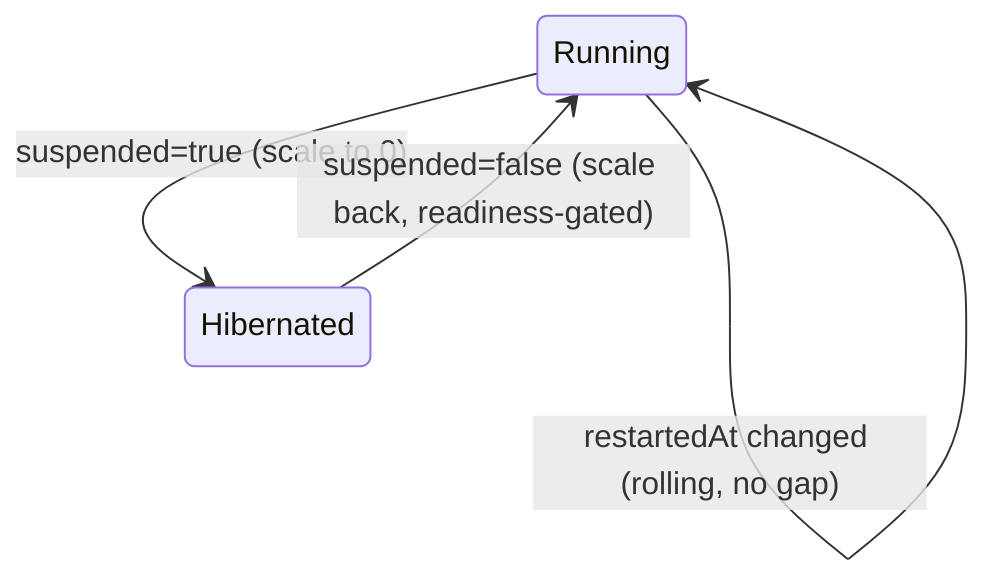

# ADR: restart, suspend, resume — lifecycle verbs as contract fields

**Status:** accepted — implemented 2026-07-05 (operator + envtest; live rollout pending the next operator deploy). The SRE escape hatch (`kubectl rollout restart deployment/<app>`) remains available but is no longer the only path.

## Context

bex is an open-source Render: users manage _services_, not k8s objects. Render exposes lifecycle verbs — Restart, Suspend, Resume — as product actions. We need the same, and the way we build them sets the precedent for every future verb (scale, rollback, redeploy).

Two paths exist to "restart a pod's service" today:

| path | what it is | role |
| --- | --- | --- |
| `kubectl rollout restart deployment/<app>` | a human with cluster credentials imperatively poking the k8s object | **escape hatch** — stays available to operators, never the product |
| App CR → operator | intent written into the contract; the operator converges reality | **the product path** — what this ADR designs |

The architecture rule (see [ADR003-control-plane.md](ADR003-control-plane.md)): product actions flow **control plane (policy) → App CR (contract) → operator (mechanism)**. The operator exposes no API and nothing ever calls it — it subscribes to the contract and acts. A lifecycle verb is therefore _not_ an endpoint or a wrapped command; it is **a new word in the contract** plus **a new convergence behavior in the operator**.

Existing pieces this builds on: the CRD already defines `PhaseHibernated` and `spec.idleTTLSeconds` ("sleep = free", currently unread); the opensandbox runtime already has real pause/resume snapshots (~80 ms wake); the kubernetes runtime rolls Deployments via `CreateOrUpdate` and gates `Running` on replica readiness.

## Decision

Add two spec fields carrying three verbs; the operator projects them onto each runtime. All are ordinary spec changes, so they bump `metadata.generation` and trigger reconcile through the existing watch — no new plumbing.

```yaml
spec:
  restartedAt: "2026-07-05T12:00:00Z" # verb-as-timestamp; empty = never requested
  suspended: true # desired: not serving (config, URL, certs all kept)
```

### restart — `spec.restartedAt`

The operator copies the value to the pod template annotation `app.bex.co/restarted-at`. A changed template is exactly how Kubernetes models "same config, new pods": the built-in RollingUpdate starts the new pod before stopping the old — no downtime, and it's the same mechanism `kubectl rollout restart` uses, just recorded in the contract instead of fired-and-forgotten. Setting the same timestamp twice is a no-op (idempotent, replay-safe).

### suspend — `spec.suspended: true`

The operator scales the owned Deployment to **0 replicas** and sets `status.phase: Hibernated`. Everything else stays: the Service, the Ingress, the hostname, and the TLS secrets — cert renewals keep working while asleep, because cert-manager's HTTP-01 solver runs its own challenge pods and doesn't need the app. Requests to the host return an error page from the edge until resume (a "sleeping, click to wake" page is future work, see below).

`spec.replicas` is untouched — it keeps meaning "how many when running", so resume knows what to restore. The manual-**scale** verb (`POST /v1/services/{id}/scale`, `{numInstances}`; the first verb built on this precedent — see [ADR006-bex-api.md](ADR006-bex-api.md)) writes exactly this field the same row-first way, and suspend still wins: the operator's `effectiveReplicas` forces 0 while `suspended`, so scaling a suspended App takes visible effect on resume.

### resume — `spec.suspended: false` (or field removed)

The operator scales back to `spec.replicas`, and the existing readiness gate flips the phase back to `Running` once pods are ready. Cold start on the kubernetes runtime = pod start time (seconds).

### One contract, two runtimes

The same fields mean the same thing everywhere; only the mechanism differs — this is the point of the CR being the contract:

| verb | kubernetes runtime | opensandbox runtime |
| --- | --- | --- |
| restart | template annotation → RollingUpdate | recreate sandbox |
| suspend | Deployment → 0 replicas | `pause` (checkpoint snapshot) |
| resume | scale back to `spec.replicas` | `resume` (~80 ms restore) |

### Phase transitions



### Who writes the fields

Two ways, same field write:

- **`kubectl patch app <name> --type merge -p '{"spec":{"suspended":true}}'`** — the escape hatch.
- **bex-api** (the control-plane seed, implemented) — a bearer-authed service at `api.<base-domain>` exposing the verbs over **both REST and GraphQL**, shaped to Render's public API (verified against its OpenAPI spec) and dashboard operation names, each a thin adapter over one shared `Core` that patches these spec fields. See [ADR006-bex-api.md](ADR006-bex-api.md). It needs only App-write RBAC, never Deployment access.

```sh
curl -X POST -H "Authorization: Bearer $TOKEN" https://api.bex.co/v1/services/eden-cms-v2/restart
```

**These verbs do not belong in `bex.yml`**: the manifest declares how the app runs (repo config); restart/suspend are runtime intent with no home in git.

## Alternatives considered

- **Wrap `kubectl` (or client-go calls against the Deployment) in an API service** — rejected. No record of intent (no audit/replay), fights the Deployment's owner (the operator's `CreateOrUpdate` rewrites what others change), needs broad RBAC in the API service, and one-shot imperative commands don't survive crashes the way level-triggered reconciliation does.
- **Annotations on the App instead of spec fields** — rejected. The controller filters events with `GenerationChangedPredicate`; annotation-only changes don't bump generation and would never reconcile. Spec is also the audited contract; annotations are not.
- **`spec.replicas: 0` as suspend** — rejected. Conflates "should it run" with "how many when running" and forgets the replica count to restore on resume.
- **A custom imperative subresource / dedicated verb API** — heavier machinery for no gain at this stage; can be layered later without changing the contract.

## Consequences

- Every verb is auditable, idempotent, and replayable — rebuilding the cluster from App CRs reproduces suspended state correctly.
- A suspended App still owns its hostname and Ingress; until a wake page exists, visitors see a bare edge error (404/503) rather than something friendly.
- Resume is **manual**. Auto-hibernate (`idleTTLSeconds` after no traffic) and wake-on-request need a traffic-aware activator at the edge — the 211.09 roadmap item; this ADR's `suspended` field is deliberately the state that activator will also write, so the manual and automatic paths converge on one mechanism. For agent **sandboxes**, that idle-hibernate + wake-on-connect is designed in [ADR014-sandboxes.md](ADR014-sandboxes.md) (gateway-observed `autoPause` over opensandbox's real pause/resume).
- Implementation size: 2 CRD fields + ~40 lines in `reconcileKubernetes` + envtest cases (suspend keeps Ingress/TLS and zeroes replicas; restart changes only the template annotation; resume restores and readiness-gates).

## Verification (when implemented)

1. `kubectl patch app eden-cms-v2 --type merge -p '{"spec":{"restartedAt":"<now>"}}'` → new pod starts before old terminates; site never drops; `status.activeRevision` bumps.
2. Patch `suspended: true` → replicas 0, phase `Hibernated`, `kubectl get certificate` still Ready, host still resolves.
3. Patch `suspended: false` → pods return, phase `Running`, site serves 200 with prior content.
