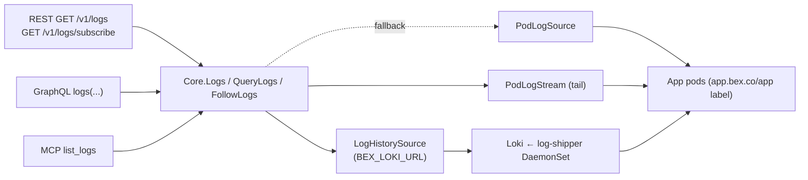
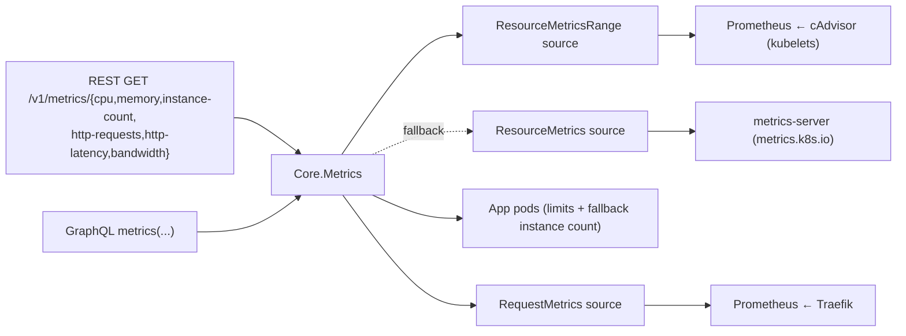

# Observability — logs and metrics

bex makes a running platform **observable** without `kubectl`: an operator or an AI agent debugging a deploy reaches App logs and metrics through the same bearer-authed [bex-api](ADR006-bex-api.md) it uses for lifecycle verbs. This is `GOAL.md` #2 ("basic obs for operation") and the AI-native pillar in [ADR008-vision.md](ADR008-vision.md) — agents can't fix a failing deploy they can't read.

Logs shipped first: highest operational value, and the simplest backend (pod logs, no metrics-server dependency). Metrics follow, over the same one-Core-many-adapters shape.

## Logs

One `Core` logs read, three adapters — the [bex-api](ADR006-bex-api.md) invariant. The MCP `list_logs` tool is the agent surface; REST and GraphQL expose the same read to the public API and dashboard.



- **`Core.Logs(name, tail)`** — tail-N aggregation across replicas; the unfiltered convenience read. Returns `LogEntry{timestamp, message, labels}` (labels `service`/`instance`/`container`).
- **`Core.QueryLogs(LogQuery)`** — adds Render's filters (type/text/time) and paging; the read path all three adapters (REST, GraphQL, MCP `list_logs`) go through.
- **`Core.FollowLogs(LogQuery, emit)`** — live tail; the SSE stream.

Two backends sit behind the read verbs, each an injected source so the domain stays clientset/HTTP-free (like `PodLogSource`, both are faked in tests with no cluster):

- **`LogHistorySource`** (`NewLokiSource`, gated by `BEX_LOKI_URL`) — the **durable** backend `Core.QueryLogs`/`Logs` prefer when wired. It translates the resolved `LogQuery` (namespace/app label selector, text, time range, limit) into a LogQL `query_range` against Loki, which the log-shipper DaemonSet feeds from every App pod. This is what makes logs **survive a pod restart**: a crash-looping App's pre-restart lines are still in Loki when someone queries them, and the time-range filter is now a real bounded search rather than best-effort over a live stream.
- **`PodLogSource`** (`NewPodLogSource`) — the **live fallback** for `QueryLogs`/`Logs` when `BEX_LOKI_URL` is unset: reads the kubelet's `pods/log` ring buffer directly (the one subresource controller-runtime's client can't serve). No history — a restart loses the buffer — but zero extra infrastructure. **With Loki unset the read path is byte-identical to the pre-Loki behavior** (same shapes, same limit semantics, same labels).

`PodLogSource`/`PodLogStream` live in `podlogs.go`; `LogHistorySource` in `loki.go`. All three are injected in `cmd/api/main.go`.

### The tail reads pod logs, not Loki

`Core.FollowLogs` (the `GET /v1/logs/subscribe` SSE stream) **always reads `PodLogStream` (pod logs), never Loki — even when Loki is wired.** The tail is for new lines going forward, where following the kubelet stream directly is real-time with zero ingest lag, adds no moving parts, and — critically — **does not die when Loki is down**: history degrades to the live buffer, the tail is unaffected. Loki's own tail endpoint would give a single history+tail source at the cost of a small ingest lag and a new failure mode on the live path; the durability win is on the _historical query_ (`QueryLogs`), which Loki already owns, so the tail stays on pods. The one accepted consequence: a freshly-restarted pod's tail starts from that pod's new buffer — but the pre-restart lines are served by `QueryLogs` from Loki, so nothing is actually lost.

### Durability & retention

Loki keeps **7 days** of searchable history (`limits_config.retention_period: 168h`, compactor-enforced), sized to Render's **Hobby-tier** searchable window. Render's window is tiered by plan — Hobby 7 days, Pro 14, Scale/Enterprise 30 — so 7 days is the floor, not a ceiling; raising it is one knob (`retention_period` in `deploy/gitops/base/loki.yaml`, plus the PVC size). Loki runs **single-binary on a filesystem PVC** (no object store) — the same single-node reality as Prometheus's PV and the etcd/OpenBao Raft volumes: history survives a **pod restart** (the milestone's point) because it's on a real PV, but a **node loss** loses the volume it holds. That's the documented boundary, not a solved problem — cross-host log durability would mean an object-store backend, deferred like the others. The local overlay shrinks the PVC to CAPD scale (`2Gi`) since the mock cluster is disposable.

### Cluster enablement

`deploy/gitops/base/loki.yaml` runs the one Loki (single-binary, filesystem PVC, 7-day retention) and `deploy/gitops/base/log-shipper.yaml` runs the Grafana **Alloy** DaemonSet that tails App pod logs into it — keeping only tenant App pods (label `app.bex.co/app`) and labelling each stream `namespace`/`app`/`pod`/`container`, the labels `NewLokiSource`'s LogQL selects on. `BEX_LOKI_URL=http://loki.monitoring.svc:3100` points bex-api at it and flips `QueryLogs`/`Logs` from pod logs to durable history. Unset ⇒ the pod-log fallback, byte-identical to before. (Alloy, not Promtail: Promtail is end-of-life; Alloy is Grafana's supported successor, and its API-based `loki.source.kubernetes` is the simplest static config — no host-path/file-glob templating.)

### REST surface

| method + path | effect |
| --- | --- |
| `GET /v1/logs` | historical query → `{hasMore, next*Time, logs}` |
| `GET /v1/logs/subscribe` | live tail over Server-Sent Events |
| `graphql { logs(...) }` | same query, flat `LogEntry` rows |
| MCP `list_logs` | agent read (Core.QueryLogs), `resource` array + `type`/`text`/`startTime`/`endTime`/`limit` |

Query params (Render vocabulary): `resource` (App id, repeatable), `type` (repeatable), `text` (case-insensitive substring), `startTime`/`endTime` (RFC3339), `limit` (default 20, max 100 — Render's paging range). `Core` re-applies every filter, sorts oldest-first, and keeps the newest `limit`.

The REST log object is Render's public-API `log` (all fields required): `{id, message, timestamp, labels[]}`. bex synthesizes a stable `id` from instance + timestamp + a message hash, and renders Core's map labels as Render's `{name,value}` array — `type` (value `app`), `resource` (Core's `service`), `instance`. The envelope carries all four required fields: `hasMore`, `nextStartTime` (newest line), `nextEndTime` (oldest line, the backward-page cursor), `logs`. (MCP instead returns `LogEntry` with map labels verbatim, matching Render's MCP server — each adapter mirrors its own Render counterpart.)

### Log types

Render's `type` is `app`/`request`/`build`. **bex only sources application (`app`) logs today** — the App's own container stdout/stderr, read from every replica pod (label `app.bex.co/app=<name>`) and aggregated. `request` (Traefik access logs) and `build` (bex builds in a separate plane, see [go-and-gitops](ADR001-go-and-gitops.md)) have no backend here, so those types resolve to an empty page rather than an error — a Render-shaped client filtering by them sees an empty result, never a break. `application` is accepted as an input alias for `app`.

### Live tail (SSE)

`GET /v1/logs/subscribe` streams `text/event-stream`, one `data: <log JSON>` frame per new line, following a single `resource`. bex uses **SSE, not Render's WebSocket**: no extra dependency, works with `curl -N`, same "stream new lines live" contract. The handler clears the server write deadline (`http.NewResponseController`) so the long-lived stream isn't killed by the api's `WriteTimeout`; the stream ends when the client disconnects (request context cancelled).

### Render compatibility

Shapes verified against `render-public-api-1.json`: the `type`/`resource`/`text`/`startTime`/`endTime`/`limit` params, the `{hasMore, nextStartTime, nextEndTime, logs}` envelope, and the `{id, message, timestamp, labels[]}` log object (with the label-name enum). Known, intentional deviations:

- **subscribe transport** — SSE vs Render's WebSocket (`101` upgrade).
- **`ownerId`** — Render requires it; bex is single-tenant and omits it.
- **unimplemented filters** — Render's request-log filters `instance`, `level`, `host`, `statusCode`, `method`, `path`, and the `direction` (forward/backward) param are not wired yet; `text`/`type`/time filtering is.

### RBAC

The api ServiceAccount reads `pods` (`get`/`list`/`watch`) and `pods/log` (`get`) — added with the logs verb in `lego/operator/config/api/rbac.yaml`. No clientset lives in Core; only `podlogs.go` (and its `main.go` wiring) touch it. The Loki-backed history reaches Loki over HTTP (`BEX_LOKI_URL`), not the kube API, so it needs **no extra bex-api RBAC** — the log-shipper DaemonSet's own ServiceAccount (its chart's ClusterRole) does the pod-log reads, exactly as the Prometheus scrape's ServiceAccount does for metrics.

## Metrics

The same one-Core-many-adapters shape as logs. `Core.Metrics(MetricQuery)` is the single read; REST (`internal/metrics/rest.go`) and GraphQL (`internal/metrics/graphql.go`) are the surfaces. Two backends, each an injected source so Core stays clientset-free (like `PodLogSource`):



- **Resource** — `cpu` / `memory` / `instance_count` come from **cAdvisor scraped by Prometheus** (`NewPrometheusResourceSource`, gated by `BEX_PROM_URL` like the request metrics): a `query_range` over `container_cpu_usage_seconds_total` (per-pod rate → cores) and `container_memory_working_set_bytes` (per-pod sum → bytes; also counted for `instance_count`), one stepped series per replica tagged `instance` + `resource`, honoring `startTime`/`endTime`/`resolutionSeconds`. Since kubelet metrics carry pod names but not pod labels, an App's pods are matched by the Deployment pod-name shape (`<app>-<rs-hash>-<suffix>`) — anchored, so `web` never matches `web-api` pods. With `percentage=true`, every point is divided by the pod's limit (read from the pod spec) and reported 0..100; an instance with no limit — including a pod that no longer exists — is omitted rather than faked. Every tiered App has one (see [ADR003-control-plane.md's tier catalog](ADR003-control-plane.md#tiers-plans--pod-resources--machine-provisioning)); this path only fires for a bare-CR App with no `spec.tier` set.
- **Resource fallback** — without `BEX_PROM_URL`, `cpu` / `memory` come from **metrics-server** (`metrics.k8s.io/v1beta1`, via `NewResourceMetricsSource`): a point-in-time snapshot, so each series carries a **single current point** regardless of the requested range. `instance_count` then derives from the App's pods directly, needing **no** source at all. When Prometheus is configured but unreachable at query time, the error surfaces (no silent fallback — same contract as request metrics).
- **Request** — `http_requests` / `http_latency` / `bandwidth` come from **Traefik scraped by Prometheus** (`NewPrometheusRequestSource`, gated by `BEX_PROM_URL`): a `query_range` over `traefik_service_requests_total` (rate), `_request_duration_seconds_bucket` (`histogram_quantile`, default p95), and `_responses_bytes_total` (rate). `statusCode` filters the `code` label (`2xx` → `2..`); `groupBy` (`status`/`method`) breaks the result into per-label series.

When a metric's source isn't wired at all (request metrics without `BEX_PROM_URL`, cpu/memory with neither Prometheus nor metrics-server), the endpoint returns **503** (`ErrMetricsUnavailable`) — the App exists, the data source doesn't.

### REST surface

| method + path | metric |
| --- | --- |
| `GET /v1/metrics/cpu` | per-instance CPU (cores, or % of limit) |
| `GET /v1/metrics/memory` | per-instance memory (bytes, or % of limit) |
| `GET /v1/metrics/instance-count` | running replica count |
| `GET /v1/metrics/http-requests` | request rate (req/s) |
| `GET /v1/metrics/http-latency` | latency percentile (seconds) |
| `GET /v1/metrics/bandwidth` | outbound bytes/s |

Query params (Render vocabulary): `resource` (App id, repeatable), `startTime`/`endTime` (RFC3339), `resolutionSeconds`, `quantile` (0..1, latency), `statusCode`/`host`/`path`/`groupBy` (request filters), and a bex extra `percentage=true` (cpu/memory as a fraction of limit). Each endpoint returns Render's metrics array — `[{labels:[{field,value}], unit, values:[{timestamp,value}]}]`. GraphQL mirrors Render's dashboard shape: `metrics(query: MetricsQueryInput!)` — input fields `filters` (resource selectors), `name` (the metric: `cpu`/`memory`/`instance_count`/`http_requests`/`http_latency`/`bandwidth`), `start`/`end`, `resolution`, `parameters`, `aggregateBy`, `aggregationMethod`, `aggregateAllMethod` — returning `MetricSeries { unit, labels{field,value}, values{time,value}, parameters }` (the sample field is `time` in GraphQL, `timestamp` in REST). Companion dashboard queries: `monthToDateBandwidth`, `metricsFilters`, `metricsPathFilterSuggestions`. The MCP `get_metrics` tool (`resource[]` + `metricTypes[]`) exposes the same read to agents — three-adapter parity, like `list_logs`.

### Render compatibility

Shapes track Render's metrics endpoints (per-metric path segments; the `{labels, unit, values}` time-series). With Prometheus configured (`BEX_PROM_URL`), **all six metrics are resolution-stepped series honoring `startTime`/`endTime`/`resolutionSeconds`** — Render metrics-page parity. Known, intentional deviations:

- **snapshot fallback** — without `BEX_PROM_URL`, resource metrics fall back to metrics-server and return a single current point (metrics-server has no history); Render always returns a stepped series.
- **`cpu_limit`/`memory_limit` stay single-point** — limits come from the current pod spec, and bex won't fabricate a history for a value it only knows _now_ (a past limit may have differed). Safe for Render-style clients, which fetch the limit alongside the usage series and divide client-side using its latest value.
- **`host`/`path` filters** — accepted (Render vocabulary) but not applied to request metrics: Traefik's per-service counters carry only `code`/`method`, not host/path (host/path live on router-level metrics). Documented like the logs adapter's unimplemented request filters.
- **Traefik service selector** — the App→Traefik-service match is a heuristic (`service=~".*<app>.*"`); a real cluster may need it tuned to the ingress's actual service label. The resource-metrics pod match (`pod=~"<app>-[a-z0-9]+-[a-z0-9]{5}"`) is its (stricter) cAdvisor sibling.

### RBAC

The metrics-server fallback adds read on `metrics.k8s.io` `pods` (`get`/`list`) to the api ServiceAccount (`lego/operator/config/api/rbac.yaml`); percentage mode reuses the existing `pods` read for limits. The Prometheus-backed metrics (resource history and request) reach Prometheus over HTTP (`BEX_PROM_URL`), not the kube API, so they need no extra RBAC on bex-api — the Prometheus ServiceAccount's chart-default ClusterRole covers the cAdvisor scrape (`nodes`, `nodes/proxy`, `nodes/metrics`).

### Cluster enablement

`deploy/gitops/base/prometheus.yaml` runs the one Prometheus behind both history-backed metric families. Two scrape jobs feed bex-api's metrics: `traefik` (request counters, via `deploy/gitops/base/traefik.yaml`'s `metrics` entrypoint `:9100` with `addServicesLabels`) and `kubernetes-cadvisor` (per-container cpu/memory, scraped through the apiserver proxy so it works even where the pod network can't reach every kubelet). Four more feed the alerting rule pack below — `kube-state-metrics` (object state), `kubernetes-kubelet` (only `kubelet_volume_stats_*` for PVC usage), `cert-manager` (`:9402` certificate series), and `openbao` (per-pod `/v1/sys/metrics` for seal state). `BEX_PROM_URL` points bex-api at the server and enables the metric families. `deploy/gitops/base/metrics-server.yaml` installs metrics-server — now only the snapshot fallback (and `kubectl top`).

## Platform alerting (Alertmanager)

Logs and metrics above make _tenant_ deploys observable. Platform alerting is the operator-facing half of `GOAL.md` #2: when **bex itself** breaks — a bad rollout in `bex-system`, a node gone, OpenBao sealed after a restart, a nightly backup silently rotting — a human gets paged instead of finding out at restore time. It rides the same Prometheus (w3/m6): the chart's bundled **Alertmanager** is enabled with one webhook receiver, and a small, high-signal rule pack (`serverFiles.alerting_rules.yml` in `prometheus.yaml`) evaluates platform and bex-specific invariants.

Deliberately minimal: still no pushgateway/node-exporter. The only exporters are **kube-state-metrics** (object state) and the existing kubelet scrape (PVC usage) — the rules need no host-level series.

### The rule pack

Two groups, all with actionable `description`s (each carries the `kubectl` command to start debugging):

| group | alert | fires when | severity |
| --- | --- | --- | --- |
| `platform` | `PlatformPodCrashLooping` | a container in a platform namespace is CrashLoopBackOff >10m | warning |
| `platform` | `PlatformDeploymentNotReady` | a platform Deployment has < desired available replicas >10m | warning |
| `platform` | `ControlPlaneNodeNotReady` | a control-plane node is NotReady >5m (single CP node = high blast) | critical |
| `platform` | `NodeNotReady` | a worker node is NotReady >5m | warning |
| `platform` | `PersistentVolumeFillingUp` | a PVC is >85% full >15m (hcloud-csi/local-path single-copy volumes) | warning |
| `platform` | `CertificateNotReady` | a cert-manager Certificate is not-Ready >15m | warning |
| `platform` | `CertificateExpiringSoon` | a Certificate expires in <14d and hasn't renewed | warning |
| `bex` | `BackupCronJobStale` | `etcd-backup`/`openbao-backup` last succeeded >26h ago (silent rot) | critical |
| `bex` | `OpenBaoSealed` | any OpenBao member reports sealed >5m (⇒ 503s the env-vars API) | critical |
| `bex` | `BexApiDown` | `bex-api` has zero available replicas >5m | critical |
| `bex` | `StrandedNodeLocalImages` | an App pod is ImagePullBackOff/ErrImageNeverPull >10m | warning |
| `bex` | `TraefikHigh5xxRate` | >5% of edge requests are 5xx for >10m (above a traffic floor) | warning |

`ControlPlaneNodeNotReady` vs `NodeNotReady` split on `kube_node_role{role="control-plane"}`: the CP pool is a single node until the quota lift restores 3 CP nodes, so its loss pages while a worker's only warns. `OpenBaoSealed` reads the **per-pod** telemetry gauge `vault_core_unsealed` (from the `openbao` scrape) — _not_ readiness or the Service: the chart's readiness probe keeps a sealed member in rotation (`sealedcode` 2xx) so the round-robin Service and a `kube_statefulset_ready` check would both miss a sealed follower; a sealed member still serves `/v1/sys/metrics` reporting `0`, and the alert fires on any member sealed. `StrandedNodeLocalImages` catches the node-local-image failure mode (App images are `ctr` imports, not registry-backed, so node replacement/scale-down strands them) — a platform defect, hence warn not page, even though it fires in the tenant `default` namespace. `BackupCronJobStale` reads `kube_cronjob_status_last_successful_time` from kube-state-metrics (the local overlay removes both backup CronJobs, so the series — and this alert — exist only where the jobs run: prod).

### The receiver secret (out-of-band, never in git)

The receiver is an **email** on the SendGrid relay bex already runs (the w4/m12 invite / Kratos-courier relay — `smtp.sendgrid.net:587` STARTTLS, username `apikey`, docs/ADR012-auth.md §Email), so there's no new channel credential to mint. The `smtp_smarthost`/`smtp_from`/`to` are non-secret and committed in `prometheus.yaml`; only the SendGrid API key is out-of-band — read via `smtp_auth_password_file` from a Secret `alertmanager-smtp` (key `smtp-password`) in the `monitoring` namespace, **never committed** (same custody rule as the etcd/openbao-backup S3 creds). Create it once per cluster (Alertmanager stays in `ContainerCreating` until it exists, a deliberate one-time bootstrap like unsealing OpenBao):

```sh
# imperative (the SendGrid API key already under .env / GH-secrets custody):
kubectl create secret generic alertmanager-smtp -n monitoring \
  --from-literal=smtp-password="$BEX_SMTP_PASSWORD"

# or seal it into a committable SealedSecret (docs/ADR016-sealed-secrets.md):
scripts/seal-secret.sh monitoring alertmanager-smtp smtp-password="$BEX_SMTP_PASSWORD" \
  > deploy/gitops/base/sealed/alertmanager-smtp.sealedsecret.yaml  # then add to base kustomization
```

On the **local** mock cluster the overlay disables Alertmanager entirely (`alertmanager.enabled=false`) — the disposable CAPD cluster has no SMTP cred, just as it has no backup S3 creds, so the workload is dropped rather than left pending on a missing secret (mirrors the `$patch: delete` of the backup CronJob Applications). The server still evaluates the rule pack (visible in the Prometheus UI), and `scripts/alerts-verify.sh` stands up its own throwaway Alertmanager with the email receiver swapped for an in-cluster capture webhook — so no committed secret and no real mail are needed to test the loop.

### Rules are tested, not just linted

The rule pack is the single source of truth embedded in `prometheus.yaml`. `scripts/gitops-validate.sh` (CI: `.github/workflows/gitops.yml`) extracts it and runs `promtool check rules` plus `promtool test rules` against `deploy/gitops/base/rules/alerts_test.yml` — unit tests pin the non-obvious expressions (backup-age fires at >26h not 25h; the 5xx ratio ignores tiny denominators; CrashLoop respects `for: 10m`). A regressed expression fails CI, not prod.

### Verify the loop end-to-end

`scripts/alerts-verify.sh` (mock cluster) proves fire→notify→resolve without waiting for a real outage: it points the receiver at an in-cluster capture pod, then breaks two invariants and watches both alerts arrive and clear.

1. **Bad rollout** → `kubectl -n bex-system set image deploy/bex-api api=nonexistent:bad` ⇒ `PlatformDeploymentNotReady` (and `BexApiDown`) after the `for:` window; revert ⇒ resolved notification.
2. **Backup staleness** → apply a `kube_cronjob_status_last_successful_time` fixture (or temporarily shorten the rule window) ⇒ `BackupCronJobStale`; restore ⇒ resolved.

Observed end-to-end latency ≈ evaluation interval (default 1m) + the rule's `for:` + `group_wait` (30s) — e.g. a `for: 0m` alert like `BackupCronJobStale` notifies within ~1–2 evaluation windows; the `for: 5–15m` alerts add their persistence window.

## Verify (mock cluster)

```sh
# deploy a sample App, then:
curl -s -H "Authorization: Bearer $TOKEN" \
  "http://localhost:8090/v1/logs?resource=<app>&type=app" | jq .

# resource metrics — with BEX_PROM_URL set these are stepped history; a ranged
# query returns one point per resolution step per instance:
curl -s -H "Authorization: Bearer $TOKEN" \
  "http://localhost:8090/v1/metrics/cpu?resource=<app>&percentage=true" | jq .
curl -s -H "Authorization: Bearer $TOKEN" \
  "http://localhost:8090/v1/metrics/memory?resource=<app>&startTime=$(date -u -v-1H +%Y-%m-%dT%H:%M:%SZ)&endTime=$(date -u +%Y-%m-%dT%H:%M:%SZ)&resolutionSeconds=60" \
  | jq '.[0].values | length'   # ≈60 points over the hour (where data exists)
curl -s -H "Authorization: Bearer $TOKEN" \
  "http://localhost:8090/v1/metrics/instance-count?resource=<app>" | jq .
```
