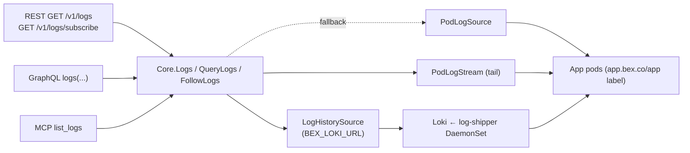
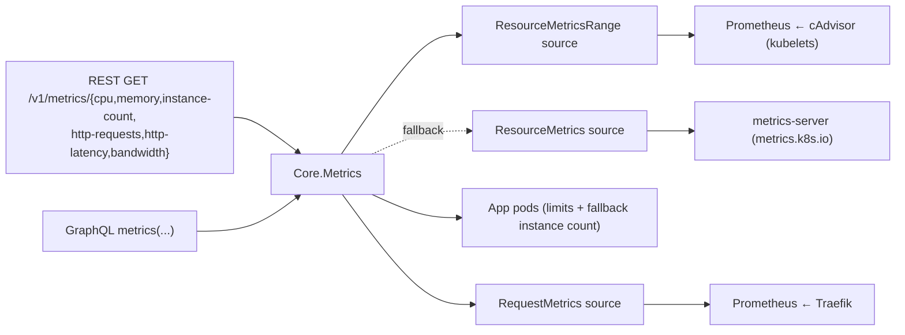

# Observability — logs and metrics

bex makes a running platform **observable** without `kubectl`: an operator or an AI agent debugging a deploy reaches App logs and metrics through the same bearer-authed [bex-api](ADR006-bex-api.md) it uses for lifecycle verbs. This is `GOAL.md` #2 ("basic obs for operation") and the AI-native pillar in [ADR008-vision.md](ADR008-vision.md) — agents can't fix a failing deploy they can't read.

Logs shipped first: highest operational value, and the simplest backend (pod logs, no metrics-server dependency). Metrics follow, over the same one-Core-many-adapters shape.

## Logs

One `Core` logs read, three adapters — the [bex-api](ADR006-bex-api.md) invariant. The MCP `list_logs` tool is the agent surface; REST and GraphQL expose the same read to the public API and dashboard.



- **`Core.Logs(name, tail)`** — tail-N aggregation across replicas; the unfiltered convenience read. Returns `LogEntry{timestamp, message, labels}` (labels `service`/`instance`/`container`).
- **`Core.QueryLogs(LogQuery)`** — adds Render's filters and paging; the read path all three adapters (REST, GraphQL, MCP `list_logs`) go through. A `dpg-…` resource dispatches to the Database-authorized Postgres path (w3/m28); a `red-…` resource dispatches to the KeyValue-authorized Valkey path (w3/m30). Both preserve the same public operation.
- **`Core.FollowLogs(LogQuery, emit)`** — live tail; the SSE stream.

Two backends sit behind the read verbs, each an injected source so the domain stays clientset/HTTP-free (like `PodLogSource`, both are faked in tests with no cluster):

- **`LogHistorySource`** (`NewLokiSource`, gated by `BEX_LOKI_URL`) — the **durable** backend `Core.QueryLogs`/`Logs` prefer when wired. It translates the authorized `LogQuery` into a LogQL `query_range`: `{namespace, app}` for services or `{namespace, database}` for managed Postgres, plus text, time, instance, and limit. Alloy feeds both sources. This is what makes logs **survive a pod restart**: pre-restart App and CNPG lines remain searchable.
- **`PodLogSource`** (`NewPodLogSource`) — the **live fallback** for `QueryLogs`/`Logs` when `BEX_LOKI_URL` is unset: reads the kubelet's `pods/log` ring buffer directly (the one subresource controller-runtime's client can't serve). Apps select `app.bex.co/app` and container `app`; Postgres selects exact `cnpg.io/cluster=<dpg-id>` and container `postgres`; Key Value selects `app.bex.co/keyvalue=<red-id>` and container `valkey`. No history — a restart loses the buffer — but zero extra infrastructure.

`PodLogSource`/`PodLogStream` live in `podlogs.go`; `LogHistorySource` in `loki.go`. All three are injected in `cmd/api/main.go`.

### The tail reads pod logs, not Loki

`Core.FollowLogs` (the `GET /v1/logs/subscribe` SSE stream) **always reads `PodLogStream` (pod logs), never Loki — even when Loki is wired.** The default/App tail follows the App containers; an explicit `type=build` follows the newest running build pod in `BEX_BUILD_NAMESPACE` (BuildKit, signed BuildKit, or kpack, with running container names discovered from Pod status). The tail is for new lines going forward, where following the kubelet stream directly is real-time with zero ingest lag, adds no moving parts, and — critically — **does not die when Loki is down**: history degrades to the live buffer, the tail is unaffected. Loki's own tail endpoint would give a single history+tail source at the cost of a small ingest lag and a new failure mode on the live path; the durability win is on the _historical query_ (`QueryLogs`), which Loki already owns, so the tail stays on pods. The one accepted consequence: a freshly-restarted pod's tail starts from that pod's new buffer — but the pre-restart lines are served by `QueryLogs` from Loki, so nothing is actually lost.

### Durability & retention

Loki keeps **7 days** of searchable history (`limits_config.retention_period: 168h`, compactor-enforced), sized to Render's **Hobby-tier** searchable window. Render's window is tiered by plan — Hobby 7 days, Pro 14, Scale/Enterprise 30 — so 7 days is the floor, not a ceiling; raising it is one knob (`retention_period` in `deploy/gitops/base/loki.yaml`, plus the PVC size). Loki runs **single-binary on a filesystem PVC** (no object store) — the same posture as Prometheus's PV and the etcd/OpenBao Raft volumes: history survives a **pod restart** because it's on a real PV. On prod the PVC rides the cluster's default `hcloud-volumes` StorageClass (a Hetzner Cloud Volume — a network volume that survives a node rebuild/loss), so a node going away does _not_ lose the history; the disposable CAPD mock uses `local-path` (node-local), where a node loss _does_ lose it. Cross-host log durability beyond one volume's lifecycle would mean an object-store backend, deferred like the others. The local overlay shrinks the PVC to CAPD scale (`2Gi`) since the mock cluster is disposable. The same durability covers tenant-node replacement (autoscaler scale-down/up churn), not just a crash: the log-shipper DaemonSet tolerates every taint so it ships from any node the autoscaler adds, and the hcloud volume follows Loki's pod to whichever node it's rescheduled onto — no further work needed.

### Cluster enablement

`deploy/gitops/base/loki.yaml` runs the one Loki (single-binary, filesystem PVC, 7-day retention) and `deploy/gitops/base/log-shipper.yaml` runs the Grafana **Alloy** DaemonSet that ships App (`type=app`), request (`type=request`), build, managed-Postgres (`type=postgres`), managed-Valkey Key Value (`type=keyvalue`), and platform dashboard UI (`type=platform`, namespace `dashboard`, `service=dashboard` — w4/m88) streams. The Postgres pipeline requires the operator-stamped `app.bex.co/component=database` marker, keeps only the `postgres` container, and labels the stream with the immutable CNPG cluster/Database id; platform CNPG clusters are excluded. The Key Value pipeline selects pods whose `app.bex.co/keyvalue` label is non-empty (operator-stamped tenant Valkey pods only), keeps only the `valkey` container, and labels the stream with the `keyvalue=<red-id>` label. Platform dashboard pod logs are selected by namespace alone (no fake `app.bex.co/app`); they are **operator-facing** and are not part of bex-api's tenant log API. `BEX_LOKI_URL=http://loki.monitoring.svc:3100` points bex-api at it and flips historical reads from pod buffers to durable history.

### Log labels (and the cardinality budget)

A Loki **label is a stream**, so only bounded fields become labels; unbounded ones stay in the line and are filtered at query time. That single rule is the whole taxonomy:

| field | where it lives | why |
| --- | --- | --- |
| `namespace`, `app` or `database` or `service` | label | the scope of every query — equality matchers resolved after App/Database authorization for tenant streams; `service=dashboard` is the bounded platform-UI key (w4/m88), never a caller-controlled selector |
| `type` (`app`/`request`/`build`/`postgres`/`platform`) | label | bounded source vocabulary |
| `pod`, `container` | label (app/platform logs) | bounded by replica count; `pod` is Render's `instance` |
| `level` | label (app/platform logs) | 5 values, hard-capped by the shipper's normalizer (below) |
| `method` | label (request logs) | the HTTP verb set (≤8) |
| `status` | label (request logs) | the status codes an App actually returns (≤~15); Render's `statusCode` |
| **`path`**, **`host`** | **line only** | **unbounded per request** — one label per URL would mint a stream per URL |

Worst case ≈ (replicas × levels) + (methods × statuses) streams per App — low hundreds; typically under 20. `path`/`host` are still fully filterable: the access line is JSON, so a query parses them out with LogQL's `| json` stage (`request_path`/`request_host`) instead of indexing them. **Promoting `path` to a label would be a cardinality incident** — `TestPathAndHostNeverBecomeLabels` guards it.

**Request logs (`type=request`)** are Traefik's JSON access log (`logs.access` in `deploy/gitops/base/values/traefik.values.yaml`), attributed back to the App by the access line's `ServiceName` — Traefik names an Ingress-backed service `<namespace>-<service>-<port>@kubernetes`, and the operator names the k8s Service after the App CR, so the shipper reconstructs the `{namespace, app}` labels bex-api's LogQL selector queries by (namespace = `app.Namespace`, app = `app.Name`) from that name. **Tenant-namespace fix (w6/m131):** unlike the app/build/postgres pipelines — which read the namespace straight from pod metadata — the request pipeline is the one that _parses_ it out of `ServiceName`, and its regex was anchored to the literal `default`. Under ADR043 a tenant App lives in its workspace's own namespace (`tea-<xid>`) and its CR name is itself tenant-prefixed, so every real ServiceName is `tea-<xid>-tea-<xid>-<app>-<port>@kubernetes` — which the `default`-anchored regex never matched, so every tenant access line was dropped as `not_a_tenant_app` and `type=request` was silently empty for every service in production (found live, 69th `/qa-find-bugs` run). The regex now matches a `tea-<xid>` tenant namespace as well as the shared/storeless `default`; a mislabel could only ever _hide_ a line, never surface another tenant's, because bex-api pins both `namespace` and `app` to the caller's own resolved values. A line the regex can't attribute is **dropped, not guessed**, except for an explicit host allowlist (w4/m88): `RequestHost=dashboard.bex.co` is retained under the bounded labels `namespace=dashboard` + `service=dashboard` (still `type=request`); **`host` itself stays line-only**. Other non-App edge hosts (bex-api, oauth, …) remain dropped until explicitly allowlisted the same way. Request headers are dropped at the source: they carry `Authorization`/`Cookie`, and a request log is not a place to leak a credential. The message stays the raw JSON access line (every field intact and searchable) rather than a prettified summary — a divergence from Render's rendered request line, in favor of losing nothing.

**`level` on app logs is parsed, never guessed.** The shipper JSON-parses each app line and promotes its `level` (or `severity`) field, normalizing the spellings (`err`/`fatal`/`panic`/`critical` → `error`, `warning` → `warn`, …) into Render's buckets. A line that is not JSON, or JSON without a severity field, is labelled **`unknown`** — the honest answer, because bex does not know. **Substring matching is deliberately not used**: a line containing the word "error" is not an error. The consequence is worth stating plainly: `level=error` isolates errors for services that log **structured JSON**, and buckets everything else into `unknown`. bex recommends JSON logging; it does not require it.

### Log filters

Every filter Render's logs API documents is honored, and each maps to exactly one mechanism:

| filter | mechanism | notes |
| --- | --- | --- |
| `type` | stream selection | `app` ∪ `request` ∪ `build`; default (no filter) = `app` ∪ `request` |
| `level` | label matcher | app logs; `unknown` is a real, queryable value |
| `instance` | label matcher (`pod`) | app logs — a request line comes from the edge, not a replica |
| `statusCode` | label matcher (`status`) | exact (`404`) or class (`4xx`) |
| `method` | label matcher | request logs |
| `path`, `host` | `\| json` line filter | request logs; unbounded, so never labels (above) |
| `text` | line filter | case-insensitive substring, identical to the pod-log path's |
| `startTime`/`endTime` | query range |  |
| `direction` | `backward` (default) / `forward` | which end of the window `limit` keeps; the returned slice stays oldest-first either way |
| `limit` | line cap | default 20, max 100 (Render's paging range) |

Managed Postgres uses the shared time/text/direction/limit behavior plus `instance`; service/request-only filters are named 400s. Instance discovery is scoped to `{namespace, database}` in Loki and falls back to the already authorized Database's exact CNPG pod set. See the [captured contract and attribution rules](render-artifacts/postgres-logs.md). Managed Key Value (Valkey) uses the same subset; instance discovery is scoped to `{namespace, keyvalue}` in Loki and falls back to pods matching the `app.bex.co/keyvalue=<red-id>` label. Live-tail (`FollowLogs`) returns a named 400 for Key Value resources — there is no persistent Valkey connection-scoped log stream to tail.

Multiple values for one filter OR together (Render's arrays); different filters AND. A `*` wildcard is supported per value; everything else is a literal (Render also documents full regex — **bex honors the wildcard subset**, a stated divergence rather than a silent one). Every interpolated value is escaped (`%q` + `regexp.QuoteMeta`), so no service name or filter value can break out of a matcher and inject a selector — the label-injection guard, unit-tested.

**Nothing is accepted and ignored.** A filter bex cannot honor is refused where it is asked for:

- **Pod-log fallback mode** (`BEX_LOKI_URL` unset): the labels live in the store, not in a pod's stdout — so `type=request`, `type=build`, and the `level`/`statusCode`/`method`/`path`/`host` filters return **503** (`ErrLogStoreUnavailable`), rather than quietly answering a narrow question with unfiltered lines. `type=app`, `text`, `instance`, time and `direction` still work, unchanged.
- **The SSE live tail** reads pod logs by design (see above). It supports the App tail and an explicit, standalone `type=build`; it refuses request logs, mixed build types, and store-only filters with a terminal SSE `event: error` frame (its headers are already on the wire, so a status code is no longer available). A build subscription with no running build pod ends with the named `no running build is available to follow` event instead of hanging.
- **An unknown `type`, `direction` or label** is a **400** naming the value — never a silently widened query.

### REST surface

| method + path | effect |
| --- | --- |
| `GET /v1/logs` | historical query → `{hasMore, next*Time, logs}` |
| `GET /v1/logs/values` | filter-value discovery → a bare `["…"]` array |
| `GET /v1/logs/subscribe` | live tail over Server-Sent Events |
| `graphql { logs(...) }` | same query, flat `LogEntry` rows |
| `graphql { logLabelValues(...) }` | same discovery (the logs sibling of `metricsFilters`) |
| MCP `list_logs` | agent read (Core.QueryLogs), `resource` array + the full filter set |
| MCP `list_log_label_values` | agent discovery (Core.LogLabelValues), `label` + `resource` + the same filters |

Query params (Render vocabulary): `resource` (repeatable App or managed-Postgres id), plus the [filters](#log-filters) above — `type`, `level`, `instance`, `host`, `statusCode`, `method`, `path`, `text` (all repeatable), `startTime`/`endTime` (RFC3339), `direction`, `limit`. `/v1/logs/values` takes the same set plus a required label; Postgres supports instance discovery. One `Core` verb per read (`QueryLogs`, `LogLabelValues`) backs all three surfaces, so a filter means the same thing on every one.

**Discovery is scoped to the App**, always: the label-values call goes to Loki with the requested service's stream selector, so no caller can enumerate another tenant's pods, hostnames or statuses. `host` is the exception that proves the taxonomy — it is not a stream label, so its values come from the App's own `status.urls` (`core.HostsFromURLs`), which is why it resolves even with no store wired. (Logs-only: the metrics feature's discovery deliberately offers no `HOST` values — its query verb rejects the filter, w3/m12.)

The REST log object is Render's public-API `log` (all fields required): `{id, message, timestamp, labels[]}`. bex synthesizes a stable `id` from instance + timestamp + a message hash, and renders Core's map labels as Render's `{name,value}` array — `type`, `resource` (Core's `service`), `instance`, `container`, `level`, `method`, `statusCode`. **A line carries only the labels its stream actually had**: an app line has no `method`/`statusCode`, a request line no `instance`/`container`. Nothing is faked to fill the shape. The envelope carries all four required fields: `hasMore`, `nextStartTime` (newest line), `nextEndTime` (oldest line, the backward-page cursor), `logs`. (MCP instead returns `LogEntry` with map labels verbatim, matching Render's MCP server — each adapter mirrors its own Render counterpart.)

### Log types

Render's `type` is `app`/`request`/`build`, and bex serves all three (w7/m28) plus a bex-native `predeploy` (w1/m33):

- **`app`** — the App's own container stdout/stderr, from every replica pod (label `app.bex.co/app=<name>`), aggregated. `application` is accepted as an input alias.
- **`request`** — Traefik's access log for that App (see [Log labels](#log-labels-and-the-cardinality-budget)), with truthful `method`/`statusCode` and a searchable `path`/`host`.
- **`build`** — the in-cluster BuildKit/kpack output for a git-backed deploy, shipped by the `build_pods` pipeline in `deploy/gitops/base/log-shipper.yaml`. Build pods carry `app.bex.co/component=build` + `app.bex.co/build=<name>` (w7/m28); the shipper attributes them to the App and pushes `{namespace, app, pod, container, type="build"}` streams. Without the durable store (`BEX_LOKI_URL` unset) a historical `type=build` query returns **503**, not a silent empty — the same honesty rule as `type=request`. The SSE subscription is independent of Loki and follows the newest running build pod directly (w3/m14).
- **`predeploy`** (bex extension, w1/m33) — the **pre-deploy step's Job-pod logs** (`spec.preDeployCommand`, [ADR004](ADR004-app-deployment.md)): a **live** read of the `predeploy` container on the pod labelled `app.bex.co/predeploy=<name>` in `BEX_BUILD_NAMESPACE` — never the durable store (Loki has no `predeploy` stream), the same pod-log path the SSE tail always uses. It is a **distinct source**, so it is requested **on its own** (mixing it with `app`/`request`/`build` is a 400 rather than a silent drop), and it is live-only: a Job pod TTL-reaped after its hour is simply gone (an empty read), the same ephemerality as build logs.

Asking for no type (or `all`) unions app + request — the default a Render client sees. Build logs are only included when the caller explicitly requests `type=build`; `predeploy` is likewise a separate, explicitly-requested source, never in that union.

### Live tail (SSE)

`GET /v1/logs/subscribe` streams `text/event-stream`, one `data: <log JSON>` frame per new line, following a single `resource`. `type=build` selects the active build pod; absent type keeps the established App-pod tail. bex uses **SSE, not Render's WebSocket**: no extra dependency, works with `curl -N`, same "stream new lines live" contract. The handler clears the server write deadline (`http.NewResponseController`) so the long-lived stream isn't killed by the api's `WriteTimeout`; the stream ends when the client disconnects (request context cancelled), or with a named terminal `event: error` when the requested source cannot be followed.

### Render compatibility

Shapes verified against `render-public-api-1.json` and `render-oss/render-mcp-server` (`pkg/logs/tools.go`): the full filter param set, the `{hasMore, nextStartTime, nextEndTime, logs}` envelope, the `{id, message, timestamp, labels[]}` log object (with the label-name enum), and both MCP tools' names/arguments (`list_logs`, `list_log_label_values` — the latter's `label` enum is Render's exact six). Known, intentional deviations:

- **subscribe transport** — SSE vs Render's WebSocket (`101` upgrade).
- **`ownerId`** — Render requires it; bex is single-tenant and omits it.
- **wildcards, not regex** — Render's filters accept full regex; bex honors `*` wildcards and treats everything else as a literal (see [Log filters](#log-filters)).
- **`type=build`** — requires the durable store (`BEX_LOKI_URL`); without it returns 503 (w7/m28 — the same honesty rule as `type=request`).
- **request-line message** — the raw JSON access line, not a rendered request summary.
- **GraphQL arity** — `logs(type:)`/`logs(text:)` stay single-valued strings (the shape the dashboard sends); REST and MCP take Render's arrays. The request filters are lists on all three.

### RBAC

The api ServiceAccount reads `pods` (`get`/`list`/`watch`) and `pods/log` (`get`) — added with the logs verb in `lego/operator/config/api/rbac.yaml`. No clientset lives in Core; only `podlogs.go` (and its `main.go` wiring) touch it. The Loki-backed history reaches Loki over HTTP (`BEX_LOKI_URL`), not the kube API, so it needs **no extra bex-api RBAC** — the log-shipper DaemonSet's own ServiceAccount (its chart's ClusterRole) does the pod-log reads, exactly as the Prometheus scrape's ServiceAccount does for metrics.

## Metrics

The same one-Core-many-adapters shape as logs. `Core.Metrics(MetricQuery)` is the single read; REST (`internal/metrics/rest.go`) and GraphQL (`internal/metrics/graphql.go`) are the surfaces. Two backends, each an injected source so Core stays clientset-free (like `PodLogSource`):



- **Resource** — `cpu` / `memory` / `instance_count` come from **cAdvisor scraped by Prometheus** (`NewPrometheusResourceSource`, gated by `BEX_PROM_URL` like the request metrics): a `query_range` over `container_cpu_usage_seconds_total` (per-pod rate → cores) and `container_memory_working_set_bytes` (per-pod sum → bytes; also counted for `instance_count`), one stepped series per replica tagged `instance` + `resource`, honoring `startTime`/`endTime`/`resolutionSeconds`. Since kubelet metrics carry pod names but not pod labels, an App's pods are matched by the Deployment pod-name shape — anchored, so `web` never matches `web-api` pods. The selector (`egressquery.PodNameRegex`, shared with the usage meter) accepts **two** shapes, because Kubernetes generates only one of them reliably: the untruncated `<obj>-<rs-hash>-<5 random>`, and the single-segment `<obj>-<N alphanumerics>` that `generateName` leaves once the base `<obj>-<hash>-` passes 58 chars and the cut eats the separating hyphen. A truncated name is always exactly 63 chars, so `N` is pinned to `62-len(obj)` rather than left open — that exact length plus the hyphen-free character class is what keeps a sibling App's pods out. `<obj>` is the **Kubernetes object name** `core.CRName(tenant, name)`, never the workspace-scoped public service name (w6/m110). With `percentage=true`, every point is divided by the pod's limit (read from the pod spec) and reported 0..100; an instance with no limit — including a pod that no longer exists — is omitted rather than faked. Every tiered App has one (see [ADR003-control-plane.md's tier catalog](ADR003-control-plane.md#tiers-plans--pod-resources--machine-provisioning)); this path only fires for a bare-CR App with no `spec.tier` set.
- **Resource fallback** — without `BEX_PROM_URL`, `cpu` / `memory` come from **metrics-server** (`metrics.k8s.io/v1beta1`, via `NewResourceMetricsSource`): a point-in-time snapshot, so each series carries a **single current point** regardless of the requested range. `instance_count` then derives from the App's pods directly, needing **no** source at all. When Prometheus is configured but unreachable at query time, the error surfaces (no silent fallback — same contract as request metrics).
- **Request** — `http_requests` / `http_latency` come from Traefik scraped by Prometheus (`NewPrometheusRequestSource`, gated by `BEX_PROM_URL`): a `query_range` over `traefik_service_requests_total` (rate) and `_request_duration_seconds_bucket` (`histogram_quantile`, default p95). `bandwidth` is the App's complete outbound rate: exact Traefik router response bytes + WebSocket downstream frames + direct public L3 bytes, using the same `egressquery` vocabulary as hourly usage. Since w1/m50 the interactive read is **best-effort**: a source failing its health product no longer errors the window — the series is served with a `degraded_sources` label (and `monthToDateBandwidth` a `degradedSources` field) naming the unhealthy sources, while the hourly usage rollup keeps the strict billing gate ([ADR023 § Observability reads vs billing reads](ADR023-usage-metering.md#observability-reads-vs-billing-reads-w1m50)). `statusCode` filters the HTTP `code` label (`2xx` → `2..`); `groupBy` (`status`/`method`) applies to HTTP request/latency series.

When a metric's source isn't wired at all (request metrics without `BEX_PROM_URL`, cpu/memory with neither Prometheus nor metrics-server), the endpoint returns **503** (`ErrMetricsUnavailable`) — the App exists, the data source doesn't.

### REST surface

| method + path | metric |
| --- | --- |
| `GET /v1/metrics/cpu` | per-instance CPU (cores, or % of limit) |
| `GET /v1/metrics/memory` | per-instance memory (bytes, or % of limit) |
| `GET /v1/metrics/instance-count` | running replica count |
| `GET /v1/metrics/http-requests` | request rate (req/s) |
| `GET /v1/metrics/http-latency` | latency percentile (seconds) |
| `GET /v1/metrics/bandwidth` | outbound bytes/s |

Query params (Render vocabulary): `resource` (App id, repeatable), `startTime`/`endTime` (RFC3339), `resolutionSeconds`, `quantile` (0..1, latency), `statusCode`/`groupBy` (request filters; `host`/`path` are rejected with a 400 — see the deviations below), and a bex extra `percentage=true` (cpu/memory as a fraction of limit). Each endpoint returns Render's metrics array — `[{labels:[{field,value}], unit, values:[{timestamp,value}]}]`. GraphQL mirrors Render's dashboard shape: `metrics(query: MetricsQueryInput!)` — input fields `filters` (resource selectors), `name` (the metric: `cpu`/`memory`/`instance_count`/`http_requests`/`http_latency`/`bandwidth`), `start`/`end`, `resolution`, `parameters`, `aggregateBy`, `aggregationMethod`, `aggregateAllMethod` — returning `MetricSeries { unit, labels{field,value}, values{time,value}, parameters }` (the sample field is `time` in GraphQL, `timestamp` in REST). Companion dashboard queries: `monthToDateBandwidth`, `metricsFilters`, `metricsPathFilterSuggestions`. The MCP `get_metrics` tool (`resource[]` + `metricTypes[]`) exposes the same read to agents — three-adapter parity, like `list_logs`.

### Render compatibility

Shapes track Render's metrics endpoints (per-metric path segments; the `{labels, unit, values}` time-series). With Prometheus configured (`BEX_PROM_URL`), **all six metrics are resolution-stepped series honoring `startTime`/`endTime`/`resolutionSeconds`** — Render metrics-page parity. Known, intentional deviations:

- **snapshot fallback** — without `BEX_PROM_URL`, resource metrics fall back to metrics-server and return a single current point (metrics-server has no history); Render always returns a stepped series.
- **`cpu_limit`/`memory_limit` stay single-point** — limits come from the current pod spec, and bex won't fabricate a history for a value it only knows _now_ (a past limit may have differed). Safe for Render-style clients, which fetch the limit alongside the usage series and divide client-side using its latest value.
- **`host`/`path` filters** — **rejected with a 400** naming them (w3/m12; confirmed infeasible w3/m18): Traefik's Prometheus counters (service- and router-level) intentionally carry no host or path labels — adding them would be unbounded cardinality. `addRoutersLabels: true` is already enabled in the Traefik config and adds a `router` label (the router _name_, e.g. `my-app@kubernetes`), not the matched `Host()` or `PathPrefix()` values from the routing rule, so router-level metrics are equally unlabelled by host/path. Host/path-scoped request analysis requires parsing the access log (`type=request` in Loki, the logs API with `path`/`host` filters). A query with a host or path filter cannot be answered honestly and is refused rather than silently answered with whole-service series. GraphQL errors on a `HOST`/`PATH` filter entry identically; MCP's `get_metrics` doesn't expose the parameters at all; and the `metricsFilters` discovery verb reports empty `HOST`/`PATH` values, so no client is offered a filter value the query verb refuses.
- **Traefik service selector** — the App→Traefik-service match for HTTP count/latency is a heuristic (`service=~".*<app>.*"`); bandwidth instead uses exact operator-owned router labels. The resource-metrics pod match (`pod=~"<obj>-[a-z0-9]+-[a-z0-9]{5}|<obj>-[a-z0-9]{62-len(obj)}"`, `egressquery.PodNameRegex`) is the stricter cAdvisor sibling. Its two-segment-only predecessor returned no series at all for any App whose object name crossed `generateName`'s 58-char truncation point — a service name of ~22 characters, well inside the 30 `ValidAppName` allows — and the same matcher in the usage meter, called with the workspace-scoped store name instead of the object name, metered every App's compute as a healthy zero for the meter's whole life (w6/m110).

### RBAC

The metrics-server fallback adds read on `metrics.k8s.io` `pods` (`get`/`list`) to the api ServiceAccount (`lego/operator/config/api/rbac.yaml`); percentage mode reuses the existing `pods` read for limits. The Prometheus-backed metrics (resource history and request) reach Prometheus over HTTP (`BEX_PROM_URL`), not the kube API, so they need no extra RBAC on bex-api — the Prometheus ServiceAccount's chart-default ClusterRole covers the cAdvisor scrape (`nodes`, `nodes/proxy`, `nodes/metrics`).

### Cluster enablement

`deploy/gitops/base/prometheus.yaml` runs the one Prometheus behind both history-backed metric families. Two scrape jobs feed bex-api's metrics: `traefik` (request counters, via `deploy/gitops/base/traefik.yaml`'s `metrics` entrypoint `:9100` with `addServicesLabels`) and `kubernetes-cadvisor` (per-container cpu/memory, scraped through the apiserver proxy so it works even where the pod network can't reach every kubelet). Four more feed the alerting rule pack below — `kube-state-metrics` (object state), `kubernetes-kubelet` (only `kubelet_volume_stats_*` for PVC usage), `cert-manager` (`:9402` certificate series), and `openbao` (per-pod `/v1/sys/metrics` for seal state). A fifth, `cnpg-tenant-db` (w3/m10), scrapes every managed-Postgres CNPG pod's `:9187` exporter across all app namespaces (bex's own `bex-db` stays on its own tightly-scoped `cnpg-bex-db` job), keeping `cnpg_backends_total` + `cnpg_pg_replication_*` — the extended-metrics series below. `BEX_PROM_URL` points bex-api at the server and enables the metric families. `deploy/gitops/base/metrics-server.yaml` installs metrics-server — now only the snapshot fallback (and `kubectl top`).

### Extended metrics: autoscale-target, disk, DB connections/replication-lag (w3/m10)

Four bex-extension series closing the render-parity ledger's last open metrics row (`docs/ADR018-render-parity.md`'s "Extended metrics"). The first is App-scoped (`Core.Metrics`, same verb as cpu/memory); the other three are **Database/KeyValue-scoped** — a new `Core.DatastoreMetrics` verb (`internal/metrics/datastore.go`), since the resource isn't an App and can't go through `s.GetApp`. It re-resolves the Database/KeyValue CR by name (`AuthorizeLabeled`, the same cross-workspace gate `internal/postgres`/`internal/keyvalue`'s own fetch helpers apply) rather than importing those feature packages — features never import each other.

- **`cpu_target`/`memory_target`** — the App's configured autoscale-target utilization percentage (`spec.autoscaling.targetCPUPercent`/`targetMemoryPercent`, w1/m20), a single current-value point like `cpu_limit`/`memory_limit` (a config value, not a usage sample). Omitted — not a fake zero — when autoscaling is disabled or the specific target isn't set.
- **`disk`/`disk_capacity`** — a managed Postgres or Key Value instance's backing-PVC used/capacity bytes, via `query_range` over kubelet's already-scraped `kubelet_volume_stats_{used,capacity}_bytes{namespace,persistentvolumeclaim=~pattern}` (no new scrape config — see Cluster enablement above). The PVC name pattern is derived from the operator's own naming: `<name>-\d+` for a Database (CNPG's per-instance PVCs), `data-<name>-\d+` for a KeyValue (its StatefulSet's `data` volumeClaimTemplate).
- **`db_connections`** — a managed Postgres instance's live active-connection count, via `query_range` over CNPG's postgres_exporter `cnpg_backends_total` (its `backends` default-monitoring query's `total` column, summed across every `datname`/`usename`/`state`), scoped by the `cnpg-tenant-db` scrape job's `cnpg_io_cluster` label. Postgres-only — `DatastoreMetrics` errors if asked for a KeyValue resource.
- **`replication_lag`** — a managed Postgres instance's replication lag in seconds, via CNPG's `cnpg_pg_replication_lag` (its `pg_replication` default-monitoring query's `lag` column). **Gated, not degraded:** the verb never queries Prometheus for this metric unless `Database.status.highAvailabilityEnabled` is true — without a standby CNPG's own query returns `0` from a lone primary (not absence), which is exactly the fake-zero the omit-don't-fake rule (above) exists to avoid. An HA Postgres (`w1/m22`) returns a real series; non-HA Postgres returns nil and the dashboard renders a clear N/A state rather than a broken chart. (**w3/m17**)

REST: `GET /v1/metrics/{cpu,memory}-target?resource=<app>` (same shape as the other App-scoped endpoints) and `GET /v1/metrics/{disk,disk-capacity,db-connections,replication-lag}?resource=<name>&kind=database|keyvalue` (`kind` defaults to `database`). GraphQL: `CPU_TARGET`/`MEMORY_TARGET` join `metrics`' `name` enum; the other three ride a new `datastoreMetrics(query: DatastoreMetricsQueryInput!)` query — `{kind, resource, name, start, end, resolution}`, naming one resource directly rather than a `RESOURCE` filter array (a datastore metric always targets exactly one instance). MCP: `cpu_target`/`memory_target` join `get_metrics`' `metricTypes`; the datastore trio gets its own `get_datastore_metrics` tool (`resource`, `kind`, `metricTypes[]`). All four are bex extensions with no literal Render endpoint — Render's dashboard shows autoscale-target/disk/connection info as part of other views, not this metrics API shape — so parity here means "the same data, reachable the same way as bex's other metrics," not a captured Render wire format.

## Platform alerting (Alertmanager)

Logs and metrics above make _tenant_ deploys observable. Platform alerting is the operator-facing half of `GOAL.md` #2: when **bex itself** breaks — a bad rollout in `bex-system`, a node gone, OpenBao sealed after a restart, a nightly backup silently rotting — a human gets paged instead of finding out at restore time. It rides the same Prometheus (w3/m6): the chart's bundled **Alertmanager** is enabled with one webhook receiver, and a small, high-signal rule pack (`serverFiles.alerting_rules.yml` in `prometheus.yaml`) evaluates platform and bex-specific invariants.

Deliberately minimal: still no pushgateway/node-exporter. The only exporters are **kube-state-metrics** (object state) and the existing kubelet scrape (PVC usage) — the rules need no host-level series.

### The rule pack

Two groups, all with actionable `description`s (each carries the `kubectl` command to start debugging):

| group | alert | fires when | severity |
| --- | --- | --- | --- |
| `platform` | `PlatformPodCrashLooping` | a container in a platform namespace is CrashLoopBackOff >10m | warning |
| `platform` | `PlatformDeploymentNotReady` | a platform Deployment has < desired available replicas >10m | warning |
| `platform` | `ControlPlaneNodeNotReady` | a control-plane node is NotReady >5m (single CP node = high blast) | critical |
| `platform` | `NodeNotReady` | a worker node is NotReady >5m | warning |
| `platform` | `PersistentVolumeFillingUp` | a PVC is >85% full >15m (hcloud-csi/local-path single-copy volumes) | warning |
| `platform` | `CertificateNotReady` | a cert-manager Certificate is not-Ready >15m | warning |
| `platform` | `CertificateExpiringSoon` | a Certificate expires in <14d and hasn't renewed | warning |
| `bex` | `BackupCronJobStale` | `etcd-backup`/`openbao-backup` last succeeded >26h ago (silent rot) | critical |
| `bex` | `OpenBaoSealed` | any OpenBao member reports sealed >5m (⇒ 503s the env-vars API) | critical |
| `bex` | `BexApiDown` | `bex-api` has zero available replicas >5m | critical |
| `bex` | `WebhookDeliveryAdmissionPressure` | >100 outbound webhook notifications remain capped in rolling 15m windows for >10m | warning |
| `bex` | `ClusterBuilderNotReady` | kpack `ClusterBuilder` `bex` missing/unknown/not Ready >15m | warning |
| `bex` | `ClusterBuilderImageStale` | committed builder resolution missing, malformed, or older than 30 days | warning |
| `bex` | `StrandedNodeLocalImages` | an App pod is ImagePullBackOff/ErrImageNeverPull >10m | warning |
| `bex` | `TraefikHigh5xxRate` | >5% of edge requests are 5xx for >10m (above a traffic floor) | warning |

`ControlPlaneNodeNotReady` vs `NodeNotReady` split on `kube_node_role{role="control-plane"}`: the CP pool is a single node until the quota lift restores 3 CP nodes, so its loss pages while a worker's only warns. `OpenBaoSealed` reads the **per-pod** telemetry gauge `vault_core_unsealed` (from the `openbao` scrape) — _not_ readiness or the Service: the chart's readiness probe keeps a sealed member in rotation (`sealedcode` 2xx) so the round-robin Service and a `kube_statefulset_ready` check would both miss a sealed follower; a sealed member still serves `/v1/sys/metrics` reporting `0`, and the alert fires on any member sealed. `StrandedNodeLocalImages` catches the node-local-image failure mode (App images are `ctr` imports, not registry-backed, so node replacement/scale-down strands them) — a platform defect, hence warn not page, even though it fires in the tenant `default` namespace. `BackupCronJobStale` reads `kube_cronjob_status_last_successful_time` from kube-state-metrics (the local overlay removes both backup CronJobs, so the series — and this alert — exist only where the jobs run: prod). `ClusterBuilderNotReady` / `ClusterBuilderImageStale` (docs/ADR060 D7) read operator-exported unlabeled gauges: readiness is the live kpack condition, age is the committed `resolved_at` in `toolchain-freshness.json`, never a mutable tag. Digest movement opens `.github/workflows/build-toolchain-freshness.yml`'s tracking issue; accepting a digest remains a reviewed commit.

#### Webhook admission pressure

`bex_webhooks_delivery_admissions_total{result="admitted|capped|deduplicated"}` counts the dispatcher's committed queue decisions. The vocabulary is closed; workspace ids, endpoint ids, hostnames, URLs, event ids, and payloads are never labels. `bex_webhooks_delivery_capped_batch_size` is a bounded histogram of the aggregate capped count from one committed feed page. An overflow also produces at most one aggregate log line per dispatch pass, not one line or evidence row per notification.

`WebhookDeliveryAdmissionPressure` intentionally ignores isolated cap hits and warns only when more than 100 notifications are capped in every rolling 15-minute window for ten minutes. Start with the two causes the limit is meant to contain:

1. Check recent deploy/resource activity for event amplification or a runaway producer.
2. Check webhook endpoint health and `bex_webhooks_delivery_attempts_total` for a retry backlog that is keeping logical notifications open.
3. Confirm Postgres and webhook-worker capacity before raising `BEX_MAX_WEBHOOK_DELIVERIES_PER_WORKSPACE`; lowering the bound sheds more webhook projections, while `0` removes the safety boundary entirely.

Capped events do not fail their source mutation and do not appear as attempted or failed delivery history. The source watermark advances in the same transaction as the aggregate admission result, so repeated alerting represents new pressure rather than replay of the same event.

### The receiver secret (out-of-band, never in git)

The receiver is an **email** on the SendGrid relay bex already runs (the w4/m12 invite / Kratos-courier relay — `smtp.sendgrid.net:587` STARTTLS, username `apikey`, docs/ADR012-auth.md §Email), so there's no new channel credential to mint. The `smtp_smarthost`/`smtp_from`/`to` are non-secret and committed in `prometheus.yaml`; only the SendGrid API key is out-of-band — read via `smtp_auth_password_file` from a Secret `alertmanager-smtp` (key `smtp-password`) in the `monitoring` namespace, **never committed** (same custody rule as the etcd/openbao-backup S3 creds). Create it once per cluster (Alertmanager stays in `ContainerCreating` until it exists, a deliberate one-time bootstrap like unsealing OpenBao):

```sh
# imperative (the SendGrid API key already under .env / GH-secrets custody):
kubectl create secret generic alertmanager-smtp -n monitoring \
  --from-literal=smtp-password="$BEX_SMTP_PASSWORD"

# or seal it into a committable SealedSecret (docs/ADR016-sealed-secrets.md):
scripts/seal-secret.sh monitoring alertmanager-smtp smtp-password="$BEX_SMTP_PASSWORD" \
  > deploy/gitops/base/sealed/alertmanager-smtp.sealedsecret.yaml  # then add to base kustomization
```

On the **local** mock cluster the overlay disables Alertmanager entirely (`alertmanager.enabled=false`) — the disposable CAPD cluster has no SMTP cred, just as it has no backup S3 creds, so the workload is dropped rather than left pending on a missing secret (mirrors the `$patch: delete` of the backup CronJob Applications). The server still evaluates the rule pack (visible in the Prometheus UI), and `scripts/alerts-verify.sh` stands up its own throwaway Alertmanager with the email receiver swapped for an in-cluster capture webhook — so no committed secret and no real mail are needed to test the loop.

### Rules are tested, not just linted

The rule pack is the single source of truth embedded in `prometheus.yaml`. `scripts/gitops-validate.sh` (CI: `.github/workflows/gitops.yml`) extracts it and runs `promtool check rules` plus `promtool test rules` against `deploy/gitops/base/rules/alerts_test.yml` — unit tests pin the non-obvious expressions (backup-age fires at >26h not 25h; the 5xx ratio ignores tiny denominators; CrashLoop respects `for: 10m`). A regressed expression fails CI, not prod.

### Verify the loop end-to-end

`scripts/alerts-verify.sh` (mock cluster) proves fire→notify→resolve without waiting for a real outage: it points the receiver at an in-cluster capture pod, then breaks two invariants and watches both alerts arrive and clear.

1. **Bad rollout** → `kubectl -n bex-system set image deploy/bex-api api=nonexistent:bad` ⇒ `PlatformDeploymentNotReady` (and `BexApiDown`) after the `for:` window; revert ⇒ resolved notification.
2. **Backup staleness** → apply a `kube_cronjob_status_last_successful_time` fixture (or temporarily shorten the rule window) ⇒ `BackupCronJobStale`; restore ⇒ resolved.

Observed end-to-end latency ≈ evaluation interval (default 1m) + the rule's `for:` + `group_wait` (30s) — e.g. a `for: 0m` alert like `BackupCronJobStale` notifies within ~1–2 evaluation windows; the `for: 5–15m` alerts add their persistence window.

## Verify (mock cluster)

```sh
# deploy a sample App, then:
curl -s -H "Authorization: Bearer $TOKEN" \
  "http://localhost:8090/v1/logs?resource=<app>&type=app" | jq .

# resource metrics — with BEX_PROM_URL set these are stepped history; a ranged
# query returns one point per resolution step per instance:
curl -s -H "Authorization: Bearer $TOKEN" \
  "http://localhost:8090/v1/metrics/cpu?resource=<app>&percentage=true" | jq .
curl -s -H "Authorization: Bearer $TOKEN" \
  "http://localhost:8090/v1/metrics/memory?resource=<app>&startTime=$(date -u -v-1H +%Y-%m-%dT%H:%M:%SZ)&endTime=$(date -u +%Y-%m-%dT%H:%M:%SZ)&resolutionSeconds=60" \
  | jq '.[0].values | length'   # ≈60 points over the hour (where data exists)
curl -s -H "Authorization: Bearer $TOKEN" \
  "http://localhost:8090/v1/metrics/instance-count?resource=<app>" | jq .
```
