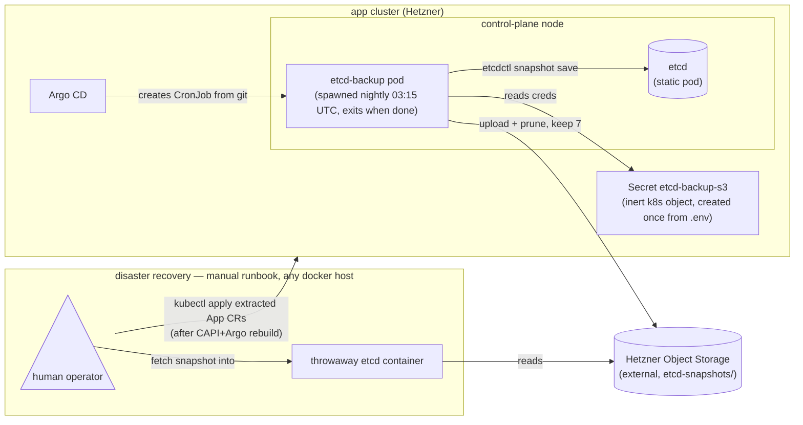

# etcd backup & restore

**Why this exists:** on the single-node prod cluster, App CRs are the only state not reproducible from git — the platform itself is reconciled by Argo, but `kubectl get apps.app.bex.co` lives only in the control-plane node's etcd, on local disk, with no HA. A node rebuild loses every user deployment. Until the control-plane Postgres ([ADR003-control-plane.md](ADR003-control-plane.md), w1/m2) becomes the source of truth, a nightly etcd snapshot shipped off-node is the recovery story.

Only Argo CD and etcd are long-running; the backup itself is a pod that exists for a few seconds a night, the Secret is inert config it reads, and the entire restore column is a manual runbook — nothing is deployed for it until a human runs it:



## What runs

A CronJob `kube-system/etcd-backup` (Argo app `etcd-backup` in the gitops base — every non-disposable cluster gets it; the local overlay excludes it. Manifest in [`deploy/gitops/charts/etcd-backup/`](../deploy/gitops/charts/etcd-backup/cronjob.yaml)):

| step | container | what it does |
| --- | --- | --- |
| snapshot | `registry.k8s.io/etcd` (same image kubeadm already runs) | `etcdctl snapshot save` against `https://127.0.0.1:2379` (hostNetwork, on the control-plane node) using the node's certs from `/etc/kubernetes/pki/etcd` (read-only hostPath) |
| compress | `busybox` | `gzip -9` (neither the etcd nor aws-cli image ships gzip) |
| upload + prune | `amazon/aws-cli` (pinned < 2.23 — newer CLIs send CRC64 checksums S3-compatibles reject) | upload `etcd-<UTC timestamp>.db.gz` to `s3://$S3_BUCKET/etcd-snapshots/`, then delete all but the newest 7 |

Schedule: **03:15 UTC daily**. Retention: **7 snapshots**, pruned by the job itself — no bucket lifecycle rule needed, nothing to configure out-of-band on Hetzner Object Storage.

## One-time setup per cluster

Argo syncs the CronJob from git, but the credentials Secret is created out-of-band (never in git). It reuses the Terraform-state Object Storage creds from `.env`:

```sh
source .env && kubectl -n kube-system create secret generic etcd-backup-s3 \
  --from-literal=S3_ENDPOINT="$TF_STATE_ENDPOINT" \
  --from-literal=S3_BUCKET="$TF_STATE_BUCKET" \
  --from-literal=AWS_DEFAULT_REGION="$TF_STATE_REGION" \
  --from-literal=AWS_ACCESS_KEY_ID="$TF_STATE_ACCESS_KEY" \
  --from-literal=AWS_SECRET_ACCESS_KEY="$TF_STATE_SECRET_KEY"
```

Verify a backup landed (or trigger one now):

```sh
kubectl -n kube-system create job --from=cronjob/etcd-backup etcd-backup-now
kubectl -n kube-system logs job/etcd-backup-now -c upload -f
aws --endpoint-url "$TF_STATE_ENDPOINT" s3 ls "s3://$TF_STATE_BUCKET/etcd-snapshots/"
```

## Restore

Two paths. Prefer A — everything except App CRs is better rebuilt from git than restored from a snapshot.

### A. Selective re-apply onto a fresh cluster (recommended, tested)

Reprovision the cluster the normal way (Cluster API + Argo bootstrap — the platform converges from git), then recover the user state from the snapshot with a throwaway local etcd. Custom resources are stored as plain JSON in etcd, so no cluster surgery is needed:

```sh
# 1. fetch + unpack the latest snapshot
aws --endpoint-url "$TF_STATE_ENDPOINT" s3 cp \
  "s3://$TF_STATE_BUCKET/etcd-snapshots/<latest>.db.gz" . && gunzip <latest>.db.gz

# 2. boot a throwaway etcd from it (any machine with docker) — use the image
#    pinned in the backup CronJob; it matches the cluster's kubeadm etcd
docker run --rm -v "$PWD":/data registry.k8s.io/etcd:3.5.15-0 \
  etcdutl snapshot restore /data/<latest>.db --data-dir /data/restored
docker run -d --name etcd-restore -v "$PWD":/data registry.k8s.io/etcd:3.5.15-0 \
  etcd --data-dir /data/restored

# 3. list and extract the App CRs (JSON), re-apply to the new cluster
docker exec etcd-restore etcdctl get /registry/app.bex.co --prefix --keys-only
docker exec etcd-restore etcdctl get /registry/app.bex.co/apps/<ns>/<name> \
  --print-value-only \
  | jq 'del(.metadata.uid, .metadata.resourceVersion, .metadata.creationTimestamp,
            .metadata.managedFields, .metadata.finalizers, .status)' \
  | kubectl apply -f -

docker rm -f etcd-restore
```

The operator reconciles each re-applied App back to Running (build-from-git Apps rebuild; `spec.image` Apps redeploy directly). Repeat step 3 for `/registry/app.bex.co/databases/…` if Database CRs exist.

### B. Full etcd restore in place

For same-node recovery (disk wipe, etcd corruption) where `/etc/kubernetes/pki` still exists — a full restore brings back **all** cluster state, so only do this when the node identity/PKI is unchanged:

```sh
# on the control-plane node
etcdutl snapshot restore /root/<latest>.db --data-dir /var/lib/etcd-restored
mv /etc/kubernetes/manifests/etcd.yaml /root/          # stop etcd (kubelet removes the pod)
mv /var/lib/etcd /var/lib/etcd-old && mv /var/lib/etcd-restored /var/lib/etcd
mv /root/etcd.yaml /etc/kubernetes/manifests/          # restart etcd
kubectl get apps.app.bex.co -A                         # verify
```

## What was tested

**2026-07-05, local CAPD cluster (single-node, pre-m19):** The full chain ran against a real kubeadm cluster with the real bucket: the Job scheduled onto the control-plane node (nodeSelector + toleration), snapshotted live etcd over hostNetwork with the hostPath certs, uploaded, and pruned 10 objects down to the newest 7. Path A then recovered `/registry/app.bex.co/apps/default/beancount-cms` from the downloaded snapshot via a throwaway etcd. Test objects were removed from the bucket afterwards.

**Multi-node topology re-verification (pending):** The 2026-07-05 test predates the w1/m19 rearchitecture (CAPH-owned network, tainted control plane, CAPI pivot). A re-drill against the current multi-node prod topology is planned; drill procedure and record target are in [ADR031-platform-data-backup.md](ADR031-platform-data-backup.md) §Drill records.
