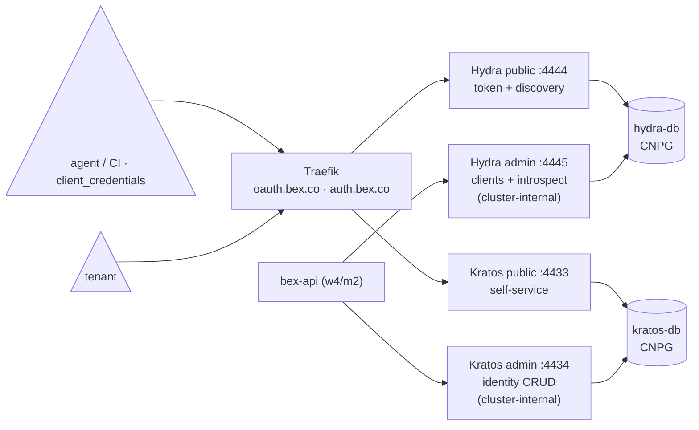

# ADR: platform auth — Ory Kratos (identity) + Ory Hydra (OAuth2/OIDC)

**Status:** accepted and consumed (substrate deployed as GitOps base components and live in prod; bex-api validates against it — see [ADR006-bex-api.md#auth](ADR006-bex-api.md)). The static `BEX_API_TOKEN` is **gone** (w4/m3): every machine caller holds an **API key** = its own OAuth2 client in Hydra, exchanged for short-lived tokens; the first key (`bex-bootstrap`) is seeded by `scripts/auth-bootstrap-client.sh` on every deploy, and further keys are minted via bex-api's `/v1/api-keys`.

## Context

bex-api used to authenticate every caller with **one static bearer token** (`BEX_API_TOKEN`; removed in w4/m3). That was fine for a single operator but is _the_ blocker for multi-tenancy: the vision's control plane needs tenants and accounts (roadmap #1), and the AI-native pillars need **per-client credentials** — an agent that deploys from chat must hold its own revocable token, not the shared admin secret. So the platform needs real identity (who is this?) and real tokens (what may this credential do, until when?) as infrastructure that bex-api and the control plane consume.

## Decision

### 1. Buy Ory, don't build auth into the control plane

Identity + OAuth2 is commodity infrastructure with a brutal correctness bar (password hashing, session fixation, token semantics, OIDC conformance). Building it into bex's Go control plane means owning that bar forever; renting it (Auth0/Clerk) contradicts an open-source, self-hostable platform. **Ory** is the fit:

- **Apache-2.0, CNCF-adjacent, API-first** — same governance test CNPG passed ([ADR009-postgresql-management.md](ADR009-postgresql-management.md) §1).
- **Headless** — Kratos/Hydra are pure APIs; bex keeps its own UX and the Render-compatible API surface.
- **Kubernetes-native** — first-party Helm charts, stateless pods, all state in Postgres (which we already operate well via CNPG).

**Keycloak** was the main alternative — one monolith with an admin UI. Rejected: JVM footprint on a small cluster, realm-centric model that fights an API-first control plane, and its own embedded-ish DB story. Ory splits into small Go services that match how bex is built.

### 2. Kratos vs Hydra — the split of responsibilities

Two services, not one, because the jobs are different:

| service | job | consumed by |
| --- | --- | --- |
| **Kratos** | _identity_: accounts, credentials (email + password to start), self-service flows, admin identity CRUD | tenant sign-up/login; bex-api sessions (w4/m2) |
| **Hydra** | _OAuth2/OIDC_: client registration, token issuance (`client_credentials` first — that's the agent story), introspection | agents/CI holding per-client tokens; bex-api introspection middleware (w4/m2) |

Each has a **public** listener (self-service / OAuth2 endpoints — exposed) and an **admin** listener (identity CRUD / client management / introspection — **cluster-internal only**, no ingress).

### 3. Two CNPG clusters, one database each

Ory hard-requires Kratos and Hydra **not to share a database**. We go one step further — a dedicated CNPG `Cluster` per component ([charts/auth-dbs](../deploy/gitops/charts/auth-dbs/), namespace `auth`, one Argo Application for both since they share sizing and lifecycle policy), mirroring `bex-db`:

- **Independent failover/upgrade/backup** — an identity-store migration can't take down token issuance, and vice versa.
- **CNPG-recommended shape** — one application database per cluster; CNPG generates the `<cluster>-app` credential Secret and the `<cluster>-rw` Service that the DSNs point at.
- Auth state (identities, clients, tokens) lives in Postgres, **not in the pods** — pods are stateless and restartable; this is verified explicitly (below).

### 4. GitOps shape

Everything is an Argo Application in `deploy/gitops/base/`, synced in waves: CNPG operator (1) → `auth-dbs` (2) → `kratos`/`hydra` (3). The Ory apps are **multi-source**: the pinned upstream chart (`ory/kratos`, `ory/hydra`, chart 0.62.1 = app v26.2.0) from the Helm repo + the vendored values from this repo ([base/values/kratos.values.yaml](../deploy/gitops/base/values/kratos.values.yaml), [base/values/hydra.values.yaml](../deploy/gitops/base/values/hydra.values.yaml)). The local overlay patches DB sizing (1Gi, `local-path`) and layers `overlays/local/values/` on top of the base values (local hosts over plain HTTP, Hydra dev mode).

Public endpoints ride the standard edge ([ADR005-custom-domain.md](ADR005-custom-domain.md)): chart-native `Ingress` objects, `ingressClassName: traefik`, cert-manager `letsencrypt-prod` certs — `auth.bex.co` (Kratos public) and `oauth.bex.co` (Hydra public; equals Hydra's `urls.self.issuer`, which OIDC requires to match). The admin Services have **no** Ingress.

### 5. `dashboard/` is Kratos's "custom UI" (w5)

Kratos ships no UI of its own — it expects a "bring your own UI" consumer, registered via `selfservice.flows.*.ui_url`. That consumer is [`dashboard/`](../dashboard) (`docs/ADR008-vision.md`'s human-facing surface): its login/registration/recovery/settings pages render [`@ory/elements-react`](https://www.ory.com/docs/elements)'s flow components against the same Kratos instance, not a hand-rolled auth backend (`dashboard/README.md#authentication`). `kratos.values.yaml` wires this up:

- `selfservice.flows.{login,registration,recovery,settings,verification,error}.ui_url` → `dashboard.bex.co/auth/*` (+ `/settings`) — without these, Kratos redirects self-service flows back to its own domain instead of the dashboard.
- `selfservice.allowed_return_urls` — whitelists the dashboard's origin for the `return_to` param the flow-initiation redirect carries.
- `serve.public.cors` — `dashboard.bex.co` is a different origin from `auth.bex.co`; the dashboard's credentialed cross-origin fetches need explicit CORS + `allow_credentials: true`.
- `session.cookie.domain: bex.co` — scopes the session cookie to every `*.bex.co` subdomain so it's sent as same-site (not cross-site) from the dashboard to Kratos, avoiding the weaker `SameSite=None`.
- `selfservice.flows.registration.after.password.hooks: [{hook: session}]` — Kratos does **not** auto-issue a session after registration by default; without this hook the user registers successfully but lands back at the login screen with no session (a real, easy-to-miss gotcha — confirmed by driving an actual browser through the flow against the local mock cluster).
- Recovery initializes but can't deliver mail until `courier.smtp` lands (courier is disabled — no SMTP yet); see Consequences.

**Local dev**: `auth.bex.local`'s Ingress has no DNS/hosts entry and Traefik isn't exposed to the host, so it's unreachable from a laptop-run dashboard dev server. `overlays/local/values/kratos.values.yaml` instead points `base_url`/the flow `ui_url`s at `localhost:4433`/`localhost:5173` — reach Kratos via `kubectl -n auth port-forward service/kratos-public 4433:80` (the same pattern `scripts/auth-verify.sh`/`scripts/auth-e2e.sh` already use), then `VITE_KRATOS_PUBLIC_URL=http://localhost:4433 yarn dev` in `dashboard/`.

**Deployment.** Unlike bex-api, the dashboard doesn't ship in the operator image (it's a separate Node.js/Vite app) — it's its own image (`dashboard/Dockerfile`) built and rolled by `.github/workflows/deploy.yml` the same way the operator is, deployed via its own Argo Application (`deploy/gitops/base/dashboard.yaml`) pointing at `dashboard/deploy` (kustomize: Deployment + Service + Ingress at `dashboard.bex.co`), namespace `dashboard`. Its `VITE_KRATOS_*`/`VITE_*API_URL` values are Vite **build-time** values (Dockerfile `ARG`s) baked into the JS bundle — the SSR ones (`VITE_KRATOS_SSR_URL`, `VITE_SSR_API_URL`) point at in-cluster Service DNS (`kratos-public.auth.svc:80`, `bex-api.bex-system.svc:8090`) since the dashboard's own pod reaches them directly rather than back out through the public ingress; changing them means rebuilding the image, not just setting a container env var. Verified end-to-end against the local mock cluster: built the image, `kind load docker-image`d it in, applied `dashboard/deploy` directly (Argo isn't installed on the mock cluster — same as how kratos/hydra config changes were applied directly via `helm upgrade` above), then drove a real browser through registration/login/logout against the running pod (port-forwarded to the laptop, `kubectl -n dashboard port-forward service/dashboard 5173:80`, reusing the same `localhost:5173` the local Kratos `ui_url`s already point at).

One real deploy-specific bug this surfaced: the Dockerfile's runtime stage never dropped to a non-root user, but the Deployment requires `runAsNonRoot: true` — Kubernetes refused to start the container (`CreateContainerConfigError`). Fixed with `USER node` (Dockerfile) + explicit `runAsUser: 1000`/`runAsGroup: 1000` (Kubernetes can't resolve a _named_ user for the non-root check, only a numeric UID).

### 6. Secrets: out-of-band, never in git

The charts' built-in Secret rendering is **disabled** (`secret.enabled: false`) so no secret material can appear in git or Argo state. [scripts/auth-secrets.sh](../scripts/auth-secrets.sh) creates the two Secrets (`auth/kratos`, `auth/hydra`) out-of-band:

- **DSNs are composed, not stored** — the script reads the CNPG-generated `kratos-db-app`/`hydra-db-app` credentials and builds `postgres://…@<cluster>-rw.auth.svc:5432/…?sslmode=require`. DB passwords never live in `.env`.
- **Ory secrets come from `.env`** (gitignored, same rule as `bex.kubeconfig`): `KRATOS_SECRETS_{DEFAULT,COOKIE,CIPHER}`, `HYDRA_SECRETS_{SYSTEM,COOKIE}`, `HYDRA_OIDC_PAIRWISE_SALT`. The script validates presence/length and never echoes values; `DRY_RUN=1` prints resource names only.
- **Social-login provider secret** (optional, §10): when `BEX_GITHUB_OIDC_CLIENT_ID` + `BEX_GITHUB_OIDC_CLIENT_SECRET` are in `.env`, the script writes the GitHub provider into the `kratos` Secret's `oidc.yaml` key; unset ⇒ that key is written `enabled: false`. The key is **always present**, so the Kratos pod's second `--config` mount never dangles.
- **Prod path**: `scripts/gh-secrets.sh` pushes the six keys from `.env` into GitHub Actions secrets, and `deploy.yml`'s "apply auth secrets" step runs `auth-secrets.sh` against the Hetzner app cluster on every deploy (it waits for the CNPG-generated credentials first; the kratos/hydra Applications carry a sync `retry` so the first sync self-heals once the Secrets exist).
- Production-grade committed secrets (SOPS/sealed-secrets) are w1/m7 t003; when that lands, these Secrets become sealed and the script retires.

### 7. OAuth 2.1 provider for agents: one dashboard login, first-party sessions + third-party clients (w4/m9)

The dashboard itself never uses OAuth — it authenticates with its Kratos session cookie, full stop (`.pm/DO_NOT_DO.md`: browser-held tokens are banned; IETF `draft-ietf-oauth-browser-based-apps` ranks them last, and Ory's guidance is "first-party = sessions, Hydra = third-party/machine"). What w4/m9 adds is the **provider side**: a third-party OAuth 2.1 client — an MCP agent like Claude Code — self-registers, sends its user through **the same dashboard login page**, and gets a user-consented access token for bex-api. Four pieces, none of them a custom login provider:

- **Kratos's native bridge does the login.** `oauth2_provider.url: http://hydra-admin.auth.svc:4445` (+ `override_return_to`) in [kratos.values.yaml](../deploy/gitops/base/values/kratos.values.yaml) makes **Kratos itself** resolve and accept Hydra's login challenges. Hydra's `urls.login` points at the dashboard login page, which only **passes `login_challenge` through** when creating the Kratos flow (`use-ory-flow.ts`; OAuth-linked flows are minted fresh, never resumed from storage, and never persisted). A stale challenge degrades to the ordinary login page — the challenge is advisory, never load-bearing.

  **What an existing session does (w4/m17).** Every authorization re-runs the login redirect (Kratos accepts each challenge without asking Hydra to remember the login), so a signed-in browser lands on the login page holding a live session. What Kratos answers there depends on what Hydra asked for, and neither shape is the `browser_location_change_required` this ADR used to claim — Kratos v1.3.1 does not raise it here:

  - Hydra has no login session for the browser yet (its **first** authorization) ⇒ the login request is not skippable, and Kratos returns a **re-authentication flow** — the password form with the identifier prefilled, "confirm this action by verifying that it is you". The user confirms once and continues.
  - Hydra already has one (**every subsequent** authorization — connecting a second agent, or the same agent past its token's life) ⇒ Kratos accepts the challenge against the session and answers the AJAX call with **HTTP 200 and a body of literally `null`**: no flow, no redirect, nothing to render. The hook must hand the challenge back to Kratos as a plain **browser** navigation (`bootstrapViaKratos`, no `Accept: application/json`), which 303s straight to Hydra's continue URL. Rendering the `null` instead left the page on its loading skeleton forever — the commonest connect-an-agent path, dead-ended, until w4/m17 fixed it.

  Both shapes are covered by [scripts/auth-oauth21-e2e.sh](../scripts/auth-oauth21-e2e.sh) (leg 13 reuses a signed-in cookie jar and asserts no re-authentication happens) and by the `use-ory-flow` unit tests.

- **Consent: headless for trusted clients, a real screen for everyone else (w4/m16).** Hydra never skips the consent _redirect_ (by design) and ships no consent screen of its own — it is the one piece Ory deliberately leaves to the app. `urls.consent` points at `/auth/consent` ([hydra-consent.ts](../dashboard/src/common/server-fn/hydra-consent.ts) + [auth.consent.tsx](../dashboard/src/routes/auth.consent.tsx)), whose server handler decides:

  - **Trusted/remembered ⇒ headless.** Hydra marks the request skippable (`skip`, incl. `skip_consent` clients) or the client is in `OAUTH_TRUSTED_CLIENTS` ⇒ accept immediately, no UI, <100ms. Unchanged since w4/m9.
  - **Anyone else ⇒ the signed-in human decides.** A self-registered (DCR) agent gets a consent page naming the client and listing the requested scopes + access-token audience; Approve grants exactly what was requested (`remember: true`, 1h — a second authorization inside the window skips the page), Deny rejects the flow (`error=access_denied` back at the agent's redirect_uri). No operator action is required for either outcome, and a consented client's token is indistinguishable from a blessed client's downstream — both grant through the same accept call.
  - **Every failure denies.** No Kratos session ⇒ redirect to login and back (never a silent grant); a session whose identity isn't the challenge's `subject` ⇒ refused; a cross-site POST (`Origin` must name the dashboard) or a forged CSRF token — `sha256(challenge : Kratos session id)`, unforgeable without the HttpOnly session cookie, stateless across replicas — ⇒ refused; a missing PKCE `code_challenge` ⇒ 400 (w6/003); a stale challenge ⇒ degrade to home. Only Hydra-returned `redirect_to` values are ever redirected to, so there is no open redirect.

  Its `HYDRA_ADMIN_URL` env is deliberately not `VITE_`-prefixed — server-only, never in the client bundle; only the safe-to-render subset of the consent request (client name, scopes, audience, CSRF token) crosses the wire.

- **Agents self-register and self-discover.** Hydra's OIDC **Dynamic Client Registration** is enabled (`oidc.dynamic_client_registration.enabled`, public `POST /oauth2/register` on Hydra 2.x — verified live); registered clients are _not_ auto-trusted. bex-api serves **RFC 9728 protected-resource metadata** (`GET /.well-known/oauth-protected-resource`, open by design) and enriches its 401s with `WWW-Authenticate: Bearer resource_metadata="…"`, so an agent that hits `/mcp` unauthenticated can find the authorization server per the MCP authorization spec. Both are gated on `BEX_OAUTH_ISSUER` + `BEX_OAUTH_RESOURCE` (unset ⇒ byte-identical prior behavior).
- **Audience discipline (RFC 8707, the honest subset).** Hydra doesn't implement RFC 8707's `resource` parameter — it has its own `audience` request param — so bex-api enforces the MCP spec's audience check pragmatically: a token whose introspected `aud` is non-empty must include `BEX_OAUTH_RESOURCE` or it's rejected; **empty-`aud` tokens stay accepted** because client_credentials API keys carry no audience and must keep working. Agents that request `audience=<resource>` at authorize time get the full check.

**Verified end-to-end** by [scripts/auth-oauth21-e2e.sh](../scripts/auth-oauth21-e2e.sh) — throwaway dockerized Hydra + Kratos (in-memory), the real dashboard consent route, the real bex-api: RFC 9728 discovery → DCR → authorize (PKCE S256) → Kratos-native login-challenge accept → consent → code → token (access + refresh) → `Authorization: Bearer` passing bex-api introspection + audience check. It drives **both** consent paths: a blessed client (`skip_consent` PATCH — how a real trusted agent is onboarded) straight through headlessly, and three unblessed DCR clients through the consent page itself — approve (→ working `/mcp` token), deny (→ `error=access_denied`, no code), and a repeat authorization inside the remember window (→ no consent page). The page is a server-rendered form, so curl drives it exactly as a browser does. Run it locally with Docker; on the mock cluster the same config ships via the kratos/hydra value overlays.

### 8. API-key hygiene: access-token TTL + key metadata (w4/m13)

The API-key surface is [ahead of Render](ADR018-render-parity.md#bex-ahead-of-render) (Render mints keys dashboard-only; bex makes them first-class, revocable OAuth2 clients over REST/GraphQL/MCP), so it carries its own basic hygiene rather than inheriting Render's.

- **Access-token TTL is deliberate, not the default.** `hydra.config.ttl.access_token: 15m` ([hydra.values.yaml](../deploy/gitops/base/values/hydra.values.yaml)) tunes token lifetime down from Hydra's 1-hour default. API keys use `client_credentials`, which issues **no refresh token**, and bex lets any caller re-mint a token freely — so a short window bounds a leaked or stale access token's blast radius while costing callers only a cheap re-mint. 15m is the balance point against introspection load: bex-api caches positive introspections ≤30s ([`core.PositiveTTL`](../lego/backend/internal/core/http.go)), so the extra re-issuance traffic is negligible. The knob is global, so OAuth 2.1 user access tokens shorten too — they carry refresh tokens, so it's transparent to those callers. **Distinct from revocation latency:** deleting a key stops _new_ tokens immediately, but an already-issued token stays `active` until its own `exp` (bounded by this TTL) minus bex-api's ≤30s introspection cache.
- **Keys carry `created-by` + `last-used`, recorded off the hot path.** Each bex-minted Hydra client stores `bex.co/created-by` (the minting caller's `IdentityFrom` subject — a Kratos identity id or client_id) in its `metadata` at create time, and `bex.co/last-used` (an RFC 3339 timestamp) written from the introspection path. The last-used write is **never a per-request store write**: the auth gate calls a fire-and-forget `TouchAPIKey` after a successful API-key introspection, throttled in-memory to **at most one Hydra write per key per minute** and executed on a background goroutine, so a chatty agent adds nothing synchronous to its request path (and a non-API-key client — a platform or OAuth 2.1 agent client — is filtered out by the marker check before any write). Both fields surface on every list surface (REST/GraphQL/MCP) and the Settings → API Keys page; the create response omits `last-used` (a fresh key has never been used). This provenance + last-used pair is the prerequisite for any future stale-key or rotation policy.

### 8a. Official Render CLI device login (w4/m27)

Interactive CLI auth is a third credential shape alongside Kratos dashboard sessions and confidential API-key clients. bex does not fork the CLI: the official `render-oss/cli` hard-codes public client `429024F5E608930E2A65EF92591A25CC` and calls Render-shaped `/device-grant`, `/device-token`, `/token/refresh/`, and `/oauth/revoke` routes.

- **One permanent public client, not one client per user.** [`scripts/auth-bootstrap-client.sh`](../scripts/auth-bootstrap-client.sh) idempotently creates or updates the fixed Hydra client with `token_endpoint_auth_method=none`, device-code + refresh-token grants, `openid offline_access`, and no client secret. It is platform configuration, not a bex API key: API-key reads select only clients carrying the `bex.co/api-key` marker, so this client never appears in Settings → API Keys.
- **Thin Render wire adapters, native Hydra semantics.** `internal/cliauth` accepts the CLI's JSON bodies despite their form content type and forwards form-encoded RFC 8628 requests to Hydra. Only the three initiation/exchange endpoints are public; `/v1/oauth/revoke` and every resource route remain behind the ordinary bex auth gate. Hydra owns pending, expiry, refresh rotation, and token errors.
- **The dashboard remains a Kratos-session app.** Hydra first redirects the verification browser to `/auth/device`, which binds the user code to a Hydra device challenge and continues through the existing Kratos-native login bridge and Hydra consent page. The dashboard never receives or stores the CLI's access/refresh tokens. Kratos must allow Hydra's public issuer as a return URL (`https://oauth.bex.co` in production), because the post-login browser returns to `/oauth2/device/verify` before consent.
- **Short-lived tokens refresh; no bearer is immortal.** The same 15-minute access TTL applies. The CLI stores Hydra's rotating refresh token and automatically refreshes when its stored expiry is within 24 hours—therefore on every command under bex's current TTL. `RENDER_API_KEY` is a separate machine override and has no refresh path; CI exchanges its client credentials at the start of each job.
- **Logout revokes one human, never the shared client.** A fixed-client human token carries the Kratos identity in `sub`; bex uses that subject for ordinary tenant onboarding and authorization. `render logout` deletes the Hydra consent sessions for `(subject, fixed client)`, invalidating that user's access/refresh chain without affecting another subject. bex also evicts every positive introspection-cache entry for that subject+client, including the access token the CLI refreshed immediately before logout. API-key callers retain their existing self-revoke behavior.

[`scripts/render-cli-auth-e2e.sh`](../scripts/render-cli-auth-e2e.sh) is the authoritative proof with the official CLI pinned at `c23438e`: two real Chrome/Kratos logins, distinct human workspaces, forced access+refresh rotation, logout followed by old-access 401 + old-refresh `invalid_grant`, second-user continuity, shared-client preservation, and absence from the API-key list. The isolated dev-3 run passed on 2026-07-15; production evidence remains the final rollout gate.

### 9. Multi-factor authentication: TOTP + WebAuthn as **second** factor (w4/m11)

A PaaS that holds tenants' database credentials and deploy keys needs the account itself protectable by a second factor **before** real tenants exist (forcing enrollment on live users later is far worse). This is pure Kratos config + Ory Elements rendering — **no custom auth code** — turned on in [kratos.values.yaml](../deploy/gitops/base/values/kratos.values.yaml):

- **Three methods, all second-factor.** `totp` (issuer `bex` — the label in the authenticator app), `webauthn` with **`passwordless: false`**, and `lookup_secret` (recovery codes). Password stays the sole first factor. The `passwordless: false` choice is load-bearing: WebAuthn's passkey/first-factor mode (`passwordless: true`) and Kratos's separate `passkey` method are **first-factor only and cannot satisfy an aal2 challenge** — the whole point here — so first-factor passkey login is explicitly _not_ taken (a separate product decision). WebAuthn's browser ceremony can't be scripted over curl; it's a manual browser check, while TOTP + recovery codes are fully scripted (below).
- **`highest_available` makes enrollment bite, and only then.** `session.whoami.required_aal` and the settings flow's `required_aal` are both `highest_available`: a session counts as fully authenticated only at the highest AAL the identity _can_ reach. A password-only identity is satisfied at aal1 (its login is completely unchanged). Once an identity has a second factor, `highest_available` becomes aal2 — so any session established afterward (the **next login**) 403s on `/sessions/whoami` (`session_aal2_required`) until the second factor is presented; the enrolling session itself, created before the credential existed, stays valid. Settings additionally require aal2 to change credentials from a session that has fallen outside its privileged window (Kratos gates privileged submits by session recency, so the just-authenticated session can enroll without stepping up — verified on prod). The user-visible effect is what matters: **enroll a second factor, and the next login demands it.**
- **WebAuthn RP ID is `bex.co` — and is forever.** The relying-party ID must be a registrable parent of every origin that runs the ceremony (`dashboard.bex.co`, `auth.bex.co`), so `rp.id: bex.co`, `rp.origins: [https://dashboard.bex.co]`. **This is set in the base values because base values ARE prod** — there is no prod Kratos overlay; the kratos Application auto-syncs `main` with prune + selfHeal, and Kratos refuses to start with WebAuthn enabled but no RP config, so a placeholder-then-fix would either crashloop prod or strand early enrollments. **Changing the RP ID later invalidates every already-registered security key** — it is chosen once, permanently. The [local overlay](../deploy/gitops/overlays/local/values/kratos.values.yaml) deep-merges an override to `rp.id: localhost` / `origins: [http://localhost:5173]` for the mock stack (the base's `bex.co` can't sign ceremonies served from localhost); `passwordless: false` and the TOTP/lookup_secret config carry through the merge untouched.
- **The dashboard renders it with zero bespoke form code.** Settings' `<Settings>` and login's `<Login>` (Ory Elements) already track whatever methods Kratos enables, so the enroll/unenroll TOTP · security-key · recovery-code sections and the second-factor challenge appear automatically. The one wiring addition is the **aal2 step-up**, and since w4/m17 it is driven by the session fetch rather than rediscovered at the login page: [`fetchSession`](../dashboard/src/common/server-fn/session.ts) reads the `session_aal2_required` id off `whoami`'s 403 and reports `aal2Required` alongside the (null) session, so the auth guard ([`requireAuth`](../dashboard/src/common/lib/auth/auth.ts)) and the consent route's login-first bounce both redirect to `/auth/login?aal=aal2`, and [use-ory-flow.ts](../dashboard/src/common/hooks/use-ory-flow.ts) asks Kratos for the step-up flow **first** — no trial flow, because only the session fetch can tell a step-up from a sign-in, and it now says which. Two guards remain, because not every answer Kratos gives is a challenge: a flow whose own `requested_aal` is aal2 but which carries no second-factor node would render an empty card (an identity with no second factor, reachable only by hand-typing `?aal=aal2`) ⇒ navigate on; and `session_aal1_required` — a stale step-up link with no session behind it — falls back to an ordinary first-factor login.

**Verified** by [scripts/auth-mfa-e2e.sh](../scripts/auth-mfa-e2e.sh) (exit 0 = pass): register → enroll TOTP + `lookup_secret` recovery codes from the settings flow (secret + codes read from the flow; TOTP codes computed from the secret) → assert password-only login is aal1/`whoami` 403 → a wrong TOTP code is rejected while the right one upgrades to aal2 → a recovery code logs in "without the device" and is rejected on reuse (single-use). It runs against the mock cluster's `kratos-public` by default, or set `KRATOS_PUBLIC_URL=https://auth.bex.co` for the prod smoke — **this ran green against prod on 2026-07-11**, and the config rolled out to the live cluster (Kratos `1/1`, no crashloop) via Argo auto-sync. The WebAuthn browser ceremony is the one remaining manual check.

### 10. Social login: Sign in with GitHub (Kratos `oidc`, w4/003)

A developer PaaS' users already live on GitHub, so "Sign in with GitHub" is the expected first social provider. Like MFA (§9), this is **pure Kratos config + Ory Elements rendering — no custom auth code, and no custom login provider** (`.pm/DO_NOT_DO.md`): Kratos's built-in `oidc` method _is_ identity federation, distinct from the Hydra login-challenge bridge §7 wires (that federates bex-api's own tokens, not third-party identities). It is **off by default** and opt-in per installation.

- **Who owns the GitHub OAuth app: each installation owns its own.** This mirrors the self-hosted GitHub _App_ decision ([ADR026-github-integration.md](ADR026-github-integration.md)) — a shared bex-owned OAuth app can't serve every self-hoster's callback domain, and centralizing it would route every install's logins through bex.co. So a self-hoster creates their own **GitHub OAuth app** (Settings → Developer settings → OAuth Apps — the classic OAuth app, not the richer GitHub App the deploy path uses) and sets its **Authorization callback URL** to `https://auth.<base-domain>/self-service/methods/oidc/callback/github` (Kratos's fixed OIDC callback path for the provider id `github`). bex.co's hosted instance owns one such app; the client id/secret are the only per-install inputs.

- **The client secret rides the out-of-band `kratos` Secret, never git.** The provider's `client_secret` is secret material, so it can't sit in the git-committed `kratos.values.yaml`. Kratos accepts **repeated `--config` flags and deep-merges them**, so [scripts/auth-secrets.sh](../scripts/auth-secrets.sh) writes a **second config file** — the `oidc.yaml` key of the `kratos` Secret — carrying just the `selfservice.methods.oidc` block (the GitHub provider with its id/secret from `.env`), and the base values mount it as a second `--config` via `deployment.extraArgs`/`extraVolumes` ([kratos.values.yaml](../deploy/gitops/base/values/kratos.values.yaml)). The claims→traits mapper (a one-line Jsonnet, `claims.email → traits.email`) is inlined into that file via Kratos's `base64://` URL scheme, so nothing extra needs mounting. The key is **always written** — the GitHub provider when `BEX_GITHUB_OIDC_*` are set, else a valid `enabled: false` no-op — so the mount never dangles and Kratos never crashloops on a missing `--config` target. **Enabling social login is therefore `.env` + a re-deploy, with no git change** (`deploy.yml` runs `auth-secrets.sh` every deploy); this is the same self-heal shape the DSN/cookie secrets already use.

- **The dashboard renders the button with zero bespoke code.** Ory Elements' `<Login>`/`<Registration>` already track whatever methods Kratos enables (same property MFA relies on), so an enabled provider surfaces a "Sign in with GitHub" button automatically — the login flow gains an `oidc` node (`provider: github`) that Elements turns into the button. No dashboard change ships with this.

**Verified** by [scripts/auth-oidc-e2e.sh](../scripts/auth-oidc-e2e.sh) (exit 0 = pass): it stands up a throwaway **Dex** (dexidp.io) as a stand-in OIDC provider — GitHub can't redirect to `localhost`, so a local check pins the _mechanism_, not GitHub's servers — and a real Kratos wired exactly as prod is (the `oidc` method loaded from a **second `--config` file** with the same `base64://` mapper, only `provider: generic` pointing at Dex in place of `github`). It drives the full browser dance in one cookie jar: start a Kratos login flow → assert it carries the `oidc` provider node (the button) → submit `method=oidc` → Dex authorize + login → callback → Kratos runs the mapper, mints the identity, issues a **first-party session** → `/sessions/whoami` returns the mapped email → the identity carries an `oidc` (federated) credential. Kratos and Dex share a network namespace so `localhost:5556` is Dex from the host, from inside the Kratos container's OIDC back-channel, and in Dex's own issuer URL — one URL, no split-horizon. The GitHub-specific bits (`provider: github`, `scope: [user:email]`) are config-only; every other moving part is exercised for real.

**Prod smoke:** [scripts/auth-oidc-verify.sh](../scripts/auth-oidc-verify.sh) (read-only; `KUBECONFIG=… scripts/auth-oidc-verify.sh`) reports the deployment side against a live cluster — that the `kratos` Secret's `oidc.yaml` key is present and _enabled_, that the Deployment loads it as a second `--config`, that the rollout is healthy, and that `auth.<base-domain>`'s login flow advertises the provider node. It exits non-zero until social login is fully live, so it doubles as the post-deploy gate; the final click-through (dashboard login → "Sign in with GitHub" → authorize) stays a manual check.

### 11. Email delivery: one SMTP relay for Kratos's courier and bex-api's mailer (w4/m7)

The identity lifecycle only closes once mail actually sends: without a courier, account **recovery** (forgot-password) and **verification** (confirm-your-address) initialize but dead-end — the dashboard advertises a "reset password" flow it cannot deliver, and every real signup risks a permanent lockout. bex has **two** mail senders — Kratos's **courier** (recovery + verification) and bex-api's **mailer** (workspace-invite email, [ADR024-members.md](ADR024-members.md)) — and they are deliberately pointed at **one SMTP relay**, so a self-hoster configures a single provider, not two.

- **Provider: SendGrid, as a pure SMTP relay — no vendor SDK (default, provider-agnostic).** The mechanism on both sides is an ordinary SMTP connection URI / `host:port`, so the choice of provider is the operator's, not baked into bex. bex.co's hosted instance uses SendGrid: Kratos's courier takes `smtp://apikey:<sendgrid-api-key>@smtp.sendgrid.net:587` (the literal username `apikey` is SendGrid's SMTP convention — the API key is the password); bex-api's mailer takes `BEX_SMTP_ADDR=smtp.sendgrid.net:587`, `BEX_SMTP_USERNAME=apikey`, `BEX_SMTP_PASSWORD=<sendgrid-api-key>`, `BEX_SMTP_FROM`. Point them anywhere else (Postmark, SES, a local relay) and nothing else changes.

- **Port 587 + STARTTLS, NOT 465 — Hetzner blocks outbound implicit-TLS SMTP.** This is the one non-obvious deployment constraint, and it is invisible until a real send is attempted from inside the cluster (a local Mailpit catcher on `:1025` never exercises external egress). Measured from a platform-pool pod on the Hetzner app cluster: **`25` and `465` time out; `587` and `2525` are open.** So the courier URI must be `smtp://…:587` (STARTTLS — still fully encrypted, just negotiated after connect) rather than the `smtps://…:465` implicit-TLS form SendGrid's docs lead with. Symptom if you get this wrong: the flow looks healthy (`state: sent_email`, a code is minted) but the courier logs `Unable to dial SMTP connection … dial tcp …:465: i/o timeout` on a retry loop and no mail ever lands. `2525` is the fallback if a host also blocks 587.

- **SendGrid deliverability prerequisites (account-side, out-of-band — documented, not automated):** authenticate the **from-address domain** so mail isn't dropped or spam-foldered — SendGrid's _Sender/Domain Authentication_ publishes the **SPF** and **DKIM** DNS records the receiving side checks; the `from` address itself (e.g. `no-reply@bex.co`) is set in the courier values (`courier.smtp.from_address`/`from_name`) and `BEX_SMTP_FROM`. These are one-time DNS + SendGrid-console steps for whoever owns the domain.

- **The SMTP secret rides the out-of-band `kratos` Secret, never git** (same shape as the DSN/cookie/`oidc.yaml` material, §6). `KRATOS_COURIER_SMTP_URI` in `.env` → [scripts/auth-secrets.sh](../scripts/auth-secrets.sh) writes it into the `kratos` Secret under the **chart key `smtpConnectionURI`**; the Kratos chart (0.62.1) injects it as the courier's `COURIER_SMTP_CONNECTION_URI` env. The git-committed [kratos.values.yaml](../deploy/gitops/base/values/kratos.values.yaml) carries only a **non-secret placeholder** in `courier.smtp.connection_uri` — a non-empty _gate_ that turns the env injection on; the chart strips it from the rendered ConfigMap, so the real URI only ever exists in the Secret. bex-api's `BEX_SMTP_USERNAME`/`BEX_SMTP_PASSWORD` are secret material too and reach its pod via a Secret ref ([deployment.yaml](../lego/operator/config/api/deployment.yaml)); `BEX_SMTP_ADDR`/`BEX_SMTP_FROM` are non-secret values. `deploy.yml` supplies all of it on every deploy through the existing "apply auth secrets" step — enabling mail is `.env` + a re-deploy, no git change.

- **The courier is a dedicated StatefulSet.** `courier.enabled: true` renders a separate `kratos courier watch` StatefulSet (the main Deployment doesn't send mail), scheduled by the chart's top-level `statefulSet.nodeSelector`/`tolerations` — pinned to `bex.co/pool=platform` alongside the server Deployment and migration Job so the courier never lands on the tenant pool and die with a tenant scale-down.

- **Local: Mailpit, a throwaway catcher.** The mock cluster runs [Mailpit](https://mailpit.axllent.org/) (SMTP `:1025`, HTTP API/UI `:8025`) as a **local-overlay-only** Argo Application ([overlays/local](../deploy/gitops/overlays/local/) — nothing Mailpit-related renders in prod). Its URI arrives through the same Secret, not overlay values: run `KRATOS_COURIER_SMTP_URI=smtp://mailpit.auth.svc:1025/?disable_starttls=true scripts/auth-secrets.sh` (Mailpit offers no TLS, so `disable_starttls` is required; prod's `smtps://` uses implicit TLS instead). Mailpit's HTTP API makes recovery/verification codes scriptable.

**Prod smoke (do this after any relay change — the local harness cannot catch an egress block):** trigger a real recovery against the live cluster and read the courier's log. `Courier sent out message.` = the relay accepted it; `Unable to dial SMTP connection` = the port is blocked (see the 587-not-465 note above). Confirm from the provider side with SendGrid's `/v3/stats` (`requests`/`delivered`/`blocks`). Verified this way on 2026-07-12: recovery mail dispatched, `delivered`, zero bounces/blocks, and `bex.co` shows `valid: true` + DKIM in SendGrid's `/v3/whitelabel/domains`.

**Verified** by [scripts/auth-mail-e2e.sh](../scripts/auth-mail-e2e.sh) (exit 0 = pass): it stands up a real Kratos wired exactly as prod is (courier enabled, `code` recovery + verification), a **Mailpit** catcher, and drives the full flows over Kratos's public API — admin-create an identity → submit recovery → pull the code from Mailpit's HTTP API → complete the reset → the **new** password logs in and the **old** one is rejected; then register a fresh identity → the verification mail arrives → completing it flips the identity's address to `verified: true`. It also asserts the negative cases (garbage/expired code rejected; recovery for an unknown email neither errors nor sends mail — anti-enumeration). Same self-contained-Docker shape as [auth-oidc-e2e.sh](../scripts/auth-oidc-e2e.sh), so it runs in CI without the CAPD/Argo substrate. The dashboard's forgot-password → reset-password click-through is the one manual browser check.

## Authorization (OpenFGA)

Authentication says who is calling; **authorization** says what they may touch. bex uses **OpenFGA** (Zanzibar-style ReBAC, Apache-2.0/CNCF — the same governance test CNPG and Ory passed) as a fourth base component: [base/openfga.yaml](../deploy/gitops/base/openfga.yaml) (pinned chart 0.3.10, cluster-internal only — no ingress, playground off, preshared-key API) against its own CNPG cluster `openfga-db` ([charts/auth-dbs](../deploy/gitops/charts/auth-dbs/)).

**Why OpenFGA and not…** _roles in the control-plane Postgres_ — role checks ossify into `if admin` conditionals; relations ("member of the tenant that owns this app") are the actual product semantics and stay queryable both ways (list what X can see). _Ory Keto_ — would keep the Ory family, but OpenFGA has the healthier ecosystem, a first-class model DSL + CLI, and a CNCF track; Keto's Zanzibar implementation has lagged. The model is small enough that switching later is a rewrite of one file and one seam implementation.

**The model** ([deploy/gitops/authz/model.fga](../deploy/gitops/authz/model.fga), applied as `model.json`) **mirrors Render's permissions management** (render.com/docs/team-members, fetched 2026-07-06) so bex stays Render-consistent in authorization exactly as it is in API shape: an `org` layer (Render Organizations — org admins administer every member workspace) above `workspace` (Render's workspace/team) with Render's five member roles and their documented capability split:

| role · permission | can_view | can_view_logs | can_operate | can_create | can_view_sensitive | can_manage_keys | can_manage_ssh_keys | can_manage | can_manage_billing |
| --- | --- | --- | --- | --- | --- | --- | --- | --- | --- |
| **admin** | ✓ | ✓ | ✓ | ✓ | ✓ | ✓ | ✓ | ✓ | ✓ |
| **developer** | ✓ | ✓ | ✓ | ✓ | ✓ | ✓ | ✓ |  |  |
| **contributor** | ✓ | ✓ | ✓ |  |  |  | ✓ |  |  |
| **viewer** | ✓ |  |  |  |  |  | ✓ |  |  |
| **billing** | ✓ |  |  |  |  |  | ✓ |  | ✓ |

(Render verbatim: viewers are read-only and "can't view service logs or sensitive fields"; contributors "can't view sensitive fields (billing info, connection strings, environment variables)" and can't create/delete most resources; developers get full resource access but no org settings; billing gets billing only.) `can_manage_ssh_keys` is a bex extension: every authenticated workspace member may manage only the SSH public keys attached to their own identity; access to a target service remains separately gated by that service's `can_operate`. `service`/`postgres`/`api_key` objects are workspace-ownable for per-object tuples later. Since w1/m9 each check targets the caller's workspace — `workspace:tea-<id>` for a tenant member or a bound API key — with `workspace:default` reserved for the platform bootstrap (`bex-bootstrap`) and the legacy store-off mode. Subjects are exactly the strings the auth gate resolves (`api.IdentityFrom`): Hydra `client_id`s and Kratos identity ids. The full role×permission matrix was verified live against OpenFGA on the mock cluster.

**Verified against Render's live dashboard** (2026-07-06, [docs/render-artifacts/team-members.graphql](render-artifacts/team-members.graphql)): the Team Members tab's own GraphQL is `usersAndPendingForTeam(ownerId) { owner { usage { users { used limit } } team { members { role active user{…} } pendingInvites { id email role expiresAt } } } }`, and a member's `role` comes back as the **UPPERCASE** enum (`"ADMIN"` confirmed live; `DEVELOPER`/`CONTRIBUTOR`/`VIEWER`/`BILLING` per the docs). Render uses three interchangeable words for this entity — **workspace** (UI), **team** (`owner.team`, id `tea-…`), **owner** (the polymorphic resource parent, user-or-team). bex's `workspace` type _is_ that entity, and its five roles + capability split match Render's exactly. bex's members/roles API shipped in w4/m12 ([ADR024-members.md](ADR024-members.md)): invite by email / list / change-role / remove across REST·GraphQL·MCP·UI, writing `tenant_members` rows and the OpenFGA role tuples together, mapping the UPPERCASE wire enum to these lowercase FGA relations, with invites redeemed into a membership on the recipient's first login. It flattens Render's `owner.team` nesting into workspace-scoped queries (bex has no polymorphic `owner`) and keys members by identity subject rather than `user{email}` — the two recorded divergences.

**Enforcement** lives in bex-api's Core (one guard per verb, mapped to the Render matrix — lists/details/metrics ⇒ `can_view`, logs ⇒ `can_view_logs`, restart/suspend/resume and SSH target access ⇒ `can_operate`, create/delete resources ⇒ `can_create`, connection-info ⇒ `can_view_sensitive`, API keys ⇒ `can_manage_keys`, own SSH public keys ⇒ `can_manage_ssh_keys`) through the injected `Checker` seam (`lego/backend/internal/api/authz.go`):

- `BEX_OPENFGA_URL` **unset ⇒ nil checker ⇒ every verb allowed** — the pre-authorization behavior, byte-for-byte. Setting the URL is the deliberate enforcement flip (set in [lego/operator/config/api/deployment.yaml](../lego/operator/config/api/deployment.yaml) since w1/m9, paired with `BEX_CP_DB_URI`): tenant onboarding now mints a workspace on a human's first login and binds each minted API key to its tenant, so enforced authz no longer 403s every freshly minted key.
- Wired ⇒ **fail closed**: denial is 403 (`ErrForbidden`, distinct from the gate's 401), an unreachable OpenFGA is 503, never a pass-through. Positive checks cache ≤ 30s (revocation latency bound), negatives never (fresh grants apply immediately).
- The **stdio MCP transport never wires the checker** (main.go): its trust boundary is the subprocess itself — no auth gate, no identity, so a wired checker would deny every tool. A reflection sweep in the test suite (`TestAuthzGuardsEveryCoreVerb`) asserts every exported Core verb carries its guard, so a new verb can't silently ship unguarded.
- **Since w4/m10, the same seam doubles as the audit interception point**: `Base.Authorize`/`AuthorizeOn` records one event (caller/verb/resource/outcome) for every `can_operate`/`can_create`/`can_manage_keys`/`can_manage_ssh_keys`/`can_manage` call — success and denial alike — while `can_view`/`can_view_logs`/`can_view_sensitive` stay unrecorded (volume). A cross-tenant `AuthorizeOn` denial (e.g. a non-admin naming another workspace to `workspaces.Delete`) is exactly the "who tried what" case the audit log exists for. See [ADR006-bex-api.md § Audit log](ADR006-bex-api.md#audit-log-w4m10).
- **Which workspace a resource-scoped verb authorizes against (w6/m17)**: a verb acting on ONE named resource (restart/suspend/delete/set-env-vars/…) authorizes and fetches in a SINGLE call — `core.Base.AuthorizeApp`/`AuthorizeDatabase`/`AuthorizeKeyValue` — against the **resource's own workspace**, derived from its `core.LabelTenant` label, never the caller's default workspace. Before this, a verb ran two independent gates (a standalone `Authorize` against the caller's default workspace, then the fetch's own gate against the resource's workspace, w6/m14), so effective permission was their **intersection**: a caller who is admin of their OWN workspace but was invited as a viewer elsewhere could not operate their own service whenever the invited workspace happened to be their default (the oldest membership — the common case for someone who signed up _because_ they were invited, since `EnsureTenant` redeems the pending invite before minting their personal tenant). Reproduced live and closed at the root, `.pm/w6/done/013.md` / `.pm/w6/done/m17/`. 403-before-404 is preserved: a missing resource has no workspace to derive, so it authorizes against the workspace the request is ACTING in before reporting absence. `List(ownerID)`'s workspace-scoped filter (apps/postgres/keyvalue) was folded onto the same `core.WithWorkspace` → `resolveWorkspace` mechanism, closing a parallel gap where the OpenFGA check ran with no membership check at all.

**Ops**: [scripts/authz-model.sh](../scripts/authz-model.sh) idempotently ensures the `bex` store, applies `model.json` only when it differs from the latest applied model (models are append-only), and seeds `bex-bootstrap → admin of workspace:default`; deploy.yml runs it after the OpenFGA rollout on every deploy. bex-api's copy of the preshared key lives in `bex-system/bex-openfga` (written by `auth-secrets.sh`, `.env` key `OPENFGA_PRESHARED_KEY`).

**Session callers (the dashboard) need no special-casing.** The auth gate resolves a Kratos session to the same `core.Identity{Subject, Method: "session"}` shape a Hydra bearer resolves to `Method: "oauth2"`; `Base.Authorize` checks both as `"user:" + id.Subject` against the caller's workspace — `workspace:tea-<id>` when the control-plane store resolves the caller to a tenant, `workspace:default` otherwise — so every verb — including the api-key mint/list/revoke a dashboard user drives from Settings (w4/m8, [ADR006-bex-api.md#auth](ADR006-bex-api.md#auth) has the UI-side details) — is reachable and enforced identically regardless of which credential authenticated the request (`TestAPIKeys_SessionCaller`, `internal/api/server_test.go`). Provisioning is automatic since w1/m9: a human's first authenticated call mints a personal tenant (`tenant_members` row + `user:<kratos-id> admin workspace:tea-<id>` grant), and each minted API key is bound to the caller's tenant (another `tenant_members` row, role `developer` + `user:<client_id> developer workspace:tea-<id>` grant — the same table w6/m1's workspace lifecycle writes, since `subject` covers both Kratos identity ids and Hydra client ids). `bex-bootstrap` remains the one subject seeded by `authz-model.sh` on `workspace:default` — the platform operator that mints the first tenant out of band.

## Verification

`scripts/auth-verify.sh` (exit 0 = pass, used as the milestone's behavioral test) proves on the local mock cluster, via port-forwards to the cluster-internal Services:

1. **Identity** — `POST /admin/identities` (Kratos admin) creates an email identity; it reads back.
2. **Token** — `POST /admin/clients` (Hydra admin) registers a client; the public `POST /oauth2/token` completes `client_credentials`; admin introspection returns `active: true`.
3. **Negative** — a wrong client secret yields an OAuth2 error and no token; a garbage token introspects `active: false`.
4. **Durability** — after `kubectl rollout restart` of both Deployments, the identity still exists and the same client still gets tokens: state is in the CNPG clusters, not the pods.

Local bring-up order (what Argo's waves do in prod): mock cluster → local-path provisioner → CNPG operator → DB Clusters → `scripts/auth-secrets.sh` → Kratos/Hydra charts (base values + the local overlay's inline overrides) → `scripts/auth-verify.sh`.

Local-CAPD quirks (mock cluster only, none apply to prod):

- **Pin everything to the control-plane node** (nodeSelector `node-role.kubernetes.io/control-plane: ""` + the matching toleration) — worker-node pods can't reach the apiserver or cross-node services under OrbStack/Calico, the same workaround docs/ADR004-deployment.md documents for the bex operator. `scripts/mock-cluster.sh` pins **coredns** for this reason; the **local-path provisioner**, the CNPG operator, and the auth pods need the same pin.
- **PSA**: the cluster enforces `baseline` — label the `auth` namespace `pod-security.kubernetes.io/enforce=privileged` so local-path's hostPath helper pods (created in the PVC's namespace) can run.

## Alternatives considered

- **Keep the static token + roll our own users table** — no token revocation, no scopes, no standard for agents to hold credentials; every future integration reinvents OAuth2 badly. Rejected.
- **Auth0 / Clerk / hosted IdP** — SaaS dependency inside a self-hostable open-source platform; every bex installation would need a third-party account. Rejected.
- **Keycloak** — capable but monolithic (see §1). Rejected.
- **One shared Postgres for both Ory services** — explicitly unsupported by Ory (shared DB), and a shared CNPG cluster couples their lifecycles for a ~256Mi saving. Rejected.
- **hydra-maester (CRD-managed OAuth2 clients)** — disabled; clients will be managed through the admin API by bex-api (w4/m2), keeping the control plane the source of truth.

## Consequences

- bex-api is hard-dependent on Hydra by design: introspection outage ⇒ the whole API 503s (fail closed). Operational recovery during an Ory incident goes through kubectl, not bex-api — accepted trade-off of deleting the shared-secret escape hatch.
- The three auth DBs (`kratos-db`, `hydra-db`, `openfga-db`) and `bex-db` run two CNPG instances with required cross-node pod anti-affinity (w1/m38), so a platform-node drain can switch over instead of taking the auth/control plane down. The auth DBs still lack an off-cluster backup schedule; HA covers a node failure, not correlated storage loss.
- Email flows are live (§11, w4/m7): Kratos's courier and bex-api's mailer share one out-of-band SMTP relay (SendGrid in prod, Mailpit locally), so account recovery, address verification, and workspace invites all send. A relay outage degrades gracefully — recovery/verification flows still initialize (the code is generated) but the mail never arrives, and bex-api records invites without emailing them; no verb hard-fails on a missing courier.
- Prod DNS records for `auth.bex.co`/`oauth.bex.co` must exist before first sync, or ACME HTTP-01 will retry until they do.
