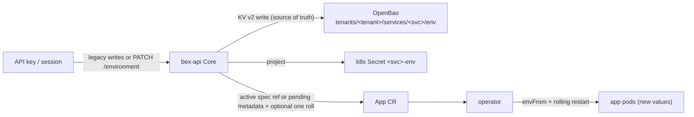

# ADR: platform secrets — OpenBao for tenant credentials

**Status:** accepted; substrate deployed on the local mock cluster (w4/m5), wired into the product in w4/m6 (bex-api's env-vars API reads/writes tenant credentials through it — see [Product usage](#product-usage-w4m6-the-env-vars-api)), and wired into prod in w1/m10 (init/unseal + Kubernetes auth run from `deploy.yml`, `replicas: 3` overlay — see [Prod deploy path](#prod-deploy-path)).

## Context

[docs/ADR012-auth.md](ADR012-auth.md) covers _identity_ (who is calling) and _authorization_ (what they may touch). Neither answers a third question: once an agent deploys an app on a tenant's behalf (docs/ADR008-vision.md pillar 4, "deploy-from-chat"), where does that app's own credentials — a database password, a third-party API key — actually live? Today the only place is the `App` CR itself: plaintext in etcd, readable by anyone who can `get` the CR. That's fine for bex's own platform secrets (Kratos/Hydra secrets, the zot registry credential, etc. — those are w1/m7 t003's concern: **platform** secrets committed to git via SOPS/sealed-secrets, because they're static and bex-operated). It is not fine for **tenant** secrets: a growing, per-tenant, per-app set of credentials that must be versioned (rotate without downtime), revocable, and readable only by the scope that owns them — not by every other tenant's app, not by anyone who can `kubectl get apps`.

This ADR is the substrate for that: a versioned, policy-scoped secret store running as platform infrastructure, so w1/m2's `tenants` table and w4/m6's product wiring have somewhere to put credentials before either exists.

## Decision

### 1. OpenBao, not HashiCorp Vault

Same governance test CNPG, Ory, and OpenFGA already passed ([ADR009-postgresql-management.md](ADR009-postgresql-management.md) §1): open-source, self-hostable, no SaaS dependency. HashiCorp re-licensed Vault under BSL 1.1 in 2023 — source-available, not OSI open source, and explicitly restricts competing-use. That disqualifies it for a platform whose whole premise is "Apache-2.0, run it yourself" ([ADR008-vision.md](ADR008-vision.md)). **OpenBao** is the Linux Foundation-governed MPL-2.0 fork: same HTTP API, same `secrets`/`auth`/`policy` model, drop-in for everything below.

### 2. Storage backend: integrated Raft, not Postgres or Consul

OpenBao (like Vault before it) supports several storage backends. Bex already operates Postgres well via CNPG — the instinct is to reuse it, as Kratos/Hydra/OpenFGA all do. Rejected anyway:

- **Postgres backend** is community-supported, not the recommended path, and HashiCorp deprecated recommending external-DB backends in favor of integrated storage back in Vault 1.4 (2020) for good reason: OpenBao would need its own DSN Secret bootstrapped out-of-band exactly like Kratos/Hydra — except the thing being bootstrapped is itself the credential store, a chicken-and-egg dependency this design doesn't need to take on.
- **Consul** is another moving part bex doesn't otherwise run, for the same benefit Raft gives for free.
- **Integrated Raft storage** is self-contained (one PVC per pod, no external dependency), gives built-in snapshotting, and is the chart's own recommended default. Locally: `replicas: 1` (single-node raft — same storage engine, no quorum). Production runs `replicas: 3` for quorum and tolerates one member or node being unavailable; the one-member-at-a-time drain/unseal runbook is in [ADR015-openbao-backup-restore.md](ADR015-openbao-backup-restore.md#node-drain-and-rolling-maintenance-unseal).

### 3. Unseal strategy: Shamir secret sharing via `.env`, not auto-unseal

OpenBao encrypts everything at rest behind a master key split into Shamir shares; a freshly started (or restarted) node is **sealed** until a threshold of those shares is presented. The alternative — cloud KMS auto-unseal (AWS/GCP) — is rejected for the same reason bex's `infra/` targets Hetzner via Cluster API rather than a single hyperscaler: it would tie a self-hostable platform to a specific cloud's KMS.

Instead: [scripts/bao-init.sh](../scripts/bao-init.sh) runs `bao operator init` once (5 shares / 3 threshold, the OpenBao default), capturing 3 unseal keys + the root token and writing them into `.env` (gitignored — same rule as `bex.kubeconfig`) — **never printed** to stdout or logs, mirroring `auth-secrets.sh`'s never-echo convention. Every subsequent run detects "already initialized," reads the same three keys back out of `.env`, and unseals idempotently — including after a pod restart (raft persists the encrypted data to the PVC, but the _decryption_ state is always sealed on process start; this is correct behavior, not a bug, and `scripts/bao-verify.sh` asserts it explicitly).

This is a real trust tradeoff: whoever holds `.env` (or its prod equivalent — GitHub Actions secrets via `scripts/gh-secrets.sh`) can unseal OpenBao and mint root-scoped tokens. Accepted — it's the same trust boundary the Ory secrets and `bex.kubeconfig` already carry.

### 4. KV v2 mount `tenants/`

One versioned key-value engine (`kv-v2`: soft-delete + rollback), mounted at `tenants/`. Tenant credentials live at `tenants/<tenant-id>/...` — a **path convention**, not a mount-per-tenant. A mount per tenant doesn't scale (mounts are a fairly heavyweight, admin-managed concept) and buys nothing here: the policy in §5 already scopes every non-admin caller to the `tenants/*` subtree as a whole, and per-tenant isolation _within_ that subtree is w4/m6's job (the product layer knows which tenant a caller represents; OpenBao itself doesn't need to).

### 5. Kubernetes auth method — bex-api authenticates as itself

No shared token. OpenBao's chart enables `server.authDelegator` by default, granting OpenBao's own ServiceAccount the `system:auth-delegator` ClusterRole — the permission its Kubernetes auth method needs to call the apiserver's `TokenReview` API and validate a _caller's_ projected ServiceAccount token. [scripts/bao-k8s-auth.sh](../scripts/bao-k8s-auth.sh) (idempotent, same shape as `authz-model.sh`) then:

- enables the `kubernetes` auth method,
- writes a policy (`tenants-rw`) granting `create`/`read`/`update`/`delete`/`list` on `tenants/*` and **nothing else** — no `sys/*`, no other mount, so a compromised bex-api pod can't read seal status, re-key, or touch any other tenant of the store (there is only one, but the point generalizes),
- binds a role `bex-api` to that policy, scoped to ServiceAccount `bex-api` in namespace `bex-system` (the same ServiceAccount [lego/operator/config/api/rbac.yaml](../lego/operator/config/api/rbac.yaml) already defines).

This is the same shape as Hydra `client_credentials` or the OpenFGA preshared key: a machine identity, minimal scope, no human password anywhere in the loop.

### 6. GitOps shape, namespace `secrets`

[deploy/gitops/base/openbao.yaml](../deploy/gitops/base/openbao.yaml) is a multi-source Argo Application (pinned chart `0.28.4`, app v2.5.5) exactly like `kratos.yaml`/`openfga.yaml`: the Helm repo provides the chart, this repo's `ref: values` source provides [base/values/openbao.values.yaml](../deploy/gitops/base/values/openbao.values.yaml). Namespace **`secrets`**, not `auth` — this is tenant-credential infrastructure, a different trust boundary than platform identity/authz, and keeping it a separate namespace keeps RBAC/NetworkPolicy scoping simple later. `sync-wave: "1"`: unlike Kratos/Hydra/OpenFGA, OpenBao has no CNPG Cluster dependency (§2), so it doesn't need to wait for the CNPG operator wave — it's an independent base component alongside Traefik/cert-manager/metrics-server. Cluster-internal only, no ingress: bex-api reaches it via in-cluster Service DNS (`openbao.secrets.svc:8200`) only, the same shape as Hydra's/OpenFGA's admin APIs.

## Verification

`scripts/bao-verify.sh` (exit 0 = pass) proves, against the current kubeconfig cluster:

1. **Init/unseal is idempotent** — running `bao-init.sh` twice in a row changes nothing the second time.
2. **KV read/write** — a value written under `tenants/verify/...` reads back with the expected data.
3. **Scoped SA login** — the `bex-api` ServiceAccount logs in via the Kubernetes auth method and can read/write under `tenants/*`, but a request for `sys/mounts` (or any path outside `tenants/*`) with that same token is denied (403). (`sys/seal-status` itself is deliberately unauthenticated in OpenBao — not a useful negative test.)
4. **Restart durability** — after deleting the OpenBao pod (the chart's StatefulSet uses `updateStrategyType: OnDelete`, so a plain `kubectl rollout restart` doesn't actually recreate it — the pod has to be deleted directly), the pod comes back **sealed** (expected — no auto-unseal), the KV value from step 2 is unreadable until unsealed, and re-running `bao-init.sh`'s unseal step (same three keys from `.env`) restores it exactly. This proves both that state survives the pod (raft on the PVC) and that the unseal keys are load-bearing, not decorative.

Local bring-up order (what Argo's waves do in prod): mock cluster → local-path provisioner → `secrets` namespace labeled `pod-security.kubernetes.io/enforce=privileged` (local-CAPD quirk below) → OpenBao chart (base values + local overlay) → `scripts/bao-init.sh` → `scripts/bao-k8s-auth.sh` → `scripts/bao-verify.sh`.

Local-CAPD quirks (mock cluster only, don't apply to prod):

- The `secrets` namespace needs the same `pod-security.kubernetes.io/enforce=privileged` label the `auth` namespace already carries — local-path's hostPath helper pods run in the **PVC's** namespace and are blocked by the cluster's `baseline` PSA enforcement otherwise (same reasoning as [ADR012-auth.md](ADR012-auth.md)'s local-CAPD quirks section).
- Unlike Kratos/Hydra/OpenFGA, OpenBao's pod **does** need pinning to the control-plane node (`overlays/local/values/openbao.values.yaml`'s `nodeSelector`/`tolerations`), and this one is easy to misdiagnose: a worker-scheduled pod comes up `Running`, its port stays in `LISTEN`, and it even accepts TCP connections — but every HTTP request just hangs forever (confirmed via `kubectl exec` to `127.0.0.1:8200` from inside the pod itself, which hung identically to a port-forward from outside). The cause is `service_registration "kubernetes" {}`, which has OpenBao call the apiserver directly from inside its own request-handling path; on a worker node under this cluster's OrbStack/Calico networking that call never returns (the same reachability gap [ADR012-auth.md](ADR012-auth.md)'s local-CAPD quirks section pins coredns/local-path/CNPG for). Moving the pod to the control-plane node fixed it immediately, confirming the cause.

## Product usage (w4/m6): the env-vars API

The consumer this substrate exists for: bex-api's Render-compatible **env-vars API** ([ADR006-bex-api.md](ADR006-bex-api.md#env-vars--tenant-secrets-render-env-vars-compatible)). A tenant (an API key, or a human session) sets a service's environment variables; the values live in OpenBao under that service's path; the operator materializes them into the running app.

- **Path layout.** One KV v2 mount `tenants/` (§4); a service's env map lives at `tenants/<tenant>/services/<service>/env`. Until w1/m2 grows real tenants, `<tenant>` is the single `default` (the same convention m4's authorization uses for the default workspace).
- **Authentication.** bex-api logs in with the Kubernetes auth method as its own ServiceAccount (§5, role `bex-api`, policy `tenants-rw`), caches the returned client token until just before its lease expires, and re-authenticates on demand (including when a still-cached token is rejected). Off-cluster runs (local dev, `scripts/secrets-verify.sh`) point `BEX_OPENBAO_JWT_PATH` at a token minted with `kubectl create token bex-api`.
- **Materialization + the etcd trade-off.** On every write, bex-api stores the map in OpenBao (**the source of truth**), then projects it into a per-app Kubernetes Secret `<service>-env` (owned by the App, so it is garbage-collected with it); the operator wires an active reference into `envFrom`. Legacy item/replace writes set the spec reference and roll immediately through `spec.restartedAt`. The coherent environment batch (`PATCH /v1/services/{id}/environment`, w5/m44) projects env and file Secrets together. `save_only` leaves an existing spec reference untouched; for the first service-local Secret it records `app.bex.co/pending-env-secret` / `app.bex.co/pending-files-secret` metadata instead. The operator's generation-only update predicate ignores that metadata write, then consumes the pending name during the next deliberate deploy/restart reconcile (including native-build runtime env). `deploy` activates every pending reference and bumps `restartedAt` once. Omitted masked entries remain untouched, and a late projection/App-patch failure compensates source and derived state. **Accepted trade-off:** a projection copy of the values does live in etcd, in that Secret — OpenBao buys durability, versioning, audit and policy-scoping, **not** etcd-avoidance. The future alternative that removes the etcd copy is sidecar/agent injection (an OpenBao Agent rendering the secret into the pod at runtime), recorded here as follow-up work, out of scope for m6.
- **Authorization + leak discipline.** Reading values requires the sensitive-read scope (`can_view_sensitive`), writing the manage scope (`can_create`) — enforced by the same OpenFGA `Checker` as every other verb (a tuple-less key gets 403). Values never appear in logs, error messages, or responses beyond the authenticated `GET`/`PUT` bodies: a rejected write names the offending **key** at most, never its value, and the OpenBao client's errors carry only method + path.
- **Fail-closed.** With `BEX_OPENBAO_URL` unset bex-api has no store and the env-vars verbs 503 (the rest of the API is byte-for-byte unchanged); a sealed or unreachable OpenBao 503s the credential-touching verb, mirroring the Hydra fail-closed precedent in [ADR012-auth.md](ADR012-auth.md).

Verified end-to-end on the mock cluster by [scripts/secrets-verify.sh](../scripts/secrets-verify.sh): mint a key → PUT env-vars → the value is present in OpenBao (scoped read) → the `<svc>-env` Secret is materialized → the app's pods roll → the running app serves the new value; a tuple-less key gets 403; with `BEX_OPENBAO_URL` unset the endpoints 503.

## Prod deploy path

Wired end-to-end (w1/m10). The app side is live — the prod bex-api Deployment sets `BEX_OPENBAO_URL=http://openbao.secrets.svc:8200` (`lego/operator/config/api/deployment.yaml`) — and the CI/unseal side runs on every deploy:

1. **One-time** (operator, by hand, against the prod kubeconfig): `BAO_ALLOW_INIT=1 scripts/bao-init.sh` initializes OpenBao (5 Shamir shares / 3 threshold), writing the unseal keys + root token into the operator's local `.env`. The `BAO_ALLOW_INIT=1` opt-in is mandatory for a first init and is set **only** here — `deploy.yml` never sets it, so CI can never mint-and-discard the keys against an ephemeral runner. Do **not** `cp .env.template .env` around this step: `bao-init.sh` writes the keys straight into `.env`, and a `cp` would overwrite the only copy. Prod runs `server.ha.replicas: 3`, so `bao-init.sh` initializes the ordinal-first pod (the raft leader) and then unseals **every** pod directly — Shamir seal state is per-node, and the `openbao` Service round-robins across sealed+unsealed members, so a Service-targeted unseal is unreliable in HA. (Single-node and the `BAO_ADDR` off-cluster paths operate on the one reachable endpoint and are unaffected.)
2. `scripts/gh-secrets.sh` pushes `BAO_UNSEAL_KEY_1`/`BAO_UNSEAL_KEY_2`/`BAO_UNSEAL_KEY_3`/`BAO_ROOT_TOKEN` (now present in `.env` from step 1) into this repo's GitHub Actions secrets — they're in the script's key list alongside the `KRATOS_*`/`HYDRA_*`/`OPENFGA_*` keys.
3. `.github/workflows/deploy.yml` waits for the OpenBao StatefulSet's pods to reach `Running`, then runs `bao-init.sh` (idempotent — detects "already initialized," just unseals each pod; refuses to init without `BAO_ALLOW_INIT`) and `bao-k8s-auth.sh` after the rollout on every deploy, the same shape as the `auth-secrets.sh`/`authz-model.sh` steps.
4. Production sizing: [overlays/prod/values/openbao.values.yaml](../deploy/gitops/overlays/prod/values/openbao.values.yaml) sets `server.ha.replicas: 3`, `server.podManagementPolicy: Parallel` (so the sealed pods don't block each other's creation), and a raft config with `retry_join` for the three pods (so followers auto-join openbao-0's cluster over the headless `openbao-internal` Service); it carries no `storageClass` override (falls back to the cluster's default, e.g. `hcloud-volumes`). The layer is applied onto the openbao Application by the prod overlay's kustomization patch — mirroring how `auth-dbs`'s local patch shrinks storage only for CAPD. The openbao Application itself is deployed in every environment via `deploy/gitops/base/kustomization.yaml`.

Live acceptance — `PUT /v1/services/{id}/env-vars` against prod returns 200 (not 503), the value lands in OpenBao under `tenants/default/services/<svc>/env` and survives a bex-api pod restart — is the operator's first-run verification; thereafter every `deploy.yml` run re-unseals idempotently (no re-init).

## Alternatives considered

- **HashiCorp Vault** — same product, but BSL-licensed (§1). Rejected.
- **Encrypted columns in the control-plane Postgres** (`pgcrypto`) — reinvents dynamic secrets, leasing, versioning, and audit logging that the Vault family already solved, and couples tenant secret material to the same database backing `App` CR metadata (one compromise or bad migration touches both). Rejected.
- **Cloud secret managers** (AWS Secrets Manager, GCP Secret Manager) — defeats self-hostability and ties bex to one cloud, even though `infra/` already targets Hetzner via Cluster API. Rejected.
- **A mount per tenant** — see §4. Rejected as unnecessary operational overhead.

## Consequences

- Once w4/m6 wires product usage, bex-api becomes hard-dependent on OpenBao for any credential-touching verb — an outage or sealed state should 503 that verb, mirroring the Hydra fail-closed precedent in [ADR012-auth.md](ADR012-auth.md).
- Single-node raft locally, `replicas: 1` — no quorum. Automated snapshot backup is now shipped (w1/m7 t006): a nightly Raft snapshot → object storage, mirroring etcd-backup — see [ADR015-openbao-backup-restore.md](ADR015-openbao-backup-restore.md). HA (`replicas: 3` for quorum) is still the remaining half; until then, losing the single node means restoring from the latest snapshot (same recovery posture `kratos-db`/`hydra-db` carry today).
- Root token + unseal keys are a manual, high-trust bootstrap step; rotating the root token or re-keying the Shamir shares follows [ADR037-openbao-rekey-runbook.md](ADR037-openbao-rekey-runbook.md). (w7/m37)
- CI wiring (init/unseal in `.github/workflows/deploy.yml`, unseal keys in GitHub secrets via `scripts/gh-secrets.sh`) is in place: every deploy waits for the OpenBao rollout, then re-unseals each pod idempotently and reapplies the Kubernetes auth binding. The one-time first init against prod is a manual operator step — see [Prod deploy path](#prod-deploy-path).
