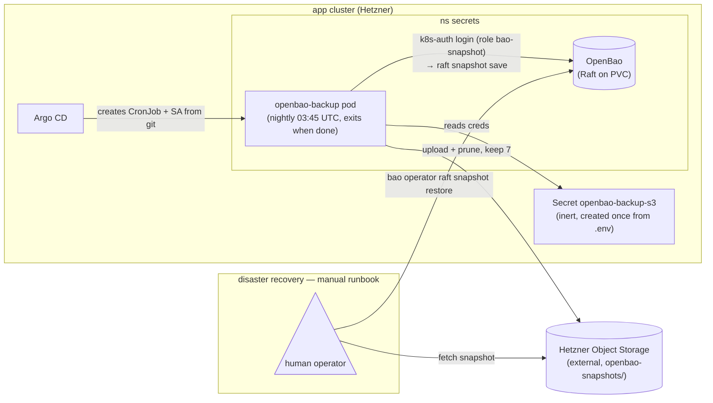

# OpenBao backup & restore

**Why this exists:** OpenBao ([ADR013-secrets.md](ADR013-secrets.md)) holds every tenant credential in integrated Raft storage on a single PVC (`replicas: 1` — no quorum peer to heal from). Unlike the platform's other state, these secrets are **not** reproducible from git: a lost PVC = lost tenant credentials, permanently. A nightly Raft snapshot shipped off-cluster is the recovery story — the mirror of [ADR011-etcd-backup-restore.md](ADR011-etcd-backup-restore.md) for the secret store.

Raft's `snapshot save` takes a point-in-time, internally-consistent copy of the **already-encrypted** store while OpenBao keeps serving — no seal, no downtime.



## What runs

A CronJob `secrets/openbao-backup` (Argo app `openbao-backup` in the gitops base — every non-disposable cluster gets it; the local overlay excludes it. Manifest in [`deploy/gitops/charts/openbao-backup/`](../deploy/gitops/charts/openbao-backup/cronjob.yaml)):

| step | container | what it does |
| --- | --- | --- |
| snapshot | `openbao/openbao` (matches the chart) | Kubernetes-auth login as SA `bao-snapshot` (role → `snapshot` policy: read on `sys/storage/raft/snapshot` only), then `bao operator raft snapshot save` against `http://openbao.secrets.svc:8200` |
| compress | `busybox` | `gzip -9` (the aws-cli image ships no gzip) |
| upload + prune | `amazon/aws-cli` (pinned < 2.23) | upload `openbao-<UTC timestamp>.snap.gz` to `s3://$S3_BUCKET/openbao-snapshots/`, then delete all but the newest 7 |

Schedule: **03:45 UTC daily** (staggered after etcd-backup's 03:15). Retention: **7 snapshots**, pruned by the job itself. The snapshot is already encrypted at rest by OpenBao; keep the bucket private regardless.

## One-time setup per cluster

Two out-of-band steps — the same trust boundary as `bao-init.sh` (nothing in git):

1. **The OpenBao snapshot role** (least privilege, read on the snapshot path only). `scripts/bao-k8s-auth.sh` provisions it idempotently alongside the `bex-api` role:

   ```sh
   scripts/bao-k8s-auth.sh      # writes the `snapshot` policy + `bao-snapshot` role
   ```

2. **The S3 credentials Secret** (reuses the Terraform-state Object Storage creds from `.env`, exactly like etcd-backup):

   ```sh
   source .env && kubectl -n secrets create secret generic openbao-backup-s3 \
     --from-literal=S3_ENDPOINT="$TF_STATE_ENDPOINT" \
     --from-literal=S3_BUCKET="$TF_STATE_BUCKET" \
     --from-literal=AWS_DEFAULT_REGION="$TF_STATE_REGION" \
     --from-literal=AWS_ACCESS_KEY_ID="$TF_STATE_ACCESS_KEY" \
     --from-literal=AWS_SECRET_ACCESS_KEY="$TF_STATE_SECRET_KEY"
   ```

Verify a backup landed (or trigger one now):

```sh
kubectl -n secrets create job --from=cronjob/openbao-backup openbao-backup-now
kubectl -n secrets logs job/openbao-backup-now -c upload -f
aws --endpoint-url "$TF_STATE_ENDPOINT" s3 ls "s3://$TF_STATE_BUCKET/openbao-snapshots/"
```

## Restore

A Raft snapshot restore overwrites the live store with the snapshot's contents. The snapshot is sealed with the **master key from when it was taken** — so after restore, OpenBao unseals with the **same** unseal keys already in `.env` (`bao-init.sh` never rotates them). Restore onto a running, unsealed OpenBao:

```sh
# 1. fetch + unpack the latest snapshot
aws --endpoint-url "$TF_STATE_ENDPOINT" s3 cp \
  "s3://$TF_STATE_BUCKET/openbao-snapshots/<latest>.snap.gz" . && gunzip <latest>.snap.gz

# 2. reach OpenBao and authenticate as root (BAO_ROOT_TOKEN from .env)
kubectl -n secrets port-forward service/openbao 8200:8200 &
export BAO_ADDR=http://127.0.0.1:8200 BAO_TOKEN="$BAO_ROOT_TOKEN"

# 3. restore — the store (and all tenant secrets) is replaced by the snapshot
bao operator raft snapshot restore <latest>.snap
```

For a from-scratch rebuild (new PVC): let Argo bring OpenBao up, run `scripts/bao-init.sh` so the node initializes/unseals with the `.env` keys, then apply steps 1–3. `bao-init.sh` on a fresh node writes NEW keys to `.env` — if you are restoring an OLD snapshot, keep the old `.env` keys, because the restored data is sealed with the master key that matches them.

> ⚠ Untested against a live cluster — structurally complete (the CronJob renders and the role is least-privilege), but verify the first real snapshot + restore end-to-end before relying on it, the same way etcd-backup was validated.
