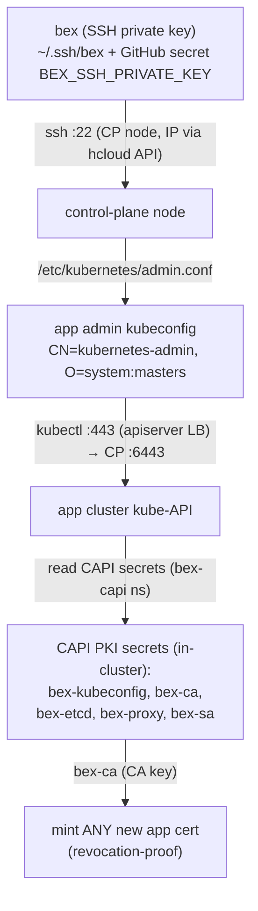

# ADR: infra credentials — inventory, trust chain, and custody

**Status:** descriptive (reflects live prod reality as of 2026-07-09) + accepted decisions. Records _what_ platform credentials exist, _where_ they live, _who_ holds them, and how they chain — so the security posture is written down rather than rediscovered by SSHing around. Complements [ADR013-secrets.md](ADR013-secrets.md) (tenant secrets, OpenBao) and [ADR016-sealed-secrets.md](ADR016-sealed-secrets.md) (platform secrets in git); this doc is about the **bootstrap** credentials that sit _below_ both of those — the ones you need before any controller is running.

## Context

bex's secret story so far has two published layers:

- **Tenant** credentials → OpenBao ([ADR013-secrets.md](ADR013-secrets.md)): versioned, policy-scoped, per-app.
- **Platform** credentials as GitOps → Sealed Secrets ([ADR016-sealed-secrets.md](ADR016-sealed-secrets.md)): static, bex-operated, encrypted in git.

Neither covers the layer underneath: the handful of **bootstrap** credentials that let a human or CI reach the clusters _at all_ — the SSH key, the cloud API token, the Terraform-state keys, and the Kubernetes PKI that Cluster API mints. These are held out-of-band (in [`.env`](../.env.example) locally, and as CI secrets), because they must exist before Argo, OpenBao, or the sealed-secrets controller do. This ADR maps them and records the decisions about how they're custodied — and the gaps that follow.

Since the w1/m19.1 pivot there is **one self-managed cluster** (see [ADR002-architecture.md](ADR002-architecture.md)): the app cluster runs Cluster API itself and holds its own machine records and PKI. The bootstrap `bex-bootstrap` node (single k3s, Terraform-provisioned; renamed from `bex-infra` 2026-07-11) exists only during initial bring-up or disaster recovery — its Terraform definition is retained, the instance is destroyed after `clusterctl move`.

## The trust chain

Everything an operator can do to the app cluster traces back to **one SSH private key**. There is no independently-scoped app-cluster credential: hold the key, and you can mint cluster-admin.



**Reading:** both workflows ([deploy.yml](../.github/workflows/deploy.yml), [app-cluster.yml](../.github/workflows/app-cluster.yml)) discover a control-plane node by its CAPH label via the hcloud API and SSH-fetch `/etc/kubernetes/admin.conf` (which already targets the kube-api LB). The CAPI PKI secrets now live **in the cluster's own etcd** (3-replica once the quota-raise revert lands, snapshotted nightly — they had no backup at all on the mgmt cluster). The chain has no branch: **`bex` is the root of trust.**

## Credential inventory

| Credential | Form | Stored where | Held by | Grants |
| --- | --- | --- | --- | --- |
| **`bex` SSH keypair** | ed25519 (`~/.ssh/bex`, `bex.pub`) | operator laptop; public half on every node | operator; **GitHub Actions** (`BEX_SSH_PRIVATE_KEY`) | SSH `:22` to CP + worker nodes (and the bootstrap node when one exists) → **root of the whole chain** |
| **app admin kubeconfig** | client cert `CN=kubernetes-admin, O=system:masters`, ~1yr validity | `/etc/kubernetes/admin.conf` on each CP node (+ the in-cluster `bex-kubeconfig` secret) | anyone with node SSH (via `bex`); fetched per-CI-run; transient local copies | **cluster-admin** on the app cluster (`:443` apiserver LB → CP `:6443`) |
| **app cluster PKI** | CA cert+key pairs | `bex-ca` / `bex-etcd` / `bex-proxy` / `bex-sa` secrets, app cluster `bex-capi` ns (in-cluster since the m19.1 pivot) | Cluster API (owner); anyone with cluster-admin | **`bex-ca` = mint any app cert, incl. new admin** — crown jewels |
| **`bex-argo-deploy` key** | ed25519, comment `argocd-deploy-key@bex` | operator laptop; deploy key on the GitHub repo | operator; Argo CD (repo-server) | **read** `git@github.com:bex-co/bex.git` (GitOps pulls) — **not** a cluster credential |
| **`HCLOUD_TOKEN`** | Hetzner Cloud API token | [`.env`](../.env.example); GitHub secret | operator; CI; Terraform; CCM (`hcloud` secret, `kube-system`) | full Hetzner Cloud API: servers, LBs, networks, firewalls |
| **TF-state keys** | S3 access/secret (`TF_STATE_ACCESS_KEY`/`_SECRET_KEY`) | `.env`; GitHub secret | operator; CI | bootstrap-admin read/write for Terraform state and `bex-tfstate` backups; provisions scoped static identities but is never mounted into the static plane |
| **static-site S3 reader / publisher** | separate Wasabi IAM access/secret pairs | `bex-system/bex-static-read-s3`; `bex-build/bex-static-publish-s3` | static-server; publish/purge Jobs, respectively | reader list/get and publisher list/get/put/delete on `bex-static` only; both denied from `bex-tfstate` and unrelated buckets ([ADR029](ADR029-static-sites.md)) |
| **platform app secrets** | `BEX_BOOTSTRAP_CLIENT_SECRET`, `KRATOS_SECRETS_*`, `HYDRA_SECRETS_*`, `HYDRA_OIDC_PAIRWISE_SALT`, `OPENFGA_PRESHARED_KEY` | `.env`; applied to the app cluster by `scripts/auth-secrets.sh` / `auth-bootstrap-client.sh` | operator; CI | bex-api bootstrap key ([ADR012-auth.md](ADR012-auth.md)), Kratos/Hydra/OpenFGA signing + preshared keys |
| **Stripe test billing credentials** | dedicated `rk_test_*` + endpoint `whsec_*` | operator keychain/out-of-band source; `bex-system/bex-stripe` Secret | billing operator; bex-api runtime | least-privilege test Customer/Subscription/sessions/meter-event writes and catalog/invoice/meter summary reads; signed test webhook intake only |
| **OpenBao unseal material** | `BAO_UNSEAL_KEY_1..3`, `BAO_ROOT_TOKEN` | `.env` (written back by `bao-init.sh`); GitHub secret | operator; CI | unseal + root the tenant secret store ([ADR013-secrets.md §3](ADR013-secrets.md)) |

## `.env`: the out-of-band bootstrap store

[`.env`](../.env.example) is the local, gitignored file that holds every bootstrap credential above (same custody rule as `*.kubeconfig` — **never committed, never printed**). It exists precisely because these secrets must be available _before_ the in-cluster secret stores (OpenBao, sealed-secrets) are running, so they cannot themselves live in-cluster.

One mirror tracks it, value-less, and is kept in sync by rule (see [CLAUDE.md](../CLAUDE.md) rules):

- [`.env.example`](../.env.example) — the single checked-in mirror (`cp .env.example .env`), serving both the local runtime env and the CI-secrets source (`scripts/gh-secrets.sh` pushes the filled `.env` into GitHub Actions).

**CI custody:** GitHub Actions holds its own copy of the same secrets as repository/environment secrets (`BEX_SSH_PRIVATE_KEY`, `HCLOUD_TOKEN`, `TF_STATE_*`, …). So the credential set exists in **three places**: the operator's `.env`, GitHub Actions secrets, and (for the derived ones) the clusters themselves. Rotating a credential means rotating all copies.

### App SSH gateway host key is a separate credential

Running-instance app SSH ([ADR035](ADR035-ssh.md)) uses a dedicated Ed25519 **server host key**, not the `bex` node-admin client key above. Its private file stays on the operator laptop at `BEX_SSH_HOST_KEY_FILE`; [`scripts/ssh-host-key-secret.sh`](../scripts/ssh-host-key-secret.sh) installs it out of band as `bex-system/bex-ssh-host-key`. The public fingerprint may be published. The key is stable across ordinary deploys; rotation is an explicit maintenance event because OpenSSH clients pin it in `known_hosts`. [`scripts/ssh-activate.sh`](../scripts/ssh-activate.sh) refuses to advertise the host until the complete public A/AAAA set equals the Terraform-owned Hetzner edge's public address set and TCP/22 presents that exact key; `--check` runs those gates without mutation.

### Control-plane host keys authenticate the other end of that first hop

The chain above starts with `ssh :22` to an IP the hcloud API reports — but until w1/m66 the client never authenticated the **server**: both `fetch-app-kubeconfig.sh` and `verify-substrate.sh` hardcoded `StrictHostKeyChecking=accept-new`, so a first-seen host key was trusted on faith. Anyone able to intercept that first connection could serve their own key, return an attacker-controlled `admin.conf`, and every later step — `kubectl apply`, Secret writes, the deploy — would target the attacker's API server. The follow-on `kubectl cluster-info` probe is not a check on this: it authenticates against the CA embedded in that same untrusted kubeconfig.

`BEX_SSH_KNOWN_HOSTS` closes it, custodied exactly like the other bootstrap secrets (`.env` + GitHub Actions, pushed by [`scripts/gh-secrets.sh`](../scripts/gh-secrets.sh)). Both scripts share one policy helper, [`scripts/lib/ssh-hostkey.sh`](../scripts/lib/ssh-hostkey.sh): **set ⇒ fail closed** (`StrictHostKeyChecking=yes`, pinned `UserKnownHostsFile`, global known-hosts ignored); **unset ⇒ trust-on-first-use with a notice on stderr**, so the weaker mode is never silent. A pin that points at a missing or empty file is an error, not a silent downgrade.

Capture it out of band, from a host you already trust, and compare the fingerprint against the node's console before storing it:

```bash
ssh-keyscan -t ed25519 <cp-ip>              # repeat per control-plane node
ssh-keygen -lf <(ssh-keyscan -t ed25519 <cp-ip>)   # fingerprint to eyeball
```

Because the nodes are immutable and roll on template rotation ([ADR053](ADR053-node-instance-types.md)), re-capture after a control-plane rotation — the same maintenance event that already re-mints the machines. Until the secret exists, CI runs unchanged; the control is inert, not partially applied.

**Captured and mandatory since 2026-08-13 (w1/m68 t006).** The three control-plane ed25519 keys (post-ADR053-rotation nodes) were keyscanned from the operator laptop and fingerprint-verified through an independent second path — a keyscan of the sibling nodes over the cluster-private network from an already-pinned node — then stored in `.env` (+ `BEX_SSH_KNOWN_HOSTS_FILE` for local runs) and pushed to GitHub Actions (`scripts/gh-secrets.sh` now includes it). All three workflows assert `BEX_SSH_REQUIRE_KNOWN_HOSTS=1`, so a missing or empty pin **aborts** rather than reverting to trust-on-first-use. Operationally this couples deploys to rotation: after an ADR053 control-plane template rotation, re-capture and re-push the pin before the first deploy, or that deploy fails at the kubeconfig fetch by design.

**All three admin.conf fetchers are wired, and coverage is enforced.** w1/m66 wired `deploy.yml` and `app-cluster.yml` but missed [`openbao-restore-drill.yml`](../.github/workflows/openbao-restore-drill.yml) — the workflow that hands the fetched kubeconfig the OpenBao unseal keys and root token, making it the one where an attacker-selected API server costs the most. w1/m68 (round-5 F3) wired it and added a derived coverage check to [`scripts/github-actions-validate.sh`](../scripts/github-actions-validate.sh): any workflow invoking `fetch-app-kubeconfig.sh` or `verify-substrate.sh` must also reference `BEX_SSH_KNOWN_HOSTS`. The check reads the workflow tree rather than naming files, so a **new** SSH-to-control-plane workflow is caught the day it is added rather than at the next audit.

### Stripe test billing credentials are runtime-only

The production-hosted billing sandbox uses a dedicated restricted `rk_test_*`, never the Stripe CLI login/setup key and never any `*_live_*` credential. [`scripts/stripe-billing-secret.sh`](../scripts/stripe-billing-secret.sh) validates the restricted/test prefix, keeps secret bytes in a mode-0600 temporary file, installs `bex-system/bex-stripe`, and refuses live runtime keys by default. On macOS the test endpoint secret may be sourced from the login keychain service `bex-stripe-test-webhook`; neither value belongs in `.env.example`, GitHub logs, tickets, drill evidence, or tenant-visible state.

Rotation follows add → deploy → verify → revoke. Keep the previous test key/endpoint active until the replacement passes a production reconciliation and a new webhook delivery; record only non-secret key/object ids and timestamps. Test and live credentials must use separate custody records. See the exact permission inventory, disable path, and rotation drill in [the Stripe Billing runbook](runbooks/stripe-billing-setup.md#rotation-and-disable-drill).

### Static-site S3 credentials are derived, bucket-scoped identities

[`scripts/static-s3-credentials.sh`](../scripts/static-s3-credentials.sh) uses the out-of-band TF-state credential only against Wasabi IAM to create/rotate `bex-static-reader` and `bex-static-publisher`, then installs each into its one consumer namespace without printing the value or putting it in argv. The committed policies name only `arn:aws:s3:::bex-static{,/*}`. Rotation is add → positive/negative matrix → deploy → live lifecycle → revoke; the detailed rollback gates are in [the static-site rotation runbook](runbooks/static-site-s3-rotation.md). The legacy `static-s3` Secret that copied the TF-state key is not a third supported credential: once no workload references it, it is deleted from every former static namespace while the out-of-band root key remains available to Terraform/backups.

## Decisions

### 1. One SSH key is the bootstrap root of trust — accepted, with eyes open

CAPH provisions every node with a single SSH key ([infra/terraform/main.tf](../infra/terraform/main.tf), `ssh_key_name`), and CAPI stores the app-cluster PKI as in-cluster secrets. That is the standard self-managed Cluster API topology and we adopt it as-is. The **consequence** is deliberate and must be understood: `bex` is not "an" admin key, it is _the_ path to `system:masters`. Its custody (operator laptop + GitHub Actions secret) is the single most security-sensitive fact about the platform — more than any firewall.

### 2. App-cluster PKI lives in the cluster itself — accepted (self-managed since m19.1)

`bex-ca`/`bex-etcd`/`bex-proxy`/`bex-sa` are CAPI-owned and, since the `clusterctl move` pivot, live in the app cluster's own `bex-capi` namespace — replicated by etcd and captured by the nightly etcd snapshot (on the retired mgmt node they had **no** backup at all). Whoever holds cluster-admin can read the CA and mint revocation-proof certs; node-level hardening of the CP nodes is therefore in scope for any hardening pass. The bootstrap node, when it temporarily exists (initial bring-up / DR), briefly holds this same material and must be treated with app-cluster sensitivity for its lifetime.

### 3. Bootstrap secrets stay out-of-band in `.env` / CI secrets — accepted

They cannot live in the in-cluster stores they bootstrap (chicken-and-egg), and they should not live in git even encrypted (they gate the decryptors). `.env` (local, gitignored) + GitHub Actions secrets (CI) is the accepted home; sealed-secrets/OpenBao cover everything _downstream_ of them.

### 4. Network exposure is currently authentication-only — accepted as interim

As of this writing, `:22` (SSH, gated by `bex`) and `:6443`/`:443` (kube-API, gated by the admin cert + TLS/RBAC) are reachable from `0.0.0.0/0`: the `bex-bootstrap` firewall defaults `allowed_ssh_cidrs` to open, and no app-node firewall exists. Protection is the credential layer only, with **no network second layer**. This is an accepted baseline (key-only SSH + kube RBAC is industry-standard) but is explicitly single-layer — see gaps and [ADR083](ADR083-security-review-round20.md) for the self-hosted CI custody model.

### 5. Production CI runs on self-hosted GitHub Actions runners — accepted

All workflows target operator-custodied ARM64 self-hosted runners. Since 2026-09-02, each runner-backed job must carry either the `bex-ci` pool label for PR-capable/read-only work or the `bex-production` pool label for secrets, write-capable tokens, release authorization, or live production access; a pool label with no eligible runner leaves the job queued rather than falling back to a shared pool. (The pools are runner _labels_, not GitHub runner groups — groups are unavailable on the org's free plan and group-addressed jobs fail instantly instead of queuing; see ADR083 and `docs/runbooks/runner-pool-relabel.md`.) This closes the cross-trust persistence path while preserving the self-hosted decision accepted on 2026-08-23. The remaining persistent-host risks, mandatory runner registration rules, fork restrictions, and optional ephemeral-runner follow-up are recorded in [ADR083-security-review-round20.md](ADR083-security-review-round20.md). ADR080's protected-environment gates (`production-deploy`, `production-cluster`, `production-restore`, etc.) remain load-bearing workflow-side controls. `scripts/github-actions-validate.sh` and `.pm/DO_NOT_DO.md` `#CI-RUNNERS` reject GitHub-hosted `ubuntu-*`, the old shared-pool label set, unapproved pool labels, the dead runner-group syntax, credentials on `bex-ci`, and PR-reachable `bex-production` jobs.

## Consequences & known gaps

- **Single-key blast radius.** Compromise of `bex` ⇒ full app-cluster `system:masters`. Day-to-day ops use the scoped `bex-operator` kubeconfig (ClusterRole `bex-operator-day-to-day`, ServiceAccount-token-based, no `O=system:masters`); the admin cert is reserved for break-glass. Mint via [`scripts/operator-kubeconfig.sh`](../scripts/operator-kubeconfig.sh); ClusterRole in [`deploy/gitops/base/operator-daytoday-rbac.yaml`](../deploy/gitops/base/operator-daytoday-rbac.yaml). (w7/m37)
- **CA is revocation-proof.** `bex-ca` compromise can't be contained by revoking a cert; it requires rotating the cluster CA (disruptive). Runbook: [ADR036-ca-rotation-runbook.md](ADR036-ca-rotation-runbook.md). (w7/m37)
- **Long-lived admin cert.** The `kubernetes-admin` cert is ~1-year (kubeadm default). A Prometheus alert `AdminCertExpiringSoon` fires 30 days before expected expiry (based on the `bex-kubeconfig` Secret creation timestamp). Renewal procedure: [ADR036-ca-rotation-runbook.md](ADR036-ca-rotation-runbook.md) §1. (w7/m37)
- **Host-key pin is provisioned, not assumed.** The mechanism ships (w1/m66 F7) but stays inert until an operator captures the control-plane host keys into `BEX_SSH_KNOWN_HOSTS`. Treat that capture as part of cluster bring-up and of any control-plane rotation; a rotation without re-capture turns every CI fetch into a hard failure (which is the correct direction to fail, but it is a scheduled task, not a surprise).
- **No network second layer — by decision, not omission.** `:22`/`:6443` are reachable from `0.0.0.0/0`; protection is the credential layer only. The static source-IP firewall (w1/m7 t001) was **removed** ([.pm/DO_NOT_DO.md](../.pm/DO_NOT_DO.md), 2026-07-09): a static `allowed_ssh_cidrs` fits neither a dynamic-IP operator nor CI jobs whose egress is not a stable CIDR (formerly GitHub-hosted runners; now self-hosted runners unless tailnet-joined — see §Decision 5), and `:6443` is reached _via the LB_ (`:443`) so a node-`:6443` lockdown would also have to spare the LB→node hop. Auth-only is the accepted baseline. _Follow-up (only if a second layer is wanted):_ Tailscale/WireGuard locking `:22`/`:6443` to a stable tailnet, with a tailnet-joined self-hosted CI runner — never a static CIDR.
- **Three copies to rotate.** Any rotation must cover `.env`, GitHub Actions secrets, and the in-cluster derivations. There is no single rotation command. _Follow-up:_ a rotation checklist per credential.

## Related decisions

- [ADR050-encrypted-platform-backups.md](ADR050-encrypted-platform-backups.md) adds one more member to this custody model: a backup-encryption `age` keypair, whose private half joins `.env`/GitHub Actions secrets alongside `BAO_ROOT_TOKEN` and the OpenBao unseal shares, for the same reason (§Decision 3) — it must exist independent of any in-cluster store.
- [ADR083-security-review-round20.md](ADR083-security-review-round20.md) records the accepted residual risks of running all production CI on self-hosted GitHub Actions runners (§Decision 5).

## Follow-ups

- (If ever wanted) a network second layer via Tailscale/WireGuard, not the removed static-CIDR firewall — see [.pm/DO_NOT_DO.md](../.pm/DO_NOT_DO.md).
- Consider ephemeral runners within each existing trust group — [ADR083](ADR083-security-review-round20.md).
- Migrate as many `.env` platform secrets as possible _downstream_ into [ADR016-sealed-secrets.md](ADR016-sealed-secrets.md) / [OpenBao](ADR013-secrets.md), leaving `.env` holding only the irreducible bootstrap set (`bex` key, `HCLOUD_TOKEN`, TF-state, OpenBao unseal).
