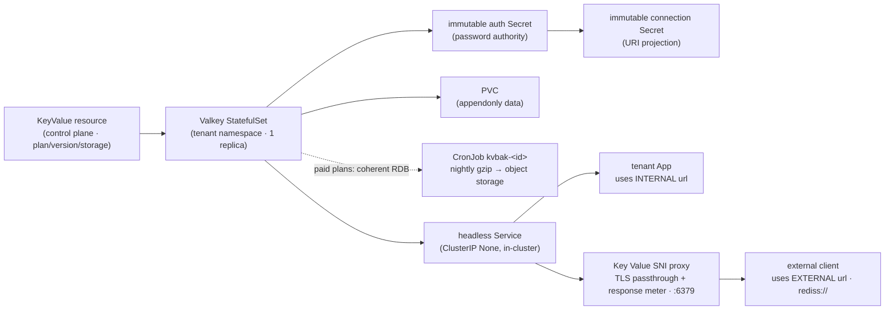

# ADR: managed key-value for tenants (Valkey, plans, internal/external URLs)

**Status:** accepted and implemented. The mechanism — the `KeyValue` CRD (`lego/types/v1alpha1/keyvalue_types.go`), the Valkey-projecting controller (`lego/operator/internal/controller/keyvalue_controller.go`), and the `valkey` tier family (`lego/types/tiers/tiers.yaml`) — ships and is live in prod. The Render-compatible **REST/GraphQL/MCP surface** now ships too (`lego/backend/internal/keyvalue/`, w2/m7): `/v1/key-value` CRUD + connection-info + suspend/resume, GraphQL `keyValue*`, and Render's three current MCP tools (`list_key_value`/`get_key_value`/`create_key_value`) — see [ADR006-bex-api.md](ADR006-bex-api.md) § Managed Key Value. It is the direct sibling of managed Postgres ([docs/ADR009-postgresql-management.md](ADR009-postgresql-management.md)) — same shape, one engine down. The **dashboard** surface shipped too (w5/m12): `/keyvalue` list, `/keyvalue/new` create, `/keyvalue/$id` detail with connection-info reveal + suspend/resume.

## Context

Render sells **managed Key Value** (Valkey/Redis-compatible) as a first-class datastore, alongside Postgres. bex wants parity. Key Value is the second-largest datastore gap after Postgres, ranked by the parity audit (m13). The mechanism must exist before any API/dashboard surface can be built — the same CR-first ordering the `Database` followed.

## Decision

### 1. A standalone `KeyValue` resource → a single-instance Valkey StatefulSet

A key-value store is standalone (created independently; multiple services connect to it; it outlives any one app). So model it as a standalone **`KeyValue`** (CR), _not_ `App.spec.kv`. The operator projects it to a single-instance **Valkey `StatefulSet`** in the **tenant's namespace**, mirroring how `Database` projects to a CNPG `Cluster`.

### 2. Two URLs = two network paths (the core of the product)

|  | bex |
| --- | --- |
| **Internal URL** | the headless **`<name>` Service**: `redis://default:<password>@<name>.<tenant-ns>.svc:6379` — in-cluster only, for the tenant's Apps. Explicit `default` user, not the empty-username `redis://:<password>@` shorthand: verified live that valkey-cli 8.1.8's URI parser fails AUTH against the empty-username form on a `--requirepass` server. |
| **External URL** | the **`bex-kv-sni-proxy` TLS/SNI pass-through front door** on shared `:6379`, routing `<name>.kv.bex.co` → that store's TLS Service port. Opt-in per store via `spec.public`. |

The external hostname becomes routable only when `spec.public: true`, `BEX_KV_DOMAIN` is set, and a `BEX_CLUSTER_ISSUER` can provide its certificate (private by default) — exactly the Postgres pattern with a Valkey-owned TLS endpoint. The controller-owned immutable `<id>-auth` Secret is the only password authority. The immutable `<id>` compatibility Secret projects both URL forms (`uri` internal, `externalUri` external) plus `host`/`port`/`password`; when endpoint metadata changes, the controller replaces that projection rather than mutating it in place.

**IP allowlist** (`spec.ipAllowList`, w7/m5) gates the **external** SNI endpoint only: every metered proxy replica watches the KeyValue CR and checks the original source address from the trusted edge PROXY header (or the socket source on a direct connection) before dialing the store — the same mechanism as Database (ADR009 §IP allowlist). The environment-projected allowlist is an additional AND layer. Empty layers ⇒ open to all source IPs; the internal path is never gated. Entries are `{cidr, description}` pairs (w4/m24): the description is operator-facing metadata that persists on the CR and never affects enforcement. Pre-m24 bare-string CR/store entries were normalized fleet-wide and are rejected by both admission and structured REST decoding; separately named GraphQL/MCP string-list arguments remain supported and are explicitly lifted into entries. Surfaced as Render's `ipAllowList` on the key-value REST/GraphQL/MCP create + REST `GET/PUT /v1/key-value/{id}/ip-allow-list`, the REST `PATCH /v1/key-value/{id}` `ipAllowList` field (w7/m45 — the path the official CLI's `keyvalues update --ip-allow-list`/`--clear-ip-allow-list` uses; a non-nil empty list clears it), GraphQL `keyValueIpAllowList`/`setKeyValueIpAllowList`, MCP `update_key_value(ipAllowList:)` (w7/m45; w1/m71 folded `set_key_value_ip_allow_list` into it), and the dashboard's Networking section. **`maxmemoryPolicy`** is likewise updatable after create (w7/m45): REST `PATCH` (`maxmemoryPolicy` field, the CLI's `update --memory-policy`), GraphQL `setKeyValueMaxmemoryPolicy`, and MCP `update_key_value(maxmemoryPolicy:)` all route through the shared `UpdateKeyValue`, normalizing the underscore/hyphen forms identically to create. The dashboard's detail page carries a Maxmemory Policy section (w7/007) over `setKeyValueMaxmemoryPolicy`, so post-create editing is no longer create-only. **`persistenceMode` is updatable post-create the same way (w6/m127):** REST `PATCH` (`persistenceMode` — Render's fifth `keyValuePATCHInput` property), GraphQL `setKeyValuePersistenceMode`, and MCP `update_key_value(persistenceMode:)`, all through the shared `UpdateKeyValue`/`validate`. The operator's `valkeyArgs` re-derives the AOF/RDB flags from the changed `spec.persistenceMode` and rolls the pod on the next sync — the same convergence a plan or `maxmemoryPolicy` change already triggers.

**Free-tier persistence is available, and the default is durable (w6/m127).** bex's free Valkey tier carries a 1 GB disk (`tiers.yaml storageGB: 1`) — a conscious divergence from Render's non-persistent 25 MB free tier — so persistence is offered on every plan. A regression in the create form had copied Render's "free plan → persistence forced Off, both controls locked" behavior from a premise (no persistent disk) that does not hold for bex, silently making dashboard-created free stores pure in-memory caches while the API path defaulted to `journal_snapshot`. The form no longer special-cases the free plan; both creation paths now default to `journal_snapshot`.

**Stores already created on `off` are not force-migrated.** Making `persistenceMode` updatable is the deliberate remedy: an affected owner (or the operator on their behalf) moves the store to `journal_snapshot` with a single PATCH — no recreation, no lost id/connection details. The platform does **not** silently flip existing stores, because a persistence change rolls the pod and a store's owner may deliberately want an ephemeral cache (`off` is a legitimate paid-plan choice); a forced fleet-wide durability change without consent is the opposite failure mode. New free stores default durable; existing ones self-serve.

**Render REST create default.** Render documents new Key Value instances as externally disabled until an inbound IP rule is added, and the official CLI has no bex-only `public` field. On `POST /v1/key-value`, omission therefore stays private unless the request carries a nonempty `ipAllowList` (the exact body produced by the CLI's documented `--ip-allow-list` flag), in which case `spec.public=true`. An omitted or explicit empty list never combines with bex's empty-layer-is-open rule to create accidental world access; explicit `public:false` wins, and explicit `public:true` remains available to bex callers. GraphQL, MCP, Blueprints, dashboard/shared-service calls, direct CR/YAML flows, and existing resources remain private by omission. Public intent without a reconciled `status.externalHost` returns a named 503 from connection-info before exposing a URI, with `BEX_KV_DOMAIN` guidance.

### 3. End-to-end public TLS

The public wildcard must be **DNS-only (gray-cloud)** — Cloudflare's proxy is HTTP(S) only and cannot carry raw TCP `:6379`. Public Valkey clients use direct TLS (`rediss://`) end to end: cert-manager issues `<name>.<BEX_KV_DOMAIN>`, Valkey listens with that certificate on private port `6380`, and the shared proxy forwards the bounded ClientHello plus the remaining encrypted stream without terminating TLS. The existing internal URL remains plaintext, password-authenticated `redis://` on port `6379`; public TLS does not force in-cluster Apps through encryption or the meter.

Connection-info makes that routing requirement explicit in its ready-to-run public command: `redis-cli --sni <externalHost> -u <rediss-uri>`. `redis-cli` enables TLS from the URI but does not derive a ClientHello server name from it, while the shared edge deliberately requires SNI to select one store. Private connection-info remains `redis-cli -u <redis-uri>` because it bypasses the public SNI router.

[`scripts/datastore-dns-cloudflare.sh`](../scripts/datastore-dns-cloudflare.sh) is the production guard for that distinction. Given `BEX_DB_DOMAIN`, `BEX_KV_DOMAIN`, `HCLOUD_TOKEN`, and an ephemeral zone-scoped `CLOUDFLARE_API_TOKEN`, it reconciles the two datastore wildcard names to the Terraform-owned edge load balancer's exact A/AAAA set with `proxied:false`; `--check` performs the same comparison without mutation. It does not target the proxied App/API/custom-domain zone paths. This gate was added after the 2026-07-18 official-CLI acceptance run found `*.kv.bex.co` incorrectly orange-clouded: bex-api returned a valid public `rediss://` endpoint and Hetzner reported healthy 6379 targets, but ordinary Cloudflare proxy addresses could not accept raw Valkey TCP.

In production, `bex-kv-sni-proxy-public` is a fixed `NodePort` (`31892`) with `externalTrafficPolicy: Local`; Terraform owns the shared Hetzner edge LB's `6379 → 31892` listener and TCP health check. `Local` admits only workers with a local proxy endpoint. Because a TCP load balancer otherwise replaces the application-visible client address, the datastore listener also enables PROXY protocol. The proxy consumes a bounded v1/v2 header before the TLS ClientHello only from the load balancer's fixed `10.10.0.7/32` private address and applies the asserted public source to both allowlist layers; untrusted headers fail closed and headerless direct/dev connections keep their socket source. ADR009's compatibility-first CI handoff applies to this listener too: Terraform cannot enable headers until the same commit's deploy proves every Valkey/PostgreSQL proxy pod runs the header-capable digest. The production `allow-production-edge-proxies` NetworkPolicy opens only the PostgreSQL/Valkey proxy pods' public ports through the `bex-system` default deny.

Only bytes copied from the TLS backend to the public client increment `bex_kv_proxy_egress_bytes_total{resource_id,resource_kind="key_value"}`. Requests, denied/unrouted handshakes, and internal clients contribute zero. The operator deletes pre-m15 Traefik `IngressRouteTCP`/`MiddlewareTCP` objects during reconcile so no unmetered bypass remains.

### 4. Plans — Render's Key Value vocabulary

The `valkey` tier family uses Render's **Key Value** plan vocabulary (`free` / `starter` / `standard` / `pro` / `pro_plus` / …) — the same names Render's Key Value product shares with its web-service ladder, _not_ the Postgres `basic-*` names. MVP ships the first three:

| plan | compute (requests==limits) | storage | instances | Render KV equivalent |
| --- | --- | --- | --- | --- |
| `free` | 100m / 128Mi | 1Gi | 1 | Free (25 MB; bex more generous) |
| `starter` | 100m / 256Mi | 1Gi | 1 | Starter (256 MB) |
| `standard` | 500m / 1Gi | 5Gi | 1 | Standard (1 GB) |

`spec.storageGB` may grow past the plan floor, never below (storage is expand-only). The operator persists the accepted request in `status.allocatedStorageGB`, the corresponding explicit intent in `status.observedStorageGB`, and the last PVC capacity in `status.storageCapacityGB`; the effective request is the maximum of those values, the selected plan floor, the StatefulSet claim template, and the live PVC request/capacity. A plan downgrade therefore changes compute without shrinking data.

Growth targets the real StatefulSet PVC, `data-<red-id>-0`, rather than trying to mutate the immutable `volumeClaimTemplates`. The PVC must be Bound and its named StorageClass must have `allowVolumeExpansion: true`; then the operator patches only a larger storage request and waits for capacity convergence. The `StorageReady` condition distinguishes PVC creation/binding, missing or non-expandable StorageClass, controller resize, filesystem resize, and provisioned capacity. `Ready` remains false during a non-suspended resize, and the controller backs off five minutes for an unsupported class instead of hot-looping. Kubernetes documents the underlying [PVC expansion and filesystem-resize lifecycle](https://kubernetes.io/docs/concepts/storage/persistent-volumes/#expanding-persistent-volumes-claims).

Shrink intent is rejected as `StorageShrinkRejected` without changing the PVC. Rollout health is evaluated independently: the StatefulSet must have observed its current generation, `currentRevision` must equal `updateRevision`, and the desired current-revision Pod must be Ready. Thus old available replicas cannot hide either a failed plan rollout or pending expansion. When a spelling-divergent tier is added (`pro_plus`), the family gains a `renderPlan` field like `compute`.

### 5. Paid-plan off-cluster backups and AOF-aware restore

> This CronJob's encryption and credential scoping (Tier A of [ADR050-encrypted-platform-backups.md](ADR050-encrypted-platform-backups.md)) are specified there, not here.

The operator gives every non-Free plan a deterministic `kvbak-<id>` CronJob when all three `BEX_KV_BACKUP_DESTINATION`, `BEX_KV_BACKUP_ENDPOINT`, and `BEX_KV_BACKUP_S3_SECRET` settings are present. Any missing setting disables the feature: a new reconcile adds no backup CronJob or finalizer. Production uses `s3://bex-tfstate/keyvalue`, the Wasabi endpoint, and the out-of-band `default/bex-kv-backup-s3` Secret (`AWS_ACCESS_KEY_ID` plus `AWS_SECRET_ACCESS_KEY`). Free plans remain PVC-only and receive no CronJob.

Each instance hashes its immutable `red-` id into a stable slot from 03:20–03:39 UTC, avoiding a fleet-wide snapshot spike. The job authenticates through `REDISCLI_AUTH` from the immutable `<id>-auth` Secret and runs `valkey-cli --rdb` over the private Service. That replication-protocol request produces a coherent RDB without copying a live `dump.rdb` or granting `pods/exec`. A second stage gzips it; the credentialed uploader writes `keyvalue/<id>/<RFC3339-UTC>.rdb.gz` and retains the lexicographically newest seven. Suspended stores keep their CronJob but set `spec.suspend: true`, so intentional hibernation neither runs nor pages.

This is snapshot recovery, **not PITR**. The paid-plan RPO is the nightly cadence (at most roughly one day plus job delay); writes after the latest successful RDB can be lost. Free-plan durability is only the live PVC and may be lost with that volume or cluster. `BackupCronJobStale` pages when an active CronJob has no success for more than 26 hours, including a CronJob that never succeeded.

Deletion is fail-closed while backups are configured. The KeyValue finalizer first removes the CronJob and every labeled backup Job, then a durable terminal Job recursively deletes `keyvalue/<id>/`; only a proven successful purge releases the resource. If backups are disabled, the finalizer never gets added to new resources and any historical finalizer releases without wedging deletion.

RDB restore must account for AOF precedence: when Valkey starts with an existing append-only directory, it loads AOF instead of `dump.rdb`. `scripts/restore-keyvalue.sh` is the executable path: it accepts only a new `restore-*` namespace/PVC, gzip- and checksum-validates the selected object, proves the data directory has no RDB/AOF, seeds `/data/dump.rdb`, starts once with `appendonly no`, verifies a known key without printing it, enables and rewrites AOF, rolls, and verifies again. It has no in-place mode. The mechanism drill is recorded in [the 2026-07-31 KeyValue restore drill](drills/2026-07-31-keyvalue-restore.md); the scripted production rerun and transfer portability finding are in [the w7/m69 all-store drill](drills/2026-07-31-scripted-restore-e2e.md).

### 6. Lifecycle (create → connect → delete)

1. **Create** `KeyValue{name, plan, version, storage}`.
2. **Provision** → the operator creates the StatefulSet (Valkey `--requirepass <generated> --appendonly yes`, PVC for AOF data), the headless Service, the immutable `<id>-auth` authority, and the immutable `<id>` connection projection. The password is generated once on first reconcile and is not a user-rotatable setting. A legacy connection Secret seeds the authority during migration, preserving the running password.
3. **Prove rollout consistency** → the Pod template carries the one-way SHA-256 credential revision. `status.credentialRevision` advances only when the current StatefulSet revision and Pod are Ready; no credential value enters status, Events, or logs.
4. **Surface connection info** → REST/GraphQL reads the authority only while phase is Ready and its hash matches `status.credentialRevision`; otherwise it returns conflict. The dashboard therefore cannot reveal credentials from a split rollout. MCP exposes KeyValue metadata but no credential-read tool.
5. **Delete** → for a previously backed-up store, the finalizer stops backup work and purges `keyvalue/<id>/`; deleting the `KeyValue` then garbage-collects the StatefulSet, Service, PVC, both Secrets, and public Certificate/Secret. The proxy removes the route from its watched table. While the `app.bex.co/kv-finalizer` holds the CR (`DeletionTimestamp` set), tenant **by-id reads** return the same `not found` as an absent id (`core.NotFoundIfDeleting`, w8/m35) — REST get/connection-info and siblings, GraphQL, MCP — and List omits the row; workspace-limits still counts it under `terminating` (w6/m129). A finalization that overruns its 15-minute bound stamps `DeletionStalled` on the KeyValue (w8/012) and backs the requeue off while retaining the finalizer.

### 7. Identity and rename (stable `red-` id + mutable name, w9/m6)

Identity and display name are separate, exactly as managed Postgres shipped in w9/m3 (ADR009 §Rename and legacy migration):

- **New stores mint `KeyValue.metadata.name = red-<xid>`** through `internal/id` (`id.KeyValue`, Render's Key Value prefix). This immutable value is the REST/GraphQL/MCP id and the root of every physical object name — the StatefulSet, headless Service, PVC, credentials Secret, and the external SNI hostname (`<red-id>.<BEX_KV_DOMAIN>`). Because the id (not the name) lives in the hostname and Secret, a **rename never breaks a connection string**.
- **`KeyValue.spec.name` is the mutable, user-facing DNS-label name** (`ValidKeyValueName`: ≤30 chars, DNS-1123 label). It is workspace-scoped unique — two workspaces may reuse a name; a duplicate inside one workspace is rejected (`core.ErrConflict`).
- **Canonical identity is required.** Production and the maintained local cluster were verified to contain no missing `spec.name` or non-`red-` ids before the old name-as-id fallback was removed; the CRD now requires `spec.name` (w1/m56 t009).

`PATCH /v1/key-value/{id}` changes only `spec.name` (and/or `plan`); the KeyValue metadata name/UID, StatefulSet, PVC, credentials Secret, Service, external route, project/environment membership, and connection strings all remain attached to the immutable id. The same core mutation (`UpdateKeyValue`) backs REST, GraphQL `renameKeyValue`, MCP `update_key_value(name:)`, and the dashboard; `dryRun=true` runs identical validation without writing. The GET-by-id item route resolves by the opaque id only — the official Render CLI resolves a typed name to a `red-` id via the list filter, then routes every item call by that id, so the split is what makes the unmodified CLI's `keyvalues update <name> --name <new>` land on the right store.

**Migration closeout.** The original rollout backfilled missing display names without re-keying CRs, then enabled rename traffic after identity-preservation checks. The 2026-07-28 fleet audit found zero remaining legacy shapes, so the one-time script and metadata-name reader were retired and `spec.name` became required. Rollback restores the preceding code/CRD commit without reversing canonical object data.

## MVP scope

Ship only what fits the current single node — single-instance plans differing by compute + storage (above). The metered TLS/SNI front door is opt-in per store via `spec.public` + `BEX_KV_DOMAIN`; `BEX_CLUSTER_ISSUER` is also required so the operator can issue the backend certificate.

## Consequences

- Deferred to post-MVP: HA/replication (a Valkey replica/sentinel needs a ≥3-node worker pool), eviction/scale-to-zero for free-tier stores, and overage billing. Public TLS, outbound response metering, and paid-plan nightly off-cluster RDB backups are implemented. Free remains explicitly PVC-only.
- The REST/GraphQL/MCP surface (`list_key_value` / `get_key_value` / `create_key_value` + `/v1/key-value` CRUD/connection-info/suspend/resume + GraphQL `keyValue*`) shipped in w2/m7 on top of this mechanism; the dashboard shipped in w5/m12. The retired bex-only `list_key_value_instances` alias is no longer registered.
- **Version-change parity assessment (2026-07-16, w8/m16): no upgrade verb.** Render's official `keyValuePATCHInput` and legacy `redisPATCHInput` schemas list only `name`, `plan`, `maxmemoryPolicy`, `persistenceMode`, and `ipAllowList`; neither accepts `version`. Render's Key Value documentation likewise documents plan upgrades and states that new instances run Valkey 8 while legacy instances remain on Redis 6 without version updates. Therefore bex's create-time-only `spec.version` matches the absence of a Render version-change contract; no mirror milestone is warranted. Reassess only if Render adds a version field or explicit upgrade flow.

## Verification

- **bex verification:** apply a `KeyValue` CR → Valkey StatefulSet + headless Service + credentials Secret created, tier-sized → connect via the **internal** URL from an in-cluster pod → with `spec.public`, `BEX_KV_DOMAIN`, and `BEX_CLUSTER_ISSUER`, observe the Certificate, TLS port, and public proxy route → connect with an ordinary `rediss://` client and verify its peer certificate is Valkey's certificate → delete the `KeyValue` → all owned objects gone. Controller and proxy tests pin creation, migration cleanup, allowlists, end-to-end TLS pass-through, and backend→client-only accounting.
- **Grow-only storage verification (w2/m60):** envtest binds a 1 GiB PVC on an expandable StorageClass, changes intent to 5 GiB, observes the real PVC request become 5 GiB while `Ready=false`, advances capacity and the current StatefulSet revision, and then observes `StorageReady=true`/`Ready=true`. Unit cases prove shrink and a non-expandable StorageClass leave the PVC unchanged with actionable conditions, and an old revision cannot satisfy readiness.
- **Credential consistency verification (w2/m61):** envtest proves both Secrets are immutable, direct auth mutation is rejected by the API server, the StatefulSet reads the authority and carries its revision, and Ready is gated on the current Pod revision. Backend tests prove a mismatched revision returns a non-leaking conflict rather than any connection string.
- **Backup/restore verification (w7/m68):** unit and envtest coverage pins env/plan gating, coherent `--rdb` capture, keep-seven upload behavior, suspend handling, finalizer ordering, retry-on-purge-failure, and disabled-mode deletion. Production created eight snapshots for a paid throwaway instance, observed the oldest pruned and exactly seven retained, checksum-validated the newest RDB, restored its marker into a fresh PVC with AOF disabled for the seed, enabled and rewrote AOF, and verified the marker after restart. Deleting the source then proved its CronJob, Jobs/Pods, PVC/PV, Secrets, and S3 prefix were all absent.
- **Scripted restore verification (w7/m69):** `restore-keyvalue.sh` recovered a fresh production snapshot into a new namespace, verified the marker with AOF off and after rewrite/restart with AOF on, and deleted the target namespace. Its first transfer attempt produced a zero-byte file through `kubectl exec -i`; the non-empty guard failed before startup, the transfer moved to `kubectl cp`, and the whole run then passed. Source finalization again left 11/11 Kubernetes checks green and zero prefix objects.
- **Official CLI verification:** `scripts/cli-compat.sh kv-cli-verify` provisions a disposable source-restricted public store and drives the unmodified official Render CLI under an automated PTY by both opaque id and display name. The 2026-07-18 production run passed `PING`, `SET`, exact `GET`, `DEL`, and all cleanup assertions through the real DNS/LB/SNI edge; see the [sanitized acceptance evidence](../.pm/w2/m57/evidence/2026-07-18-kv-cli-acceptance.md).
