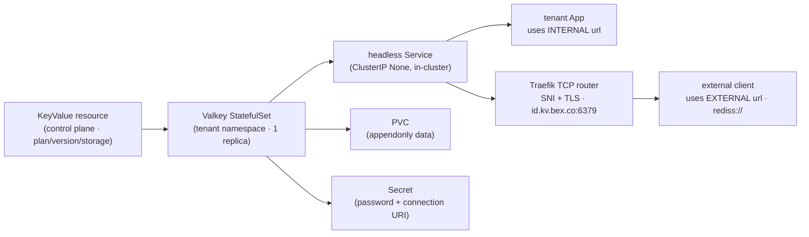

# ADR: managed key-value for tenants (Valkey, plans, internal/external URLs)

**Status:** accepted and implemented. The mechanism — the `KeyValue` CRD (`lego/types/v1alpha1/keyvalue_types.go`), the Valkey-projecting controller (`lego/operator/internal/controller/keyvalue_controller.go`), and the `valkey` tier family (`lego/types/tiers/tiers.yaml`) — ships and is live in prod. The Render-compatible **REST/GraphQL/MCP surface** now ships too (`lego/backend/internal/keyvalue/`, w2/m7): `/v1/key-value` CRUD + connection-info + suspend/resume, GraphQL `keyValue*`, and Render's three current MCP tools (`list_key_value`/`get_key_value`/`create_key_value`; the old `list_key_value_instances` spelling is a deprecated bex alias) — see [ADR006-bex-api.md](ADR006-bex-api.md) § Managed Key Value. It is the direct sibling of managed Postgres ([docs/ADR009-postgresql-management.md](ADR009-postgresql-management.md)) — same shape, one engine down. The **dashboard** surface shipped too (w5/m12): `/keyvalue` list, `/keyvalue/new` create, `/keyvalue/$id` detail with connection-info reveal + suspend/resume.

## Context

Render sells **managed Key Value** (Valkey/Redis-compatible) as a first-class datastore, alongside Postgres. bex wants parity. Key Value is the second-largest datastore gap after Postgres, ranked by the parity audit (m13). The mechanism must exist before any API/dashboard surface can be built — the same CR-first ordering the `Database` followed.

## Decision

### 1. A standalone `KeyValue` resource → a single-instance Valkey StatefulSet

A key-value store is standalone (created independently; multiple services connect to it; it outlives any one app). So model it as a standalone **`KeyValue`** (CR), _not_ `App.spec.kv`. The operator projects it to a single-instance **Valkey `StatefulSet`** in the **tenant's namespace**, mirroring how `Database` projects to a CNPG `Cluster`.

### 2. Two URLs = two network paths (the core of the product)

|  | bex |
| --- | --- |
| **Internal URL** | the headless **`<name>` Service**: `redis://default:<password>@<name>.<tenant-ns>.svc:6379` — in-cluster only, for the tenant's Apps. Explicit `default` user, not the empty-username `redis://:<password>@` shorthand: verified live that valkey-cli 8.1.8's URI parser fails AUTH against the empty-username form on a `--requirepass` server. |
| **External URL** | a **Traefik TCP router with SNI + TLS passthrough** on a shared `:6379` entrypoint, routing `<name>.kv.bex.co` → that store's Service. Opt-in per store via `spec.public`. |

The external route is created by the operator only when `spec.public: true` **and** `BEX_KV_DOMAIN` is set (private by default) — exactly the Postgres pattern. The credentials Secret carries both URL forms (`uri` internal, `externalUri` external) plus `host`/`port`/`password`, so a future API layer can assemble a Connections panel without re-deriving them.

**IP allowlist** (`spec.ipAllowList`, w7/m5) gates the **external** SNI route only: the controller projects a Traefik `ipAllowList` `MiddlewareTCP` (source-range) referenced by the route, so only listed CIDRs reach the public endpoint — the same mechanism the Database controller uses (ADR009 §IP allowlist). Empty ⇒ open to all source IPs; the internal path is never gated. Entries are `{cidr, description}` pairs (w4/m24): the description is operator-facing metadata that persists on the CR and never reaches the rendered middleware; pre-m24 CRs serialized bare CIDR strings, which still decode (empty description) and enforce identically. Surfaced as Render's `ipAllowList` on the key-value REST/GraphQL/MCP create + REST `GET/PUT /v1/key-value/{id}/ip-allow-list`, GraphQL `keyValueIpAllowList`/`setKeyValueIpAllowList`, and the dashboard's Networking section.

### 3. The TLS caveat (mirrors the Postgres ADR §3)

The public wildcard must be **DNS-only (gray-cloud)** — Cloudflare's proxy is HTTP(S) only and cannot carry raw TCP `:6379`. And like Postgres, SNI passthrough works only for **direct-TLS** clients: the route is TLS-passthrough, so the Valkey instance must terminate TLS for the external path to work end to end. The MVP Valkey instance listens plain (`--requirepass`, no TLS) on the internal path; broad-client public-TLS termination is a follow-on (a TLS-aware Valkey config + cert), exactly as the Postgres ADR defers a Postgres-aware SNI proxy. The internal URL — what tenant Apps use — is unaffected.

### 4. Plans — Render's Key Value vocabulary

The `valkey` tier family uses Render's **Key Value** plan vocabulary (`free` / `starter` / `standard` / `pro` / `pro_plus` / …) — the same names Render's Key Value product shares with its web-service ladder, _not_ the Postgres `basic-*` names. MVP ships the first three:

| plan | compute (requests==limits) | storage | instances | Render KV equivalent |
| --- | --- | --- | --- | --- |
| `free` | 100m / 128Mi | 1Gi | 1 | Free (25 MB; bex more generous) |
| `starter` | 100m / 256Mi | 1Gi | 1 | Starter (256 MB) |
| `standard` | 500m / 1Gi | 5Gi | 1 | Standard (1 GB) |

`spec.storageGB` may grow past the plan floor, never below (storage is expand-only). When a spelling-divergent tier is added (`pro_plus`), the family gains a `renderPlan` field like `compute`.

### 5. Lifecycle (create → connect → delete)

1. **Create** `KeyValue{name, plan, version, storage}`.
2. **Provision** → the operator creates the StatefulSet (Valkey `--requirepass <generated> --appendonly yes`, PVC for AOF data), the headless Service, and a credentials Secret. The password is generated once on first reconcile and reused thereafter.
3. **Surface connection info** → the Secret's `uri` / `externalUri` / `host` / `port` / `password` (a later API layer assembles the Connections panel from these).
4. **Delete** → deleting the `KeyValue` garbage-collects the StatefulSet, Service, PVC, Secret, and the external SNI route via owner references.

### 6. Identity and rename (stable `red-` id + mutable name, w9/m6)

Identity and display name are separate, exactly as managed Postgres shipped in w9/m3 (ADR009 §Rename and legacy migration):

- **New stores mint `KeyValue.metadata.name = red-<xid>`** through `internal/id` (`id.KeyValue`, Render's Key Value prefix). This immutable value is the REST/GraphQL/MCP id and the root of every physical object name — the StatefulSet, headless Service, PVC, credentials Secret, and the external SNI hostname (`<red-id>.<BEX_KV_DOMAIN>`). Because the id (not the name) lives in the hostname and Secret, a **rename never breaks a connection string**.
- **`KeyValue.spec.name` is the mutable, user-facing DNS-label name** (`ValidKeyValueName`: ≤30 chars, DNS-1123 label). It is workspace-scoped unique — two workspaces may reuse a name; a duplicate inside one workspace is rejected (`core.ErrConflict`).
- **Legacy CRs with no `spec.name`** expose `metadata.name` as a fallback (`KeyValue.DisplayName()`) and retain that value as their grandfathered stable id.

`PATCH /v1/key-value/{id}` changes only `spec.name` (and/or `plan`); the KeyValue metadata name/UID, StatefulSet, PVC, credentials Secret, Service, external route, project/environment membership, and connection strings all remain attached to the immutable id. The same core mutation (`UpdateKeyValue`) backs REST, GraphQL `renameKeyValue`, MCP `rename_key_value`, and the dashboard; `dryRun=true` runs identical validation without writing. The GET-by-id item route resolves by the opaque id only — the official Render CLI resolves a typed name to a `red-` id via the list filter, then routes every item call by that id, so the split is what makes the unmodified CLI's `keyvalues update <name> --name <new>` land on the right store.

**Legacy backfill + rollout.** `scripts/keyvalue-name-migrate.sh` (dry-run by default, `--apply` to write, `--namespace`/`--all-namespaces`) backfills only a missing `spec.name` from `metadata.name`; reruns are byte-for-byte no-ops, and it fails before any write on an un-representable legacy id or a workspace-scoped duplicate. It never creates, deletes, or re-keys a CR. Roll the CRD + compatible code first, backfill second, then enable rename traffic — the same ordering (and safe, additive rollback) ADR009 documents for Postgres.

## MVP scope

Ship only what fits the current single node — single-instance plans differing by compute + storage (above). Internal-URL-first (connect from an in-cluster App); the Traefik-SNI external route is opt-in per store via `spec.public` + `BEX_KV_DOMAIN`, with the direct-TLS caveat noted in §3.

## Consequences

- Deferred to post-MVP: HA/replication (a Valkey replica/sentinel needs a ≥3-node worker pool; you have one), TLS termination on the public path for broad-client compatibility, eviction/scale-to-zero for free-tier stores, and metering/billing.
- The REST/GraphQL/MCP surface (`list_key_value` / `get_key_value` / `create_key_value` + `/v1/key-value` CRUD/connection-info/suspend/resume + GraphQL `keyValue*`) shipped in w2/m7 on top of this mechanism; `list_key_value_instances` remains a deprecated compatibility alias, and the dashboard shipped in w5/m12.

## Verification

- **bex MVP verification:** apply a `KeyValue` CR → Valkey StatefulSet + headless Service + credentials Secret created, tier-sized → connect via the **internal** URL from an in-cluster pod → (with `spec.public` + `BEX_KV_DOMAIN`) the external SNI route is created → delete the `KeyValue` → all owned objects gone. The reconciler end to end (CR create → workload/Service/Secret, tier→resources, owner-ref cascade) is pinned by envtest (`keyvalue_test.go`).
