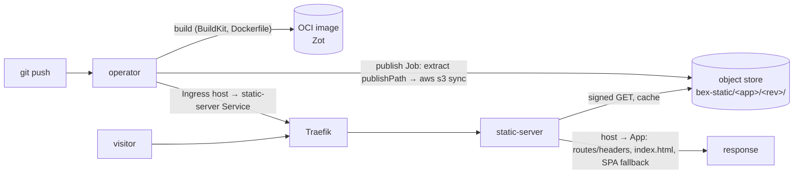

# Static sites (Render `static_site` type)

bex serves static front-ends the way Render does: a repo is **built**, its output directory is **published to an object-store origin**, and a shared **static-server** serves it behind Traefik — with **no Deployment/Service for the served content**. Redirects/rewrites (`spec.routes`, Render's `/routes`) and custom response headers (`spec.headers`, Render's `/headers`) apply at the edge. This is the larger build→CDN sibling of the compute service types (w1/m15, w1/m21).

## The shape



- **Build** is **optional** (w9/010, Render parity). A repo-backed `static_site` that declares **no build input at all** — no `dockerfilePath`, no `buildCommand`, no `runtime`, no explicit builder — skips the build plane entirely: the publish Job clones the repo and publishes `rootDir/publishPath` **as-is** (the `examples/static-site` shape — plain files, nothing to build). Declaring any build input opts into the in-cluster BuildKit build plane (`internal/build`): the App must then build to an image whose `spec.publishPath` directory (e.g. `dist`, `build`, `public`) holds the built site — a typical Dockerfile runs the site's build command and leaves the output at its `WORKDIR/<publishPath>`.
- **Publish** (`internal/publish`) is the "different output sink": an in-cluster Job whose init container stages the site into a shared volume — from the built image (`extract`: copies `publishPath` out of it) or, on the no-build path, from a shallow git checkout (`clone`: `alpine/git`, same `CloneSecret` token contract as the build plane for private repos) — and whose `aws-cli` container `s3 sync`s it to `s3://<bucket>/<app-id>/<revision>/`. Revision-prefixed keys give **atomic cutover and rollback** — the App's active revision just repoints the prefix.
- **Serve** (`internal/staticserver`, the `staticserver` binary) is one always-on proxy for **all** static sites. It watches `static_site` Apps for the host→revision mapping and their edge rules, resolves each request's `Host` to a site, does **signed** S3 GETs (the bucket stays private), maps `/` → `index.html` (+ SPA fallback), applies the routes/headers, and caches objects in memory (a revision prefix is immutable, so a hit is never stale). The operator points each static-site host's Ingress at the static-server's Service — the same by-name Ingress backend the wake activator uses.

Edge rules live on the App CR (`spec.routes`/`spec.headers`) and the static-server reads them **live**, so a routes/headers edit takes effect on the next resolver refresh with no rebuild or republish. Changing `publishPath` does republish (it bumps `spec.restartedAt`).

## Trust boundaries

Static hosting has three independent security domains; the accepted browser divergence does not weaken the Kubernetes or object-store boundaries:

| Boundary | Attacker capability | Current contract |
| --- | --- | --- |
| Browser site boundary | A malicious tenant controls HTML/JavaScript on one `*.onbex.co` origin | PSL membership is an owner-accepted non-goal: `Domain=onbex.co` cookies can cross siblings; local storage and Service Workers remain origin-scoped; tenant apps must use host-only/`__Host-` cookies |
| Kubernetes routing authority | A tenant workload or compromised tenant-facing API/gateway identity can call the API server with only its effective RBAC | Those identities cannot mutate Services or Ingresses; fail-closed admission accepts tenant ExternalName aliases only from the operator, with an App controller owner and one of two fixed destinations |
| Object-store blast radius | The shared static-server or an ephemeral publish/purge Job is compromised | The server identity is read-only on `bex-static`; the publisher identity is write/delete-capable only on `bex-static`; neither can enumerate the account or reach `bex-tfstate` backups or another bucket |

A malicious static-site owner can publish active browser content, configure rooted object-key rewrites/redirects, and set response headers for their own origins. They cannot choose an upstream server: the API rejects route destinations that do not begin with `/`, and the static handler normalizes rewrites into `<app>/<revision>/<path>` before calling its S3 `Origin`. It has no generic HTTP fetch path. In particular, a string that resembles `bex-api.bex-system.svc`, a tenant ClusterIP, cloud metadata, or an external URL is only an object key and returns the ordinary object-store miss.

Traefik deliberately keeps `providers.kubernetesIngress.allowExternalNameServices=true` because static hosting and maintenance mode need cross-namespace aliases. [`operator-alias-admission.yaml`](../deploy/gitops/base/operator-alias-admission.yaml) makes the corresponding authority explicit. In a canonical hosting namespace, an ExternalName create/update (including a transition away from ExternalName) must be requested by `bex-system/bex-controller-manager`, carry exactly one matching App controller owner, and be one of:

- `bex-static-*` → `bex-static-server.bex-system.svc.cluster.local:8080`
- `bex-maintenance-*` → `bex-activator.bex-system.svc.cluster.local:8888`

Tenant-facing ServiceAccounts are separately denied Service and Ingress mutation by RBAC. Admission is defense in depth for alias shape; it does not make the manager untrusted or replace its reconciliation tests.

### Browser platform-domain contract

Tenant content stays on `*.onbex.co`; dashboard, API, Kratos, and Hydra stay on `*.bex.co`. No control-plane session or OAuth token is intentionally sent to the tenant content suffix. Platform-hosted tenant applications should use host-only cookies, preferably `Secure; HttpOnly; SameSite=Lax` and the `__Host-` prefix (which also requires `Path=/` and forbids `Domain`). Custom domains are separate registrable sites and remain the domain owner's cookie-policy responsibility.

`onrender.com` is in the Public Suffix List, so sibling Render sites cannot set a parent-domain cookie. The canonical list does **not** contain `onbex.co`: real Chrome accepts `Domain=onbex.co` on tenant A and sends it to tenant B. On 2026-07-30 the owner explicitly waived PSL inclusion and accepted this platform-hostname cookie divergence; this is not a claim of equivalent isolation. [`static-site-browser-isolation.mjs`](../scripts/static-site-browser-isolation.mjs) keeps the difference executable and defaults to reporting—not gating—the current parent-cookie result. `PSL_EXPECTED=present` or `absent` pins either state for an explicit regression check.

## Object store

Static content uses a **separate private bucket** and two dedicated Wasabi IAM users. The bootstrap Terraform-state credential may provision/rotate them, but it is never mounted into the static plane. Default-deny IAM semantics plus explicit `bex-static` resource ARNs keep the state and backup bucket (`bex-tfstate`) outside both runtime identities.

| Variable (operator / static-server) | Meaning |
| --- | --- |
| `BEX_STATIC_S3_ENDPOINT` | S3-compatible endpoint URL (e.g. `https://s3.eu-central-2.wasabisys.com`) |
| `BEX_STATIC_S3_BUCKET` | bucket dedicated to static content (e.g. `bex-static`) |
| `BEX_STATIC_S3_REGION` | S3 region (optional; also read from the Secret's `AWS_DEFAULT_REGION`) |
| `BEX_STATIC_PUBLISH_S3_SECRET` (operator) | publish/purge Secret name in `BEX_BUILD_NAMESPACE` (production: `bex-static-publish-s3`) |
| `BEX_STATIC_SERVER_SERVICE` (operator) | k8s Service name of the static-server the host Ingress backs onto |
| `BEX_STATIC_SERVER_PORT` (operator) | static-server Service port (default `8080`) |
| `BEX_STATIC_ADDR` (static-server) | listen address (default `:8080`) |
| `BEX_STATIC_NAMESPACE` (static-server) | App namespace to watch (empty ⇒ all) |
| `BEX_STATIC_CACHE_BYTES` (static-server) | in-memory object-cache budget (default 256 MiB) |
| `BEX_STATIC_RESYNC` (static-server) | host→site snapshot refresh interval (default `10s`) |
| `bex-system/bex-static-read-s3` | required static-server env Secret; a different provider identity from the publisher |

Any operator endpoint/bucket/publish-Secret setting (or `BEX_STATIC_SERVER_SERVICE`) unset rejects `static_site` Apps with a clear status. Before dispatching publish or purge, reconciliation loads the namespace-local publish Secret and requires both AWS credential keys, so a missing Secret becomes an actionable App condition rather than a Job-start surprise. The static-server Secret is non-optional, AWS metadata fallback is disabled, and startup performs a signed one-object list plus `HeadObject` check when content exists; missing or denied read credentials prevent readiness instead of producing a healthy-looking server that fails only on traffic. Endpoint/bucket unset still selects the explicit degraded 503 origin for installations where static hosting is disabled.

### IAM and one-time setup

The committed provider policies are auditable inputs, never credentials:

- [`static-s3-read-policy.json`](../infra/wasabi/static-s3-read-policy.json): `GetBucketLocation`, `ListBucket`, and `GetObject` on `bex-static` only.
- [`static-s3-publish-policy.json`](../infra/wasabi/static-s3-publish-policy.json): the same metadata/read actions plus `PutObject`, `DeleteObject`, and only the multipart actions required by `aws s3 sync`, on `bex-static` only.

Neither includes `ListAllMyBuckets`, wildcard resources, or a statement for `bex-tfstate`.

```sh
# Uses TF_STATE_* only as the out-of-band Wasabi IAM administrator. It creates
# bex-static-reader / bex-static-publisher and installs values without printing
# them or placing them in process arguments.
KUBECONFIG=/secure/path/app.kubeconfig scripts/static-s3-credentials.sh provision

# Positive + negative matrix: required static actions work; reader write/delete,
# tfstate/backups, and an unrelated bucket are denied.
KUBECONFIG=/secure/path/app.kubeconfig scripts/static-s3-credentials.sh verify
```

Rotation follows add → verify → deploy → lifecycle proof → revoke. The exact rollback and legacy-secret removal gates are in [the static S3 rotation runbook](runbooks/static-site-s3-rotation.md). Secret values, access-key ids, kubeconfigs, and hashes do not belong in Git, logs, tickets, or drill evidence.

## Verification

- `scripts/gitops-validate.sh` pins the admission objects, tenant Role shapes, fixed alias destinations, split Secret names, and exact IAM actions/resources.
- `scripts/verify-static-site-security.sh repo` reports the current parent-cookie behavior without gating PSL membership and still fails if storage or Service Workers cross origins; `PSL_EXPECTED=present` or `absent` pins either membership state explicitly.
- `KUBECONFIG=… scripts/verify-static-site-security.sh live` enumerates tenant ServiceAccounts/RoleBinding subjects, checks every Service/Ingress write verb by impersonation, exercises positive and hostile server-side dry-run admission, fetches a live static URL, and runs the S3 matrix.
- Controller/envtest tests prove operator reconciliation for both alias purposes and fail-before-Job behavior for a missing publisher Secret. Static-server unit/integration tests prove object-only rewrites and fail-closed S3 startup.
- Sanitized baseline: [2026-07-29 static-site trust boundaries](drills/2026-07-29-static-site-trust-baseline.md).

## API surface

`static_site` is a service type across all surfaces, so it rides the existing create/read/update verbs (one Core, three adapters, [ADR006-bex-api.md](ADR006-bex-api.md)):

- **Create** — `POST /v1/services` with `type: static_site` and `serviceDetails.publishPath` (Render's location); `routes`/`headers` may be set in the create body or later. GraphQL `createService(..., publishPath, routes, headers)`; MCP `create_static_site` (Render's tool name).
- **Read** — a service's `publishPath`/`routes`/`headers` appear on the service object (REST `serviceDetails.publishPath`; GraphQL `service { publishPath routes headers }`).
- **Edge rules** — `GET`/`PUT /v1/services/{id}/routes` and `.../headers` (bulk replace, Render-compatible). GraphQL `setStaticRoutes`/`setStaticHeaders`/ `setPublishPath`; MCP `list_static_routes`/`update_static_routes`/ `list_static_headers`/`update_static_headers`/`update_publish_path` (bex makes functional what Render's official MCP ships only as a stub).

A route is `{type: redirect|rewrite, source, destination}`; a header is `{path, name, value}` — Render-identical. A redirect answers 301; a rewrite serves another path with 200. Source patterns support a trailing `/*` wildcard; the capture substitutes a `:splat` token or trailing `/*` in the destination. The SPA fallback is a rewrite of `/*` → `/index.html`.
