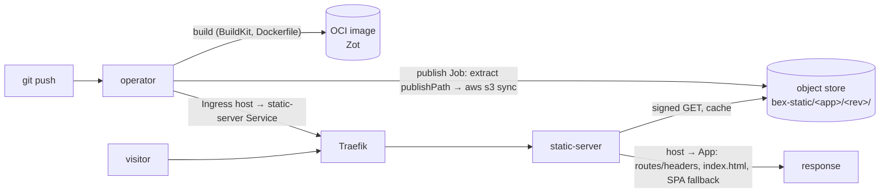

# Static sites (Render `static_site` type)

bex serves static front-ends the way Render does: a repo is **built**, its output directory is **published to an object-store origin**, and a shared **static-server** serves it behind Traefik — with **no Deployment/Service for the served content**. Redirects/rewrites (`spec.routes`, Render's `/routes`) and custom response headers (`spec.headers`, Render's `/headers`) apply at the edge. This is the larger build→CDN sibling of the compute service types (w1/m15, w1/m21).

## The shape



- **Build** is **optional** (w9/010, Render parity). A repo-backed `static_site` that declares **no build input at all** — no `dockerfilePath`, no `buildCommand`, no `runtime`, no explicit builder — skips the build plane entirely: the publish Job clones the repo and publishes `rootDir/publishPath` **as-is** (the `examples/static-site` shape — plain files, nothing to build). Declaring any build input opts into the in-cluster BuildKit build plane (`internal/build`): the App must then build to an image whose `spec.publishPath` directory (e.g. `dist`, `build`, `public`) holds the built site — a typical Dockerfile runs the site's build command and leaves the output at its `WORKDIR/<publishPath>`.
- **Publish** (`internal/publish`) is the "different output sink": an in-cluster Job whose init container stages the site into a shared volume — from the built image (`extract`: copies `publishPath` out of it) or, on the no-build path, from a shallow git checkout (`clone`: `alpine/git`, same `CloneSecret` token contract as the build plane for private repos) — and whose `aws-cli` container `s3 sync`s it to `s3://<bucket>/<app-id>/<revision>/`. Revision-prefixed keys give **atomic cutover and rollback** — the App's active revision just repoints the prefix.
- **Serve** (`internal/staticserver`, the `staticserver` binary) is one always-on proxy for **all** static sites. It watches `static_site` Apps for the host→revision mapping and their edge rules, resolves each request's `Host` to a site, does **signed** S3 GETs (the bucket stays private), maps `/` → `index.html` (+ SPA fallback), applies the routes/headers, and caches objects in memory (a revision prefix is immutable, so a hit is never stale). The operator points each static-site host's Ingress at the static-server's Service — the same by-name Ingress backend the wake activator uses.

Edge rules live on the App CR (`spec.routes`/`spec.headers`) and the static-server reads them **live**, so a routes/headers edit takes effect on the next resolver refresh with no rebuild or republish. Changing `publishPath` does republish (it bumps `spec.restartedAt`).

## Object store

Reuses the platform's existing S3-compatible account (the Terraform-state credentials, e.g. Wasabi) but a **separate bucket** — never serve public content from the private `bex-tfstate` state/backup bucket. Endpoint/bucket are deployment-time config; credentials come from an out-of-band Secret, exactly the etcd/OpenBao/CNPG backup pattern ([ADR011-etcd-backup-restore.md](ADR011-etcd-backup-restore.md)).

| Variable (operator / static-server) | Meaning |
| --- | --- |
| `BEX_STATIC_S3_ENDPOINT` | S3-compatible endpoint URL (e.g. `https://s3.eu-central-2.wasabisys.com`) |
| `BEX_STATIC_S3_BUCKET` | bucket dedicated to static content (e.g. `bex-static`) |
| `BEX_STATIC_S3_REGION` | S3 region (optional; also read from the Secret's `AWS_DEFAULT_REGION`) |
| `BEX_STATIC_S3_SECRET` (operator) | name of the Secret holding `AWS_ACCESS_KEY_ID`/`AWS_SECRET_ACCESS_KEY` for the publish Job |
| `BEX_STATIC_SERVER_SERVICE` (operator) | k8s Service name of the static-server the host Ingress backs onto |
| `BEX_STATIC_SERVER_PORT` (operator) | static-server Service port (default `8080`) |
| `BEX_STATIC_ADDR` (static-server) | listen address (default `:8080`) |
| `BEX_STATIC_NAMESPACE` (static-server) | App namespace to watch (empty ⇒ all) |
| `BEX_STATIC_CACHE_BYTES` (static-server) | in-memory object-cache budget (default 256 MiB) |
| `BEX_STATIC_RESYNC` (static-server) | host→site snapshot refresh interval (default `10s`) |

Any of the operator's `BEX_STATIC_S3_*` (or `BEX_STATIC_SERVER_SERVICE`) unset ⇒ `static_site` Apps are rejected with a clear status, the way unset `BEX_DB_BACKUP_*` disables Postgres backups. The static-server itself starts in a degraded mode (healthy, but 503 for content) until its endpoint/bucket are set, so the platform can deploy it unconditionally.

### One-time setup (out-of-band, like `bex-tfstate`)

```sh
# 1. Create the bucket once (never the tfstate bucket).
aws --endpoint-url "$TF_STATE_ENDPOINT" s3 mb s3://bex-static

# 2. Credentials Secret for the publish Job (reuses the state-store creds).
source .env && kubectl -n bex-system create secret generic static-s3 \
  --from-literal=AWS_ACCESS_KEY_ID="$TF_STATE_ACCESS_KEY" \
  --from-literal=AWS_SECRET_ACCESS_KEY="$TF_STATE_SECRET_KEY" \
  --from-literal=AWS_DEFAULT_REGION="$TF_STATE_REGION"

# 3. Endpoint/bucket for the static-server (the operator gets the same via env).
kubectl -n bex-system create configmap bex-static-config \
  --from-literal=BEX_STATIC_S3_ENDPOINT="https://s3.eu-central-2.wasabisys.com" \
  --from-literal=BEX_STATIC_S3_BUCKET=bex-static \
  --from-literal=BEX_STATIC_S3_REGION=eu-central-2 \
  --from-literal=BEX_BASE_DOMAIN=onbex.co
```

## API surface

`static_site` is a service type across all surfaces, so it rides the existing create/read/update verbs (one Core, three adapters, [ADR006-bex-api.md](ADR006-bex-api.md)):

- **Create** — `POST /v1/services` with `type: static_site` and `serviceDetails.publishPath` (Render's location); `routes`/`headers` may be set in the create body or later. GraphQL `createService(..., publishPath, routes, headers)`; MCP `create_static_site` (Render's tool name).
- **Read** — a service's `publishPath`/`routes`/`headers` appear on the service object (REST `serviceDetails.publishPath`; GraphQL `service { publishPath routes headers }`).
- **Edge rules** — `GET`/`PUT /v1/services/{id}/routes` and `.../headers` (bulk replace, Render-compatible). GraphQL `setStaticRoutes`/`setStaticHeaders`/ `setPublishPath`; MCP `list_static_routes`/`update_static_routes`/ `list_static_headers`/`update_static_headers`/`update_publish_path` (bex makes functional what Render's official MCP ships only as a stub).

A route is `{type: redirect|rewrite, source, destination}`; a header is `{path, name, value}` — Render-identical. A redirect answers 301; a rewrite serves another path with 200. Source patterns support a trailing `/*` wildcard; the capture substitutes a `:splat` token or trailing `/*` in the destination. The SPA fallback is a rewrite of `/*` → `/index.html`.
