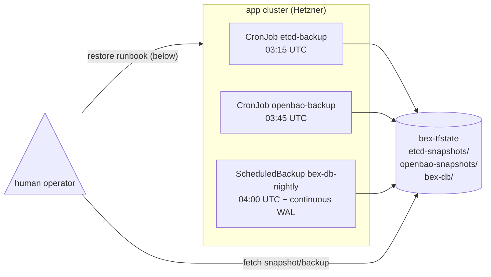

# Platform data-backup policy

**Why this exists:** bex has three stores holding state that is not recoverable from git alone. Two had backups before this ADR; one (`bex-db`) had none at all. This document is the consolidated policy and restore runbook for all three — the single place to check when something is on fire.

| store | what it holds | backup mechanism | schedule | retention | restore mechanism | last verified |
| --- | --- | --- | --- | --- | --- | --- |
| **etcd** | App/Database/KeyValue CRs (user deployments) | CronJob `kube-system/etcd-backup` → `etcd-snapshots/` in `bex-tfstate` | 03:15 UTC daily | 7 snapshots (rolling) | Docker throwaway etcd → `kubectl apply` extracted CRs | 2026-07-05 (CAPD, single-node); re-drill against multi-node topology documented below |
| **OpenBao** | All tenant env-var secrets | CronJob `secrets/openbao-backup` → `openbao-snapshots/` in `bex-tfstate` | 03:45 UTC daily | 7 snapshots (rolling) | `bao operator raft snapshot restore` onto running unsealed OpenBao | 2026-07-12 (procedure documented; execute drill before relying in prod — see below) |
| **bex-db** | Workspaces, members, audit log, usage, API keys, deploy history | CNPG native backup (`spec.backup.barmanObjectStore`) → `bex-db/` in `bex-tfstate` + continuous WAL | 04:00 UTC daily (full base backup via `ScheduledBackup`); WAL archiving is continuous | 7 days of base backups + WAL | CNPG `bootstrap.recovery` from barmanObjectStore into a throwaway cluster | 2026-07-12 (procedure documented; execute drill after first backup lands — see below) |

All three use the same Wasabi/Hetzner Object Storage bucket (`bex-tfstate`) under separate prefixes. Credentials come from out-of-band Secrets (never in git), following the same pattern as `etcd-backup-s3` / `openbao-backup-s3`.



## One-time setup per cluster

### etcd

See [ADR011-etcd-backup-restore.md](ADR011-etcd-backup-restore.md) §One-time setup. The `etcd-backup-s3` Secret in `kube-system` holds the object-store credentials.

### OpenBao

See [ADR015-openbao-backup-restore.md](ADR015-openbao-backup-restore.md) §One-time setup. The `openbao-backup-s3` Secret in `secrets` holds the object-store credentials.

### bex-db (new — w2/m27)

Two out-of-band steps — the same trust boundary as etcd/openbao:

1. **Create the `bex-db-backup-s3` Secret** (reuses the Terraform-state Object Storage creds from `.env`, exactly like the etcd/openbao S3 secrets):

   ```sh
   source .env && kubectl -n bex-system create secret generic bex-db-backup-s3 \
     --from-literal=AWS_ACCESS_KEY_ID="$TF_STATE_ACCESS_KEY" \
     --from-literal=AWS_SECRET_ACCESS_KEY="$TF_STATE_SECRET_KEY"
   ```

2. **Verify WAL archiving has started** (CNPG starts archiving immediately once the Secret exists and the cluster reaches `Ready`):

   ```sh
   kubectl -n bex-system exec bex-db-1 -- psql -U postgres -c "SELECT * FROM pg_stat_archiver;"
   # last_archived_wal should be non-null and last_archived_time recent
   ```

3. **Trigger an on-demand full base backup** (optional — the ScheduledBackup fires at 04:00 UTC; trigger now to confirm end-to-end):

   ```sh
   kubectl -n bex-system apply -f - <<'EOF'
   apiVersion: postgresql.cnpg.io/v1
   kind: Backup
   metadata:
     name: bex-db-initial
     namespace: bex-system
   spec:
     cluster:
       name: bex-db
   EOF
   kubectl -n bex-system get backup bex-db-initial -w
   # phase → completed
   ```

4. **Confirm the backup artifact landed in object storage**:

   ```sh
   source .env
   aws --endpoint-url "$TF_STATE_ENDPOINT" s3 ls "s3://$TF_STATE_BUCKET/bex-db/"
   # Expect: .catalog.json, a basebackup directory, and WAL segments under data/wal/
   ```

**Note on `endpointURL`:** `deploy/gitops/charts/bex-postgres/cluster.yaml` has `endpointURL: https://s3.eu-central-2.wasabisys.com`. Update this to match `$TF_STATE_ENDPOINT` if the cluster uses a different provider (Hetzner: `https://fsn1.your-objectstorage.com`).

## Restore runbooks

### etcd restore

See [ADR011-etcd-backup-restore.md](ADR011-etcd-backup-restore.md) §Restore (Path A — selective re-apply onto a fresh cluster — recommended).

### OpenBao restore

See [ADR015-openbao-backup-restore.md](ADR015-openbao-backup-restore.md) §Restore. The snapshot is sealed with the master key from when it was taken — unseal with the **same** `.env` unseal keys (`BAO_ROOT_TOKEN` / the Shamir unseal keys). Do NOT re-run `bao-init.sh` before restoring (it would write NEW keys).

### bex-db restore

CNPG recovers `bex-db` by bootstrapping a new `Cluster` from the barmanObjectStore backup. Never restore in-place onto the live `bex-db` — always recover to a throwaway cluster first, verify a known row survives, then cut over.

```sh
# 0. Note a known identifiable row before recovery (so you can verify afterward).
kubectl -n bex-system exec bex-db-rw -- psql -U bex -d bex -c \
  "SELECT id, name FROM workspaces ORDER BY created_at DESC LIMIT 1;"
# Record: id=<UUID>, name=<workspace-name>

# 1. Find the latest successful backup base name.
source .env
aws --endpoint-url "$TF_STATE_ENDPOINT" s3 ls "s3://$TF_STATE_BUCKET/bex-db/" --recursive \
  | grep ".catalog.json" | sort | tail -1
# The barman serverName defaults to the cluster name "bex-db".

# 2. Apply a throwaway recovery cluster.
kubectl -n bex-system apply -f - <<'EOF'
apiVersion: postgresql.cnpg.io/v1
kind: Cluster
metadata:
  name: bex-db-recover
  namespace: bex-system
  annotations:
    argocd.argoproj.io/sync-options: SkipDryRunOnMissingResource=true
spec:
  instances: 1
  affinity:
    nodeSelector:
      bex.co/pool: platform
    tolerations:
      - { key: bex.co/platform, operator: Equal, value: "true", effect: NoSchedule }
  storage:
    size: 5Gi
    storageClass: hcloud-volumes
  resources:
    requests: { cpu: 100m, memory: 256Mi }
    limits: { cpu: "1", memory: 1Gi }
  bootstrap:
    recovery:
      source: bex-db
  externalClusters:
    - name: bex-db
      barmanObjectStore:
        destinationPath: s3://bex-tfstate/bex-db
        endpointURL: https://s3.eu-central-2.wasabisys.com
        s3Credentials:
          accessKeyId:
            name: bex-db-backup-s3
            key: AWS_ACCESS_KEY_ID
          secretAccessKey:
            name: bex-db-backup-s3
            key: AWS_SECRET_ACCESS_KEY
        wal:
          compression: gzip
        data:
          compression: gzip
EOF
kubectl -n bex-system get cluster bex-db-recover -w
# phase → Cluster in healthy state

# 3. Verify the known row is present.
kubectl -n bex-system exec bex-db-recover-1 -- psql -U bex -d bex -c \
  "SELECT id, name FROM workspaces WHERE id = '<UUID>';"
# Must return the row recorded in step 0.

# 4. Tear down the recovery cluster (once verified, or promote it if cutting over).
kubectl -n bex-system delete cluster bex-db-recover
```

For a full cutover (live `bex-db` is destroyed): repeat the above, then rename `bex-db-recover` → `bex-db` in the GitOps chart (or Argo force-sync after removing the existing Cluster) and update `bex-db-app` Secret to match the new cluster's credentials.

## Drill records

### etcd restore — multi-node topology re-verification (planned)

The 2026-07-05 verification was against a single-node local CAPD cluster predating the w1/m19 rearchitecture (CAPH-owned network, tainted control plane, self-managed CAPI pivot). The next drill should repeat Path A against the current multi-node topology:

1. Fetch the latest `etcd-snapshots/` object from prod.
2. Boot a throwaway etcd from it (any machine with Docker).
3. Extract and re-apply one App CR to a throwaway cluster.
4. Record date + topology in this file (replace this paragraph).

### OpenBao restore — first real drill (planned)

ADR015's standing "⚠ Untested" warning applies. Procedure:

1. Take a snapshot from the live OpenBao: `kubectl -n secrets create job --from=cronjob/openbao-backup openbao-backup-now`
2. Note a known tenant secret value: `kubectl -n secrets exec openbao-0 -- bao kv get secret/<some-path>`
3. Port-forward: `kubectl -n secrets port-forward service/openbao 8200:8200`
4. Restore: `bao operator raft snapshot restore <latest>.snap` (with `BAO_TOKEN=$BAO_ROOT_TOKEN`)
5. Verify: `kubectl -n secrets exec openbao-0 -- bao kv get secret/<some-path>` — value must match.
6. Record date in this file.

### bex-db restore drill (planned — execute after first backup lands)

1. Follow the restore runbook above.
2. Record date + which workspace was verified + duration in this file.

## Alerting

- **`BackupCronJobStale`** (prometheus.yaml `bex` group): fires if `etcd-backup` or `openbao-backup` CronJobs have not succeeded in >26h. Severity: critical.
- **`BexDbBackupStale`** (prometheus.yaml `bex` group): fires if CNPG's WAL archiver (`cnpg_pg_stat_archiver_last_archived_time` from the `cnpg-bex-db` scrape) has not archived in >26h. Severity: critical.

## Re-drill cadence

| store | recommended re-drill | reason |
| --- | --- | --- |
| etcd | Annually or after any control-plane topology change | Path A is tested; topology changes the recovery surface |
| OpenBao | After first real drill, then annually | Raft restore is idempotent and low-risk |
| bex-db | After first drill, then at each major CNPG version upgrade | CNPG recovery API may change between major versions |
