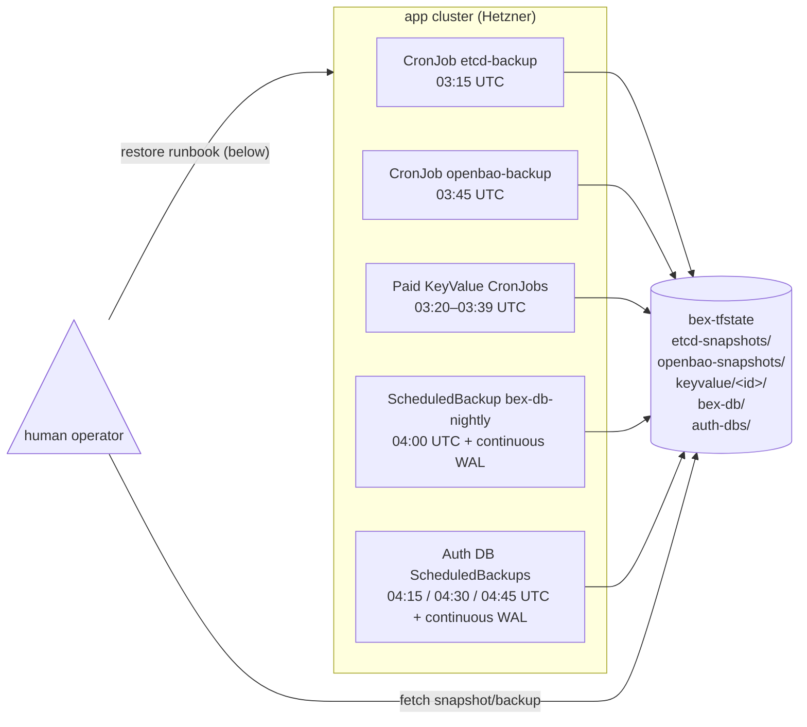

# Platform data-backup policy

**Why this exists:** bex has six platform stores plus tenant datastores holding state that is not recoverable from git alone: etcd, OpenBao, the control-plane database, the three auth databases, tenant Postgres, and managed Key Value. High availability protects a database from a node failure, not correlated storage loss. This document is the consolidated policy and restore runbook — the single place to check when something is on fire.

| store | what it holds | backup mechanism | schedule | retention | restore mechanism | last verified |
| --- | --- | --- | --- | --- | --- | --- |
| **etcd** | App/Database/KeyValue CRs (user deployments) | CronJob `kube-system/etcd-backup` → `etcd-snapshots/` in `bex-tfstate` | 03:15 UTC daily | 7 snapshots (rolling) | Docker throwaway etcd → `kubectl apply` extracted CRs | 2026-07-14 (CAPD 2-node, w7/m29) |
| **OpenBao** | All tenant env-var secrets | CronJob `secrets/openbao-backup` → `openbao-snapshots/` in `bex-tfstate` | 03:45 UTC daily | 7 snapshots (rolling) | `bao operator raft snapshot restore [-force]` onto running unsealed OpenBao | 2026-07-14 (Docker, fresh-node path, w7/m29) |
| **paid KeyValue** | Tenant Valkey data for every non-Free managed Key Value | Operator-owned `kvbak-<id>` CronJob → `keyvalue/<id>/<RFC3339-UTC>.rdb.gz` in `bex-tfstate` | One stable per-id slot from 03:20–03:39 UTC daily | 7 snapshots (rolling) | Fresh PVC: seed RDB with AOF off → verify → enable/rewrite AOF → restart | 2026-07-31 (production backup/restore/delete, w7/m68) |
| **bex-db** | Workspaces, members, audit log, usage, API keys, deploy history | Barman Cloud plugin → ObjectStore `bex-system/bex-db` → `bex-db/` in `bex-tfstate` + continuous WAL | 04:00 UTC daily (full base backup via plugin `ScheduledBackup`); WAL archiving is continuous | 7 days of base backups + WAL (ObjectStore retention) | CNPG `bootstrap.recovery` through the plugin ObjectStore into a throwaway cluster | 2026-07-28 (production plugin PITR, w1/m56) |
| **kratos-db** | User identities, credentials, verification/recovery state | Barman Cloud plugin → ObjectStore `auth/auth-dbs`, server `kratos-db-pg18` → `auth-dbs/kratos-db-pg18/` + continuous WAL | 04:15 UTC daily base backup; WAL continuous | 7 days of base backups + WAL | CNPG `bootstrap.recovery` through `auth/auth-dbs` into a throwaway cluster | 2026-07-31 (production restore, w7/m67) |
| **hydra-db** | OAuth clients, grants, consent, access/refresh-token state | Barman Cloud plugin → ObjectStore `auth/auth-dbs`, server `hydra-db-pg18` → `auth-dbs/hydra-db-pg18/` + continuous WAL | 04:30 UTC daily base backup; WAL continuous | 7 days of base backups + WAL | Same plugin recovery shape as kratos-db | 2026-07-31 (production backup + WAL verification, w7/m67) |
| **openfga-db** | Authorization stores, models, and tuples | Barman Cloud plugin → ObjectStore `auth/auth-dbs`, server `openfga-db-pg18` → `auth-dbs/openfga-db-pg18/` + continuous WAL | 04:45 UTC daily base backup; WAL continuous | 7 days of base backups + WAL | Same plugin recovery shape as kratos-db | 2026-07-31 (production backup + WAL verification, w7/m67) |

The platform stores and paid KeyValue backups use the same Wasabi/Hetzner Object Storage bucket (`bex-tfstate`) under separate store/server prefixes. Credentials come from out-of-band Secrets (never in git), following the same pattern as `etcd-backup-s3` / `openbao-backup-s3`. Free KeyValue instances are deliberately PVC-only and have no off-cluster recovery point.

## Barman Cloud plugin

The supported CNPG-I backup path is the [Barman Cloud Plugin](https://cloudnative-pg.io/plugin-barman-cloud/docs/intro/). bex vendors the exact upstream `v0.13.0` installation manifest (SHA-256 pinned in `deploy/gitops/charts/barman-cloud-plugin/README.md`) and installs it beside the CloudNativePG operator in `cnpg-system`; cert-manager supplies the client/server TLS certificates. The plugin controller runs on the platform pool, while its data-plane sidecar follows each CNPG instance pod's existing placement.

Three GitOps-managed `ObjectStore` resources preserve the transport contracts without containing credential bytes:

| ObjectStore | destination | retention | credential reference |
| --- | --- | --- | --- |
| `bex-system/bex-db` | `s3://bex-tfstate/bex-db` | 7d | `bex-system/bex-db-backup-s3` |
| `default/bex-tenant-postgres` | `s3://bex-tfstate/postgres` | 30d | `default/bex-db-backup-s3` |
| `auth/auth-dbs` | `s3://bex-tfstate/auth-dbs` | 7d | `auth/auth-dbs-backup-s3` |

All three references require only `AWS_ACCESS_KEY_ID` and `AWS_SECRET_ACCESS_KEY`; those Secrets remain provisioned out of band. Tenant and auth clusters share transport definitions but pass immutable per-database/per-major archive identities as the plugin's `serverName` parameter. This keeps one credential/config surface per retention/custody policy while preserving archive isolation.

New platform database archives use `serverName: <cluster>-pg<major>` (for example, `kratos-db-pg18`). A PostgreSQL major upgrade creates a new system identifier and WAL history, so the upgrade must atomically advance this suffix rather than append incompatible WAL to the old archive identity. `bex-db` retains the older plain `serverName: bex-db` because that production archive predates the convention; changing it without a major upgrade would strand its current PITR history.

The migration was deliberately staged: the plugin and ObjectStores landed first, then tenant Clusters and `bex-db` switched atomically to `barman-cloud.cloudnative-pg.io`. Fresh backup/PITR/restore drills passed for both paths on 2026-07-28, after which the native implementation and compatibility checks were removed. The three auth Clusters joined the same plugin path on 2026-07-31; all three completed fresh backups and a representative Kratos restore passed. Current manifests, validation, alerts, and runbook examples use only the plugin contract; the 2026-07-14 drill record below retains the former field names solely as historical evidence of what that drill exercised.



## One-time setup per cluster

### etcd

See [ADR011-etcd-backup-restore.md](ADR011-etcd-backup-restore.md) §One-time setup. The `etcd-backup-s3` Secret in `kube-system` holds the object-store credentials.

### OpenBao

See [ADR015-openbao-backup-restore.md](ADR015-openbao-backup-restore.md) §One-time setup. The `openbao-backup-s3` Secret in `secrets` holds the object-store credentials.

### bex-db

Two out-of-band steps — the same trust boundary as etcd/openbao:

1. **Create the `bex-db-backup-s3` Secret** (reuses the Terraform-state Object Storage creds from `.env`, exactly like the etcd/openbao S3 secrets):

   ```sh
   source .env && kubectl -n bex-system create secret generic bex-db-backup-s3 \
     --from-literal=AWS_ACCESS_KEY_ID="$TF_STATE_ACCESS_KEY" \
     --from-literal=AWS_SECRET_ACCESS_KEY="$TF_STATE_SECRET_KEY"
   ```

2. **Verify WAL archiving has started** (CNPG starts archiving immediately once the Secret exists and the cluster reaches `Ready`):

   ```sh
   kubectl -n bex-system exec bex-db-1 -- psql -U postgres -c "SELECT * FROM pg_stat_archiver;"
   # last_archived_wal should be non-null and last_archived_time recent
   ```

3. **Trigger an on-demand full base backup** (optional — the ScheduledBackup fires at 04:00 UTC; trigger now to confirm end-to-end):

   ```sh
   kubectl -n bex-system apply -f - <<'EOF'
   apiVersion: postgresql.cnpg.io/v1
   kind: Backup
   metadata:
     name: bex-db-initial
     namespace: bex-system
   spec:
     method: plugin
     pluginConfiguration:
       name: barman-cloud.cloudnative-pg.io
     cluster:
       name: bex-db
   EOF
   kubectl -n bex-system get backup bex-db-initial -w
   # phase → completed
   ```

4. **Confirm the backup artifact landed in object storage**:

   ```sh
   source .env
   # Barman nests artifacts under <destinationPath>/<serverName>/ (serverName = cluster name "bex-db")
   aws --endpoint-url "$TF_STATE_ENDPOINT" s3 ls "s3://$TF_STATE_BUCKET/bex-db/bex-db/" --recursive | head -10
   # Expect: base/YYYYMMDDTHHMMSS/backup.info, base/.../data.tar.gz, wals/.../*.gz
   ```

**Note on `endpointURL`:** `deploy/gitops/charts/barman-cloud-objectstores/bex-db.yaml` has `endpointURL: https://s3.eu-central-2.wasabisys.com`. Update the ObjectStore to match `$TF_STATE_ENDPOINT` if the cluster uses a different provider (Hetzner: `https://fsn1.your-objectstorage.com`).

### Auth databases

The shared `auth/auth-dbs` ObjectStore references one out-of-band Secret. Provision it from the same backup-plane credentials used by the other critical stores; never commit or print them:

```sh
source .env && kubectl -n auth create secret generic auth-dbs-backup-s3 \
  --from-literal=AWS_ACCESS_KEY_ID="$TF_STATE_ACCESS_KEY" \
  --from-literal=AWS_SECRET_ACCESS_KEY="$TF_STATE_SECRET_KEY"
```

After Argo syncs `barman-cloud-objectstores` and `auth-dbs`, verify all three Clusters report `ContinuousArchiving=True` and each nightly schedule exists:

```sh
kubectl -n auth get cluster kratos-db hydra-db openfga-db
kubectl -n auth get scheduledbackup kratos-db-nightly hydra-db-nightly openfga-db-nightly
kubectl -n auth get backup
```

Artifacts live under `s3://bex-tfstate/auth-dbs/<cluster>-pg<major>/{base,wals}/`. The production clusters were PostgreSQL 18 when this policy shipped, so the active server names are `kratos-db-pg18`, `hydra-db-pg18`, and `openfga-db-pg18`.

### Paid KeyValue

The production operator config sets the non-secret `BEX_KV_BACKUP_DESTINATION=s3://bex-tfstate/keyvalue`, Wasabi endpoint, and Secret name `bex-kv-backup-s3`. Provision the credential in the apps namespace from the backup-plane identity without committing or printing it:

```sh
source .env && kubectl -n default create secret generic bex-kv-backup-s3 \
  --from-literal=AWS_ACCESS_KEY_ID="$TF_STATE_ACCESS_KEY" \
  --from-literal=AWS_SECRET_ACCESS_KEY="$TF_STATE_SECRET_KEY"
```

All three settings are required. With any unset, the operator adds no backup CronJob or finalizer to new KeyValue resources. With the contract complete, every non-Free instance gets `kvbak-<id>`; Free receives none. Verify names and schedules without reading either Secret value:

```sh
kubectl -n default get cronjob -l app.bex.co/component=keyvalue-backup
```

## Restore runbooks

### etcd restore

See [ADR011-etcd-backup-restore.md](ADR011-etcd-backup-restore.md) §Restore (Path A — selective re-apply onto a fresh cluster — recommended).

### OpenBao restore

See [ADR015-openbao-backup-restore.md](ADR015-openbao-backup-restore.md) §Restore. The snapshot is sealed with the master key from when it was taken — unseal with the **same** `.env` unseal keys (`BAO_ROOT_TOKEN` / the Shamir unseal keys). Do NOT re-run `bao-init.sh` before restoring (it would write NEW keys).

### bex-db restore

CNPG recovers `bex-db` by bootstrapping a new `Cluster` through the Barman Cloud plugin and the existing `bex-system/bex-db` ObjectStore. Never restore in-place onto the live `bex-db` — always recover to a throwaway cluster first, verify a known row survives, then cut over.

```sh
# 0. Note a known identifiable row before recovery (so you can verify afterward).
#    Use -U postgres (superuser) inside the pod — peer auth as 'bex' is not configured.
kubectl -n bex-system exec bex-db-1 -c postgres -- psql -U postgres -d bex -c \
  "SELECT id, name FROM workspaces ORDER BY created_at DESC LIMIT 1;"
# Record: id=<UUID>, name=<workspace-name>

# 1. Find the latest successful backup.
#    Barman stores artifacts under <destinationPath>/<serverName>/ (serverName = cluster name).
#    Actual layout: s3://bex-tfstate/bex-db/bex-db/base/YYYYMMDDTHHMMSS/backup.info
source .env
aws --endpoint-url "$TF_STATE_ENDPOINT" s3 ls "s3://$TF_STATE_BUCKET/bex-db/bex-db/base/" --recursive \
  | grep "backup.info" | sort | tail -1
# WAL segments are at: s3://bex-tfstate/bex-db/bex-db/wals/

# 2. Apply a throwaway recovery cluster.
kubectl -n bex-system apply -f - <<'EOF'
apiVersion: postgresql.cnpg.io/v1
kind: Cluster
metadata:
  name: bex-db-recover
  namespace: bex-system
  annotations:
    argocd.argoproj.io/sync-options: SkipDryRunOnMissingResource=true
spec:
  instances: 1
  affinity:
    nodeSelector:
      bex.co/pool: platform
    tolerations:
      - { key: bex.co/platform, operator: Equal, value: "true", effect: NoSchedule }
  storage:
    size: 5Gi
    storageClass: hcloud-volumes
  resources:
    requests: { cpu: 100m, memory: 256Mi }
    limits: { cpu: "1", memory: 1Gi }
  bootstrap:
    recovery:
      source: bex-db
  externalClusters:
    - name: bex-db
      plugin:
        name: barman-cloud.cloudnative-pg.io
        parameters:
          barmanObjectName: bex-db
          serverName: bex-db
EOF
kubectl -n bex-system get cluster bex-db-recover -w
# phase → Cluster in healthy state

# 3. Verify the known row is present.
kubectl -n bex-system exec bex-db-recover-1 -c postgres -- psql -U postgres -d bex -c \
  "SELECT id, name FROM workspaces WHERE id = '<UUID>';"
# Must return the row recorded in step 0.

# 4. Tear down the recovery cluster (once verified, or promote it if cutting over).
kubectl -n bex-system delete cluster bex-db-recover
```

For a full cutover (live `bex-db` is destroyed): repeat the above, then rename `bex-db-recover` → `bex-db` in the GitOps chart (or Argo force-sync after removing the existing Cluster) and update `bex-db-app` Secret to match the new cluster's credentials.

### Auth database restore

Use the same new-Cluster-only recovery shape as `bex-db`, in the `auth` namespace. Set `bootstrap.recovery.source` to an `externalClusters` entry whose plugin parameters reference `barmanObjectName: auth-dbs` and the source's exact per-major `serverName`. Never add a backup plugin block pointing the throwaway recovery Cluster at the source server name: recovery reads that archive, while a live archiver must always have its own empty identity.

Before recovery, capture a known row without putting personal data in the drill record. For Kratos, verify an existing `identities.id`; for Hydra or OpenFGA, choose the equivalent stable primary-key row. Recover to a distinctly named Cluster, query the known row, and delete the Cluster plus every generated PVC/PV, Pod, Service, and Secret when verification completes. The credential-free production example, exact timings, and cleanup proof are in [the 2026-07-31 auth DB restore drill](drills/2026-07-31-auth-dbs-restore.md).

### KeyValue restore

KeyValue backups are coherent RDB snapshots, not PITR. Select the newest object (RFC3339 names sort chronologically), download and gunzip it, and validate it with the matching Valkey image's `valkey-check-rdb`. Restore only into a fresh PVC or an otherwise proven-empty data directory:

1. Create a throwaway PVC and seed the object as `/data/dump.rdb`; ensure no `appendonlydir/` or other AOF file exists.
2. Start the throwaway Valkey with `appendonly no`, the source version, and a throwaway password.
3. Verify a known marker key. A successful `PING` alone proves only that Valkey started, not that the snapshot loaded.
4. Change the managed workload back to `appendonly yes`, run `BGREWRITEAOF`, wait for it to finish, and restart.
5. Verify the marker again after restart, then delete the throwaway StatefulSet, Service, PVC, and Secret.

Valkey prefers an existing AOF over `dump.rdb`; seeding the RDB beside a surviving append-only directory silently restores the wrong dataset. The fresh-volume rule is therefore a safety invariant, not cleanup advice. [ADR021](ADR021-keyvalue-management.md) owns the mechanism details; [the production drill](drills/2026-07-31-keyvalue-restore.md) records the exact evidence.

> **CNPG 1.31+ readiness:** PASS. The active Clusters, ScheduledBackups, on-demand Backup example, and recovery examples use the Barman Cloud plugin. The 2026-07-28 production drill restored tenant and control-plane data at explicit PITR targets, and the 2026-07-31 production drill restored Kratos from its new auth archive. The historical 2026-07-14 drill below used CNPG's former fields; do not copy that record as a current manifest.

## Drill records

### Paid KeyValue backup, AOF-aware restore, and delete purge — 2026-07-31 (w7/m68, production)

A paid throwaway KeyValue captured a marker through eight manually triggered CronJob runs. The eighth run deleted exactly the oldest object, the bucket retained the newest seven, and the newest RDB passed Valkey checksum validation. A fresh-PVC restore loaded the marker with AOF disabled for the seed; after AOF was enabled and rewritten, the marker survived a workload restart. Deleting the source removed its CronJob, backup/purge Jobs and Pods, StatefulSet, PVC/PV, Secrets, and complete `keyvalue/<id>/` prefix. See [2026-07-31-keyvalue-restore.md](drills/2026-07-31-keyvalue-restore.md).

### Auth database Barman Cloud restore — 2026-07-31 (w7/m67, production)

All three auth clusters completed plugin base backups and continuously archived WAL under unique `*-pg18` server names. `kratos-db` restored from the bucket alone into a new one-instance Cluster in 62 seconds; a known identity was present exactly once, 35 total identities were present, and all throwaway compute/storage resources were deleted. Kratos, Hydra, OpenFGA, and all three source clusters stayed fully Ready. See [2026-07-31-auth-dbs-restore.md](drills/2026-07-31-auth-dbs-restore.md).

### Barman Cloud plugin PITR — 2026-07-28 (w1/m56, production)

Fresh plugin backups and explicit point-in-time restores passed for both a disposable tenant Database and `bex-db`. Each new restore contained a pre-target marker and excluded a later marker; the `bex-db` restore also retained the expected control-plane schema and row counts. Sources stayed healthy and all throwaway compute/storage resources were removed. See the credential-free evidence record: [2026-07-28-barman-plugin-pitr.md](drills/2026-07-28-barman-plugin-pitr.md).

### etcd restore — 2026-07-14 (w7/m29, CAPD 2-node mock cluster)

**Date:** 2026-07-14 · **Environment:** CAPI CAPD cluster (2 nodes: 1 control-plane + 1 worker, kindest/node:v1.36.1, kubeadm etcd 3.6.8-0) · **Duration:** ~8 min · **Outcome:** ✅ pass

**Steps executed:**

1. Applied test App CR (`drill-test-app`, label `bex.co/drill: w7-m29-2026-07-14`) to the CAPD cluster.
2. Took an etcd snapshot using `registry.k8s.io/etcd:3.6.8-0` reaching etcd via the control-plane container's IP (192.168.158.4:2379) with TLS certs copied from the node. Snapshot: 5.4 MB uncompressed, 550 KB gzipped.
3. Ran `etcdutl snapshot restore` (same image) → started throwaway `etcd` container from the restored data dir.
4. Ran `etcdctl get /registry/app.bex.co/apps/default/drill-test-app --print-value-only | jq ...` — the App CR including the drill label was present and the `jq` pipeline produced clean JSON ready for `kubectl apply`.
5. Cleaned up.

**Deviations from runbook (corrected in [ADR011](ADR011-etcd-backup-restore.md)):**

- _Image version_: The CronJob pinned `registry.k8s.io/etcd:3.5.15-0` but the CAPD cluster runs `3.6.8-0`. More critically, `etcdutl` (required for `snapshot restore`) is **not** in `3.5.15-0` — only in `3.6.x+`. Runbook updated to use the cluster's actual image. CronJob image pinned to `3.6.8-0`.
- _CAPD vs prod_: On prod, the CronJob runs on the node itself via `hostNetwork` + `hostPath` certs. On CAPD (Docker-in-Docker), etcd is in a container, so the snapshot was taken by reaching the container IP directly. This difference is CAPD-specific; prod is unaffected.
- _`etcdctl` path_: In the `registry.k8s.io/etcd` image, `etcdctl` and `etcd` are at `/usr/local/bin/` — must use `--entrypoint /usr/local/bin/etcdutl` (or `etcd`) with `docker run` since the default entrypoint doesn't resolve them from PATH in `docker run --rm image <cmd>` without explicit entrypoint.

**`jq` pipeline:** Works exactly as documented — `--print-value-only` output IS valid JSON in etcd 3.6.x.

---

### OpenBao restore — 2026-07-14 (w7/m29, local Docker containers)

**Date:** 2026-07-14 · **Environment:** Two local `openbao/openbao:2.5.5` Docker containers (source + fresh restore target) · **Duration:** ~12 min · **Outcome:** ✅ pass (fresh-node path)

**Steps executed:**

1. Started "source" OpenBao container; initialized (1 unseal key, 1 threshold for simplicity); enabled KV v2 at `tenants/`; wrote test secret `tenants/default/drill-test-app/DATABASE_URL` with `drill_marker: w7-m29-2026-07-14`.
2. Took a Raft snapshot via `bao operator raft snapshot save` using root token.
3. Started a FRESH "restore" OpenBao container (different master key after its own init + unseal).
4. Ran `bao operator raft snapshot restore <snap>` → **FAILED** with `could not verify hash file... use the snapshot-force API to bypass`.
5. Ran `bao operator raft snapshot restore -force <snap>` with the FRESH instance's root token → success (no output = success for this command).
6. Restarted the container so Raft reloads from the restored log.
7. Unsealed with the ORIGINAL unseal key → instance came up active.
8. Read `tenants/default/drill-test-app/DATABASE_URL` with the ORIGINAL root token → `drill_marker: w7-m29-2026-07-14` and `value: postgres://drilltest:secret@db:5432/bex` confirmed present.

**Deviations from runbook (corrected in [ADR015](ADR015-openbao-backup-restore.md)):**

- _`--force` flag required for fresh-node restore_: The existing runbook step 3 (`bao operator raft snapshot restore <snap>`) works ONLY when restoring to the same running instance (same master key). For a fresh node (new init, different master key), `--force` is mandatory. The "from-scratch rebuild" section was ambiguous; it now has an explicit fresh-node path.
- _Restart required after force restore_: After `snapshot restore -force`, the Raft state isn't reloaded until the process restarts. The runbook omitted this step.
- _Unseal key confusion_: After force restore + restart, unseal with the ORIGINAL `.env` keys (the restored master key). The fresh instance's keys no longer work. Documented explicitly.
- _Secret path_: The planned drill steps said `bao kv get secret/<some-path>` but the actual production path mount is `tenants/` (KV v2 at `tenants/`). Corrected in the drill record.
- _`bao-init.sh` warning_: The from-scratch note previously suggested running `bao-init.sh` first; doing so would generate NEW keys and make the old snapshot unrestorable. Clarified: do NOT run `bao-init.sh` before a fresh-node restore.

---

### bex-db restore — 2026-07-14 (w7/m29, kind cluster + CNPG + minio)

**Date:** 2026-07-14 · **Environment:** Single-node kind cluster (kindest/node:v1.36.1), CNPG 1.30.0, local minio as S3 target · **Duration:** ~18 min · **Outcome:** ✅ pass

**Steps executed:**

1. Deployed CNPG 1.30.0 on a fresh kind cluster + minio (S3 target at `http://192.168.158.8:9000`).
2. Created `bex-drill/bex-db` CNPG Cluster with `spec.backup.barmanObjectStore` pointing to `s3://bex-tfstate/bex-db` on minio.
3. Verified WAL archiving started (`last_archived_wal: 000000010000000000000001`, `last_archived_time` non-null).
4. Created test schema: `CREATE TABLE workspaces (id UUID PRIMARY KEY ..., name TEXT ...)` + inserted `('drill-workspace-w7m29')` → recorded UUID `f8b8e049-0201-4580-ac0e-6f128541db0d`.
5. Triggered on-demand `Backup` CR → phase `completed` in ~10 s. Artifacts in minio: `bex-db/bex-db/base/20260714T230242/` + WAL segments under `bex-db/bex-db/wals/`.
6. Applied `bex-db-recover` Cluster with `bootstrap.recovery.source: bex-db` + `externalClusters` barman reference → phase `Cluster in healthy state` in ~40 s.
7. Verified: `SELECT id, name FROM workspaces WHERE id = 'f8b8e049-...';` → row present in the recovered cluster.
8. Deleted recovery cluster + kind cluster.

**Deviations from runbook (corrected below):**

- _Object storage path_: The runbook says to look for `.catalog.json` at `s3://$TF_STATE_BUCKET/bex-db/`. Actual barman structure has the server name as an extra subdirectory: `s3://bex-tfstate/bex-db/bex-db/`. Artifacts are `base/YYYYMMDDTHHMMSS/backup.info` (not `.catalog.json`) and WAL segments under `wals/` (not `data/wal/`).
- _psql authentication_: The runbook uses `psql -U bex -d bex` inside the pod, but peer authentication is not configured for the `bex` role within the pod's Unix socket. Use `psql -U postgres -d bex` (superuser) instead.
- _nodeSelector/tolerations_: The recovery YAML includes `bex.co/pool: platform` selectors. On the mock cluster these nodes don't exist and would prevent scheduling. Omit for drills; keep for prod.
- _CNPG 1.30.0 deprecation warning_: Both `spec.backup.barmanObjectStore` and `spec.externalClusters[*].barmanObjectStore` emit a deprecation warning in CNPG 1.30.0: "Native support for Barman Cloud backups and recovery is deprecated and will be completely removed in CloudNativePG 1.31.0." Migration to the Barman Cloud Plugin is required before upgrading CNPG to 1.31+.

## Alerting

- **`BackupCronJobStale`** (prometheus.yaml `bex` group): fires if active `etcd-backup`, `openbao-backup`, or `kvbak-*` CronJobs have no success in >26h, including never-successful CronJobs older than 26h. Deliberately suspended KeyValue CronJobs are excluded. Severity: critical.
- **`PlatformDatabaseBackupStale`** (prometheus.yaml `bex` group): one alert instance per `bex-db`, `kratos-db`, `hydra-db`, or `openfga-db` if its Barman Cloud plugin-backed WAL archiver (`cnpg_pg_stat_archiver_last_archived_time` from the primary-only `cnpg-platform-db` scrape) has not archived in >26h. The scrape stamps namespace and cluster labels from Kubernetes discovery. Debugging starts with `pg_stat_archiver`, the cluster's ObjectStore, the `barman-cloud` deployment and instance-sidecar logs; credential presence is checked without printing Secret data. Severity: critical.

## Re-drill cadence

| store | last drilled | next drill trigger | reason |
| --- | --- | --- | --- |
| etcd | 2026-07-14 | Annually or after any control-plane topology change | Path A tested; topology changes the recovery surface |
| OpenBao | 2026-07-14 | Annually | Raft restore is idempotent and low-risk; fresh-node path now verified |
| paid KeyValue | 2026-07-31 | Annually or after Valkey major/image or snapshot-job changes | Snapshot recovery is AOF-sensitive; re-drill any load-order or image change |
| bex-db | 2026-07-28 | Annually or after a CNPG/plugin major upgrade or backup-transport change | Production plugin base backup + explicit PITR restore verified; re-drill when the recovery surface changes |
