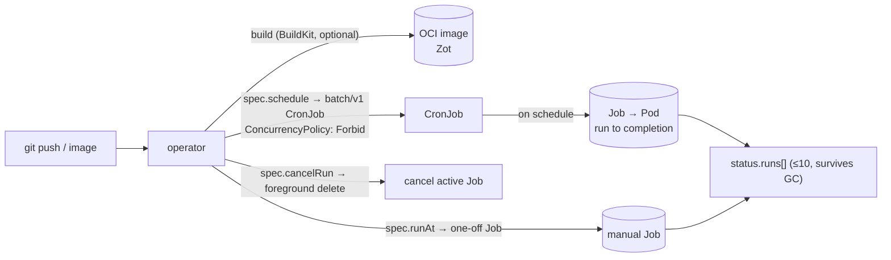

# Cron jobs (Render `cron_job` type)

bex runs scheduled tasks the way Render does: a `cron_job` service builds like any other service, then its image's command runs **on a cron schedule** to completion, with **at most one run active at a time** and a durable **run history**. It is the batch sibling of the compute service types — no Deployment, no Service, no Ingress, no HTTP port. Shipped across REST/GraphQL/MCP/Dashboard in **w1/m15** (the type) and **w2/m36** (first-class run history + trigger/cancel). This ADR consolidates the design that previously lived spread across [ADR006-bex-api.md](ADR006-bex-api.md) (the API surface), [ADR018-render-parity.md](ADR018-render-parity.md) (the parity row), and [render-artifacts/cron-runs.md](render-artifacts/cron-runs.md) (the pinned Render contract).

## The shape

- **Build** follows the shared build plane — a repo-backed cron builds an image with BuildKit, an image-backed cron uses the configured image directly. There is nothing cron-specific about the build.
- **Schedule** is a **5-field crontab** (`spec.schedule`, required for `cron_job`), evaluated by Kubernetes in **UTC** — matching Render's cron semantics exactly.
- **Command** (`spec.command`, optional) overrides the image's default entrypoint (`/bin/sh -c <command>`, applied in `cronPodSpec`); empty runs the image's own command unmodified.
- **No network shape.** A `cron_job` reconciles to a `batch/v1` **CronJob** only — no Deployment/Service/Ingress. It therefore cannot carry `domains`, `healthCheckPath`, `maxShutdownDelaySeconds`, `ipAllowList`, or a `preDeployCommand` (all rejected with a named 400). It never appears in `GET /v1/services/{id}/instances` (returns `[]`).

## Mechanism (operator)

`reconcileCronJob` (`lego/operator/internal/controller/app_controller.go`) materializes and manages everything:

- **Scheduled runs** — a `batch/v1.CronJob` named after the App, with `ConcurrencyPolicy: ForbidConcurrent` (Render's "at most one run active" guarantee) and `spec.suspend = App.Spec.Suspended` (suspend pauses scheduling without dropping history). The pod template comes from `cronPodSpec` — the built image run to completion, no HTTP port.
- **Manual runs ("Trigger Run")** — a change to `spec.runAt` (a verb-as-timestamp field) creates a one-off `batch/v1.Job` with a deterministic name from `ManualCronRunJobName()`. Skipped while suspended or when a cancellation is pending.
- **Cancellation** — `spec.cancelRun` (a `CronRunCancellation` intent carried across the backend→operator boundary) triggers a **foreground delete** of the exact backing Job; the operator records `Canceled` in status and refuses to let a stable `runAt` recreate a canceled manual Job. A manual replacement waits until the foreground deletion removes the active Job, so there is never even a brief overlap.
- **Run history** — `cronRuns()` lists all Jobs labeled `app=<name>` (scheduled + one-off), sorts newest-first, maps Job conditions to a run status, and writes them to `App.status.runs` (capped at **10** terminal entries, **retained after Kubernetes garbage-collects the Jobs**). `Owns(&batchv1.CronJob{})` wires CronJob/Job events back into the reconcile queue.

## CR contract

`App` (`lego/types/v1alpha1/app_types.go`, helpers in `cron.go`):

| Field | Meaning |
| --- | --- |
| `spec.type = "cron_job"` | selects the CronJob reconcile path |
| `spec.schedule` | 5-field crontab (required for `cron_job`) |
| `spec.command` | optional entrypoint override (`/bin/sh -c`) |
| `spec.runAt` | RFC3339 timestamp; a change triggers one manual run |
| `spec.cancelRun` | `CronRunCancellation` intent for an in-flight run |
| `status.runs[]` | `CronRun{ Name, StartedAt, FinishedAt, Status }`, newest first, ≤10 |

The mechanism-facing status vocabulary is `Running` / `Succeeded` / `Failed` / `Canceled`; bex-api maps it to Render's wire enum below.

## API surface (one Core, three adapters)

`cron_job` rides the shared create/read/update verbs (`POST /v1/services` with `type: cron_job`, `serviceDetails.schedule`/`.command`; `PATCH` threads schedule/command via `SetCronJob`). Run management adds a dedicated verb family.

**REST** (`lego/backend/internal/apps/rest.go`):

| Method + path | Behavior | Source |
| --- | --- | --- |
| `POST /v1/cron-jobs/{id}/runs` | cancel any active run, then trigger a replacement; returns the pending `cronJobRun` (200) | Render's current contract |
| `DELETE /v1/cron-jobs/{id}/runs` | cancel the currently active run (204) | Render's current contract |
| `GET /v1/cron-jobs/{id}/runs` | list `[{cronJobRun, cursor}]` (`cursor`/`limit`) | bex extension |
| `GET /v1/cron-jobs/{id}/runs/{runId}` | fetch one stable `crr-…` run | bex extension |
| `POST /v1/cron-jobs/{id}/runs/{runId}/cancel` | cancel one pending run; terminal ⇒ 409 | bex extension |

The run handlers also remain available as `/v1/services/{id}/runs` subresources. The retired public `/v1/apps` family is not registered.

**GraphQL**: `updateCronJob`, `runCronJob`, `cancelCronJobRun`, and queries `cronJobRuns(serviceId,cursor,limit)` / `cronJobRun(serviceId,runId)`, all returning `CronRun { id status startedAt finishedAt }`; `Service.lastSuccessfulRunAt` mirrors the REST cron detail.

**MCP**: `create_cron_job` (tracks Render's official create tool), plus the bex extensions `run_cron_job`, `list_cron_job_runs`, `get_cron_job_run`, `cancel_cron_job_run`, and `update_cron_job` (Render's official MCP ships only a non-functional `update_cron_job` stub that says "use the dashboard/API").

**Dashboard**: the cron Settings tab edits Schedule + Command; the Events page reads the cursor-paged run API and can cancel a pending row.

## Run object (Render contract, pinned)

`cronJobRun` — verified against Render's live OpenAPI 2026-07-14 ([render-artifacts/cron-runs.md](render-artifacts/cron-runs.md)):

| field | required | bex source |
| --- | :-: | --- |
| `id` | yes | deterministic `crr-…` derived from the backing Job name via `internal/id` |
| `status` | yes | `pending` \| `successful` \| `unsuccessful` \| `canceled` |
| `startedAt` | no | Job `status.startTime` |
| `finishedAt` | no | completion/failure transition or accepted-cancellation time |
| `triggeredBy` / `canceledBy` | no | **omitted** — Kubernetes Jobs do not retain the API caller identity |

The `crr-…` id hides the Kubernetes Job name while staying stable across reads and after Job GC. The cron service object reports `serviceDetails.lastSuccessfulRunAt` (REST) / `Service.lastSuccessfulRunAt` (GraphQL), derived from the newest successful `status.runs` entry.

## Deliberate divergences

- **First-class run history is a bex extension.** Render's current OpenAPI exposes no list-runs, get-run, or per-run-cancel routes — only trigger (`POST .../runs`) and cancel-current (`DELETE .../runs`). bex mirrors both current routes and adds the three historical reads in Render's own envelope/id/error grammar.
- **Terminal per-run cancel is 409, not a silent no-op.** Render's cancel-current OpenAPI documents only 204; a conflict is more honest than a successful no-op on an already-finished run.
- **Actor fields are omitted, not fabricated.** `triggeredBy`/`canceledBy` have no durable source (Jobs drop caller identity), so they are honestly absent.
- **12-hour cap and persistent disks.** Render stops a run after 12h and disallows disks on crons. bex inherits Kubernetes' Job semantics; a hard `activeDeadlineSeconds` cap and disk rejection are the natural follow-ups if strict parity is wanted.
- **Not the same as one-off jobs.** Render's `/services/{id}/jobs` (run an arbitrary command in the service context) is an execution surface deliberately off-roadmap (`DO_NOT_DO` §pillar 5) — separate from scheduled cron jobs. Likewise **pre-deploy commands** are one-shot `batch/v1.Job`s gating a rollout ([ADR004-app-deployment.md](ADR004-app-deployment.md)), a different mechanism from a CronJob.

## Evidence

`cron_runs_test.go`, `service_types_test.go` (envtest), `cron-runs-section.test.tsx`; parity row [ADR018-render-parity.md](ADR018-render-parity.md) (Cron job); milestone `.pm/w1/done/m15` + `w2/m36`.
