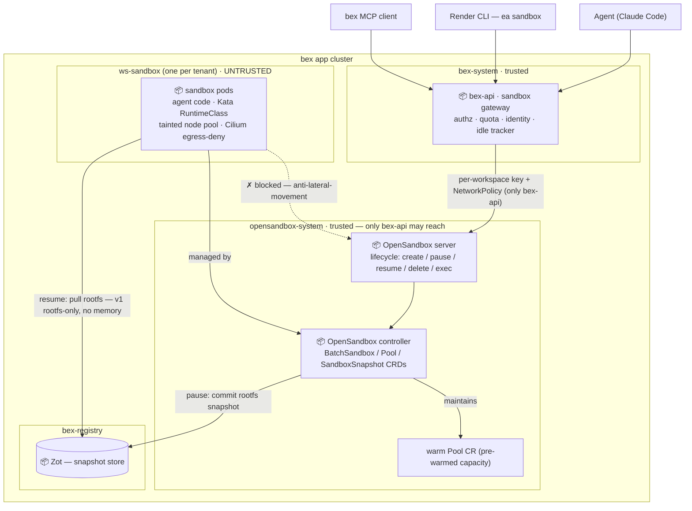

# ADR: Sandbox cluster substrate — multi-node OpenSandbox, Kata isolation, and the bex-api gateway

**Status:** proposed — the architectural design for the **re-opened pillar 5** (re-open authorized 2026-07-27, reversing [`.pm/DO_NOT_DO.md`](../.pm/DO_NOT_DO.md) #18); no substrate or gateway code yet. It refines the substrate and surface assumptions of [ADR014-sandboxes.md](ADR014-sandboxes.md); ADR014 remains the sandbox-gateway design record (D0–D7 still govern the bex-api side, except D2's E2B REST lifecycle shapes — displaced by the Render `ea sandbox` shapes, see D2). Amended 2026-07-27 after [ADR043-tenant-namespace-isolation.md](ADR043-tenant-namespace-isolation.md): D3/D4 now specify per-tenant `<ws>-sandbox` namespaces and OpenSandbox multi-tenant mode (the original text had a single shared `bex-sandbox` namespace and a single shared `api_key`).

## Context

Pillar 5 (hosted agent sandboxes) was taken off the roadmap on 2026-07-08 ([`.pm/DO_NOT_DO.md`](../.pm/DO_NOT_DO.md) #18) for three reasons: the Render-alternative core was unfinished, sandboxes are a second product surface competing for worker capacity, and **the mechanism was single-host-only**. This ADR records how pillar 5 is now realized — by removing that third reason: taking OpenSandbox from a host-local Docker-runtime toy to a real **multi-node Kubernetes-runtime cluster substrate**.

Today bex has **no consumer of a multi-node OpenSandbox cluster** (verified 2026-07-27):

- The GitOps-installed controller ([`deploy/gitops/charts/opensandbox-controller/`](../deploy/gitops/charts/opensandbox-controller/)) has **zero CR instances** — installed but undriven.
- The lifecycle control-plane server runs only as a host `uvx --from opensandbox-server` process on `:8077`; there is **no container image, Deployment, Service, ConfigMap, or PVC** for it.
- Prod runs `BEX_RUNTIME=kubernetes` with **no `BEX_OPENSANDBOX_URL`** — the operator never calls OpenSandbox; it is a dev/local path only.
- The k8s-runtime path ([`deploy/opensandbox/sandbox-k8s.toml`](../deploy/opensandbox/sandbox-k8s.toml)) hardcodes `/Users/tianpan/...` paths and is blocked on OrbStack (cri-dockerd, not containerd-CRI — [ADR014](ADR014-sandboxes.md) D5).
- No `Pool` CRs, no `RuntimeClass`, no isolation boundary, no ingress/egress components.

Two refinements to ADR014 shape this design:

1. **Surface = Render CLI `ea sandbox`.** The official `render-oss/cli` v2.21.0 already ships `render ea sandbox create/exec/list/stop` → `/v1/sandboxes*`, today returning 404 ([`docs/cli-compatibility-checklist.md`](cli-compatibility-checklist.md):238-241). Making those work unmodified is bex's core parity philosophy — the sandbox becomes a Render-CLI-compatible REST surface, not (only) E2B/MCP.
2. **Isolation = strong runtime isolation now** — originally Kata, **amended to gVisor** (D3): the prod Hetzner Cloud `cpx32` nodes expose no `/dev/kvm`, so Kata (needs KVM) is impossible here; gVisor's non-KVM `systrap` platform was validated live instead. Either way, per [ADR044](ADR044-sandbox-runtime-comparison.md) pause/resume stays **rootfs-only** (runtime isolation, not memory snapshots).

## Decision

Six decisions. Directory layout follows the repo's function-based convention (like `zot`): substrate configs in `deploy/opensandbox/`, Argo-reconciled manifests in `deploy/gitops/`, the Kata node pool in `infra/`, and the Go gateway in `lego/backend/internal/sandbox/`.

### D1 — Multi-node Kubernetes-runtime substrate (replace the single-host toy)

Deploy `opensandbox-server` (the Python lifecycle API) **in-cluster** as a Deployment + Service + ConfigMap (cluster-portable TOML) + PVC (sqlite store) + ServiceAccount/Role in `opensandbox-system`, talking to the already-installed BatchSandbox controller. A `server.Dockerfile` packages the PyPI package into an image (no official image exists today). The cluster TOML drops the hardcoded `kubeconfig_path` (in-cluster ServiceAccount), bind-mounts the BatchSandbox template as a ConfigMap, and sets `[runtime] type=kubernetes workload_provider=batchsandbox`. `BEX_OPENSANDBOX_URL` becomes `http://<svc>.opensandbox-system.svc:<port>`. The snapshot registry switches from `127.0.0.1:5050` insecure to the in-cluster Zot (`zot.bex-registry.svc:5000/snapshots`, `registryInsecure=false`, push/pull secrets replicated via the [`scripts/registry-secrets.sh`](../scripts/registry-secrets.sh) pattern); the chart's existing `snapshot.*` knobs need no chart change.

### D2 — bex-api is the synchronous sandbox gateway; surface = Render CLI `ea sandbox`

A new `lego/backend/internal/sandbox/` feature package owns an **in-package OpenSandbox HTTP client** (`core.DoJSON` / `core.OryTransport` — the Hydra/OpenBao pattern; the operator's `lego/operator/internal/runtime/opensandbox.go` client is unimportable from backend by Go's `internal` rule and the `operator → types ← backend` arrow). `Create` is rewritten to be **template-based** (ADR014 D2), dropping the host-local `docker inspect` coupling; a template registry fixes image+entrypoint at registration time. The REST surface serves the **Render CLI `ea sandbox` shapes** at `/v1/sandboxes*` (create/exec/list/stop); MCP tools `spawn_sandbox` / `sandbox_exec` follow the per-feature `mcp.go` fragment. E2B parity stays deferred (ADR014 D2) — both the gRPC data plane and ADR014 D2's E2B REST lifecycle shapes: the Render shapes occupy `/v1/sandboxes*`, so E2B REST compatibility would need distinct routes if ever revived. It wires in at the five canonical insertion points (`cmd/api/main.go` env-read, `api.Deps`, `api.Server`, `NewServer`, `features()`).

### D3 — Strong isolation on a dedicated sandbox node pool — **gVisor, not Kata** (amended 2026-07-28)

Untrusted agent-generated code demands stronger-than-container isolation (ADR014 "Future considerations"; [ADR022-tenant-isolation.md](ADR022-tenant-isolation.md)). This ADR originally chose **Kata**, but Kata needs hardware virtualization (`/dev/kvm`), and **verified on prod 2026-07-28 the cluster's Hetzner Cloud `cpx32` nodes do not expose it** (no nested virt, no `vmx`/`svm`) — Kata is **impossible** on this infra. The substitute is **gVisor (`runsc`)**: a user-space kernel giving strong syscall-level isolation whose `systrap` platform needs **no KVM**. Validated live on a `cpx32` node — `runsc --platform=systrap do echo` runs and a Pod reached `Running` under `runtimeClassName: gvisor`. gVisor is explicitly the non-KVM rung of the isolation ladder (namespace → microVM: Kata/**gVisor**/Firecracker); Kata remains the choice if KVM-capable nodes (Hetzner dedicated/bare-metal) ever join.

Ship a `gvisor` `RuntimeClass` ([`deploy/opensandbox/gvisor-runtimeclass.yaml`](../deploy/opensandbox/gvisor-runtimeclass.yaml)) and install `runsc` + the containerd runsc runtime **at node bootstrap** on a dedicated **tainted `bex.co/sandbox` node pool** (CAPH `preKubeadmCommands` in [`infra/clusterapi/overlays/hetzner-caph/`](../infra/clusterapi/overlays/hetzner-caph/)) — **not** by restarting containerd on a live node, which breaks the Cilium datapath (learned 2026-07-28). The pool must be **stable (min ≥ 1)**, not the autoscaled burst pool (an idle burst node is reclaimed, taking any imperative install with it — also learned 2026-07-28). Sandboxes run in per-tenant **`<ws>-sandbox` namespaces** ([ADR043](ADR043-tenant-namespace-isolation.md) D1/D2) on that pool, behind a Cilium egress-deny/metadata-deny boundary mirroring [`deploy/gitops/base/build-boundary.yaml`](../deploy/gitops/base/build-boundary.yaml). The dedicated pool separates sandbox capacity from the tenant pool — the original DO_NOT_DO "competing for capacity" concern.

Snapshot semantics (D5) are unchanged by gVisor: pause/resume stays rootfs-only.

### D4 — Security: the bex-api ↔ OpenSandbox link is a single trusted hop

Today there is **no** application-layer security: the server binds `127.0.0.1`, has no `api_key`, runs `OPENSANDBOX_INSECURE_SERVER=YES`, and the operator client sends no auth — the boundary is loopback (bex-api does not call OpenSandbox yet). Once the server is an in-cluster Service this is unsafe: without multi-tenancy enabled, anyone who reaches the lifecycle API can drive any sandbox. Upstream OpenSandbox ships a **multi-tenant mode** (OSEP-0014): tenants come from a `[[tenants]]` file or an **HTTP tenant-lookup provider** (the server forwards the caller's `OPEN-SANDBOX-API-KEY` header; the endpoint answers `{namespace, ttl}` or 401), and lifecycle operations are auto-scoped to the tenant's namespace. Defense in depth mirrors the bex-api↔OpenFGA/Hydra/OpenBao pattern:

- **L3/L4** — NetworkPolicy (or Cilium identity policy) on `opensandbox-system` admitting **only bex-api** (`bex-system`), denying tenant + sandbox pods (following the [`deploy/gitops/base/network-policies.yaml`](../deploy/gitops/base/network-policies.yaml) `deny-tenant-ingress` pattern — those policies admit `bex-system` plus each namespace's own platform peers such as `kpack`/`bex-build`, never tenant pods; here the admit list is bex-api alone).
- **L7** — enable multi-tenant mode with the HTTP tenant-lookup provider backed by bex IAM: bex-api mints per-workspace keys mapped to `<ws>-sandbox`, so OpenSandbox itself rejects cross-tenant operations even if bex-api bugs; drop `INSECURE_SERVER`. Key custody mirrors `BEX_OPENFGA_TOKEN` (k8s Secret + env, out-of-band).
- **East-west (load-bearing)** — a compromised sandbox must not bypass bex-api and drive the lifecycle API directly. Closed by the `<ws>-sandbox` egress-deny (D3) **plus** the admit-only-bex-api NetworkPolicy.

### D5 — Snapshot semantics: v1 is rootfs-only; memory hibernation is a watch item

The k8s BatchSandbox pause/resume commits the rootfs to an OCI image and recreates the pod ([ADR044](ADR044-sandbox-runtime-comparison.md)); Kata does not change this. So v1 "sleep = free" preserves the **filesystem only — memory and processes do not survive pause.** This is weaker than E2B's memory hibernation and weaker than the single-host Docker path ADR014 D5 described. The k8s-native path to memory hibernation is containerd checkpoint/restore (CRIU) — recorded as a watch item, not v1 work.

**Blocked on prod by the per-tenant PSS floor (found w3/m32/t007, 2026-07-29).** Once sandboxes run in the per-tenant `<ws>-sandbox` namespace (ADR043/m31), pause fails: the OpenSandbox controller's snapshot **commit Job mounts the node `containerd.sock` via a `hostPath` volume** to export the rootfs, but `<ws>-sandbox` enforces PodSecurity **`baseline`**, which forbids `hostPath` — so the commit pod is rejected (`FailedCreate … violates PodSecurity "baseline": hostPath volumes`) and the sandbox hangs in `Pausing` indefinitely. Create/list/exec/stop are unaffected (validated). The two ways forward, neither v1: (a) run the privileged commit Job in a dedicated platform namespace (not the tenant's) — an upstream OpenSandbox change, since it currently creates the Job in the sandbox namespace; or (b) relax the sandbox-namespace PSS to admit the commit Job — **rejected**, it would let every untrusted sandbox pod mount `hostPath`, dissolving the isolation floor. Net: pause/resume is **unavailable** under the secure per-tenant topology until (a) lands; the "sleep = free" economics wait on it. This strengthens D5's original "watch item" call with a concrete mechanism.

### D6 — Validate on real containerd-CRI, not the OrbStack mock

The BatchSandbox snapshot path does **not** work on `scripts/mock-cluster.sh` (OrbStack/cri-dockerd). Validation needs a real containerd-CRI node — a **disposable k3s node** (with Kata) for development, then Hetzner prod. The k3s DoD loop (adapted from ADR014 §Verification): create → exec → pause → resume (rootfs restored) → stop/delete, under Kata + the Cilium boundary.

## Architecture

**Every arrow is a dependency** (`A → B` means A depends on B), matching [ADR002-architecture.md](ADR002-architecture.md). The dashed `✗ blocked` edge is the load-bearing security constraint: untrusted sandbox pods cannot reach the OpenSandbox server, so the only path to the lifecycle API is through bex-api (the authz/quota gate).

## Alternatives considered

- **Keep the single-host Docker runtime** — rejected. No HA, no multi-node, host loss loses all sandboxes and snapshots. This was the mechanism gap that paused pillar 5; D1 removes it.
- **AgentENV / Firecracker substrate** ([ADR044](ADR044-sandbox-runtime-comparison.md)) — rejected for bex: Rust node, prototype in-memory control plane, no client surface; would trade a working integration for a substrate rewrite and a second non-k8s scheduler. Tracked as the reference design for memory snapshots and microVM isolation.
- **Container-level isolation (build-boundary) instead of Kata** — rejected for pillar 5. Sandboxes run **untrusted agent-generated code**; ADR014 flags this as the strongest case for microVM isolation. Kata is chosen now (D3); the build-boundary pattern is still reused for the namespace/egress boundary underneath.
- **E2B-SDK as the primary surface** — deferred. Render-CLI compatibility is bex's parity philosophy and the `render ea sandbox` commands already exist as 404s to close; E2B's gRPC data plane is deferred per ADR014 D2.
- **`Sandbox` CRD reconciled by the operator** — rejected in ADR014 D0. Sandboxes are interactive, ephemeral sessions; async CR reconcile fights synchronous create/exec/connect.

## Consequences

- A new `opensandbox-server` container image must be built/sourced (D1).
- Kata node-image work (CAPH `KubeadmConfigTemplate` + the k3s node) is the long pole and the riskiest piece (D3).
- bex-api gains a direct-runtime responsibility (an OpenSandbox client) — a documented, sandbox-scoped exception to the operator-is-the-only-mechanism rule (ADR014).
- v1 "sleep = free" is **rootfs-only**; the memory-hibernation story is honestly weaker than E2B's until CRIU lands (D5).
- `.pm`: a dated (2026-07-27) re-open clause on `DO_NOT_DO.md` #18 + a fresh milestone (not a reuse of the removed `w2/m3`); ADR014 status amended to match.
- Validation is gated on a real containerd-CRI node (D6) — the local mock cannot close the snapshot DoD.
- Three watch items carry forward: containerd/CRIU for k8s memory hibernation (D5); the bex-api↔OpenSandbox link stays single-hop-only as the sandbox tenant boundary hardens; and the warm `Pool` (D1) pre-warms capacity in `opensandbox-system` — under per-tenant `<ws>-sandbox` scoping (D3/D4) a tenant's create cannot draw from a pool in another namespace, so pool-backed create latency needs a per-tenant (or claim-time-move) warm strategy before it helps multi-tenant traffic.
