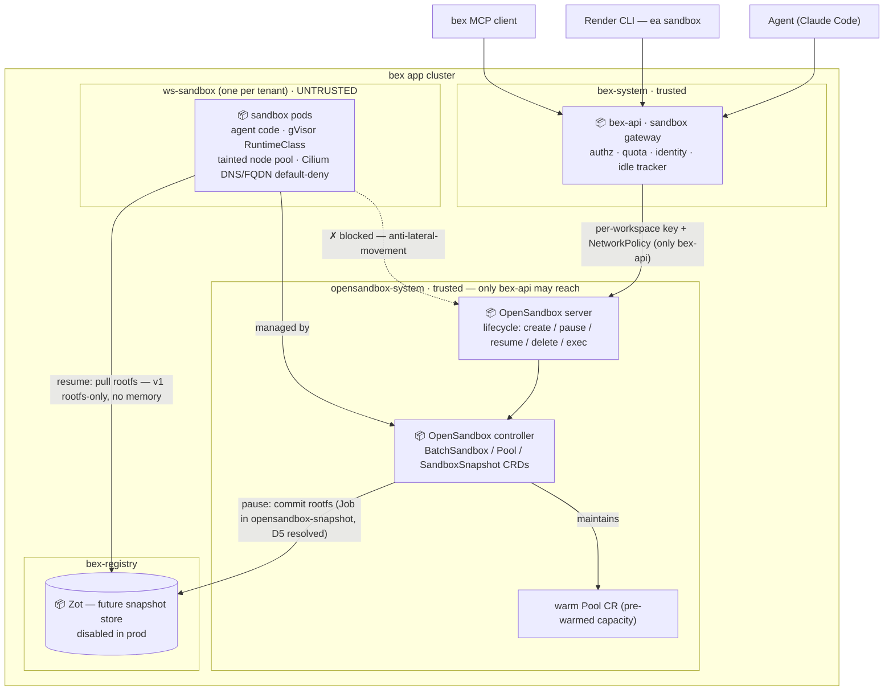

# ADR: Sandbox cluster substrate — multi-node OpenSandbox, gVisor isolation, and the bex-api gateway

**Status:** accepted and implemented for create/list/get/exec/stop on the Kubernetes/gVisor substrate. m33 exec landed concurrently with the m35 security hardening, which is deployed and adversarially verified on the production gVisor/Cilium substrate (2026-07-30: the full ownership, same/cross-workspace network, DNS/FQDN/SNI egress, identity ingress, lifecycle RBAC, sandbox-Pod runtime admission, NamespaceReconciler admission, and Hubble matrix — 40 checks, clean disposable-fixture audit); the sandbox may now expand further. This ADR refines [ADR014-sandboxes.md](ADR014-sandboxes.md); Render `ea sandbox` shapes displace that ADR's original E2B lifecycle routes.

## Context

Pillar 5 (hosted agent sandboxes) was taken off the roadmap on 2026-07-08 ([`.pm/DO_NOT_DO.md`](../.pm/DO_NOT_DO.md) #18) for three reasons: the Render-alternative core was unfinished, sandboxes are a second product surface competing for worker capacity, and **the mechanism was single-host-only**. This ADR records how pillar 5 is now realized — by removing that third reason: taking OpenSandbox from a host-local Docker-runtime toy to a real **multi-node Kubernetes-runtime cluster substrate**.

Before w3/m32, bex had **no consumer of a multi-node OpenSandbox cluster** (audit captured 2026-07-27):

- The GitOps-installed controller ([`deploy/gitops/charts/opensandbox-controller/`](../deploy/gitops/charts/opensandbox-controller/)) has **zero CR instances** — installed but undriven.
- The lifecycle control-plane server runs only as a host `uvx --from opensandbox-server` process on `:8077`; there is **no container image, Deployment, Service, ConfigMap, or PVC** for it.
- Prod runs `BEX_RUNTIME=kubernetes` with **no `BEX_OPENSANDBOX_URL`** — the operator never calls OpenSandbox; it is a dev/local path only.
- The k8s-runtime path ([`deploy/opensandbox/sandbox-k8s.toml`](../deploy/opensandbox/sandbox-k8s.toml)) hardcodes `/Users/tianpan/...` paths and is blocked on OrbStack (cri-dockerd, not containerd-CRI — [ADR014](ADR014-sandboxes.md) D5).
- No `Pool` CRs, no `RuntimeClass`, no isolation boundary, no ingress/egress components.

Two refinements to ADR014 shape this design:

1. **Surface = Render CLI `ea sandbox`.** The official `render-oss/cli` v2.21.0 already ships `render ea sandbox create/exec/list/stop` → `/v1/sandboxes*`, today returning 404 ([`docs/cli-compatibility-checklist.md`](cli-compatibility-checklist.md):238-241). Making those work unmodified is bex's core parity philosophy — the sandbox becomes a Render-CLI-compatible REST surface, not (only) E2B/MCP.
2. **Isolation = strong runtime isolation now** — originally Kata, **amended to gVisor** (D3): the prod Hetzner Cloud `cpx32` nodes expose no `/dev/kvm`, so Kata (needs KVM) is impossible here; gVisor's non-KVM `systrap` platform was validated live instead. Either way, per [ADR044](ADR044-sandbox-runtime-comparison.md) pause/resume stays **rootfs-only** (runtime isolation, not memory snapshots).

## Decision

Six decisions. Directory layout follows the repo's function-based convention (like `zot`): substrate configs in `deploy/opensandbox/`, Argo-reconciled manifests in `deploy/gitops/`, the gVisor node pool in `infra/`, and the Go gateway in `lego/backend/internal/sandbox/`.

### D1 — Multi-node Kubernetes-runtime substrate (replace the single-host toy)

Deploy `opensandbox-server` (the Python lifecycle API) **in-cluster** as a Deployment + Service + ConfigMap (cluster-portable TOML) + PVC (sqlite store) + ServiceAccount/Role in `opensandbox-system`, talking to the already-installed BatchSandbox controller. A `server.Dockerfile` packages the PyPI package into an image (no official image exists today). The cluster TOML drops the hardcoded `kubeconfig_path` (in-cluster ServiceAccount), bind-mounts the BatchSandbox template as a ConfigMap, and sets `[runtime] type=kubernetes workload_provider=batchsandbox`. `BEX_OPENSANDBOX_URL` becomes `http://<svc>.opensandbox-system.svc:<port>`. The controller (not the server) now receives the snapshot registry + credential flags once the carried patch confines the commit Job to `opensandbox-snapshot` (D5, resolved w3/m42); the server's own 0.2.2 config model still has no `[snapshot]` block, so snapshot wiring lives on the controller values, not the server TOML.

### D2 — bex-api is the synchronous sandbox gateway; surface = Render CLI `ea sandbox`

A new `lego/backend/internal/sandbox/` feature package owns an **in-package OpenSandbox HTTP client** (`core.DoJSON` / `core.OryTransport` — the Hydra/OpenBao pattern; the operator's `lego/operator/internal/runtime/opensandbox.go` client is unimportable from backend by Go's `internal` rule and the `operator → types ← backend` arrow). `Create` is rewritten to be **template-based** (ADR014 D2), dropping the host-local `docker inspect` coupling; a template registry fixes image+entrypoint at registration time. The REST surface serves the **Render CLI `ea sandbox` shapes** at `/v1/sandboxes*` (create/exec/list/stop); MCP tools `spawn_sandbox` / `sandbox_exec` follow the per-feature `mcp.go` fragment. E2B parity stays deferred (ADR014 D2) — both the gRPC data plane and ADR014 D2's E2B REST lifecycle shapes: the Render shapes occupy `/v1/sandboxes*`, so E2B REST compatibility would need distinct routes if ever revived. It wires in at the five canonical insertion points (`cmd/api/main.go` env-read, `api.Deps`, `api.Server`, `NewServer`, `features()`).

### D3 — Strong isolation on a dedicated sandbox node pool — **gVisor, not Kata** (amended 2026-07-28)

Untrusted agent-generated code demands stronger-than-container isolation (ADR014 "Future considerations"; [ADR022-tenant-isolation.md](ADR022-tenant-isolation.md)). This ADR originally chose **Kata**, but Kata needs hardware virtualization (`/dev/kvm`), and **verified on prod 2026-07-28 the cluster's Hetzner Cloud `cpx32` nodes do not expose it** (no nested virt, no `vmx`/`svm`) — Kata is **impossible** on this infra. The substitute is **gVisor (`runsc`)**: a user-space application kernel that reduces the host-kernel syscall attack surface and whose `systrap` platform needs **no KVM**. Validated live on a `cpx32` node — `runsc --platform=systrap do echo` runs and a Pod reached `Running` under `runtimeClassName: gvisor`. gVisor is the non-KVM rung between ordinary `runc` and a Kata/Firecracker microVM; Kata remains the choice if KVM-capable nodes (Hetzner dedicated/bare-metal) ever join.

Ship a `gvisor` `RuntimeClass` ([`deploy/opensandbox/gvisor-runtimeclass.yaml`](../deploy/opensandbox/gvisor-runtimeclass.yaml)) and install `runsc` + the containerd runsc runtime **at node bootstrap** on a dedicated **tainted `bex.co/sandbox` node pool** (CAPH `preKubeadmCommands` in [`infra/clusterapi/overlays/hetzner-caph/`](../infra/clusterapi/overlays/hetzner-caph/)) — **not** by restarting containerd on a live node, which breaks the Cilium datapath (learned 2026-07-28). The pool must be **stable (min ≥ 1)**, not the autoscaled burst pool (an idle burst node is reclaimed, taking any imperative install with it — also learned 2026-07-28). Sandboxes run in per-tenant **`<ws>-sandbox` namespaces** ([ADR043](ADR043-tenant-namespace-isolation.md) D1/D2) on that pool, behind a Cilium egress-deny/metadata-deny boundary mirroring [`deploy/gitops/base/build-boundary.yaml`](../deploy/gitops/base/build-boundary.yaml). The dedicated pool separates sandbox capacity from the tenant pool — the original DO_NOT_DO "competing for capacity" concern.

The namespace is an administrative/workspace boundary, **not a trust boundary between sandboxes**. Every sandbox Pod is a separate hostile principal, including two sandboxes owned by different members of the same workspace. `<ws>-sandbox` therefore gets no same-namespace allow and no raw DNS allow. Sidecars belonging to one sandbox share that Pod's network namespace and need no cross-Pod exception.

The BatchSandbox template is not trusted as the runtime boundary. A fail-closed `bex-sandbox-pods` ValidatingAdmissionPolicy selects namespaces carrying the reconciler-owned sandbox regime label and rejects every Pod—including Pods created indirectly by Jobs—unless it retains `runtimeClassName: gvisor`, `bex.co/pool=sandbox` placement, the sandbox workload label, `automountServiceAccountToken: false`, and no create-time `nodeName` scheduler bypass. This prevents a compromised lifecycle server/controller from using its legitimate namespace-scoped Pod authority to fall back to runc or jump pools.

OpenSandbox's egress sidecar is not used. Its [Kubernetes network-isolation guidance](https://open-sandbox.ai/architecture/network-isolation) confirms that the sidecar depends on an `iptables` NAT redirect that gVisor's netstack does not implement and recommends a CNI-level FQDN policy such as Cilium `toFQDNs` for this combination. Cilium therefore enforces DNS, FQDN, TLS SNI, node, API-server, cluster, and metadata policy outside the guest. A missing Cilium rule fails closed through the namespace's default-deny policy.

Snapshot semantics (D5) are unchanged by gVisor: pause/resume stays rootfs-only.

gVisor is deliberately **not described as a microVM boundary**. It still relies on the host kernel beneath its application kernel and has a different residual escape surface from hardware-virtualized Kata/Firecracker. Dedicated tainted nodes, restricted Pod security, no ServiceAccount token, and Cilium policy are compensating layers; a future high-assurance tier should move to KVM-capable nodes and a microVM runtime rather than claiming gVisor provides hardware isolation.

### D4 — Security: the bex-api ↔ OpenSandbox link is a single trusted hop

The retired host-local path had **no** application-layer security: the server bound `127.0.0.1`, had no `api_key`, ran `OPENSANDBOX_INSECURE_SERVER=YES`, and relied on loopback. That is unsafe for an in-cluster Service because anyone reaching the lifecycle API could drive any sandbox. The GitOps deployment therefore enables upstream OpenSandbox's **multi-tenant mode** (OSEP-0014): an HTTP tenant-lookup provider receives the caller's `OPEN-SANDBOX-API-KEY`, returns `{namespace, ttl}` or 401, and scopes lifecycle operations to that namespace. Defense in depth mirrors the bex-api↔OpenFGA/Hydra/OpenBao pattern:

- **L3/L4** — portable ingress default-deny plus Cilium identity policy on `opensandbox-system`, admitting only the `bex-api` ServiceAccount/workload in `bex-system` on TCP 8077 and denying tenant, sandbox, label-spoofing, and other platform Pods.
- **L7** — enable multi-tenant mode with the HTTP tenant-lookup provider backed by bex IAM: bex-api mints per-workspace keys mapped to `<ws>-sandbox`, so OpenSandbox itself rejects cross-tenant operations even if bex-api bugs; drop `INSECURE_SERVER`. Key custody mirrors `BEX_OPENFGA_TOKEN` (k8s Secret + env, out-of-band).
- **East-west (load-bearing)** — a compromised sandbox must not bypass bex-api and drive the lifecycle API directly. Closed by the `<ws>-sandbox` egress-deny (D3), a portable default-deny on the server, and Cilium ingress that matches bex-api's namespace, ServiceAccount, workload identity, and TCP 8077. A Pod label alone is not treated as authentication.

#### Security principals and fail-closed rules

The protected assets are tenant source/data in each sandbox, the workspace tenant keys, the bex control-plane bearer, the Kubernetes API, node/kubelet credentials, cloud metadata, and every other tenant or platform workload. The attacker is arbitrary code with full control of one sandbox process and network stack, and may also be an authenticated ordinary member trying to operate another member's sandbox. A compromised lifecycle server is a separate trusted-component failure and must be contained to already-provisioned sandbox namespaces.

The NamespaceReconciler that creates those per-tenant RoleBindings has a separate API-server admission boundary ([ADR043 D6](ADR043-tenant-namespace-isolation.md#d6--dynamic-namespace-rbac-is-admission-confined)). Although Kubernetes RBAC must grant its `bex-api` ServiceAccount cluster-scoped namespace and named-role `bind` verbs, fail-closed CEL policies admit them only for canonical bex-managed tenant namespaces with fixed Pod Security labels, the exact sandbox `default-deny`, migration-only deletion of known legacy allows, and exact regime-specific subjects. A bex-api token therefore cannot reuse that plumbing to downgrade sandbox PSS/network isolation or bind a sandbox/Secret role into a platform namespace.

The shared OpenSandbox server, controller, and sandbox-exec SSH gateway remain part of the multi-tenant trusted computing base. Binding the same ServiceAccounts into every provisioned `<ws>-sandbox` contains their Kubernetes authority to the sandbox regime, but those RoleBindings aggregate: compromise of a shared component is **not** contained to one workspace and can affect or inspect all provisioned sandbox namespaces within that component's verbs. The exec gateway is reachable on its internal TCP 8081 listener only from the exact bex-api Cilium identity and requires a short-lived, signed, single-use command ticket; its Kubernetes `pods/exec` grant exists only through sandbox-namespace RoleBindings. Per-tenant component identities or an API-server broker/impersonation design would be required to reduce the remaining blast radius; m35 claims cluster/platform containment, not tenant containment after a trusted-component exploit.

The exact allowed flows are:

| Source identity | Destination | Port / protocol | Authentication and authorization |
| --- | --- | --- | --- |
| Authenticated external caller | bex-api public API | HTTPS → TCP 8090 | OAuth/API key/Kratos authentication, workspace membership, OpenFGA verb check, then per-sandbox owner check |
| `bex-system/bex-api` Pod | `opensandbox-system/opensandbox-server` Pod | TCP 8077 | Cilium namespace + ServiceAccount + workload identity and per-workspace `OPEN-SANDBOX-API-KEY`; no shared server key or insecure mode |
| `bex-system/bex-api` Pod | `bex-system/bex-ssh-gateway` Pod | TCP 8081 | Cilium namespace + ServiceAccount + workload identity and a short-lived HMAC-signed, single-use ticket binding caller, workspace, sandbox, namespace, and command; no other same-namespace/Traefik/monitoring Pod is admitted on this port |
| `bex-system/bex-ssh-gateway` ServiceAccount | Kubernetes API | TCP 443 | projected ServiceAccount token; `pods/exec` only through per-`<ws>-sandbox` RoleBindings after verifying the exact ticket; no Secret read and no cluster-wide binding |
| `opensandbox-system/opensandbox-server` Pod | `bex-system/bex-api` Pod | TCP 8091 | Cilium/Kubernetes pod identity plus `Authorization: Bearer <BEX_CP_TOKEN>` for tenant-key resolution |
| `opensandbox-system/opensandbox-server` Pod | CoreDNS Pod | UDP/TCP 53 | Cilium L7 DNS permits only the fixed `bex-api` tenant-resolver Service name and its deterministic resolver search expansions; arbitrary queries are denied |
| `opensandbox-system/opensandbox-server` ServiceAccount | Kubernetes API | TCP 443 | projected ServiceAccount token; cluster-wide `get/list/watch` only, with mutation granted solely by RoleBindings inside provisioned `<ws>-sandbox` namespaces |
| `opensandbox-system/opensandbox-controller-manager` ServiceAccount | Kubernetes API | TCP 443 | projected ServiceAccount token; cluster-wide informer reads omit Secrets, while pod/job/CR/status/finalizer writes exist only through RoleBindings in provisioned `<ws>-sandbox` namespaces; its system-namespace Role is Lease+event only (no ConfigMap or Pod mutation), it cannot create Pods that mount credentials there, and snapshot credential flags are disabled |
| `opensandbox-system/opensandbox-server` Pod | sandbox Pod `execd` | TCP 44772 | Cilium namespace + ServiceAccount + workload identity; no label-only Kubernetes NetworkPolicy allow, no other source is admitted, and there is no separate upstream L7 credential |
| sandbox Pod | CoreDNS Pod | UDP/TCP 53 | Cilium L7 DNS rules admit only the platform FQDN allowlist; arbitrary query names are denied |
| sandbox Pod | platform-approved public FQDN | TLS/TCP 443 | Cilium `toFQDNs` plus exact TLS SNI; no/wrong-SNI, wildcard, non-443, private/rebound targets, and unapproved names are denied. A client may connect to a learned public IP only when it still authenticates the approved destination through SNI—the network layer cannot observe whether the socket API originally received a hostname or an IP literal |

Everything not in the table is denied, including sandbox→sandbox in the same workspace, sandbox→hosting, sandbox→platform/lifecycle API/Kubernetes API/node/metadata, public IP traffic without an approved TLS SNI, private-IP rebinding, and arbitrary DNS. The lifecycle server's own egress is default-denied outside the four dependencies above and its DNS is name-filtered; the controller has no DNS egress at all. These controls close direct internet/DNS bearer exfiltration, while the shared-component cross-tenant TCB limitation above still applies to their deliberately reachable Kubernetes/bex-api/execd destinations.

The public FQDN allowlist is destination confinement, **not DLP**. Any approved writable HTTPS service can still be used to exfiltrate data to an attacker-controlled account on that service; Cilium authenticates the destination name/SNI, not the remote account or request contents. Do not inject platform or tenant credentials into the guest. Per-destination credential brokering and an outbound content-aware proxy remain future hardening rather than claims of this boundary.

On create, bex stamps reserved `bex.co/owner`, `bex.co/workspace`, effective network-policy, plan, region, timeout, and `app.bex.co/regime=sandbox` metadata. Callers cannot supply or override that metadata. List/get/lifecycle/exec first require the exact workspace, sandbox regime, enforced `deny-all` stamp, and owner; an explicit workspace administrator (`can_manage`) may override ownership. Foreign, missing, incompletely hardened, malformed, and legacy ownerless metadata all produce the same `SANDBOX_NOT_FOUND` 404 so another sandbox's existence is not disclosed.

### D5 — Snapshot semantics: v1 is rootfs-only; memory hibernation is a watch item

The k8s BatchSandbox pause/resume commits the rootfs to an OCI image and recreates the pod ([ADR044](ADR044-sandbox-runtime-comparison.md)); gVisor does not change this. So v1 "sleep = free" preserves the **filesystem only — memory and processes do not survive pause.** This is weaker than E2B's memory hibernation and weaker than the single-host Docker path ADR014 D5 described. The k8s-native path to memory hibernation is containerd checkpoint/restore (CRIU) — recorded as a watch item, not v1 work.

**Blocked on prod by the per-tenant PSS floor (found w3/m32/t007, 2026-07-29).** Once sandboxes run in the per-tenant `<ws>-sandbox` namespace (ADR043/m31), pause fails: the OpenSandbox controller's snapshot **commit Job mounts the node `containerd.sock` via a `hostPath` volume** to export the rootfs, but `<ws>-sandbox` enforces PodSecurity **`baseline`**, which forbids `hostPath` — so the commit pod is rejected (`FailedCreate … violates PodSecurity "baseline": hostPath volumes`) and the sandbox hangs in `Pausing` indefinitely. Create/list/exec/stop are unaffected (validated). The two ways forward, neither v1: (a) run the privileged commit Job in a dedicated platform namespace (not the tenant's) — an upstream OpenSandbox change, since it currently creates the Job in the sandbox namespace; or (b) relax the sandbox-namespace PSS to admit the commit Job — **rejected**, it would let every untrusted sandbox pod mount `hostPath`, dissolving the isolation floor. This strengthens D5's original "watch item" call with a concrete mechanism.

**Option (a) implemented (w3/m42, 2026-08-01; ADR047 gap 2).** A carried patch (`deploy/opensandbox/patches/controller-snapshot-job-namespace.patch`, intended as an upstream PR) adds a `--snapshot-job-namespace` controller flag: when set, the commit/unpause Jobs run in one dedicated platform namespace — `opensandbox-snapshot`, created by the vendored chart with PodSecurity `privileged` labels and a Job-scoped Role for the controller ServiceAccount — instead of the tenant's. Cross-namespace owner references being invalid, Job→snapshot linkage moves to labels (`sandbox.opensandbox.io/sandbox-snapshot-namespace`) and cleanup keeps the upstream TTL + explicit-delete paths; commit pods stay pinned to the source node by `spec.nodeName` (which also bypasses the sandbox pool's `NoSchedule` taint, and stays outside the `bex-sandbox-pods` admission policy since the platform namespace carries no `app.bex.co/regime=sandbox` label — that policy's `nodeName` denial is a second, independent reason the Jobs could never run in tenant namespaces). In this mode the patch also nests snapshot repositories under the sandbox's source namespace (`<registry>/<ws>-sandbox/<sandbox>-<container>`) so registry pull ACLs can be scoped per tenant. deploy.yml builds `ghcr.io/bex-co/opensandbox-controller` from the pinned upstream commit + patch (signed, scanned, digest-written-back).

**Verified resolved on prod (w3/m42 t002, 2026-08-02).** `scripts/verify-sandbox-pause-resume-live.sh` passed against the production gVisor substrate: create → rootfs marker → pause (pod deleted, commit Job confined to `opensandbox-snapshot`, snapshot `Succeed`, pushed to the per-tenant Zot repo) → resume (pod recreated from the snapshot image via the per-workspace pull credential) → marker intact. The full credential chain is live: `bex-snapshot-push` (out-of-band, `scripts/snapshot-registry-secrets.sh`; bex-builder adminPolicy) for the commit push, and per-workspace resume-pull Secrets minted/revoked automatically by the operator's `SandboxNamespaceRegistryReconciler` (read-only `snap-<ns>` Zot users scoped to `snapshots/<ns>/**`; RoleBindings stamped by the NamespaceReconciler under the bind-allowlist admission policy). Two substrate findings from the live bring-up: (1) **runsc's default memory-backed rootfs overlay silently defeats commit-based snapshots** — tenant writes never reach the host containerd rw layer, so sandbox nodes run `--overlay2=none` (runsc.toml at node bootstrap, `infra/clusterapi/overlays/hetzner-caph/sandbox-pool.yaml`; slower FS I/O, correct hibernation); (2) **gVisor mounts `/tmp` as an internal tmpfs**, so `/tmp` state does not survive pause by design — a documented tenant-visible semantic. The "sleep = free" economics are unblocked.

### D6 — Validate on real containerd-CRI, not the OrbStack mock

The BatchSandbox snapshot path does **not** work on `scripts/mock-cluster.sh` (OrbStack/cri-dockerd), and that local cluster has neither Cilium nor runsc. Security validation therefore needs a real containerd-CRI+Cilium+gVisor node. The DoD loop is create → execute adversarial probes → stop/delete under gVisor; pause/resume is verified separately on the prod gVisor substrate (D5, resolved w3/m42) since the OrbStack mock lacks the containerd-CRI + runsc `--overlay2=none` prerequisites the snapshot commit needs.

## Architecture

**Every arrow is a dependency** (`A → B` means A depends on B), matching [ADR002-architecture.md](ADR002-architecture.md). The dashed `✗ blocked` edge is the load-bearing security constraint: untrusted sandbox pods cannot reach the OpenSandbox server, so the only path to the lifecycle API is through bex-api (the authz/quota gate).

## Alternatives considered

- **Keep the single-host Docker runtime** — rejected. No HA, no multi-node, host loss loses all sandboxes and snapshots. This was the mechanism gap that paused pillar 5; D1 removes it.
- **AgentENV / Firecracker substrate** ([ADR044](ADR044-sandbox-runtime-comparison.md)) — rejected for bex: Rust node, prototype in-memory control plane, no client surface; would trade a working integration for a substrate rewrite and a second non-k8s scheduler. Tracked as the reference design for memory snapshots and microVM isolation.
- **Ordinary container isolation (build-boundary) instead of gVisor** — rejected for pillar 5. Sandboxes run **untrusted agent-generated code**; gVisor's user-space kernel adds a syscall boundary that a runc container does not. The build-boundary pattern is still reused for namespace and egress isolation underneath it.
- **E2B-SDK as the primary surface** — deferred. Render-CLI compatibility is bex's parity philosophy and the `render ea sandbox` commands already exist as 404s to close; E2B's gRPC data plane is deferred per ADR014 D2.
- **`Sandbox` CRD reconciled by the operator** — rejected in ADR014 D0. Sandboxes are interactive, ephemeral sessions; async CR reconcile fights synchronous create/exec/connect.

## Consequences

- A new `opensandbox-server` container image must be built/sourced (D1).
- gVisor node-image work (CAPH `KubeadmConfigTemplate` + the stable sandbox pool) is the long pole and the riskiest piece (D3).
- bex-api gains a direct-runtime responsibility (an OpenSandbox client) — a documented, sandbox-scoped exception to the operator-is-the-only-mechanism rule (ADR014).
- v1 "sleep = free" is **rootfs-only**; the memory-hibernation story is honestly weaker than E2B's until CRIU lands (D5).
- `.pm`: a dated (2026-07-27) re-open clause on `DO_NOT_DO.md` #18 + a fresh milestone (not a reuse of the removed `w2/m3`); ADR014 status amended to match.
- Validation is gated on a real containerd-CRI node (D6) — the local mock cannot close the snapshot DoD.
- Three watch items carry forward: containerd/CRIU for k8s memory hibernation (D5); the bex-api↔OpenSandbox link stays single-hop-only as the sandbox tenant boundary hardens; and the warm `Pool` (D1) pre-warms capacity in `opensandbox-system` — under per-tenant `<ws>-sandbox` scoping (D3/D4) a tenant's create cannot draw from a pool in another namespace, so pool-backed create latency needs a per-tenant (or claim-time-move) warm strategy before it helps multi-tenant traffic.
