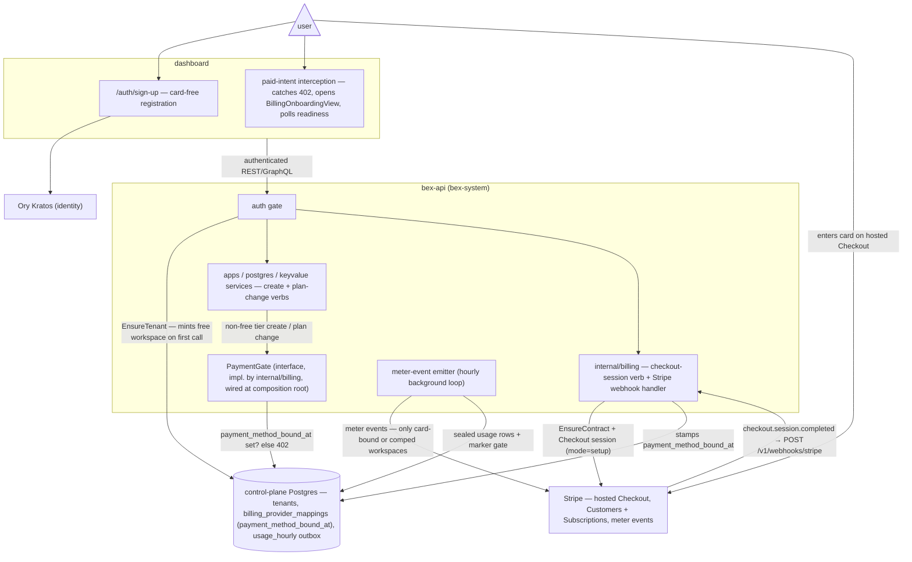

# ADR046 — Payment-method onboarding + paid-tier gating

**Status:** Proposed · 2026-07-31

---

## Context

### Signup today has no billing step — and doesn't need one

Registration is Kratos self-service: the dashboard's `/auth/sign-up` page runs the flow, the only after-registration hook is `session` (`deploy/gitops/base/values/kratos.values.yaml`), and on success the page navigates straight to `/` (`dashboard/src/features/auth/pages/register-page/index.tsx`). The workspace is not even created at signup — it is minted lazily on the first authenticated API call (`EnsureTenant` → `CreateTenantWithMember(PlanHobby)`, `lego/backend/internal/api/tenancy.go`). There is no server-side "registration completed" hook to attach a billing step to, and Render — bex's parity baseline — does not require a card to sign up either.

### "Paid" already has a crisp boundary

Every product family's tier ladder starts at an explicit `free` id, and it is the default (`lego/types/tiers/tiers.yaml`):

| Family | Free tier | Paid tiers |
| --- | --- | --- |
| compute (`spec.tier`) | `free` (default) | `starter` `standard` `pro` `pro-plus` `pro-max` `pro-ultra` |
| postgres (`spec.plan`) | `free` (default, no backup) | `basic-256mb` `basic-1gb` |
| valkey (`spec.plan`) | `free` (default) | `starter` `standard` |

The price sheet (`internal/pricing/pricing.yaml`) rates every free tier at $0, and the Stripe catalog (ADR040, `docs/runbooks/stripe-billing-setup.md`) provisions meters only for the non-free tiers. **Paid intent = any create or plan change that lands on a non-free tier.**

### The card-collection machinery already exists (ADR040)

`internal/billing` already ships the whole Stripe flow, Stripe-best-practice-compliant, on all three surfaces:

- `POST /v1/workspaces/{id}/billing/checkout-session` / `createBillingCheckoutSession` / `create_billing_checkout_session` → Stripe Checkout **`mode=setup`** (save a card, charge nothing; dynamic payment methods preserved — no `payment_method_types`). The verb calls `EnsureContract` first (`internal/billing/sessions.go`), so a fresh Hobby workspace can bind a card in one step.
- `checkout.session.completed` webhook re-verifies the SetupIntent against Stripe and idempotently binds the payment method as the Customer's and Subscription's default. **The signed webhook, not the browser redirect, is the source of truth.**
- `workspaceBillingReadiness` reports `CustomerReady` / `SubscriptionReady` / `PaymentMethodReady` (live from Stripe).
- The dashboard already has `BillingOnboardingView` + `useBillingOnboarding` (mounted on `/usage`).

What is missing is any **enforcement**: nothing today checks payment state on any create or plan-change path. Dunning enforcement (grace → enforcing → enforced) only suspends resources _after_ invoices go unpaid — the first invoice is the first time the platform learns there is no card.

### The uncollectable-invoice hole

Worse, the meter-event emitter auto-provisions a Stripe Customer + Subscription for **any** workspace whose sealed usage ships (`Emitter.ensureBillingSetup`, `internal/billing/emitter.go`). Egress, build seconds, and storage are flat-rated with no free allowance, so an all-free-tier workspace accrues real (tiny) invoices with no payment method on file, then walks the dunning path to suspension. Every drive-by signup also becomes Stripe Customer sprawl.

---

## Decision

### 1. Signup stays card-free

No Kratos hook, no forced onboarding interstitial, no change to registration or lazy workspace creation. This matches Render (free tier requires no payment information) and protects signup conversion. **The card is collected just-in-time, at the moment of first paid intent.**

### 2. The gate: paid intent requires a bound payment method

A workspace must have a payment method on file before any verb may set a non-free tier:

- service create / plan update (`spec.tier`), including Blueprint deploys that declare a paid plan,
- Postgres create / plan update (`spec.plan`),
- Key Value create / plan update (`spec.plan`).

Free-tier creates, and every other verb, are untouched. Exempt: `tenants.billing_excluded` (Mode A) and `tenants.billing_comped` (Mode B) workspaces.

### 3. Mechanism: local marker, injected checker, env-gated

- **Marker.** The `checkout.session.completed` handler — already the binding source of truth — additionally stamps `billing_provider_mappings.payment_method_bound_at`. The gate check is one local SELECT; no Stripe call ever sits on a create path. `workspaceBillingReadiness` keeps reading Stripe live for the billing UI; the marker is the enforcement snapshot.
- **Checker.** A small `PaymentGate` interface (following the injected-source pattern of `logs.PodLogSource`) implemented by `internal/billing`, wired at the composition root (`internal/api/server.go`). Feature packages (`apps`, `postgres`, `keyvalue`) consume the interface and never import `billing`.
- **Env gate.** New `BEX_REQUIRE_PAYMENT_METHOD=1` enables enforcement; it requires `BEX_STRIPE_SECRET_KEY` (refusing to start otherwise — requiring a card nobody can add would brick creates). Unset ⇒ byte-identical current behavior, so local/dev clusters and Stripe-less installs are unaffected.

### 4. Error shape — three-surface parity

- **REST:** `402 Payment Required` in Render's error dialect (`{"message": …}`), naming the checkout verb. Before implementation, capture Render's actual response for a card-less paid create into `docs/render-artifacts/` and match it.
- **GraphQL:** error with `extensions.code = PAYMENT_REQUIRED` and the same message.
- **MCP:** tool error instructing the agent to call `create_billing_checkout_session` and hand the URL to the human.

### 5. Onboarding UX — interception, not a wall

The dashboard intercepts the paid intent in place: plan pickers and create flows check `workspaceBillingReadiness` (or catch the 402) and open the existing `BillingOnboardingView` flow — Checkout in a new tab, poll readiness until `PaymentMethodReady` flips (webhook latency means the success redirect alone is not proof), then resume the interrupted action. No new billing UI is built; the `/usage` mounting stays.

### 6. Stop shipping meter events for card-less workspaces

`Emitter` gains the same gate: a workspace's sealed rows ship only once it is payment-bound, comped, or excluded-from-skip (Mode A rows are already filtered before this point; Mode B comped workspaces keep shipping — their coupon zeroes the invoice). Consequences:

- No Stripe Customer/Subscription is auto-created for drive-by free workspaces; Customer creation moves to first paid intent (checkout) or comping.
- Sealed rows stay durably in the outbox; when a card later binds, up to the 34-day `BackfillHorizon` back-bills, and older card-less history falls off the floor — an explicit, bounded write-off of pennies of free-tier egress/build/storage.
- Free-tier resource abuse is bounded by quotas (ADR043 `ResourceQuota`, `BEX_MAX_*`), not by billing.

### 7. Card lifecycle drift is dunning's job

A card detached or expired after binding leaves the marker stale-true. That is acceptable: the gate's job is to stop _known-cardless_ workspaces from going paid; an actual failed charge lands in the existing dunning lifecycle, which already suspends reversibly. Clearing the marker on `payment_method.detached` / `customer.updated` webhooks is a hardening follow-up, not a correctness requirement.

---

## Architecture

Registration touches only Kratos (no card); paid intent hits `PaymentGate`'s local marker check in the service layer; the marker is stamped exclusively by the `checkout.session.completed` webhook after a setup-mode Checkout; and the emitter consults the same marker before any meter event leaves for Stripe.

---

## Consequences

- **Backend:** one migration (`payment_method_bound_at` on `billing_provider_mappings`); webhook handler stamps it; `PaymentGate` interface + wiring; gate checks in `apps` / `postgres` / `keyvalue` create and plan-change verbs (including the Blueprint path); emitter condition; `BEX_REQUIRE_PAYMENT_METHOD` startup validation.
- **Dashboard:** paid-intent interception reusing `BillingOnboardingView`; readiness polling after checkout return.
- **Docs:** CLAUDE.md env-table row; `docs/ADR018-render-parity.md` row for the 402 behavior; a `docs/render-artifacts/` capture of Render's own card-less paid-create response.
- **Tests:** gate allows free / blocks paid / exempts Mode A+B; webhook stamps the marker; emitter withholds card-less rows and back-bills after binding; `TestAuthzGuardsEveryVerb`-style sweep that every paid-intent verb consults the gate.
- **Unchanged / non-goals:** registration flow, lazy tenant creation, dunning state machine, `estimatedCost` (ADR030), free-tier _allowance pools_ for egress/build (Render's 100 GB / 500 min free-tier quotas enforced by throttling — a separate follow-up if free-tier egress abuse materializes).

---

## Alternatives considered

**Mandatory card at signup.** Rejected: diverges from Render (free tier is card-less), taxes signup conversion, and bex's lazy workspace creation means there is no natural server-side signup hook anyway — enforcement would have degenerated into a dashboard-only wall.

**Frontend-only gating.** Rejected: bex has five surfaces (REST, GraphQL, MCP, CLI, dashboard); anything not enforced in the service layer is bypassed by an API key in one curl.

**Kratos after-registration webhook.** Rejected: the tenant does not exist yet at registration time, and card entry requires a browser Checkout round-trip a server-side hook cannot perform. It would only add a Kratos→bex-api deployment dependency.

**Live Stripe readiness check in the gate.** Rejected: puts Stripe latency and availability on every paid create. The webhook-stamped local marker is already the binding source of truth; enforcement reads it locally.

**Gating on a workspace plan upgrade (`tenants.plan`).** Rejected: bex's billing is usage-based per resource tier (ADR040); `tenants.plan` is a caps vehicle (`PlanLimits`), not a billing vehicle. Gating per-resource paid tiers matches where money actually starts accruing — and matches Render, which prompts for a card at paid instance-type selection.

**Keep shipping card-less usage and let dunning handle it (status quo for §6).** Rejected: suspending a free-tier workspace over uncollectable cents of egress is hostile, and auto-creating a Stripe Customer per drive-by signup is operational sprawl with no upside.
