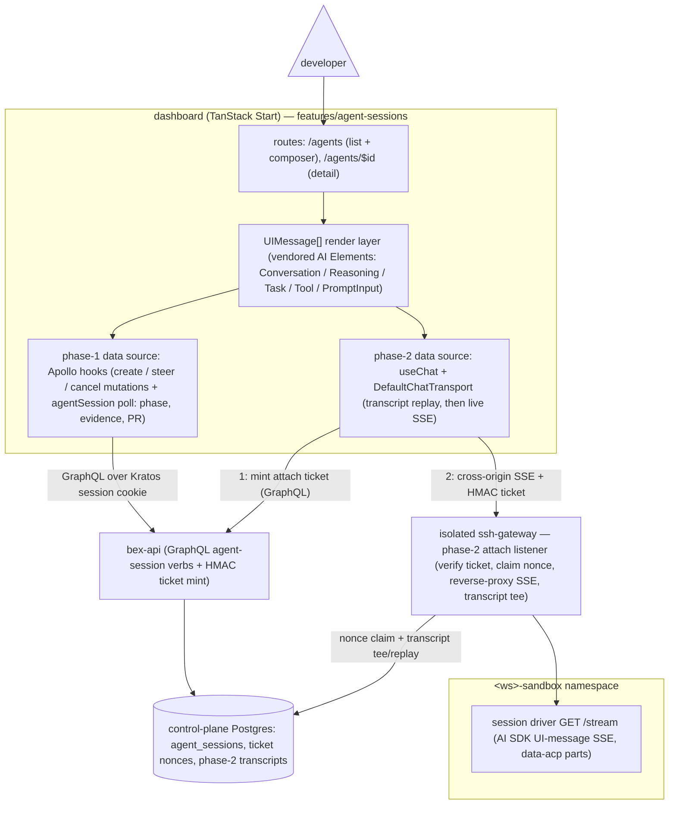

# ADR047 — Managed cloud coding-agent sessions

**Status:** Accepted; D3 agent-session control-plane API shipped in w3/m39 (2026-08-01). **D4 delivery (draft PR + evidence) and D8 phase-1 steering shipped in w3/m41 (2026-08-02):** the sandbox driver commits + pushes the `bex-agent/*` branch and captures bounded evidence; a bex-api background Completer reads the driver status file through the gateway exec boundary, opens a draft PR via the GitHub App, and records head SHA + PR URL + evidence on the session; a steering turn re-dispatches a fresh sandbox on the same branch and updates the same PR. The gateway attach proxy/transcript path (live attach, token metering) remains phase 2. Deep-research and the in-sandbox AI SDK driver amendment were completed 2026-08-01. **D9 dashboard-surface design added 2026-08-02** (frontend deep-research pass + target-API-shape decision the same day; the conversation API materialized as `w3/m43`, the dashboard consumer as `w1/m64` — the earlier interim polling-synthesized-timeline plan was discarded before build). **D9 conversation API implemented in w3/m43 (2026-08-02):** durable transcript store, gateway attach listener (verbatim SSE replay + live splice + tee, driver-direct dial), driver `POST /turn`, `attach-ticket` verb (3-surface), sandbox gateway-ingress policy, and `api.bex.co` edge path-routing — backend/gateway/driver suites + real-Postgres + lint green; the live-substrate E2E leg shares the m41 operator-run gate. Engages the `.pm/DO_NOT_DO.md` "Hosted Claude Code inside sandbox" deferral — this ADR re-opens that item as a phased product. **D9a added 2026-08-07 (w5/m64):** the sessions list moved out of a standalone `<aside>` into `DashboardSidebar` — `/agents` was the only route rendering two side-by-side rails; the one-rail convention and its two branch flavors are recorded in D9a. **D10 added 2026-08-06, split to [ADR051](ADR051-agent-session-transcript.md) on 2026-08-07:** the w3/m43 transcript tee persists only during a **live** attach, so the shipped fire-and-forget product records no transcript and every completed session shows "No conversation yet."; ADR051 specifies the Completer-triggered **headless recorder** that closes this gap (Proposed, unscheduled).

---

## Context

### The product

"Code on the tenant's GitHub repo, in our cloud": the tenant assigns a task (dashboard, IDE, or MCP), bex runs a coding agent in an isolated sandbox with the repo checked out, and the result comes back as a draft PR — the shape of GitHub Copilot cloud agent, OpenAI Codex cloud, Devin, Claude Code on the web, and Cursor cloud agents. This is pillar 5 territory (ADR008): the sandbox substrate exists (ADR042); this ADR is the product layer on top of it.

### What the exemplars verifiably do

An adversarially verified research pass (2026-08-01; 25 sources fetched, 21 claims confirmed, 4 refuted) found the exemplars converge on one architecture. The load-bearing findings, all 3-0 verified against primary docs:

- **Ephemeral sandbox per task, repo preloaded.** Copilot cloud agent runs in "its own ephemeral development environment, powered by GitHub Actions" ([GitHub docs](https://docs.github.com/copilot/concepts/agents/coding-agent/about-coding-agent)); Codex runs each task in an isolated cloud container checked out at the selected branch, where it edits files and runs tests/linters ([OpenAI](https://openai.com/index/introducing-codex/)), with a 12h container-state cache for follow-up turns.
- **Egress default-deny, opt-in internet.** Codex launched with agent-phase internet disabled (setup scripts run _with_ network to install dependencies; the agent phase then runs without), later adding opt-in domain allowlists ([Codex internet-access docs](https://developers.openai.com/codex/cloud/internet-access)). Copilot ships a customizable [agent firewall](https://docs.github.com/en/copilot/how-tos/copilot-on-github/customize-copilot/customize-cloud-agent/customize-the-agent-firewall). Network egress control — not in-sandbox policy — is the primary prompt-injection/exfiltration mitigation.
- **Git-native delivery, in-band steering.** Copilot: exactly one branch and one PR per task, steered by `@copilot` PR comments. Codex: commits inside the sandbox with citations of terminal logs and test outputs as verifiable evidence; the user promotes to a PR. Codex shipped _without_ mid-task steering and had to add it — a steering channel is table stakes.
- **Per-request billing is dead.** GitHub retired premium requests effective 2026-06-01, replacing them with token-passthrough "AI credits" (1 credit = $0.01, metered on input/output/cached tokens at published per-model rates), explicitly because "a quick chat question and a multi-hour autonomous coding session can cost the user the same amount" ([GitHub blog](https://github.blog/news-insights/company-news/github-copilot-is-moving-to-usage-based-billing/)). GitHub now dual-meters agentic features: tokens (AI credits) **plus** compute (Actions minutes) ([pricing docs](https://docs.github.com/en/copilot/reference/copilot-billing/models-and-pricing)). Devin (ACU quota + overage, [billing docs](https://docs.devin.ai/admin/billing)) and Cursor (plan-included usage pool, arrears overage, [pricing](https://cursor.com/pricing)) fit the same subscription-plus-metered pattern. AWS AgentCore Runtime prices the compute leg per-second on actual CPU ($0.0895/vCPU-hr) + peak memory ($0.00945/GB-hr) with idle CPU-free ([pricing](https://aws.amazon.com/bedrock/agentcore/pricing/)).

Research caveats: no claims about the _internal_ architecture of Devin, Claude Code on the web, or Cursor cloud agents survived verification (only their billing did), so the architectural convergence rests on Copilot + Codex evidence. The ACP adopter ecosystem (below) was fetched but not adversarially verified. Claude Code resale/ToS constraints produced no surviving claims and remain an open question.

### ACP as the interface

The [Agent Client Protocol](https://agentclientprotocol.com/protocol/overview) (Zed-originated) is JSON-RPC 2.0 — request/response methods plus one-way notifications — covering sessions, prompt turns, tool-call streaming, permission requests, file ops, and terminals. Verified transport state ([spec](https://agentclientprotocol.com/protocol/transports)): stdio is the transport agents SHOULD support; a Streamable HTTP transport is a **draft**; custom transports MAY be implemented — so a WebSocket carrying newline-delimited JSON-RPC is architecturally sanctioned but not standardized, and **auth, reconnection, and multi-client attach are left to the implementation**. Session resumption (`session/load`) is an **optional** agent capability: clients MUST check `loadSession` in the `initialize` response and MUST NOT call `session/load` if absent ([session setup](https://agentclientprotocol.com/protocol/session-setup)). Ecosystem signals (Claude Code via ACP in [Zed](https://zed.dev/blog/claude-code-via-acp), Gemini CLI, [OpenHands](https://www.openhands.dev/blog/use-any-coding-agent-in-openhands-with-acp), community bridges like [acp-ws-bridge](https://github.com/ytthuan/acp-ws-bridge)) confirm the bridging pattern is being pursued; verify per-agent maturity before committing to a binary. Notably, an ACP provider for the Vercel AI SDK ([`@mcpc-tech/acp-ai-provider`](https://github.com/mcpc-tech/mcpc/tree/main/packages/acp-ai-provider), listed in the [AI SDK community-provider directory](https://ai-sdk.dev/providers/community-providers/acp)) adapts spawned ACP agents to `LanguageModelV3`/`streamText` — stdio-spawn only, stateful sessions via `persistSession`/`existingSessionId` (→ `session/load`), no token-usage reporting; D3 builds on it.

### What bex already owns

Every exemplar capability decomposes onto shipped primitives:

| Primitive | Where | State |
| --- | --- | --- |
| Sandbox substrate: create/list/get/suspend/resume/terminate, per-workspace `<ws>-sandbox` namespaces, per-workspace OpenSandbox tenant keys | ADR042/ADR043; `lego/backend/internal/sandbox/client.go` | shipped (w3/m32) — **gVisor** (`runsc`/systrap) on the tainted `bex.co/sandbox` pool; Kata remains a future candidate pending KVM nodes (ADR042's "Kata/microVM" reads aspirationally) |
| Exec brokering: bex-api authorizes + HMAC-signs, gateway alone holds `pods/exec` | one-shot SSE: `internal/sandboxexec/ticket.go`, `internal/sshgateway/sandboxsse` (w3/m33); long-lived WebSocket + DB-backed nonces: web shell (w2/m55, ADR035) | shipped — the web-shell path is the precedent for long-lived agent sessions |
| GitHub App: installation tokens (1h TTL, `contents:read` + `metadata:read`) minted per deploy, managed clone Secrets, push webhook | ADR026; `internal/github/client.go`, `internal/deploys/service.go` | shipped (w2/m8–m9) |
| Agent-client auth: OAuth 2.1 + DCR + PKCE at Hydra, per-verb OpenFGA checks | ADR012 §7, ADR025 | shipped (w4/m9) |
| Metering → billing: `usage_hourly` per-meter cursors → sealed-row outbox → Stripe meter events, paid-intent gate | ADR023/ADR040/ADR046 | shipped — **sandboxes are the one resource not yet metered** |

Known substrate defect: **suspend is currently broken in production** — OpenSandbox's snapshot-commit Job mounts `hostPath`, forbidden under the tenant-namespace PSS baseline; the fix (run the Job outside the tenant namespace) is upstream work (ADR042 D5 notes). Memory snapshots (CRIU) remain a watch item; snapshots are rootfs-only.

---

## Decision

### Session architecture

### D1 — Sandbox-per-session on the existing substrate

One OpenSandbox sandbox per agent session in the workspace's `<ws>-sandbox` namespace, from an agent template image (agent binary + ACP shim + git + language toolchains), created through the existing lifecycle client with the same reserved-metadata stamping (`bex.co/owner`, `bex.co/workspace`, `app.bex.co/regime=sandbox`). Setup phase (clone + dependency install, network open per D5) is separated from the agent phase, Codex-style. Idle sessions hibernate via rootfs snapshot; resume restores the rootfs and restarts the agent process (see D3 for conversation state). No new substrate: kubernetes-sigs/agent-sandbox and similar were considered and rejected — they would rebuild w3/m32 for no capability gain.

### D2 — Repo access: gateway-held installation token, smart-HTTP branch confinement

- bex-api mints a **per-session** GitHub App installation token from the existing ADR026 integration, scoped to the target repo, `contents:write` added (sessions must push).
- The token never enters the sandbox. Git speaks smart HTTP to the isolated gateway; after direct source-Pod verification, the gateway refreshes the token through bex-api and injects it only on its fixed TLS hop to `github.com/<bound-repo>`. The sandbox image contains no credential helper or cache.
- **Branch confinement is server-side and protocol-enforced**: the gateway parses every receive-pack command and rejects the request unless every updated ref is exactly the session's bound `refs/heads/bex-agent/*` branch. Legal leading `shallow <oid>` declarations are validated, bounded, and forwarded without being mistaken for ref commands; declarations after the command list, malformed object ids, deletions, and every other ref still fail closed. Tenant branch protection remains defense in depth, not the primary boundary.
- **Snapshot hygiene**: credentials (and the OpenSandbox tenant key) are scrubbed before any rootfs snapshot; a resumed sandbox re-fetches through the helper.

Implementation contract (security amendment): OpenSandbox metadata carries only the session id plus SHA-256 label digests of repository and branch. The non-secret proxy URL encodes those exact values; the gateway resolves the direct source IP to one Pod in the claimed `<ws>-sandbox` namespace and verifies every digest before its HMAC-authenticated bex-api mint. bex-api checks current lifecycle and repository ownership before minting one-repository `contents:write`. The gateway retains the token, fixes upstream host/repo, rejects redirects, and parses receive-pack for the exact branch. GitHub tokens do not encode branch scope, so smart-HTTP enforcement closes the gap left by token narrowing alone.

The OpenSandbox tenant API key is platform-side and is never injected into an agent sandbox. `/usr/local/bin/bex-pre-snapshot` still removes its enumerated emergency location along with Git credential files/cache state before a rootfs snapshot and fails closed if any location survives. Resume needs no restored secret: the next Git operation invokes the helper and re-mints.

### D3 — ACP is the agent interface; a sandbox-internal AI SDK driver fronts it

- The agent runs as an **ACP server over stdio** inside the sandbox (the SHOULD-support transport every candidate binary already speaks). It is spawned and owned by a small Node **session driver** using the official ACP SDK directly; plans, tool calls, diffs, terminals, and messages are mapped into the durable AI SDK UI-message stream without a lossy language-model wrapper. The image pins and build-verifies every public profile executable — `claude-code-acp`, `codex-acp`, and `gemini --acp` — and the driver starts each in its own process group so cancel/timeout kills adapter descendants as well. The reviewed profile also owns provider bootstrap: Codex is bound through ACP `providers/set` to the exact session model proxy before `session/new`, and its typed session-failure extension converts a terminal provider/transport record into a failed turn even though the adapter wraps that record in `stopReason=end_turn`. The boundary remains **stdio-spawn only** (no remote transport), which is precisely why the driver lives inside the sandbox rather than on any server. Agent pluggability (D7) collapses to a reviewed `command`/`args`/bootstrap-env profile.
- The driver exposes two local listeners, and the sandbox's NetworkPolicy admits ingress **only from the gateway**:
  1. **AI SDK UI-message stream (SSE)** — consumed by the dashboard's `useChat`/AI Elements. The driver maps ACP session updates directly into typed AI SDK parts (including **`data-acp-*`** plans, diffs, and terminals) before publishing them through one sanitized stream (`lego/agent-image/driver/src/session.ts`), and the browser renders those parts with session UI components.
  2. **No raw ACP launcher.** Native clients use the authorized conversation transport; same-Pod code cannot directly spawn the model-key-bearing adapter.
- bex-api exposes `POST /v1/agent-sessions` (+ GraphQL/MCP twins): authorize `can_operate` via OpenFGA, create/resume the sandbox, mint an **HMAC session ticket** on the web-shell pattern (`BEX_SHELL_TICKET_SECRET` design: DB-backed single-use nonce for long-lived streams, short expiry, claims bind subject + sandbox pod + workspace), and hand the client the gateway origin. Shipped in w3/m39: the durable `agent_sessions` row, first-class `agent_session → workspace` OpenFGA tuple, create/resume/list/get/cancel adapters, reserved sandbox metadata, and ticket mint. `BEX_AGENT_SESSION_GATEWAY_URL` supplies the returned origin; the phase-2 gateway consumes the ticket and claims its nonce through the existing shared `shell_ticket_nonces` store.
- The **isolated ssh-gateway** grows a third listener that verifies the ticket, claims the nonce, and **proxies both streams** to the driver — the same reverse-proxy shape as the existing sandbox-exec SSE path, replacing the previously planned bespoke WebSocket⇄JSON-RPC bridge for the dashboard. bex-api never touches the sandbox network path, and the gateway remains the sole session ingress and sole holder of `pods/exec` (lifecycle/debug) — unchanged trust design (ADR035).
- The gateway **tees the session stream into a transcript** in the control-plane DB. Reattach and multi-surface attach (dashboard + IDE on one session) replay the transcript, then resume live. Agent-side conversation resume after hibernation maps to the provider's `existingSessionId` → ACP `session/load`, used **only when the agent advertises `loadSession`** (the agent's own on-disk session state survives in the rootfs snapshot); transcript replay is the universal fallback. Reconnection and multi-client-attach semantics are bex-defined (the spec leaves them open).
- Accepted trade-offs of the driver: the browser-facing wire protocol is the AI SDK UI-message stream, not ACP itself; the provider reports **zero token usage** (ACP does not carry it), so token metering cannot come from this path; ACP permission requests surface no client callback — the agent runs auto-approve inside the sandbox; and the provider is young (v0.2.x, AI SDK v6, dynamic `acpTools()` marked experimental), so it remains exactly pinned and vendor-tested. Live `POST /turn` requires a gateway-signed Ed25519 grant bound to session + action + expiry + single-use nonce. Only the public verification key enters the sandbox.

**The UI-message stream is the end-to-end session API (verbatim-forward guarantee).** The reason `acp-ai-provider` + the AI SDK sit inside the sandbox at all is so that the tenant-facing streaming API of an agent session **is** the standard [AI SDK UI-message stream](https://ai-sdk.dev/docs/ai-sdk-ui/stream-protocol) (`v1`) — the format the frontend Vercel AI SDK (`useChat`) consumes natively, with zero client-side adaptation. This is already true at the source: the shipped driver emits `streamText → toUIMessageStream()` plus the `data-acp` mapping, and serves it in-sandbox at `GET /stream` with `content-type: text/event-stream` **and the protocol marker `x-vercel-ai-ui-message-stream: v1`** (`lego/agent-image/driver/src/server.mjs`). The following invariants bind every hop between that endpoint and the browser (i.e. the gateway attach listener, `w3/m43`):

1. **Byte-transparent forwarding.** The gateway reverse-proxies the stream verbatim — it MUST NOT re-encode, filter, reorder, translate, or inject stream parts, and MUST preserve the `x-vercel-ai-ui-message-stream: v1` header end to end (exposing it cross-origin via `Access-Control-Expose-Headers`, with the dashboard origin CORS-allowlisted). "No protocol bridging" is a contract, not a convenience: any transformation would silently fork the wire format away from what `useChat` validates.
2. **Transport-level additions only.** The gateway may add exactly three things, none of which alter stream bytes: (a) **authentication** — the D3 HMAC ticket (90s TTL, DB-backed single-use nonce, claims binding subject + session + exact sandbox pod + workspace namespace), carried in a header, never the URL (web-shell precedent); (b) the **transcript tee** — a read-only copy into the control-plane store; (c) **replay-then-live splicing** — on (re)attach, previously teed parts are replayed first and the live tail spliced after, so the client sees one continuous `v1` stream (`useChat`'s `messages`-seed + `resumeStream` consume this directly).
3. **Single safe path.** The sandbox NetworkPolicy admits ingress only from the gateway; the gateway is the sole session ingress and bex-api never joins the stream path (unchanged ADR035 trust design). TLS terminates at the platform edge onto the gateway exactly as for the web shell. Reattach after ticket expiry mints a fresh ticket via the attach verb (gap #8).
4. **Version lockstep.** The driver is pinned to the AI SDK **v6** line by `acp-ai-provider` (`0.2.9` + `ai@6.0.237` today); the dashboard pins the v6-paired client (`@ai-sdk/react@3.x`). The two ends upgrade together — never independently — because later majors add part types older clients don't know, and the `v1` marker alone does not guarantee part-level compatibility across majors.
5. **Additive source timestamps (w4/m87).** Each newly emitted UI-message chunk carries an optional top-level `at` (ISO-8601 UTC, `Date.toISOString()` shape, e.g. `2026-08-19T23:06:00.000Z`) assigned **once** at the driver publication boundary (`lego/agent-image/driver/src/acp-map.ts` + `session.ts` `publish`). The same instant is mirrored at `providerMetadata.bex.at` so AI SDK assembly of text/reasoning/tool parts retains it; a closed text/reasoning block also carries `endAt`. The gateway, durable transcript store (`text`, not jsonb), live attach, and replay forward the field byte-transparently — no database column and no gateway rewrite. Consumers that do not understand `at` ignore it; legacy and mixed transcripts without a valid `at` keep the duration-less `Worked`/`Thought` fallback rather than inventing time.

Net effect: any AI SDK client — the bex dashboard's `useChat`, or a tenant's own AI SDK app pointed at the attach endpoint with a valid ticket — can consume an agent session as a standard streaming chat API.

#### D3 recovery amendment — one cleanup verdict and bounded terminal convergence (w5/m72, 2026-08-17)

The production incident for `ags-da1prbt040bc73aj5230` exposed four independent seams that could combine into one permanently live-looking session: the deployed gateway role missed the new `agent_session_turns` grant; a legitimate 1.57 GiB repository exceeded the driver's aggregate 1 GiB scan counter; the catch path repeated that same failing scrub and exited the driver; and OpenSandbox left a Failed child Pod represented by a Pending BatchSandbox. The lifecycle contract is amended as follows:

- **The release owns installed grants.** After bex-api migrations, `deploy.yml` applies the release's exact `dbrole.sql` grant surface without rotating the gateway credential, then rolls the gateway. Gateway startup checks every required schema/table privilege before opening listeners. A migration/grant mismatch is therefore a rollout failure, not a user's first broken replay.
- **Persisted cleanup is bounded by work, not repository size.** Writable roots are deduplicated by inode and scanned with file/entry-count, recursion-depth, deadline, abort, fixed-chunk memory, and an optional explicit byte budget. Large ordinary files are streamed. A `.git` directory's metadata is scrubbed as ordinary writable state, while `git cat-file --batch-all-objects --unordered --batch` streams every reachable and unreachable object in decompressed form. A credential in an immutable Git object or oversized file fails delivery closed; unrelated aggregate bytes do not.
- **One turn owns one cleanup verdict.** The ACP child is stopped idempotently before scrub/delivery. A failed scrub is attempted once, recorded as the readable terminal reason, prevents push/delivery, and forgets the in-memory credential in `finally`; the top-level process does not invoke the same failing cleanup again. The minimal status/stream server remains available until control-plane acknowledgement when the process can remain alive.
- **Terminal state has two independent signals.** The carried OpenSandbox controller patch projects Failed/Succeeded/non-zero-terminated Pods into `BatchSandbox.status.phase=Failed`, a `PodFailed` condition, bounded exit/signal detail, and `taskFailed`. Independently, the gateway checks the exact Pod/container before attach and classifies a failed exec against fresh Pod state, then emits the stable internal `sandbox_terminated` code; bex-api maps it to terminal-not-found. The Completer writes the active→terminal transition with a database compare-and-set, immediately reclaims a known-dead sandbox, and caps a continuous ambiguous status-read failure at two minutes. Metrics use only the bounded `outcome`/`reason` labels—never tenant, session, sandbox, repo, or raw error text.

All product adapters continue to read the same durable session row and turn/transcript tables. REST, GraphQL, and MCP therefore expose the same terminal `phase`/`failureReason`/turn completeness, while gateway replay and the dashboard can still render retained user turns and assistant parts after the Pod disappears.

### D4 — Delivery: draft PR + evidence

A session ends (or checkpoints) by pushing its `bex-agent/*` branch with the session token and opening a **draft PR** via the GitHub App from bex-api. The session record attaches Codex-style verifiable evidence — command log, test output tails — sourced from the transcript. Steering channels: new ACP prompt turns on an attached session (phase 2), and a PR-comment loop (webhook → resume session) as a follow-on.

**Revised by w5/m65 (2026-08-09) — the evidence digest is retired as a presentation surface.** Delivery is unchanged: the driver pushes the `bex-agent/*` branch and the Completer opens a draft PR on every pushed successful turn. What changed is the PR body — now session metadata only (session id, branch, head, API link) — and that neither the dashboard nor the mobile app renders the evidence at all. The digest was a phase-1 artifact from when a completed session had no conversation record; [ADR051](ADR051-agent-session-transcript.md)'s durable transcript now carries the real narrative, making the digest a lossy duplicate — and a misleading one, since the driver's extractor classifies any tool output as "test output" (a `grep` reporting "No matches found" rendered under a Test-output heading). The `evidence` **wire field is retained** on REST/GraphQL for API consumers and is still populated; only its renderers were removed.

**Shipped completion mechanism (w3/m41).** Delivery is deterministic and enforced outside the agent (the Copilot model): after the headless turn, the **sandbox driver** stages the working tree, commits, pushes the `bex-agent/*` branch through the m38 credential helper, and writes the head SHA + a bounded evidence extract into its machine-readable status file. A **bex-api background Completer** polls each running session's status file through the existing gateway sandbox-exec boundary (a trusted system seam — no per-tick tenant authorization, since it acts only on durable sessions the platform owns; bex-api still never holds `pods/exec`), and on a pushed successful turn opens (or idempotently reuses) the **draft PR** via the GitHub App, records `headSha`/`prUrl`/`prNumber`/`evidence` on the session, and tears the sandbox down. A failed turn, a lost sandbox, or a failed PR-open becomes a `failed` session with a named reason — never a hang. **Phase-1 steering** (D8) re-dispatches a fresh sandbox on the same branch with the new prompt (a new prompt cannot ride the original sandbox until live attach exists); the Completer then updates the same draft PR, and `turns` + `deliveryMode` record the multi-turn history. Live E2E is proven by `scripts/agent-session-verify.sh`.

**Idempotent Git publication amendment (2026-08-18).** The `ags-da2daqui706c739sqvtg` production failure exposed that a Git process exit code is not the publication verdict: an already-current session ref or a lost successful HTTP response can make the final `git push` report an RPC error/`Everything up-to-date` even though the exact candidate is already published. After scanning the immutable candidate, the driver now reads the remote session ref immediately before push and applies this state machine: remote equals candidate ⇒ idempotent success; remote equals the setup baseline ⇒ push the exact candidate with the captured force-with-lease; remote equals anything else ⇒ fail as a concurrent update. If the push command itself errors, one fresh remote read may convert it to success **only** when the ref equals the exact scanned candidate; the final equality check remains mandatory. A newly accepted or successfully dispatched retry clears the previous turn's `failureReason`, so an active/successful retry cannot continue displaying the stale terminal error. Tests cover exact-candidate replay, conflicting remote updates, and legal shallow receive-pack metadata.

### D5 — Egress: default-deny with per-session opt-in

The `<ws>-sandbox` default-deny NetworkPolicy stays. Baseline allowlist for the agent phase: GitHub (clone/push via the helper) and the model API endpoint only; setup phase may open package registries. Tenants may widen per session with an explicit allowlist (Codex pattern). When a metering LLM proxy exists (D6 phase 2), the model-API allowlist narrows to the proxy — one mechanism then provides token metering **and** the exfiltration choke point.

Wave-1 implementation (w3/m40): `internal/sessionegress` creates one namespaced `CiliumNetworkPolicy` keyed by the immutable `bex.co/agent-session` Pod identity before OpenSandbox creates the Pod. Setup admits the fixed package registry catalog (`BEX_AGENT_SETUP_REGISTRIES` can replace the defaults), GitHub, the HTTPS model endpoint derived from that session's selected agent/provider config, the identity-authenticated gateway credential hop, and validated exact tenant hostnames. The one-way transition updates that same policy to remove package registries; the allowlist hash must remain unchanged. The clusterwide `sandbox-egress-default-deny` contains only structural node, API, metadata, and private/rebinding denies, while its former positive rules moved to a legacy policy that explicitly excludes agent-session Pods. Thus policy creation, transition, and deletion never remove the underlying deny. API-server admission confines bex-api's dynamic Cilium authority to canonical `<ws>-sandbox` namespaces and rejects CIDR/entity, wildcard, broad-selector, and non-TLS public rules. Tenant entries are exact public DNS names only; invalid, duplicate, private, wildcard, URL-shaped, or excessive entries return the named `AGENT_SESSION_EGRESS_ALLOWLIST_INVALID` 400.

The D6 phase-2 proxy is a required narrowing, not an optional alternative: once it exists, the session agent/provider resolver must return only that proxy endpoint and direct vendor model endpoints must disappear from newly rendered policies. The proxy then owns vendor selection and token metering behind the single egress choke point.

### D6 — Billing: two meters, quota + overage — explicitly no per-request meter

Two new ADR023 meter kinds through the existing sealed-outbox → Stripe pipeline, gated by ADR046's `PaymentGate`:

1. `sandbox_compute_seconds` — per-second sandbox lifecycle compute (vCPU/GB-weighted, AgentCore-style; hibernated sessions do not accrue). Needed regardless: sandboxes are currently unmetered.
2. `agent_token_units` — model-token passthrough at per-model rates (AI-credits-style), phase 2, sourced from agent usage reporting or the metering proxy.

Packaging: plan-included agent quota + metered overage (Devin/Cursor pattern) via Stripe metered Subscriptions with included quantities. **Per-request/premium-request billing is rejected** — the exemplar that invented it retired it because autonomous sessions break the unit economics.

### D7 — Agent binary: BYO-API-key first, binary pluggable

v1 is **bring-your-own-API-key**: the tenant supplies their model credential (stored in OpenBao per ADR013, injected at session start, scrubbed per D2). This sidesteps the unresolved Claude Code resale/ToS question, matches bex's open-source positioning, and reduces v1 billing to the compute leg. The template image treats the agent as pluggable; selection criteria are verified ACP maturity and `loadSession` support (candidates: Claude Code via its ACP adapter, Gemini CLI, OpenHands, opencode). Bundled-token billing and a default bundled agent are revisited once the metering proxy exists and the ToS question is answered.

### D8 — Phasing

- **Phase 1 — fire-and-forget** (Copilot shape, no interactive attach): `POST /v1/agent-sessions` → the same D3 session driver runs the task headless (one `streamText` turn, no client stream) → draft PR + evidence. Needs only D1/D2/D4/D5 + the compute meter. Steering = new prompt turns that re-dispatch the sandbox on the same branch. **Shipped in w3/m41** (delivery, evidence, steering, live E2E; the compute meter is D6/w7 follow-on).
- **Phase 2 — live attach**: the gateway session proxy + transcript tee/replay, dashboard session UI on `useChat`/AI Elements (integration, not protocol work), token metering via the LLM proxy.
- **Phase 2+ — native IDE attach**: use the same authorized conversation/session transport; no separate raw launcher exists inside the credential-bearing Pod.

This ordering ships tenant value while the ACP network-transport draft and adopter ecosystem mature, and keeps phase 2 purely additive on the same session model.

### D9 — Dashboard session surface: one render layer, two swappable data sources

The dashboard surface (formerly held note `.pm/w5/035.md`, materialized as `w1/m64`; deep-research pass 2026-08-02) is the Devin-shaped session UI: a sessions list + new-session composer, a session detail page with an activity timeline, a draft-PR/evidence card, and a steering composer. Its architecture is chosen so the phase-1 (fire-and-forget) and phase-2 (live attach) products share **one rendering layer** and differ only in data source:

- **Two data planes, one page.** Control-plane metadata (session list, `phase`, PR card, evidence, `failureReason`) stays on the house GraphQL data layer — `dashboard/src/features/agent-sessions/` (NOT `sessions/` — that name is taken by Kratos login-session auth artifacts), flat routes `agents.tsx` + `agents.$agentSessionId.tsx`, typed hooks with `cache-first` + 30s poll tightened to ~5s while `phase` is non-terminal, mutations `no-cache` with typed domain errors and inline `AGENT_SESSION_*` mapping. The **conversation column** runs on `useChat` over the target-shape stream endpoint and nothing else: the stream's replay mode is the single history source for terminal and running sessions alike. _(Superseded 2026-08-02, before build: an earlier plan had the dashboard synthesize a `UIMessage[]` timeline from polled data plus localStorage-persisted prompts as a pre-gateway interim — discarded with the target-API-shape decision so the interim never ships; `w1/m64` builds directly on the `w3/m43` contract, with vendored AI Elements — hook-agnostic, React 19 + Tailwind 4, both already the dashboard's stack — rendering the parts either way.)_
- **Transport.** `useChat` + a transport pointed at the same-origin stream path (`api.bex.co/v1/agent-sessions/{id}/stream` — no CORS, no second origin in dashboard config): ticket rides a header, never a URL; `prepareReconnectToStreamRequest` re-mints via the `attach-ticket` verb per reconnect (the 90s TTL makes per-connect mint mandatory); `dataPartSchemas` validate the driver's `data-acp` parts, rendered as collapsible Reasoning/Task/Tool/Terminal groups (the Devin "Worked/Thought for Xs" shape). Steering routes by state: live session ⇒ chat `POST` (`sendMessage`); idle ⇒ the redispatch verbs. Client disconnect ≠ cancel — Cancel stays an explicit verb. Degraded states are honest per the house 503 pattern: stream endpoint unconfigured/unavailable ⇒ the conversation column says so while the metadata views keep rendering.
- **Version pin.** The in-sandbox driver is held to the AI SDK **v6** line by `@mcpc-tech/acp-ai-provider` (`ai@^6`; no v7 support yet), while `ai@7` is current. The dashboard pins `@ai-sdk/react@3.x` (the v6-paired line) to match the driver's stream, and both sides upgrade together — the UI-message stream protocol (`v1`) is shared, but skew is not tested territory.
- **Backend gaps the frontend exposes** (fold into the phase-2 milestone): a ticket-only **attach verb** for running sessions (today only create/resume/steer mint, so a page reload on a running session cannot reattach); **per-turn history** (`turns` is an integer counter — steering prompts and prior-turn evidence are not stored, so a reloaded phase-1 page loses turn wording); optional +/− diff stats in evidence for the PR card.
- **Exemplar table stakes held to** (verified against Devin/Copilot cloud agent/Codex cloud, 2026-08-02): grouped/collapsible activity rather than a flat log, a diff-first deliverable card with the PR link, a mid-run-capable steering composer, explicit stop/cancel with preserved-work semantics, and status/duration metadata. Devin's Shell/Browser/Editor workspace tabs are differentiators, not table stakes, and are out of scope.

**Target API shape (decided 2026-08-02) — two planes, one public origin.** The session API converges on a control plane and a conversation plane, split by required authority, not by protocol:

| Plane | Served by | Endpoints |
| --- | --- | --- |
| Control (JSON; REST/GraphQL/MCP parity) | bex-api process | `POST /v1/agent-sessions` (create; fast accept, no ticket — w2/m64) · `GET /v1/agent-sessions[/{id}]` (list/get: phase, PR, evidence) · `POST /{id}/cancel` · `POST /{id}/resume` (revive idle session; fast accept, no ticket) · `POST /{id}/attach-ticket` (the sole ticket mint — reconnect + first connect once a sandbox exists) |
| Conversation (Vercel AI SDK UI-message contract) | gateway process | `POST /v1/agent-sessions/{id}/stream` (submit a prompt turn on a live session; verbatim-forwarded to the driver) · `GET /v1/agent-sessions/{id}/stream` (reconnect: transcript replay then live tail; **terminal sessions: replay-only then `[DONE]`**) — ticket-authenticated |

- **Public origin.** Both planes publish under the primary API origin (`api.bex.co/...`): the platform edge routes the `/stream` path to the **gateway process** by path rule. External developers see one API product with one origin and no CORS second origin; which process serves which path is an internal implementation detail (the GitHub pattern: log downloads are `api.github.com` API, bytes come from a blob host). Two recorded caveats: this is a deliberate, documented exception to the "everything on the API origin is served by the bex-api process" audit assumption, and the gateway MUST ignore any cookies arriving on that path — the ticket is the only accepted credential. A neutral dedicated origin remains a fallback if edge path-routing proves operationally troublesome.
- **Absorbed into the chat contract**: live steering (the chat `POST` _is_ the prompt turn — the `steer` verb narrows to idle-session redispatch and is slated for deprecation into `resume` + chat `POST` once live attach ships; the MCP `steer_agent_session` tool survives as a one-shot alias for non-streaming clients); transcript reading (the stream endpoint's replay mode serves reattach **and** terminal-session history — an optional JSON transcript read may be added for MCP/REST parity); the dashboard consumes this contract directly — the once-planned client-side prompt-persistence interim was discarded before build and never ships.
- **Explicitly not absorbed**: `create`/`cancel`/`list`/`get`/`resume` stay JSON control verbs. Creation precedes the driver's existence (authz, sandbox provisioning, egress policy, credential wiring happen before there is anything to forward to); client disconnect ≠ cancel (AI SDK semantics — `stop()` only closes the connection); listing and result metadata (phase, PR, evidence, billing) are control-plane authority written by the Completer; and non-streaming consumers (MCP tools, CLI scripts, CI) need the poll-shaped surface — GitHub's public agent-tasks API is poll-only, validating that shape as a product in itself.
- **Accept fast, provision async (w2/m64, 2026-08-09).** `create`/`steer`/`resume` originally provisioned the sandbox _synchronously_ on the request path (pod schedule + image pull, tens of seconds), so a dashboard submit visibly hung ("每次 chat 都要等半天" — user report). The mutations now do only the cheap, fail-fast work synchronously — authorization, input validation, egress derivation, the BYO model-key read, the durable row, and the OpenFGA parent tuple — return immediately in the `creating`/`redispatching`/`resuming` phase, and run the slow sandbox provisioning in a background goroutine (`context.WithoutCancel` + a hard ceiling). Consequences threaded through all three surfaces identically: (a) the mint verbs **no longer return a ticket** — there is no sandbox to bind claims to yet, so the client mints lazily via `attach-ticket` once a sandbox exists (the dashboard already did this per reconnect); `attach-ticket` on a not-yet-provisioned session returns the named, retryable `AGENT_SESSION_NOT_ATTACHABLE` 409. (b) A provisioning failure surfaces as a `failed` session with a named reason (not a hung request); the dashboard renders it inline with a one-click Retry. (c) A `Cancel` racing an in-flight background dispatch converges without orphaning a sandbox or resurrecting the session — `RecordAgentSessionDispatch` is CAS-guarded (`WHERE phase NOT IN ('canceling','canceled')`) so a dispatch that loses the race tears its just-created sandbox back down, and the failure/resume transitions skip a session a cancel already took terminal. The synchronous conflict guards (`AGENT_SESSION_TURN_IN_FLIGHT`, `AGENT_SESSION_NOT_STEERABLE`) and all input-validation 400s are unchanged.

**Shipped in w3/m43.** The conversation plane is built:

- **Transcript store** (`agent_session_transcripts`, migration 0067): parts stored as **`text`, not `jsonb`** — jsonb canonicalizes (reorders keys, adds whitespace) and would corrupt the verbatim-forward guarantee. `seq` is the driver's emission ordinal (0-based); `PRIMARY KEY (session_id, seq)` + `ON CONFLICT DO NOTHING` makes the tee idempotent across gateway replicas and re-attaches. `ON DELETE CASCADE` with the session; retention prune rides the audit sweep.
- **Gateway attach listener** (`internal/sshgateway/agentattach`, browser-facing `:8083`): verifies the agent-session ticket (reusing `BEX_SHELL_TICKET_SECRET`), single-use-claims its nonce in the shared `shell_ticket_nonces` store, then — on `GET` — replays the durable transcript to the client and splices the live driver stream, teeing new parts; on `POST`, forwards a live prompt turn. The listener resolves the ticket's pod → IP and **dials the in-sandbox driver's stream port directly** (no `pods/exec`; the sandbox NetworkPolicy admits only this one gateway ingress). Byte-transparent: it preserves the `data:` payloads and the `x-vercel-ai-ui-message-stream: v1` header, and ignores cookies. During a live GET/POST it emits a serialized SSE comment heartbeat every 15 seconds; the comment is transport-only (never persisted) and keeps the edge from closing a healthy stream while a tool or credential scrub is silent for minutes, so the eventual `[DONE]` remains observable. A gone pod (terminal session) yields transcript replay + `[DONE]`. **CORS:** although the endpoint lives on the api origin, the dashboard calls it cross-subdomain (`dashboard.bex.co → api.bex.co`), so the handler answers the OPTIONS preflight and echoes the matched Origin + `Access-Control-Expose-Headers: x-vercel-ai-ui-message-stream` (reusing `BEX_API_CORS_ORIGIN`) — without it the browser blocks the stream even though `curl` works. _(This gap was caught by a live prod probe, 2026-08-02, not by the unit tests, and fixed in place.)_
- **Driver live turn** (`POST /turn`, `lego/agent-image/driver`): runs another turn on the persistent session with the UI-message stream kept open, single-flighted (concurrent `POST` → 409), mirroring parts to both the hub (attached `GET` clients) and the `POST` response.
- **Steer decision (recorded):** live steering is the chat `POST` to the stream; the `steer` verb keeps the idle/terminal **redispatch** path and returns a **documented 409** (`AGENT_SESSION_TURN_IN_FLIGHT`) on a running session — no silent absorption. The MCP `steer_agent_session` tool stays a one-shot alias.
- **`attach-ticket` verb** is three-surface (REST `POST /{id}/attach-ticket`, GraphQL `attachAgentSession`, MCP `attach_agent_session`) — the Render-parity twin of the other mint verbs. The **stream endpoint itself is intentionally REST-only**: a raw byte stream is not a GraphQL/MCP shape, so those surfaces expose the ticket (to attach) rather than duplicating the stream.
- **Sandbox ingress:** the gateway→driver dial (bex-system → `<ws>-sandbox` :8787) is granted by the cluster-wide Cilium policy `sandbox-agent-driver-ingress` (deploy/gitops), NOT a per-namespace k8s allow — the ADR045 tenant-namespace admission control confines bex-api to converging default-deny only, so a duplicate k8s policy would be rejected (found live on prod, w3/m43). The k8s layer stays default-deny.
- **Edge routing:** a Traefik `IngressRoute` (`config/ssh/ingressroute-agent-attach.yaml`) path-routes `api.bex.co/v1/agent-sessions/{id}/stream` to the gateway with priority over bex-api's `/` Ingress, reusing the `bex-api-tls` cert.

**w5/m71 persistence amendment (2026-08-17; supersedes the ordinal/live-turn claims above).** An accepted prompt is now a first-class `agent_session_turns` row, inserted before asynchronous dispatch; `turns` counts accepted non-empty user intents, not successful sandbox provisions. The initial task and every Steer therefore survive refresh and provisioning failure. Turn acceptance clears the old durable sandbox binding so an attach cannot mislabel the previous driver's output as the new turn; the prior id travels only in the background teardown input. Legacy migration recovers turn 1 from `agent_config.task` only; previously lost follow-up text is not reconstructed. User intent is capped at 100 KiB per prompt and 8 MiB per session.

Assistant chunks remain text payloads, but their idempotency key is `(session_id, turn, part_index)` because every fresh sandbox restarts its driver ordinal at zero. `seq` is now a store-allocated monotonic session replay cursor, not the driver ordinal. Completion always merges the full current-turn log, so a partial live tee cannot suppress the suffix.

The gateway's durable replay is intentionally a **role adapter**, not wholly byte-transparent: assistant payloads are preserved, while one outer `start`/`finish` and `data-user-prompt` parts derived from durable turns provide the role and turn boundaries the AI SDK response stream does not contain. Completeness/truncation facts accompany each prompt. A raw public live `POST /turn` cannot participate in the transactional turn ledger, so `ActionTurn` ticket mint is disabled with `AGENT_SESSION_LIVE_TURN_UNAVAILABLE`; follow-ups use Steer once the current turn settles. The in-sandbox endpoint may remain as an internal implementation seam but is not public authority.

The live-substrate E2E leg (extending `scripts/agent-session-verify.sh` with attach/replay/turn/reattach) shares the m41 operator-run gate; unit + real-Postgres + driver coverage is green.

#### D9a — Navigation: one rail, and where the sessions list lives (w5/m64, 2026-08-07)

`w1/m64`/`w3/m44`/`w3/m45` shipped the sessions list as a standalone `<aside>` rendered **inside** the page body, on top of the rail `DashboardLayout` already provides — making `/agents` the only route in the dashboard with **two** side-by-side sidebars (user report 2026-08-07). Corrected in `w5/m64` by folding the list into `DashboardSidebar`, per a live Playwright study of Devin the same day (evidence `.playwright-mcp/devin-home.png`, `devin-session.png`, `devin-review.png`, `devin-automations.png`, `devin-wiki.png`, `devin-recent-menu.png`, `devin-collapsed.png`). The convention:

- **One rail, always.** A page never renders a second sidebar landmark. Contextual navigation is a branch **inside** `DashboardSidebar`, never an `<aside>` in a route module. Guarded by `dashboard/src/routes/__tests__/one-rail-invariant.test.ts`; `DashboardLayout`'s `sidebar` override prop was removed so there is only one way to do this.
- **Two branch flavors.** `ProjectSidebar`/`ServiceSidebar` **replace** the nav — deep hierarchical context, entered through a back link. The agent-sessions section **augments** it — a peer working-set list beneath the global nav. Devin uses the augmenting flavor throughout: its rail keeps global nav above a per-section contextual slot. bex keeps both flavors deliberately; the replacing flavor is not a bug to be converted.
- **The contextual list is section-scoped.** Sessions render on `/agents*` only, never on Projects/Services/Settings — mirroring Devin, whose slot carries sessions on session routes, pull requests on `/review`, and nothing on `/automations`/`/wiki`.
- **A second panel goes on the RIGHT.** Devin's session view pairs the chat column with a right-hand workspace panel (Progress/Changes/PR tabs); bex's equivalent was the w3/m44 evidence/PR panel, **removed in w5/m65** (the digest it showed was superseded by the durable transcript), so the session view is chat-only today. The placement rule stands for whatever earns a second panel next — it belongs on the right, not in a second left rail.

Devin affordances **not** ported in w5/m64 because bex had no backend capability behind them were session **folders**, the **Filter** control, and per-row **archive**. ADR065 subsequently shipped filtering and archive. On 2026-08-17, `/agents` was consolidated into one create + history page: the sidebar's now-redundant More/View-all action was removed, and the former `/agents?view=list` URL remains accepted as a compatibility alias for the same view.

### D10 — Phase-1 transcript persistence: the headless recorder → [ADR051](ADR051-agent-session-transcript.md)

The w3/m43 conversation plane persists a transcript only as a side effect of a **live** attach (the gateway tee runs only while a browser is connected), so the shipped **fire-and-forget** product — which runs headless with no client stream and tears the sandbox down on completion — records **nothing**, and every completed session shows "No conversation yet." (found in prod 2026-08-06). The fix is a **Completer-triggered server-side recorder** that tees the driver's still-live full-history replay into `agent_session_transcripts` before teardown, reusing the existing gateway tee (byte-transparent, seq-keyed idempotent, composes with the live tee) and the existing Completer boundary (no new `pods/exec` for bex-api). Because it is a distinct concern spanning three processes, the full decision — mechanism, core-path diagram, alternatives, and trust analysis — lives in its own **[ADR051 — Agent-session conversation transcript persistence](ADR051-agent-session-transcript.md)** (Proposed, unscheduled).

---

## Consequences and gaps to close

1. **Gateway session proxy** (phase 2, materialized as `w3/m43`): a long-lived SSE reverse proxy to the driver — same shape as the existing sandbox-exec SSE path, no protocol bridging for the dashboard, **bound by D3's verbatim-forward guarantee** (byte-transparent, `x-vercel-ai-ui-message-stream: v1` preserved and CORS-exposed, additions limited to auth/tee/replay). Reconnect + multi-client fan-in semantics are still bex-designed. The `@mcpc-tech/acp-ai-provider` dependency is young (v0.2.x), so pin it. A raw ACP listener is deliberately absent: it would bypass the signed, action-bound driver grant.
2. **Sandbox suspend is broken under PSS** (hostPath commit Job) — upstream OpenSandbox fix required; hibernation economics (D6) depend on it.
3. **Sandbox metering does not exist** — new meter kind + emitter codepath + `pricing.yaml` + Stripe catalog entry (`scripts/stripe-billing-setup.py`).
4. ~~**Credential-helper refresh path**~~ — replaced by the Pod-bound gateway Git smart-HTTP proxy; its internal bex-api mint hop is audit-logged and the raw token never crosses into the sandbox.
5. ~~**Session transcript store**~~ — **shipped in w3/m43** (`agent_session_transcripts`, migration 0067): durable, verbatim (`text`), ordinal-keyed idempotent tee; serves reattach replay + terminal-session history. **Persistence gap (found in prod 2026-08-06):** the tee's only writers are the live `GET`/`POST` attach paths, so the shipped **fire-and-forget** product — which runs headless with no client attached — persists **nothing**, and every completed session shows "No conversation yet." The fix is the Completer-triggered **headless recorder**, specified in [ADR051](ADR051-agent-session-transcript.md) (Proposed, unscheduled).
6. **OpenFGA modeling for agent sessions** — sandbox authz is code-level today; sessions should get first-class tuples.
7. **CRIU memory snapshots** stay a watch item — transcript replay makes them non-blocking.
8. **Frontend-exposed API gaps** (D9, resolved into the target API shape): the `attach-ticket` reconnect mint; the transcript store, whose stream-endpoint replay mode serves both reattach and terminal-session history (per-turn prompt/evidence history — today `turns` is a bare counter); optional diff stats in evidence — schedule with the phase-2 gateway milestone per the D9 target API shape (including the `api.bex.co` edge path-routing and the steer-verb deprecation path).
9. **Open questions carried**: Devin/Claude-web/Cursor internals (memory-snapshot resume), Claude Code resale ToS ([legal page](https://code.claude.com/docs/en/legal-and-compliance) to be verified at build time), the Streamable HTTP draft's trajectory, exemplar branch-confinement enforcement detail.

## Alternatives considered

- **Per-request ("premium requests") billing** — rejected; retired by its inventor effective 2026-06-01 (four stale premium-request claims were refuted 0-3/1-2 in verification; any source describing multipliers as current is outdated).
- **Bespoke session protocol instead of ACP** — rejected; ACP buys IDE clients (Zed, JetBrains direction) and agent pluggability for the cost of supplying transport semantics bex must build either way.
- **AI SDK driver outside the sandbox** (dashboard SSR spawning or dialing the agent remotely) — rejected; `@mcpc-tech/acp-ai-provider` is stdio-spawn only with no remote transport, and a remote-transport fork would recreate exactly the bespoke bridge the in-sandbox driver avoids.
- **Bespoke WebSocket⇄JSON-RPC gateway bridge / raw ACP launcher** — rejected; it bypasses the action-bound launch grant and is unnecessary for the dashboard conversation transport.
- **kubernetes-sigs/agent-sandbox or E2B-hosted substrate** — rejected; duplicates w3/m32.
- **Bundled model spend at flat ACU-style rates in v1** — deferred, not rejected; requires the metering proxy and margin/ToS clarity first (D7).
- **Replacing the JSON control verbs with the AI-SDK stream endpoint (SSE-only session API)** — rejected (2026-08-02, D9 target-API-shape decision): only in-conversation actions (prompt turns, stream parts, history replay) fold into the chat contract; create/cancel/list/get/resume require control-plane authority the verbatim-forwarded driver path cannot exercise, and non-streaming consumers (MCP tools, CLI scripts, CI) need the poll-shaped JSON surface — GitHub's public agent-tasks API is poll-only. What **was** absorbed: live steering (chat POST) and transcript reading (stream replay mode).
