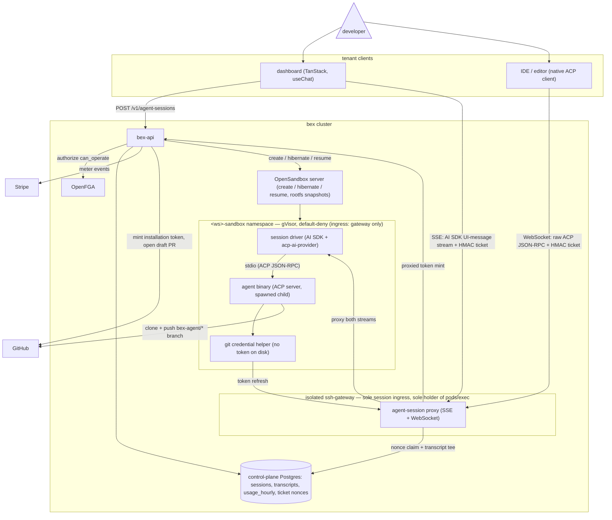

# ADR047 — Managed cloud coding-agent sessions

**Status:** Accepted; D3 agent-session control-plane API shipped in w3/m39 (2026-08-01). The gateway attach proxy/transcript path remains phase 2. Deep-research and the in-sandbox AI SDK driver amendment were completed 2026-08-01. Engages the `.pm/DO_NOT_DO.md` "Hosted Claude Code inside sandbox" deferral — this ADR re-opens that item as a phased product.

---

## Context

### The product

"Code on the tenant's GitHub repo, in our cloud": the tenant assigns a task (dashboard, IDE, or MCP), bex runs a coding agent in an isolated sandbox with the repo checked out, and the result comes back as a draft PR — the shape of GitHub Copilot cloud agent, OpenAI Codex cloud, Devin, Claude Code on the web, and Cursor cloud agents. This is pillar 5 territory (ADR008): the sandbox substrate exists (ADR042); this ADR is the product layer on top of it.

### What the exemplars verifiably do

An adversarially verified research pass (2026-08-01; 25 sources fetched, 21 claims confirmed, 4 refuted) found the exemplars converge on one architecture. The load-bearing findings, all 3-0 verified against primary docs:

- **Ephemeral sandbox per task, repo preloaded.** Copilot cloud agent runs in "its own ephemeral development environment, powered by GitHub Actions" ([GitHub docs](https://docs.github.com/copilot/concepts/agents/coding-agent/about-coding-agent)); Codex runs each task in an isolated cloud container checked out at the selected branch, where it edits files and runs tests/linters ([OpenAI](https://openai.com/index/introducing-codex/)), with a 12h container-state cache for follow-up turns.
- **Egress default-deny, opt-in internet.** Codex launched with agent-phase internet disabled (setup scripts run _with_ network to install dependencies; the agent phase then runs without), later adding opt-in domain allowlists ([Codex internet-access docs](https://developers.openai.com/codex/cloud/internet-access)). Copilot ships a customizable [agent firewall](https://docs.github.com/en/copilot/how-tos/copilot-on-github/customize-copilot/customize-cloud-agent/customize-the-agent-firewall). Network egress control — not in-sandbox policy — is the primary prompt-injection/exfiltration mitigation.
- **Git-native delivery, in-band steering.** Copilot: exactly one branch and one PR per task, steered by `@copilot` PR comments. Codex: commits inside the sandbox with citations of terminal logs and test outputs as verifiable evidence; the user promotes to a PR. Codex shipped _without_ mid-task steering and had to add it — a steering channel is table stakes.
- **Per-request billing is dead.** GitHub retired premium requests effective 2026-06-01, replacing them with token-passthrough "AI credits" (1 credit = $0.01, metered on input/output/cached tokens at published per-model rates), explicitly because "a quick chat question and a multi-hour autonomous coding session can cost the user the same amount" ([GitHub blog](https://github.blog/news-insights/company-news/github-copilot-is-moving-to-usage-based-billing/)). GitHub now dual-meters agentic features: tokens (AI credits) **plus** compute (Actions minutes) ([pricing docs](https://docs.github.com/en/copilot/reference/copilot-billing/models-and-pricing)). Devin (ACU quota + overage, [billing docs](https://docs.devin.ai/admin/billing)) and Cursor (plan-included usage pool, arrears overage, [pricing](https://cursor.com/pricing)) fit the same subscription-plus-metered pattern. AWS AgentCore Runtime prices the compute leg per-second on actual CPU ($0.0895/vCPU-hr) + peak memory ($0.00945/GB-hr) with idle CPU-free ([pricing](https://aws.amazon.com/bedrock/agentcore/pricing/)).

Research caveats: no claims about the _internal_ architecture of Devin, Claude Code on the web, or Cursor cloud agents survived verification (only their billing did), so the architectural convergence rests on Copilot + Codex evidence. The ACP adopter ecosystem (below) was fetched but not adversarially verified. Claude Code resale/ToS constraints produced no surviving claims and remain an open question.

### ACP as the interface

The [Agent Client Protocol](https://agentclientprotocol.com/protocol/overview) (Zed-originated) is JSON-RPC 2.0 — request/response methods plus one-way notifications — covering sessions, prompt turns, tool-call streaming, permission requests, file ops, and terminals. Verified transport state ([spec](https://agentclientprotocol.com/protocol/transports)): stdio is the transport agents SHOULD support; a Streamable HTTP transport is a **draft**; custom transports MAY be implemented — so a WebSocket carrying newline-delimited JSON-RPC is architecturally sanctioned but not standardized, and **auth, reconnection, and multi-client attach are left to the implementation**. Session resumption (`session/load`) is an **optional** agent capability: clients MUST check `loadSession` in the `initialize` response and MUST NOT call `session/load` if absent ([session setup](https://agentclientprotocol.com/protocol/session-setup)). Ecosystem signals (Claude Code via ACP in [Zed](https://zed.dev/blog/claude-code-via-acp), Gemini CLI, [OpenHands](https://www.openhands.dev/blog/use-any-coding-agent-in-openhands-with-acp), community bridges like [acp-ws-bridge](https://github.com/ytthuan/acp-ws-bridge)) confirm the bridging pattern is being pursued; verify per-agent maturity before committing to a binary. Notably, an ACP provider for the Vercel AI SDK ([`@mcpc/acp-ai-provider`](https://github.com/mcpc-tech/mcpc/tree/main/packages/acp-ai-provider), listed in the [AI SDK community-provider directory](https://ai-sdk.dev/providers/community-providers/acp)) adapts spawned ACP agents to `LanguageModelV3`/`streamText` — stdio-spawn only, stateful sessions via `persistSession`/`existingSessionId` (→ `session/load`), no token-usage reporting; D3 builds on it.

### What bex already owns

Every exemplar capability decomposes onto shipped primitives:

| Primitive | Where | State |
| --- | --- | --- |
| Sandbox substrate: create/list/get/suspend/resume/terminate, per-workspace `<ws>-sandbox` namespaces, per-workspace OpenSandbox tenant keys | ADR042/ADR043; `lego/backend/internal/sandbox/client.go` | shipped (w3/m32) — **gVisor** (`runsc`/systrap) on the tainted `bex.co/sandbox` pool; Kata remains a future candidate pending KVM nodes (ADR042's "Kata/microVM" reads aspirationally) |
| Exec brokering: bex-api authorizes + HMAC-signs, gateway alone holds `pods/exec` | one-shot SSE: `internal/sandboxexec/ticket.go`, `internal/sshgateway/sandbox_exec.go` (w3/m33); long-lived WebSocket + DB-backed nonces: web shell (w2/m55, ADR035) | shipped — the web-shell path is the precedent for long-lived agent sessions |
| GitHub App: installation tokens (1h TTL, `contents:read` + `metadata:read`) minted per deploy, managed clone Secrets, push webhook | ADR026; `internal/github/client.go`, `internal/deploys/service.go` | shipped (w2/m8–m9) |
| Agent-client auth: OAuth 2.1 + DCR + PKCE at Hydra, per-verb OpenFGA checks | ADR012 §7, ADR025 | shipped (w4/m9) |
| Metering → billing: `usage_hourly` per-meter cursors → sealed-row outbox → Stripe meter events, paid-intent gate | ADR023/ADR040/ADR046 | shipped — **sandboxes are the one resource not yet metered** |

Known substrate defect: **suspend is currently broken in production** — OpenSandbox's snapshot-commit Job mounts `hostPath`, forbidden under the tenant-namespace PSS baseline; the fix (run the Job outside the tenant namespace) is upstream work (ADR042 D5 notes). Memory snapshots (CRIU) remain a watch item; snapshots are rootfs-only.

---

## Decision

### Session architecture

### D1 — Sandbox-per-session on the existing substrate

One OpenSandbox sandbox per agent session in the workspace's `<ws>-sandbox` namespace, from an agent template image (agent binary + ACP shim + git + language toolchains), created through the existing lifecycle client with the same reserved-metadata stamping (`bex.co/owner`, `bex.co/workspace`, `app.bex.co/regime=sandbox`). Setup phase (clone + dependency install, network open per D5) is separated from the agent phase, Codex-style. Idle sessions hibernate via rootfs snapshot; resume restores the rootfs and restarts the agent process (see D3 for conversation state). No new substrate: kubernetes-sigs/agent-sandbox and similar were considered and rejected — they would rebuild w3/m32 for no capability gain.

### D2 — Repo access: per-session installation token, gateway-refreshed, branch-confined

- bex-api mints a **per-session** GitHub App installation token from the existing ADR026 integration, scoped to the target repo, `contents:write` added (sessions must push).
- The token never lands on disk in the sandbox. A **git credential helper** inside the sandbox fetches it on demand through a gateway internal endpoint, which proxies an authorized re-mint to bex-api — solving the 1h-token-TTL vs multi-hour-session mismatch without giving the sandbox standing credentials. (The operator's deliberate never-refresh stance for build clones does not transfer: builds are minutes, sessions are hours.)
- **Branch confinement is server-side**: bex-api only mints push-capable tokens for `bex-agent/*` session branches and recommends tenant branch protection on default branches; the in-sandbox agent is never the enforcement point (Copilot's one-branch/one-PR model, enforced outside the agent).
- **Snapshot hygiene**: credentials (and the OpenSandbox tenant key) are scrubbed before any rootfs snapshot; a resumed sandbox re-fetches through the helper.

### D3 — ACP is the agent interface; a sandbox-internal AI SDK driver fronts it

- The agent runs as an **ACP server over stdio** inside the sandbox (the SHOULD-support transport every candidate binary already speaks). It is spawned and owned by a **session driver**: a small Node process in the sandbox built on the Vercel AI SDK with the [`@mcpc/acp-ai-provider`](https://ai-sdk.dev/providers/community-providers/acp) community provider (`createACPProvider({command, args, session, persistSession, existingSessionId})`), which adapts any ACP agent — `claude-code-acp`, `gemini --experimental-acp`, `codex-acp` — to `LanguageModelV3`. The provider is **stdio-spawn only** (no remote transport), which is precisely why the driver lives inside the sandbox rather than on any server. Agent pluggability (D7) collapses to a `command`/`args` config.
- The driver exposes two local listeners, and the sandbox's NetworkPolicy admits ingress **only from the gateway**:
  1. **AI SDK UI-message stream (SSE)** — `streamText` over the provider, consumed by the dashboard's `useChat`/AI Elements. Plans, diffs, and terminal output arrive as `raw` stream parts (`includeRawChunks: true`) rendered by session UI components.
  2. **Raw ACP JSON-RPC (WebSocket)** — pass-through to the agent's stdio for native ACP clients (Zed-class IDEs), phase 2+.
- bex-api exposes `POST /v1/agent-sessions` (+ GraphQL/MCP twins): authorize `can_operate` via OpenFGA, create/resume the sandbox, mint an **HMAC session ticket** on the web-shell pattern (`BEX_SHELL_TICKET_SECRET` design: DB-backed single-use nonce for long-lived streams, short expiry, claims bind subject + sandbox pod + workspace), and hand the client the gateway origin.
  Shipped in w3/m39: the durable `agent_sessions` row, first-class `agent_session → workspace` OpenFGA tuple, create/resume/list/get/cancel adapters, reserved sandbox metadata, and ticket mint. `BEX_AGENT_SESSION_GATEWAY_URL` supplies the returned origin; the phase-2 gateway consumes the ticket and claims its nonce through the existing shared `shell_ticket_nonces` store.
- The **isolated ssh-gateway** grows a third listener that verifies the ticket, claims the nonce, and **proxies both streams** to the driver — the same reverse-proxy shape as the existing sandbox-exec SSE path, replacing the previously planned bespoke WebSocket⇄JSON-RPC bridge for the dashboard. bex-api never touches the sandbox network path, and the gateway remains the sole session ingress and sole holder of `pods/exec` (lifecycle/debug) — unchanged trust design (ADR035).
- The gateway **tees the session stream into a transcript** in the control-plane DB. Reattach and multi-surface attach (dashboard + IDE on one session) replay the transcript, then resume live. Agent-side conversation resume after hibernation maps to the provider's `existingSessionId` → ACP `session/load`, used **only when the agent advertises `loadSession`** (the agent's own on-disk session state survives in the rootfs snapshot); transcript replay is the universal fallback. Reconnection and multi-client-attach semantics are bex-defined (the spec leaves them open).
- Accepted trade-offs of the driver: the browser-facing wire protocol is the AI SDK UI-message stream, not ACP itself (native-ACP attach stays available on listener 2); the provider reports **zero token usage** (ACP does not carry it), so token metering cannot come from this path (D6's metering proxy was already the plan); ACP permission requests surface no client callback — the agent runs auto-approve inside the sandbox, which is the exemplar posture (the sandbox + egress policy is the safety boundary, not permission prompts); the provider is young (v0.2.x, AI SDK v6, dynamic `acpTools()` marked experimental) — pin and vendor-test it, and keep the raw-ACP listener as the escape hatch if it stalls.

### D4 — Delivery: draft PR + evidence

A session ends (or checkpoints) by pushing its `bex-agent/*` branch with the session token and opening a **draft PR** via the GitHub App from bex-api. The session record attaches Codex-style verifiable evidence — command log, test output tails — sourced from the transcript. Steering channels: new ACP prompt turns on an attached session (phase 2), and a PR-comment loop (webhook → resume session) as a follow-on.

### D5 — Egress: default-deny with per-session opt-in

The `<ws>-sandbox` default-deny NetworkPolicy stays. Baseline allowlist for the agent phase: GitHub (clone/push via the helper) and the model API endpoint only; setup phase may open package registries. Tenants may widen per session with an explicit allowlist (Codex pattern). When a metering LLM proxy exists (D6 phase 2), the model-API allowlist narrows to the proxy — one mechanism then provides token metering **and** the exfiltration choke point.

### D6 — Billing: two meters, quota + overage — explicitly no per-request meter

Two new ADR023 meter kinds through the existing sealed-outbox → Stripe pipeline, gated by ADR046's `PaymentGate`:

1. `sandbox_compute_seconds` — per-second sandbox lifecycle compute (vCPU/GB-weighted, AgentCore-style; hibernated sessions do not accrue). Needed regardless: sandboxes are currently unmetered.
2. `agent_token_units` — model-token passthrough at per-model rates (AI-credits-style), phase 2, sourced from agent usage reporting or the metering proxy.

Packaging: plan-included agent quota + metered overage (Devin/Cursor pattern) via Stripe metered Subscriptions with included quantities. **Per-request/premium-request billing is rejected** — the exemplar that invented it retired it because autonomous sessions break the unit economics.

### D7 — Agent binary: BYO-API-key first, binary pluggable

v1 is **bring-your-own-API-key**: the tenant supplies their model credential (stored in OpenBao per ADR013, injected at session start, scrubbed per D2). This sidesteps the unresolved Claude Code resale/ToS question, matches bex's open-source positioning, and reduces v1 billing to the compute leg. The template image treats the agent as pluggable; selection criteria are verified ACP maturity and `loadSession` support (candidates: Claude Code via its ACP adapter, Gemini CLI, OpenHands, opencode). Bundled-token billing and a default bundled agent are revisited once the metering proxy exists and the ToS question is answered.

### D8 — Phasing

- **Phase 1 — fire-and-forget** (Copilot shape, no interactive attach): `POST /v1/agent-sessions` → the same D3 session driver runs the task headless (one `streamText` turn, no client stream) → draft PR + evidence. Needs only D1/D2/D4/D5 + the compute meter. Steering = new prompt turns that resume the sandbox.
- **Phase 2 — live attach**: the gateway session proxy + transcript tee/replay, dashboard session UI on `useChat`/AI Elements (integration, not protocol work), token metering via the LLM proxy.
- **Phase 2+ — native ACP IDE attach**: the driver's raw-ACP WebSocket listener proxied through the same ticket path, for Zed-class clients.

This ordering ships tenant value while the ACP network-transport draft and adopter ecosystem mature, and keeps phase 2 purely additive on the same session model.

---

## Consequences and gaps to close

1. **Gateway session proxy** (phase 2): a long-lived SSE + WebSocket reverse proxy to the driver — same shape as the existing sandbox-exec SSE path, no protocol bridging for the dashboard. Reconnect + multi-client fan-in semantics are still bex-designed. The `@mcpc/acp-ai-provider` dependency is young (v0.2.x): pin it, and keep the raw-ACP listener as the fallback interface.
2. **Sandbox suspend is broken under PSS** (hostPath commit Job) — upstream OpenSandbox fix required; hibernation economics (D6) depend on it.
3. **Sandbox metering does not exist** — new meter kind + emitter codepath + `pricing.yaml` + Stripe catalog entry (`scripts/stripe-billing-setup.py`).
4. **Credential-helper refresh path** — new gateway internal endpoint + bex-api mint verb; audit-logged.
5. **Session transcript store** — new control-plane tables; required for `loadSession`-absent resume, multi-client attach, evidence, and audit.
6. **OpenFGA modeling for agent sessions** — sandbox authz is code-level today; sessions should get first-class tuples.
7. **CRIU memory snapshots** stay a watch item — transcript replay makes them non-blocking.
8. **Open questions carried**: Devin/Claude-web/Cursor internals (memory-snapshot resume), Claude Code resale ToS ([legal page](https://code.claude.com/docs/en/legal-and-compliance) to be verified at build time), the Streamable HTTP draft's trajectory, exemplar branch-confinement enforcement detail.

## Alternatives considered

- **Per-request ("premium requests") billing** — rejected; retired by its inventor effective 2026-06-01 (four stale premium-request claims were refuted 0-3/1-2 in verification; any source describing multipliers as current is outdated).
- **Bespoke session protocol instead of ACP** — rejected; ACP buys IDE clients (Zed, JetBrains direction) and agent pluggability for the cost of supplying transport semantics bex must build either way.
- **AI SDK driver outside the sandbox** (dashboard SSR spawning or dialing the agent remotely) — rejected; `@mcpc/acp-ai-provider` is stdio-spawn only with no remote transport, and a remote-transport fork would recreate exactly the bespoke bridge the in-sandbox driver avoids.
- **Bespoke WebSocket⇄JSON-RPC gateway bridge as the dashboard path** — superseded by the D3 driver (2026-08-01 amendment); survives only as the raw-ACP listener for native IDE attach.
- **kubernetes-sigs/agent-sandbox or E2B-hosted substrate** — rejected; duplicates w3/m32.
- **Bundled model spend at flat ACU-style rates in v1** — deferred, not rejected; requires the metering proxy and margin/ToS clarity first (D7).
