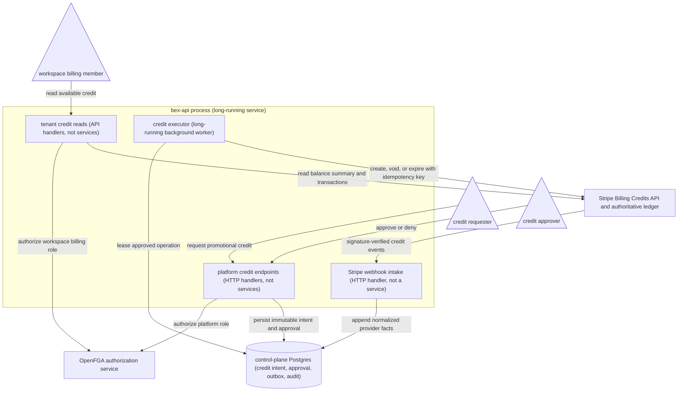

# ADR049 — Tenant billing credits and privileged issuance

**Status:** Proposed · 2026-08-02 · **Owner:** backend/control plane

**Refines:** [ADR040](ADR040-billing-metronome.md), [ADR046](ADR046-payment-onboarding-and-paid-gating.md), and [ADR012](ADR012-auth.md)

---

## Context

### bex already has the Stripe shape that billing credits require

[ADR040](ADR040-billing-metronome.md) sends sealed `usage_hourly` rows to Stripe Billing Meters. Each billable workspace maps to one metadata-keyed Stripe Customer (`bex_workspace=tea-…`) and one `charge_automatically` Subscription containing every active paid catalog Price. Stripe rates those metered items, finalizes the monthly invoice, and charges the saved payment method. [ADR046](ADR046-payment-onboarding-and-paid-gating.md) requires that payment method before a workspace can select a paid tier or export billable usage.

The missing operation is a finite credit such as “give workspace `tea-…` $1,000 of bex service credit; apply it to future monthly usage before charging the saved payment method.” The existing billing exceptions do not express that:

- Mode A (`billing_excluded`) prevents rating and Stripe object creation entirely.
- Mode B (`billing_comped`) applies a perpetual 100%-off coupon. It preserves rated invoice history but never exhausts.
- A Stripe coupon discounts an invoice or Subscription; it is not a cross-invoice credit ledger.

Stripe has several objects commonly called a balance or credit, but their semantics differ:

| Primitive | Intended use | Why it is or is not this feature |
| --- | --- | --- |
| Billing Credit Grant | Promotional or prepaid service usage across eligible metered subscription items | **Chosen.** Finite, optionally expiring, scopeable, and backed by Stripe's credit ledger. |
| Customer invoice balance | Money bex owes or is owed by a Customer, automatically applied broadly to a future invoice | Too broad for a promotional usage allowance and not scopeable to the bex meter catalog. |
| Credit Note | Correct an already-finalized invoice | Corrective accounting, not a prospective allowance. |
| Customer cash balance | Funds actually received from the Customer, commonly by bank transfer | Not something bex may synthesize as a promotion. |
| Coupon / discount | Percentage or amount discount under a recurrence policy | Appropriate for Mode B comping, not a finite carry-forward balance. |

Stripe documents Billing Credits as a public-preview feature for prepaid and promotional usage. A Credit Grant applies only to Subscription line items backed by Billing Meters; it cannot pay one-off invoice items, licensed Prices, or legacy Usage Records. Credits apply at invoice finalization after discounts, before taxes and the Customer invoice balance. The provider ledger is immutable and exposes both available and ledger balances. See [Stripe Billing Credits](https://docs.stripe.com/billing/subscriptions/usage-based/billing-credits) and the [Credit Grant API](https://docs.stripe.com/api/billing/credit-grant).

### Basic Billing credits are invoice-time money, not a real-time quota

Stripe's basic Billing Meters path burns credits down when the invoice is created at the end of the billing period. Usage can exceed the grant during the month; the remaining invoice amount is overage. Stripe recommends Metronome for a new usage-billing integration or for real-time credit burndown, enterprise commits, and hard prepaid limits. It also explicitly distinguishes an existing basic Billing Meters integration, which need not migrate merely to add invoice-time credits. See [Stripe's credit-based pricing guide](https://docs.stripe.com/billing/subscriptions/usage-based/use-cases/credits-based-pricing-model).

bex is already on the basic Billing Meters path. This ADR therefore adds invoice-time credits without reopening ADR040's provider decision. A future “no payment method, stop exactly at zero credits” product would be a different accounting and enforcement design.

### Credit issuance is a platform revenue decision, not tenant billing administration

The current OpenFGA workspace relation `can_manage_billing` belongs to workspace `billing` members and workspace/org administrators. It authorizes managing that workspace's payment setup and hosted billing sessions. It must not authorize giving the workspace platform-funded value.

The internal control-plane billing override endpoint is also not a human authorization boundary. It accepts one shared `BEX_CP_TOKEN` bearer and an `actor` string in the request body. That is suitable for authenticated machine-to-machine operations but cannot prove which person approved a revenue-impacting grant.

Stripe's own Super Administrator role is intentionally broader still: it can manage payments, Customers, Products, API keys, payout settings, team access, and other privileged account state. Routine credit issuance does not justify that blast radius. See [Stripe user roles](https://docs.stripe.com/get-started/account/teams/roles).

---

## Decision

### 1. Stripe Billing Credit Grants are authoritative for finite service credits

bex will represent every finite promotional or purchased service credit as a Stripe Billing Credit Grant attached to the workspace's existing Customer.

The initial applicability scope is all Meter-backed Prices:

```text
applicability_config.scope.price_type = metered
```

That scope intentionally follows current and future bex metered catalog additions. Per-Price grants are deferred; they introduce catalog-ID coupling and ambiguous user expectations about which resources consume a nominal dollar balance. A later product such as “AI tokens only” must add an explicit scoped-credit contract rather than silently changing this one.

Grant fields have the following contract:

| Field | Decision |
| --- | --- |
| `customer` | Resolved server-side from the bex workspace id. A caller never submits a `cus_…` id. |
| `amount.type` | Always `monetary`. |
| `amount.monetary.currency` | `usd` in v1, matching ADR040's single-currency catalog. |
| `amount.monetary.value` | Positive integer minor units. `$1,000.00` is `100000`; floats are rejected. |
| `category` | `promotional` when bex gives value for free; `paid` only after bex has evidence that the Customer purchased it. The Stripe default of `paid` is never relied upon. |
| `effective_at` | Immediate in v1. Scheduled grants are deferred. |
| `expires_at` | Required for promotional grants and derived from the promotion, incident settlement, or contract. Purchased-credit expiry requires an approved commercial/refund policy. |
| `priority` | Fixed at Stripe's default `50` in v1. Stripe's ordinary expiry/category/effective-date ordering resolves multiple grants. |
| `name` | Bounded operator-readable description; no secrets or payment details. |
| `metadata` | Stable bex workspace id, local credit-operation id, reason code, and optional bounded external ticket/contract reference. |

For a $1,000 promotional grant the provider request is semantically:

```text
customer = <resolved cus_…>
category = promotional
amount[type] = monetary
amount[monetary][currency] = usd
amount[monetary][value] = 100000
applicability_config[scope][price_type] = metered
effective_at = now
expires_at = <required policy date>
metadata[bex_workspace] = tea-…
metadata[bex_credit_operation] = bco-…
```

Stripe, not bex, subtracts eligible credits when the monthly invoice finalizes. If post-discount usage is $1,200 and $1,000 remains, Stripe applies $1,000, calculates tax according to its documented ordering, and automatically collects the residual from the Subscription's saved payment method. bex does not implement a parallel money-subtraction loop.

The UI and API call this value **service credit**, never wallet balance, cash, gift-card value, or a transferable asset. Credits are non-transferable, non-cash, usable only for bex's own eligible services, and never payable to third parties, matching Stripe's Billing Credits restrictions.

### 2. The payment-method gate remains unchanged

A Credit Grant does not satisfy ADR046's payment gate. The initial product is **credit first, saved payment method pays overage**, not payment-method-free prepaid service.

Before accepting a promotional grant, the service requires all of the following local facts:

1. the workspace exists and is not deleting;
2. `billing_provider_mappings` contains the unique Customer and Subscription relationship;
3. `payment_method_bound_at` is set;
4. the workspace is neither Mode A excluded nor Mode B comped; and
5. the requested currency matches the Stripe Customer/Subscription invoice currency.

The grant path never creates a Customer or Subscription for a drive-by/payment-method-free workspace. The operator directs the workspace through the existing setup-mode Checkout first. A comped workspace must be uncomped and its provider discount reconciliation must complete before a grant can be requested; otherwise Stripe's discount-before-credit ordering would strand the grant without consuming it.

Credits do not become resource quotas. Usage may exceed the available grant during a billing period, and ADR040's ordinary invoice collection and dunning apply to the residual. Supporting payment-method-free credits, real-time suspension at zero, plan-included allowance pools, commits, automatic top-ups, or credit transfers requires a separate ADR and likely Metronome or an equivalently authoritative real-time rating ledger.

### 3. Every issuance starts as a durable local operation

The public operator contract accepts a workspace id and business intent, not Stripe identifiers. The control-plane store creates an immutable billing-credit operation with a typed id minted through `internal/id` using the proposed `bco-` prefix.

The operation records at least:

- workspace id;
- operation kind (`grant`, `void`, or `expire`);
- amount in minor units and currency for a grant;
- category, applicability scope, effective time, and expiry;
- bounded reason code plus required human-readable reason;
- optional support ticket or contract reference;
- authenticated requester and approver subjects;
- test/live mode;
- Stripe Customer and Credit Grant ids in internal-only columns;
- deterministic provider idempotency key;
- current state and bounded provider failure; and
- creation, approval, execution, and terminal timestamps.

Money-bearing request fields are immutable. Approval and provider execution append transition records rather than rewriting the original intent. Credit operations are billing evidence: they are not subject to `BEX_AUDIT_RETENTION_DAYS`, do not cascade away with workspace deletion, and remain internal after the workspace is gone.

Provider execution uses an outbox/lease pattern:

1. commit the requested or approved local operation;
2. claim an approved operation once;
3. resolve and revalidate the workspace-to-Customer relationship and expected Stripe mode;
4. call Stripe with `bex-credit-grant-<operation-id>` as the idempotency key;
5. store the returned grant id and append the provider outcome; and
6. retry only provider-safe failures with the same parameters and idempotency key.

This closes both split-brain windows: no Stripe grant can be intentionally issued without a durable local intent, and a process crash after Stripe acceptance converges on the same grant rather than minting another $1,000.

### 4. Use narrow platform roles and separation of duties, not superadmin

ADR012's OpenFGA model gains one singleton `platform:bex` object with independent relations:

```fga
type platform
  relations
    define billing_credit_requester: [user]
    define billing_credit_approver: [user]
    define billing_credit_auditor: [user]

    define can_request_billing_credit: billing_credit_requester
    define can_approve_billing_credit: billing_credit_approver
    define can_audit_billing_credit: billing_credit_auditor or billing_credit_approver
```

The authorization rules are:

- Workspace `admin`, `billing`, and org-admin inheritance do not imply any platform credit permission.
- A requester may prepare a promotional credit but cannot execute it in live mode.
- Every operator-initiated live promotional grant, void, and expiry requires approval by a different authenticated subject with `can_approve_billing_credit`. Natural expiry at the pre-approved `expires_at` and the tenant-confirmed workspace-deletion settlement in §8 are policy execution, not new discretionary operator mutations.
- The executor is the system worker after approval; no human receives the Stripe restricted key.
- Test-mode operations may be requested and executed by one authorized requester, but are still fully audited and visibly marked test mode.
- A purchased-credit grant is authorized by the Customer's completed purchase plus a signature-verified `invoice.paid` event, not by a human pretending the payment succeeded. Purchased credits are not part of the first promotional-credit UI.
- The server derives requester and approver from the Kratos/Hydra identity. `actor`, `requestedBy`, or `approvedBy` values supplied by a client are rejected or ignored.

Stripe Dashboard Super Administrator and bex platform-owner access remain break-glass mechanisms, protected by phishing-resistant MFA and an incident record. A manual Dashboard Credit Grant is not the routine workflow; if used during an incident, webhook ingestion imports it as an externally created operation and alerts on the missing prior approval.

### 5. Mutations are operator-only; tenant reads remain provider-neutral

The first implementation exposes authenticated operator REST endpoints, separate from the shared-bearer control-plane API:

```text
POST /v1/platform/billing-credit-requests
POST /v1/platform/billing-credit-requests/{id}/approve
POST /v1/platform/billing-credit-requests/{id}/deny
POST /v1/platform/billing-credit-requests/{id}/void
POST /v1/platform/billing-credit-requests/{id}/expire
GET  /v1/platform/billing-credit-requests
GET  /v1/platform/billing-credit-requests/{id}
```

Grant, void, and expiry are deliberately absent from tenant REST, GraphQL, MCP, CLI, and dashboard surfaces. In particular, no MCP tool can directly issue value in v1. A future first-party operator console may consume the operator REST contract, but it cannot weaken the same OpenFGA checks or two-person live approval.

The existing customer-billing core gains a read-only provider-neutral shape for authorized workspace `billing` members and admins:

- total available service credit and currency;
- promotional versus paid totals when Stripe can distinguish them;
- nearest expiry;
- recent grant/application/expiry entries; and
- invoice-applied credit amounts.

Stripe ids, operator identities, internal reasons, approval records, and cost basis never enter tenant-visible results. A Stripe read failure degrades the credit section to unavailable; it never substitutes the advisory `estimatedCost` as if it were a credit balance.

### 6. Stripe's ledger is authoritative; webhooks synchronize and detect drift

The existing signature-verified, version- and mode-pinned Stripe webhook intake adds:

- `billing.credit_grant.created`;
- `billing.credit_grant.updated`; and
- `billing.credit_balance_transaction.created`.

These are Stripe's documented events for grant creation/update and credit ledger activity. See [Billing-credit webhook events](https://docs.stripe.com/changelog/basil/2025-03-31/billing-credit-webhooks).

The handler resolves the event's Customer through the internal provider mapping, rejects mode or ownership ambiguity, deduplicates by Stripe event id, and stores only normalized identifiers, amounts, currency, event kind, effective/provider times, linked invoice/line ids, and bounded reason. It never stores the signed body, payment details, keys, or arbitrary unbounded metadata.

Webhook facts reconcile the local operation state and detect:

- a Dashboard/external grant with no approved local operation;
- provider amount, currency, category, scope, or expiry drift;
- an approved operation that never appeared in Stripe;
- void/expiry outside the bex workflow; and
- credit application or reinstatement on an invoice.

The Credit Balance Summary and Credit Balance Transactions APIs remain the authoritative read/reconciliation source. Webhooks accelerate synchronization but do not replace bounded polling, just as ADR040's Subscription polling backs up collection webhooks.

### 7. Corrections are append-only

A Credit Grant is never deleted or edited to pretend the original amount differed:

- **Unused mistake:** void the grant through a new approved `void` operation.
- **Partially used mistake:** expire the unused remainder through a new approved `expire` operation. Any consumed amount is a finance/support incident, not something silently clawed back from future invoices.
- **Too-small grant:** create another approved grant; do not mutate the first amount.
- **Voided invoice:** Stripe reinstates applied credit; if the grant is already past expiry, the reinstated amount expires.
- **Credit Note:** Stripe does not restore an applied Credit Grant. If policy requires restoration, create a distinct approved replacement grant linked to the Credit Note.

The API always previews the target grant, available remainder, workspace, mode, and effect before approval. Void and expiry require the same separation of duties as issuance because they can remove Customer value.

### 8. Workspace deletion settles credits before dropping provider identity

ADR040 already cancels the Subscription with `invoice_now=true` before the tenant-row cascade and retains the Stripe Customer for invoice history. The credit-aware purger extends that ordering:

1. freeze new billing-credit operations for the deleting workspace;
2. cancel and finalize the Subscription's last invoice so eligible remaining credit can apply;
3. reconcile the final invoice and credit ledger;
4. expire any remaining promotional grants with an audited system-generated operation; and
5. only then permit deletion to remove the live provider mapping.

Purchased-credit remainder cannot be silently forfeited. Workspace deletion blocks in a `billing_settlement_required` state until the separately approved commercial policy refunds it, transfers it under a future supported contract, or records another lawful disposition. The initial implementation does not sell purchased credits and therefore need not automate that settlement, but the data model must distinguish the category from day one.

### 9. Tax behavior remains Stripe-owned and fail-closed

Credit issuance does not change ADR040's Stripe Tax activation gate, Product tax code, Price tax behavior, registrations, Customer location evidence, or automatic-tax configuration. Stripe applies eligible Billing Credits before tax according to its documented invoice ordering.

Whether promotional or purchased credits create tax, revenue-recognition, escheatment, refund, or expiry obligations is a legal/accounting decision. Code does not infer those obligations, create Tax registrations, or label a grant `paid` without payment evidence. Before enabling purchased credits, finance and tax advisors must approve the purchase invoice, recognition, expiry, refund, and deletion-settlement policies.

### 10. Credentials and activation fail closed

Credit operations use a dedicated restricted Stripe API key, `BEX_STRIPE_CREDIT_KEY`, rather than expanding the existing meter/Subscription runtime key. It has only the Customer read, Credit Grant write, Credit Balance Summary read, and Credit Balance Transaction read permissions proven necessary in Stripe Workbench. Test and live modes have different keys and access policies; production keys are IP-restricted where the deployment supports stable egress.

`BEX_STRIPE_CREDIT_KEY` unset means:

- no credit mutation endpoint is registered;
- no credit executor runs;
- credit-specific provider reads report unavailable; and
- existing ADR040 billing, meter export, invoices, payment onboarding, and dunning remain byte-identical.

Startup refuses the credit key unless `BEX_STRIPE_SECRET_KEY`, `BEX_STRIPE_WEBHOOK_SECRET`, `BEX_CP_DB_URI`, and the OpenFGA checker are also configured. Credits without durable storage, verified provider events, the underlying billing contract, or real authorization would be unsafe. Keys never enter source, logs, audit payloads, metrics, public errors, client code, or Stripe object metadata.

Because Stripe currently labels Billing Credits public preview, production activation is an explicit go-live decision after account availability is confirmed. Rollback disables new operations and the executor but does not void, expire, delete, or locally rewrite existing grants; Stripe continues applying already-issued credits to eligible invoices.

---

## Architecture and trust flow



The requester and separate approver create durable intent; only the background executor mutates Stripe, whose events reconcile the local audit ledger.

---

## State model

Promotional issuance has the following local lifecycle:

```text
requested
  ├─ denied
  └─ approved
       ├─ provider_pending ── provider_retry
       ├─ failed_permanent
       └─ granted ── depleted | expired | voided
```

Only a different approver can move a live `requested` operation to `approved`. Provider states are facts driven by the executor and verified Stripe events, not client-settable values. A stale or reordered webhook can append evidence but cannot move a terminal state backward.

The Stripe Credit Grant and its Credit Balance Transactions remain the financial ledger. The local state model is the authorization, intent, idempotency, reconciliation, and audit ledger.

---

## Consequences

- A workspace can receive a finite $1,000 service credit without becoming structurally excluded or perpetually comped.
- Stripe automatically consumes credit on finalized metered Subscription invoices and charges the saved payment method for overage.
- Existing tax, collection, dunning, metering, advisory-estimate, and payment-gate behavior remains intact.
- Credit issuance becomes a two-person live platform operation, independent of tenant roles and generic superadmin.
- The control plane gains durable financial-operation records that survive workspace deletion and are reconciled against Stripe's immutable ledger.
- Tenant billing readers can see provider-neutral available credit and application history without learning Stripe or operator identifiers.
- General account credits for fixed/one-off charges remain unsupported; a future fixed platform fee would not be covered merely because this feature exists.
- Payment-method-free hard-capped prepaid service remains unsupported because basic Billing credits are consumed at invoice time, not continuously.
- Production depends on a Stripe public-preview capability. The activation and rollback posture must acknowledge that provider maturity explicitly.

---

## Alternatives considered

**Adjust the Stripe Customer invoice balance by `-100000`.** Rejected for promotional usage credits. It applies broadly to a future invoice, is not scoped to Meter-backed bex usage, has different tax/application semantics, and cannot express promotion expiry or grant category. It remains appropriate when bex genuinely owes the Customer money across invoice types. See [Stripe Customer invoice balance](https://docs.stripe.com/billing/customer/balance).

**Issue a Credit Note.** Rejected for prospective credits. Credit Notes correct finalized invoices and are the right primitive for invoice errors, not future promotional allowance. They also do not restore an already-consumed Credit Grant automatically.

**Create an amount-off coupon.** Rejected. Coupon recurrence and invoice-discount semantics do not provide a durable, exhaustible cross-month ledger. The existing perpetual 100%-off coupon remains the correct Mode B comp mechanism.

**Keep a bex-only credit ledger and subtract locally before sending meter events.** Rejected. Suppressing provider usage would make Stripe invoices cease to be the authoritative rating record, duplicate monetary arithmetic, complicate tax and invoice explanation, and obscure true rated consumption. bex keeps operational usage locally; Stripe owns authoritative money.

**Give support staff Stripe Super Administrator or a shared API key.** Rejected. Both grant unrelated powers, prevent least-privilege offboarding, and make a trustworthy requester/approver audit difficult. Human operators use bex identity and OpenFGA; only the executor holds a restricted provider key.

**Reuse workspace `can_manage_billing`.** Rejected. That permission lets a tenant manage its own billing relationship; it cannot authorize the tenant to grant itself platform-funded value.

**Reuse `POST /v1/tenants/{id}/billing-override` with a body-supplied actor.** Rejected. A shared machine bearer plus claimed actor is not human authentication or separation of duties. The endpoint remains for its existing internal operations and is not extended to credits.

**Allow credits to replace the payment-method requirement.** Rejected for this ADR. Invoice-time balance is not a real-time consumption ceiling; usage can exceed it. The saved payment method makes the residual collectible and leaves ADR046's safety boundary coherent.

**Migrate back to Metronome now.** Rejected for this bounded feature because bex already has a working basic Billing Meters integration and needs invoice-time credit plus payment-method overage. Reconsider when product requirements include payment-method-free hard limits, real-time credit burndown, enterprise commits/minimums, ramp schedules, automatic top-ups, or dimensional contract pricing.

**Use the Stripe Dashboard as the normal issuance UI.** Rejected. It bypasses bex approval policy, workspace-id validation, reason taxonomy, and pre-provider durable intent. Dashboard access remains break-glass and webhook-detected.

---

## Rollout and verification

1. Confirm Billing Credits availability on the bex Stripe account and pin the webhook/API version already required by ADR040.
2. Add the typed operation id, durable operation/transition schema, non-cascading retention, and store tests.
3. Apply the OpenFGA `platform:bex` model and seed requester/approver/auditor tuples out of band.
4. Add the dedicated test restricted key and verify its exact permissions from Stripe request logs before creating a live equivalent.
5. Add request/approval/executor paths and the three signature-verified credit webhook events.
6. Extend provider-neutral billing reads and the bounded reconciliation worker.
7. Run a Stripe sandbox/Test Clock matrix covering:
   - grant smaller than, equal to, and larger than the invoice;
   - multiple grants, expiry ordering, and promotional category ordering;
   - residual payment-method charge and payment failure/dunning;
   - comp/excluded/payment-method-free rejection;
   - idempotent retry after simulated timeout;
   - unauthorized, self-approved, stale, duplicate, and reordered approval/events;
   - unused void and partially used expiry;
   - invoice void reinstatement and Credit Note non-reinstatement;
   - final workspace-deletion invoice and promotional remainder expiry; and
   - disabled-key byte-identical behavior.
8. Reconcile every test operation against Credit Grants, Credit Balance Summary, Credit Balance Transactions, and invoice lines with no unclassified drift.
9. Obtain finance/tax approval for promotional terms and production activation. Purchased-credit selling remains disabled until its separate commercial checklist is complete.
10. Enable the live restricted key for a small, explicitly approved canary grant; verify the invoice and ledger before broad operator access.
