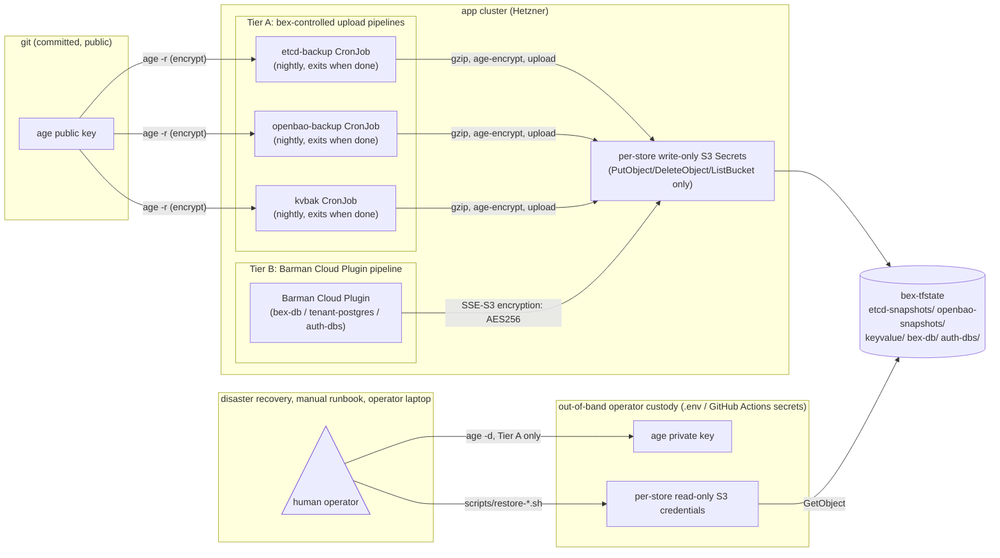

# ADR: encrypted platform backups + write-scoped backup credentials

**Status:** Accepted; implemented + partially enabled in production (w5/m63). Shipped 2026-08-04; **Tier B SSE is active on all three Barman `ObjectStore`s**, and **Tier A age encryption is enabled and verified for etcd + OpenBao** (both emit `*.gz.age`; a live prod restore drill decrypted a fresh `.age` etcd snapshot with the out-of-band private key and recovered the CRs). The KV encrypt step is wired (the live `kvbak` CronJob reconciled to `[snapshot compress encrypt]`) but a green end-to-end KV backup is blocked by a **pre-existing** Valkey-connectivity failure at the unchanged `snapshot` step (that instance's backup has never succeeded, predating this ADR — see [`.pm/w5/039.md`](../.pm/w5/039.md)). The write-only per-store credential rotation (§3) is **built but not yet enabled** in prod (deferred by operator decision). Extends [ADR031-platform-data-backup.md](ADR031-platform-data-backup.md) (the consolidated backup policy for etcd, OpenBao, paid KeyValue, and the Barman Cloud plugin-backed Postgres clusters) with an encryption-at-rest and credential-scoping design. Companion to [ADR011-etcd-backup-restore.md](ADR011-etcd-backup-restore.md), [ADR015-openbao-backup-restore.md](ADR015-openbao-backup-restore.md), [ADR009-postgresql-management.md](ADR009-postgresql-management.md), and [ADR021-keyvalue-management.md](ADR021-keyvalue-management.md), which this ADR modifies without restating their mechanisms. Reuses the key-custody shape already accepted in [ADR013-secrets.md §3](ADR013-secrets.md) (OpenBao's Shamir unseal keys) and [ADR016-sealed-secrets.md](ADR016-sealed-secrets.md) (the sealed-secrets controller keypair), and sits below [ADR019-infra-credentials.md](ADR019-infra-credentials.md)'s bootstrap trust chain. Findings that motivated it echo [ADR028-security-review.md](ADR028-security-review.md) and [ADR045-security-review-round3.md](ADR045-security-review-round3.md)'s secrets-hygiene passes, which this ADR closes one gap of.

## Context

None of bex's five off-cluster backup destinations (etcd, OpenBao, paid KeyValue, and the two Barman Cloud plugin ObjectStore groups — `bex-db` and `auth/auth-dbs` — plus `default/bex-tenant-postgres`) are encrypted by anything bex controls, and all of them are written with **the same root credential**: `TF_STATE_ACCESS_KEY`/`TF_STATE_SECRET_KEY` from `.env`, reused verbatim as `etcd-backup-s3`, `openbao-backup-s3`, `bex-db-backup-s3`, `auth-dbs-backup-s3`, and `bex-kv-backup-s3` (ADR031's one-time-setup sections; the etcd/OpenBao CronJob manifests source it via `envFrom: secretRef`). That credential can read, write, and delete every backup for every store in `bex-tfstate`.

This matters more than "is there SSE on the bucket." Wasabi's server-side encryption (or any provider SSE) decrypts transparently on an authenticated `GetObject` — it protects the platform against someone stealing a disk out of a Wasabi data center, not against the credential that already has full read/write/delete on the bucket leaking (a compromised CI runner, a mishandled `.env` copy, a Terraform-state credential rotated for an unrelated reason and forgotten here). Given `.env` is explicitly the same trust tier as `HCLOUD_TOKEN` and the `bex` SSH key (ADR019's credential inventory), a leak of that scope is already the platform's worst-case bootstrap-credential event — backup confidentiality shouldn't ride on it staying secret on top of everything else it already gates.

One exception already exists and needs no new work: OpenBao's Raft snapshot is **already encrypted before it ever reaches disk** — `bao operator raft snapshot save` captures the already-sealed store (ADR015, "The snapshot is already encrypted at rest by OpenBao"). That property is orthogonal to this ADR; OpenBao only needs the credential-scoping half below, not a new encryption step.

## Decision

### 1. Key custody: one `age` keypair, public half in git, private half out-of-band — not a symmetric key, not OpenBao

Generate one [age](https://github.com/FiloSottile/age) keypair with `age-keygen`. `age` is chosen over GPG for the same reason Sealed Secrets was chosen over SOPS/ksops (ADR016 §Decision): fewer moving parts, one static binary, no keyring or config, scriptable in a CronJob `args:` block with no extra dependency.

- **Public key** (`age1…`) is not secret. It is committed to git — baked as a literal into the three Tier A CronJob manifests below (`deploy/gitops/charts/{etcd-backup,openbao-backup}/cronjob.yaml` and the operator-templated `kvbak-<id>` Job spec in `lego/operator/internal/controller/keyvalue_backup.go`) — the same trust level as the Sealed Secrets controller's public key, which also ships in the clear.
- **Private key** (`AGE_BACKUP_PRIVATE_KEY`) lives only where `BAO_ROOT_TOKEN`/`BAO_UNSEAL_KEY_*` live: `.env` (gitignored) and, mirrored by `scripts/gh-secrets.sh`, GitHub Actions secrets — added to that script's credential list and to `.env.example` per [CLAUDE.md](../CLAUDE.md)'s sync rule. It is never installed as an in-cluster Secret; no encrypt-path pod ever needs it, because encryption only needs the public half.
- This is deliberately the **inverse** of storing the key in OpenBao: OpenBao's own backup, and any restore that must happen before OpenBao itself is back up (the exact scenario ADR015's restore runbook exists for), cannot depend on OpenBao being alive to unlock the key that protects it. `.env`/CI-secret custody is out-of-band by construction and survives total in-cluster loss — the same reasoning ADR019 §Decision 3 already applied to bootstrap secrets generally ("they cannot live in the in-cluster stores they bootstrap").
- Rotation follows ADR019's existing "three copies" discipline (`.env`, GitHub Actions secret, and here also the git-committed public key), with one added wrinkle: unlike an access credential, an old **private** key must be retained until every backup it encrypted has aged out of retention (7–30 days per ADR031's table), not deleted the moment rotation completes. A rotation appends a new public key to affected manifests and keeps the previous private key in `.env` under a `_PREVIOUS` suffix until the old retention window closes.

### 2. Tiered encryption mechanism — bex encrypts what it uploads, and asks the plugin for what it doesn't

bex controls the upload step for etcd, OpenBao, and KeyValue directly (a `busybox` `gzip` init container followed by an `amazon/aws-cli` upload container, in all three CronJob/Job specs). It does **not** control the Barman Cloud plugin's internal `pg_basebackup`/WAL-archiving pipeline (ADR009, ADR031 §Barman Cloud plugin) — the plugin only exposes `spec.configuration.{data,wal}.encryption: AES256 | aws:kms` as a passthrough to the S3 `x-amz-server-side-encryption` header (`deploy/gitops/charts/barman-cloud-plugin/upstream/manifest-0.13.0.yaml`), i.e. provider SSE, not a customer-supplied key.

- **Tier A — etcd, OpenBao, paid KeyValue:** insert one `age`-encrypt step between the existing `compress` step and the `upload` step, encrypting to the committed public key (`age -r <pubkey> -o snapshot.gz.age snapshot.gz`); upload the `.age` file instead of the bare `.gz`. Full key-controlled confidentiality, independent of the storage provider and of whatever credential the upload container holds.
- **Tier B — Barman Cloud plugin (`bex-db`, `default/bex-tenant-postgres`, `auth/auth-dbs`):** set `configuration.data.encryption: AES256` and `configuration.wal.encryption: AES256` on all three `ObjectStore` CRs. This is accepted as **weaker and explicitly said so**: it stops raw-media theft at the provider, not a leaked credential, because SSE-S3 decrypts transparently for any caller the bucket already authenticates. §3 below is what actually protects Tier B's confidentiality against the credential-leak threat model; the SSE flag is defense-in-depth on top of it, not a substitute.
- Closing the Tier A/B gap — true client-side or customer-managed-key encryption for Barman-backed Postgres — needs either upstream `plugin-barman-cloud` support for SSE-C/customer keys, or bex operating an encrypting S3-compatible proxy in front of Wasabi for that path alone. Both are out of scope here; see Follow-ups.

### 3. Write-only, per-store credentials replace the shared root credential

Same shape as the static-site reader/publisher split ([ADR029-static-sites.md](ADR029-static-sites.md), `scripts/static-s3-credentials.sh`, `infra/wasabi/static-s3-*-policy.json`): two Wasabi IAM identities per store, each scoped to that store's own bucket prefix.

| identity | permissions | installed as | used by |
| --- | --- | --- | --- |
| `<store>-backup-writer` | `PutObject`, `DeleteObject`, `ListBucket` (needed for each job's own retention pruning) — **no `GetObject`** | in-cluster Secret (`etcd-backup-s3`, `openbao-backup-s3`, `bex-db-backup-s3`, `auth-dbs-backup-s3`, `bex-kv-backup-s3`), replacing today's copy of the TF-state root credential | the backup CronJobs/plugin themselves |
| `<store>-backup-reader` | `GetObject`, `ListBucket` | **not installed in-cluster** — sourced from `.env` by the operator, mirroring how `restore-openbao.sh` already sources `BAO_ROOT_TOKEN` | `scripts/restore-*.sh` only |

New `infra/wasabi/backup-writer-policy.json` / `backup-reader-policy.json` templates (parameterized by prefix, same shape as `static-s3-publish-policy.json`) plus a `scripts/backup-s3-credentials.sh` provisioning script following `static-s3-credentials.sh`'s `provision` / `verify` / `revoke-legacy` shape — `verify` proves the positive/negative access matrix (writer denied `GetObject`, reader denied `PutObject`) with a random probe object, same as the static-site script does today.

**Consequence of this alone, even without §2:** a leaked backup-job Secret can overwrite or delete backups (an availability/integrity risk, addressed separately — see Follow-ups) but can no longer read their contents back. Combined with §2, Tier A backups are unreadable without the out-of-band private key even by someone holding both the writer credential _and_ full cluster access; Tier B backups are unreadable by anyone except through the Wasabi account itself.

## Diagram

The writer credential only ever moves data into the bucket; decrypting and reading anything back requires the operator's out-of-band private key (Tier A) and/or the separate reader credential, neither of which any in-cluster workload holds.

## Recovery flow

Restores gain exactly two new inputs, both already living in the same `.env`/GitHub Actions custody tier as everything else in ADR019 — no new custody surface, only new consumers of it.

### Tier A (etcd, OpenBao, KeyValue)

1. `scripts/restore-*.sh` fetches the target object from `bex-tfstate` using the **`<store>-backup-reader`** credential (§3), sourced from `.env` — never the in-cluster writer Secret, which can no longer `GetObject` at all once §3 ships.
2. Before the existing gzip/integrity check, decrypt the transport wrapper: `age -d -i <private-key-file> -o snapshot.gz snapshot.gz.age`, using **`AGE_BACKUP_PRIVATE_KEY`** (§1), also from `.env`. This step is still covered by `DRY_RUN=1` — decrypt-and-inspect reads S3 and writes only to the script's local/ephemeral scratch dir, same as today's download-and-checksum step.
3. Everything after that is unchanged: `restore-etcd.sh` extracts CR manifests via a throwaway etcd; `restore-keyvalue.sh` boots a fresh PVC with AOF disabled, then enables/rewrites it; `restore-openbao.sh` force-restores into a fresh one-node Raft target.

   **OpenBao's restore is two layers deep, not one.** The age step only reverses the _transport_ wrapper this ADR adds — the Raft snapshot underneath was already encrypted by OpenBao's own master key before it ever reached disk (ADR015). A full OpenBao restore therefore needs three secrets in sequence, none of them new custody: the reader credential (fetch), the age private key (unwrap transport), and the **original Shamir unseal keys** (`BAO_UNSEAL_KEY_1..3`, unchanged from ADR015) to unseal the restored target. The restore runbook should make this three-step order explicit rather than leaving the age step implicit inside "download."

### Tier B (bex-db, tenant Postgres, auth DBs)

SSE-S3 decrypts transparently inside CNPG/Barman on any authenticated `GetObject` — there is no explicit decrypt step to add to `restore-postgres.sh`. But §3's credential split changes what "authenticated" means: the script currently **clones the source ObjectStore's own Secret into the recovery namespace** verbatim (ADR031 §Restore runbooks). Once that Secret is writer-only (no `GetObject`), cloning it as-is makes every Postgres restore fail closed with 403. `restore-postgres.sh` must instead build the recovery Cluster's `externalClusters[].plugin` Secret from the **`<store>-backup-reader`** credential. This is a required script change, not optional, and needs its own live drill before the writer-only Secret replaces today's shared root credential in production — a restore that "worked" under the old shared credential could otherwise silently break the day §3 ships.

### What doesn't change

- `DRY_RUN=1` semantics, the `restore-` namespace-naming/confirm-token gate, and the no-live-restore-mode contract (ADR031 §Restore runbooks) all carry over unchanged — this ADR only adds inputs to existing scripts, not new mutation paths.
- The age private key and every reader credential remain read-only inputs to a human-triggered script; neither is ever placed in a CronJob, ConfigMap, or any long-running pod.

## Consequences

- **Loss of both `.env` and GitHub Actions copies of the age private key permanently loses Tier A backup confidentiality** — the same class of catastrophic-loss risk ADR016 already accepts for the Sealed Secrets controller key and ADR013 accepts for the Shamir unseal shares. Custody it with the same care as those.
- `scripts/restore-etcd.sh`, `restore-openbao.sh`, and `restore-keyvalue.sh` gain the age-decrypt step above; `restore-postgres.sh` gains the reader-credential swap above — both are required changes, not follow-ups.
- Tier B (Postgres) confidentiality remains weaker than Tier A until a Follow-up lands — this is accepted for this ADR, not silently deferred.
- The re-drill cadence in ADR031 (§Re-drill cadence) must be extended: every drill's restore path now needs to prove decrypt-then-restore, not just restore, for Tier A stores.
- New provisioning script and IAM policies need the same drill treatment `static-s3-credentials.sh verify` already gets: a live positive/negative access-matrix check before `revoke-legacy` retires the shared root credential's use in backups.

## Alternatives considered

- **Provider SSE only, no client key (status quo plus a config flag)** — rejected: doesn't address the actual threat (a leaked, overly broad backup credential), only raw-media theft at the provider, which isn't the realistic risk for a cloud object store.
- **Symmetric key in a Kubernetes Secret** — rejected: must be present at every encrypt site (larger blast radius than a public key that isn't secret at all), and still needs the same out-of-band DR custody as the asymmetric private key, with none of its benefits.
- **Store the key in OpenBao** — rejected: circular dependency against the exact scenario (total in-cluster loss) backups exist to survive; see §1.
- **Cloud KMS auto-unseal / provider-managed customer keys** — rejected for the same self-hostability reason ADR013 §3 rejected AWS/GCP auto-unseal for OpenBao: it would tie a self-hostable platform to one cloud's KMS.

## Follow-ups

- Tier B upgrade: track upstream `plugin-barman-cloud` for SSE-C/customer-key support, or evaluate an encrypting S3-compatible proxy in front of Wasabi for the Barman path only.
- Object Lock / WORM retention on the relevant `bex-tfstate` prefixes, so even a leaked writer-scoped credential can't overwrite or delete existing backups — an integrity/availability concern distinct from this ADR's confidentiality scope.
- An `age` key rotation runbook, mirroring [ADR036-ca-rotation-runbook.md](ADR036-ca-rotation-runbook.md) / [ADR037-openbao-rekey-runbook.md](ADR037-openbao-rekey-runbook.md), once this ships.
