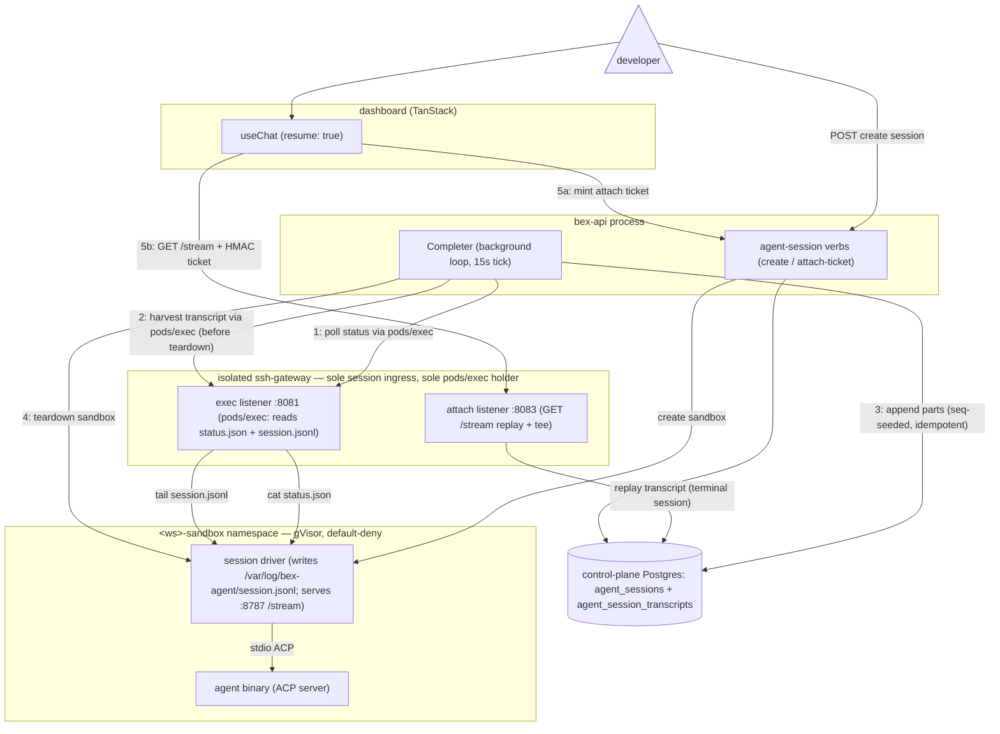

# ADR051 — Agent-session conversation transcript persistence

**Status:** Accepted (2026-08-07); implemented in **w3/m77**, **mechanism revised 2026-08-08 (w3/m77 follow-up) to the log-harvest path** (see Decision). Splits the D10 "headless recorder" decision out of [ADR047](ADR047-cloud-coding-agent-sessions.md) into a dedicated ADR because transcript persistence is a distinct concern from the session lifecycle. ADR047 D3/D9 own the **live-attach** conversation plane (shipped w3/m43); this ADR owns the **durable chat history** for the shipped **fire-and-forget** product, which the live-attach tee never captures.

> **Revision (2026-08-08).** The first w3/m77 implementation had the Completer trigger a gateway `/agent-record` endpoint that made a **separate** network dial to the driver's `:8787/stream`. That path was never verified on prod and prod sessions kept showing "No conversation yet." It is replaced by the **log-harvest** path below: the Completer reads the driver's on-disk transcript log over the **same `pods/exec` boundary it already uses for the status read** — the one proven working in prod (sessions finalize through it). The gateway `/agent-record` endpoint, its `RecordSecret`, and `BEX_AGENT_RECORD_URL` are removed. The live-attach tee (ADR047 D9) is unchanged.

---

## Context

### The product surface

An agent session's conversation — the plans, reasoning, tool calls, terminal output, and diffs the agent streams as it works — is a first-class deliverable, not just a live view. The dashboard's session detail page (`dashboard/src/features/agent-sessions`) renders it from the AI SDK **UI-message stream** via `useChat` with `resume: true`, and ADR047 D9 makes the stream's replay mode "the single history source for terminal and running sessions alike." So a completed session must be able to replay its whole conversation long after its sandbox is gone.

### The gap (found in prod 2026-08-06)

The w3/m43 conversation plane persists a transcript only as a **side effect of a live attach**. The sole writers of `agent_session_transcripts` are the gateway tee on the `GET` splice and the `POST` turn (`lego/backend/internal/sshgateway/agentattach/agentattach.go` — both call `store.AppendAgentSessionTranscript`), and both run only while a browser is attached to a still-running driver.

But the shipped **phase-1 product is fire-and-forget** (ADR047 D8): the driver runs its turn **headless with no client stream** (bex-api sets `BEX_AGENT_EXIT_AFTER_TURN=0` and no attach happens — `lego/backend/internal/agentsessions/service.go`; `runHeadlessTurn`, `lego/agent-image/driver/src/session.ts`), and the Completer tears the sandbox down the moment the turn finishes (`lego/backend/internal/agentsessions/completion.go` → `teardown` → `CancelAgentSessionSandbox`). So unless a viewer happened to hold the conversation page open for the **entire** run, nothing is ever teed; by the time the session is opened it is terminal, the pod (and its in-memory hub) is gone, and `GET /stream` replays an **empty** transcript then `[DONE]` — the dashboard shows **"No conversation yet."** for every completed fire-and-forget session.

ADR047 D3's "the gateway tees the session stream into a transcript" and D9's replay-mode claim both silently assumed a persister the phase-1 path never runs. This ADR specifies that persister.

### What already exists (the fix is mostly wiring)

- **The driver keeps the whole turn available until teardown.** It retains the full in-memory `#history` and serves `GET /stream` on port 8787 for as long as the pod lives (`lego/agent-image/driver/src/stream-hub.ts`; the fire-and-forget failure path in `main.ts` is explicit that the driver MUST stay alive so the Completer can read it). `hub.attach` replays the **entire** history — plus `[DONE]`, since a headless turn closes the hub — to any attacher that arrives before teardown. One attach any time before teardown captures the complete transcript in a single shot.
- **The gateway already holds the exact tee.** `spliceDriverStream` dials `http://<podIP>:8787/stream` and appends every part idempotently by the driver's emission ordinal (`ON CONFLICT (session_id, seq) DO NOTHING`, `store/agentsessions.go`). Gateway→driver:8787 ingress is sanctioned by the cluster-wide `sandbox-agent-driver-ingress` Cilium policy. Nothing in the tee needs a browser except the pod/ns/session identity, which today rides the attach ticket.
- **The Completer already crosses the boundary every tick.** It reads the driver status file over the gateway sandbox-exec boundary (`c.Sandbox.ReadSessionStatus` → `sandbox/service.go` `mintAndDial` → gateway `:8081` exec) under the trusted system subject `system:agent-session-completer`, and it owns the teardown. bex-api never holds `pods/exec`.
- **The store is ready.** `AppendAgentSessionTranscript` (idempotent, seq-keyed), `AgentSessionTranscript` (replay read), and `AgentSessionTranscriptMaxSeq` (resume cursor) all exist; the `GET /stream` replay already serves terminal sessions from them.

The only missing piece is a **non-browser trigger** for the tee.

---

## Decision

**Persistence is decoupled from live attach by a server-side recorder the Completer triggers before teardown.**

### Core path

### Mechanism (log harvest over the proven exec boundary)

- **The Completer harvests-before-teardown** in `completion.go` `teardown`, immediately before `CancelAgentSessionSandbox`. It reads the driver's per-part log through **`ReadSessionTranscript`** — the exact same `mintAndDial` → gateway `:8081` `pods/exec` path it already uses each tick for `ReadSessionStatus`, just `tail`-ing `/var/log/bex-agent/session.jsonl` instead of `cat`-ing `status.json`. This is the decisive reliability choice: if a session finalizes at all, that exec path is working, so the harvest works too — no separate, unverified gateway→driver `:8787` dial.
- **The driver already produces the source.** It writes every UI-message part to the log via `logPart` (`lego/agent-image/driver/src/session.ts`), redacted, and the log survives scrub (`credentials.ts` replaces credential bytes in place, never deletes). bex-api parses each `{…,"part":{…}}` line and keeps only the `.part` payload — the shape the `GET /stream` replay re-frames for a Vercel AI SDK client.
- **Idempotent partial merge (w5/m71 amendment, 2026-08-17).** A fresh sandbox restarts its driver ordinal, so transcript identity is `(session_id, turn, part_index)` while the store allocates monotonic per-session `seq` cursors under an advisory lock. The Completer parses the whole current-turn log on every needed harvest and inserts missing local indexes. It never treats “one live-teed part exists” as proof the whole turn exists.
- **Failure is explicit, never a hang.** The session still finalizes and tears down, but the durable turn records whether its assistant transcript is complete, truncated, and why. Provisioning, transport/read, parse/part-count, driver-log, store, and 64 MiB session-quota failures can therefore replay retained content without masquerading as complete history.
- **One coherent bound.** The driver keeps a bounded 16 MiB JSONL log. `ReadSessionTranscript` tails the same 16 MiB and uses a dedicated 17 MiB trusted exec buffer; any buffer truncation is an error. The ordinary sandbox-exec response retains its independent 2 MiB cap.

### Role-correct frontend replay

The stored UI-message response chunks encode assistant output, not the submitted user role. The gateway therefore interleaves durable `agent_session_turns` as `data-user-prompt` parts and normalizes nested per-turn `start`/`finish` chunks into one response envelope. The dashboard renders those prompt parts as user messages and surfaces incomplete-history reasons. React optimistic state is only an in-flight echo, never history.

---

## Alternatives considered

- **Gateway `/agent-record` endpoint that dials the driver's `:8787/stream`** (the original w3/m77 implementation): the Completer POSTed an exec-secret-signed ticket to a new gateway route, which resolved the pod IP and reverse-proxied+teed the driver's live `/stream` replay verbatim. Its appeal was byte-exact parts (composes with the live tee). **Superseded 2026-08-08**: it introduced a second, never-prod-verified network path (gateway→driver:8787 direct dial + a new listener route + `BEX_AGENT_RECORD_URL`), and prod sessions stayed blank. The log-harvest rides the already-working status-read boundary instead. The trade-off accepted: harvested parts are **redacted and re-wrapped** (not the verbatim `data:` bytes ADR047 D3 promises) — fine for terminal replay, where the client just needs the parts.
- **Driver pushes parts to the gateway** (a new driver→gateway write path): rejected — it puts untrusted tenant code on the transcript write path (the store comment deliberately keeps the driver out, `store/agentsessions.go`), and the sandbox's **sole** open in-cluster egress port is the credential broker's `:8082`.
- **Create-time recorder** (record the whole turn live from dispatch): rejected as heavier — a long-lived per-session server-side subscriber with its own reconnection/lifecycle — when a one-shot harvest before teardown suffices because the driver's log is complete by then.

---

## Consequences

- The gateway `/agent-record` route, `agentattach.Server.RecordSecret`, and `BEX_AGENT_RECORD_URL` are removed; capture is a bex-api-only concern riding the existing exec boundary. No new env var and no new gateway listener/route.
- Phase-2 live attach optimizes real-time viewing; the harvest is the universal backstop; both write the same idempotent `(session_id, turn, part_index)` identity while `seq` remains the global replay cursor.
- Retention rides the existing audit sweep (`PruneAgentSessionTranscripts`, `BEX_AUDIT_RETENTION_DAYS` lineage) and the `ON DELETE CASCADE` with the session.
- Multi-turn/redispatch sessions concatenate by the store-allocated cursor; every driver log record carries its turn and local part index.
- Residual limit: capture happens at completion, so a sandbox lost before teardown has no assistant log to harvest. Its accepted user prompt still survives and is settled visibly incomplete.
