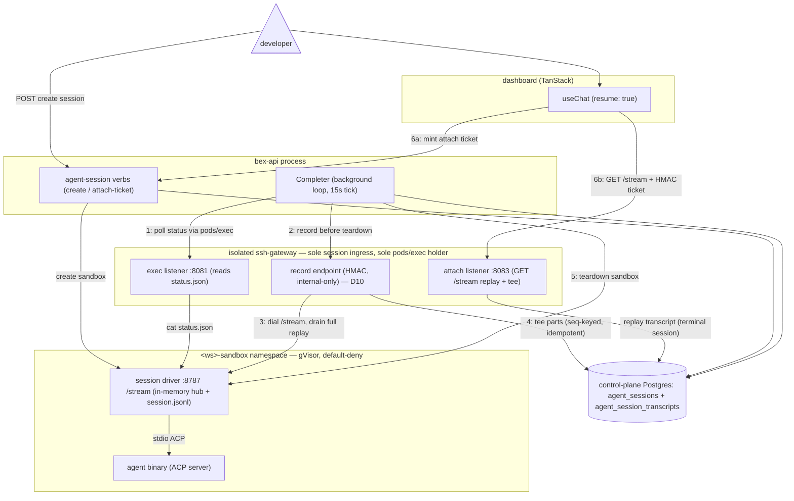

# ADR051 — Agent-session conversation transcript persistence

**Status:** Accepted (2026-08-07); implemented in **w3/m77**. Splits the D10 "headless recorder" decision out of [ADR047](ADR047-cloud-coding-agent-sessions.md) into a dedicated ADR because transcript persistence is a distinct concern from the session lifecycle and spans three processes (driver, gateway, bex-api Completer). ADR047 D3/D9 own the **live-attach** conversation plane (shipped w3/m43); this ADR owns the **durable chat history** for the shipped **fire-and-forget** product, which the live-attach tee never captures. Backend/gateway/driver-ticket implementation + unit/real-Postgres coverage landed under w3/m77; the live-substrate leg shares the m41 operator-run gate (`scripts/agent-session-verify.sh` step 5b′ asserts a fire-and-forget session's replay is non-empty).

---

## Context

### The product surface

An agent session's conversation — the plans, reasoning, tool calls, terminal output, and diffs the agent streams as it works — is a first-class deliverable, not just a live view. The dashboard's session detail page (`dashboard/src/features/agent-sessions`) renders it from the AI SDK **UI-message stream** via `useChat` with `resume: true`, and ADR047 D9 makes the stream's replay mode "the single history source for terminal and running sessions alike." So a completed session must be able to replay its whole conversation long after its sandbox is gone.

### The gap (found in prod 2026-08-06)

The w3/m43 conversation plane persists a transcript only as a **side effect of a live attach**. The sole writers of `agent_session_transcripts` are the gateway tee on the `GET` splice and the `POST` turn (`lego/backend/internal/sshgateway/agentattach/agentattach.go` — both call `store.AppendAgentSessionTranscript`), and both run only while a browser is attached to a still-running driver.

But the shipped **phase-1 product is fire-and-forget** (ADR047 D8): the driver runs its turn **headless with no client stream** (bex-api sets `BEX_AGENT_EXIT_AFTER_TURN=0` and no attach happens — `lego/backend/internal/agentsessions/service.go`; `runHeadlessTurn`, `lego/agent-image/driver/src/session.ts`), and the Completer tears the sandbox down the moment the turn finishes (`lego/backend/internal/agentsessions/completion.go` → `teardown` → `CancelAgentSessionSandbox`). So unless a viewer happened to hold the conversation page open for the **entire** run, nothing is ever teed; by the time the session is opened it is terminal, the pod (and its in-memory hub) is gone, and `GET /stream` replays an **empty** transcript then `[DONE]` — the dashboard shows **"No conversation yet."** for every completed fire-and-forget session.

ADR047 D3's "the gateway tees the session stream into a transcript" and D9's replay-mode claim both silently assumed a persister the phase-1 path never runs. This ADR specifies that persister.

### What already exists (the fix is mostly wiring)

- **The driver keeps the whole turn available until teardown.** It retains the full in-memory `#history` and serves `GET /stream` on port 8787 for as long as the pod lives (`lego/agent-image/driver/src/stream-hub.ts`; the fire-and-forget failure path in `main.ts` is explicit that the driver MUST stay alive so the Completer can read it). `hub.attach` replays the **entire** history — plus `[DONE]`, since a headless turn closes the hub — to any attacher that arrives before teardown. One attach any time before teardown captures the complete transcript in a single shot.
- **The gateway already holds the exact tee.** `spliceDriverStream` dials `http://<podIP>:8787/stream` and appends every part idempotently by the driver's emission ordinal (`ON CONFLICT (session_id, seq) DO NOTHING`, `store/agentsessions.go`). Gateway→driver:8787 ingress is sanctioned by the cluster-wide `sandbox-agent-driver-ingress` Cilium policy. Nothing in the tee needs a browser except the pod/ns/session identity, which today rides the attach ticket.
- **The Completer already crosses the boundary every tick.** It reads the driver status file over the gateway sandbox-exec boundary (`c.Sandbox.ReadSessionStatus` → `sandbox/service.go` `mintAndDial` → gateway `:8081` exec) under the trusted system subject `system:agent-session-completer`, and it owns the teardown. bex-api never holds `pods/exec`.
- **The store is ready.** `AppendAgentSessionTranscript` (idempotent, seq-keyed), `AgentSessionTranscript` (replay read), and `AgentSessionTranscriptMaxSeq` (resume cursor) all exist; the `GET /stream` replay already serves terminal sessions from them.

The only missing piece is a **non-browser trigger** for the tee.

---

## Decision

**Persistence is decoupled from live attach by a server-side recorder the Completer triggers before teardown.**

### Core path

### Mechanism

- **The Completer gains a record-before-teardown step** in `complete`/`fail` (`completion.go`), fired immediately before `c.teardown(...)`. It already holds everything required — the gateway boundary it uses for the status read, the workspace/session/sandbox identity that resolves the pod, and the trusted system subject — so this is one added call on a path it already walks each tick.
- **The gateway grows an internal record endpoint**, authenticated by the existing `BEX_SANDBOX_EXEC_SECRET` HMAC and **cluster-internal only** (never edge-routed — the same trust primitive and posture as the `:8081` sandbox-exec listener). It resolves the request's pod → IP, **seeds from `AgentSessionTranscriptMaxSeq(session)`** so a redispatched turn's fresh 0-based ordinals concatenate onto prior turns instead of colliding (exactly as the live re-attach path already seeds itself), dials `:8787/stream`, and drains-and-tees the full replayed history once. Because the hub replays everything after close, one call before teardown captures the whole turn.
- **Byte-transparent and idempotent, so it composes with the phase-2 live tee.** Reusing `spliceDriverStream` honors ADR047 D3's verbatim-forward guarantee, and the seq-keyed `ON CONFLICT DO NOTHING` means whichever writer ran, the terminal-session `GET` replay serves the same rows. When a viewer already teed the whole run live, the record step is a no-op (every seq conflicts). bex-api never gains `pods/exec`; the gateway remains the sole session ingress (unchanged ADR035 trust design).
- **Failure is honest, never a hang.** The record step is best-effort and logged; if it fails the session still finalizes and tears down (the transcript stays empty — the pre-fix behavior — rather than stranding the row in `running`). A sandbox that was already lost (the `ErrNotFound` fail path) has no reachable driver, so that one failure mode keeps an empty transcript — the same constraint the status read already lives with.

### No frontend change

The dashboard already renders terminal-session history through this same `GET /stream` replay (`dashboard/src/features/agent-sessions`, `useChat` with `resume: true`); once the recorder populates `agent_session_transcripts`, "No conversation yet." is replaced by the real conversation with **zero client change**.

---

## Alternatives considered

- **Harvest the driver's on-disk log** — a viable **lower-code** fallback. The driver already writes every part to `/var/log/bex-agent/session.jsonl` via `logPart` (`session.ts`), and it survives scrub (`credentials.ts` redacts the credential bytes **in place** and never deletes the file), so the Completer could `cat` it over the boundary it already uses for `status.json`, parse the `{at,type:"ui-message",part}` records, offset seq by `MaxSeq`, bound the size, and bulk-append. Rejected as the primary path because the log is **redacted and re-wrapped** — not the verbatim `data:` bytes ADR047 D3 promises (acceptable for terminal replay, but a documented divergence). Kept as the fallback if the recorder dial proves operationally troublesome.
- **Driver pushes parts to the gateway** (a new driver→gateway write path): rejected — it puts untrusted tenant code on the transcript write path (the store comment deliberately keeps the driver out, `store/agentsessions.go`), and the sandbox's **sole** open in-cluster egress port is the credential broker's `:8082`, so it would have to multiplex onto that listener or widen the egress policy.
- **Create-time recorder** (start the server-side attach at dispatch and record the whole turn live rather than once at the end): the same mechanism moved earlier; deferred as heavier for phase-1 — a long-lived per-session server-side subscriber with its own reconnection/lifecycle — when a one-shot before teardown suffices because the hub retains the full history.
- **Completer drains the hub through a shell** (`exec … curl -s localhost:8787/stream`): works and adds no new network surface, but routes an HTTP stream awkwardly through a shell and reparses SSE server-side; the direct gateway dial is cleaner.

---

## Consequences

- One added backend milestone: the Completer record step + the gateway record endpoint + a real-Postgres test that a fire-and-forget session's transcript is **non-empty** after completion (extend `scripts/agent-session-verify.sh` with a headless-then-open leg).
- Phase-2 live attach is unaffected and now strictly additive: the live tee optimizes real-time viewing; the recorder is the universal backstop; both write the same idempotent rows.
- Retention rides the existing audit sweep (`PruneAgentSessionTranscripts`, `BEX_AUDIT_RETENTION_DAYS` lineage) and the `ON DELETE CASCADE` with the session — unchanged by this ADR.
- Multi-turn/redispatch sessions concatenate correctly because the recorder seeds from `AgentSessionTranscriptMaxSeq`; without that seed, each fresh sandbox's ordinals would collide with prior turns and be silently dropped.
