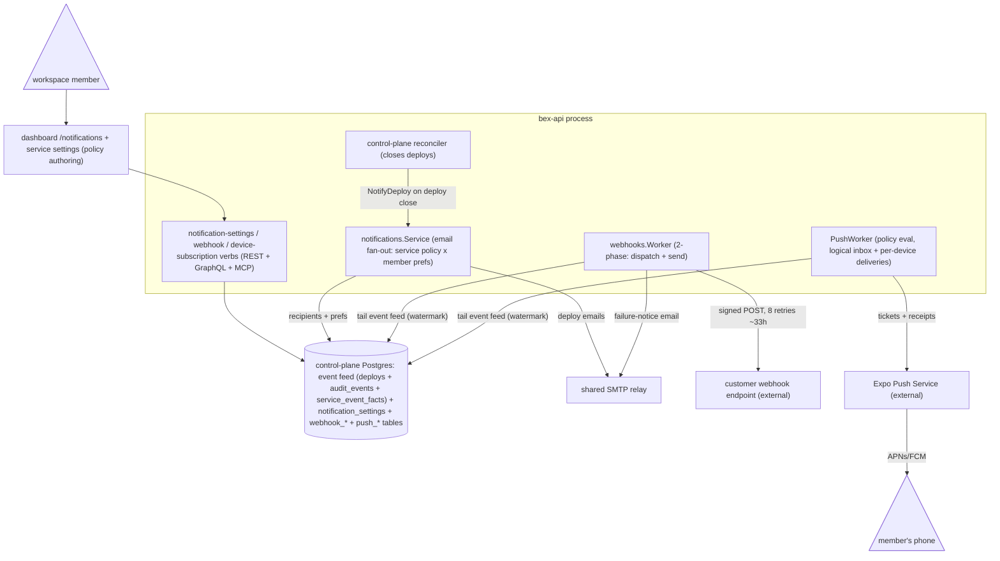

# ADR052 — Notifications: one event feed, three delivery channels

**Status:** Accepted (2026-08-07). **Consolidating ADR** — the notification system is fully built, but its decisions were scattered across parity-ledger rows ([ADR018](ADR018-render-parity.md) lines "Notifications" / "Outbound event webhooks"), the webhook section of [ADR006](ADR006-bex-api.md), the native-push amendment inside [ADR048](ADR048-mobile.md) (D2/w11-m5), two render-artifacts ([notify-on-fail.md](render-artifacts/notify-on-fail.md), [webhooks-ui.md](render-artifacts/webhooks-ui.md)), and five milestone READMEs (w3/m9 → w3/m11 → w3/m15 → w4/m21 → w7/m44, plus w11/m5). This ADR is the single decision of record for the end-to-end architecture. It introduces no new mechanism; its one normative addition is the gap register in **Consequences**.

---

## Context

### What "notifications" means in bex

Telling a human that something happened to their service without them polling the dashboard: a deploy started/succeeded/failed, a cron run failed, a webhook endpoint is failing, a billing state changed. Three audiences consume this: workspace members (email, phone), external systems (webhooks — the machine-facing channel that also serves as bex's Slack/PagerDuty answer), and the member's phone (native push, the ADR048 mobile anchor).

### Render's model (captured 2026-07-14, [render-artifacts/notify-on-fail.md](render-artifacts/notify-on-fail.md))

Render composes **two tiers**: owner-level defaults (`GET`/`PATCH /notification-settings/owners/{ownerId}`, fields `slackEnabled` / `emailEnabled` / `previewNotificationsEnabled` / `notificationsToSend`) and a per-service override (`GET`/`PATCH /notification-settings/overrides/services/{serviceId}`, `notificationsToSend: default|none|failure|all`). The service object's `notifyOnFail` (`default|notify|ignore`) is a read-only mirror. Render has Slack; there is **no per-member tier**.

### How bex got here

The system accreted milestone by milestone: **w3/m9** deploy-notification email (member prefs + `DeployNotifier` reconciler hook), **w3/m11** outbound event webhooks (Render `/webhooks` parity), **w3/m15** the per-service `notificationsToSend` policy, **w4/m21** the legacy `notifyOnFail` compatibility field, **w7/m44** email-content parity, **w11/m5** the native push channel (architecturally complete, release-gated on physical-device evidence). Each recorded its decisions locally; nothing recorded the composed whole — e.g. the fact that email, webhooks, and push are three **independent consumers of one shared event feed** with three different delivery guarantees exists nowhere as a stated design.

---

## Decision

### The end-to-end shape

### D1 — One composed event feed; no emitter bus

There is no generic event emitter, event table, or pub/sub bus. The "event feed" is a **read-time projection over three closed sources** already written for other reasons: `deploys` rows (→ `deploy_started`/`deploy_ended`), `audit_events` rows (one event per authorized write verb, via a closed verb→event map), and `service_event_facts` rows (typed observed facts inserted by the reconciler, webhook intake, and the jobs feature — e.g. `image_pull_failed`, `autoscaling_started`, `job_run_ended`). `lego/backend/internal/events/service.go` renders this projection as Render's `GET /v1/services/{id}/events`; the delivery channels do **not** go through that service — the webhooks `Worker` and `PushWorker` tail the same underlying rows directly through their own durable watermarks (`webhook_watermark`, `push_watermark`), and email is triggered by a direct reconciler callback (D3a). Adding a new notifiable event means adding a **fact producer** (or audit verb), never a bespoke send-site.

Fact producers use one of two idempotency styles, both resting on `service_event_facts.source_key` being the primary key with `ON CONFLICT DO NOTHING`: **stable-key** producers derive a replayable key from the observation (`deploy:<id>:image_pull_failed`, `autoscaling:<app>:<transitionID>:started`), while the **observed-state lifecycle facts** (`server_failed`/`server_available`/`service_suspended`/`service_resumed`) are edge-triggered through the transactional `service_event_checkpoints` diff (`RecordObservedServiceState`, `store/event_facts.go`): each 30s reconcile pass derives phase + availability from the App CR (`Status.Phase`, the `Ready` condition, `ActiveRevision`, with suspend/auto-hibernate reasons and ordinary rollout progress excluded), and a fact is emitted only when the observation differs from the checkpoint. Suspend/resume deliberately exists as **two parallel streams**, matching Render: intent events (`suspender_added`/`suspender_removed`, from the `apps.Suspend`/`apps.Resume` audit verbs at accept time, carrying the actor) and observed convergence facts (`service_suspended`/`service_resumed`, when the operator actually reaches `Hibernated`/`Running`); outbound webhooks use the observed pair.

### D2 — Policy: Render's two-tier model, with a per-member default tier

- **Authoritative per-service field:** `App.spec.notificationsToSend` (`default|none|failure|all`) on the CR (`lego/types/v1alpha1/notification_policy.go`), written by `apps.SetNotificationsToSend` (REST override endpoint `GET`/`PATCH /v1/notification-settings/overrides/services/{serviceId}`, GraphQL `setNotificationsToSend`, MCP `update_service(notificationsToSend:)`, dashboard Service → Settings four-state select). Render's legacy `notifyOnFail` (`default|notify|ignore`) is retained as a bidirectional compatibility projection (`EffectiveNotificationsToSend`), never a second source of truth.
- **Default tier is per-_member_, not owner-wide** — a deliberate divergence from Render: each member's `notification_settings` row carries `deployStarted`/`deploySucceeded`/`deployFailed` email toggles (missing row = failure-only, the migration-0032 default). Resolution: `none` → never, `failure` → failed only, `all` → always, `default` → that member's own prefs.
- **The operator is not in the loop.** Both CR fields are classified `identityOperational` (`lego/operator/internal/controller/release_identity.go`) — changing notification policy never triggers a deploy; the sole functional reader is the control-plane reconciler at deploy close.
- The push channel layers its own richer per-member policy (D3c) on the same `notification_settings` row (`push_policy` jsonb); email and push toggles are independent by design.

### D3 — Three channels, three delivery contracts

**a) Email — the baseline channel (at-most-once, best-effort).** On deploy close the control-plane reconciler calls `DeployNotifier.NotifyDeploy` in a backgrounded goroutine (`store/reconciler.go` → `notifications.Service`, wired in `cmd/api/main.go`); deploy-_started_ email fires on the request path via `StartedNotifier`. The service resolves the D2 policy, fans out to `ListNotifyRecipients` (concurrency 8), resolves addresses through Kratos admin, and sends plain-text (Render's is HTML) through the shared provider-agnostic SMTP relay (`internal/mailer`, same relay as the Kratos courier and invite email). The w7/m44 body matches Render's captured email: impact framing, failing-commit block, `View Logs` deep link (needs `BEX_DASHBOARD_URL`). Delivery is logged-not-returned; there is no email retry queue.

**b) Outbound webhooks — the machine channel (at-least-once, durable).** Render `/webhooks`-compatible endpoint CRUD (admin-tier writes, mint-once `whsec_…` secret — a recorded divergence from Render's retrievable secret) plus a two-phase worker (`internal/webhooks/worker.go`): **dispatch** tails the feed through the durable watermark and fans each event into `webhook_deliveries` rows (multi-replica-safe via unique-index upsert, per-endpoint `CreatedAt` guard against back-dated replay); **send** claims due rows with `FOR UPDATE SKIP LOCKED` and POSTs the thin payload `{type, timestamp, data:{id, serviceId, serviceName, status?}}` — details are fetched back via the API, never pushed. Standard-Webhooks HMAC signing, 15s per attempt, 8 retries on exponential backoff (~33h final), then auto-disable until manually re-enabled; a failure-notice email goes to the endpoint's creator after 3 consecutive failures (suppressed to 1/hour via a durable claim) and always on final disable. `netutil.SafeDialContext` blocks loopback/private/link-local targets and redirects are never followed.

**c) Native push — the bex extension (at-least-once, durable, release-gated).** No Render counterpart. `PushWorker` tails the same feed through `push_watermark`, evaluates each member's push policy (enabled, event filter, minimum urgency, IANA timezone, working/quiet hours, bounded deferral, per-service overrides), and materializes **one caller-scoped logical inbox row** (`push_notifications`) plus **at most one leased delivery per active installation** (`push_deliveries`). Transport is **Expo only** (`device_push_subscriptions` CHECK-constrains `provider='expo'`, ios/android) — there is no web push/VAPID (D6). Tickets then receipts; `DeviceNotRegistered` prunes exactly that token generation; 8-attempt retry; 90-day sweep. The payload is a closed four-field envelope (schema version, opaque notification id, closed event type, short status copy + allowlisted relative route) — never secrets, emails, or logs. MCP deliberately has no device-registration or push-policy tool. The transport is constructed only from the optional out-of-band `bex-system/bex-push` Secret (`BEX_PUSH_PROVIDER=expo` + `BEX_EXPO_PUSH_ACCESS_TOKEN`, installed by `scripts/push-secret.sh`, runbook [runbooks/mobile-push.md](runbooks/mobile-push.md)); production release stays blocked until the w11/m5 physical-device qualification matrix is satisfied.

Two adjacent email streams share the mailer but are **not** part of this policy system and are deliberately not opt-out-able: billing lifecycle notices (ADR040/ADR046 dunning — mandatory admin messages) and workspace invites (ADR024).

### D4 — Settings surface is caller-self-service, not owner-scoped

bex exposes `GET`/`PATCH /v1/notification-settings` (+ `/push`, `/push/availability`, the `GET /v1/notifications` inbox + read-marking, and `/v1/notification-device-subscriptions`) scoped to the **caller** in the workspace — like `/v1/usage`, and unlike Render's `/notification-settings/owners/{ownerId}`. This follows from D2's per-member tier: there is no owner-wide row to address. GraphQL and MCP mirror the same verbs (one `Service` core, thin adapters per ADR006); the dashboard `/notifications` page and the Service-settings row are the only UI writers.

### D5 — Honest disabled states, everywhere

Every dependency is optional and degrades loudly-or-quietly but never wrongly: store nil ⇒ settings/webhook verbs 503 (`ErrEventsUnavailable`/`ErrWebhooksUnavailable`); mailer nil (either `BEX_SMTP_*` unset) ⇒ email paths no-op with a log line; push Secret absent ⇒ no transport is constructed, no Expo calls, queue rows persist unsent, and the API reports `pushNotificationsAvailable=false`, which the dashboard renders as an explicit amber "operator hasn't configured the push provider" banner rather than a silently dead toggle. `BEX_WEBHOOK_BACKOFF` compresses the retry schedule for verification only (`scripts/webhooks-verify.sh`).

### D6 — Non-goals (recorded, with rationale)

- **Slack delivery** (Render's owner-level `slackEnabled`) — recorded non-goal (`.pm/DO_NOT_DO.md`, round 14, 2026-07-15): same external-integration class as the rejected log/metric drains; bex's answer is _point an outbound event webhook at a Slack bridge_.
- **Web push / VAPID / service worker** — not built anywhere; ADR048 keeps PWA/web-push as a complementary self-hoster path that does not gate native.
- **Preview-environment notifications** — `previewNotificationsEnabled` round-trips as `default` only; non-default writes are rejected (bex has no preview environments).
- **In-dashboard notification inbox/bell-center** — the logical inbox is a mobile surface; the dashboard's Bell icon is navigation to the policy page, not a feed. Revisit only with evidence.

---

## Consequences and gaps to close

1. **Resolved (w3/m78, 2026-08-08) — push now projects all four observed lifecycle facts.** `projectPushEvent` maps `server_available` ("Service recovered", Important — closing the Critical `server_failed` page), `service_suspended`, and `service_resumed` (Routine) alongside `server_failed`; the events are selectable across REST/GraphQL/dashboard/mobile with the default policy unchanged (additive opt-in). The closed set turned out to live in **five** mirrors — `delivery_policy.go`, the GraphQL enum, the dashboard picker, the mobile envelope allowlist, and (found by the m78 integration test) the `push_notifications` DB CHECK + `validatePushNotification` map in the store (migration `0069_push_lifecycle_events` widens the CHECK).
2. **Resolved (w3/m78, 2026-08-08) — the crash edge is integration- and live-proven.** `TestPGObservedCrashEdgeEmitsExactlyOnePair` (real-Postgres) drives Running → CrashLoopBackOff → recovered App CR statuses through `observedServiceStateFor` + `RecordObservedServiceState` across repeated resync observations and asserts exactly one `server_failed` + one `server_available` on the composed feed; `TestPushWorkerEnqueuesObservedLifecycleFacts` proves the full chain to a policy-enabled member's durable inbox. The m78 **live crash leg** (dedicated kind cluster, host operator + m78 bex-api, fake loopback Expo) then confirmed the end-to-end behavior — one induced busybox crash-loop → exactly one `server_failed` held through resyncs, one `server_available` on restore, one `service_suspended`/`service_resumed` per suspend/resume, all four as durable inbox rows and real transport sends — **and caught a phantom-page bug**: a reconcile pass landing on stale Deployment status during old-ReplicaSet reaping (KCM catch-up) reported `Ready=False` for a serving service, which the steady-state branch counted as an outage — a phantom Critical `server_failed`+`server_available` pair per slow reap (also fed webhooks). Fixed twice over: the operator now writes reason **`RolloutSettling`** when its live pod scan shows the full current-revision complement Ready while only Deployment bookkeeping lags (excluded from availability like `Suspended`/`AutoHibernated`), plus a **single-tick unhealthy debounce** in the store reconciler (`debounceUnhealthy` — second consecutive observation records; recovery immediate). The recorded residual — multi-minute operator informer staleness (control-plane incidents) re-concluding a crash-era `Ready=False` twice in a row and slipping a phantom pair through the debounce, tracked as `w3/016` — is **resolved (w6/m41, 2026-08-18)**: the reconciler now refuses an unhealthy conclusion whose `Ready` condition `LastTransitionTime` predates the last recorded healthy checkpoint (`rejectStaleUnhealthy`, ordered on the operator's own condition clock via `service_event_checkpoints.healthy_transition_at`, failing open whenever the order is unknowable), and each refusal increments `bex_controlplane_observed_state_rejections_total{reason="stale_transition"}` so the suppression is a readable signal instead of a silent drop.
3. **Auto-hibernation emits `service_suspended` with no paired intent event.** The checkpoint keys on `Phase==Hibernated` only, so free-tier auto-sleep produces the same observed fact as a user suspend, with no `suspender_added`. Deliberate (it _is_ an observed suspension) — recorded here so it isn't later "fixed" into asymmetry with Render's observed-event semantics.
4. **`usage_threshold` was retired from the event vocabulary (2026-08-18, `w6/021`).** Its only producer (`w8/001`) was retired without implementation, so the value could never fire; it is removed from `DeliveryEvent`, the GraphQL `PushNotificationEvent` enum, the dashboard picker, and the mobile generated types. Read paths (`GetPushSettings`, `storedPushDeliveryPolicy`) silently drop retired values from stored policies via `dropRetiredDeliveryEvents`; the write path stays strict. Re-adding it is a fresh proposal gated on the evidence `w8/001`'s retirement requires.
5. **Push is code-complete but not release-qualified** — the gate is operational (EAS project, APNs/FCM credentials, physical-device evidence; w11/m5/t007), not architectural.
6. **Deploy-started email is request-path, not feed-tailed** — it shares neither the durable watermark nor any retry with the close-path emails; an api crash at trigger time loses it. Accepted for a started-notice; worth revisiting only if email ever gains durable delivery.
7. **Three consumers, three delivery guarantees** — email at-most-once, webhooks/push at-least-once — is deliberate (an email retry queue buys little; a missed webhook breaks integrations). State it, don't "fix" it.
8. **Known Render divergences stand:** per-member (not owner-wide) defaults, no Slack, plain-text email, deploy-started included in `all`, mint-once webhook secrets. Each was an explicit choice; enterprise parity pressure would reopen the first.

## Alternatives considered

- **A generic event bus / emitter-side event table** — rejected from the start (w3/m7 lineage): the read-time projection over rows that already exist for audit/deploy/fact purposes needs no dual-write, cannot drift from reality, and keeps the event vocabulary closed and enumerable (the webhook picker and push policy validate against it).
- **One unified dispatcher for all channels** — rejected: the channels have different durability needs, different policy inputs, and different failure blast-radii; three small consumers over one feed proved simpler than one configurable worker.
- **Native Slack integration** — rejected (D6); webhooks-as-integration-primitive is the standing answer.
- **Web-push-first delivery** — the original ADR048 lean, superseded by the 2026-08-02 Expo directive; push reliability and OS credential storage won.
- **Owner-scoped settings endpoint (full Render shape)** — rejected in favor of caller-self-service; bex's member tier makes the owner path meaningless, and impersonating another member's prefs is an anti-feature.
