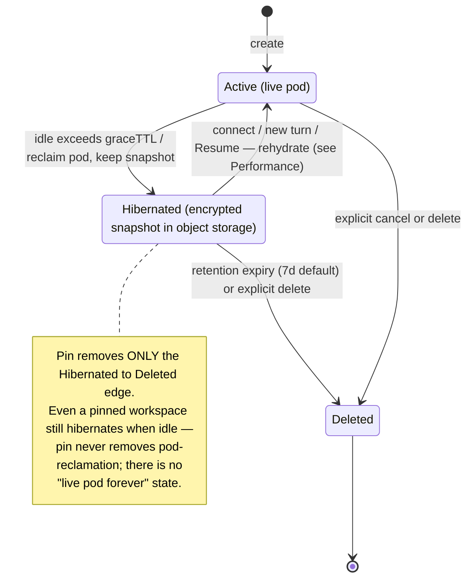

# ADR059 — Agent-sandbox hibernation: durable resume for coding-agent sessions

**Status:** Accepted (2026-08-15). The **complete model is decided here** (persistent agent workspace; Active/Hibernated/Deleted state machine; hibernation as the mandatory cost foundation; an opt-in **pinned** never-expire tier; metering + quotas). The one gated decision — whether hibernation reuses OpenSandbox's native `Suspend` (A) or is self-owned tar→object-storage (B) — was resolved by the **D7 spike (w2/m68/t001, 2026-08-15): B** (native `Suspend` is OCI-registry-backed, not usably durable past Terminate in bex, and high-cardinality — all three A-preconditions fail; see D3 and `.pm/w2/m68/evidence/2026-08-15-d7-opensandbox-snapshot-spike.md`). The **Active tier shipped** in w2/m67 (idle grace + per-workspace live cap); the Hibernated tier (B) is w2/m68 t003+. Refines [ADR042](ADR042-sandbox-cluster-substrate.md) (substrate + snapshots — rootfs v1, memory hibernation a watch item) and [ADR047](ADR047-cloud-coding-agent-sessions.md) (session lifecycle D4/D8); uses [ADR050](ADR050-encrypted-platform-backups.md) (backup encryption); motivated by [ADR054](ADR054-open-in-zed.md) (Open in Zed).

---

## Context

### The product need

ADR054 shipped "Open in Zed": SSH into an agent session's sandbox and edit `/workspace`. But agent sessions are **fire-and-forget** — the sandbox is destroyed ~15s after a turn completes — so a real editing workspace (start a session, come back tomorrow, your uncommitted changes and installed tooling still there — the Devin-style "editor workspace tab" ADR047 D9 named as a differentiator) does not exist yet. The user asked for an idle-based TTL ("keep alive while active, reclaim after N days idle"). That is only affordable if idle sandboxes stop costing compute — which is the substance of this ADR.

### How resume works TODAY (from the code)

There is **no durable hibernation**. A sandbox has two states — **alive (resumable)** or **Terminated (gone)** — with no "reclaimed but restorable" middle state:

- **`Resume`** (`agentsessions/service.go` `Resume`/`runResume`) refuses when `sandbox_id == ''` or the session is canceling/canceled (`AGENT_SESSION_NOT_RESUMABLE`), then wakes the sandbox via `SandboxLifecycle.ResumeAgentSessionSandbox` → OpenSandbox `Client.Resume` — which **un-suspends the SAME pod** (its k8s-level env persists independent of the rootfs snapshot the `bex-pre-snapshot` hook scrubs, `sandbox/service.go`). So Resume only works **while the sandbox still exists**.
- **The completion path never suspends.** The Completer's `teardown` calls `CancelAgentSessionSandbox` = **Terminate**, and (ADR054 D6) clears `sandbox_id`. So once a finished session is reaped, the sandbox and all its state are **gone** — Resume then fails closed. Resume is usable only inside the brief window the sandbox is still alive (e.g. ADR054 D6's teardown deferral while an SSH session is open).
- **`Steer`** re-dispatches a **fresh** sandbox and re-clones the branch — discarding any uncommitted local changes in the prior sandbox.
- OpenSandbox **does** have a suspend/resume rootfs snapshot (`Suspend` runs `bex-pre-snapshot` to scrub credentials, then snapshots). But **where that snapshot lives, whether it survives Terminate, and whether it scales to many sandboxes are internal to OpenSandbox and not visible in our code** — the core unknown this ADR must resolve (D7).

Net: the "resume" a user hits today is "wake a not-yet-destroyed sandbox," not "restore a retained snapshot." The missing capability is **reclaim the pod but keep a cheap, resumable snapshot**.

### What comparable products do (survey, 2026-08)

| Product | Snapshot store | Contents | Trigger | Retention |
| --- | --- | --- | --- | --- |
| **Gitpod** (containers on k8s) | **Object storage (S3/GCS)** — tar `/workspace`, restore into a fresh container | filesystem-only | on stop / node evict | 14d (28d if dirty git) + admin recovery |
| **GitHub Codespaces** | **Persistent volume** kept on stop (billed GB-hours) | disk state | idle stop (30m; 5m–4h) | 30d idle (0–30 configurable) |
| **E2B** (Firecracker microVM) | microVM snapshot | **filesystem + memory** (live processes) | timeout auto-pause; traffic auto-resume | indefinite (explicit kill) |
| **Modal** | fs/dir snapshots = **purpose-built image-diffs + TTL GC**; memory = `pages` file | fs / dir / memory | external controller, pre-termination | 30d fs, 7d memory |
| **Cloudflare Sandbox** (containers on Durable Objects) | **Object storage (R2)** — `createBackup()`/`restoreBackup()` of `/workspace` (or FUSE-mount R2/S3/GCS); native full-disk snapshot rolling out post-GA | filesystem-only (Durable-Object state survives hibernation transparently; the MicroVM disk needs the R2 backup) | on suspend/auto-stop (`onActivityExpired` → `createBackup`), restore on wake | **7d default TTL** enforced by R2 lifecycle rules; idle `sleepAfter` default 3–10m |
| **Vercel Sandbox** (Firecracker microVM) | Vercel-managed snapshot store (opaque; not tenant-visible) | filesystem + installed packages (disk snapshot; **persistent by default**, `persistent:false` to opt out) | on stop/timeout → snapshot; next call resumes from the latest | **7d default** (configurable / none); max session 45m Hobby–24h Pro |

Load-bearing learnings:

- **Nobody puts per-instance state in a general OCI registry.** Modal stores fs snapshots "as images" but on a **bespoke high-cardinality diff store**, not a standard registry with manifests/tags/ACLs. For bex's Zot, per-sandbox commits would explode manifest/tag/ACL cardinality and fight Zot's retention model — the user's objection is correct.
- **The container-on-k8s peer (Gitpod) chose object-storage tar of the working dir.** That is the closest analog to bex and validates the object-storage direction.
- **Long retention is only ever on cheap snapshot storage, never a live pod.** 3 days is conservative vs the 14–30d norm — but every product that keeps state for days keeps a _snapshot_, not a running instance.
- **Filesystem-only is enough for "come back and edit."** Memory-level resume (E2B/Modal, ~1s with live processes) needs Firecracker/CRIU — out of scope for bex's gVisor/container v1 (ADR042 watch item).
- **Snapshots are triggered externally** (Modal/Gitpod/Cloudflare/Vercel all fire the snapshot from a controller/lifecycle hook on suspend, not from inside the sandbox) — matching bex's Completer-driven reaper.
- **Dirty git working trees extend retention** (Gitpod) — protect unpushed work longer.
- **Cloudflare independently lands on exactly D3's option B** — object storage (R2) backup of `/workspace`, fired on suspend (`onActivityExpired → createBackup`), restored on wake, GC'd by an R2 lifecycle rule. A same-substrate (containers, not microVM) peer choosing the self-owned tar→object-storage pattern is the strongest single validation here.
- **7 days is the de-facto default TTL** — Cloudflare's snapshot SDK, Vercel Sandbox, and Modal's memory snapshots all default to **7d**. bex's D4 default should be **7d** (not 3), still well under Gitpod's 14/28d.
- **Idle timeouts are short (minutes), retention is long (days).** Every product separates a short _idle-to-snapshot_ (Cloudflare 3–10m, Codespaces 30m, Vercel default 5m) from a long _snapshot-to-delete_ (7–30d). bex's Active-tier idle grace + D5 retention are the same two knobs.

---

## Decision

The **complete target model is decided now** — data model, state machine, and primitives. Implementation is sequenced only where an external unknown forces it (the spike, D7); nothing below is a throwaway interim, and the first shippable tier (Active + idle grace + caps) is a strict subset of the final model, not a stopgap.

### D1 — The persistent unit is an agent _workspace_, not a session

Introduce a durable **agent workspace**: the environment that outlives any single turn — the mutable working tree (`/workspace`), installed tooling, and `~/.zed_server`. ADR047 sessions/turns run _inside_ a workspace; a turn is a unit of work, the workspace is what persists. This mirrors Codespaces/Gitpod (the workspace, not the task, is the durable unit). Fire-and-forget stays the **default** (an unpinned workspace is reaped when idle); persistence is **opt-in** (D5 pin).

### D2 — State machine

- **Active → Hibernated**: `idle > graceTTL`, where `idle = now − max(last turn end, last connect/disconnect)` and **never counts down while connected**. Reclaims the pod, keeps the snapshot.
- **Hibernated → Active**: on connect / new turn / `Resume` — rehydrate from the snapshot.
- **Hibernated → Deleted**: retention expiry (D5) or explicit delete. **Pinned removes only this edge.**
- **Active → Deleted**: explicit cancel/delete.

Crucially, **even a pinned workspace passes through Hibernated when idle** — pin removes the Deleted edge, never the pod-reclamation. There is no "live pod forever" state.

### D3 — Hibernate: the mandatory foundation (fs snapshot → object storage)

Converge the workspace's **mutable state** onto a known mount (`/workspace` + the HOME dirs that matter — working tree, `~/.zed_server`, tool/dep caches) and snapshot **that**, not the whole rootfs. Store it in **object storage** (S3-compatible, per-workspace prefix, **ADR050-encrypted**), the way Gitpod and Cloudflare do — object storage scales to an unbounded number of small per-instance blobs and imposes no manifest/tag/ACL cardinality. **Not** a general OCI registry (per-instance commits explode Zot's manifest/tag/ACL model; Modal-style image-diffs need a bespoke store Zot isn't).

**Decision (D7 spike, 2026-08-15): B.** The spike (`.pm/w2/m68/evidence/2026-08-15-d7-opensandbox-snapshot-spike.md`) found all three A-preconditions fail: OpenSandbox's snapshot is (i) an **OCI image pushed to Zot** (`--snapshot-registry=zot.bex-registry.svc:5000/snapshots`; `SandboxSnapshot.status.containers[].imageUri`+`imageDigest`), not object storage; (ii) **not usably durable past Terminate in bex** — bex's `Suspend` only sets `spec.pause=true` on the **same pod** and never creates a `SandboxSnapshot`, and OpenSandbox's own resume/unpause Job is pinned to `status.sourcePodName`+`sourceNodeName`, so Terminate orphans any pushed image with no restore-into-fresh-pod path; and (iii) **high-cardinality** — one repo per sandbox-container + a tag per snapshot + a privileged commit Job per pause, the exact registry blow-up this ADR rejects. So bex self-owns:

- ~~**A (minimal)** — reuse the native `Suspend` snapshot.~~ **Rejected by the spike** (fails all three preconditions above).
- **B (self-owned, Gitpod/Cloudflare pattern) — chosen.** A pre-hibernate step scrubs credentials (reusing the existing `bex-pre-snapshot` hook, `service.go:734-751`) then tars the mutable mount → **ADR050-encrypted object storage under a per-workspace prefix** (greenfield — no S3 wiring exists in the sandbox path today); resume runs a fresh pod with an **initContainer that hydrates** the mount from the blob (base image node-cached). Full control, known scaling. **Snapshot installed dependencies, not just source** — that is what skips the ~30s reinstall on resume (see Performance). uid 10001 preserved through restore; corrupt-blob restore falls back to a clean re-clone with an explicit failure note.

### D4 — Resume/rehydrate: filesystem restore into a fresh pod

Resume = **files intact, process cold-restarts** (Gitpod/Codespaces model), sufficient for "come back and edit `/workspace`." Memory-level resume (live processes, loaded models) is **out of v1** — needs Firecracker/CRIU (ADR042 watch item). Latency budget + SLOs are the **Performance** section below. `Steer` must stop clobbering an editable working tree: preserve the workspace's mutable state across a steer instead of re-cloning over it.

**w5/m71 turn-accounting amendment (2026-08-17).** Resume-without-prompt restores only the workspace: it sets `BEX_AGENT_PROMPT` empty and does not advance `turns`, so it cannot silently rerun `agent_config.task`. Hibernated Steer first inserts exactly one durable prompt turn, advances once at acceptance, then restores and runs that prompt. If fresh-pod provisioning fails, the snapshot remains retriable and the accepted turn remains settled as incomplete rather than disappearing or being renumbered.

### D5 — Retention & the **pinned** primitive

- **Default (unpinned)**: idle → hibernate → **delete after 7 days** (industry de-facto default; dirty git working tree extends it, à la Gitpod 14→28d). This is fire-and-forget, just cheaper.
- **Pinned (opt-in)** — the "never expire" primitive (= Gitpod pinned workspace / Cloudflare `keepAlive` / Codespaces keepAlive): idle → hibernate as usual, but the snapshot's **Deleted edge never auto-fires**. Pin does **not** keep a live pod.
- **Guardrails so "never expire" ≠ unbounded**: a pinned snapshot is **still metered/billed** (storage) and **quota'd per plan** (pin at most N workspaces). Unpin → back on the 7-day clock. This keeps "never expire" honest — cheap and bounded, not free-and-infinite.

### D6 — Cost visibility & control (hard prerequisite for pin / days-scale retention)

Metering counts **hibernated snapshot storage distinctly from live compute** (ADR047 D7 lineage); the tenant **sees** "N workspaces — M active (compute), K hibernated (storage), J pinned — costing Y" and can **stop / delete / unpin** any of them. A **per-workspace concurrent-live-pod cap** bounds live compute; the **pin quota** bounds durable storage. Days-scale retention or pinning without a visible bill + a stop button is bill-shock and does not ship without this.

### D7 — The only sequencing gate: the OpenSandbox snapshot spike — **RESOLVED (2026-08-15): B**

Determine, against the deployed OpenSandbox: **where its snapshot lives, whether it survives Terminate, and how it scales.** The answer picks A vs B in D3 — and it is the _one_ thing the design cannot decide on paper. Everything else (the state machine, the workspace model, pin, retention, billing) is settled here. The **Active tier** (live-pod idle grace measured by last interaction + per-workspace cap, extending ADR054 D6) is the natural first increment — a real subset of D2, usable immediately for Open in Zed, not a throwaway — and **shipped in w2/m67**.

**Spike outcome (w2/m68/t001, full findings in `.pm/w2/m68/evidence/2026-08-15-d7-opensandbox-snapshot-spike.md`):**

- **Where it lives:** an OCI image in the in-cluster **Zot registry** (`--snapshot-registry=zot.bex-registry.svc:5000/snapshots`, pushed by an image-committer commit Job; `SandboxSnapshot.status.containers[].imageUri`+`imageDigest`). Rootfs-only, no memory/CRIU. **Not** object storage — there is no S3 wiring in the sandbox path at all.
- **Survives Terminate:** not usably. bex's `Suspend` only sets `BatchSandbox.spec.pause=true` and resumes the **same pod**; bex never creates a `SandboxSnapshot`, and OpenSandbox's own unpause Job is pinned to `status.sourcePodName`+`sourceNodeName`. Terminate deletes the pod and orphans any pushed image — no restore-into-fresh-pod path exists.
- **Scales:** no — one registry repo per sandbox-container + a tag per snapshot + a privileged commit Job per pause; the per-instance manifest/tag/ACL explosion this ADR already rejects.

All three A-preconditions fail ⇒ **B chosen** (self-owned tar → ADR050-encrypted object storage, per-workspace prefix, initContainer hydrate on resume). D3 records the decision; this flips the ADR to Accepted.

---

## Performance

The user-visible latency is **Hibernated → Active** — opening Zed or starting a turn on a hibernated workspace. Because v1 is filesystem-only (cold process, no memory restore), the budget is four phases:

| phase | what | typical (warm node) | dominant factor | lever |
| --- | --- | --- | --- | --- |
| 1. schedule + base image | pod scheduled on the `bex-sandbox` pool; base image pulled | ~1–2s (pre-pulled) | image cached on node? | **warm pool / pre-pulled base image** on the pool |
| 2. download snapshot | initContainer fetches the encrypted blob from object storage | <1–few s (in-region) | blob size / bandwidth | **diff-only** + zstd; size quota (D6) |
| 3. decrypt + extract | age-decrypt + untar+zstd into the mount | ~1–few s | blob size / CPU | parallel download+extract; zstd level tuned for restore speed |
| 4. process boot | container + driver/agent start; Zed's `zed-remote-server` is **already in the snapshot** — no re-upload | ~1–3s | — | keep the server binary in the snapshot |

**Targets (SLO), warm node + modest working tree: p50 resume < ~5s, p95 < ~15s.** Cold-node resume is bounded by pre-warming the base image, not by the snapshot.

**Production enablement (w2/m77, 2026-08-19):** the Hibernated tier is **armed** — dedicated Wasabi bucket `bex-agent-snapshots` (never `bex-tfstate`), automatic AES-256 at rest, bucket-scoped IAM user, Secret `bex-system/bex-agent-snapshot`. bex-api consumes the six `BEX_AGENT_SNAPSHOT_S3_*` keys via optional `secretKeyRef`s; delete the Secret to roll back to Terminate-only reclaim. Retention stays 168h (dirty-git doubling) and the pin quota stays 10. Live walk (session `ags-da33092c0fus738gr25g`, modest tree): Completer hibernated to `agent-snapshots/<ws>/…` (pod gone); Steer restored `/workspace` including the uncommitted marker. Resume-latency log lines: **3.123s, 3.133s, 3.246s** on a warm node (inside p50<~5s / p95<~15s) and **23.341s** on the first pull of a newly pinned agent-sandbox image (cold-node, image-bound — matches the table above). Evidence: `.pm/w2/done/m77/evidence/2026-08-19-hibernate-rehydrate-walk.md`.

**Why this beats the status quo:** a fresh sandbox with **no** snapshot pays re-clone + reinstall ≈ **30–60s** (Cloudflare measured ~30s). Snapshotting **installed dependencies** (not just source) is what buys the win — the trade is a bigger blob (phases 2–3, a few seconds) for skipping the ~30s install. Cloudflare and Vercel both snapshot "installed packages" for exactly this reason.

**Honest positioning vs peers:**

- **Slower than E2B / Modal / Vercel (~1s, sometimes ms)** — they restore **memory** via Firecracker/CRIU, so live processes come back instantly. We cold-boot the process. Matching them needs microVM/CRIU (ADR042 watch item, deferred).
- **On par with Gitpod / Cloudflare's filesystem-restore path** — same substrate (containers), same order of magnitude (~2–3s boot + size-proportional restore).
- Blob size is bounded by the **pin/size quota** (D6) for **both** cost and latency — an unbounded working tree makes phases 2–3 the whole resume time (Gitpod's 30G disk-full scars).

## Security and isolation

A snapshot is tenant data — the working tree and possibly credentials on disk. It must be **per-workspace scoped** (prefix + ACL, never cross-tenant readable) and **encrypted at rest** (ADR050). The `bex-pre-snapshot` credential scrub already runs before OpenSandbox snapshots; reuse/extend it so a snapshot never carries a live token. gVisor + the dedicated node pool + `automountServiceAccountToken: false` (ADR042/ADR047) are unchanged.

## Failure modes to design for (from Gitpod's scars)

- **Disk-full on restore** → enforce a working-dir quota; fail with a clear message, not a half-restore.
- **tar permission/ownership errors** → preserve uid/gid (uid 10001) on snapshot and restore.
- **Partial/corrupt snapshot** → checksum; on mismatch fall back to a clean re-clone (lost local edits, but a working sandbox) rather than a broken restore.

## Consequences

- Agent workspaces become genuinely persistent (and **pinnable to never expire**); idle cost drops from a live pod to a cheap encrypted blob; no registry pollution; resume is single-digit seconds (Performance).
- New surface: the workspace object + its state machine + a snapshot store + a hydrate path + retention/GC + the `pinned` primitive + a billing dimension (compute vs storage) + a see/stop/delete/unpin surface + quotas. The **Active tier lands first** as a real subset (usable for Open in Zed now); the storage implementation (A/B) waits only on the D7 spike — nothing is built to be torn out.
- Resume is **cold** (no live processes) in v1 — acceptable for "come back and edit"; memory-level hibernation (~1s live-process restore) stays a future ADR.
- "Never expire" is real but **bounded**: pinned snapshots are billed + quota'd, so persistence can't silently become unbounded free storage.

## Non-goals

- **Memory-level hibernation** (CRIU / Firecracker microVM snapshots, ~1s live-process restore) — deferred; ADR042 watch item.
- **Keeping sandboxes alive as live pods for days / "never expire" as a live pod** — the entire point is to reclaim the pod and retain only a cheap snapshot; pin removes the delete clock, not the pod-reclamation.
- **Per-request billing** of agent sessions (unchanged from ADR047 D7: compute-seconds + token passthrough; this ADR adds a storage dimension for hibernated/pinned snapshots).
- **A general "durable disk" product** — scoped to agent-workspace working state, not arbitrary tenant volumes.
