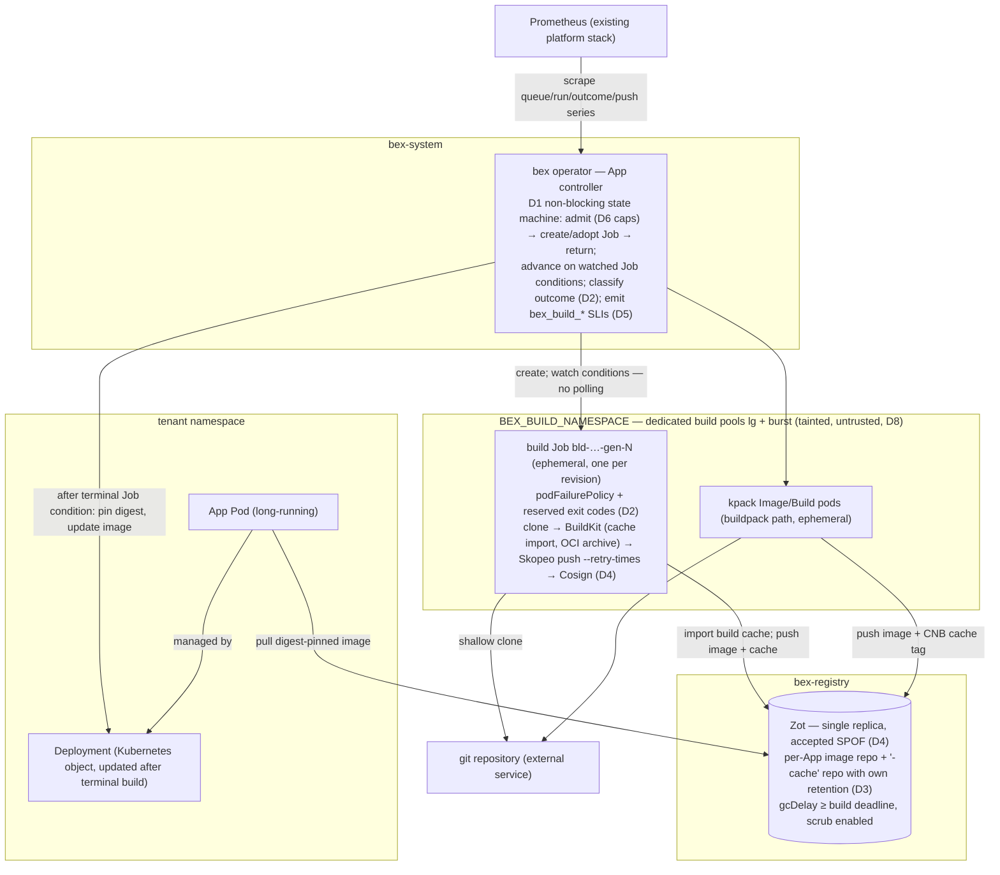

# ADR060 — Build-worker reliability and performance: async dispatch, failure classes, remote cache, and build SLOs

**Status:** Proposed · 2026-08-15

Refines [ADR034](ADR034-scalable-build-pipeline.md), which accepted the ephemeral-builder architecture and explicitly deferred three follow-ups: the non-blocking reconcile, atomic admission, and remote cache. This ADR turns those deferrals — plus the reliability and observability gaps found since — into one coherent plan, informed by how the current fast-build platforms (Depot, Namespace, Docker Build Cloud, Railway, Fly.io) and the Kubernetes-native build systems (kpack, Tekton, Kueue) solve the same problems.

## Context

### What exists today

The build plane is `lego/operator/internal/build/` dispatched from the App controller. One admitted build is one ephemeral Kubernetes Job (`bld-<name>-gen-<generation>`) in `BEX_BUILD_NAMESPACE`: a shallow-clone init container, a rootless-confined BuildKit init container exporting an OCI archive, a Skopeo push, and optional Cosign signing — the serial credential-isolated topology whose security closure is recorded in ADR034. The buildpack extension is a kpack `Image`. Deterministic names give idempotent adopt-on-restart; newest-wins cancellation, the best-effort `BEX_MAX_CONCURRENT_BUILDS` workspace cap, a 30-minute `activeDeadlineSeconds`, UID-scoped teardown, and the Pending-vs-Building budget split (added after the 2026-08-11 false-timeout incident) all work as ADR034 specified.

### What the evidence says is wrong

An audit of the build plane (2026-08-15) against current industry practice found the following, in descending order of leverage:

1. **Builds still block a reconcile worker.** `build.Build` polls the Job in-line for up to 30 minutes (`build/build.go`), so platform-wide build concurrency equals `BEX_APP_RECONCILE_WORKERS`. ADR034 §5 named the non-blocking refactor as "the next scaling step"; it has not happened. This synchronous-wait-in-Reconcile shape is a documented operator anti-pattern that Eclipse Che and the GitLab operator each had to refactor away from, and every surveyed build system (kpack, Tekton, Argo Workflows) is a watch-driven state machine that never blocks. Railway's non-Kubernetes equivalent is a Temporal workflow per build with heartbeats.
2. **One attempt, no failure classification.** Build Jobs run with `backoffLimit: 1` and no `podFailurePolicy`. A transient infrastructure disruption (node drain, preemption, registry blip) fails the tenant's deploy exactly like a genuinely broken `npm build` — both surface flatly as `BuildFailed`. The `safe-to-evict: "false"` annotation patched one known transient cause (cluster-autoscaler eviction killed builds repeatedly in production) but nothing classifies the rest. Kubernetes 1.31 made the correct primitive GA: `podFailurePolicy` rules over exit codes and pod conditions.
3. **Every Dockerfile/native build is a clean build.** BuildKit configures no `cache-from`/`cache-to` (ADR034 §6 acknowledged this). Only the kpack path has a registry cache (`<image>-cache` tag). Meanwhile every commercial fast-builder treats cache as the product: Depot attaches per-project NVMe-backed volumes, Namespace forks copy-on-write cache volumes per build, Railway pins projects to warm buildkitd cells via rendezvous hashing. The cheapest first step for bex — registry-backed cache in the Zot we already run — is unimplemented.
4. **Zero build-plane metrics.** ADR034 declared queue wait, active/queued counts, duration/outcome, scheduling latency, and push latency "required operational signals." The operator emits none of them (its only Prometheus collector is the egress meter). Diagnosis is kubectl archaeology; `build_seconds` metering in bex-api is billing data, not an SLI.
5. **The production baseline is ambient, not checked in.** The code defaults are one reconcile worker and an **unlimited** workspace cap (`lego/operator/cmd/manager/main.go`); neither `BEX_APP_RECONCILE_WORKERS` nor `BEX_MAX_CONCURRENT_BUILDS` is set anywhere in `deploy/gitops/`. (Verified live 2026-08-15: production **does** run ADR034's 2/2 baseline, via out-of-band env — so this is an auditability gap, not an active misconfiguration. D7 closes it.)
6. **Registry weather is unhandled.** The Skopeo push runs without `--retry-times`; transient 5xx during push is normal registry behavior. Zot is a single-replica StatefulSet on one RWO PVC that has already filled once (40 Gi → opaque 500s on every concurrent push, since grown to 100 Gi), and recent Zot releases changed GC defaults (untagged manifests now deleted after `gcDelay`, default 1h) — exactly the class of change that can eat in-flight pushes or a future build cache.

Four production incidents already shape this plane: the two OOM/node-loss incidents that produced the node-exclusive 7 Gi request (ADR034 §3), the autoscaler-eviction failures that produced `safe-to-evict: "false"`, and the Pending-time misattribution that produced the queued/building split. Each was fixed reactively; this ADR is the proactive pass.

### Non-goals

- The platform's own GitHub Actions CI (`.github/workflows/`) is out of scope; this ADR is about the tenant build plane. (Its ad-hoc per-step retry loops would benefit from a shared primitive, but that is a separate, smaller change.)
- Multi-arch/native-arm builders, and build compute tiers as a paid product knob (Render's "Performance" pipeline), are product decisions deferred to pricing work.

## Decision

Eight decisions, ordered by leverage. D1–D2 are the reliability core, D3–D4 the performance core, D5 makes both observable, D6–D8 close configuration, admission, and capacity-topology gaps.

### Target architecture



The structural change versus ADR034's as-built diagram is the operator→Job edge: "create; poll status every 3s" becomes "create; watch conditions" — the reconcile returns immediately and re-enters on Job events, while retry/timeout policy moves into the Job spec itself (D2) and the cache round-trip is a new Job↔Zot edge (D3).

### D1 — Non-blocking build state machine in the App controller

App reconciliation stops waiting on builds. The reconcile path becomes the level-triggered shape ADR034 §5 sketched:

1. validate and admit the requested build;
2. create or adopt the deterministic Job (or kpack Image);
3. record `Building` (or `BuildQueued`) in App status and **return from Reconcile**;
4. re-enter from watch events — the controller adds `Owns(&batchv1.Job{})` (with the build-namespace cache scope) so Job condition transitions trigger reconciliation; a bounded `RequeueAfter` covers the kpack path and clock-based deadlines;
5. on a terminal Job condition, classify the outcome (D2), resolve the pushed digest, and continue the rollout exactly as today.

All state the wait loop currently holds in-process (elapsed budget, queued-vs-building, cancellation) moves into App status + Job observation, which also removes the restart wart where a manager restart granted an adopted build a fresh 30-minute operator-side clock while the Job's own deadline kept running.

After D1, `BEX_APP_RECONCILE_WORKERS` returns to being a plain control-plane responsiveness knob (ADR034's stated end-state), and build parallelism is governed solely by admission (D6) and node capacity. The App-deletion fast-path (today: uncached read every poll) is subsumed by the watch on the App itself.

The pre-deploy Job observer is already non-blocking (single `Get` + requeue in `internal/predeploy`); D1 brings builds to the same shape rather than inventing a new one.

#### D1a — Supersede semantics: run-to-completion, single latest-pending slot

ADR034 shipped "newest-wins per App: a newer revision **cancels the older active build** before starting" (`build.CancelActiveBuilds`). That preempts in-flight work: whenever push cadence is shorter than build duration, every build is killed before it finishes, so the plane can spin indefinitely with **zero completed deploys** — a livelock, not a slowdown, observed in production as continuous cancel/redeploy churn. Adding capacity does not fix it; the semantics are wrong under load.

**Decision.** Supersede acts on **pending** work only, never on an in-flight build — the model Render and Vercel both use (a newer push replaces a _queued_ deploy; an _in-progress_ build runs to completion). Concretely, once D1's non-blocking state machine drives the build phase:

1. **Run-to-completion.** The generation whose build Job is already running (the _active build_, recorded in App status) is never canceled by a newer generation. It runs to a terminal Job condition and — once its image is pushed (the **point of no return**) — rolls out.
2. **Single latest-pending slot.** While a build is active, a newer requested generation does not advance the release generation or start a second Job; it is coalesced into one implicit pending slot (the current spec, whose release fingerprint differs from the active release's). Intermediate generations between the active build and the latest request are skipped, never queued individually.
3. **Promotion.** When the active build reaches terminal state — succeeded-and-rolled-out, or failed — the reconcile advances to the latest pending generation and dispatches its build.
4. **Preserved preemptions (the only two that touch a running Job):** the explicit user Cancel verb (`w2/m10` — human intent, not supersede) and the Job's own `activeDeadlineSeconds` (30-minute stuck-build reap). A failed or timed-out build releases the slot immediately.

**Guarantee.** In any window of roughly one build duration, at least one deploy completes; after pushes stop, the App converges to the latest requested commit within one build cycle. This is strictly weaker than "every commit deploys" (intermediate commits are coalesced, as on Render/Vercel) and strictly stronger than the shipped behavior (which guaranteed nothing under sustained pushes).

**Rejected alternative — webhook-intake debounce.** Coalescing pushes in a time window at the bex-api webhook intake reduces build churn but does not provide a forward-progress guarantee (a push exactly per window still starves), and it hides the real generation history. It stays available as a future pressure-relief knob layered _on top of_ this semantics fix, not a substitute for it.

**Render-parity check (w2/m72 + w2/018).** The operator and backend preserve the deploy-status wire vocabulary unchanged across REST/GraphQL/MCP — `BuildQueued`→`queued`, `Building`→`build_in_progress`, `Deploying`→`update_in_progress`, `Running`+active→`live`, failures→`*_failed` (`internal/store/reconciler.go` `observedDeployStatus`) — so the dashboard renders no bex-only state. The backend now mirrors the operator's run-to-completion/latest-pending model instead of force-closing the active deploy row at trigger time: one executing row remains open, one latest pending row is `queued`, and another push cancels only the replaced queued row. The reconciler processes both rows but applies App evidence only to the matching `status.releaseGeneration`, so the intermediate generation that actually serves traffic reaches `live`; when the queued generation later reaches `live`, the earlier row becomes `deactivated`. This matches Render's documented [Wait overlap policy](https://render.com/docs/deploys#handling-overlapping-deploys) without inventing a twelfth `superseded` API value. Separate partial unique indexes enforce one active plus one queued row per App, and the App-row lock makes concurrent trigger coalescing deterministic.

### D2 — Failure classification: distinct exit codes + `podFailurePolicy`, retry only what retrying can fix

The principle, applied uniformly by GitHub Actions/GitLab/Buildkite postmortem practice: **never auto-retry a deterministic user failure; always absorb infrastructure disruption.** Concretely:

- The build phases adopt **reserved exit codes**: the clone, BuildKit, push, and sign containers each exit with a distinct code for "tenant input failed" (bad ref, Dockerfile error, build command failed) versus their transient classes (network/registry 5xx). The wrapper scripts are already ours; this is shell-level work. `terminationMessagePolicy: FallbackToLogsOnError` captures the tail for status messages.
- Build Jobs gain a `podFailurePolicy` (GA since Kubernetes 1.31):
  - `Ignore` on the `DisruptionTarget` pod condition — node drain, preemption, taint eviction retry **without** consuming the backoff budget. This generalizes the `safe-to-evict` patch and is the prerequisite for ever using interruptible capacity for builds.
  - `FailJob` on the tenant-error exit codes — fail immediately, zero wasted retries, unambiguous attribution to the user.
  - Everything else counts against a raised `backoffLimit: 2` — up to two automatic attempts for unclassified/transient infra failures.
- **OOM (exit 137) is deterministic at this size.** No retry; the failure message states the build exceeded its memory tier. (Note `DisruptionTarget` is never set for OOM, so the policy above already gets this right.)
- **Pre-deploy Jobs keep `backoffLimit: 0` with no `Ignore` rule.** A disruption can strike mid-migration; re-running a partially applied non-idempotent migration is worse than failing the deploy. ADR004's stance stands; the reliability cliff is accepted and documented.
- The classified outcome — `succeeded | user_failed | infra_failed | canceled | timeout` — is surfaced in three places: the App CR condition reason (splitting today's flat `BuildFailed`), the deploy record in bex-api, and the D5 metrics. The infra/user split is what makes a build **SLO** definable at all.

#### Reserved exit codes as implemented (w7/m82 t001)

Two codes, not one per phase — **which** phase failed is already carried by the container name in the pod status, so a class plus that name is a complete classification with no per-phase code space to keep in sync.

| code | class | meaning | podFailurePolicy |
| --- | --- | --- | --- |
| `90` | `ExitTenantError` | deterministic failure caused by tenant input | `FailJob` — no retry |
| `91` | `ExitTransient` | network / registry 5xx / DNS; a retry may genuinely fix it | counts against `backoffLimit` |
| anything else | unclassified | treated as possibly-transient | counts against `backoffLimit` |

The band is deliberately below 126 (the shell's "not executable"/"not found") and below 128 (so it can never collide with a 128+N signal exit — 137 OOM and 143 SIGTERM must stay distinguishable from a classified failure).

**Only the phases that can produce a tenant error classify:** `clone` (the repo URL and ref are tenant input) and `buildkit` (the Dockerfile and build command are tenant input). `push` and `sign` keep their natural exit codes on purpose — after D4's push retries a failure there is the platform's, and an unclassified non-zero exit is exactly what the backoff budget should retry. If they ever emitted `ExitTenantError`, a registry outage would be blamed on the tenant.

**Classification is by matched error text, defaulting to tenant.** The two misclassifications are not symmetric: calling a transient failure "tenant" costs one free retry, while calling a tenant failure "transient" burns two doomed attempts each holding a 7 GiB node-exclusive slot — the exact production waste measured on 2026-08-17. Infrastructure disruption proper (eviction, preemption, drain) never reaches the classifier: it surfaces as the `DisruptionTarget` pod condition, which the policy ignores before any exit code is considered.

The wrapper passes each phase's arguments through `"$@"` as discrete positional parameters, so tenant-controlled values (context dir, Dockerfile path) never become shell syntax — preserving the property the signing path's original comment protected by avoiding `sh -c` entirely. Phase output still streams unbuffered (the exit code is written inside the brace group rather than read from the pipeline, since `set -o pipefail` is not portable across the busybox shells these images ship), so build logs keep reaching the log shipper live.

### D3 — Per-App remote build cache in Zot (registry backend, `mode=max`)

The Dockerfile and native paths gain what kpack already has. BuildKit is invoked with:

```
--export-cache type=registry,ref=<registry>/<app-repo>-cache,mode=max,image-manifest=true,compression=zstd
--import-cache type=registry,ref=<registry>/<app-repo>-cache
```

- `mode=max` because bex builds are typically multi-stage (the native path always is: build stage + runtime copy); the default `min` mode discards exactly the intermediate layers we need. `image-manifest=true` stores the cache as an OCI image manifest — required for OCI-strict registries and the safe choice for Zot.
- **Scope = per-App repository**, `<app-repo>-cache`, reusing the existing per-App Zot ACL and credential machinery (w7/m36): a workspace can never read another workspace's cache layers, satisfying ADR034 §6's isolation requirement with zero new authz surface. The cache write uses the same push credential path as the image push; BuildKit still never holds it — the cache export lands in the OCI archive step's boundary (implementation detail to be settled in the milestone: either Skopeo copies the cache artifact too, or the cache export is granted through the same push-phase container).
- **Retention is independent of deploy images** (ADR034 §6): `-cache` repos are exempted from the `mostRecentlyPushedCount` per-App retention policy and get their own policy (most-recent-1 plus a time bound), so image retention can never silently delete a hot cache and cache growth can never evict deployable generations.
- **Cache loss must never change a build's result** — only its speed. The import flag is best-effort by construction; a missing/corrupt cache is a clean build, which is today's behavior.

`RUN --mount=type=cache` package-manager caches do **not** export to registry caches; making those hit requires persistent local state and is explicitly deferred (see Deferred work) rather than half-solved here.

### D4 — Registry hardening for the build path

- Skopeo pushes (image and, per D3, cache) run with `--retry-times 3`. Whole-blob retry, not chunked-upload resume — resume is unreliable across the registry ecosystem and nobody ships it.
- The operator-managed `zot-config` pins `gcDelay` comfortably above the worst-case push duration (≥ the 30-minute build deadline), and each Zot upgrade gets a read of the release's GC-default changes before rollout — the recent untagged-manifest default flip is precisely the kind of change that would eat D3's cache or an in-flight push.
- Zot's `scrub` extension (periodic hash verification) is enabled on the build registry.
- **`bex_build_push_seconds`, `bex_build_push_errors_total` and `bex_build_retries_total{reason}` are deferred to the D5 milestone (w7/m83), not dropped.** `retries_total` joins them for the same reason: attributing a retry to `disruption` versus `transient` requires knowing which pod failed and why, which is pod-level state, and a `reason` label that cannot be populated correctly is worse than an absent series. True push duration and push-phase attribution need per-container states from the build pod, which is the same pod read `bex_build_queue_seconds` requires. Implementing them in w7/m82 would have meant either a second pod-read path or — worse — registering an always-zero `push_errors_total`, which reads as "no push errors have ever occurred" rather than "nothing measures this". One pod read now serves both series.
- Single-replica Zot remains an **accepted** single point of failure at current scale; the D5 push-latency/error metrics are the tripwire that reopens HA (or a pull-through cache tier) as its own decision. Growing the PVC before it fills again is an operational duty, now alarmable.

### D5 — Build-plane SLIs, emitted by the operator

The "required operational signals" ADR034 listed become real Prometheus series on the manager's existing metrics endpoint:

| Series | Meaning |
| --- | --- |
| `bex_build_queue_seconds` (histogram) | admission → build pod scheduled (the capacity/platform signal) |
| `bex_build_run_seconds` (histogram) | pod scheduled → terminal (predominantly tenant-code time) |
| `bex_builds_total{outcome}` | D2's classes: `succeeded/user_failed/infra_failed/canceled/timeout` |
| `bex_build_retries_total{reason}` | automatic retries by cause (`disruption`, `transient`) |
| `bex_builds_active` / `bex_builds_queued{}` | live gauge of the admission picture |
| `bex_build_push_seconds` / `..._errors_total` | registry health as seen by builds (D4's tripwire) |

Rules that follow from them:

- **Queue time and run time are separate SLIs with separate owners.** Queue time is the platform's; run time is mostly the tenant's. Conflating them was exactly the 2026-08-11 incident, fixed then in status attribution and fixed here in measurement.
- **The build SLO is on infrastructure success rate**: fraction of terminal builds not `infra_failed` (initial target 99.5%). `user_failed` builds are excluded — a tenant's broken Dockerfile is not a platform failure. Track p50/p95 durations, never averages, and exclude failures from duration series.
- **Correlated failures are a platform incident.** Infra causes manifest as synchronized failures across independent Apps/workspaces (clustered by node or registry); user errors are isolated and deterministic per commit. An alert on the `infra_failed` rate across ≥ N distinct workspaces in a short window is the flake-vs-user discriminator.
- **Queue time gets two alerts, split by urgency** (shipped w7/m83, `deploy/gitops/base/prometheus.yaml`): `BuildQueuedTooLong` on `bex_build_queue_oldest_seconds > 480` for 2m — the acute case, deliberately timed to fire at ~10 minutes of queueing so there is still head room before bex-api's 18-minute `DeployGateTimeout` fails a build that is perfectly healthy — and `BuildQueueTimeHigh` on the p95 of `bex_build_queue_seconds` over 30m, the chronic case, which is a capacity decision rather than a page. A histogram of finished builds cannot answer "is a build stuck right now?", which is why the gauge (age of the longest-currently-queued build) exists alongside it.

### D6 — Admission stays the concurrency authority; Kueue is the designated escalation

After D1, admission — not reconcile threads — is the only logical concurrency control, so it must be honest:

- Near term, the existing per-workspace list-then-create gate is retained, with its documented benign race. Post-D1 the global worker count no longer masks overshoot, so the gate gains a cheap tightening: re-count after create and delete-newest on overshoot (self-correcting, still not a distributed lock), plus a **global** active-build ceiling (new `BEX_MAX_ACTIVE_BUILDS`, cluster-wide) so total build fan-out is bounded even with many workspaces — dispatch storms saturating shared capacity is the recurring theme of the 2026 GitHub Actions outages.
- When strict plan-tier enforcement, priorities, or multi-manager dispatch arrive, the bespoke gate is replaced by **Kueue** (LocalQueue per workspace → one build ClusterQueue): job-level admission (pods not created until quota admits), StrictFIFO/fair-sharing, and decayed-usage Admission Fair Sharing solve tenant fairness with an off-the-shelf, well-maintained component. ADR034 already reserved this slot; this ADR confirms Kueue as the selection so the follow-up is an implementation milestone, not another design round. We still do not adopt it for the current build volume.

### D7 — The baseline is checked in, not ambient

- `BEX_APP_RECONCILE_WORKERS` and `BEX_MAX_CONCURRENT_BUILDS` (and the new `BEX_MAX_ACTIVE_BUILDS`) are set explicitly in the deploy manifests/gitops path rather than relying on out-of-band env, so the ADR034 baseline is auditable in git. Until D1 lands, the safe production shape remains `2 / 2`; after D1, workers can drop back to a pure responsiveness setting while the caps carry the policy.
- The native runtime's floating base tags (`node:24-bookworm`, `python:3.13-bookworm`, …) join the digest-pinning inventory (ADR058-security-review round-7 deferred item): a floating base means two builds of the same commit can differ, which is both a reproducibility and a reliability defect.
- Pinning cadence is a **reviewed** re-resolve, not an automatic upgrade. `lego/operator/internal/build/toolchain-freshness.json` records each builder, native-base, and helper pin with its upstream tag, committed digest, affected files, and last-reviewed `resolved_at`. `python3 scripts/lib/toolchain-freshness.py resolve` (and the weekly `.github/workflows/build-toolchain-freshness.yml`) detect digest movement and open one tracking issue carrying exact old→new replacements. The workflow has no production-cluster credential and never edits the tree. Accepting a digest is an explicit commit:
  1. Review the observed digest (provenance, CVE notes, architecture list).
  2. Replace the committed digest in every file listed for that inventory id.
  3. Set that entry's `resolved_at` to the review time (UTC RFC3339 `YYYY-MM-DDTHH:MM:SSZ`) in the same commit.
  4. Run `bash scripts/build-toolchain-freshness.sh validate` before merge.
- Freshness SLO: a ClusterBuilder pin older than **30 days**, or missing/malformed resolution metadata, fires the warning `ClusterBuilderImageStale`. The 30-day window is the review cadence grounded in toolchain-CVE risk — long enough not to churn on every Paketo rebuild, short enough that a silently rotting builder cannot freeze old CVEs into every buildpack tenant indefinitely.
- The kpack `ClusterBuilder` is also observed live: the operator exports `bex_build_clusterbuilder_present` / `bex_build_clusterbuilder_ready` / `bex_build_clusterbuilder_image_resolved_timestamp_seconds` (no labels). `ClusterBuilderNotReady` fires when the builder is missing, unknown, or not Ready for 15m — independent of pin age. A Ready builder can still be stale; a recently reviewed pin can still be unready.

### D8 — Dedicated build pool: tainted lg/burst, serving overflow grows the stable pool

Build capacity is physically reserved, not shared with serving (2026-08-15, follows the live incident below; realizes ADR034 §3 step 4's "dedicated untrusted build node pool"):

- **`bex-tenant-lg` (cx43, min1/max1) is the always-warm build node: two 7 Gi build slots** (2 × 7 Gi fits its ~15.1 Gi allocatable), taking the p50 build's queue time to zero. Its original charter allowed "one build + ordinary tenant workloads"; that sharing mode is retired — a long-lived serving pod there eats the second warm slot.
- **`bex-tenant-burst` (cx33, min0/max2) is the purely elastic build pool**: concurrent builds 3 and 4 trigger scale-from-zero and the node is reclaimed after. Physical build concurrency target: **4** (2 warm + 2 elastic); `BEX_APP_RECONCILE_WORKERS` moves to 4 with it while the synchronous reconcile still equates workers with builds (pre-D1).
- **Both pools register a `bex.co/build-only=true:NoSchedule` taint at bootstrap** (`bex-tenant-build` KubeadmConfigTemplate — the tenant bootstrap plus the taint), and **only build pods tolerate it** (`execution.TolerateBuildPool`, applied to the BuildKit Job and the kpack Image build; deliberately not to pre-deploy/publish/serving pods). The MachineDeployments carry the matching `capacity.cluster-autoscaler.kubernetes.io/taints` hint so scale-from-zero simulation respects the taint. `scripts/clusterapi-validate.sh` guards both.
- **Serving overflow grows the stable pool instead**: `bex-tenant-0` becomes min1/**max2**, so tenant workloads that outgrow one cx33 add a stable node rather than leaking onto an idle build node.
- **Deploy ordering is load-bearing**: the operator toleration must be live before any machine boots from the tainted template, or builds go Pending and mis-scale the serving pool.

Why this is a reliability decision, not just capacity hygiene — the incident that forced it: after the 2026-08-09 node rotation, three **single-instance tenant Postgres pods** (CNPG) landed on the burst node. CNPG's per-primary PodDisruptionBudget allows zero disruptions, so the cluster-autoscaler could never drain the node: a min0 "elastic" pool sat pinned at one node for six days, and every rollout risked re-pinning it. The taint makes the class of failure impossible (nothing undrainable can land on a build node); the companion fix — the operator setting CNPG `enablePDB: false` for single-instance clusters, whose PDB blocks drains while protecting nothing (one instance moves with the same brief downtime either way) — is a follow-up item so datastore pods stop pinning **any** autoscaled node.

The one-time rebalance was executed live on 2026-08-15: the three CNPG pods and three serving pods moved off the burst node (per-database interruption 1–3 minutes), tenant-0's max was raised to 2, and the burst pool scaled back toward zero. A 2.5 GB tenant image observed pulling from Zot in 3m39s during the move is a data point for D5's push/pull-latency series.

#### Measured node arithmetic (hetzner-prod, 2026-08-17) — and its guard

The claim that a 7 Gi build fits a cx33 was, until this measurement, an assumption. An earlier revision of `.pm/w7/builder-issues.md` argued the opposite and recommended deleting the burst pool and rotating lg — reasoning that assumed cilium and the other node DaemonSets carried meaningful memory requests. Measured, they request **0**. The recommendation was withdrawn; these are the numbers it was wrong about, recorded so the next reader does not have to re-measure a live cluster to check an arithmetic question.

| quantity | measured |
| --- | --- |
| cx33 capacity / **allocatable** memory | 7,937,236Ki / **7,834,836Ki (7.47 GiB)** |
| cx43 capacity / **allocatable** memory | 15,988,560Ki / **15,886,160Ki (15.15 GiB)** |
| build pod **effective** memory request | `max(initContainers)` = **7Gi** (the `buildkit` initContainer; `push`'s 128Mi never dominates) |
| DaemonSet memory requests on a tainted build node | log-shipper **128Mi + 50Mi** (the chart's config-reloader sidecar) |
| cilium · cilium-envoy · hcloud-csi-node · kube-proxy | **0Mi requested each** |
| build-image-prewarm (added by w7/m83) | 8Mi |

So a cx33 fits one build with **~297 MiB** spare, a cx43 fits two with **~1.0 GiB** spare, and the CA hint (`8G` = 7,812,500Ki) sits slightly _below_ real allocatable — scale-from-zero simulation is conservative, which is the correct direction.

That margin is thin enough to erode silently: if a DaemonSet request grows, another DaemonSet gains the build toleration, or the build request rises, a cx33 stops fitting and **cluster-autoscaler declines to scale up without emitting an error**. `scripts/clusterapi-validate.sh` therefore computes the floor — build request (read from `build.go`, never a copied literal) + the summed requests of every repository-declared DaemonSet that tolerates the build taint + the off-repo sidecar — and fails closed if any build pool's hint drops below it, if the hint ever exceeds measured allocatable, or if a build pool appears on a server type whose allocatable is not recorded here. `scripts/clusterapi-validate.test.sh` proves it red in each of those directions.

## Alternatives rejected

- **A persistent shared buildkitd pool now (the Railway/Depot model).** It is the demonstrated end-state for build speed, but it makes a daemon's filesystem a cross-tenant trust boundary (rejected in ADR034 and still true), and long-lived buildkitd has real operational sharp edges (documented memory retention until OOM after hours of builds, GC disk-accounting drift, cache-lock races under concurrent clients) that demand a cell-recycling discipline we have no need to build at current volume. The registry cache (D3) captures most of the win with none of the trust-boundary change; per-workspace persistent cache volumes are the intermediate step if D3's hit rate proves insufficient.
- **Blindly raising `backoffLimit`.** Retrying a deterministic tenant failure six times wastes node-exclusive 7 Gi slots, delays honest feedback, and inflates billed build time. Classification first; retry only the classes where retry can change the outcome.
- **Node-local (`hostPath`) build cache.** Rejected again for the ADR034 reasons: couples correctness and isolation to machine lifetime, and the autoscaled tenant pool churns nodes by design.
- **Inline cache (`BUILDKIT_INLINE_CACHE`)** — min-mode only and bloats shipped images; wrong for multi-stage builds.
- **S3/object-storage cache backend instead of the registry.** Viable, but Zot already carries per-App ACLs, credentials, and retention machinery; a second cache store would duplicate all three. Revisit only if cache traffic measurably degrades the registry (D5 will show it).
- **Adopting Kueue immediately.** A scheduling dependency and CRD surface we don't need at two-ish concurrent builds; the tightened bespoke gate is sufficient until the escalation triggers in D6 fire.
- **Building chunked-upload resume for pushes.** Industry practice is monolithic blob upload + whole-blob retry; resume paths are where registries historically corrupt uploads.

## Consequences

- A node drain or preemption during a build becomes invisible to tenants (automatic free retry) instead of a failed deploy; a broken build command fails once, fast, with unambiguous attribution. The platform gains a defensible build SLO and the metrics to hold it.
- Rebuilds of unchanged-dependency commits stop paying for full recompiles; registry storage grows by per-App cache repos under their own retention, and push traffic gains a second (cache) artifact per build — both visible in D5's series.
- Reconcile workers stop being the accidental build-concurrency governor; a long build no longer delays every other App's reconciliation. The operator's build code sheds its largest source of in-process state (the 30-minute poll loop) in exchange for a status-machine that must be restart-correct — covered by the existing deterministic-name adoption plus envtest coverage of each phase transition.
- New failure modes are accepted knowingly: `podFailurePolicy` misclassification (an unclassified transient counted as user error) is mitigated by the `retries_total`/outcome metrics making misclassification visible; cache poisoning within one App's own cache is bounded by per-App scope and by the invariant that cache changes speed, never results.
- Zot remains a SPOF by explicit acceptance, now with a tripwire instead of a surprise.

## Rollout order

1. **Quick hardenings (no design risk):** Skopeo `--retry-times`, `zot-config` GC review + scrub, checked-in baseline env (D7), D5 metrics scaffolding.
2. **D8 dedicated build pool** — partially DONE 2026-08-15: rebalance executed live, tenant-0 max=2 live + checked in, operator toleration + tainted `bex-tenant-build` template + validate-script guards written. Remaining: deploy the operator (toleration), then apply the overlay so lg/burst machines rotate onto the tainted template; then raise workers to 4. Follow-up: CNPG `enablePDB: false` for single-instance clusters.
3. **D2 exit codes + `podFailurePolicy`** on build Jobs (independently shippable; immediately improves failure attribution even while the reconcile is still synchronous).
4. **D1 async state machine** (the structural change; lands with envtest coverage of adopt/advance/cancel/restart paths), then the D6 gate tightening + global ceiling.
5. **D3 registry cache** behind an env gate (`BEX_BUILD_CACHE=registry`), with the retention exemption landing in the same change.
6. Deferred, trigger-gated: per-workspace persistent cache volumes with sticky scheduling → warm recycled builder cells; Kueue; Zot HA/pull-through tier; interruptible build capacity.
