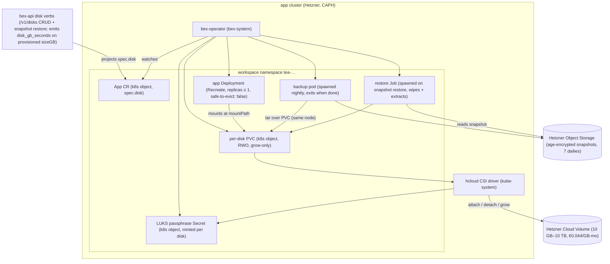

# ADR082 — Persistent service disks

**Status:** Proposed · 2026-08-22 · **Owner:** operator + backend + dashboard · **Reverses:** the stateless-first persistent-disk non-goal ([ADR018](ADR018-render-parity.md) ledger row, [DO_NOT_DO.md](../.pm/DO_NOT_DO.md), [ADR049](ADR049-render-yaml-parity.md) rejected alternative) by explicit user decision, 2026-08-22

---

## Context

### The Render feature bex is replicating

Render lets a **paid web service, private service, or background worker** attach one persistent SSD-backed disk (render.com/docs/disks, captured 2026-08-22; live dashboard walk of a real paid service's Disk tab captured 2026-08-23 in [render-artifacts/disks.md](render-artifacts/disks.md)):

- A single `disk {name, mountPath, sizeGB}` per service. `sizeGB` defaults to 10 in Blueprints; the practical minimum is 1 GB; no maximum is documented (≥1 TB disks exist). Only writes under `mountPath` persist; the rest of the filesystem stays ephemeral.
- **Grow-only resize**, applied online ("the additional storage becomes available within a few seconds"), never shrink. `name` and `mountPath` are mutable.
- **Single instance, no scaling**: a disk-bearing service cannot scale manually or autoscale, and **zero-downtime deploys are lost** — Render stops the old instance before starting the new one ("a few seconds, during which your service is unavailable") to prevent two app versions writing the same disk.
- The disk is **not** available during build or pre-deploy commands (separate compute), is not reachable from any other service, and cannot be detached or moved.
- **Automatic daily snapshots**, retained **at least seven days**, restorable full-disk only (restore discards post-snapshot writes and restarts the service). Snapshot keys from the list API expire after 24 h. Render explicitly warns against using disk restore for database recovery (the copy is not application-consistent). Disks and snapshots are encrypted at rest. Snapshot storage carries no documented charge.
- API: `GET/POST /v1/disks`, `GET/PATCH/DELETE /v1/disks/{diskId}`, `GET /v1/disks/{diskId}/snapshots`, `POST /v1/disks/{diskId}/snapshots/restore`; ids match `^dsk-[0-9a-z]{20}$`. Adding a disk triggers a deploy. Deleting it loses all data immediately. The official Render CLI has **no** disk commands.
- Cron jobs, static sites, and free instance types cannot attach disks.
- **Pricing: $0.25/GB per month, billed on provisioned size (not used bytes), prorated by the second**, from disk creation until removal (render.com/articles/how-much-does-cloud-application-hosting-cost-for-small-businesses; render-oss/skills `render-disks`).

### Why bex said no before, and what changed

Persistent disks were a recorded anti-goal in three places — the ADR018 ledger row, `DO_NOT_DO.md`, and ADR049's rejected alternative — all citing the same reason: bex is stateless-first (managed Postgres/Key Value hold state), and disks disable multi-instance + zero-downtime deploys, which fights the dense bin-pack + free-tier-sleep economics. The Blueprint capability registry fail-closes the four `disk` fields, and `render_openapi_test.go` pins `/v1/disks` to 404.

The user reversed that decision on 2026-08-22. The reversal is **narrow** because Render's own restrictions contain the original objection:

- **Free-tier-sleep economics are untouched**: disks require a paid tier (Render parity), so the auto-hibernate fleet never carries volumes.
- **The zero-downtime cost is opt-in and per-service**: only the disk-bearing App loses rolling deploys; every other App keeps today's behavior byte-for-byte.
- **The bin-pack cost is confined**: `safe-to-evict: "false"` (the existing KeyValue precedent) applies only to disk-bearing pods, and Hetzner network volumes detach/reattach across nodes, so the pod is movable — just not silently by the autoscaler.

There is also real demand this unlocks: the exact workloads Render markets disks for (self-managed MySQL/Mongo, WordPress/Ghost/Strapi, Elasticsearch/Kafka, uploads directories) are today hard refusals in bex's Blueprint compiler.

### What bex already has

Most of the mechanism exists for managed datastores and is directly reusable:

- **Hetzner CSI is deployed in production** (`hcloud-csi` Helm chart, pinned in `deploy/helm-artifacts.lock`; installed by `app-cluster.yml`). Its `hcloud-volumes` StorageClass is what CNPG Postgres (`database_controller.go:71`) and Valkey (`keyvalue_controller.go:57`) already use, with `allowVolumeExpansion: true`, `WaitForFirstConsumer`, `reclaimPolicy: Delete`.
- **Grow-only storage arithmetic** is generic (`lego/operator/internal/controller/storage.go`: `growOnlyIntent`, `quantityGiCeil`), and the KeyValue controller already implements online PVC expansion with quota-blocked (`StorageBlockedByQuota`) and non-expandable-class backoff behavior.
- **An encrypted backup pipeline to object storage** exists for Valkey (`keyvalue_backup.go`): compress → age-encrypt → upload, digest-pinned images, derived work budgets, purge-on-delete — with `keyValueBackupRetention = 7`, coincidentally Render's exact snapshot retention.
- **Storage metering and a storage price line** exist (`storage_gb_seconds` meter, `pricing.yaml` `storage:` at $0.21/GB-month for datastores).

### The Hetzner substrate (verified 2026-08-22)

- Volumes: **€0.0440/GB-month net ($0.0500 USD list)**, billed hourly with a monthly cap, 1 GB increments, **min 10 GB, max 10 TB**, up to 16 volumes per server, location-locked, triple-replicated SSD, up to 5,000/7,500 IOPS and 200/300 MB/s sustained/burst (docs.hetzner.com/cloud/volumes/overview). Volumes bill until deleted, attached or not. _Caveat: third-party trackers claim volumes rose to €0.0572/GB with Hetzner's 2026-04-01 price adjustment while Hetzner's own page still lists €0.0440; re-verify via authenticated `GET /v1/pricing` before GA — margins hold either way (see § Pricing)._
- **Hetzner has no volume snapshots or backups at any level** (their docs say so in as many words — "We do not provide Backups or Snapshots for Volumes", re-read 2026-08-23): server snapshots/backups explicitly exclude attached volumes, and the CSI driver (v2.22.x) has no `CREATE_DELETE_SNAPSHOT` capability and no volume cloning (long-open hetznercloud/csi-driver #20/#88/#140/#849; Hetzner does not plan to add them). Any snapshot story must be file-level.
- CSI: ReadWriteOnce only (same-node multi-pod allowed), topology key `csi.hetzner.cloud/location`, expansion supported but **online expansion is not claimed by the maintainers** (their e2e config declares `offlineExpansion: true, onlineExpansion: false`) — plan for a pod restart to complete filesystem growth. LUKS encryption is supported via a StorageClass parameter + node-publish secret.
- Object Storage (the snapshot target): base **€6.49/month including 1 TB storage + 1 TB egress**; additional storage **€6.26/TB-month**; ingress and same-zone traffic free; FSN1/HEL1/NBG1 only.

### Architecture



Every box exists only because of `spec.disk`: bex-api's disk verbs project the field onto the App CR and meter its provisioned GB (§ D9); the operator converges it into the `Recreate` Deployment and the LUKS-encrypted PVC that the hcloud CSI driver backs with a Hetzner Cloud Volume (§ D3), plus the ephemeral backup/restore workloads that stand in for the volume snapshots Hetzner doesn't offer (§ D5).

---

## Decision

### D1 — Reverse the non-goal, narrowly

Persistent service disks are roadmap. The reversal covers exactly Render's disk feature under Render's own restrictions; it does **not** reopen the other ADR18 `—` rows (previews, one-off jobs, log drains, …), does not relax the free tier, and does not change any App without `spec.disk`. The record changes are listed in § Record changes below.

### D2 — Contract: Render-exact semantics

One optional disk per App, expressed as a named struct on the CR (the `*AutoscalingSpec` precedent):

```go
// AppSpec, after MaxShutdownDelaySeconds
Disk *DiskSpec `json:"disk,omitempty"`

type DiskSpec struct {
    Name      string `json:"name"`      // any string; Render does not display it
    MountPath string `json:"mountPath"` // absolute; denylist below
    SizeGB    int32  `json:"sizeGB"`    // default 10; min 1; max 10000; grow-only
}
```

Behavior table (Render → bex):

| Behavior | Render | bex |
| --- | --- | --- |
| Eligible services | paid web / private service / background worker | same: `web_service` / `private_service` / `background_worker`, `spec.tier != free` |
| Cron / static / free | refused | refused (CRD CEL + API 400) |
| Disks per service | one — explicit dashboard copy: "You can attach a maximum of one disk per service" ([live walk](render-artifacts/disks.md)) | one (`spec.disk` is singular); `POST /v1/disks` for a service that has one → 409 |
| Size | default 10 GB, min 1 GB, max undocumented | default 10, min 1, **max 10 000 GB** (the Hetzner volume cap, stated rather than undocumented) |
| Resize | grow-only, online, no restart | grow-only; applied online when the CSI completes it, otherwise finishes on the next restart (divergence, § D4) |
| `name` / `mountPath` | mutable | mutable (`mountPath` change triggers a deploy) |
| Scaling | single instance, no manual scale, no autoscaling | same: `replicas ≤ 1`, `autoscaling` must be off — CRD CEL + API 400 |
| Deploys | stop-then-start, few seconds downtime | same: Deployment strategy flips to `Recreate` (§ D3) |
| Build / pre-deploy | no disk access (separate compute) | same by construction: build and pre-deploy Jobs never mount the PVC |
| Cross-service access | none; no detach/move | same: one RWO PVC, namespace- and App-bound |
| Attach | triggers a deploy; available when live | same |
| Suspend | state retained; storage billed (inferred) | same, explicit: PVC survives `suspended`, disk billing continues |
| Delete disk | all data lost immediately | same; bex additionally deletes the disk's snapshots (Render leaves this undocumented; bex chooses the private option) |
| Snapshots | automatic daily, ≥7 days, full-disk restore, restore restarts, keys expire 24 h, free | same semantics, file-level mechanism (§ D5), same 7-day retention, same 24 h key expiry, not billed |
| Encrypted at rest | yes | yes: LUKS StorageClass for the volume + age-encrypted snapshots (§ D3) |
| File transfer | SSH + `scp`/Magic-Wormhole | **divergence**: ADR035's no-SFTP/no-SCP ban on `srv-` SSH stands; transfer via instance shell + app-level tooling |
| API | `/v1/disks` CRUD + snapshots, `dsk-` ids | same routes/shapes, `id.Disk` (`dsk` prefix) minted via `internal/id` |
| CLI | no disk commands | nothing to do (checklist note only) |
| Previews | preview services get a fresh empty disk | n/a — PR previews remain a bex non-goal (unchanged) |

`mountPath` denylist (exact paths refused, subdirectories allowed — Render's list plus bex's secret mount): `/`, `/etc`, `/etc/secrets`, `/home`, `/home/render`, `/opt`, `/opt/render`, `/opt/render/project`, `/opt/render/project/src`. Keeping Render's `/opt/render/…` entries costs nothing and keeps imported `render.yaml` files behaving identically.

CRD validation (CEL, mirrored by bex-api 400s so REST/GraphQL/MCP agree):

- `has(self.disk)` ⇒ `self.type in [web_service, private_service, background_worker]` ∧ `self.tier != 'free'` ∧ `self.replicas ≤ 1` ∧ autoscaling absent or disabled;
- transition rule: `sizeGB ≥ oldSelf.sizeGB` while the disk exists (shrink refused at every surface, including Blueprint sync);
- `mountPath` absolute + denylist.

### D3 — Mechanism: Deployment + operator-managed PVC, `Recreate` strategy

The App stays a **Deployment**. A StatefulSet was rejected (§ Rejected alternatives): the entire downstream stack — rollout gating, the metering pod-name regexes, the store reconciler's deploy gate, the activator — keys on the Deployment shape, and a `Recreate` Deployment with `replicas ≤ 1` reproduces Render's stop-then-start swap exactly.

When `spec.disk` is set, `applyDeploymentSpec` additionally:

- sets `Strategy: Recreate` (today no strategy is set anywhere — every App keeps the Kubernetes `RollingUpdate` default; that remains true for disk-less Apps);
- mounts one PVC `disk-<app>` at `mountPath`;
- adds `cluster-autoscaler.kubernetes.io/safe-to-evict: "false"` (the KeyValue precedent — consolidation must not silently kill a volume-attached pod).

The operator creates the PVC itself (not via a claim template): `ReadWriteOnce`, `<sizeGB>Gi`, ownerReference → the App CR (Kubernetes GC deletes the PVC on App deletion; the StorageClass's `reclaimPolicy: Delete` then deletes the Hetzner volume, which is what stops Hetzner billing). This needs two mechanical grants that the ADR calls out because they are today deliberately absent: `persistentvolumeclaims` **create/delete** in the App controller's RBAC markers, and a `CREATE`/`DELETE` rule for PVCs in `operator-workload-admission.yaml` (which currently admits PVC `UPDATE` only, minted for the KeyValue expander).

**Encryption at rest** (required for the parity row): a sibling StorageClass `hcloud-volumes-luks` (same provisioner, LUKS parameters per the csi-driver's documented support); the operator mints a random per-disk passphrase Secret in the workspace namespace, referenced only by the CSI node-publish parameters. CAPH node images must carry `cryptsetup`. Snapshots are independently age-encrypted (§ D5), so data at rest is covered on both the volume and the backup target.

**Placement**: `WaitForFirstConsumer` binds the volume in the scheduled node's location (topology key `csi.hetzner.cloud/location`); with bex's single-placement model (`BEX_REGION`, ADR049) this is a no-op today, but the volume permanently pins the App to its location if node pools ever span locations. Hetzner's 16-volumes-per-server cap bounds disk-bearing pods per node; the CSI driver reports it as node allocatable, so the scheduler handles it — it is a capacity-planning input, not a correctness risk.

**Suspend/resume and hibernation**: `parkKubernetes` scales to 0, the volume detaches, the PVC and billing persist; resume reattaches wherever the pod lands. Free-tier auto-hibernate never interacts with disks (free tier cannot attach one).

**Local dev (CAPD/mock)**: `local-path` backs the PVC — no expansion (the expander already backs off on a non-expandable class, the KeyValue behavior) and node-local placement. Acceptable for a single-purpose dev cluster; the e2e story runs there.

### D4 — Resize: grow-only, reusing the datastore machinery

`PATCH /v1/disks/{id}` (and Blueprint sync) with a larger `sizeGB` patches the PVC through the shared `growOnlyIntent` path. `hcloud-volumes` has `allowVolumeExpansion: true`; the controller expands the Hetzner volume online, and the filesystem grows when the node plugin completes it. Because the CSI maintainers test **offline** expansion only, bex documents the honest contract: _growth is requested immediately and usually applies online; if the filesystem has not grown within the reconcile window, a `DiskResizePending` condition is set and the growth completes on the next restart/deploy._ This is bex's one soft divergence from Render's "within a few seconds" claim, stated rather than papered over. Shrink is refused everywhere. Status mirrors the datastore vocabulary: `status.disk.allocatedSizeGB` / `observedSizeGB`, conditions `DiskReady`, `DiskResizePending`, `StorageBlockedByQuota` (self-clearing, the ADR043 quota pattern).

### D5 — Snapshots: daily file-level backups to object storage

Hetzner offers no block snapshots, so Render's snapshot semantics are reproduced at the file level, riding the KeyValue backup pipeline's parts (BackupStore, age encryption, digest-pinned images, derived work budgets, purge-on-delete annotation):

- **Take**: a nightly per-disk CronJob (`dskbak-<app>`, the `kvbak-` naming pattern) mounts the PVC read-only and streams `tar | gzip | age` to the platform backup store. RWO allows a second same-node pod, so while the App pod is running the backup pod carries a required pod-affinity to it (same `kubernetes.io/hostname`); with the App suspended/scaled to zero the volume is free and the constraint drops.
- **Retention**: 7 daily objects per disk, oldest pruned — Render's "at least seven days" exactly (and the existing `keyValueBackupRetention` constant).
- **List/restore**: `GET /v1/disks/{id}/snapshots` returns Render's `{createdAt, snapshotKey, instanceId}` shape; `snapshotKey` is an HMAC-signed object reference valid 24 h (Render's key expiry, via the existing `hmacticket` envelope). `POST …/snapshots/restore` scales the App to 0, runs a restore Job (wipe + extract onto the PVC), then redeploys — "restoring restarts your service", full-disk only, post-snapshot writes lost.
- **Consistency**: a file-level copy of a live filesystem is fuzzy, not application-consistent. bex adopts Render's own warning verbatim in the dashboard and API docs: do not use disk restore for database recovery; use application-level dumps. (Render's block snapshots have the same caveat — they warn identically.)
- **Lifecycle**: snapshots are deleted with the disk (purge Job + annotation, the KV pattern). Render leaves this undocumented; bex chooses deletion as the privacy-preserving default and documents it as bex-defined.
- Snapshot storage is **not billed** to the tenant (parity); the cost is internalized (§ Pricing).

### D6 — API surface

- **id**: new `id.Disk = Kind{prefix: "dsk"}` (Render's observed prefix), minted via `id.New` only; the disk id ↔ App mapping lives in the control-plane store (migration `0096_service_disks`), since the DB-free operator needs only `spec.disk`.
- **REST** (`internal/apps/disks.go`, Render shapes): `GET/POST /v1/disks`, `GET/PATCH/DELETE /v1/disks/{diskId}`, `GET /v1/disks/{diskId}/snapshots`, `POST /v1/disks/{diskId}/snapshots/restore`. `POST` requires `serviceId` and triggers a deploy; `DELETE` warns and is immediate. The `render_openapi_test.go` pin of `/v1/disks` → 404 is removed and the routes join the pinned-spec inventory. Every route gets a scope-matrix `OpClass*` entry; verbs authorize through `AuthorizeApp` on the owning service (the standard single-gate seam), and the authz/target sweep tests pick them up automatically.
- **GraphQL / MCP**: `disk` on the service view; `addDisk` / `updateDisk` / `deleteDisk` / `restoreDiskSnapshot` mutations and `add_disk` / `update_disk` / `delete_disk` / `list_disk_snapshots` / `restore_disk_snapshot` tools, mirroring the REST core (one service, three thin fragments). `mcp_parity.go` divergence lists updated.
- **Dashboard**: a **Disk** tab (Render's singular label) in the Manage sidebar group on eligible service pages (currently omitted as a non-goal). The add form mirrors the live-captured contract ([render-artifacts/disks.md](render-artifacts/disks.md)): mount path + size only — no name input (bex auto-derives the API-level `name`), `/var/data` placeholder, the five-bullet warning list (zero-downtime deploys lost, no multi-instance, one disk max, only mount-path files persist, no cross-service access), 1/5/10/50/100 GB quick-select chips with a free-text box defaulting to 10, and an empty-state card quoting bex's $0.175/GB-month rate. Post-create: usage-over-time graph (`kubelet_volume_stats_*` on the disk PVC, the datastore metrics path extended with a third kind, `service`, alongside `database`/`keyvalue` — it rides that verb rather than the App-metrics verb because what it measures is a PVC, and only `disk`/`disk_capacity` are valid for it; the other datastore metrics are refused by name, and a diskless service returns an empty series rather than an error so the tab can ask before it knows). **The claim name is derived, not spelled**: `appv1alpha1.DiskPVCName` moved into the leaf contract module in w1/m86 so bex-api matches the exact claim the operator created — a literal `^disk-<name>$` would silently graph nothing for any app name long enough to hit the truncate-plus-digest path, which is a failure with no error attached to it, grow, snapshot list + restore (confirmation phrase), delete.
- **CLI**: upstream has no disk commands; `cli-compatibility-checklist.md` gets a "n/a upstream" row.

### D7 — Blueprint (`render.yaml`) parity

The four fail-closed `capabilities.json` entries (`#/definitions/disk/{name,mountPath,sizeGB}`, `#/definitions/serverService/properties/disk`) flip from `unsupported` to translated handlers with ADR049 D5 presence-aware semantics:

- create default: `sizeGB: 10` (Render's Blueprint default);
- omission on adopt/sync **preserves** the existing disk (and Blueprint sync never deletes — removing the `disk` block does not delete the disk, matching Render's documented no-sync-delete rule; deletion stays a manual API/dashboard act);
- explicit `sizeGB` below the current size fails validation before any write;
- the disk fields obey the same fail-closed rule as before in the other direction: they either translate fully or the file is refused — never a lossy approximation.

The Blueprint estimated-pricing panel gains the "Disks" group Render shows (its absence is currently recorded as a deliberate divergence in ADR018), priced from the sheet below — and unlike the datastore rows, the disk estimate **matches the invoice basis exactly**, since both are provisioned GB.

### D8 — Pricing

New SKU, standard house discount — **30% off Render, billed like Render**:

| SKU | Render | bex | Discount |
| --- | --- | --- | --- |
| Service disk (new) | $0.25/GB-month, provisioned, prorated by the second | **$0.175/GB-month, provisioned, prorated by the second** | 30% off |
| Disk snapshots (new) | no charge | no charge | — |

Mechanics:

- **Basis is provisioned capacity, deliberately diverging from the datastore used-bytes meter.** Two reasons: Render bills disks on provisioned size (parity), and bex's cost is provisioned size — Hetzner bills the volume's full capacity hourly whether attached, detached, or idle. For disks, parity and cost-recovery point the same way; the datastore used-bytes meter (ADR030's deliberate extension) is unchanged.
- **Metering**: a new `disk_gb_seconds` meter measures provisioned `sizeGB` × seconds from the control-plane store — the full pipeline is § D9.
- **`pricing.yaml`** gains:

  ```yaml
  # disk_gb_seconds rate: $0.175/GB-month provisioned (Render disk $0.25 × 0.70).
  # Billed on provisioned sizeGB — Render bills provisioned capacity for disks
  # and Hetzner charges bex for provisioned volume capacity, so parity and
  # cost-recovery align; the datastore used-bytes storage meter is unchanged.
  disk:
    usdPerGBSecond: 0.000000066590563165905631659056 # $0.175 / 2,628,000 GB-seconds
  ```

  `tiers.yaml` stays price-free (the ADR030 invariant — money never reaches the operator; the operator sees only `sizeGB`).

- `estimatedCost` and the Blueprint pricing panel include disk lines; the "estimated on provisioned floor, invoiced on used bytes" disclaimer applies to datastore rows only — disk rows are exact.

**Unit economics (why $0.175 works on Hetzner):**

| Component | Cost | Against $0.175/GB-mo revenue |
| --- | --- | --- |
| Hetzner volume | €0.0440/GB-mo net ≈ $0.050 (Hetzner's own USD list) | ~71% gross margin |
| Snapshot storage, worst case | 7 retained full-size incompressible dailies × €0.00626/GB ≈ $0.049/GB-mo | floor margin ≈ 43%; typical compressible payloads far less |
| Object Storage base fee | €6.49/mo incl. 1 TB — already paid for the platform backup store | ~0 marginal |
| Sub-10 GB disks | Hetzner's 10 GB volume floor: a 1 GB disk earns $0.175/mo but costs ≈ $0.50/mo | accepted subsidy ≤ ~$0.33/mo/disk; the default (10 GB → $1.75 vs $0.50) is fine |
| April-2026 price-rise scenario | if volumes are actually €0.0572/GB (~$0.062) | base margin still ~65% |

Free tier: no disks, so the $0 tier's economics are untouched. The `BEX_REQUIRE_PAYMENT_METHOD` gate already covers the paid intent a disk create expresses.

### D9 — Usage metering

Disks join the ADR023/ADR040 metering pipeline as a first-class meter, not a rider on the datastore storage meter:

- **New meter kind `disk_gb_seconds`** joins the closed vocabulary in `internal/store/usage.go` (`instance_seconds`, `egress_bytes`, `build_seconds`, `storage_gb_seconds`, `sandbox_compute_seconds`). It is deliberately **not** folded into `storage_gb_seconds`: the basis differs (provisioned vs used bytes), the rate differs ($0.175 vs $0.21/GB-month), and Stripe needs distinct meters to price them separately.
- **Attribution**: resource kind `service`, keyed to the owning `srv-` id — the disk is a property of its service (Render presents the charge the same way), so no new resource kind enters the vocabulary; the `dsk-` id appears in the meter's detail, not its key.
- **Quantity**: allocated `sizeGB` × seconds the disk exists, integrated from the control-plane store's lifecycle records — creation timestamp, the grow-only resize history (a mid-hour grow contributes a monotonic step, never a re-statement of past hours), deletion timestamp. The quantity is independent of replicas, suspension, and attachment state, matching both Render's bill and Hetzner's. Because the source is store rows rather than PromQL, the meter is **deterministic and survives app-cluster unreachability** — deliberately unlike the datastore storage meter, which samples `kubelet_volume_stats_used_bytes` hourly (`queryStorageGBSeconds`); that divergence is the point, not an accident.
- **Rollup**: hourly windows into `usage_hourly` (window start truncated to the hour), sealed and retained exactly like every other meter (`BEX_USAGE_RETENTION_MONTHS` hot window). Catch-up follows the datastore meters' pattern: on bex-api restart the collector backfills every hour between the last emitted window and now from the store's lifecycle records — a store-derived meter can lose an emission window only while bex-api itself is down, and backfill closes it losslessly. A `disk` entry joins the per-source usage-health vocabulary so a stalled collector is observable, not silent.
- **Surfaces**: `GET /v1/usage`, GraphQL `usage`, MCP `get_usage`, and the dashboard Usage page gain the disk meter row plus its `estimatedCost` line (ADR030's kind × tier × resourceKind breakdown; disk entries carry an empty tier — the rate is flat per GB).
- **Stripe** (ADR040): `BillableMeterNames` gains `disk_gb_hours`, rebased from GB-seconds the way `storage_gb_hours` is; `internal/billing/stripe.go` maps the new kind; `scripts/stripe-billing-setup.py` provisions the Meter + Price ($0.175 / 730 ≈ $0.0002397/GB-hour). Sealed-usage submission, invoice authority, and the advisory-estimate split are unchanged.
- **Explicitly not metered**: snapshot storage (parity — the cost is internalized, § D8) and `kubelet_volume_stats_used_bytes` on disk PVCs, which feeds only the Disks-tab usage graph and is never billed. The estimate-vs-invoice disclaimer shrinks accordingly: for disks, estimate and invoice share the provisioned basis and agree exactly.

### D10 — Quotas, isolation, capacity

- The disk PVC lives in the workspace's hosting namespace beside its App (ADR043 D8); like a datastore, a disk-bearing App can never change namespace.
- The `quotaForPlan` derivation (`namespaces.go`) currently sizes `requests.storage` / `persistentvolumeclaims` from datastore counts only. It gains a disk term: **free/hobby workspaces move from 20 Gi / 4 PVCs to 120 Gi / 8 PVCs** (room for a couple of default-size disks beside the datastore floors — a hobby workspace can run paid-tier services); paid plans' 5 Ti / 200 already absorb disks unchanged. The contract max (10 000 GB) can exceed a workspace's remaining quota; a quota-blocked create/grow surfaces `StorageBlockedByQuota` and self-clears, never fails silently (the KeyValue pattern, ADR043).
- Admission confinement: the volume grammar (no `hostPath`, no crown-jewel Secret mounts) is unchanged; the PVC `CREATE`/`DELETE` admission rule from D3 is scoped to the operator service account.

### D11 — Rollout order

1. **Types + operator**: `DiskSpec`, CEL rules, codegen, PVC/`Recreate`/mount/annotation reconcile, resize path, RBAC + admission rules, LUKS class. (envtest)
2. **Backend**: store migration + projector ownership, `id.Disk`, REST/GraphQL/MCP CRUD, scope matrix, `render_openapi_test.go` update, metering + pricing + Stripe meter.
3. **Snapshots**: backup CronJob + restore verb + key signing + purge.
4. **Blueprint flip + dashboard Disks tab + metrics.**
5. **Record sync at closeout**: ADR018 row cells, capability registry reasons, CLI checklist.

Each stage is independently shippable; disk-less Apps are untouched at every stage.

---

## Invariants

- `spec.disk == nil` ⇒ behavior byte-identical to today: no strategy set, no PVC, no annotation, no meter.
- A disk-bearing App has `replicas ≤ 1`, autoscaling off, a paid tier, and an allowed type — enforced at the CRD and every API surface, not by documentation.
- `sizeGB` never shrinks, on any surface, including Blueprint sync.
- Data-bearing intent is never silently dropped: Blueprint `disk` fields translate fully or fail closed.
- Disk billing runs creation → deletion on provisioned `sizeGB`, independent of replicas, suspension, or attachment; deleting the disk is the one act that stops it (and deletes the Hetzner volume).
- Snapshots are age-encrypted, live only in the platform backup store, and are deleted with their disk.
- No prices in `tiers.yaml`; the operator never sees money (ADR030).
- ADR035's SSH bans (no SFTP/SCP/forwarding on `srv-` targets) are unchanged by this feature.

---

## Consequences

### Positive

- The largest hard-refusal class in the Blueprint compiler (stateful `render.yaml` services: n8n, WordPress, Ghost, self-managed databases) becomes deployable, moving real Render workloads within reach.
- The ADR018 ledger's biggest deliberate `—` row converts to roadmap with exact-shape parity: same API, same YAML, same constraints, same billing basis, 30% cheaper.
- Nearly all mechanism is reuse: CSI + StorageClass, grow-only arithmetic, backup pipeline, quota conditions, metering/rollup/Stripe plumbing.

### Costs and trade-offs

- Two deploy behaviors now exist (rolling vs `Recreate`), gated on one spec field — the dashboard must show the downtime warning Render shows.
- `safe-to-evict: "false"` pods resist autoscaler consolidation; node utilization on disk-carrying nodes degrades. Contained to paid, disk-bearing pods, but it is a real bin-pack cost — the reversal accepts it knowingly.
- File-level snapshots are weaker than block snapshots (fuzzier point-in-time, slower restore for huge disks). Render's own consistency warning applies to both; if Hetzner ever ships volume snapshots, D5 swaps the mechanism without changing the contract.
- Online-growth uncertainty (CSI offline-expansion support) is a documented soft divergence from Render.
- The quota derivation and its sizing comment must be reworked; free/hobby namespaces get materially larger storage quotas.
- Stuck Hetzner attach/detach (csi-driver #486 class) becomes a tenant-visible failure mode during pod moves; the runbook set gains a volume-detach entry.

---

## Rejected alternatives

**StatefulSet per disk-bearing App (the KeyValue shape).** Rejected: every downstream consumer — rollout gating, metering pod-name regexes, the store reconciler's deploy gate, the activator — keys on the Deployment shape; a `Recreate` Deployment with an operator-managed PVC reproduces Render's swap semantics with a fraction of the blast radius.

**Replicated node-local storage (Longhorn/OpenEBS) instead of Hetzner volumes.** Rejected: bex nodes carry 80–160 GB local disks (ADR053) with the writable layer already budgeted; running a replicated storage plane is a second product's worth of operational surface, and hcloud volumes are already triple-replicated and detachable.

**Block-level snapshots (CSI VolumeSnapshot / LVM layer / Hetzner server snapshots).** Unavailable: the CSI driver has no snapshot capability, Hetzner has no volume snapshots and does not plan them, server snapshots exclude volumes, and an LVM shim was rejected upstream. File-level is the only honest mechanism.

**Bill used bytes like the datastore meter.** Rejected: Render bills provisioned, and bex pays Hetzner for provisioned — a used-bytes disk meter would under-recover on sparse disks and break estimate-equals-invoice for the one SKU where bex can have it.

**Multi-instance or shared disks (RWX).** Rejected: Render itself withdrew its multi-instance-disk Early Access in March 2025, and hcloud volumes are RWO-only. Out of scope until both change.

**Keep the anti-goal.** Rejected by explicit user decision 2026-08-22; the containment argument in § Context is why the reversal is safe.

---

## Verification

- **envtest**: CEL rejections (type/tier/replicas/autoscaling/shrink/mountPath denylist), PVC create with ownerRef + class, `Recreate` flip and its absence without a disk, resize intent + `DiskResizePending`, quota-blocked condition, suspend keeps the PVC.
- **backend**: conformance corpus rows for the four Blueprint fields (create default, omission-preserves, explicit shrink refused, no-sync-delete); `render_openapi_test.go` route inventory; the standing authz/target/scope sweep tests cover the new verbs by construction; meter test pins `disk_gb_seconds` across create → suspend → resume → delete.
- **e2e (mock cluster, `local-path`)**: write under `mountPath` → redeploy → file survives; snapshot → mutate → restore → pre-mutation state; delete → PVC gone.
- **Billing**: Stripe catalog setup provisions `disk_gb_hours`; an invoice-preview fixture shows a disk line at $0.175/GB-month.
- **Pre-GA cost check**: authenticated `GET https://api.hetzner.cloud/v1/pricing` for `volume.price_per_gb_month` (the €0.0440-vs-€0.0572 question) recorded in the closeout note. **Attempted at w1/m86 closeout (2026-08-23) and NOT completed** — no Hetzner API token exists in any environment bex currently runs (the mock cluster is CAPD/docker, and the `hetzner-caph` path is not yet stood up), and Hetzner's public price page renders its figures client-side so it is not scrapeable. What the re-read did confirm from `docs.hetzner.com/cloud/volumes/overview` is the load-bearing part: volumes are "billed hourly" with a "monthly price cap" (so a provisioned-GB meter matches the cost basis exactly), and — verbatim — **"We do not provide Backups or Snapshots for Volumes"**, which is the vendor's own statement of the premise D5 is built on. The price question stays open and stays cheap to answer: it moves the margin between ~71% and ~65% (§ Pricing) and changes no code, since the rate lives in `pricing.yaml`. Carry it to whoever first provisions a real Hetzner project.

---

## Record changes

Landing with this ADR (same change):

- [ADR018](ADR018-render-parity.md) Persistent-disks ledger row: non-goal note replaced with the reversal record; cells stay `—` until surfaces ship.
- [DO_NOT_DO.md](../.pm/DO_NOT_DO.md): the persistent-disks bullet gains a re-open record (the `#18` precedent); the sibling non-goals are explicitly unaffected.
- [ADR049](ADR049-render-yaml-parity.md): the disk-related rejected-alternative and D7 lines gain dated pointers here.
- [docs/CLAUDE.md](CLAUDE.md) catalog entry.

Landing with implementation (not this change): `capabilities.json` flips, `render_openapi_test.go`, scope matrix, quota derivation, CLI checklist row, ADR018 cell updates.
