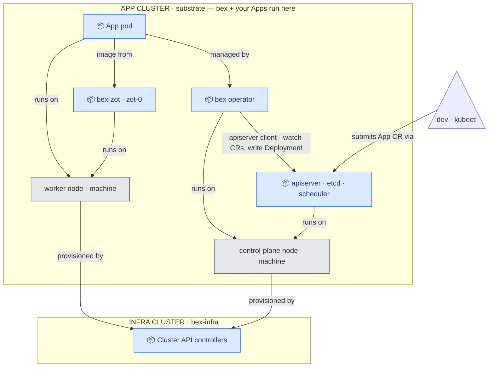
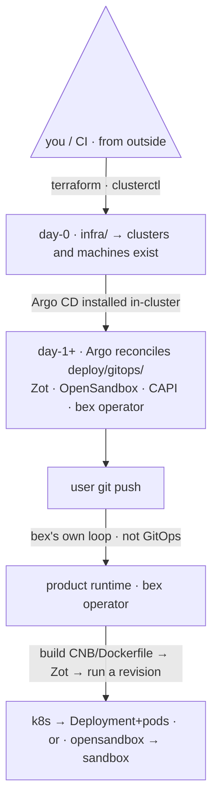

# bex architecture

bex is the **deploy-from-git half** of bex.co (strategy 211.09): a Git repo becomes a running, addressable service, bin-packed across machines, with idle services hibernated ("sleep = free") and woken on request. This doc is the map.

## Panorama



**Every arrow is a dependency: `A → B` means _A depends on B_** (it points to what A needs). **Blue 📦 = Pod · gray = machine (k8s node).**

- An **App pod** depends on the **operator** (which manages it), **`bex-zot`** (pulls its image), and the **worker node** (runs on it).
- The **operator** depends on the **apiserver** — it's a **client** of it: it watches `App` CRs and writes Deployments; it **never talks to pods directly**. (Plus the node it runs on.)
- Both **machines** depend on **Cluster API** — it provisions them.

Note the direction: "operator _creates_ pod" becomes **`pod → operator`**, and "CAPI _provisions_ machine" becomes **`machine → CAPI`** — in a dependency graph the created/managed thing points at what it depends on, i.e. the arrow is the reverse of the "who-makes-what" flow. Outer boxes = the two **clusters**; a _machine_ is a server (Hetzner) or Docker container (local). Swap `CAPD`→`CAPH` and the picture is identical. (For a request/response view of a deploy, see the request-flow diagram in [`control-plane.md`](control-plane.md).)

- **Two clusters.** The **app cluster** runs the bex operator **and** your Apps; the **infra cluster** runs only Cluster API (it provisions the app cluster's machines). `BEX OPERATOR`, Cluster API and `bex-zot` are **pods / containers** — no extra machines. On Hetzner the machines are the cluster **nodes**; swap `CAPD`→`CAPH` and the picture is identical. (_infra cluster_ / _app cluster_ are bex's names for Cluster API's _management_ / _workload_ cluster; a 3rd legacy `orbstack` cluster still hosts the OpenSandbox `hello-go` demo.)
- **machines = nodes** of the app cluster — Docker containers under CAPD locally, Hetzner servers under CAPH. **Add/remove a machine** = scale the worker pool; the operator bin-packs pods onto the nodes.

## Two layers: `bex` and `bex-infra`

The single most important boundary:

|  | **bex** (control plane + operator) | **bex-infra** (provisioning) |
| --- | --- | --- |
| owns | placement, lifecycle, build→deploy→serve, the **auto-allocator** | clusters + machines |
| node awareness | **reads** `Node`/`Pod` (capacity, utilization); decides placement/eviction | **creates/joins/deletes** nodes |
| provisioning | ❌ never SSHes / runs cloud APIs | ✅ Terraform, Cluster API, autoscaler |
| code | Go workspace (`lego/`) | declarative (`infra/`) |
| how it scales machines | **indirectly**: bin-pack + idle-evict → pending pods / empty nodes | Cluster Autoscaler / CAPI react |

bex is **node-aware but provision-unaware**: it never adds a machine itself; it packs pods tightly and evicts idle ones, and the autoscaler/CAPI translate that into machines added/removed.

**Names map to layers consistently** (layer · directory · runtime entity):

| layer | directory | runtime entity |
| --- | --- | --- |
| **bex** | `lego/` (types + operator + backend) | the **BEX OPERATOR** — a **pod in the app cluster** (deploys Apps) |
| **bex-infra** | `infra/` | the **INFRA CLUSTER** (Cluster API; makes clusters/machines) |
| _(substrate)_ | — | the **APP CLUSTER** — runs the bex operator **and** your Apps; bex-infra builds it |

The APP CLUSTER belongs to _neither_ layer cleanly — it's the substrate bex-infra provisions, and it hosts both the bex operator pod and the user Apps. The operator runs **in-cluster** (a `Deployment` in `bex-system`), never on a laptop; `make run` from source is only a dev inner-loop.

### Control plane (source of truth) vs. operator (mechanism)

The `bex` layer itself splits in two — keep them distinct (full design: [`control-plane.md`](control-plane.md)):

- **operator** _(today)_ — a k8s controller that reconciles `App` CRs into `Deployment`/`Service`/`Ingress` (+TLS). **No database**; idempotent; mechanical.
- **control plane** _(planned)_ — a **Postgres-backed** service holding the product's **source of truth** (tenants / apps / domains / plans + business logic). It projects rows into `App` CRs; the operator executes them.

Business/product logic belongs in the **control plane**; the operator stays a thin, CR-driven reconciler. The **`App` CR is the contract** between them.

**Data layering.** Postgres (planned) is the **durable truth**; Kubernetes/**etcd is a rebuildable projection** of it — lose the cluster, re-project from Postgres. This matters because today business state lives _only_ in the single app node's etcd (local disk, no HA) and Apps are imperative (not in git), so a node _rebuild_ loses it. Until the control plane exists: `App` CRs are applied directly and etcd is the only store (snapshot it off-node for interim durability).

## `infra/` vs `deploy/` (both hold YAML — different jobs)

- **`infra/`** = day-0, run **from outside** (terraform / clusterctl) to make the cluster + nodes _exist_.
- **`deploy/`** = day-1+, **Argo reconciles into** an existing cluster (Zot, OpenSandbox controller, bex itself, Cluster API controllers, autoscaler).
- Nuance: the Cluster API/autoscaler **controllers** are deployed (`deploy/`), but the **desired node pools** they consume (`Cluster`/`MachineDeployment`) are declared in `infra/`. Engine = deploy, desired-infra = infra.
- A third thing is **neither**: bex deploying a _user's_ repo into a sandbox — that's the **product runtime**, not GitOps and not infra.



## Local CAPD mock → Hetzner CAPH (the portability bet)

bex is identical locally and in prod; only the **infrastructure provider overlay** changes. So you develop the whole add/remove-machine + bin-pack + scale-down loop locally, in Docker, then swap the provider for Hetzner.

|  | local (mock) | Hetzner (prod) |
| --- | --- | --- |
| provider | **CAPD** (Docker) | **CAPH** (Hetzner cloud + bare-metal) |
| "machine" | Docker-container node | Hetzner server |
| infra cluster | `kind` (`infra/local`) | `infra/terraform` |
| node-pool overlay | `infra/clusterapi/overlays/local-capd` | `…/hetzner-caph` |
| microVMs (Kata/FC) | not available | bare-metal (Robot) |

## Build → deploy → serve (the product)

1. **build** — clone repo @ ref → Dockerfile (BuildKit) or Cloud Native Buildpacks (`pack`) → OCI image → push to **Zot** (`lego/operator/internal/build`).
2. **deploy** — run the image as a revision on **OpenSandbox** (Docker runtime, or k8s runtime → a pod) (`lego/operator/internal/runtime`); health-gate; record `App` status (`internal/controller`).
3. **serve** — reach the revision via the runtime endpoint (future: a stable `*-<id>.bex.co` URL via the gateway).
4. **sleep = free** — idle → OpenSandbox `pause`; request → `resume` (the gateway activator). At the machine level, idle-evict frees nodes → autoscaler scales down.

## Repo map

```
lego/            Go workspace (types + operator + backend): operator/cmd/manager + backend/cmd/api + shared types/  ·  control plane = planned Postgres source of truth (docs/control-plane.md)
dashboard/       Render-style human UI (TanStack Start + Ory Kratos, docs/auth.md §5): deploy/ is its own GitOps-deployed kustomize base, at dashboard.<base-domain>
infra/           bex-infra: terraform/ clusterapi/{base,overlays/{local-capd,hetzner-caph}} local/
deploy/          GitOps: gitops/{bootstrap,base,overlays/{local,staging,prod},charts} + opensandbox/ server configs
examples/        sample user apps (hello-go)
docs/            this file + go-and-gitops.md
scripts/         up.sh, mock-cluster.sh, deploy-sample.sh, start-opensandbox*.sh
```

## What's genuinely ours vs assembled

Ours (Go): the **auto-allocator** (bin-pack + idle-evict), the deploy-from-git orchestration, the gateway (edge + webhook + activator), E2B/ACP translation. Assembled: Kubernetes, Cluster API/CAPD/CAPH, Cluster Autoscaler, OpenSandbox, Zot, Cloud Native Buildpacks. bex is the glue + the economics, not the substrate.
