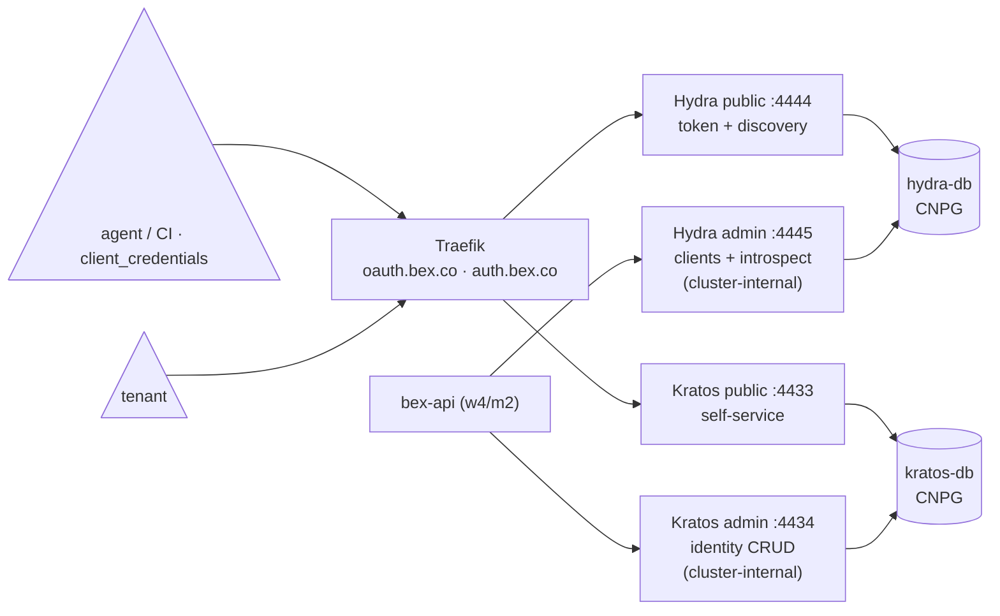

# ADR: platform auth — Ory Kratos (identity) + Ory Hydra (OAuth2/OIDC)

**Status:** accepted (deployed as GitOps base components, verified end-to-end on the local mock cluster). This ADR covers the auth _substrate_ — the identity and token services and their databases. Wiring bex-api to them (introspection middleware, `BEX_AUTH_MODE`, static-token fallback) is w4/m2 and will extend this doc.

## Context

bex-api authenticates every caller with **one static bearer token** (`BEX_API_TOKEN`). That is fine for a single operator but is _the_ blocker for multi-tenancy: the vision's control plane needs tenants and accounts (roadmap #1), and the AI-native pillars need **per-client credentials** — an agent that deploys from chat must hold its own revocable token, not the shared admin secret. So the platform needs real identity (who is this?) and real tokens (what may this credential do, until when?) as infrastructure that bex-api and the control plane consume.

## Decision

### 1. Buy Ory, don't build auth into the control plane

Identity + OAuth2 is commodity infrastructure with a brutal correctness bar (password hashing, session fixation, token semantics, OIDC conformance). Building it into bex's Go control plane means owning that bar forever; renting it (Auth0/Clerk) contradicts an open-source, self-hostable platform. **Ory** is the fit:

- **Apache-2.0, CNCF-adjacent, API-first** — same governance test CNPG passed ([postgresql-management.md](postgresql-management.md) §1).
- **Headless** — Kratos/Hydra are pure APIs; bex keeps its own UX and the Render-compatible API surface.
- **Kubernetes-native** — first-party Helm charts, stateless pods, all state in Postgres (which we already operate well via CNPG).

**Keycloak** was the main alternative — one monolith with an admin UI. Rejected: JVM footprint on a small cluster, realm-centric model that fights an API-first control plane, and its own embedded-ish DB story. Ory splits into small Go services that match how bex is built.

### 2. Kratos vs Hydra — the split of responsibilities

Two services, not one, because the jobs are different:

| service | job | consumed by |
| --- | --- | --- |
| **Kratos** | _identity_: accounts, credentials (email + password to start), self-service flows, admin identity CRUD | tenant sign-up/login; bex-api sessions (w4/m2) |
| **Hydra** | _OAuth2/OIDC_: client registration, token issuance (`client_credentials` first — that's the agent story), introspection | agents/CI holding per-client tokens; bex-api introspection middleware (w4/m2) |

Each has a **public** listener (self-service / OAuth2 endpoints — exposed) and an **admin** listener (identity CRUD / client management / introspection — **cluster-internal only**, no ingress).

### 3. Two CNPG clusters, one database each

Ory hard-requires Kratos and Hydra **not to share a database**. We go one step further — a dedicated CNPG `Cluster` per component ([charts/auth-dbs](../deploy/gitops/charts/auth-dbs/), namespace `auth`, one Argo Application for both since they share sizing and lifecycle policy), mirroring `bex-db`:

- **Independent failover/upgrade/backup** — an identity-store migration can't take down token issuance, and vice versa.
- **CNPG-recommended shape** — one application database per cluster; CNPG generates the `<cluster>-app` credential Secret and the `<cluster>-rw` Service that the DSNs point at.
- Auth state (identities, clients, tokens) lives in Postgres, **not in the pods** — pods are stateless and restartable; this is verified explicitly (below).

### 4. GitOps shape

Everything is an Argo Application in `deploy/gitops/base/`, synced in waves: CNPG operator (1) → `auth-dbs` (2) → `kratos`/`hydra` (3). The Ory apps are **multi-source**: the pinned upstream chart (`ory/kratos`, `ory/hydra`, chart 0.62.1 = app v26.2.0) from the Helm repo + the vendored values from this repo ([base/values/kratos.values.yaml](../deploy/gitops/base/values/kratos.values.yaml), [base/values/hydra.values.yaml](../deploy/gitops/base/values/hydra.values.yaml)). The local overlay patches DB sizing (1Gi, `local-path`) and layers `overlays/local/values/` on top of the base values (local hosts over plain HTTP, Hydra dev mode).

Public endpoints ride the standard edge ([custom-domain.md](custom-domain.md)): chart-native `Ingress` objects, `ingressClassName: traefik`, cert-manager `letsencrypt-prod` certs — `auth.bex.co` (Kratos public) and `oauth.bex.co` (Hydra public; equals Hydra's `urls.self.issuer`, which OIDC requires to match). The admin Services have **no** Ingress.

### 5. Secrets: out-of-band, never in git

The charts' built-in Secret rendering is **disabled** (`secret.enabled: false`) so no secret material can appear in git or Argo state. [scripts/auth-secrets.sh](../scripts/auth-secrets.sh) creates the two Secrets (`auth/kratos`, `auth/hydra`) out-of-band:

- **DSNs are composed, not stored** — the script reads the CNPG-generated `kratos-db-app`/`hydra-db-app` credentials and builds `postgres://…@<cluster>-rw.auth.svc:5432/…?sslmode=require`. DB passwords never live in `.env`.
- **Ory secrets come from `.env`** (gitignored, same rule as `bex.kubeconfig`): `KRATOS_SECRETS_{DEFAULT,COOKIE,CIPHER}`, `HYDRA_SECRETS_{SYSTEM,COOKIE}`, `HYDRA_OIDC_PAIRWISE_SALT`. The script validates presence/length and never echoes values; `DRY_RUN=1` prints resource names only.
- **Prod path**: `scripts/gh-secrets.sh` pushes the six keys from `.env` into GitHub Actions secrets, and `deploy.yml`'s "apply auth secrets" step runs `auth-secrets.sh` against the Hetzner app cluster on every deploy (it waits for the CNPG-generated credentials first; the kratos/hydra Applications carry a sync `retry` so the first sync self-heals once the Secrets exist).
- Production-grade committed secrets (SOPS/sealed-secrets) are w1/m7 t003; when that lands, these Secrets become sealed and the script retires.

## Verification

`scripts/auth-verify.sh` (exit 0 = pass, used as the milestone's behavioral test) proves on the local mock cluster, via port-forwards to the cluster-internal Services:

1. **Identity** — `POST /admin/identities` (Kratos admin) creates an email identity; it reads back.
2. **Token** — `POST /admin/clients` (Hydra admin) registers a client; the public `POST /oauth2/token` completes `client_credentials`; admin introspection returns `active: true`.
3. **Negative** — a wrong client secret yields an OAuth2 error and no token; a garbage token introspects `active: false`.
4. **Durability** — after `kubectl rollout restart` of both Deployments, the identity still exists and the same client still gets tokens: state is in the CNPG clusters, not the pods.

Local bring-up order (what Argo's waves do in prod): mock cluster → local-path provisioner → CNPG operator → DB Clusters → `scripts/auth-secrets.sh` → Kratos/Hydra charts (base values + the local overlay's inline overrides) → `scripts/auth-verify.sh`.

Local-CAPD quirks (mock cluster only, none apply to prod):

- **Pin everything to the control-plane node** (nodeSelector `node-role.kubernetes.io/control-plane: ""` + the matching toleration) — worker-node pods can't reach the apiserver or cross-node services under OrbStack/Calico, the same workaround docs/deployment.md documents for the bex operator. `scripts/mock-cluster.sh` pins **coredns** for this reason; the **local-path provisioner**, the CNPG operator, and the auth pods need the same pin.
- **PSA**: the cluster enforces `baseline` — label the `auth` namespace `pod-security.kubernetes.io/enforce=privileged` so local-path's hostPath helper pods (created in the PVC's namespace) can run.

## Alternatives considered

- **Keep the static token + roll our own users table** — no token revocation, no scopes, no standard for agents to hold credentials; every future integration reinvents OAuth2 badly. Rejected.
- **Auth0 / Clerk / hosted IdP** — SaaS dependency inside a self-hostable open-source platform; every bex installation would need a third-party account. Rejected.
- **Keycloak** — capable but monolithic (see §1). Rejected.
- **One shared Postgres for both Ory services** — explicitly unsupported by Ory (shared DB), and a shared CNPG cluster couples their lifecycles for a ~256Mi saving. Rejected.
- **hydra-maester (CRD-managed OAuth2 clients)** — disabled; clients will be managed through the admin API by bex-api (w4/m2), keeping the control plane the source of truth.

## Consequences

- w4/m2 can build on real primitives: bex-api introspects Hydra tokens (admin API is reachable in-cluster), `BEX_AUTH_MODE` gates the rollout, the static token remains as fallback until cutover.
- Like `bex-db`, both auth DBs are `instances: 1` with no backup schedule yet — **`kratos-db`/`hydra-db` must join the w1/m7 backup/HA work**; losing them loses all identities and clients.
- No SMTP is configured, so Kratos' courier (verification/recovery mail) is off; email flows need an SMTP secret + `courier.enabled: true` later.
- Prod DNS records for `auth.bex.co`/`oauth.bex.co` must exist before first sync, or ACME HTTP-01 will retry until they do.
