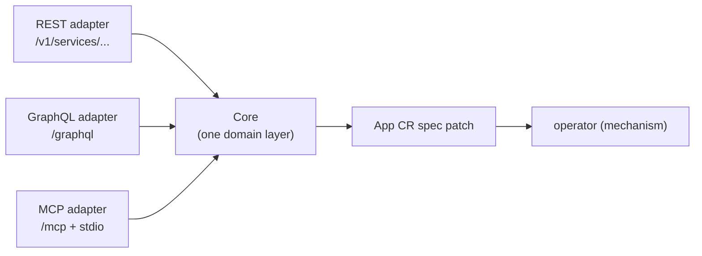

# bex-api — the control-plane seed (REST + GraphQL + MCP)

The first slice of the bex control plane (see [control-plane.md](control-plane.md)): a thin, bearer-authed HTTP service that turns product actions into **App CR spec patches**. It contains no mechanism — it writes intent; the operator converges it. Today it exposes the lifecycle verbs from [restart-suspend-and-resume.md](restart-suspend-and-resume.md).

## One core, three adapters

Render exposes a public **REST** API, drives its dashboard with **GraphQL**, and ships an official **MCP** server — all over one internal service layer. bex-api mirrors that shape:



`Core` (in `operator/internal/api/core.go`) has the only implementation of each verb (`Restart`/`Suspend`/`Resume`/`List`/`Get`/`Logs`/`QueryLogs`/`FollowLogs`). REST (`rest.go`, `rest_logs.go`), GraphQL (`graphql.go`) and MCP (`mcp.go`) are pure presentation calling identical `Core` methods — so the surfaces cannot drift, and each new client is another thin adapter, not a second implementation.

## Auth

Every route except `GET /healthz` requires `Authorization: Bearer <token>` (constant-time compare). The token lives in the Secret `bex-api-token` (namespace `bex-system`), created out-of-band from `.env`'s `BEX_API_TOKEN`; the binary refuses to start without it (fail closed). `BEX_API_CORS_ORIGIN` optionally enables CORS for a browser frontend.

## REST (Render public-API compatible)

Shapes verified against Render's OpenAPI spec (`render-public-api-1.json`): the `{service, cursor}` list envelope, the **string** `suspended` enum (`"suspended"` / `"not_suspended"`, _not_ a boolean), and the verb status codes. Served under Render's noun `/v1/services` and bex's `/v1/apps` alias (same handlers). The App name is the service `id` (Render ids are opaque; a client just round-trips whatever the list returned).

| method + path                    | effect                     | status |
| -------------------------------- | -------------------------- | ------ |
| `GET /healthz`                   | liveness (open)            | 200    |
| `GET /v1/services`               | list `[{service, cursor}]` | 200    |
| `GET /v1/services/{id}`          | one service object         | 200    |
| `POST /v1/services/{id}/restart` | `spec.restartedAt = now`   | 200    |
| `POST /v1/services/{id}/suspend` | `spec.suspended = true`    | 202    |
| `POST /v1/services/{id}/resume`  | `spec.suspended = false`   | 202    |

Verbs return the updated service object (the patch is accepted; the operator converges asynchronously — poll `GET` for `suspended`/`phase`). The service object carries Render's fields (`id`, `name`, `type: "web_service"`, `suspended`, `dashboardUrl`, `createdAt`, `serviceDetails.url`) plus bex extras (`phase`, `replicas`, `revision`) — a superset Render clients safely ignore. bex has no build plans, regions or disks, so those Render fields are omitted.

```sh
curl -H "Authorization: Bearer $BEX_API_TOKEN" https://api.bex.co/v1/services
curl -X POST -H "Authorization: Bearer $BEX_API_TOKEN" https://api.bex.co/v1/services/eden-cms-v2/suspend
```

## GraphQL (Render dashboard compatible)

`POST /graphql`, mirroring the operation names captured from Render's dashboard: queries `services`, `server(id)`; mutations `suspendService(id)`, `resumeService(id)`, `restartServer(id)`; type `Service` with the string `suspended` enum. Every resolver delegates to `Core`.

```sh
curl -X POST https://api.bex.co/graphql \
  -H "Authorization: Bearer $BEX_API_TOKEN" -H "Content-Type: application/json" \
  -d '{"query":"mutation { suspendService(id:\"eden-cms-v2\") { id suspended phase } }"}'
```

```graphql
query {
  services {
    id
    type
    suspended
    url
    phase
  }
}
mutation {
  restartServer(id: "eden-cms-v2") {
    id
    phase
  }
}
```

## Managed Postgres (Render `/v1/postgres` compatible)

CRUD + connection-info for the `Database` CR, shaped to Render's Postgres API (see [postgresql-management.md](postgresql-management.md)):

| method + path | effect | status |
| --- | --- | --- |
| `GET /v1/postgres` | list managed Postgres | 200 |
| `POST /v1/postgres` | create (body: name, plan, version, diskSizeGB, public) | 201 |
| `GET /v1/postgres/{name}` | one instance (Render `postgres` shape) | 200 |
| `DELETE /v1/postgres/{name}` | delete (cascades CNPG Cluster + PVC + route) | 204 |
| `GET /v1/postgres/{name}/connection-info` | password + internal/external strings + psql | 200 |

`connection-info` is the key endpoint — it's how a frontend gets the connection string without cluster access. It's the **only** place the DB password is surfaced (read from CNPG's `<name>-app` Secret at request time, authed), matching Render's `postgresConnectionInfo` (`password`, `internalConnectionString`, `externalConnectionString`, `psqlCommand`).

**Noun split, mirroring Render** (verified: REST spec + dashboard GraphQL captured via Playwright): Render's REST uses `postgres` (`/v1/postgres`) but its **dashboard GraphQL uses `database`** (`database(id)`, `databaseStatusQuery`, `databaseCredentialList`). bex matches both — REST `/v1/postgres` (+ `/v1/databases` alias), GraphQL `databases` / `database(id)` / `databaseConnectionInfo(id)` queries and `createDatabase` / `deleteDatabase` mutations (which also matches bex's own `Database` CRD).

```sh
curl -X POST -H "Authorization: Bearer $BEX_API_TOKEN" -H "Content-Type: application/json" \
  -d '{"name":"my-db","plan":"free","public":true}' https://api.bex.co/v1/postgres
curl -H "Authorization: Bearer $BEX_API_TOKEN" https://api.bex.co/v1/postgres/my-db/connection-info
```

Deferred (map to unbuilt features): `suspend`/`resume`/`restart`, `failover` (needs HA), `recovery`/PITR (needs backups), `credentials`, `export`, and the pooler connection strings (needs a PgBouncer `Pooler`).

## MCP (Render official-server compatible)

The third adapter (`mcp.go`) speaks the Model Context Protocol, so an agent operates bex natively instead of screen-scraping the dashboard. Tool names, argument names, and the returned `service` object track Render's official MCP server (`render-oss/render-mcp-server`), just as REST tracks the OpenAPI spec: `list_services`, `get_service` and `list_logs` are 1:1 with Render's tools, and single-service tools key on Render's `serviceId`. Render's official MCP is read-heavy and omits restart/suspend/resume, so bex adds `restart_service` / `suspend_service` / `resume_service` — named after Render's REST verbs, keyed on the same `serviceId`, so they read as native to a Render-shaped agent. Every tool delegates to the same `Core` method REST/GraphQL call.

| tool | args | Core verb | returns |
| --- | --- | --- | --- |
| `list_services` | — | `List` | `{services: [service, ...]}` |
| `get_service` | `{serviceId}` | `Get` | `service` |
| `restart_service` / `suspend_service` / `resume_service` | `{serviceId}` | `Restart`/`Suspend`/`Resume` | updated `service` |
| `list_logs` | `{resource: [id, ...], limit?}` | `Logs` | `{logs: [{timestamp, message, labels}, ...]}` |

`list_logs` takes Render's required `resource` array of service ids and reads pod logs for each App's instances (selected by the controller's `app.bex.co/app` label), aggregated across resources and instances, timestamp-sorted, capped to `limit`, and tagged with Render-shaped labels (`service`/`instance`/`container`). bex omits Render's structured-log filters (`level`, `statusCode`, `method`, …) it can't honor over raw pod logs — the same rule REST follows for build plans / regions / disks; `list_services` likewise omits Render's optional `includePreviews` (bex has no preview services). The `serviceId` / `resource` ids are App names, opaque and round-tripped from `list_services`, exactly as in REST/GraphQL.

**Transports & auth.** The streamable-HTTP transport mounts at `/mcp` behind the same `bex-api-token` bearer gate as every other route. The stdio transport (`api mcp-stdio`, or `BEX_MCP_STDIO=1`) serves the same tools over stdin/stdout for a locally-launched agent; there the trust boundary is the subprocess itself (it already holds the kube credentials), so no bearer applies. Logs need read-only `pods` + `pods/log` RBAC.

## Logs — REST + GraphQL (Render logs-API compatible)

MCP `list_logs` is the agent surface; the same `Core` logs read is also a Render-shaped **REST** and **GraphQL** query. Full design in [observability.md](observability.md).

| method + path            | effect                                          |
| ------------------------ | ----------------------------------------------- |
| `GET /v1/logs`           | historical query → `{hasMore, next*Time, logs}` |
| `GET /v1/logs/subscribe` | live tail over Server-Sent Events               |

Query params (verified against `render-public-api-1.json`): `resource` (App id, repeatable), `type` (repeatable — `app`/`request`/`build`; `application` is an `app` alias), `text` (search), `startTime`/`endTime` (RFC3339), `limit` (default 20, max 100). The envelope carries all four required fields; each log is Render's required `{id, message, timestamp, labels[]}` with labels `type` (value `app`), `resource`, `instance`. bex only sources **application** logs, so `type=request`/`build` return an empty page (not an error). GraphQL: `logs(resource, type, text, limit)` → `LogEntry { timestamp message type instance }`.

`GET /v1/logs/subscribe` streams over **SSE** where Render upgrades to a **WebSocket** (bex's choice: no dependency, curl-friendly, same "stream new lines live" contract).

```sh
curl -H "Authorization: Bearer $BEX_API_TOKEN" "https://api.bex.co/v1/logs?resource=eden-cms-v2&type=app"
curl -N -H "Authorization: Bearer $BEX_API_TOKEN" "https://api.bex.co/v1/logs/subscribe?resource=eden-cms-v2"
```

## Deploy

Ships in the operator image (`Dockerfile` builds a second `/api` binary); the api Deployment overrides `command: ["/api"]`, so Argo's existing image override covers it with no CI change. Manifests: `operator/config/api/` (Deployment, Service, Ingress `api.bex.co` + cert-manager TLS, least-privilege RBAC — Apps, Databases and their CNPG connection Secrets, plus read-only `pods`/`pods/log` for the logs verb), wired from `config/default`. One-time Secret creation:

```sh
source .env && kubectl -n bex-system create secret generic bex-api-token \
  --from-literal=token=$BEX_API_TOKEN
```

## Scope

Lifecycle verbs, read-only logs, and managed Postgres. Not yet: deploy/rollback, service creation, metrics, tenants/auth beyond the single token, a Postgres source of truth — those arrive (under Render's names, when applicable) as the control plane grows past this seed.
