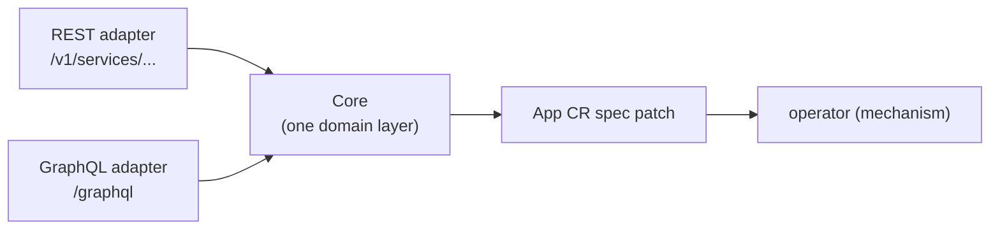

# bex-api — the control-plane seed (REST + GraphQL)

The first slice of the bex control plane (see [control-plane.md](control-plane.md)): a thin, bearer-authed HTTP service that turns product actions into **App CR spec patches**. It contains no mechanism — it writes intent; the operator converges it. Today it exposes the lifecycle verbs from [restart-suspend-and-resume.md](restart-suspend-and-resume.md).

## One core, two adapters

Render exposes a public **REST** API and drives its dashboard with **GraphQL**, both over one internal service layer. bex-api mirrors that shape:



`Core` (in `operator/internal/api/core.go`) has the only implementation of each verb (`Restart`/`Suspend`/`Resume`/`List`/`Get`). REST (`rest.go`) and GraphQL (`graphql.go`) are pure presentation calling identical `Core` methods — so the two APIs cannot drift, and adding a third client later is another thin adapter, not a second implementation.

## Auth

Every route except `GET /healthz` requires `Authorization: Bearer <token>` (constant-time compare). The token lives in the Secret `bex-api-token` (namespace `bex-system`), created out-of-band from `.env`'s `BEX_API_TOKEN`; the binary refuses to start without it (fail closed). `BEX_API_CORS_ORIGIN` optionally enables CORS for a browser frontend.

## REST (Render public-API compatible)

Shapes verified against Render's OpenAPI spec (`render-public-api-1.json`): the `{service, cursor}` list envelope, the **string** `suspended` enum (`"suspended"` / `"not_suspended"`, _not_ a boolean), and the verb status codes. Served under Render's noun `/v1/services` and bex's `/v1/apps` alias (same handlers). The App name is the service `id` (Render ids are opaque; a client just round-trips whatever the list returned).

| method + path                    | effect                     | status |
| -------------------------------- | -------------------------- | ------ |
| `GET /healthz`                   | liveness (open)            | 200    |
| `GET /v1/services`               | list `[{service, cursor}]` | 200    |
| `GET /v1/services/{id}`          | one service object         | 200    |
| `POST /v1/services/{id}/restart` | `spec.restartedAt = now`   | 200    |
| `POST /v1/services/{id}/suspend` | `spec.suspended = true`    | 202    |
| `POST /v1/services/{id}/resume`  | `spec.suspended = false`   | 202    |

Verbs return the updated service object (the patch is accepted; the operator converges asynchronously — poll `GET` for `suspended`/`phase`). The service object carries Render's fields (`id`, `name`, `type: "web_service"`, `suspended`, `dashboardUrl`, `createdAt`, `serviceDetails.url`) plus bex extras (`phase`, `replicas`, `revision`) — a superset Render clients safely ignore. bex has no build plans, regions or disks, so those Render fields are omitted.

```sh
curl -H "Authorization: Bearer $BEX_API_TOKEN" https://api.bex.co/v1/services
curl -X POST -H "Authorization: Bearer $BEX_API_TOKEN" https://api.bex.co/v1/services/eden-cms-v2/suspend
```

## GraphQL (Render dashboard compatible)

`POST /graphql`, mirroring the operation names captured from Render's dashboard: queries `services`, `server(id)`; mutations `suspendService(id)`, `resumeService(id)`, `restartServer(id)`; type `Service` with the string `suspended` enum. Every resolver delegates to `Core`.

```sh
curl -X POST https://api.bex.co/graphql \
  -H "Authorization: Bearer $BEX_API_TOKEN" -H "Content-Type: application/json" \
  -d '{"query":"mutation { suspendService(id:\"eden-cms-v2\") { id suspended phase } }"}'
```

```graphql
query {
  services {
    id
    type
    suspended
    url
    phase
  }
}
mutation {
  restartServer(id: "eden-cms-v2") {
    id
    phase
  }
}
```

## Deploy

Ships in the operator image (`Dockerfile` builds a second `/api` binary); the api Deployment overrides `command: ["/api"]`, so Argo's existing image override covers it with no CI change. Manifests: `operator/config/api/` (Deployment, Service, Ingress `api.bex.co` + cert-manager TLS, least-privilege RBAC — App access only), wired from `config/default`. One-time Secret creation:

```sh
source .env && kubectl -n bex-system create secret generic bex-api-token \
  --from-literal=token=$BEX_API_TOKEN
```

## Scope

Lifecycle verbs only. Not yet: deploy/rollback, tenants/auth beyond the single token, Postgres source of truth — those arrive as the control plane grows past this seed.
