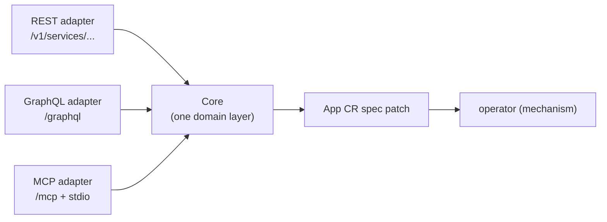

# bex-api — the control-plane seed (REST + GraphQL + MCP)

The product API of the bex control plane (see [control-plane.md](control-plane.md)): an authenticated HTTP service that turns product actions into **App CR spec patches**. It contains no mechanism — it writes intent; the operator converges it. It exposes the lifecycle verbs from [restart-suspend-and-resume.md](restart-suspend-and-resume.md) plus logs, metrics, API keys, env vars, and managed Postgres — and, opt-in (`BEX_CP_DB_URI`), the Postgres source-of-truth store itself.

## One core, three adapters

Render exposes a public **REST** API, drives its dashboard with **GraphQL**, and ships an official **MCP** server — all over one internal service layer. bex-api mirrors that shape:



Each verb has exactly one implementation, in its feature package's `Service` (`lego/backend/internal/{apps,logs,metrics,apikeys,postgres,secrets}/service.go`, all embedding the shared kernel `internal/core/base.go`). Each feature ships its own thin adapter fragments — `rest.go`, `graphql.go`, `mcp.go` beside the service — that are pure presentation calling identical `Service` methods, composed by `internal/api/server.go`. So the surfaces cannot drift, and each new client is another thin adapter, not a second implementation.

## Auth

Every route except `GET /healthz` requires real, per-client credentials from the auth substrate ([auth.md](auth.md)) — **there is no shared static token**:

- **API keys (machines)** — an API key _is_ an OAuth2 client (`client_credentials` grant). Exchange it for a short-lived bearer token, then call the API:

  ```sh
  TOKEN=$(curl -s -X POST https://oauth.bex.co/oauth2/token \
    -d "grant_type=client_credentials&client_id=$KEY_ID&client_secret=$KEY_SECRET" | yq .access_token)
  curl -H "Authorization: Bearer $TOKEN" https://api.bex.co/v1/services
  ```

  Tokens are introspected at Hydra's admin API (`BEX_HYDRA_ADMIN_URL`, cluster-internal, required — the binary refuses to start without it; positive results cached ≤ 30s). Keys are managed through the API itself: `POST /v1/api-keys` (the secret is returned exactly once), `GET /v1/api-keys`, `DELETE /v1/api-keys/{id}` — with GraphQL (`apiKeys`, `createApiKey`, `revokeApiKey`) and MCP (`create_api_key`, `list_api_keys`, `revoke_api_key`) parity. "API key" means the Hydra clients bex minted (stamped `bex.co/api-key` metadata): list hides and revoke refuses everything else, so platform clients can't be revoked through this endpoint. The **first** key, `bex-bootstrap`, is deliberately such a platform client — seeded and rotated only by [scripts/auth-bootstrap-client.sh](../scripts/auth-bootstrap-client.sh) (CI runs it on every deploy; secret from `.env`'s `BEX_BOOTSTRAP_CLIENT_SECRET`).

- **Sessions (humans)** — with no bearer present, an Ory session (cookie or `X-Session-Token`) is validated via Kratos' `whoami` (`BEX_KRATOS_URL` — optional; unset disables sessions). A present bearer is authoritative: an inactive token is 401 with no session fallthrough.

Ory unreachable ⇒ 503 (fail closed; operational recovery goes through kubectl, not this API). The resolved caller (OAuth2 `client_id` or Kratos identity id) is attached to the request context (`api.IdentityFrom`) — the tenant-scoping hook. `BEX_API_CORS_ORIGIN` optionally enables CORS for browser frontends — a comma-separated origin allowlist; the matched request `Origin` is echoed back (credentialed CORS forbids `*`). Prod sets it to `https://dashboard.bex.co,http://localhost:5173` (`lego/operator/config/api/deployment.yaml`) so both the deployed dashboard and a local dashboard dev server (Vite's default port) can call the deployed API; a locally-run bex-api still needs its own `BEX_API_CORS_ORIGIN=http://localhost:5173` since it's a separate deployment. The response carries `Access-Control-Allow-Credentials: true` — required for the dashboard's Kratos-session cookie (or an `X-Session-Token`) to be readable cross-origin at all.

**Authorization** ([auth.md#authorization-openfga](auth.md)): with `BEX_OPENFGA_URL` set, every Core verb additionally checks the caller's permission against OpenFGA (mapped to Render's workspace-role matrix (viewer/contributor/developer/admin/billing — docs/auth.md), on the default workspace) — denial is **403**, OpenFGA unreachable is **503**. Unset (the current prod default until tenant onboarding exists), all authenticated callers may do everything, exactly as before.

## REST (Render public-API compatible)

Shapes verified against Render's OpenAPI spec (`render-public-api-1.json`): the `{service, cursor}` list envelope, the **string** `suspended` enum (`"suspended"` / `"not_suspended"`, _not_ a boolean), and the verb status codes. Served under Render's noun `/v1/services` and bex's `/v1/apps` alias (same handlers). The App name is the service `id` (Render ids are opaque; a client just round-trips whatever the list returned).

| method + path                    | effect                         | status |
| -------------------------------- | ------------------------------ | ------ |
| `GET /healthz`                   | liveness (open)                | 200    |
| `GET /v1/services`               | list `[{service, cursor}]`     | 200    |
| `GET /v1/services/{id}`          | one service object             | 200    |
| `PATCH /v1/services/{id}`        | update, e.g. the instance plan | 200    |
| `POST /v1/services/{id}/restart` | `spec.restartedAt = now`       | 200    |
| `POST /v1/services/{id}/suspend` | `spec.suspended = true`        | 202    |
| `POST /v1/services/{id}/resume`  | `spec.suspended = false`       | 202    |
| `POST /v1/services/{id}/scale`   | `spec.replicas = numInstances` | 202    |

Verbs return the updated service object (the patch is accepted; the operator converges asynchronously — poll `GET` for `suspended`/`phase`). The service object carries Render's fields (`id`, `name`, `type: "web_service"`, `suspended`, `dashboardUrl`, `createdAt`, `serviceDetails.url`) plus bex extras (`phase`, `replicas`, `revision`) — a superset Render clients safely ignore. bex has no build plans, regions or disks, so those Render fields are omitted.

```sh
curl -H "Authorization: Bearer $TOKEN" https://api.bex.co/v1/services
curl -X POST -H "Authorization: Bearer $TOKEN" https://api.bex.co/v1/services/eden-cms-v2/suspend
```

## GraphQL (Render dashboard compatible)

`POST /graphql`, mirroring the operation names captured from Render's dashboard: queries `services`, `server(id)`, plus the bex extension `instanceTypes` (backs the dashboard's plan picker); mutations `suspendService(id)`, `resumeService(id)`, `restartServer(id)`, and the bex extensions `updateServicePlan(id, plan)` and `scaleService(id, numInstances)`; type `Service` with the string `suspended` enum. Every resolver delegates to the same feature `Service`.

```sh
curl -X POST https://api.bex.co/graphql \
  -H "Authorization: Bearer $TOKEN" -H "Content-Type: application/json" \
  -d '{"query":"mutation { suspendService(id:\"eden-cms-v2\") { id suspended phase } }"}'
```

```graphql
query {
  services {
    id
    type
    suspended
    url
    phase
  }
}
mutation {
  restartServer(id: "eden-cms-v2") {
    id
    phase
  }
}
```

## Managed Postgres (Render `/v1/postgres` compatible)

CRUD + connection-info for the `Database` CR, shaped to Render's Postgres API (see [postgresql-management.md](postgresql-management.md)):

| method + path | effect | status |
| --- | --- | --- |
| `GET /v1/postgres` | list managed Postgres | 200 |
| `POST /v1/postgres` | create (body: name, plan, version, diskSizeGB, public) | 201 |
| `GET /v1/postgres/{name}` | one instance (Render `postgres` shape) | 200 |
| `DELETE /v1/postgres/{name}` | delete (cascades CNPG Cluster + PVC + route) | 204 |
| `GET /v1/postgres/{name}/connection-info` | password + internal/external strings + psql | 200 |

`connection-info` is the key endpoint — it's how a frontend gets the connection string without cluster access. It's the **only** place the DB password is surfaced (read from CNPG's `<name>-app` Secret at request time, authed), matching Render's `postgresConnectionInfo` (`password`, `internalConnectionString`, `externalConnectionString`, `psqlCommand`).

**Noun split, mirroring Render** (verified: REST spec + dashboard GraphQL captured via Playwright): Render's REST uses `postgres` (`/v1/postgres`) but its **dashboard GraphQL uses `database`** (`database(id)`, `databaseStatusQuery`, `databaseCredentialList`). bex matches both — REST `/v1/postgres` (+ `/v1/databases` alias), GraphQL `databases` / `database(id)` / `databaseConnectionInfo(id)` queries and `createDatabase` / `deleteDatabase` mutations (which also matches bex's own `Database` CRD).

**Three adapters:** managed Postgres is served over all three surfaces. **MCP** (Render official-server names): `list_postgres_instances`, `get_postgres` (`{postgresId}`) and `create_postgres` delegate to the same `List`/`Get`/`Create` Core verbs as REST/GraphQL. Render's `query_render_postgres` (run a read-only SQL query) is omitted — it needs live in-cluster connectivity to the tenant DB from the API layer, a deferred capability (omitted, not faked). GraphQL adds one bex extension with no Render counterpart, `databaseInstanceTypes` (the create-dialog plan picker's catalog read, sourced from `lego/types/tiers`) — REST/MCP-free by design, exactly like the compute `instanceTypes`.

```sh
curl -X POST -H "Authorization: Bearer $TOKEN" -H "Content-Type: application/json" \
  -d '{"name":"my-db","plan":"free","public":true}' https://api.bex.co/v1/postgres
curl -H "Authorization: Bearer $TOKEN" https://api.bex.co/v1/postgres/my-db/connection-info
```

Deferred (map to unbuilt features): `suspend`/`resume`/`restart`, `failover` (needs HA), `recovery`/PITR (needs backups), `credentials`, `export`, and the pooler connection strings (needs a PgBouncer `Pooler`).

## MCP (Render official-server compatible)

The third adapter (`mcp.go`) speaks the Model Context Protocol, so an agent operates bex natively instead of screen-scraping the dashboard. Tool names, argument names, and the returned `service` object track Render's official MCP server (`render-oss/render-mcp-server`), just as REST tracks the OpenAPI spec: `list_services`, `get_service` and `list_logs` track Render's tools (names + args), and single-service tools key on Render's `serviceId`. Render's official MCP is read-heavy and omits restart/suspend/resume, so bex adds `restart_service` / `suspend_service` / `resume_service` — named after Render's REST verbs, keyed on the same `serviceId`, so they read as native to a Render-shaped agent. `list_logs` and `get_metrics` give an agent the same observability reads as the REST/GraphQL surfaces (three-adapter parity). Managed Postgres tracks Render's official Postgres tools — `list_postgres_instances`, `get_postgres` (keyed on Render's `postgresId`) and `create_postgres` — while omitting Render's `query_render_postgres` (read-only SQL execution needs live in-cluster DB connectivity, deferred). Every tool delegates to the same `Core` method REST/GraphQL call.

| tool | args | Core verb | returns |
| --- | --- | --- | --- |
| `list_services` | — | `List` | `{services: [service, ...]}` |
| `get_service` | `{serviceId}` | `Get` | `service` |
| `restart_service` / `suspend_service` / `resume_service` | `{serviceId}` | `Restart`/`Suspend`/`Resume` | updated `service` |
| `update_service_plan` | `{serviceId, plan}` | `SetPlan` | updated `service` |
| `scale_service` | `{serviceId, numInstances}` | `Scale` | updated `service` |
| `list_logs` | `{resource: [id, ...], type?, text?, startTime?, endTime?, limit?}` | `QueryLogs` | `{logs: [{timestamp, message, labels}, ...]}` |
| `get_metrics` | `{resource: [id, ...], metricTypes: [...], startTime?, endTime?, resolutionSeconds?, quantile?, percentage?}` | `Metrics` | `{series: [{labels, unit, points}, ...]}` |
| `list_postgres_instances` | — | `ListPostgres` | `{postgres: [postgres, ...]}` |
| `get_postgres` | `{postgresId}` | `GetPostgres` | `postgres` |
| `create_postgres` | `{name, plan?, version?, diskSizeGB?, public?}` | `CreatePostgres` | created `postgres` |

`list_logs` takes Render's required `resource` array of service ids and reads pod logs for each App's instances (selected by the controller's `app.bex.co/app` label), aggregated across resources and instances, timestamp-sorted, capped to `limit`, and tagged with Render-shaped labels (`service`/`instance`/`container`). It honors the Render filters bex can serve over raw pod logs — `type` (`app`/`request`/`build`, app-only sourced), `text`, `startTime`/`endTime` — routed through the same `QueryLogs` the REST adapter uses; it omits Render's structured request-log filters (`level`, `instance`, `host`, `statusCode`, `method`, `path`, `direction`) it can't honor, the same rule REST follows for build plans / regions / disks; `list_services` likewise omits Render's optional `includePreviews` (bex has no preview services). The `serviceId` / `resource` ids are App names, opaque and round-tripped from `list_services`, exactly as in REST/GraphQL.

**Transports & auth.** The streamable-HTTP transport mounts at `/mcp` behind the same auth gate as every other route (Hydra-introspected bearer or Kratos session — see [Auth](#auth)). The stdio transport (`api mcp-stdio`, or `BEX_MCP_STDIO=1`) serves the same tools over stdin/stdout for a locally-launched agent; there the trust boundary is the subprocess itself (it already holds the kube credentials), so no bearer applies. Logs need read-only `pods` + `pods/log` RBAC.

## Logs — REST + GraphQL (Render logs-API compatible)

MCP `list_logs` is the agent surface; the same `Core` logs read is also a Render-shaped **REST** and **GraphQL** query. Full design in [observability.md](observability.md).

| method + path            | effect                                          |
| ------------------------ | ----------------------------------------------- |
| `GET /v1/logs`           | historical query → `{hasMore, next*Time, logs}` |
| `GET /v1/logs/subscribe` | live tail over Server-Sent Events               |

Query params (verified against `render-public-api-1.json`): `resource` (App id, repeatable), `type` (repeatable — `app`/`request`/`build`; `application` is an `app` alias), `text` (search), `startTime`/`endTime` (RFC3339), `limit` (default 20, max 100). The envelope carries all four required fields; each log is Render's required `{id, message, timestamp, labels[]}` with labels `type` (value `app`), `resource`, `instance`. bex only sources **application** logs, so `type=request`/`build` return an empty page (not an error). GraphQL: `logs(resource, type, text, limit)` → `LogEntry { timestamp message type instance }`.

`GET /v1/logs/subscribe` streams over **SSE** where Render upgrades to a **WebSocket** (bex's choice: no dependency, curl-friendly, same "stream new lines live" contract).

```sh
curl -H "Authorization: Bearer $TOKEN" "https://api.bex.co/v1/logs?resource=eden-cms-v2&type=app"
curl -N -H "Authorization: Bearer $TOKEN" "https://api.bex.co/v1/logs/subscribe?resource=eden-cms-v2"
```

## Metrics — REST + GraphQL (Render metrics-API compatible)

Resource and request metrics through the same `Core.Metrics` verb, shaped to Render's metrics endpoints. Full design in [observability.md](observability.md).

| method + path | metric |
| --- | --- |
| `GET /v1/metrics/cpu` | per-instance CPU (cores, or % of limit with `percentage=true`) |
| `GET /v1/metrics/memory` | per-instance memory (bytes, or %) |
| `GET /v1/metrics/instance-count` | running replica count (needs no metrics-server) |
| `GET /v1/metrics/http-requests` | request rate |
| `GET /v1/metrics/http-latency` | latency percentile (`quantile`, default p95) |
| `GET /v1/metrics/bandwidth` | outbound bytes/s |

Query params (Render vocabulary): `resource` (App id, repeatable), `startTime`/`endTime` (RFC3339), `resolutionSeconds`, `quantile`, `statusCode`/`host`/`path`/`groupBy` (request filters), plus a bex extra `percentage`. Each endpoint returns Render's time-series array `[{labels:[{field,value}], unit, values:[{timestamp,value}]}]`. GraphQL mirrors Render's dashboard: `metrics(query: MetricsQueryInput!)` (fields `filters`, `name`, `start`/`end`, `resolution`, `parameters`, `aggregateBy`, `aggregationMethod`, `aggregateAllMethod`) → `MetricSeries { unit, labels{field,value}, values{time,value}, parameters }` — note the sample list is `values` with a `time` field (REST calls the same data `values[].timestamp`). Companion dashboard queries: `monthToDateBandwidth`, `metricsFilters`, `metricsPathFilterSuggestions`.

Resource metrics need **metrics-server** (`cpu`/`memory`; `instance_count` doesn't); request metrics need **Traefik scraped by Prometheus** (`BEX_PROM_URL`). A metric whose source isn't wired returns **503**. metrics-server is a snapshot, so cpu/memory carry a single current point (the time range is accepted for compatibility); request metrics honor it. `host`/`path` filters are accepted but not yet applied (Traefik service counters lack those labels).

```sh
curl -H "Authorization: Bearer $TOKEN" "https://api.bex.co/v1/metrics/cpu?resource=eden-cms-v2&percentage=true"
curl -H "Authorization: Bearer $TOKEN" "https://api.bex.co/v1/metrics/http-latency?resource=eden-cms-v2&quantile=0.99"
```

## Env vars — tenant secrets (Render `env-vars` compatible)

A service's environment variables — the credentials an agent's app needs (a database URL, a third-party API key) — are set through all three surfaces. Values live in **OpenBao** (the tenant secret store, [secrets.md](secrets.md)), _not_ in the App CR: the CR only carries a `spec.envFromSecret` reference to the per-app `<name>-env` Secret bex-api materializes from OpenBao. This is the first end-to-end tenant-credential path — before it, an App received no configuration beyond `PORT`. The feature is its own package, `lego/backend/internal/secrets`.

All five of Render's env-var **REST** endpoints, verified against Render's public OpenAPI (the `{envVar, cursor}` list envelope, the bare `{key, value}` single object, the replace-all body):

| method + path | effect | status |
| --- | --- | --- |
| `GET /v1/services/{id}/env-vars` | list `[{envVar:{key,value}, cursor}]` | 200 |
| `GET /v1/services/{id}/env-vars/{key}` | one variable (bare `{key,value}`) | 200 |
| `PUT /v1/services/{id}/env-vars` | replace the whole set (body `[{key,value}]`), returns the new set | 200 |
| `PUT /v1/services/{id}/env-vars/{key}` | add/update one (body `{value}`), merged into the set | 200 |
| `DELETE /v1/services/{id}/env-vars/{key}` | remove one variable | 204 |

The bulk `PUT` is Render's **replace-set** (unlisted keys are removed); the single-key `PUT` **merges** one variable. On any write bex-api stores the map in OpenBao (source of truth), projects it into the `<name>-env` Secret, and rolls the pods (via `spec.restartedAt`) so the new values take effect. Names are validated (`[A-Za-z_][A-Za-z0-9_]*`); values never appear in logs or error messages, only in the authenticated `GET`/`PUT` responses. Reading requires the sensitive-read scope (`can_view_sensitive`), writing the manage scope (`can_create`) — the same OpenFGA checker as every verb, so a tuple-less key gets **403**.

**GraphQL follows Render's _dashboard_, not the public REST shape** (captured live from `dashboard.render.com`): env vars are **nested under the service** and **keys-first**, matching Render's `serviceEnvVarKeys` operation. `service(id) { envVarKeys { id key } }` (there is a `service(id)` query alias beside `server(id)`) lists keys only, each with an `id` (bex has no separate id, so it's the key); `service(id) { envVar(key) { id key value } }` fetches one value on demand, mirroring the dashboard's "Show secret" (values are never in the bulk list). Those nested fields live on the apps `Service` type and reach the secrets feature through a `core.EnvVarReader` seam the composition root injects — so neither feature imports the other and the shared GraphQL type stays stateless. Mutations `setEnvVars(serviceId, envVars:[{key,value}])` / `setEnvVar(serviceId, key, value)` / `deleteEnvVar(serviceId, key)` return a success boolean (Render's dashboard mutation names weren't captured, so these are bex's own). MCP: `list_env_vars`, `get_env_var`, `update_env_vars`, `set_env_var`, `delete_env_var`. Every surface delegates to the same `Service` methods — REST → public API, GraphQL → dashboard.

**Deliberate divergence from Render:** Render's env-var writes are _not_ deployed automatically (you call a deploy afterward); bex has no separate deploy verb, so a write **rolls the pods immediately** — the value is live once the rollout completes. bex also omits Render's list **pagination** (`cursor`/`limit`), `generateValue` (server-generated secrets), env **groups**, and **secret files** — the "omit what bex doesn't honor, stay a safe superset" rule.

With `BEX_OPENBAO_URL` unset, bex-api has no secret store and these endpoints return **503** — the rest of the API unaffected.

```sh
curl -X PUT -H "Authorization: Bearer $TOKEN" -H "Content-Type: application/json" \
  -d '[{"key":"DATABASE_URL","value":"postgres://…"},{"key":"API_KEY","value":"sk-…"}]' \
  https://api.bex.co/v1/services/eden-cms-v2/env-vars
```

## Deploy

Ships in the operator image (`Dockerfile` builds a second `/api` binary); the api Deployment overrides `command: ["/api"]`, so Argo's existing image override covers it with no CI change. Manifests: `lego/operator/config/api/` (Deployment, Service, Ingress `api.bex.co` + cert-manager TLS, least-privilege RBAC — Apps, Databases and their CNPG connection Secrets, plus read-only `pods`/`pods/log` for the logs verb and `metrics.k8s.io` for resource metrics), wired from `config/default`. No token Secret exists — credentials live in Hydra; the bootstrap key is seeded by `scripts/auth-bootstrap-client.sh` (deploy.yml does this automatically).

## Scope

Lifecycle verbs (including plan changes), read-only logs and metrics, API keys, env vars, and managed Postgres. The Postgres source of truth exists as an opt-in in the same binary (`BEX_CP_DB_URI` — see [control-plane.md](control-plane.md)). Not yet: deploy/rollback, service creation, tenant scoping of credentials — those arrive (under Render's names, when applicable) as the control plane grows past this seed.
