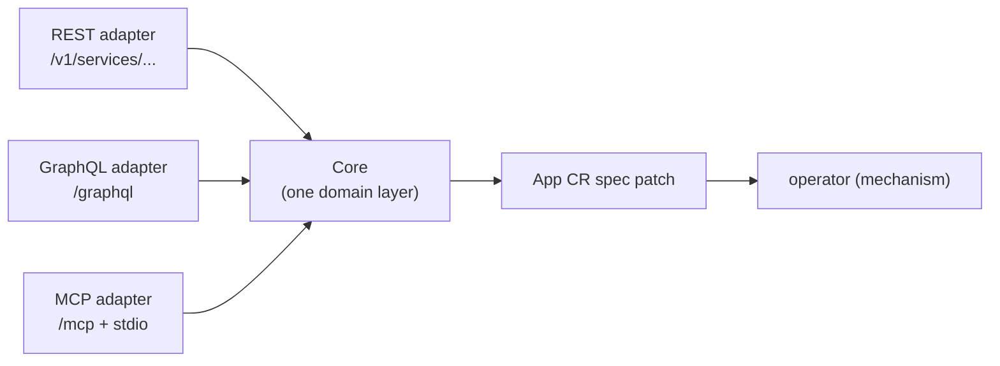

# bex-api — the control-plane seed (REST + GraphQL + MCP)

The product API of the bex control plane (see [control-plane.md](control-plane.md)): an authenticated HTTP service that turns product actions into **App CR spec patches**. It contains no mechanism — it writes intent; the operator converges it. It exposes the lifecycle verbs from [restart-suspend-and-resume.md](restart-suspend-and-resume.md) plus logs, metrics, API keys, env vars, and managed Postgres — and, opt-in (`BEX_CP_DB_URI`), the Postgres source-of-truth store itself.

## One core, three adapters

Render exposes a public **REST** API, drives its dashboard with **GraphQL**, and ships an official **MCP** server — all over one internal service layer. bex-api mirrors that shape:



Each verb has exactly one implementation, in its feature package's `Service` (`lego/backend/internal/{apps,logs,metrics,apikeys,postgres,keyvalue,secrets}/service.go`, all embedding the shared kernel `internal/core/base.go`). Each feature ships its own thin adapter fragments — `rest.go`, `graphql.go`, `mcp.go` beside the service — that are pure presentation calling identical `Service` methods, composed by `internal/api/server.go`. So the surfaces cannot drift, and each new client is another thin adapter, not a second implementation.

## Auth

Every route except `GET /healthz` requires real, per-client credentials from the auth substrate ([auth.md](auth.md)) — **there is no shared static token**:

- **API keys (machines)** — an API key _is_ an OAuth2 client (`client_credentials` grant). Exchange it for a short-lived bearer token, then call the API:

  ```sh
  TOKEN=$(curl -s -X POST https://oauth.bex.co/oauth2/token \
    -d "grant_type=client_credentials&client_id=$KEY_ID&client_secret=$KEY_SECRET" | yq .access_token)
  curl -H "Authorization: Bearer $TOKEN" https://api.bex.co/v1/services
  ```

  Tokens are introspected at Hydra's admin API (`BEX_HYDRA_ADMIN_URL`, cluster-internal, required — the binary refuses to start without it; positive results cached ≤ 30s). Keys are managed through the API itself: `POST /v1/api-keys` (the secret is returned exactly once), `GET /v1/api-keys`, `DELETE /v1/api-keys/{id}` — with GraphQL (`apiKeys`, `createApiKey`, `revokeApiKey`) and MCP (`create_api_key`, `list_api_keys`, `revoke_api_key`) parity. "API key" means the Hydra clients bex minted (stamped `bex.co/api-key` metadata): list hides and revoke refuses everything else, so platform clients can't be revoked through this endpoint. The **first** key, `bex-bootstrap`, is deliberately such a platform client — seeded and rotated only by [scripts/auth-bootstrap-client.sh](../scripts/auth-bootstrap-client.sh) (CI runs it on every deploy; secret from `.env`'s `BEX_BOOTSTRAP_CLIENT_SECRET`).

  **Dashboard surface (w4/m8):** a logged-in human mints/lists/revokes keys from Settings → API Keys (`dashboard/src/features/api-keys/`) over this same GraphQL adapter — no separate REST surface for the UI. The list is workspace-shared, not "my keys" (see [auth.md](auth.md#authorization-openfga) — keys carry no per-user owner), and the secret is shown exactly once at creation, matching the CLI/API contract above.

- **Sessions (humans)** — with no bearer present, an Ory session (cookie or `X-Session-Token`) is validated via Kratos' `whoami` (`BEX_KRATOS_URL` — optional; unset disables sessions). A present bearer is authoritative: an inactive token is 401 with no session fallthrough.

Ory unreachable ⇒ 503 (fail closed; operational recovery goes through kubectl, not this API). The resolved caller (OAuth2 `client_id` or Kratos identity id) is attached to the request context (`api.IdentityFrom`) — the tenant-scoping hook. `BEX_API_CORS_ORIGIN` optionally enables CORS for browser frontends — a comma-separated origin allowlist; the matched request `Origin` is echoed back (credentialed CORS forbids `*`). Prod sets it to `https://dashboard.bex.co,http://localhost:5173` (`lego/operator/config/api/deployment.yaml`) so both the deployed dashboard and a local dashboard dev server (Vite's default port) can call the deployed API; a locally-run bex-api still needs its own `BEX_API_CORS_ORIGIN=http://localhost:5173` since it's a separate deployment. The response carries `Access-Control-Allow-Credentials: true` — required for the dashboard's Kratos-session cookie (or an `X-Session-Token`) to be readable cross-origin at all.

**Authorization** ([auth.md#authorization-openfga](auth.md)): with `BEX_OPENFGA_URL` set, every Core verb additionally checks the caller's permission against OpenFGA (mapped to Render's workspace-role matrix (viewer/contributor/developer/admin/billing — docs/auth.md), on the caller's workspace — `workspace:tea-<id>`, resolved from the control-plane store) — denial is **403**, OpenFGA unreachable is **503**. On in prod since w1/m9 (tenant onboarding: a human's first login mints a workspace, and minted API keys are bound to their tenant); unset ⇒ all authenticated callers may do everything, the pre-authorization behavior used when the store is off (dev, store-off).

## REST (Render public-API compatible)

Shapes verified against Render's OpenAPI spec (`render-public-api-1.json`): the `{service, cursor}` list envelope, the **string** `suspended` enum (`"suspended"` / `"not_suspended"`, _not_ a boolean), and the verb status codes. Served under Render's noun `/v1/services` and bex's `/v1/apps` alias (same handlers). The App name is the service `id` (Render ids are opaque; a client just round-trips whatever the list returned).

| method + path | effect | status |
| --- | --- | --- |
| `GET /healthz` | liveness (open) | 200 |
| `POST /v1/services` | create-or-update a service (upsert) | 201 |
| `GET /v1/services` | list `[{service, cursor}]` | 200 |
| `GET /v1/services/{id}` | one service object | 200 |
| `PATCH /v1/services/{id}` | update `serviceDetails.plan` and/or the bex extra `serviceDetails.idleTTLSeconds` | 200 |
| `POST /v1/services/{id}/restart` | `spec.restartedAt = now` | 200 |
| `POST /v1/services/{id}/suspend` | `spec.suspended = true` | 202 |
| `POST /v1/services/{id}/resume` | `spec.suspended = false` | 202 |
| `POST /v1/services/{id}/scale` | `spec.replicas = numInstances` | 202 |
| `POST /v1/cron-jobs/{id}/runs` | trigger a one-off run of a `cron_job` (`spec.runAt = now`); also `POST /v1/services/{id}/runs` | 201 |
| `POST /v1/webhooks/git` | HMAC-verified push → redeploy (ungated) | 200 |

Verbs return the updated service object (the patch is accepted; the operator converges asynchronously — poll `GET` for `suspended`/`phase`). The service object carries Render's fields (`id`, `name`, `type` (the serviceType — see below), `suspended`, `dashboardUrl`, `createdAt`, `serviceDetails.url`) plus bex extras (`phase`, `replicas`, `revision`) — a superset Render clients safely ignore. bex has no build plans, regions or disks, so those Render fields are omitted.

`POST /v1/services` is the create surface, and it is an **upsert**: a repeat call for the same `name` updates the service (a redeploy — the spec is re-applied and `spec.restartedAt` bumped so a repo-backed App rebuilds) rather than creating a duplicate. The body is shaped to Render's create schema (verified against its public API): top-level `type`, `name`, `repo`, `branch`, `image` (an **object** `{imagePath}`, not a string), `envVars: [{key, value}]`, and `serviceDetails.{plan, numInstances, healthCheckPath}` — the same nested location `PATCH`/`GET` use. One of `repo` (build-from-git) or the `image` object (prebuilt) is required. Render fields bex can't yet honor are ignored (a safe superset): `ownerId` (single workspace), `region` (single region), `autoDeploy` (push-to-deploy is the webhook below, not a poll), and the `serviceDetails` runtime build/start commands (bex builds via Dockerfile/CNB auto-detection). bex adds a few extensions with no Render create-body equivalent — `builder`, `port` (Render auto-detects it), `domains` (custom domains in one call), and a top-level `plan` convenience. It writes the App CR directly (the hand-applied path); the row-backed, multi-tenant create is the internal control-plane API's job (`store` `POST /v1/apps`).

**Service `type`s (Render's serviceType).** `type` picks the service kind and defaults to `web_service` (an HTTP service exposed at a URL). bex covers four of Render's types:

- `web_service` — HTTP service, exposed at `<name>.<BEX_BASE_DOMAIN>` (Deployment + Service + Ingress).
- `private_service` — HTTP service reachable only in-cluster (Deployment + ClusterIP Service, no platform Ingress).
- `background_worker` — runs the image with **no HTTP port**: a bare Deployment, no Service, no Ingress, **no URL**.
- `cron_job` — runs the image's command on a **`schedule`** (5-field crontab, required) as a Kubernetes CronJob (no Deployment/Service/Ingress). An optional **`command`** overrides the image's default entrypoint (`/bin/sh -c <command>`, applied in `cronPodSpec`); empty runs the image's own command unmodified. Both are accepted top-level or under `serviceDetails` (Render's `cronJobDetails.schedule`/`.command`); the service object reports them back at `serviceDetails.schedule`/`.command`, and recent runs (`{name, startedAt, finishedAt, status}`, newest first) at `runs`. `background_worker`/`cron_job` have no ingress, so they cannot carry `domains`. Render's `static_site` is out of scope (a build→CDN effort, deferred). The dashboard's cron Settings tab shows both fields in a **Deploy** section, read-only for now (w5/m11) — in place of Custom Domains/Idle timeout, neither of which applies to a service with no HTTP traffic.

`POST /v1/cron-jobs/{id}/runs` (Render's cron run trigger; also mounted under the `/v1/services` and `/v1/apps` nouns as `.../{id}/runs`) bumps `spec.runAt`, and the operator materializes a one-off Job — visible in the service's `runs` once it starts. Rejected (`400`) for a non-cron service.

```sh
curl -H "Authorization: Bearer $TOKEN" https://api.bex.co/v1/services
curl -X POST -H "Authorization: Bearer $TOKEN" https://api.bex.co/v1/services/eden-cms-v2/suspend
curl -X POST -H "Authorization: Bearer $TOKEN" -H "Content-Type: application/json" \
  https://api.bex.co/v1/services -d '{"name":"hello","repo":"https://github.com/bex/hello","serviceDetails":{"plan":"starter"}}'
```

### Deploy-from-chat (pillar 4)

"Deploy this" is **one call, no bespoke endpoint** — it rides the same create surface (ADR: [deploy-from-chat.md](deploy-from-chat.md)). Over MCP the `deploy` tool takes a `{repo, bexYaml}` (`bexYaml` is the project's render.yaml-shaped `bex.yml`); it parses the manifest, maps its fields onto a `CreateRequest` (the same mapping `scripts/app-apply.sh` uses), and calls `Create`. `create_web_service` is the equivalent with structured args (a `repo` or `image`). A later push closes the loop through the webhook below.

### Deploy history + trigger (w2/m5, Render `/deploys` compatible)

Every rollout of a store-managed App (`BEX_CP_DB_URI`) is a row: `GET /v1/services/{id}/deploys` (the `{deploy, cursor}` list envelope, newest first) and `GET /v1/services/{id}/deploys/{deployId}` are Render's `list_deploys`/`get_deploy` REST equivalents; `POST /v1/services/{id}/deploys` (201) triggers a fresh deploy — for an image-backed service, a re-pull/restart now (`spec.restartedAt` bumped the same no-row way `restart` does); build-from-git triggering activates when w1/m5 lands. Render's trigger body may carry `clearCache` — accepted and ignored (bex has no build cache), the safe-superset rule. A suspended service refuses the trigger, **409**. Status flows `update_in_progress -> live` (health-gated: the App CR reaches `Running`) or `-> update_failed` (the CR reaches `Failed`, or the deploy stays open past a gating window — covers a bad image stuck `ImagePullBackOff`, which never makes the CR's own phase machine fail on its own). `build_in_progress`/`build_failed` are reserved for w1/m5. This is **store-only**: a hand-applied App (no control-plane row) has empty history, and with the store off entirely every verb is **503** (omitted, not faked — the env-vars precedent). Its own feature package, `lego/backend/internal/deploys`.

```sh
curl -H "Authorization: Bearer $TOKEN" https://api.bex.co/v1/services/eden-cms-v2/deploys
curl -X POST -H "Authorization: Bearer $TOKEN" https://api.bex.co/v1/services/eden-cms-v2/deploys
```

### Push-to-deploy webhook

`POST /v1/webhooks/git` is the git-host push webhook. It sits **outside the OAuth gate** — a git host can't present a bearer token, so its authentication is an HMAC-SHA256 signature over the raw body (`X-Hub-Signature-256: sha256=<hex>`, GitHub/Gitea style) verified in constant time against the shared secret `BEX_WEBHOOK_SECRET`. A valid push redeploys every App whose `spec.repo` matches the pushed repository (compared across the payload's clone/ssh/html/api URL forms, canonicalized) and whose tracked branch matches the pushed ref; an absent or mismatched signature is **401** with no action, and an unset secret makes the endpoint **503**.

## GraphQL (Render dashboard compatible)

`POST /graphql`, mirroring the operation names captured from Render's dashboard: queries `services`, `server(id)`, plus the bex extension `instanceTypes` (backs the dashboard's plan picker); mutations `suspendService(id)`, `resumeService(id)`, `restartServer(id)`, and the bex extensions `updateServicePlan(id, plan)`, `scaleService(id, numInstances)`, `setIdleTimeout(id, idleTTLSeconds)` (the free-tier auto-sleep window — no Render counterpart, w1/m4.5), `createService(name, type?, schedule?, command?, repo?, image?, branch?, plan?, port?, replicas?)` (the create-or-update upsert — its name/shape unconfirmed against a live Render capture, like the two before it) and `runCronJob(id)` (trigger a one-off cron run); type `Service` with the string `suspended` enum, the `type` serviceType, the bex-native `idleTTLSeconds` field, and — for a `cron_job` — `schedule`, `command` (entrypoint override, empty runs the image's own command), and `runs { name startedAt finishedAt status }`. Every resolver delegates to the same feature `Service`.

`deploys(serviceId)` (w2/m5) reads a service's deploy history for the dashboard's Deploys/Events tab: type `Deploy { id status trigger image createdAt startedAt finishedAt }`, same store-only/503-without-`BEX_CP_DB_URI` rule as the REST endpoint. Read-only — triggering a deploy is REST-only for now (`POST .../deploys`).

```sh
curl -X POST https://api.bex.co/graphql \
  -H "Authorization: Bearer $TOKEN" -H "Content-Type: application/json" \
  -d '{"query":"mutation { suspendService(id:\"eden-cms-v2\") { id suspended phase } }"}'
```

```graphql
query {
  services {
    id
    type
    suspended
    url
    phase
  }
}
mutation {
  restartServer(id: "eden-cms-v2") {
    id
    phase
  }
}
```

## Managed Postgres (Render `/v1/postgres` compatible)

CRUD + connection-info for the `Database` CR, shaped to Render's Postgres API (see [postgresql-management.md](postgresql-management.md)):

| method + path | effect | status |
| --- | --- | --- |
| `GET /v1/postgres` | list managed Postgres | 200 |
| `POST /v1/postgres` | create (body: name, plan, version, diskSizeGB, public) | 201 |
| `GET /v1/postgres/{name}` | one instance (Render `postgres` shape) | 200 |
| `DELETE /v1/postgres/{name}` | delete (cascades CNPG Cluster + PVC + route) | 204 |
| `GET /v1/postgres/{name}/connection-info` | password + internal/external strings + psql | 200 |

`connection-info` is the key endpoint — it's how a frontend gets the connection string without cluster access. It's the **only** place the DB password is surfaced (read from CNPG's `<name>-app` Secret at request time, authed), matching Render's `postgresConnectionInfo` (`password`, `internalConnectionString`, `externalConnectionString`, `psqlCommand`).

**Noun split, mirroring Render** (verified: REST spec + dashboard GraphQL captured via Playwright): Render's REST uses `postgres` (`/v1/postgres`) but its **dashboard GraphQL uses `database`** (`database(id)`, `databaseStatusQuery`, `databaseCredentialList`). bex matches both — REST `/v1/postgres` (+ `/v1/databases` alias), GraphQL `databases` / `database(id)` / `databaseConnectionInfo(id)` queries and `createDatabase` / `deleteDatabase` mutations (which also matches bex's own `Database` CRD).

**Three adapters:** managed Postgres is served over all three surfaces. **MCP** (Render official-server names): `list_postgres_instances`, `get_postgres` (`{postgresId}`) and `create_postgres` delegate to the same `List`/`Get`/`Create` Core verbs as REST/GraphQL, plus `query_render_postgres` (run a read-only SQL query) — **MCP-only, exactly like Render**, which exposes no REST/GraphQL equivalent. The query runs over CNPG's internal URI inside a hard read-only envelope (`default_transaction_read_only=on` + statement timeout + explicit `BEGIN READ ONLY` + a row cap); writes, DDL and multi-statement escapes are rejected by Postgres itself, not by SQL parsing, and query text/values never reach a log or error string. GraphQL adds one bex extension with no Render counterpart, `databaseInstanceTypes` (the create-dialog plan picker's catalog read, sourced from `lego/types/tiers`) — REST/MCP-free by design, exactly like the compute `instanceTypes`.

```sh
curl -X POST -H "Authorization: Bearer $TOKEN" -H "Content-Type: application/json" \
  -d '{"name":"my-db","plan":"free","public":true}' https://api.bex.co/v1/postgres
curl -H "Authorization: Bearer $TOKEN" https://api.bex.co/v1/postgres/my-db/connection-info
```

Deferred (map to unbuilt features): `suspend`/`resume`/`restart`, `failover` (needs HA), `recovery`/PITR (needs backups), `credentials`, `export`, and the pooler connection strings (needs a PgBouncer `Pooler`).

## Managed Key Value (Render `/v1/key-value` compatible)

CRUD + connection-info + suspend/resume for the `KeyValue` CR, shaped to Render's Key Value API — the datastore sibling of managed Postgres, one engine down (Valkey, see [keyvalue-management.md](keyvalue-management.md)):

| method | purpose | status |
| --- | --- | --- |
| `GET /v1/key-value` | list managed key-value stores | 200 |
| `POST /v1/key-value` | create (body: name, plan, version, storageGB, public) | 201 |
| `GET /v1/key-value/{name}` | one store (Render `keyValue` shape) | 200 |
| `DELETE /v1/key-value/{name}` | delete (cascades StatefulSet + PVC + Secret + route) | 204 |
| `GET /v1/key-value/{name}/connection-info` | internal/external strings + CLI command | 200 |
| `POST /v1/key-value/{name}/suspend` · `/resume` | scale the Valkey to/from zero (data preserved) | 202 |

`connection-info` mirrors Render's `keyValueConnectionInfo` (`internalConnectionString` `redis://…`, `externalConnectionString` `rediss://…` when public, `cliCommand`) — read from the operator-generated Secret at request time, authed. Unlike Postgres there is no standalone `password` field: the password lives inside the connection strings (Valkey's `redis://:<password>@host` form), matching Render.

**Noun, mirroring Render + the CRD:** REST `/v1/key-value`; GraphQL `keyValue*` (`keyValues` / `keyValue(id)` / `keyValueConnectionInfo(id)` queries, `createKeyValue` / `deleteKeyValue` / `suspendKeyValue` / `resumeKeyValue` mutations, plus the bex-extension `keyValueInstanceTypes` plan-picker read) — matching bex's own `KeyValue` CRD and Render's current "Key Value" product name. **MCP** (Render official-server names): `list_key_value_instances`, `get_key_value` (`{keyValueId}`), `create_key_value` — Render's exact three-tool set; Render's MCP server has no KV delete/suspend tools, so bex mirrors that (those verbs are REST + GraphQL only), never adding drift. The store's id is its name (name-as-id, the documented datastore deviation — [identifiers.md](identifiers.md)). Divergences vs Render, all conscious: the internal URL always mints a password (Render leaves it unauthenticated by default — bex is stricter); `maxmemoryPolicy`/`persistenceMode`/`ipAllowList` are omitted rather than faked (the CR can't back them yet). Dashboard surface → w5/m12.

## MCP (Render official-server compatible)

The third adapter (`mcp.go`) speaks the Model Context Protocol, so an agent operates bex natively instead of screen-scraping the dashboard. Tool names, argument names, and the returned `service` object track Render's official MCP server (`render-oss/render-mcp-server`), just as REST tracks the OpenAPI spec: `list_services`, `get_service` and `list_logs` track Render's tools (names + args), and single-service tools key on Render's `serviceId`. Render's official MCP is read-heavy and omits restart/suspend/resume, so bex adds `restart_service` / `suspend_service` / `resume_service` — named after Render's REST verbs, keyed on the same `serviceId`, so they read as native to a Render-shaped agent. `create_web_service` tracks Render's official create tool (name/repo/branch/plan/envVars); it omits Render's `runtime`/`buildCommand`/`startCommand`/`region` (bex builds via Dockerfile/CNB auto-detection, one region) and adds `image`/`port`/`replicas` extensions plus an optional `type` (`web_service` default, `private_service`, or `background_worker`). `create_cron_job` tracks Render's official cron tool — same shape but with a required `schedule`, an optional `command` (entrypoint override), and no port/replicas — and `run_cron_job` (a bex extension over Render's MCP) triggers a one-off run; both delegate to the same `Create`/`TriggerCronRun` Core verbs REST/GraphQL use. `deploy` is bex's deploy-from-chat verb (pillar 4) — `{repo, bexYaml}` in one call — riding the same `Create` Core verb, so there is no separate deploy endpoint. `list_deploys`/`get_deploy` (w2/m5) track Render's official deploy-history tools — the poll-loop a Render-trained agent already knows: trigger a deploy over REST, then `get_deploy` until `status` is `live` (or a `*_failed` status). `list_logs` and `get_metrics` give an agent the same observability reads as the REST/GraphQL surfaces (three-adapter parity). Managed Postgres tracks Render's official Postgres tools — `list_postgres_instances`, `get_postgres` (keyed on Render's `postgresId`), `create_postgres` and `query_render_postgres` (read-only SQL, MCP-only like Render). The read/create tools delegate to the same `Core` method REST/GraphQL call; `query_render_postgres` runs its SQL over the tenant DB's internal URI inside a read-only, timed, row-capped envelope (see the Postgres section above). Managed Key Value tracks Render's official KV tools too — `list_key_value_instances`, `get_key_value` (keyed on Render's `keyValueId`), `create_key_value` — the same three-tool set Render ships (no KV delete/suspend tools on either side); each delegates to the same `Core` verb REST/GraphQL use.

| tool | args | Core verb | returns |
| --- | --- | --- | --- |
| `list_services` | — | `List` | `{services: [service, ...]}` |
| `get_service` | `{serviceId}` | `Get` | `service` |
| `create_web_service` | `{name, type?, repo?, image?, branch?, plan?, envVars?, port?, replicas?}` | `Create` | created/updated `service` |
| `create_cron_job` | `{name, schedule, command?, repo?, image?, branch?, plan?, envVars?}` | `Create` | created/updated `service` |
| `run_cron_job` | `{serviceId}` | `TriggerCronRun` | updated `service` |
| `deploy` | `{repo?, branch?, bexYaml}` | `Deploy` | created/updated `service` |
| `restart_service` / `suspend_service` / `resume_service` | `{serviceId}` | `Restart`/`Suspend`/`Resume` | updated `service` |
| `update_service_plan` | `{serviceId, plan}` | `SetPlan` | updated `service` |
| `scale_service` | `{serviceId, numInstances}` | `Scale` | updated `service` |
| `update_idle_timeout` | `{serviceId, idleTTLSeconds}` | `SetIdleTTL` | updated `service` |
| `list_deploys` | `{serviceId}` | `List` | `{deploys: [deploy, ...]}` |
| `get_deploy` | `{serviceId, deployId}` | `Get` | `deploy` |
| `list_logs` | `{resource: [id, ...], type?, text?, startTime?, endTime?, limit?}` | `QueryLogs` | `{logs: [{timestamp, message, labels}, ...]}` |
| `get_metrics` | `{resource: [id, ...], metricTypes: [...], startTime?, endTime?, resolutionSeconds?, quantile?, percentage?}` | `Metrics` | `{series: [{labels, unit, points}, ...]}` |
| `list_postgres_instances` | — | `ListPostgres` | `{postgres: [postgres, ...]}` |
| `get_postgres` | `{postgresId}` | `GetPostgres` | `postgres` |
| `create_postgres` | `{name, plan?, version?, diskSizeGB?, public?}` | `CreatePostgres` | created `postgres` |
| `list_key_value_instances` | — | `ListKeyValues` | `{keyValues: [keyValue, ...]}` |
| `get_key_value` | `{keyValueId}` | `GetKeyValue` | `keyValue` |
| `create_key_value` | `{name, plan?, version?, storageGB?, public?}` | `CreateKeyValue` | created `keyValue` |

`list_logs` takes Render's required `resource` array of service ids and reads pod logs for each App's instances (selected by the controller's `app.bex.co/app` label), aggregated across resources and instances, timestamp-sorted, capped to `limit`, and tagged with Render-shaped labels (`service`/`instance`/`container`). It honors the Render filters bex can serve over raw pod logs — `type` (`app`/`request`/`build`, app-only sourced), `text`, `startTime`/`endTime` — routed through the same `QueryLogs` the REST adapter uses; it omits Render's structured request-log filters (`level`, `instance`, `host`, `statusCode`, `method`, `path`, `direction`) it can't honor, the same rule REST follows for build plans / regions / disks; `list_services` likewise omits Render's optional `includePreviews` (bex has no preview services). The `serviceId` / `resource` ids are App names, opaque and round-tripped from `list_services`, exactly as in REST/GraphQL.

**Transports & auth.** The streamable-HTTP transport mounts at `/mcp` behind the same auth gate as every other route (Hydra-introspected bearer or Kratos session — see [Auth](#auth)). The stdio transport (`api mcp-stdio`, or `BEX_MCP_STDIO=1`) serves the same tools over stdin/stdout for a locally-launched agent; there the trust boundary is the subprocess itself (it already holds the kube credentials), so no bearer applies. Logs need read-only `pods` + `pods/log` RBAC.

## Logs — REST + GraphQL (Render logs-API compatible)

MCP `list_logs` is the agent surface; the same `Core` logs read is also a Render-shaped **REST** and **GraphQL** query. Full design in [observability.md](observability.md).

| method + path            | effect                                          |
| ------------------------ | ----------------------------------------------- |
| `GET /v1/logs`           | historical query → `{hasMore, next*Time, logs}` |
| `GET /v1/logs/subscribe` | live tail over Server-Sent Events               |

Query params (verified against `render-public-api-1.json`): `resource` (App id, repeatable), `type` (repeatable — `app`/`request`/`build`; `application` is an `app` alias), `text` (search), `startTime`/`endTime` (RFC3339), `limit` (default 20, max 100). The envelope carries all four required fields; each log is Render's required `{id, message, timestamp, labels[]}` with labels `type` (value `app`), `resource`, `instance`. bex only sources **application** logs, so `type=request`/`build` return an empty page (not an error). GraphQL: `logs(resource, type, text, limit)` → `LogEntry { timestamp message type instance }`.

`GET /v1/logs/subscribe` streams over **SSE** where Render upgrades to a **WebSocket** (bex's choice: no dependency, curl-friendly, same "stream new lines live" contract).

```sh
curl -H "Authorization: Bearer $TOKEN" "https://api.bex.co/v1/logs?resource=eden-cms-v2&type=app"
curl -N -H "Authorization: Bearer $TOKEN" "https://api.bex.co/v1/logs/subscribe?resource=eden-cms-v2"
```

## Metrics — REST + GraphQL (Render metrics-API compatible)

Resource and request metrics through the same `Core.Metrics` verb, shaped to Render's metrics endpoints. Full design in [observability.md](observability.md).

| method + path | metric |
| --- | --- |
| `GET /v1/metrics/cpu` | per-instance CPU (cores, or % of limit with `percentage=true`) |
| `GET /v1/metrics/memory` | per-instance memory (bytes, or %) |
| `GET /v1/metrics/instance-count` | running replica count (needs no metrics-server) |
| `GET /v1/metrics/http-requests` | request rate |
| `GET /v1/metrics/http-latency` | latency percentile (`quantile`, default p95) |
| `GET /v1/metrics/bandwidth` | outbound bytes/s |

Query params (Render vocabulary): `resource` (App id, repeatable), `startTime`/`endTime` (RFC3339), `resolutionSeconds`, `quantile`, `statusCode`/`host`/`path`/`groupBy` (request filters), plus a bex extra `percentage`. Each endpoint returns Render's time-series array `[{labels:[{field,value}], unit, values:[{timestamp,value}]}]`. GraphQL mirrors Render's dashboard: `metrics(query: MetricsQueryInput!)` (fields `filters`, `name`, `start`/`end`, `resolution`, `parameters`, `aggregateBy`, `aggregationMethod`, `aggregateAllMethod`) → `MetricSeries { unit, labels{field,value}, values{time,value}, parameters }` — note the sample list is `values` with a `time` field (REST calls the same data `values[].timestamp`). Companion dashboard queries: `monthToDateBandwidth`, `metricsFilters`, `metricsPathFilterSuggestions`.

Resource metrics need **metrics-server** (`cpu`/`memory`; `instance_count` doesn't); request metrics need **Traefik scraped by Prometheus** (`BEX_PROM_URL`). A metric whose source isn't wired returns **503**. metrics-server is a snapshot, so cpu/memory carry a single current point (the time range is accepted for compatibility); request metrics honor it. `host`/`path` filters are accepted but not yet applied (Traefik service counters lack those labels).

```sh
curl -H "Authorization: Bearer $TOKEN" "https://api.bex.co/v1/metrics/cpu?resource=eden-cms-v2&percentage=true"
curl -H "Authorization: Bearer $TOKEN" "https://api.bex.co/v1/metrics/http-latency?resource=eden-cms-v2&quantile=0.99"
```

## Env vars — tenant secrets (Render `env-vars` compatible)

A service's environment variables — the credentials an agent's app needs (a database URL, a third-party API key) — are set through all three surfaces. Values live in **OpenBao** (the tenant secret store, [secrets.md](secrets.md)), _not_ in the App CR: the CR only carries a `spec.envFromSecret` reference to the per-app `<name>-env` Secret bex-api materializes from OpenBao. This is the first end-to-end tenant-credential path — before it, an App received no configuration beyond `PORT`. The feature is its own package, `lego/backend/internal/secrets`.

All five of Render's env-var **REST** endpoints, verified against Render's public OpenAPI (the `{envVar, cursor}` list envelope, the bare `{key, value}` single object, the replace-all body):

| method + path | effect | status |
| --- | --- | --- |
| `GET /v1/services/{id}/env-vars` | list `[{envVar:{key,value}, cursor}]` | 200 |
| `GET /v1/services/{id}/env-vars/{key}` | one variable (bare `{key,value}`) | 200 |
| `PUT /v1/services/{id}/env-vars` | replace the whole set (body `[{key,value}]`), returns the new set | 200 |
| `PUT /v1/services/{id}/env-vars/{key}` | add/update one (body `{value}`), merged into the set | 200 |
| `DELETE /v1/services/{id}/env-vars/{key}` | remove one variable | 204 |

The bulk `PUT` is Render's **replace-set** (unlisted keys are removed); the single-key `PUT` **merges** one variable. On any write bex-api stores the map in OpenBao (source of truth), projects it into the `<name>-env` Secret, and rolls the pods (via `spec.restartedAt`) so the new values take effect. Names are validated (`[A-Za-z_][A-Za-z0-9_]*`); values never appear in logs or error messages, only in the authenticated `GET`/`PUT` responses. Reading requires the sensitive-read scope (`can_view_sensitive`), writing the manage scope (`can_create`) — the same OpenFGA checker as every verb, so a tuple-less key gets **403**.

**GraphQL follows Render's _dashboard_, not the public REST shape** (captured live from `dashboard.render.com`): env vars are **nested under the service** and **keys-first**, matching Render's `serviceEnvVarKeys` operation. `service(id) { envVarKeys { id key } }` (there is a `service(id)` query alias beside `server(id)`) lists keys only, each with an `id` (bex has no separate id, so it's the key); `service(id) { envVar(key) { id key value } }` fetches one value on demand, mirroring the dashboard's "Show secret" (values are never in the bulk list). Those nested fields live on the apps `Service` type and reach the secrets feature through a `core.EnvVarReader` seam the composition root injects — so neither feature imports the other and the shared GraphQL type stays stateless. Mutations `setEnvVars(serviceId, envVars:[{key,value}])` / `setEnvVar(serviceId, key, value)` / `deleteEnvVar(serviceId, key)` return a success boolean (Render's dashboard mutation names weren't captured, so these are bex's own). MCP: `list_env_vars`, `get_env_var`, `update_env_vars`, `set_env_var`, `delete_env_var`. Every surface delegates to the same `Service` methods — REST → public API, GraphQL → dashboard.

**Deliberate divergence from Render:** Render's env-var writes are _not_ deployed automatically (you call a deploy afterward); bex has no separate deploy verb, so a write **rolls the pods immediately** — the value is live once the rollout completes. bex also omits Render's list **pagination** (`cursor`/`limit`) and `generateValue` (server-generated secrets) — the "omit what bex doesn't honor, stay a safe superset" rule. (Env **groups** and **secret files**, previously omitted, shipped in w1/m16 — see below.)

With `BEX_OPENBAO_URL` unset, bex-api has no secret store and these endpoints return **503** — the rest of the API unaffected.

```sh
curl -X PUT -H "Authorization: Bearer $TOKEN" -H "Content-Type: application/json" \
  -d '[{"key":"DATABASE_URL","value":"postgres://…"},{"key":"API_KEY","value":"sk-…"}]' \
  https://api.bex.co/v1/services/eden-cms-v2/env-vars
```

## Secret files + environment groups (w1/m16)

Two config surfaces beyond plain env vars, both extending the same OpenBao store (no new backend) and the same materialize-then-roll mechanism. Both live under the sensitive-read (`can_view_sensitive`) / manage (`can_create`) scopes, and both 503 when `BEX_OPENBAO_URL` is unset.

**Secret files** (`lego/backend/internal/secrets/files.go`, Render's `/v1/services/{id}/secret-files`) are named files whose contents live in OpenBao and are materialized into a per-app `<name>-files` Secret the operator projects into a **read-only `/etc/secrets` volume** (one file per name, `/etc/secrets/<name>`). REST: `GET` (list, names-only, Render's `{secretFile,cursor}` envelope) · `GET .../{name}` (bare `{name,content}`) · `PUT .../{name}` (body `{content}`, merged) · `DELETE .../{name}` (204). GraphQL nests under the service like env vars — `service(id){ secretFileNames{ id name } }` and `service(id){ secretFile(name){ content } }` (via a `core.SecretFileReader` seam) — with mutations `setSecretFile`/`deleteSecretFile`. MCP: `list_secret_files`, `get_secret_file`, `set_secret_file`, `delete_secret_file`. File names are validated as Kubernetes Secret keys (`[-._a-zA-Z0-9]`, no paths); contents never appear in logs or errors.

**Environment groups** (`lego/backend/internal/envgroups`, Render's `/v1/env-groups`) are a named, reusable set of env vars **and** secret files linkable to many services. A group (id `evg-…`) materializes to two Secrets, `<evg-id>-env` and `<evg-id>-files`; **linking** a group to a service appends those names to the service's `spec.envFromSecrets` / `spec.filesFromSecrets`, and the operator wires them into the container's `envFrom` (before the service's own set, so a service-level var wins on collision) and the shared `/etc/secrets` volume. A group-var change rolls **every** linked service. REST: `GET`/`POST /v1/env-groups`, `GET`/`DELETE /v1/env-groups/{id}`, `PUT /v1/env-groups/{id}/env-vars` (replace-all) + `GET .../env-vars/{key}` (reveal), `PUT`/`GET`/`DELETE /v1/env-groups/{id}/secret-files/{name}`, and `POST`/`DELETE /v1/env-groups/{id}/services/{serviceId}` (link/unlink). GraphQL: `envGroups`/`envGroup(id)` + `createEnvGroup`/`deleteEnvGroup`/`setEnvGroupVars`/`setEnvGroupSecretFile`/`deleteEnvGroupSecretFile`/`linkEnvGroup`/`unlinkEnvGroup` (GraphQL type names `EnvGroupVar`/`EnvGroupSecretFile` avoid colliding with the apps feature's `EnvVar`/`SecretFile`). MCP: `list_/get_/create_/delete_env_group`, `update_env_group_vars`, `set_/delete_env_group_secret_file`, `link_/unlink_env_group`. Reads are keys/names-only; values are revealed per var/file under the sensitive scope. Render's official MCP has no env-group or secret-file tools, so those are bex extensions named after the REST nouns.

## Deploy

Ships in the operator image (`Dockerfile` builds a second `/api` binary); the api Deployment overrides `command: ["/api"]`, so Argo's existing image override covers it with no CI change. Manifests: `lego/operator/config/api/` (Deployment, Service, Ingress `api.bex.co` + cert-manager TLS, least-privilege RBAC — Apps, Databases and their CNPG connection Secrets, plus read-only `pods`/`pods/log` for the logs verb and `metrics.k8s.io` for resource metrics), wired from `config/default`. No token Secret exists — credentials live in Hydra; the bootstrap key is seeded by `scripts/auth-bootstrap-client.sh` (deploy.yml does this automatically).

## Scope

Lifecycle verbs (including plan changes), service create-or-update + deploy-from-chat + the push-to-deploy webhook, deploy history + trigger, read-only logs and metrics, API keys, env vars, and managed Postgres. The Postgres source of truth exists as an opt-in in the same binary (`BEX_CP_DB_URI` — see [control-plane.md](control-plane.md)). Not yet: service delete, rollback, tenant scoping of credentials — those arrive (under Render's names, when applicable) as the control plane grows past this seed.
