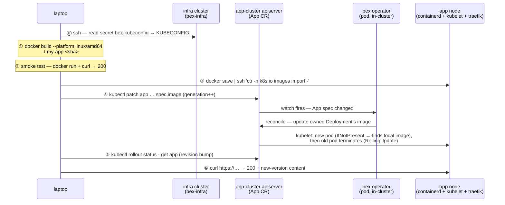

# Deploying / replacing an App (Hetzner, prebuilt-image path)

> **Status: the manual runbook that works today.** Prod has no in-cluster builder and no registry for _app_ images yet — you build on the laptop and import straight into the node's containerd. The **`App` CR is the only interface**: you never touch the Deployment; the operator rewrites it. (Planned: webhook → in-cluster build → push to `bex-zot`, which collapses steps ①–③ into the platform.)

The examples below use a placeholder App `my-app` (container port 3000); substitute your App's name, port, and host. Three places are involved — keep them straight:

| place | role in a deploy |
| --- | --- |
| **laptop** | builds the image, smoke-tests it, runs `kubectl`/`ssh` |
| **infra cluster** (`bex-infra`) | holds the app-cluster kubeconfig (CAPI secret `bex-kubeconfig`) — touched once, for access |
| **app cluster** (single node) | containerd stores the image; apiserver holds the `App` CR; the **operator** turns the CR change into a rollout |

## The whole deploy in one picture



## Steps

### ⓪ Get the app-cluster kubeconfig — _laptop → infra cluster_

Cluster API stores the workload ("app") cluster's kubeconfig as a secret on the management ("infra") cluster:

```sh
ssh -i <ssh-key> root@<infra-ip> \
  'kubectl -n default get secret bex-kubeconfig -o jsonpath="{.data.value}" | base64 -d' \
  > bex-app.kubeconfig
export KUBECONFIG=$PWD/bex-app.kubeconfig
kubectl get app my-app -o yaml   # current image / port / host — your baseline
```

### ① Build amd64 with a **fresh** tag — _laptop_

```sh
cd <project>
docker build --platform linux/amd64 -t my-app:$(git rev-parse --short HEAD) .
```

- **`--platform linux/amd64`** — the Hetzner node is x86_64; an arm64 build won't run.
- **Fresh, non-`:latest` tag (git sha)** — the operator sets no `imagePullPolicy`, so k8s defaults to `IfNotPresent` for non-latest tags. Reusing an existing tag would silently serve the node's _cached_ image; a new tag is what guarantees the new bits run.

### ② Smoke-test locally — _laptop_

Cheap insurance before shipping ~800 MB:

```sh
docker run -d --rm --name smoke -p 127.0.0.1:3999:3000 my-app:<sha>
curl -s -o /dev/null -w '%{http_code}\n' http://127.0.0.1:3999/   # expect 200
docker stop smoke
```

### ③ Import into the node's containerd — _laptop → app node_

No app-image registry yet, so stream the image straight into containerd's **`k8s.io` namespace** (the one the kubelet reads) — one pipe, no temp file:

```sh
docker save my-app:<sha> \
  | ssh -i <ssh-key> root@<app-node-ip> 'ctr -n k8s.io images import -'
```

### ④ Patch the App CR — _laptop → apiserver → operator_

```sh
kubectl patch app my-app --type merge \
  -p '{"spec":{"image":"my-app:<sha>"}}'
```

This is the actual "deploy". The spec change bumps `metadata.generation` — **required**, because the operator early-returns when an App is already `Running` at its current generation. The reconcile rewrites the owned Deployment's image; the default RollingUpdate starts the new pod **before** terminating the old one, so the single node serves without a gap.

### ⑤ Watch the rollout — _laptop_

```sh
kubectl rollout status deployment/my-app
kubectl get app my-app   # PHASE Running, REVISION bumped (rev-N → rev-N+1)
```

### ⑥ Verify the edge serves the new version — _laptop → node's traefik_

```sh
curl -s -o /dev/null -w '%{http_code}\n' https://my-app.<node-ip>.sslip.io/
curl -s https://my-app.<node-ip>.sslip.io/ | grep -i '<something only in the new version>'
```

Grep for content that **only exists in the new build** — a 200 alone can't distinguish new pod from old.

## Gotchas

- **Apps are imperative by design** — the `App` CR lives only in the app cluster's etcd, _not_ in git and not in `deploy/gitops/` (that's platform-only). Losing the node loses the CR; see [`docs/control-plane.md`](control-plane.md) for the planned Postgres source of truth.
- **The edge IP is the node IP** (traefik on hostNetwork) — the `*.sslip.io` host is tied to it and changes if the node is replaced.
- **Server IPs drift** — reread them from `hcloud`/the kubeconfig rather than trusting old notes; the kubeconfig's API endpoint is also distinct from the node IP.
- Day-0 cluster creation lives in [`infra/`](../infra/README.md); Argo-reconciled platform apps in [`deploy/gitops/`](../deploy/gitops/README.md). This doc is day-N **app**-level deployment only.
