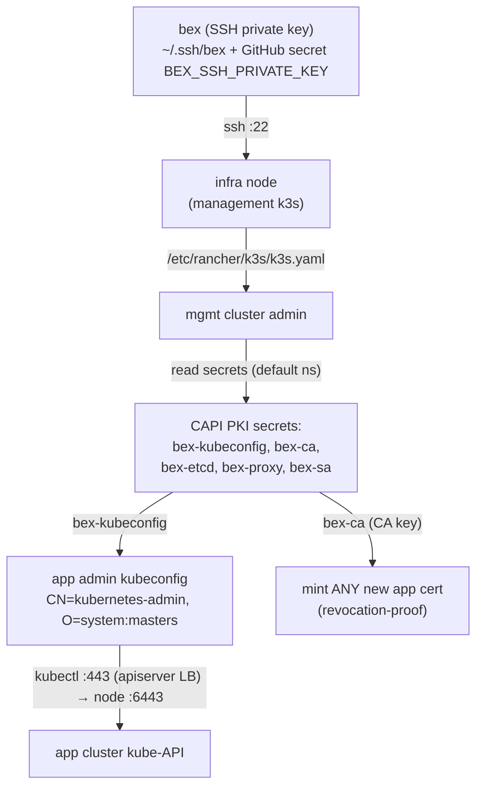

# ADR: infra credentials — inventory, trust chain, and custody

**Status:** descriptive (reflects live prod reality as of 2026-07-09) + accepted decisions. Records _what_ platform credentials exist, _where_ they live, _who_ holds them, and how they chain — so the security posture is written down rather than rediscovered by SSHing around. Complements [secrets.md](secrets.md) (tenant secrets, OpenBao) and [sealed-secrets.md](sealed-secrets.md) (platform secrets in git); this doc is about the **bootstrap** credentials that sit _below_ both of those — the ones you need before any controller is running.

## Context

bex's secret story so far has two published layers:

- **Tenant** credentials → OpenBao ([secrets.md](secrets.md)): versioned, policy-scoped, per-app.
- **Platform** credentials as GitOps → Sealed Secrets ([sealed-secrets.md](sealed-secrets.md)): static, bex-operated, encrypted in git.

Neither covers the layer underneath: the handful of **bootstrap** credentials that let a human or CI reach the clusters _at all_ — the SSH key, the cloud API token, the Terraform-state keys, and the Kubernetes PKI that Cluster API mints. These are held out-of-band (in [`.env`](../.env.example) locally, and as CI secrets), because they must exist before Argo, OpenBao, or the sealed-secrets controller do. This ADR maps them and records the decisions about how they're custodied — and the gaps that follow.

Two clusters are involved (see [architecture.md](architecture.md)): the **infra / management cluster** (a single k3s node, provisioned by Terraform) which runs Cluster API, and the **app cluster** (CAPH-provisioned) which runs the product. The credential chain crosses both.

## The trust chain

Everything an operator can do to the app cluster traces back to **one SSH private key**. There is no independently-scoped app-cluster credential: hold the key, and you can mint cluster-admin.

**Reading:** `clusterctl get kubeconfig bex` (used by [deploy.yml](../.github/workflows/deploy.yml) and [app-cluster.yml](../.github/workflows/app-cluster.yml)) simply reads the `bex-kubeconfig` secret from the mgmt cluster. To read that secret you need mgmt-cluster admin, which is the k3s kubeconfig on the infra node, which needs the `bex` SSH key. The chain has no branch: **`bex` is the root of trust.**

## Credential inventory

| Credential | Form | Stored where | Held by | Grants |
| --- | --- | --- | --- | --- |
| **`bex` SSH keypair** | ed25519 (`~/.ssh/bex`, `bex.pub`) | operator laptop; public half on every node | operator; **GitHub Actions** (`BEX_SSH_PRIVATE_KEY`) | SSH `:22` to infra + app nodes → **root of the whole chain** |
| **app admin kubeconfig** | client cert `CN=kubernetes-admin, O=system:masters`, ~1yr validity | `bex-kubeconfig` secret, mgmt cluster `default` ns | anyone with mgmt access (via `bex`); regenerated per-CI-run; transient local copies | **cluster-admin** on the app cluster (`:443` apiserver LB → node `:6443`) |
| **app cluster PKI** | CA cert+key pairs | `bex-ca` / `bex-etcd` / `bex-proxy` / `bex-sa` secrets, mgmt cluster | Cluster API (owner); anyone with mgmt access | **`bex-ca` = mint any app cert, incl. new admin** — crown jewels |
| **`bex-argo-deploy` key** | ed25519, comment `argocd-deploy-key@bex` | operator laptop; deploy key on the GitHub repo | operator; Argo CD (repo-server) | **read** `git@github.com:bex-co/bex.git` (GitOps pulls) — **not** a cluster credential |
| **`HCLOUD_TOKEN`** | Hetzner Cloud API token | [`.env`](../.env.example); GitHub secret | operator; CI; Terraform; CCM (`hcloud` secret, `kube-system`) | full Hetzner Cloud API: servers, LBs, networks, firewalls |
| **TF-state keys** | S3 access/secret (`TF_STATE_ACCESS_KEY`/`_SECRET_KEY`) | `.env`; GitHub secret | operator; CI | read/write Terraform state (infra topology, incl. `infra_server_ipv4`) |
| **platform app secrets** | `BEX_BOOTSTRAP_CLIENT_SECRET`, `KRATOS_SECRETS_*`, `HYDRA_SECRETS_*`, `HYDRA_OIDC_PAIRWISE_SALT`, `OPENFGA_PRESHARED_KEY` | `.env`; applied to the app cluster by `scripts/auth-secrets.sh` / `auth-bootstrap-client.sh` | operator; CI | bex-api bootstrap key ([auth.md](auth.md)), Kratos/Hydra/OpenFGA signing + preshared keys |
| **OpenBao unseal material** | `BAO_UNSEAL_KEY_1..3`, `BAO_ROOT_TOKEN` | `.env` (written back by `bao-init.sh`); GitHub secret | operator; CI | unseal + root the tenant secret store ([secrets.md §3](secrets.md)) |

## `.env`: the out-of-band bootstrap store

[`.env`](../.env.example) is the local, gitignored file that holds every bootstrap credential above (same custody rule as `*.kubeconfig` — **never committed, never printed**). It exists precisely because these secrets must be available _before_ the in-cluster secret stores (OpenBao, sealed-secrets) are running, so they cannot themselves live in-cluster.

Two mirrors track it, value-less, and are kept in sync by rule (see [CLAUDE.md](../CLAUDE.md) rules):

- [`.env.example`](../.env.example) — the local runtime mirror (`cp .env.example .env`).
- `.env.template` — the CI-secrets mirror.

**CI custody:** GitHub Actions holds its own copy of the same secrets as repository/environment secrets (`BEX_SSH_PRIVATE_KEY`, `HCLOUD_TOKEN`, `TF_STATE_*`, …). So the credential set exists in **three places**: the operator's `.env`, GitHub Actions secrets, and (for the derived ones) the clusters themselves. Rotating a credential means rotating all copies.

## Decisions

### 1. One SSH key is the bootstrap root of trust — accepted, with eyes open

CAPH provisions every node with a single SSH key ([infra/terraform/main.tf](../infra/terraform/main.tf), `ssh_key_name`), and CAPI stores the app-cluster PKI as secrets on the management cluster. That is the standard Cluster API topology and we adopt it as-is. The **consequence** is deliberate and must be understood: `bex` is not "an" admin key, it is _the_ path to `system:masters`. Its custody (operator laptop + GitHub Actions secret) is the single most security-sensitive fact about the platform — more than any firewall.

### 2. App-cluster PKI lives on the management cluster — accepted

`bex-ca`/`bex-etcd`/`bex-proxy`/`bex-sa` are CAPI-owned and live in the mgmt cluster's `default` namespace. This means **the management cluster is as sensitive as the app cluster** (whoever roots the mgmt node can mint app admin certs and is revocation-proof until the CA is rotated). Hardening the mgmt node is therefore in scope for any app-cluster hardening, not an afterthought.

### 3. Bootstrap secrets stay out-of-band in `.env` / CI secrets — accepted

They cannot live in the in-cluster stores they bootstrap (chicken-and-egg), and they should not live in git even encrypted (they gate the decryptors). `.env` (local, gitignored) + GitHub Actions secrets (CI) is the accepted home; sealed-secrets/OpenBao cover everything _downstream_ of them.

### 4. Network exposure is currently authentication-only — accepted as interim

As of this writing, `:22` (SSH, gated by `bex`) and `:6443`/`:443` (kube-API, gated by the admin cert + TLS/RBAC) are reachable from `0.0.0.0/0`: the `bex-infra` firewall defaults `allowed_ssh_cidrs` to open, and no app-node firewall exists. Protection is the credential layer only, with **no network second layer**. This is an accepted baseline (key-only SSH + kube RBAC is industry-standard) but is explicitly single-layer — see gaps.

## Consequences & known gaps

- **Single-key blast radius.** Compromise of `bex` ⇒ full app-cluster `system:masters`. There is no scoped, non-admin operator credential. _Follow-up:_ issue a narrowed operator kubeconfig (RBAC-limited, not `O=system:masters`) for day-to-day ops so the god-mode admin is used only for break-glass.
- **CA is revocation-proof.** `bex-ca` compromise can't be contained by revoking a cert; it requires rotating the cluster CA (disruptive). _Follow-up:_ document a CA-rotation runbook alongside [etcd-backup-restore.md](etcd-backup-restore.md).
- **Long-lived admin cert, no rotation automation.** The `kubernetes-admin` cert is ~1-year and hand-regenerated by CAPI on renewal; no alerting on expiry. _Follow-up:_ expiry monitor.
- **No network second layer — by decision, not omission.** `:22`/`:6443` are reachable from `0.0.0.0/0`; protection is the credential layer only. The static source-IP firewall (w1/m7 t001) was **removed** ([.pm/DO_NOT_DO.md](../.pm/DO_NOT_DO.md), 2026-07-09): a static `allowed_ssh_cidrs` fits neither a dynamic-IP operator nor GitHub-hosted CI (dynamic egress), and `:6443` is reached _via the LB_ (`:443`) so a node-`:6443` lockdown would also have to spare the LB→node hop. Auth-only is the accepted baseline. _Follow-up (only if a second layer is wanted):_ Tailscale/WireGuard locking `:22`/`:6443` to a stable tailnet, with a tailnet-joined self-hosted CI runner — never a static CIDR.
- **Three copies to rotate.** Any rotation must cover `.env`, GitHub Actions secrets, and the in-cluster derivations. There is no single rotation command. _Follow-up:_ a rotation checklist per credential.

## Follow-ups

- Scoped (non-`system:masters`) operator kubeconfig; reserve the admin cert for break-glass.
- (If ever wanted) a network second layer via Tailscale/WireGuard, not the removed static-CIDR firewall — see [.pm/DO_NOT_DO.md](../.pm/DO_NOT_DO.md).
- CA-rotation and admin-cert-expiry runbooks.
- Migrate as many `.env` platform secrets as possible _downstream_ into [sealed-secrets.md](sealed-secrets.md) / [OpenBao](secrets.md), leaving `.env` holding only the irreducible bootstrap set (`bex` key, `HCLOUD_TOKEN`, TF-state, OpenBao unseal).
