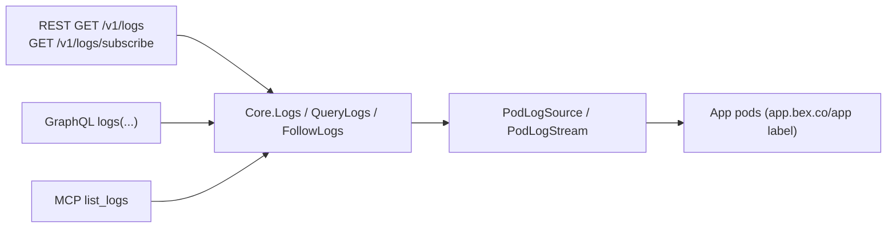
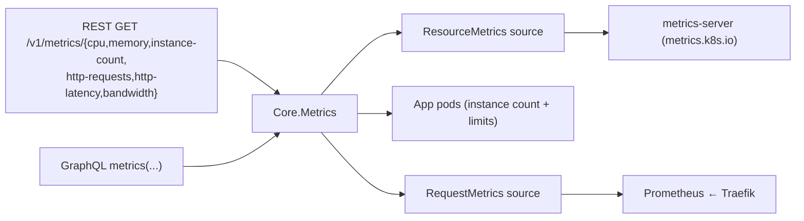

# Observability — logs and metrics

bex makes a running platform **observable** without `kubectl`: an operator or an AI agent debugging a deploy reaches App logs and metrics through the same bearer-authed [bex-api](bex-api.md) it uses for lifecycle verbs. This is `GOAL.md` #2 ("basic obs for operation") and the AI-native pillar in [vision.md](vision.md) — agents can't fix a failing deploy they can't read.

Logs shipped first: highest operational value, and the simplest backend (pod logs, no metrics-server dependency). Metrics follow, over the same one-Core-many-adapters shape.

## Logs

One `Core` logs read, three adapters — the [bex-api](bex-api.md) invariant. The MCP `list_logs` tool is the agent surface; REST and GraphQL expose the same read to the public API and dashboard.



- **`Core.Logs(name, tail)`** — tail-N aggregation across replicas; what MCP `list_logs` calls. Returns `LogEntry{timestamp, message, labels}` (labels `service`/`instance`/`container`).
- **`Core.QueryLogs(LogQuery)`** — adds Render's filters (type/text/time) and paging; the REST + GraphQL read path.
- **`Core.FollowLogs(LogQuery, emit)`** — live tail; the SSE stream.

`PodLogSource` (and its follow sibling `PodLogStream`) is the one dependency Core reaches past the generic client for — the `pods/log` subresource controller-runtime's client can't serve. It's injected (`NewPodLogSource` / `NewPodLogStream` in `podlogs.go`), so the domain layer stays clientset-free and every read is faked in tests with no cluster.

### REST surface

| method + path | effect |
| --- | --- |
| `GET /v1/logs` | historical query → `{hasMore, next*Time, logs}` |
| `GET /v1/logs/subscribe` | live tail over Server-Sent Events |
| `graphql { logs(...) }` | same query, flat `LogEntry` rows |
| MCP `list_logs` | agent read (Core.Logs), `resource` array + `limit` |

Query params (Render vocabulary): `resource` (App id, repeatable), `type` (repeatable), `text` (case-insensitive substring), `startTime`/`endTime` (RFC3339), `limit` (default 20, max 100 — Render's paging range). `Core` re-applies every filter, sorts oldest-first, and keeps the newest `limit`.

The REST log object is Render's public-API `log` (all fields required): `{id, message, timestamp, labels[]}`. bex synthesizes a stable `id` from instance + timestamp + a message hash, and renders Core's map labels as Render's `{name,value}` array — `type` (value `app`), `resource` (Core's `service`), `instance`. The envelope carries all four required fields: `hasMore`, `nextStartTime` (newest line), `nextEndTime` (oldest line, the backward-page cursor), `logs`. (MCP instead returns `LogEntry` with map labels verbatim, matching Render's MCP server — each adapter mirrors its own Render counterpart.)

### Log types

Render's `type` is `app`/`request`/`build`. **bex only sources application (`app`) logs today** — the App's own container stdout/stderr, read from every replica pod (label `app.bex.co/app=<name>`) and aggregated. `request` (Traefik access logs) and `build` (bex builds in a separate plane, see [go-and-gitops](go-and-gitops.md)) have no backend here, so those types resolve to an empty page rather than an error — a Render-shaped client filtering by them sees an empty result, never a break. `application` is accepted as an input alias for `app`.

### Live tail (SSE)

`GET /v1/logs/subscribe` streams `text/event-stream`, one `data: <log JSON>` frame per new line, following a single `resource`. bex uses **SSE, not Render's WebSocket**: no extra dependency, works with `curl -N`, same "stream new lines live" contract. The handler clears the server write deadline (`http.NewResponseController`) so the long-lived stream isn't killed by the api's `WriteTimeout`; the stream ends when the client disconnects (request context cancelled).

### Render compatibility

Shapes verified against `render-public-api-1.json`: the `type`/`resource`/`text`/`startTime`/`endTime`/`limit` params, the `{hasMore, nextStartTime, nextEndTime, logs}` envelope, and the `{id, message, timestamp, labels[]}` log object (with the label-name enum). Known, intentional deviations:

- **subscribe transport** — SSE vs Render's WebSocket (`101` upgrade).
- **`ownerId`** — Render requires it; bex is single-tenant and omits it.
- **unimplemented filters** — Render's request-log filters `instance`, `level`, `host`, `statusCode`, `method`, `path`, and the `direction` (forward/backward) param are not wired yet; `text`/`type`/time filtering is.

### RBAC

The api ServiceAccount reads `pods` (`get`/`list`/`watch`) and `pods/log` (`get`) — added with the logs verb in `lego/operator/config/api/rbac.yaml`. No clientset lives in Core; only `podlogs.go` (and its `main.go` wiring) touch it.

## Metrics

The same one-Core-many-adapters shape as logs. `Core.Metrics(MetricQuery)` is the single read; REST (`rest_metrics.go`) and GraphQL (`graphql.go`) are the surfaces. Two backends, each an injected source so Core stays clientset-free (like `PodLogSource`):



- **Resource** — `cpu` / `memory` come from **metrics-server** (`metrics.k8s.io/v1beta1`, via `NewResourceMetricsSource`): one series per replica, tagged `instance` + `resource`. `instance_count` is derived from the App's pods directly, so it needs **no** source (works without metrics-server). With `percentage=true`, cpu/memory are divided by the pod's limit (read from the pod spec) and reported 0..100.
- **Request** — `http_requests` / `http_latency` / `bandwidth` come from **Traefik scraped by Prometheus** (`NewPrometheusRequestSource`, gated by `BEX_PROM_URL`): a `query_range` over `traefik_service_requests_total` (rate), `_request_duration_seconds_bucket` (`histogram_quantile`, default p95), and `_responses_bytes_total` (rate). `statusCode` filters the `code` label (`2xx` → `2..`); `groupBy` (`status`/`method`) breaks the result into per-label series.

metrics-server is a **point-in-time snapshot**, so cpu/memory/instance_count series carry a **single current point** regardless of the requested `startTime`/`endTime` — the range params are accepted for Render compatibility; only the Prometheus-backed request metrics honor them. When a metric's source isn't wired, the endpoint returns **503** (`ErrMetricsUnavailable`) — the App exists, the data source doesn't.

### REST surface

| method + path | metric |
| --- | --- |
| `GET /v1/metrics/cpu` | per-instance CPU (cores, or % of limit) |
| `GET /v1/metrics/memory` | per-instance memory (bytes, or % of limit) |
| `GET /v1/metrics/instance-count` | running replica count |
| `GET /v1/metrics/http-requests` | request rate (req/s) |
| `GET /v1/metrics/http-latency` | latency percentile (seconds) |
| `GET /v1/metrics/bandwidth` | outbound bytes/s |

Query params (Render vocabulary): `resource` (App id, repeatable), `startTime`/`endTime` (RFC3339), `resolutionSeconds`, `quantile` (0..1, latency), `statusCode`/`host`/`path`/`groupBy` (request filters), and a bex extra `percentage=true` (cpu/memory as a fraction of limit). Each endpoint returns Render's metrics array — `[{labels:[{field,value}], unit, values:[{timestamp,value}]}]`. GraphQL: `metrics(resource, metric, startTime, endTime, resolutionSeconds, quantile, percentage, statusCode, host, path, groupBy)` → `MetricSeries { unit, labels{field,value}, points{timestamp,value} }`, `metric` being `cpu`/`memory`/`instance_count`/`http_requests`/`http_latency`/`bandwidth`. The MCP `get_metrics` tool (`resource[]` + `metricTypes[]`) exposes the same read to agents — three-adapter parity, like `list_logs`.

### Render compatibility

Shapes track Render's metrics endpoints (per-metric path segments; the `{labels, unit, values}` time-series). Known, intentional deviations:

- **snapshot resolution** — resource metrics return a single current point (metrics-server has no history); Render returns a resolution-stepped series. Request metrics (Prometheus) are stepped.
- **`host`/`path` filters** — accepted (Render vocabulary) but not applied to request metrics: Traefik's per-service counters carry only `code`/`method`, not host/path (host/path live on router-level metrics). Documented like the logs adapter's unimplemented request filters.
- **Traefik service selector** — the App→Traefik-service match is a heuristic (`service=~".*<app>.*"`); a real cluster may need it tuned to the ingress's actual service label.

### RBAC

Resource metrics add read on `metrics.k8s.io` `pods` (`get`/`list`) to the api ServiceAccount (`lego/operator/config/api/rbac.yaml`); percentage mode reuses the existing `pods` read for limits. Request metrics reach Prometheus over HTTP (`BEX_PROM_URL`), not the kube API, so they need no extra RBAC.

### Cluster enablement

`deploy/gitops/base/metrics-server.yaml` installs metrics-server (resource metrics); `deploy/gitops/base/traefik.yaml` enables Traefik's Prometheus metrics on an in-cluster `metrics` entrypoint (`:9100`, `addServicesLabels`). Request metrics additionally need a Prometheus scraping that entrypoint and `BEX_PROM_URL` pointed at it.

## Verify (mock cluster)

```sh
# deploy a sample App, then:
curl -s -H "Authorization: Bearer $TOKEN" \
  "http://localhost:8090/v1/logs?resource=<app>&type=app" | jq .

# resource metrics (needs metrics-server; instance-count works without it):
curl -s -H "Authorization: Bearer $BEX_API_TOKEN" \
  "http://localhost:8090/v1/metrics/cpu?resource=<app>&percentage=true" | jq .
curl -s -H "Authorization: Bearer $BEX_API_TOKEN" \
  "http://localhost:8090/v1/metrics/instance-count?resource=<app>" | jq .
```
