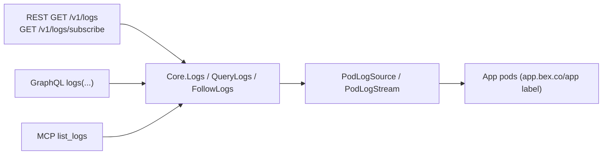

# Observability — logs (and, next, metrics)

bex makes a running platform **observable** without `kubectl`: an operator or an AI agent debugging a deploy reaches App logs (and soon metrics) through the same bearer-authed [bex-api](bex-api.md) it uses for lifecycle verbs. This is `GOAL.md` #2 ("basic obs for operation") and the AI-native pillar in [vision.md](vision.md) — agents can't fix a failing deploy they can't read.

Logs ship first: highest operational value, and the simplest backend (pod logs, no metrics-server dependency). Metrics follow.

## Logs

One `Core` logs read, three adapters — the [bex-api](bex-api.md) invariant. The MCP `list_logs` tool is the agent surface; REST and GraphQL expose the same read to the public API and dashboard.



- **`Core.Logs(name, tail)`** — tail-N aggregation across replicas; what MCP `list_logs` calls. Returns `LogEntry{timestamp, message, labels}` (labels `service`/`instance`/`container`).
- **`Core.QueryLogs(LogQuery)`** — adds Render's filters (type/text/time) and paging; the REST + GraphQL read path.
- **`Core.FollowLogs(LogQuery, emit)`** — live tail; the SSE stream.

`PodLogSource` (and its follow sibling `PodLogStream`) is the one dependency Core reaches past the generic client for — the `pods/log` subresource controller-runtime's client can't serve. It's injected (`NewPodLogSource` / `NewPodLogStream` in `podlogs.go`), so the domain layer stays clientset-free and every read is faked in tests with no cluster.

### REST surface

| method + path | effect |
| --- | --- |
| `GET /v1/logs` | historical query → `{hasMore, next*Time, logs}` |
| `GET /v1/logs/subscribe` | live tail over Server-Sent Events |
| `graphql { logs(...) }` | same query, flat `LogEntry` rows |
| MCP `list_logs` | agent read (Core.Logs), `resource` array + `limit` |

Query params (Render vocabulary): `resource` (App id, repeatable), `type` (repeatable), `text` (case-insensitive substring), `startTime`/`endTime` (RFC3339), `limit` (default 20, max 100 — Render's paging range). `Core` re-applies every filter, sorts oldest-first, and keeps the newest `limit`.

The REST log object is Render's public-API `log` (all fields required): `{id, message, timestamp, labels[]}`. bex synthesizes a stable `id` from instance + timestamp + a message hash, and renders Core's map labels as Render's `{name,value}` array — `type` (value `app`), `resource` (Core's `service`), `instance`. The envelope carries all four required fields: `hasMore`, `nextStartTime` (newest line), `nextEndTime` (oldest line, the backward-page cursor), `logs`. (MCP instead returns `LogEntry` with map labels verbatim, matching Render's MCP server — each adapter mirrors its own Render counterpart.)

### Log types

Render's `type` is `app`/`request`/`build`. **bex only sources application (`app`) logs today** — the App's own container stdout/stderr, read from every replica pod (label `app.bex.co/app=<name>`) and aggregated. `request` (Traefik access logs) and `build` (bex builds in a separate plane, see [go-and-gitops](go-and-gitops.md)) have no backend here, so those types resolve to an empty page rather than an error — a Render-shaped client filtering by them sees an empty result, never a break. `application` is accepted as an input alias for `app`.

### Live tail (SSE)

`GET /v1/logs/subscribe` streams `text/event-stream`, one `data: <log JSON>` frame per new line, following a single `resource`. bex uses **SSE, not Render's WebSocket**: no extra dependency, works with `curl -N`, same "stream new lines live" contract. The handler clears the server write deadline (`http.NewResponseController`) so the long-lived stream isn't killed by the api's `WriteTimeout`; the stream ends when the client disconnects (request context cancelled).

### Render compatibility

Shapes verified against `render-public-api-1.json`: the `type`/`resource`/`text`/`startTime`/`endTime`/`limit` params, the `{hasMore, nextStartTime, nextEndTime, logs}` envelope, and the `{id, message, timestamp, labels[]}` log object (with the label-name enum). Known, intentional deviations:

- **subscribe transport** — SSE vs Render's WebSocket (`101` upgrade).
- **`ownerId`** — Render requires it; bex is single-tenant and omits it.
- **unimplemented filters** — Render's request-log filters `instance`, `level`, `host`, `statusCode`, `method`, `path`, and the `direction` (forward/backward) param are not wired yet; `text`/`type`/time filtering is.

### RBAC

The api ServiceAccount reads `pods` (`get`/`list`/`watch`) and `pods/log` (`get`) — added with the logs verb in `operator/config/api/rbac.yaml`. No clientset lives in Core; only `podlogs.go` (and its `main.go` wiring) touch it.

## Verify (mock cluster)

```sh
# deploy a sample App, then:
curl -s -H "Authorization: Bearer $BEX_API_TOKEN" \
  "http://localhost:8090/v1/logs?resource=<app>&type=app" | jq .
```

## Next: metrics

`m2` adds a Metrics API (resource + request metrics) over the same one-Core-many-adapters shape. It depends on the platform work in w1 (metrics-server + Traefik metrics), which is why logs — a pure pod-log backend — ship first.
