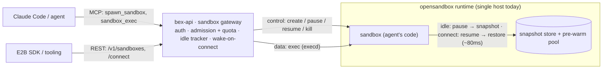

# ADR: E2B-compatible sandboxes — opensandbox pause/resume as hosted agent execution environments

**Status:** proposed — design for `.pm/w2/m3` (pillar 5). No product code yet; this ADR settles the architecture the milestone builds against.

## Context

bex is an AI-native PaaS: agents are first-class users ([vision.md](vision.md)). Pillar 5 is **hosted execution environments for agents** — an agent spawns a sandbox, runs code in it, the sandbox auto-hibernates when idle ("sleep = free"), and wakes on next use. The compatibility play mirrors Render for the App API: speak **E2B's** shapes so existing agent tooling and habits transfer instead of restarting from zero.

The mechanism that makes "sleep = free" viable — sub-second wake — **already exists and is inherited**, it is not ours to invent:

- `operator/internal/runtime/opensandbox.go` is a client for the OpenSandbox Lifecycle API (`BEX_OPENSANDBOX_URL`) exposing `Create` / `Pause` / `Resume` / `Delete` / `Endpoint`. `Pause`/`Resume` are **real snapshots** (~80 ms wake, [restart-suspend-and-resume.md](restart-suspend-and-resume.md)). A per-sandbox **exec daemon** ships in the runtime (`execd_image = opensandbox/execd:v1.0.16`, `deploy/opensandbox/sandbox.toml`) — an exec channel is a real but currently unwired capability. The opensandbox controller also ships pre-warmed `pools` and `sandboxsnapshots`.
- This is the same class of mechanism E2B and Modal use to hit millisecond starts: **restore, don't boot**. E2B restores a Firecracker microVM memory snapshot (`MAP_PRIVATE` on-demand page faults + copy-on-write; template = Dockerfile→snapshot; ~5–30 ms resume, ~150 ms full restore). Modal uses gVisor `runsc` checkpoint/restore (CRIU) plus a lazy content-addressed image filesystem. bex gets this behavior **through opensandbox** rather than reimplementing it.
- Crucially, **E2B's `autoPause` + connect-resumes semantics are exactly this milestone's idle-hibernate** — so the work is orchestration, not new mechanism.

What is net-new is everything around that mechanism: a sandbox API distinct from the App CR, E2B-shaped surfaces, an idle tracker + wake-on-connect, an agent-facing exec surface, and an MCP spawn verb. Two constraints shape the design:

- **Architectural gap.** bex-api's `Core` (`operator/internal/api/core.go`) only patches App CR spec; it has **no opensandbox client** — the client lives in the operator binary. And that client's `imageEntrypoint` shells out to `docker inspect` (host-local), unusable from an in-cluster pod unless bypassed.
- **Runtime limit.** Real snapshot pause/resume works today only on the **Docker-runtime** opensandbox server (:8077); the k8s-runtime path is blocked on OrbStack (cri-dockerd, not containerd-CRI — [go-and-gitops.md](go-and-gitops.md)).

## Decision

Serve sandboxes as a **direct, synchronous gateway in bex-api over the opensandbox runtime**, E2B-compatible at the control plane, driven by agents over MCP. Eight decisions:

### D0 — Sandboxes are sessions, not services (the carve-out)

The App architecture rule (product action → **App CR contract** → operator converges; the operator exposes no API — [restart-suspend-and-resume.md](restart-suspend-and-resume.md), [control-plane.md](control-plane.md)) governs **durable, declarative desired-state**. A sandbox is the opposite: an **interactive, ephemeral session** — created synchronously, exec'd against as a live stream, spawned and killed by the dozen. Forcing it through async CR reconcile fights its nature. Sandboxes are therefore **deliberately exempt** from the CR-contract rule; this ADR records that exemption so it reads as a decision, not drift.

|  | **App** (services) | **Sandbox** (sessions) |
| --- | --- | --- |
| shape | declarative desired-state | interactive, ephemeral |
| path | bex-api → **App CR** → operator converges | bex-api **gateway** → opensandbox (direct) |
| lifetime | long-lived, one per service | short-lived, many per agent |
| interaction | async (poll `status`) | synchronous (create/exec/connect now) |
| source of truth | App CR (+ future control plane) | opensandbox store (soft state in bex-api) |

### D1 — A direct synchronous sandbox service in bex-api; no CRD

Add a sandbox service in `operator/internal/api/` that owns an **opensandbox client** (`BEX_OPENSANDBOX_URL`, the same endpoint the operator uses). bex-api becomes the **sandbox gateway**: control plane (create/pause/resume/kill), data-plane front (exec/connect proxy), auth (the existing bex-api credentials — API keys / OAuth2 or Kratos sessions, [auth.md](auth.md)), and activity observation, all in one place. No `Sandbox` CRD and no operator involvement — the operator keeps reconciling Apps only.

### D2 — Control-plane E2B compatibility now; spawn from templates

Serve E2B's REST **lifecycle** shapes so E2B lifecycle tooling transfers. Spawn from **pre-registered templates** (image + entrypoint fixed at registration), which takes the host-local `docker inspect` out of the hot path and matches E2B's own template model. Exec is surfaced through opensandbox `execd`. **Defer** full envd gRPC data-plane parity — `.pm/w2/m3/t002` already lists filesystem/proc APIs as out of scope, opensandbox already has its own exec daemon, and the primary consumer drives exec over MCP, not the E2B SDK's gRPC.

| E2B (control plane) | bex route | opensandbox call |
| --- | --- | --- |
| `POST /sandboxes` (templateID, timeout, **autoPause**, metadata, envVars) | `POST /v1/sandboxes` | `Create(template, env)` |
| `POST /sandboxes/{id}/connect` (resume if paused) | `POST /v1/sandboxes/{id}/connect` | `Resume` (if paused) → `Endpoint` |
| pause | `POST /v1/sandboxes/{id}/pause` | `Pause` (snapshot) |
| kill | `DELETE /v1/sandboxes/{id}` | `Delete` |
| commands (envd gRPC) — _deferred_ | MCP `sandbox_exec` / `run_code` | `execd` |

### D3 — Agents are external MCP drivers

Claude Code / any agent drives sandboxes **from outside** via MCP tools — `spawn_sandbox` and `sandbox_exec` (`run_code`) — following the shipped adapter pattern in `operator/internal/api/mcp.go` (streamable-HTTP at `/mcp` behind the bearer gate; stdio via `api mcp-stdio`). The sandbox holds the agent's (untrusted) generated code; the agent stays outside. _(Deferred, not chosen: Claude Code running **inside** the sandbox as a hosted workspace — a different product that needs a per-sandbox external URL + gateway auth that does not exist yet.)_

### D4 — Idle-hibernate = gateway-observed autoPause

The gateway tracks per-sandbox **last-activity** (every connect/exec resets it). A background sweeper pauses sandboxes past their idle window (opensandbox `Pause`); the next connect/exec on a paused sandbox **resumes first** (opensandbox `Resume`) — wake-on-connect. This reuses the `spec.idleTTLSeconds` semantics (declared but unread today, per [restart-suspend-and-resume.md](restart-suspend-and-resume.md)) and maps 1:1 to E2B's `autoPause`. Idle state is **soft** — the sweeper's timers are rebuildable by listing opensandbox sandboxes on startup, since the opensandbox store is the source of truth.

### D5 — Cold-start/wake is inherited, not invented

bex **orchestrates**, it does not build, fast start: opensandbox **snapshots** give wake latency, pre-warmed **pools** give create latency (the two levers E2B/Modal use). Honest bounds: **wake latency = opensandbox checkpoint/restore (~80 ms), available today only on the Docker-runtime server (:8077)**; the k8s-runtime snapshot path is blocked on OrbStack. First-create latency is hidden by pool pre-warm when configured. bex's contribution is the _policy_ (when to pause/resume), not the _speed_.

### D6 — Capacity & admission control (two bounds, not one pool)

"Pooling" is only half the story, and conflating the two halves miscounts resources. There are **two distinct mechanisms**: a **pre-warm pool** (a free-list of ready sandboxes/snapshots that hides _create_ latency — classic pooling, sized `min_ready`/`max_ready`, refilled async) and **idle-hibernate overcommit** (which is _not_ a pool but demand-paging: idle sandboxes are paused and later resumed on use). They bound different resources, because a paused sandbox **frees RAM/CPU but still costs disk** (its memory+rootfs snapshot):

| bound | limited by | who enforces |
| --- | --- | --- |
| **concurrent running** (unpaused) | RAM / CPU (hard) | gateway admission + LRU evict-to-pause |
| **total existing** (incl. paused) | disk (snapshots) + per-tenant quota | gateway quota check |
| **warm-ready** | `min_ready` / `max_ready` | pool refiller |

Because bex-api is the single funnel (D1), it is the natural **admission-control** point. The knobs:

- **Concurrent-running cap → LRU evict-to-pause.** When admitting a create/resume would exceed node capacity, proactively `Pause` the least-recently-used _running_ sandbox to make room (evict before its idle window). This is the overcommit: running-set ≤ capacity, existing-set ≫ capacity.
- **Per-tenant quota by tier.** Mirror E2B/Modal plan limits (max concurrent sandboxes + max timeout) by reusing the existing `Tier` ladder that already maps to resources for Apps.
- **Warm-pool bounds.** `min_ready`/`max_ready`; keep the pool as _paused_ snapshots so it doesn't burn RAM while idle-warm (opensandbox `pools`).
- **Node-level elasticity (deferred).** Unschedulable sandboxes → pressure → autoscaler adds a machine; empty nodes → scale down — the same bin-pack + idle-evict loop Apps use ([architecture.md](architecture.md), "node-aware but provision-unaware"). **This does not hold yet:** the Docker-runtime opensandbox is **single-host** (:8077), so today's capacity control is the single-host subset (concurrent cap + evict + quota); cross-node scheduling waits on the k8s-runtime snapshot path (containerd-CRI cluster).

### D7 — State model & durability (a ladder, mostly deferred above pause/resume)

"User state" is not one thing — it is a ladder of state with different survival boundaries. bex is honest about which rung is strong today and which are promissory:

| state | survives | mechanism | today |
| --- | --- | --- | --- |
| memory + processes + fs (inside sandbox) | **pause/resume** | opensandbox snapshot | strong — full memory+fs, like E2B |
| sandbox rootfs | **not `kill`** | — | `kill` is destructive by design |
| data meant to outlive a sandbox | across `kill` / new sandbox | persistent **volume** (opensandbox `[storage]`) | deferred (t004 "persistent sandbox volumes") |
| owner → sandbox (reconnect) | across sessions | sandbox id + `metadata.owner` | blocked on tenancy |
| the snapshot store itself | **host loss** | single-host sqlite + disk | no HA |

The stance: **a sandbox is an ephemeral session** (D0). Its in-sandbox state is faithfully preserved **across pause/resume** and **deliberately destroyed on `kill`** — that is the contract, not a bug. Everything more durable is an explicit, deferred layer:

- **Persistence beyond a sandbox → volumes.** To keep data across `kill` or share it across sandboxes, mount an opensandbox volume (bex's counterpart to E2B `volumeMounts`); the rootfs is never the durable store. **Deferred**, aligned with t004's out-of-scope.
- **Per-user ownership keys on the resolved caller identity.** Reconnect works off the sandbox id + `metadata.owner`; bex-api now resolves a real caller (OAuth2 `client_id` or Kratos identity, `api.IdentityFrom` — [auth.md](auth.md)), so the gateway stamps that identity as the owner on `Create` and scopes list/connect to it. Full multi-tenant isolation (quotas, cross-tenant guarantees) still matures with the control plane, but ownership is no longer a single shared token.
- **No durability beyond the host.** All sandboxes and snapshots live on the single opensandbox host's sqlite + disk — host loss loses them, the same no-HA gap [architecture.md](architecture.md) flags for App state in single-node etcd. HA/replication waits on a multi-node runtime.

## Alternatives considered

- **`Sandbox` CRD reconciled by the operator** (mirror the App contract) — rejected. Async reconcile fights synchronous create/exec/connect (callers want a handle _now_, not a `status` to poll); the exec data plane still needs a synchronous gateway, so it is never "pure CRD"; and an etcd write + reconcile per throwaway box is heavy for high-churn ephemeral sessions. The App contract is right for durable services (D0), wrong for sessions.
- **Full envd (E2B data-plane) parity** — rejected for now. It reimplements E2B's gRPC data plane and access-token model while opensandbox already ships `execd`, and the payoff is low when the primary consumer drives exec over MCP. Revisit if first-class E2B-SDK `commands.run` / filesystem support becomes a requirement.
- **Claude Code inside the sandbox** (hosted-workspace product) — deferred, not rejected. Compelling ("hosted Claude Code, sleep = free") but a different product: it needs per-sandbox external URLs, a gateway with per-sandbox auth, and an attach/terminal surface — none of which exist. Recorded as future once the edge/gateway lands.

### How other sandboxes store state (prior art for D7)

The industry splits into two camps for what survives an idle-sleep, plus a shared "volumes for durable data" layer. bex's choice (D5/D7) is deliberate, not default:

| provider | idle-sleep preserves | durable across destroy/`kill` | model |
| --- | --- | --- | --- |
| **E2B** | filesystem **+ memory** (processes, variables) | volumes (beta) | pause/resume snapshot |
| **Fly.io Machines** | filesystem **+ memory** (suspend) | attached volumes | suspend/resume snapshot |
| **Modal** | memory snapshot → restores as a **new** sandbox | volumes | snapshot-restore (not same instance) |
| **Cloudflare Sandbox** | **nothing** — `sleepAfter` (~10m) stops the container; next request boots fresh, state reset | Durable Object (SQLite) storage + mounted **R2** buckets — persisted by _your_ code | ephemeral compute + external store, coordinated by a Durable Object |
| **Vercel Sandbox** | filesystem + packages (**no** memory/processes) | rebuild from snapshot | filesystem-only snapshot |
| **Daytona** | filesystem (stop/archive) | persistent volumes | container stop + volumes |
| **Blaxel / Sprites** | state (hibernated; bills nothing while idle) | volumes | hibernate-first |
| **bex (this ADR)** | filesystem **+ memory** (opensandbox snapshot) | volumes (deferred) | pause/resume snapshot |

Three lessons shape D7. **First, the split is real:** the snapshot-resume camp (E2B, Fly, and the hibernate-first Blaxel/Sprites) keeps full memory+process state across sleep and resumes the _same_ instance; the ephemeral-compute camp (Cloudflare, Vercel) throws the box away on sleep and makes you persist state to an external store yourself. bex sits in the **snapshot-resume camp** — opensandbox already gives memory+fs snapshots (D5), so "sleep = free" preserves the running session transparently rather than forcing the agent to externalize state. **Second, Cloudflare is the sharpest contrast worth calling out:** its sandbox is a container fronted by a **Durable Object**; the container filesystem is fully ephemeral (lost when `sleepAfter` stops it), so durable state lives _outside_ the sandbox — in the Durable Object's SQLite storage (config/results) or in **R2 buckets mounted as filesystem paths** that survive destroy-and-recreate. That is a valid design, but it pushes state management onto the app; bex instead inherits transparent memory+fs snapshots so an idle agent session just resumes. **Third, everyone converges on volumes** as the survive-destroy layer — no provider makes the sandbox rootfs durable; data meant to outlive a box goes on a mounted volume/bucket (Cloudflare's R2 mounts, E2B/Modal/Daytona/Fly volumes). That is exactly bex's D7 stance (rootfs is ephemeral; durability = opensandbox volumes, deferred), so the plan is aligned with the field, not novel.

## Consequences

- bex-api gains a responsibility beyond CR-patching (it talks to a runtime directly) — a **documented exception** to the operator-is-the-only-mechanism rule, scoped strictly to sandboxes.
- bex-api needs **opensandbox reachability** (`BEX_OPENSANDBOX_URL`) and a **template registry**; the current host-local `imageEntrypoint`/`docker inspect` path is bypassed by templates.
- **Idle state is soft** (in-memory timers, rebuildable from opensandbox) — acceptable because opensandbox persists sandbox existence/state.
- **Wake latency is runtime-dependent**: Docker-runtime first; k8s-runtime snapshots wait on a containerd-CRI cluster.
- **No per-sandbox public URL yet** — agents reach exec through the bex gateway, not a stable external sandbox URL; that (and the inside-the-sandbox product) waits for the edge/gateway.
- **Capacity control is single-host until multi-node lands** (D6): concurrent-running cap + LRU evict-to-pause + per-tenant quota work today on the one Docker-runtime host; cross-node scheduling and autoscaler-driven elasticity for sandboxes wait on the k8s-runtime snapshot path.
- **Per-user state keys on the resolved caller identity** (D7): sandbox ownership is stamped with the OAuth2/Kratos caller (`api.IdentityFrom`), not a shared token; full multi-tenant isolation matures with the control plane, and durable-across-`kill` data still needs volumes (deferred).
- **No durability beyond the host** (D7): sandboxes + snapshots live on one opensandbox host with no HA — the same single-node-state gap as App etcd; host loss loses them until a multi-node runtime.
- **Implementation targets** (m3, not this ADR): template-aware `Create` + `Exec` over `execd` in `operator/internal/runtime/opensandbox.go`; a sandbox service in `operator/internal/api/` + E2B REST adapter in `rest.go`; `spawn_sandbox` / `sandbox_exec` tools in `operator/internal/api/mcp.go`; an opensandbox client wired into bex-api in `operator/cmd/api/main.go`. Note: `.pm/w2/m3/t004` cites `operator/cmd/mcp/main.go`, which does not exist — the MCP tool belongs on the existing bex-api MCP server; the task file should be corrected.

## Future considerations

### Deliverables — externalize outputs; the rootfs is not the deliverable

A sandbox is the agent's live **workbench**, not the user's disk. Session state (memory, processes, filesystem) is preserved transparently across pause/resume (D5/D7), but anything a product must _keep_ — a report, generated files, a build artifact, a code change — has to leave the sandbox, because the rootfs is destroyed on `kill` (D7) and is single-host with no HA today. Three externalization paths, in rough order of preference for agent-UI products (Manus / GitHub-coding-agent style):

- **Push out (git / PR)** — the coding-agent shape: the deliverable is a commit/PR, the agent `git push`es it, and the sandbox stays fully ephemeral. Cleanest — no durable sandbox state needed.
- **Object storage / artifact upload** — the Manus shape: the agent uploads results (files, reports) to a bucket at end-of-task; the sandbox is still throwaway.
- **Persistent volume** — for data that must survive across sandboxes or long-lived stateful workspaces; mount an opensandbox volume (D7). Deferred (t004), and the heaviest option — reach for it only when push-out / upload don't fit.

The product contract to document for consumers: **treat the sandbox as an ephemeral live workspace; persist deliverables out-of-band.** This is what keeps "sleep = free" and single-host-no-HA acceptable — a lost host loses only live _intermediate_ state, never a committed deliverable.

### Surfacing work to a human UI

Driving these sandboxes from a product UI — an agent-task dashboard (Manus-style) or metered "premium request" runs — needs a **browser-facing live surface**: streamed terminal / step / diff output over WebSocket/SSE from the gateway. Today's agent-facing surfaces (MCP `sandbox_exec` + the per-sandbox HTTP endpoint) do not yet provide that. The natural home is the dashboard (`dashboard/`, already a bex-api GraphQL client). Per-run / "premium request" metering reuses the quota hook (D6) and the metrics surface.

### Repo-backed sessions (coding-agent shape)

A coding agent working a git repo (the "premium request → PR" pattern) is the textbook case of the deliverables split: the **working tree + installed deps + build cache are session state** (snapshotted across pause/resume), and the **commit / PR is the deliverable** (pushed out). So sandbox ephemerality and single-host-no-HA don't bite — the PR already lives on the git host. Two shapes, both supported:

- **One-shot (premium request → PR)** — fresh sandbox per task: clone @ ref, work, open PR, discard. Ephemeral is fine; matches GitHub's coding-agent model.
- **Iterative session** — the agent works the same repo over many rounds; snapshot-resume keeps deps / build-cache / half-run tests warm across idle, so each round is cheap. This is bex's edge over the ephemeral-compute camp (Cloudflare / Vercel), which re-clone and re-install on every wake.

Reuse and unification:

- **Templates are the devcontainer equivalent** — bake the repo's toolchain (optionally repo + deps) into a template so spawn is instant (D2); bex's existing build-from-git plumbing (`internal/build`, buildpack detection) can generate it.
- **The unified loop** — agent edits the repo in a sandbox → PR → merge → the same opensandbox runtime deploys that repo as an App. "Edit code → deploy" on one platform, one auth, one `Core` — a story a standalone sandbox product can't tell.

Security decisions this raises (to settle when the milestone lands):

- **Git credentials stay out of the sandbox.** A repo token / deploy key must never enter the sandbox — untrusted repo code could exfiltrate it. Prefer a **git-credential proxy at the gateway**: the sandbox's git talks through the gateway, which injects a short-lived scoped token; the secret lives only gateway-side. Stronger than passing it as an `envVar`.
- **Egress allowlist.** Running a repo's tests runs arbitrary repo code with network access; allowlist the git host + package registries and deny the rest (opensandbox `[egress]`), or exfiltration / SSRF is wide open.
- **Isolation.** Untrusted repo code is the strongest case for microVM isolation (Kata / Firecracker on bare-metal) over hardened containers.

## Verification (when m3 lands)

Against a local Docker-runtime opensandbox (`bash scripts/up.sh` / `scripts/start-opensandbox.sh`, :8077) — the DoD loop from `.pm/w2/m3/README.md`:

1. MCP `spawn_sandbox` returns a sandbox id + reachable endpoint.
2. `sandbox_exec` runs a command and returns its stdout.
3. Left idle past the window, the sandbox auto-pauses (opensandbox reports paused; it occupies nothing).
4. The next `sandbox_exec` transparently resumes it (wake-on-connect) and succeeds.
5. **State survives multiple cycles** — write a file and set an in-process variable, then pause→resume **twice**; both persist after the second resume (guards against the E2B-style bug where fs changes were lost on the second resume).
