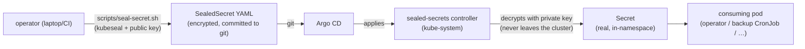

# Sealed Secrets — infra credentials encrypted at rest

**Why this exists:** bex's _tenant_ secrets already have a home — OpenBao ([secrets.md](secrets.md)). But bex's own _platform_ credentials (the Hetzner API token, the Argo repo deploy key, the GHCR pull secret, the etcd-/openbao-backup S3 keys) are static, bex-operated, and today applied **imperatively** from CI secrets (`kubectl create secret …` in the deploy workflows). That works, but it means the cluster's secret state is not fully described by git: re-creating the cluster requires re-running CI with the right GitHub Actions secrets, and there is no versioned, reviewable record of _which_ secrets exist. Sealed Secrets closes that gap — encrypt each credential with the cluster controller's public key into a **SealedSecret** manifest that is safe to commit, and let Argo reconcile it like any other resource.



## Decision: Sealed Secrets, not SOPS

Two standard ways to keep encrypted secrets in a GitOps repo:

- **SOPS (age/KMS)** encrypts the values in an otherwise-normal YAML; Argo needs a decrypting plugin (`ksops`/`argocd-vault-plugin`) and the age private key mounted into the repo-server. Powerful, but it adds a plugin to the Argo install and puts the decryption key in the repo-server's namespace.
- **Sealed Secrets** (Bitnami) runs a controller that owns an asymmetric key pair. `kubeseal` encrypts with the **public** key (fetchable by anyone); only the controller's **private** key — which never leaves the cluster — decrypts, and only into the exact `namespace/name` the secret was sealed for (default "strict" scope). No Argo plugin, no key material in git or in the repo-server.

Sealed Secrets wins here for the same reason integrated-Raft won for OpenBao ([secrets.md §2](secrets.md)): fewer moving parts, self-contained, nothing extra bolted onto Argo. The controller is `deploy/gitops/base/sealed-secrets.yaml` (chart `2.19.1`, controller v0.38.4), installed into `kube-system` as name `sealed-secrets` so `kubeseal`'s default controller lookup resolves without flags.

## What gets sealed

The static, bex-operated credentials the deploy workflows currently create imperatively:

| credential | Secret (ns/name) | consumer |
| --- | --- | --- |
| Hetzner API token | `default/hetzner` | CAPH (app-cluster.yml) |
| Hetzner API token | `kube-system/hcloud` | Hetzner CCM + CSI (app-cluster.yml) |
| Argo repo deploy key | `argocd/bex-repo` | Argo CD (clone the private repo) |
| etcd backup S3 creds | `kube-system/etcd-backup-s3` | etcd-backup CronJob ([etcd-backup-restore.md](etcd-backup-restore.md)) |
| OpenBao backup S3 | `secrets/openbao-backup-s3` | openbao-backup CronJob ([openbao-backup-restore.md](openbao-backup-restore.md)) |

> Not sealed here: the Ory/OpenFGA auth secrets and the OpenBao unseal keys. Those are composed at deploy time from generated CNPG credentials (`scripts/auth-secrets.sh`) or are the master-unseal material that by design lives only in `.env` ([secrets.md §3](secrets.md)) — sealing them buys nothing.

## Sealing a credential

```sh
# encrypt one credential against the LIVE cluster's controller and commit the result
scripts/seal-secret.sh default hetzner hcloud="$HCLOUD_TOKEN" \
  > deploy/gitops/base/sealed/hetzner.sealedsecret.yaml
git add deploy/gitops/base/sealed/hetzner.sealedsecret.yaml   # the plaintext is never on disk
```

`scripts/seal-secret.sh` builds an ephemeral Secret with `kubectl … --dry-run=client` and pipes it straight into `kubeseal` — the plaintext value never touches disk or logs. Add the sealed manifest to the gitops base (a `sealed/` kustomize child) and drop the corresponding imperative `kubectl create secret` step from the workflow. A SealedSecret is **cluster-specific**: re-seal after a controller key rotation or a from-scratch cluster rebuild.

## Disaster recovery — back up the sealing key

The controller's private key is the one piece of DR-critical state it owns: **lose it and every committed SealedSecret is permanently undecryptable.** Back it up once, out-of-band, right after the controller first comes up (store it wherever `.env` / the GitHub Actions secrets live — same trust boundary):

```sh
kubectl -n kube-system get secret \
  -l sealedsecrets.bitnami.com/sealed-secrets-key=active \
  -o yaml > sealed-secrets-key.backup.yaml     # keep OFF git, alongside .env
```

To restore onto a fresh cluster: `kubectl apply` the backed-up key **before** the controller starts (it adopts an existing active key instead of generating a new one), and every previously-committed SealedSecret decrypts unchanged.
