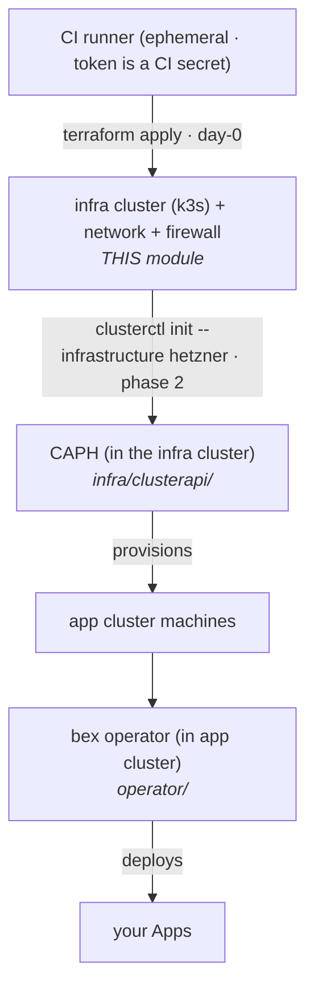

# infra/terraform — the infra-cluster base (idempotent IaC, run by CI)

Day-0 substrate on Hetzner for the **infra (management) cluster** — the one CAPH lives in. Creates: SSH key + private network + firewall + **one small node running single-node k3s**. CAPH (and the app cluster it provisions) come _after_, on top of this k3s.

**Not a one-shot.** State lives in Hetzner Object Storage (remote S3), so `apply` is idempotent: PRs get a `plan`, merges `apply`, a daily schedule re-`plan`s for **drift detection**. Same mental model as Argo for the cluster, one layer lower. It runs in **CI (ephemeral runner), never on a laptop** — see [`.github/workflows/infra.yml`](../../.github/workflows/infra.yml). Locally you need none of this: the dev mock uses a `kind` infra cluster (`infra/local/`).

## Where it sits in the bootstrap chain



The only irreducible "bottom turtle" is the **remote-state bucket** + the CI runner itself. Everything above the first k3s is reconciled (CAPH, Argo, bex).

## Variables (all via `TF_VAR_*` / CI secrets)

| var | default | note |
| --- | --- | --- |
| `hcloud_token` | — (secret) | Hetzner Cloud API token |
| `ssh_public_key` | — (secret) | uploaded as `ssh_key_name`; **reused by CAPH** for app nodes |
| `ssh_key_name` | `bex` | MUST match `sshKeys.hcloud.name` in the CAPH overlay |
| `location` | `fsn1` | match the CAPH overlay's region |
| `bootstrap_server_type` | `cx33` | Intel cx line (3.5x cheaper than cpx for same specs); only CAPI controllers run here |
| `allowed_ssh_cidrs` | `0.0.0.0/0` | **tighten in prod** (CI egress + admin IPs) |

## First-run setup (one-time, out-of-band — the bottom turtle)

1. Create a Hetzner **Object Storage** bucket for state (e.g. `bex-tfstate`).
2. Add the repo secrets listed at the top of `infra.yml`.
3. Open a PR touching `infra/terraform/**` → review the `plan` → merge → CI applies.

## Phase 2 — install CAPH and build the app cluster (next, also CI)

After this module makes the k3s infra cluster, [`.github/workflows/app-cluster.yml`](../../.github/workflows/app-cluster.yml) runs against it:

```
clusterctl init --infrastructure hetzner            # installs CAPH into the infra cluster
kubectl apply -f <sealed hetzner Secret>            # SOPS/sealed-secrets, never plaintext
kubectl apply -f infra/clusterapi/overlays/hetzner-caph/cluster.yaml
# then CNI (Cilium) + Hetzner CCM + hcloud-CSI on the new app cluster
```

`terraform-hcloud-kube-hetzner` is an alternative if you'd rather have a single module build a full HA cluster — but for a single management node, this minimal, transparent module is intentionally simpler.
